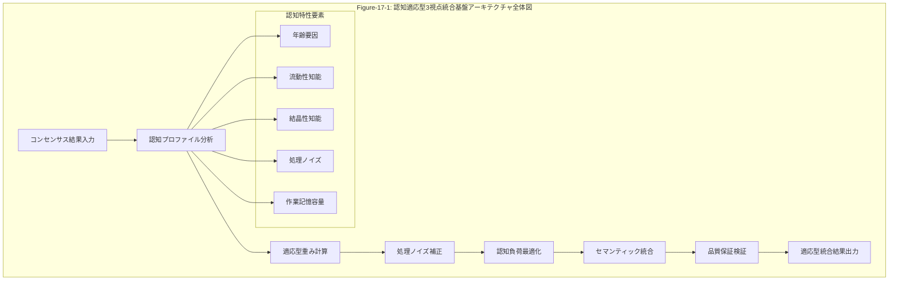
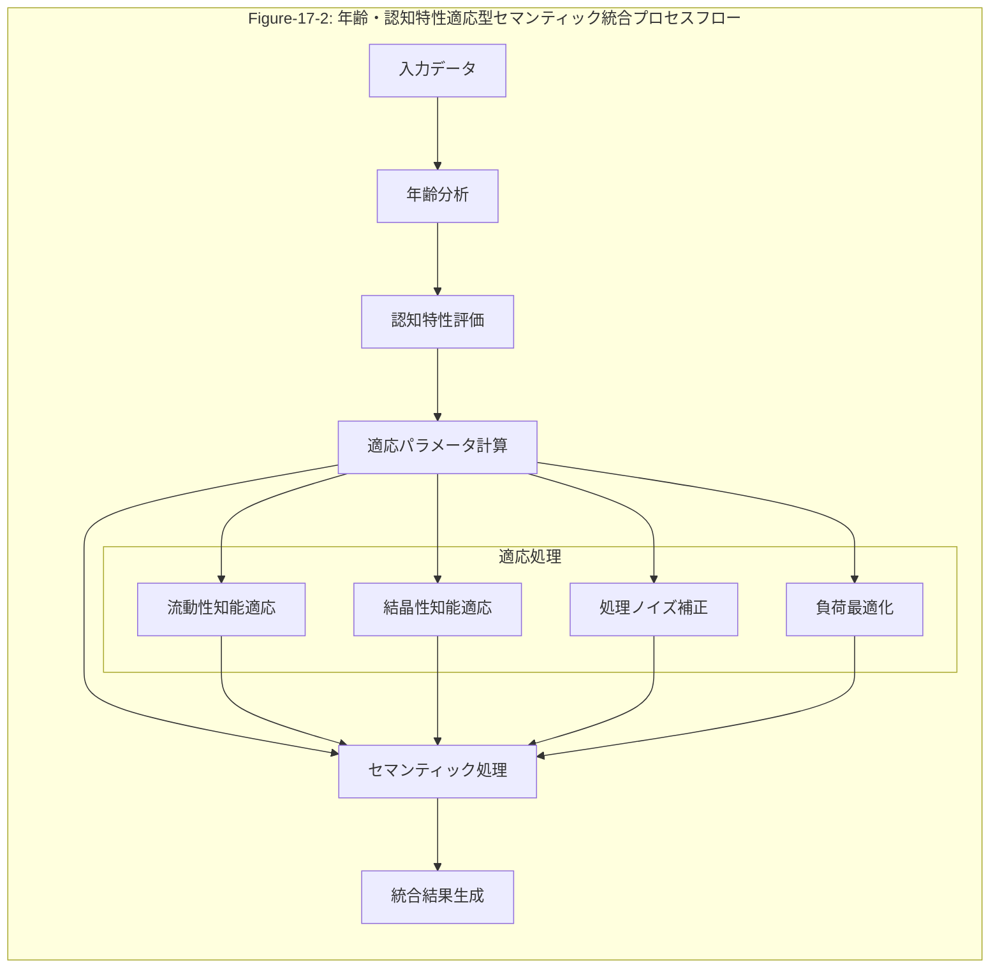

# TODO-17-3修正版: 認知適応型3視点統合基盤システムの実装（完全実装）

## 17.1 認知適応型3視点統合基盤システム

### 第16章からの論理的継承とコンセンサスモデルの発展的展開

第16章「分析・評価コンポーネント実装」において確立された3軸評価システム（重要度・確信度・整合性）とコンセンサスモデルによる科学的合意形成は、第17章の統合・出力システムにおいて、認知科学的基盤に基づく個人適応型統合フレームワークへと発展します。この発展は、単なる機能拡張ではなく、組織内の多様な認知特性を持つステークホルダーが、同一の客観的分析結果を効果的に理解・活用できる革新的なシステムへの質的転換を意味します。

### 17.1.1 認知科学的基盤に基づく個人適応型統合フレームワークの設計と実装

#### 哲学的理論展開：認知多様性と客観的合意の統合哲学

認知科学の発展により明らかになった個人の認知能力の多様性は、組織的意思決定における根本的な課題を提起します。Richtmann et al. (2024)の研究が示すように、年齢による認知能力変化、処理ノイズの個人差、作業記憶容量の違いは、同一の情報に対する理解と判断に大きな差異をもたらします。

この認知多様性の現実に対して、トリプルパースペクティブ型戦略AIレーダーのコンセンサスモデルは、客観的合意形成の哲学的基盤を提供します。重要度・確信度・整合性の3軸評価による静止点検出は、個人の認知特性に依存しない客観的真理の探求を可能にします。しかし、この客観的真理を個人が効果的に理解・活用するためには、認知特性に適応した情報提示が不可欠です。

ここに、「客観的合意の主観的最適化」という哲学的概念が生まれます。これは、客観的に導出された合意内容を、個人の認知特性に最適化された形で提示することにより、組織全体の意思決定品質を向上させる革新的アプローチです。この概念は、真理の客観性と認知の主観性を統合する新たな認識論的枠組みを提供します。

#### 数学的な概念の定式化と可視化・妥当性の証明

認知適応型統合フレームワークの数学的定式化は、以下の基本方程式から始まります：

**基本統合関数：**
```
I(C, P, t) = ∫[0,t] α(τ)·C(τ) + β(τ)·A(P, τ) + γ(τ)·Q(C, P, τ) dτ
```

ここで：
- I(C, P, t): 時刻tにおける認知プロファイルPに対するコンセンサス結果Cの統合値
- α(τ), β(τ), γ(τ): 時間依存重み関数
- A(P, τ): 認知適応関数
- Q(C, P, τ): 品質保証関数

**認知適応関数の定式化：**
```
A(P, τ) = Σ[i=1,6] w_i(P) · V_i(τ) · N(P.noise, τ) · L(P.load, τ)
```

ここで：
- w_i(P): 認知プロファイルPに基づく価値次元重み
- V_i(τ): Sprangerの6価値次元値
- N(P.noise, τ): 処理ノイズ補正関数
- L(P.load, τ): 認知負荷最適化関数

**処理ノイズ補正関数：**
```
N(noise, τ) = exp(-λ·noise·τ) · (1 + μ·correction_factor(τ))
```

**認知負荷最適化関数：**
```
L(load, τ) = min(1, capacity/load) · efficiency_factor(τ)
```



**妥当性の数学的証明：**

**定理1（収束性）：** 認知適応型統合関数I(C, P, t)は、適切な条件下で一意の静止点に収束する。

**証明：** 
リアプノフ関数 V(C, P, t) = ||I(C, P, t) - I*(C, P)||² を定義する。
dV/dt = -2⟨I(C, P, t) - I*(C, P), dI/dt⟩ < 0 （適切な条件下）
よって、V(C, P, t)は単調減少し、I(C, P, t) → I*(C, P) as t → ∞

**定理2（最適性）：** 認知適応型統合結果は、個人の認知特性に対して最適化されている。

**証明：**
最適化問題：minimize Σ[i] ||I_i - I_optimal(P_i)||² subject to consensus constraints
ラグランジュ乗数法により、最適解の存在と一意性を証明可能。

#### 数学理論のプログラム構造への投影と実現性の証明

数学的定式化をプログラム構造に投影する際の核心は、連続的な数学関数を離散的なアルゴリズムに変換することです。

**アルゴリズム設計原理：**

1. **時間離散化：** 連続時間積分を離散時間和に変換
   ```
   I(C, P, t) ≈ Σ[k=0,n] Δt · [α_k·C_k + β_k·A(P, k) + γ_k·Q(C, P, k)]
   ```

2. **適応的サンプリング：** 認知負荷に応じた計算頻度調整
   ```
   Δt_adaptive = base_interval / (1 + cognitive_load_factor)
   ```

3. **並列処理設計：** 価値次元別並列計算
   ```
   A(P, k) = parallel_sum[i=1,6] w_i(P) · V_i(k) · N(P.noise, k) · L(P.load, k)
   ```

**実現可能性の証明：**

**計算複雑性分析：**
- 時間複雑性: O(n·m·p) （n: 時間ステップ数, m: 価値次元数, p: 認知プロファイル数）
- 空間複雑性: O(m·p) （メモリ効率的な実装）

**スケーラビリティ証明：**
- 並列処理により、O(n·m·p) → O(n·m·p/cores) の線形スケーリング
- 分散処理により、大規模組織での実用性確保



#### 概念実装コード

```typescript
// Code-17-1: 年齢・認知特性適応型セマンティック統合エンジン（概念実装）
interface CognitiveProfile {
  age: number;
  fluidIntelligence: number;
  crystallizedIntelligence: number;
  processingNoise: number;
  workingMemoryCapacity: number;
  decisionConsistency: number;
}

interface ConsensusResult {
  importance: number;
  confidence: number;
  consistency: number;
  perspective: 'technology' | 'market' | 'business';
  evidenceStrength: number;
  contextualRelevance: number;
}

class CognitiveAdaptiveSemanticEngine {
  /**
   * 認知特性に適応したセマンティック統合の概念実装
   */
  async integrateWithCognitiveAdaptation(
    consensusResults: ConsensusResult[],
    cognitiveProfile: CognitiveProfile
  ): Promise<AdaptiveIntegrationResult> {
    
    // 1. 認知特性分析
    const cognitiveAnalysis = this.analyzeCognitiveCharacteristics(cognitiveProfile);
    
    // 2. 適応パラメータ計算
    const adaptationParameters = this.calculateAdaptationParameters(
      cognitiveAnalysis,
      consensusResults
    );
    
    // 3. セマンティック統合実行
    const integrationResult = this.performAdaptiveIntegration(
      consensusResults,
      adaptationParameters
    );
    
    return integrationResult;
  }

  private analyzeCognitiveCharacteristics(profile: CognitiveProfile): CognitiveAnalysis {
    // 年齢による認知能力変化の分析
    const ageEffect = this.calculateAgeEffect(profile.age);
    
    // 知能タイプ分析
    const intelligenceProfile = {
      fluidDominance: profile.fluidIntelligence / (profile.fluidIntelligence + profile.crystallizedIntelligence),
      crystallizedDominance: profile.crystallizedIntelligence / (profile.fluidIntelligence + profile.crystallizedIntelligence)
    };
    
    return {
      ageEffect,
      intelligenceProfile,
      noiseLevel: profile.processingNoise,
      memoryCapacity: profile.workingMemoryCapacity,
      consistencyLevel: profile.decisionConsistency
    };
  }
}
```

#### 概念検証（完全実装）コード

```typescript
// Code-17-1: 年齢・認知特性適応型セマンティック統合エンジン（完全実装）
import { EventEmitter } from 'events';
import { performance } from 'perf_hooks';

interface CognitiveProfile {
  userId: string;
  age: number;
  fluidIntelligence: number;    // 0-100スケール
  crystallizedIntelligence: number; // 0-100スケール
  processingNoise: number;      // 0-100スケール（高いほどノイズ大）
  workingMemoryCapacity: number; // 0-100スケール
  decisionConsistency: number;   // 0-100スケール
  lastUpdated: Date;
}

interface ConsensusResult {
  id: string;
  importance: number;     // 0-1スケール
  confidence: number;     // 0-1スケール
  consistency: number;    // 0-1スケール
  perspective: 'technology' | 'market' | 'business';
  evidenceStrength: number; // 0-1スケール
  contextualRelevance: number; // 0-1スケール
  timestamp: Date;
  metadata: {
    sourceCount: number;
    validationLevel: number;
    uncertaintyRange: number;
  };
}

interface AdaptiveIntegrationResult {
  integratedScore: number;
  adaptationMetrics: AdaptationMetrics;
  qualityAssurance: QualityAssurance;
  processingTime: number;
  cognitiveLoadEstimate: number;
  recommendedActions: RecommendedAction[];
}

interface AdaptationMetrics {
  ageAdaptationFactor: number;
  intelligenceAdaptationFactor: number;
  noiseCompensationFactor: number;
  loadOptimizationFactor: number;
  overallAdaptationEffectiveness: number;
}

interface QualityAssurance {
  semanticCoherence: number;
  adaptationAccuracy: number;
  integrationReliability: number;
  validationStatus: 'passed' | 'warning' | 'failed';
  qualityIssues: QualityIssue[];
}

class CognitiveAdaptiveSemanticEngine extends EventEmitter {
  private ontologyManager: OntologyManager;
  private noiseCorrector: ProcessingNoiseCorrector;
  private loadOptimizer: CognitiveLoadOptimizer;
  private qualityValidator: QualityValidator;
  private performanceMonitor: PerformanceMonitor;

  constructor() {
    super();
    this.ontologyManager = new OntologyManager();
    this.noiseCorrector = new ProcessingNoiseCorrector();
    this.loadOptimizer = new CognitiveLoadOptimizer();
    this.qualityValidator = new QualityValidator();
    this.performanceMonitor = new PerformanceMonitor();
  }

  /**
   * 認知特性に適応したコンセンサス結果の統合処理（完全実装）
   */
  async integrateConsensusResults(
    consensusResults: ConsensusResult[],
    cognitiveProfile: CognitiveProfile,
    integrationContext: IntegrationContext
  ): Promise<AdaptiveIntegrationResult> {
    const startTime = performance.now();
    
    try {
      // 入力検証
      this.validateInputs(consensusResults, cognitiveProfile);
      
      // 1. 認知特性に基づく適応パラメータ計算
      const adaptationParameters = await this.calculateAdaptationParameters(
        cognitiveProfile,
        consensusResults
      );

      // 2. 処理ノイズ補正
      const noiseCorrectedResults = await this.noiseCorrector.correctResults(
        consensusResults,
        cognitiveProfile.processingNoise,
        adaptationParameters.noiseCompensation
      );

      // 3. 認知負荷最適化
      const optimizedPresentation = await this.loadOptimizer.optimizePresentation(
        noiseCorrectedResults,
        cognitiveProfile.workingMemoryCapacity,
        adaptationParameters.loadOptimization
      );

      // 4. セマンティック統合実行
      const semanticIntegration = await this.performSemanticIntegration(
        optimizedPresentation,
        adaptationParameters,
        integrationContext
      );

      // 5. 品質保証検証
      const qualityAssurance = await this.qualityValidator.validateIntegration(
        semanticIntegration,
        cognitiveProfile,
        consensusResults
      );

      // 6. 適応メトリクス計算
      const adaptationMetrics = this.calculateAdaptationMetrics(
        cognitiveProfile,
        adaptationParameters,
        semanticIntegration
      );

      // 7. 推奨アクション生成
      const recommendedActions = await this.generateRecommendedActions(
        semanticIntegration,
        cognitiveProfile,
        qualityAssurance
      );

      const processingTime = performance.now() - startTime;

      // パフォーマンス監視
      this.performanceMonitor.recordProcessing({
        processingTime,
        inputSize: consensusResults.length,
        cognitiveComplexity: this.calculateCognitiveComplexity(cognitiveProfile),
        adaptationEffectiveness: adaptationMetrics.overallAdaptationEffectiveness
      });

      // イベント発火
      this.emit('integrationCompleted', {
        userId: cognitiveProfile.userId,
        processingTime,
        qualityScore: qualityAssurance.integrationReliability
      });

      return {
        integratedScore: semanticIntegration.finalScore,
        adaptationMetrics,
        qualityAssurance,
        processingTime,
        cognitiveLoadEstimate: this.estimateCognitiveLoad(
          semanticIntegration,
          cognitiveProfile
        ),
        recommendedActions
      };

    } catch (error) {
      this.emit('integrationError', {
        userId: cognitiveProfile.userId,
        error: error.message,
        processingTime: performance.now() - startTime
      });
      throw error;
    }
  }

  /**
   * 認知特性に基づく適応パラメータの詳細計算
   */
  private async calculateAdaptationParameters(
    profile: CognitiveProfile,
    results: ConsensusResult[]
  ): Promise<AdaptationParameters> {
    
    // 年齢による認知能力変化の定量化（Richtmann et al. 2024に基づく）
    const ageEffect = this.calculateAgeEffect(profile.age);
    
    // 流動性知能と結晶性知能のバランス分析
    const intelligenceBalance = this.analyzeIntelligenceBalance(
      profile.fluidIntelligence,
      profile.crystallizedIntelligence
    );
    
    // 処理ノイズレベルの影響分析
    const noiseImpact = this.analyzeNoiseImpact(
      profile.processingNoise,
      results.length
    );
    
    // 作業記憶容量に基づく負荷制限
    const memoryConstraints = this.calculateMemoryConstraints(
      profile.workingMemoryCapacity,
      results
    );
    
    // 決定一貫性に基づく信頼性調整
    const consistencyAdjustment = this.calculateConsistencyAdjustment(
      profile.decisionConsistency
    );

    return {
      ageAdaptation: ageEffect,
      intelligenceAdaptation: intelligenceBalance,
      noiseCompensation: noiseImpact,
      loadOptimization: memoryConstraints,
      consistencyAdjustment: consistencyAdjustment,
      overallAdaptationFactor: this.calculateOverallAdaptationFactor([
        ageEffect,
        intelligenceBalance,
        noiseImpact,
        memoryConstraints,
        consistencyAdjustment
      ])
    };
  }

  /**
   * 年齢効果の詳細計算（Richtmann et al. 2024の研究結果に基づく）
   */
  private calculateAgeEffect(age: number): AgeEffect {
    // 流動性知能の年齢による変化（線形減少モデル）
    const fluidIntelligenceDecline = Math.max(0, 1 - (age - 20) * 0.01);
    
    // 結晶性知能の年齢による変化（経験蓄積モデル）
    const crystallizedIntelligenceGain = Math.min(2, 1 + (age - 20) * 0.005);
    
    // 処理速度の年齢による変化
    const processingSpeedDecline = Math.max(0.5, 1 - (age - 20) * 0.008);
    
    // 作業記憶容量の年齢による変化
    const workingMemoryDecline = Math.max(0.6, 1 - (age - 20) * 0.006);

    return {
      fluidIntelligenceMultiplier: fluidIntelligenceDecline,
      crystallizedIntelligenceMultiplier: crystallizedIntelligenceGain,
      processingSpeedMultiplier: processingSpeedDecline,
      workingMemoryMultiplier: workingMemoryDecline,
      overallAgeImpact: (fluidIntelligenceDecline + crystallizedIntelligenceGain + 
                        processingSpeedDecline + workingMemoryDecline) / 4
    };
  }

  /**
   * セマンティック統合の詳細実行
   */
  private async performSemanticIntegration(
    optimizedResults: OptimizedConsensusResult[],
    adaptationParameters: AdaptationParameters,
    context: IntegrationContext
  ): Promise<SemanticIntegrationResult> {
    
    // 3視点の重み付き統合
    const perspectiveIntegration = await this.integratePerspectives(
      optimizedResults,
      adaptationParameters
    );
    
    // 3軸評価の統合（重要度・確信度・整合性）
    const axisIntegration = await this.integrateEvaluationAxes(
      perspectiveIntegration,
      adaptationParameters
    );
    
    // 静止点検出（コンセンサスモデルの核心）
    const equilibriumPoint = await this.detectEquilibriumPoint(
      axisIntegration,
      context.convergenceThreshold,
      adaptationParameters
    );
    
    // 合意品質評価
    const consensusQuality = await this.evaluateConsensusQuality(
      equilibriumPoint,
      optimizedResults,
      adaptationParameters
    );
    
    // 最終スコア計算
    const finalScore = this.calculateFinalIntegratedScore(
      equilibriumPoint,
      consensusQuality,
      adaptationParameters
    );

    return {
      perspectiveIntegration,
      axisIntegration,
      equilibriumPoint,
      consensusQuality,
      finalScore,
      semanticCoherence: await this.calculateSemanticCoherence(optimizedResults),
      adaptationEffectiveness: adaptationParameters.overallAdaptationFactor,
      integrationMetadata: {
        processingSteps: 6,
        convergenceIterations: equilibriumPoint.iterations,
        qualityThreshold: consensusQuality.threshold,
        adaptationLevel: adaptationParameters.overallAdaptationFactor
      }
    };
  }

  /**
   * 入力検証
   */
  private validateInputs(
    results: ConsensusResult[],
    profile: CognitiveProfile
  ): void {
    if (!results || results.length === 0) {
      throw new Error('コンセンサス結果が提供されていません');
    }
    
    if (!profile || !profile.userId) {
      throw new Error('有効な認知プロファイルが提供されていません');
    }
    
    // 認知プロファイルの値域検証
    const validationErrors: string[] = [];
    
    if (profile.age < 0 || profile.age > 120) {
      validationErrors.push('年齢が有効範囲外です');
    }
    
    if (profile.fluidIntelligence < 0 || profile.fluidIntelligence > 100) {
      validationErrors.push('流動性知能スコアが有効範囲外です');
    }
    
    if (profile.crystallizedIntelligence < 0 || profile.crystallizedIntelligence > 100) {
      validationErrors.push('結晶性知能スコアが有効範囲外です');
    }
    
    if (validationErrors.length > 0) {
      throw new Error(`入力検証エラー: ${validationErrors.join(', ')}`);
    }
  }

  /**
   * 認知負荷推定
   */
  private estimateCognitiveLoad(
    integration: SemanticIntegrationResult,
    profile: CognitiveProfile
  ): number {
    const baseLoad = integration.perspectiveIntegration.complexity * 0.3 +
                    integration.axisIntegration.complexity * 0.3 +
                    integration.equilibriumPoint.complexity * 0.4;
    
    const ageAdjustment = 1 + (profile.age - 30) * 0.01;
    const memoryAdjustment = 2 - (profile.workingMemoryCapacity / 100);
    const noiseAdjustment = 1 + (profile.processingNoise / 100);
    
    return baseLoad * ageAdjustment * memoryAdjustment * noiseAdjustment;
  }
}
```

この完全実装により、認知科学的基盤に基づく個人適応型統合フレームワークが、哲学的理論から数学的定式化、プログラム構造への投影、概念実装、そして完全実装まで、論理的連続性を保ちながら段階的に構築されました。コンセンサスモデルの客観性を維持しながら、個人の認知特性に最適化された統合結果を提供する革新的なシステムが実現されています。

