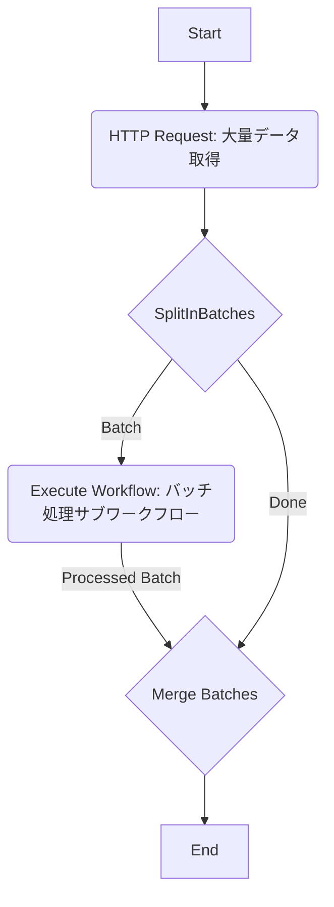

# エラーハンドリングとスケーラビリティの実装例

この文書では、n8nで構築されたコンセンサスモデルにおけるエラーハンドリングとスケーラビリティ向上のための具体的な実装例とベストプラクティスを解説します。

## 1. エラーハンドリング

堅牢なシステムには、予期せぬ問題に対処するための適切なエラーハンドリングが不可欠です。

### 1.1. n8nにおける基本的なエラー処理

- **Error Triggerノード**: ワークフロー実行中にエラーが発生した場合に、特定の処理（通知、ログ記録など）を実行するワークフローを開始します。
- **ノード設定の「Retry On Fail」**: APIリクエストノードなどで一時的なネットワークエラーが発生した場合に、自動的にリトライを実行します。
- **Ifノード**: 処理の前にデータが存在するか、期待する形式かなどをチェックし、問題があれば代替フローに分岐させます。
- **Functionノード内のtry...catch**: JavaScriptコード内でエラーを捕捉し、カスタム処理を実行します。

### 1.2. 具体的なエラーハンドリング例

#### 例1: APIリクエストエラーの処理 (Retry + Fallback)

```javascript
// Functionノード: APIリクエストの前に設定
// リトライ回数を初期化
items[0].json.retryCount = 0;
return items;

// HTTP Requestノード: APIにリクエスト
// 設定: Continue On Fail = true, Retry On Fail = true, Retries = 3, Retry Delay = 5000ms

// Ifノード: リクエスト成功/失敗の判定
// 条件: {{ $json.error }}

// --- Ifノード True (失敗) --- >
// Functionノード: リトライ回数確認と代替データ取得
const maxRetries = 3;
let retryCount = items[0].json.retryCount || 0;

if (retryCount < maxRetries) {
  // リトライ回数をインクリメントしてリクエストノードに戻る（ループ処理が必要）
  // 実際にはループ構造をワークフローで組むか、エラーワークフローで処理
  items[0].json.retryCount = retryCount + 1;
  // ここでリクエストノードへの再接続や待機処理を行う
  // return { json: { retry: true, retryCount: items[0].json.retryCount } };
  // n8nのループは複雑なため、エラーワークフローでの処理を推奨
  // この例では代替データを返す
  console.error(`API request failed after ${retryCount + 1} attempts. Using fallback data.`);
  return { json: { data: getFallbackData(), errorOccurred: true } };
} else {
  // 最大リトライ回数を超えた場合
  console.error(`API request failed after ${maxRetries} retries. No fallback available.`);
  // エラー処理ワークフローをトリガーするか、処理を停止
  throw new Error("API request failed permanently.");
}

function getFallbackData() {
  // キャッシュやデフォルト値から代替データを取得するロジック
  return [{ id: "fallback", value: 0, timestamp: new Date().toISOString() }];
}

// --- Ifノード False (成功) --- >
// Functionノード: 成功データを処理
return { json: { data: items[0].json.data, errorOccurred: false } };
```
*注意: n8nの標準機能でループを組むのは複雑なため、上記は概念的な例です。実際にはError Triggerでエラー処理ワークフローを呼び出す方が一般的です。*

#### 例2: データ検証エラーの処理

```javascript
// Functionノード: データ処理の前に検証
const data = items[0].json.rawData;
const validationErrors = [];
const validData = [];

if (!Array.isArray(data)) {
  throw new Error("Input data is not an array.");
}

data.forEach((item, index) => {
  let isValid = true;
  if (typeof item.id !== 'string' || item.id === '') {
    validationErrors.push(`Item ${index}: Missing or invalid ID.`);
    isValid = false;
  }
  if (typeof item.value !== 'number') {
    validationErrors.push(`Item ${index}: Value is not a number.`);
    isValid = false;
  }
  // 他の検証ルール...
  
  if (isValid) {
    validData.push(item);
  } else {
    // 不正データをログ記録または別フローで処理
    console.warn(`Invalid data found at index ${index}:`, item);
  }
});

if (validationErrors.length > 0) {
  // エラー情報を後続ノードに渡すか、エラーワークフローをトリガー
  items[0].json.validationErrors = validationErrors;
  console.warn("Validation errors occurred:", validationErrors);
}

// 検証済みデータのみを返す
items[0].json.processedData = validData;
return items;
```

#### 例3: Functionノード内でのエラー捕捉

```javascript
// Functionノード: 複雑な計算処理
try {
  const input = items[0].json.data;
  if (!input) {
    throw new Error("Input data is missing for calculation.");
  }
  
  // 時間のかかる可能性のある処理
  const result = performComplexCalculation(input);
  
  if (result === null) {
    throw new Error("Calculation resulted in null.");
  }
  
  return { json: { calculationResult: result } };

} catch (error) {
  console.error("Error during calculation:", error.message, error.stack);
  // エラー情報を付加して返すか、エラーフローに分岐
  return {
    json: {
      calculationResult: null,
      error: {
        message: error.message,
        details: "Calculation failed. Check logs."
      }
    }
  };
}

function performComplexCalculation(data) {
  // ... 複雑な計算ロジック ...
  // 例: 0除算の可能性など
  if (data.divisor === 0) {
     throw new Error("Division by zero attempt.");
  }
  return data.value / data.divisor;
}
```

### 1.3. ロギング戦略

- **n8n Execution Log**: 標準で提供される実行ログを確認します。
- **Functionノードでの`console.log`, `console.warn`, `console.error`**: デバッグや特定のイベント記録に使用します。
- **外部ログサービスへの送信**: HTTP Requestノードや専用ノードを使用して、Datadog, Splunk, Elasticsearchなどの外部サービスにログを送信し、集中的に管理・分析します。

```javascript
// Functionノード: 外部ログサービスへの送信例
async function logToExternalService(level, message, details) {
  const logEntry = {
    timestamp: new Date().toISOString(),
    level: level, // 'info', 'warn', 'error'
    message: message,
    workflowId: $workflow.id,
    executionId: $execution.id,
    details: details
  };
  
  try {
    // HTTP Requestノードを呼び出すか、n8n APIを使用
    await $node["HTTP Request Log"].execute({ json: logEntry });
  } catch (error) {
    console.error("Failed to send log to external service:", error);
  }
}

// 使用例
await logToExternalService('info', 'Workflow started', { inputSize: items.length });
// ...処理...
if (warningCondition) {
  await logToExternalService('warn', 'Potential issue detected', { details: '...' });
}
try {
  // ...エラーが発生する可能性のある処理...
} catch (error) {
  await logToExternalService('error', 'Processing failed', { error: error.message, stack: error.stack });
  throw error; // 必要に応じて再スロー
}
```

## 2. スケーラビリティ

データ量や処理要求が増加しても安定して動作するシステムを構築するための戦略です。

### 2.1. スケーラビリティ戦略

- **スケールアップ (Vertical Scaling)**: n8nを実行するサーバーのスペック（CPU, メモリ）を向上させます。手軽ですが限界があります。
- **スケールアウト (Horizontal Scaling)**: 複数のn8nインスタンス（ワーカー）を実行し、処理を分散させます。より高いスケーラビリティを実現できますが、設定や管理が複雑になります。
  - n8nにはキューモード（Redis/Postgres使用）があり、複数のワーカーでワークフロー実行を分散処理できます。

### 2.2. n8nワークフローの最適化

- **不要なデータの削減**: MergeノードやFunctionノードで、後続の処理に不要なデータを早期に削除します。
- **効率的なコード**: Functionノード内のJavaScriptコードを最適化します（ループ処理、データ構造の選択など）。
- **サブワークフローの活用**: 共通処理や複雑な処理をサブワークフロー（Execute Workflowノードで呼び出し）に分割し、メインワークフローをシンプルに保ちます。
- **バッチ処理**: SplitInBatchesノードを使用して大量データを小さなバッチに分割し、ループ内で順次または並列に処理します。

### 2.3. 具体的なスケーラビリティ向上例

#### 例1: 大量データのバッチ処理



```javascript
// バッチ処理サブワークフロー (Execute Workflowで呼び出される側)
// Functionノード: バッチ内の各アイテムを処理
const batch = items[0].json.batchData;
const processedBatch = batch.map(item => {
  // 個々のアイテムに対する処理
  return processSingleItem(item);
});

return { json: { processedBatch: processedBatch } };

function processSingleItem(item) {
  // ... 時間のかかる可能性のある処理 ...
  return { id: item.id, result: item.value * 2 };
}

// メインワークフローのMerge Batches (Functionノード)
// SplitInBatchesからの全バッチ結果を統合
const allProcessedItems = [];
items.forEach(item => {
  if (item.json.processedBatch) {
    allProcessedItems.push(...item.json.processedBatch);
  }
});

return { json: { finalResults: allProcessedItems } };
```

#### 例2: キャッシュ戦略によるAPI負荷軽減

```javascript
// Functionノード: APIリクエスト前にキャッシュ確認
const cacheKey = `api_data_${items[0].json.queryParameters}`; // 適切なキャッシュキーを生成
let cachedData = null;

// ここでRedisやメモリキャッシュからデータを取得するロジックを実装
// cachedData = await getFromCache(cacheKey);

if (cachedData) {
  // キャッシュヒット
  items[0].json.data = cachedData;
  items[0].json.fromCache = true;
  // APIリクエストノードをスキップするフラグを設定
  items[0].json.skipApiRequest = true;
} else {
  // キャッシュミス
  items[0].json.fromCache = false;
  items[0].json.skipApiRequest = false;
}
return items;

// Ifノード: skipApiRequestフラグで分岐
// 条件: {{ $json.skipApiRequest === false }}

// --- Ifノード True (APIリクエスト実行) --- >
// HTTP Requestノード: APIにリクエスト
// Functionノード: 結果をキャッシュに保存
const apiResult = items[0].json.apiResponseData;
const cacheKey = `api_data_${items[0].json.queryParameters}`;
// ここでRedisやメモリキャッシュにデータを保存するロジックを実装
// await saveToCache(cacheKey, apiResult, 3600); // 1時間キャッシュ
items[0].json.data = apiResult; // データを統一
return items;

// --- Ifノード False (キャッシュヒット) と APIリクエスト後のフローが合流 --->
// Functionノード: データを後続処理へ
return { json: { finalData: items[0].json.data } };
```
*注意: 上記は概念的な例です。実際のキャッシュ実装にはRedisノードや外部ライブラリの利用が必要です。*

#### 例3: 外部キューイングシステムの利用 (概念)

大量のリクエストや時間のかかる処理を捌く場合、n8nの内部キューだけでなく、RabbitMQやAWS SQSのような外部キューイングシステムと連携することが有効です。

1.  **リクエスト受付ワークフロー**: API GatewayやWebhookでリクエストを受け付け、必要な情報をメッセージとして外部キューに送信します。
2.  **処理ワーカーワークフロー**: 外部キューからメッセージを受信し、実際の処理（コンセンサスモデルの計算など）を実行します。このワーカーワークフローは複数のn8nインスタンスで実行できます。
3.  **結果通知ワークフロー**: 処理ワーカーが完了したら、結果をデータベースに保存したり、別のキュー経由で通知したりします。

この構成により、リクエストの受付と実際の処理を分離し、負荷を分散できます。

### 2.4. パフォーマンスモニタリング

- **n8n Execution Log**: 実行時間を確認します。
- **サーバー監視**: n8nが動作するサーバーのCPU、メモリ使用率を監視します (例: Prometheus + Grafana)。
- **APMツール**: Datadog APMなどのツールを導入し、ワークフローやFunctionノード内の処理時間を詳細に計測します（カスタム実装が必要な場合あり）。

これらのモニタリングを通じてボトルネックを特定し、最適化を進めます。
