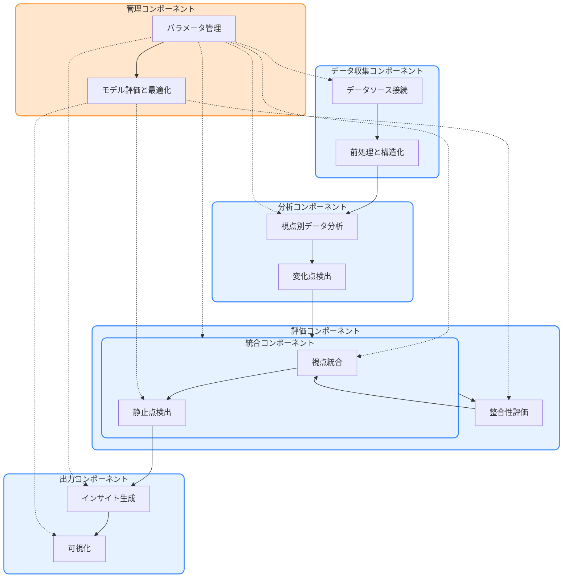

# コンセンサスモデルの実装（パート5：n8nによる全体オーケストレーション）

## コンセンサスモデルの全体アーキテクチャ

トリプルパースペクティブ型戦略AIレーダーのコンセンサスモデルは、複数のコンポーネントが連携して動作する複雑なシステムです。このセクションでは、n8nを活用したコンセンサスモデルの全体オーケストレーションについて解説します。

### システム全体の構成

コンセンサスモデルのシステム全体は、以下のコンポーネントで構成されます：

1. **データ収集コンポーネント**
   - 各視点（テクノロジー、マーケット、ビジネス）のデータソースからデータを収集
   - データの前処理と構造化

2. **分析コンポーネント**
   - 各視点でのデータ分析
   - 変化点検出
   - 重要度・確信度の初期評価

3. **評価コンポーネント**
   - 視点別の重要度・確信度評価
   - 視点間の整合性評価

4. **統合コンポーネント**
   - 視点統合
   - 静止点検出
   - 代替解生成

5. **出力コンポーネント**
   - インサイト生成
   - アクション推奨
   - 可視化

6. **管理コンポーネント**
   - パラメータ管理
   - ルール管理
   - モデル評価と最適化

> **📝 注記**: システム全体のアーキテクチャ図の作成については、[アーキテクチャ図作成のための留意事項](/home/ubuntu/part5_working_files/architecture_diagram_guidelines.md)を参照してください。この文書には、機能的観点、技術的観点、描画観点での詳細な留意点が記載されています。

### コンポーネント間の連携

コンポーネント間の連携は、n8nのワークフロー間の連携によって実現されます。主な連携フローは以下の通りです：

1. **データ収集 → 分析**
   - 収集されたデータが分析コンポーネントに渡される
   - 各視点で独立に分析が実行される

2. **分析 → 評価**
   - 分析結果が評価コンポーネントに渡される
   - 各視点で重要度・確信度が評価される
   - 視点間の整合性が評価される

3. **評価 → 統合**
   - 評価結果が統合コンポーネントに渡される
   - 視点間の統合が行われる
   - 静止点が検出される

4. **統合 → 出力**
   - 統合結果が出力コンポーネントに渡される
   - インサイトが生成される
   - アクションが推奨される
   - 結果が可視化される

5. **管理コンポーネントからの制御**
   - 各コンポーネントのパラメータが管理される
   - モデルの評価と最適化が行われる

以下のフローチャートは、コンポーネント間の連携を視覚的に表現したものです：

## n8nによる全体オーケストレーション

n8nは、コンセンサスモデルの各コンポーネントを連携させ、全体のワークフローを管理するためのプラットフォームとして機能します。このセクションでは、n8nを使用したコンセンサスモデルの実装方法について詳しく解説します。

> **🔰 初心者向け補足**: オーケストレーションという言葉は、元々はオーケストラの指揮者が様々な楽器の演奏を調整して一つの美しい音楽を作り出すことから来ています。システムにおけるオーケストレーションも同じで、n8nは指揮者の役割を果たし、異なるシステムやサービスを連携させて、一つの調和のとれた処理を実現します。詳しくは[初心者向け補足説明](/home/ubuntu/part5_working_files/beginner_guide.md)を参照してください。

### n8nの基本概念

n8nは、ノーコードでワークフロー自動化を実現するオープンソースのプラットフォームです。以下の基本概念を理解することが重要です：

1. **ワークフロー（Workflow）**: 一連の処理フローを表現するもの。複数のノードを接続して構成される。
2. **ノード（Node）**: 個別の処理単位。特定の機能を担当し、入力を受け取って出力を生成する。
3. **トリガー（Trigger）**: ワークフローの実行を開始するきっかけとなるノード。
4. **接続（Connection）**: ノード間のデータの流れを表現するもの。

> **📚 用語解説**: 本文書で使用される専門用語の詳細な説明は、[コンセンサスモデル用語集](/home/ubuntu/part5_working_files/glossary.md)を参照してください。

### n8nワークフローの設計原則

コンセンサスモデルをn8nで実装する際の設計原則は以下の通りです：

1. **モジュール性**: 各コンポーネントを独立したワークフローとして実装し、再利用性と保守性を高める。
2. **データの標準化**: コンポーネント間でやり取りされるデータ形式を標準化し、連携をスムーズにする。
3. **エラーハンドリング**: 各ワークフローでエラー処理を適切に実装し、システムの堅牢性を確保する。
4. **パラメータ管理**: 設定値やしきい値などのパラメータを一元管理し、調整を容易にする。
5. **スケーラビリティ**: データ量や処理要求の増加に対応できる設計を採用する。

> **🛠️ 実装ガイド**: 初心者から上級者まで段階的に実装を進めるための詳細なガイドは、[段階的実装ガイド](/home/ubuntu/part5_working_files/stepwise_implementation_guide.md)を参照してください。

### エラーハンドリングとスケーラビリティ

コンセンサスモデルの実装において、エラーハンドリングとスケーラビリティは特に重要な要素です：

1. **エラーハンドリング**:
   - データ欠損や不正データへの対応
   - API接続エラーのリトライ処理
   - エラーログの記録と通知

2. **スケーラビリティ**:
   - 大量データのバッチ処理
   - キャッシュ戦略の実装
   - 並列処理の活用

> **⚙️ 実装例**: エラーハンドリングとスケーラビリティの具体的な実装例については、[エラーハンドリングとスケーラビリティの実装例](/home/ubuntu/part5_working_files/error_handling_scalability_examples.md)を参照してください。

## データ収集コンポーネントの実装

データ収集コンポーネントは、各視点のデータソースからデータを収集し、前処理と構造化を行います。n8nでの実装方法を解説します。

### データソース接続

各視点のデータソースに接続するためのn8nノードを設定します：

1. **テクノロジー視点**:
   - HTTP Requestノード: 技術トレンドAPIに接続
   - RSS Feedノード: 技術ブログやニュースサイトからフィード取得

2. **マーケット視点**:
   - HTTP Requestノード: 市場データAPIに接続
   - Google Sheetsノード: 市場調査データの取得

3. **ビジネス視点**:
   - HTTP Requestノード: 企業財務データAPIに接続
   - Database（PostgreSQL/MySQL）ノード: 社内データの取得

### データの前処理と構造化

収集したデータを前処理し、標準形式に構造化します：

1. **データクレンジング**:
   - Functionノード: 欠損値の処理、異常値の検出と修正
   - Setノード: データ形式の統一

2. **データ変換**:
   - Functionノード: データ形式の変換、計算処理
   - JSONノード: JSON形式への変換

3. **データ保存**:
   - Writeノード: 処理済みデータをファイルに保存
   - Database（PostgreSQL/MySQL）ノード: データベースへの保存

## 分析コンポーネントの実装

分析コンポーネントは、各視点でのデータ分析と変化点検出を行います。

### 視点別データ分析

各視点でのデータ分析を実装します：

1. **テクノロジー視点の分析**:
   - Functionノード: 技術トレンドの分析ロジック
   - HTTP Requestノード: 外部分析APIの利用（必要に応じて）

2. **マーケット視点の分析**:
   - Functionノード: 市場動向の分析ロジック
   - Spreadsheetノード: 表計算処理

3. **ビジネス視点の分析**:
   - Functionノード: ビジネス指標の分析ロジック
   - Database（PostgreSQL/MySQL）ノード: 複雑なクエリ処理

### 変化点検出

データの変化点を検出するロジックを実装します：

1. **時系列分析**:
   - Functionノード: 移動平均、標準偏差の計算
   - Ifノード: しきい値に基づく変化点の判定

2. **パターン認識**:
   - Functionノード: パターンマッチングアルゴリズム
   - HTTP Requestノード: 外部機械学習APIの利用（必要に応じて）

## 評価コンポーネントの実装

評価コンポーネントは、重要度・確信度の評価と視点間の整合性評価を行います。

### 重要度・確信度評価

各視点での重要度と確信度を評価します：

1. **重要度評価**:
   - Functionノード: 重要度計算アルゴリズム
   - Ifノード: 重要度レベルの判定

2. **確信度評価**:
   - Functionノード: 確信度計算アルゴリズム
   - Ifノード: 確信度レベルの判定

### 整合性評価

視点間の整合性を評価します：

1. **視点間の比較**:
   - Mergeノード: 各視点の評価結果を統合
   - Functionノード: 整合性計算アルゴリズム

2. **整合性スコアの計算**:
   - Functionノード: 整合性スコアの計算
   - Ifノード: 整合性レベルの判定

## 統合コンポーネントの実装

統合コンポーネントは、視点統合と静止点検出を行います。

### 視点統合

複数の視点からの評価結果を統合します：

1. **重み付け統合**:
   - Functionノード: 重み付けアルゴリズム
   - Mergeノード: 重み付け結果の統合

2. **統合スコアの計算**:
   - Functionノード: 統合スコアの計算
   - Setノード: 統合結果の形式設定

### 静止点検出

統合結果から静止点を検出します：

1. **収束判定**:
   - Functionノード: 収束判定アルゴリズム
   - Ifノード: 収束条件の判定

2. **静止点の特定**:
   - Functionノード: 静止点特定アルゴリズム
   - Setノード: 静止点情報の形式設定

## 出力コンポーネントの実装

出力コンポーネントは、インサイト生成と可視化を行います。

### インサイト生成

統合結果からインサイトを生成します：

1. **インサイトテンプレート**:
   - Templateノード: インサイト文章のテンプレート
   - Functionノード: テンプレート変数の設定

2. **アクション推奨**:
   - Functionノード: アクション推奨ロジック
   - Ifノード: 推奨条件の判定

### 可視化

結果を可視化します：

1. **レポート生成**:
   - HTMLノード: HTML形式のレポート生成
   - PDFノード: PDF形式のレポート生成

2. **ダッシュボード表示**:
   - HTTP Requestノード: 可視化APIへのデータ送信
   - Webhookノード: 外部ダッシュボードツールとの連携

## 管理コンポーネントの実装

管理コンポーネントは、パラメータ管理とモデル評価・最適化を行います。

### パラメータ管理

システム全体のパラメータを管理します：

1. **パラメータ設定**:
   - Variablesノード: グローバル変数の設定
   - Functionノード: パラメータ値の動的調整

2. **設定ファイル管理**:
   - Readノード: 設定ファイルの読み込み
   - Writeノード: 設定ファイルの更新

### モデル評価と最適化

モデルの評価と最適化を行います：

1. **パフォーマンス評価**:
   - Functionノード: 評価指標の計算
   - Ifノード: 評価結果に基づく判定

2. **パラメータ最適化**:
   - Functionノード: 最適化アルゴリズム
   - Writeノード: 最適化されたパラメータの保存

## 実装のベストプラクティス

コンセンサスモデルをn8nで実装する際のベストプラクティスを紹介します。

### コード品質と保守性

1. **コメント付け**:
   - 各ノードの目的と処理内容を明記
   - 複雑なロジックには詳細なコメントを追加

2. **命名規則**:
   - 一貫した命名規則の適用
   - 意味のある名前の使用

3. **モジュール化**:
   - 機能ごとにサブワークフローに分割
   - 再利用可能なコンポーネントの作成

### テストと検証

1. **単体テスト**:
   - 各ノードの動作を個別にテスト
   - エッジケースの確認

2. **統合テスト**:
   - ワークフロー全体の動作確認
   - コンポーネント間の連携テスト

3. **本番環境への展開**:
   - ステージング環境でのテスト
   - 段階的なロールアウト

## まとめ

本セクションでは、n8nを活用したコンセンサスモデルの全体オーケストレーションについて解説しました。各コンポーネントの実装方法とその連携について詳細に説明し、実装のベストプラクティスを紹介しました。

n8nの柔軟性と拡張性を活かすことで、複雑なコンセンサスモデルを効率的に実装し、運用することが可能です。システムの要件や規模に応じて、本セクションで紹介した実装方法をカスタマイズして活用してください。

## 参考資料

- n8n公式ドキュメント: https://docs.n8n.io/
- コンセンサスモデルの理論的背景: [パート1〜4の参照]
- APIドキュメント: [各APIの公式ドキュメントへのリンク]
