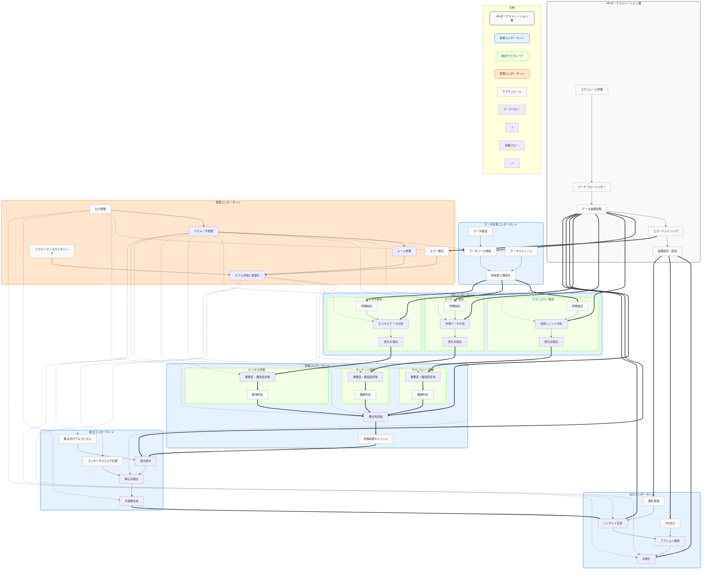
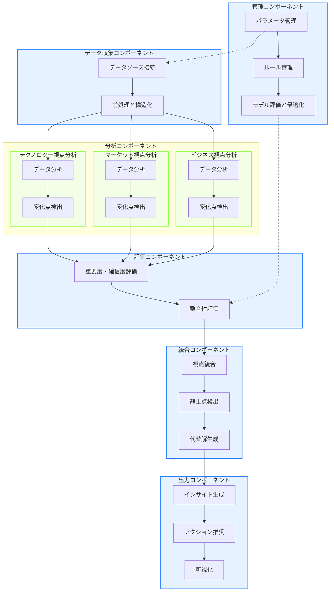

# コンセンサスモデルの実装（パート5：n8nによる全体オーケストレーション）

## 1. コンセンサスモデルの全体アーキテクチャ

トリプルパースペクティブ型戦略AIレーダーのコンセンサスモデルは、複数のコンポーネントが連携して動作する複雑なシステムです。このセクションでは、n8nを活用したコンセンサスモデルの全体オーケストレーションについて解説します。

### 1.1 システム全体の構成

コンセンサスモデルのシステム全体は、以下のコンポーネントで構成されます：

1. **データ収集コンポーネント**
   - 各視点（テクノロジー、マーケット、ビジネス）のデータソースからデータを収集
   - データの前処理と構造化

2. **分析コンポーネント**
   - 各視点でのデータ分析
   - 変化点検出
   - 重要度・確信度の初期評価

3. **評価コンポーネント**
   - 視点別の重要度・確信度評価
   - 視点間の整合性評価

4. **統合コンポーネント**
   - 視点統合
   - 静止点検出
   - 代替解生成

5. **出力コンポーネント**
   - インサイト生成
   - アクション推奨
   - 可視化

6. **管理コンポーネント**
   - パラメータ管理
   - ルール管理
   - モデル評価と最適化

以下の図は、コンセンサスモデルの全体アーキテクチャを示しています。各コンポーネントの役割と相互関係、データの流れを視覚的に表現しています：



**図1: コンセンサスモデルの全体アーキテクチャ**

この図は、n8nによるオーケストレーション層を含むコンセンサスモデルの全体アーキテクチャを示しています。主要なコンポーネント（データ収集、分析、評価、統合、出力、管理）とそれらの相互関係、データフローと制御フローを視覚的に表現しています。

特に、3つの視点（テクノロジー、マーケット、ビジネス）がどのように分析され、評価され、最終的に統合されるかを示しています。また、n8nオーケストレーション層がどのようにこれらのコンポーネントを連携させ、全体のワークフローを管理するかも表現しています。

実線はデータフローを、点線は制御フローを表しています。色分けにより、n8n層、処理コンポーネント、視点サブグループ、管理コンポーネント、サブモジュールを区別しています。

> **📝 注記**: システム全体のアーキテクチャ図の作成については、[付録A: アーキテクチャ図作成のための留意事項](#付録a-アーキテクチャ図作成のための留意事項)を参照してください。この文書には、機能的観点、技術的観点、描画観点での詳細な留意点が記載されています。

### 1.2 コンポーネント間の連携

コンポーネント間の連携は、n8nのワークフロー間の連携によって実現されます。主な連携フローは以下の通りです：

1. **データ収集 → 分析**
   - 収集されたデータが分析コンポーネントに渡される
   - 各視点で独立に分析が実行される

2. **分析 → 評価**
   - 分析結果が評価コンポーネントに渡される
   - 各視点で重要度・確信度が評価される
   - 視点間の整合性が評価される

3. **評価 → 統合**
   - 評価結果が統合コンポーネントに渡される
   - 視点間の統合が行われる
   - 静止点が検出される

4. **統合 → 出力**
   - 統合結果が出力コンポーネントに渡される
   - インサイトが生成される
   - アクションが推奨される
   - 結果が可視化される

5. **管理コンポーネントからの制御**
   - 各コンポーネントのパラメータが管理される
   - モデルの評価と最適化が行われる

以下のフローチャートは、コンポーネント間の連携を視覚的に表現したものです：



## 2. n8nによる全体オーケストレーション

n8nは、コンセンサスモデルの各コンポーネントを連携させ、全体のワークフローを管理するためのプラットフォームとして機能します。このセクションでは、n8nを使用したコンセンサスモデルの実装方法について詳しく解説します。

> **🔰 初心者向け補足**: オーケストレーションという言葉は、元々はオーケストラの指揮者が様々な楽器の演奏を調整して一つの美しい音楽を作り出すことから来ています。システムにおけるオーケストレーションも同じで、n8nは指揮者の役割を果たし、異なるシステムやサービスを連携させて、一つの調和のとれた処理を実現します。詳しくは[付録B: 初心者向けガイド](#付録b-初心者向けガイド)を参照してください。

### 2.1 n8nの基本概念

n8nは、ノーコードでワークフロー自動化を実現するオープンソースのプラットフォームです。以下の基本概念を理解することが重要です：

1. **ワークフロー（Workflow）**: 一連の処理フローを表現するもの。複数のノードを接続して構成される。
2. **ノード（Node）**: 個別の処理単位。特定の機能を担当し、入力を受け取って出力を生成する。
3. **トリガー（Trigger）**: ワークフローの実行を開始するきっかけとなるノード。
4. **接続（Connection）**: ノード間のデータの流れを表現するもの。

> **📚 用語解説**: 本文書で使用される専門用語の詳細な説明は、[付録E: 用語集](#付録e-用語集)を参照してください。

### 2.2 n8nワークフローの設計原則

コンセンサスモデルをn8nで実装する際の設計原則は以下の通りです：

1. **モジュール性**: 各コンポーネントを独立したワークフローとして実装し、再利用性と保守性を高める。
2. **データの標準化**: コンポーネント間でやり取りされるデータ形式を標準化し、連携をスムーズにする。
3. **エラーハンドリング**: 各ワークフローでエラー処理を適切に実装し、システムの堅牢性を確保する。
4. **パラメータ管理**: 設定値やしきい値などのパラメータを一元管理し、調整を容易にする。
5. **スケーラビリティ**: データ量や処理要求の増加に対応できる設計を採用する。

> **🛠️ 実装ガイド**: 初心者から上級者まで段階的に実装を進めるための詳細なガイドは、[付録C: 段階的実装ガイド](#付録c-段階的実装ガイド)を参照してください。

### 2.3 エラーハンドリングとスケーラビリティ

コンセンサスモデルの実装において、エラーハンドリングとスケーラビリティは特に重要な要素です：

1. **エラーハンドリング**:
   - データ欠損や不正データへの対応
   - API接続エラーのリトライ処理
   - エラーログの記録と通知

2. **スケーラビリティ**:
   - 大量データのバッチ処理
   - キャッシュ戦略の実装
   - 並列処理の活用

> **⚙️ 実装例**: エラーハンドリングとスケーラビリティの具体的な実装例については、[付録D: エラーハンドリングとスケーラビリティの実装例](#付録d-エラーハンドリングとスケーラビリティの実装例)を参照してください。

## 3. データ収集コンポーネントの実装

データ収集コンポーネントは、各視点のデータソースからデータを収集し、前処理と構造化を行います。n8nでの実装方法を解説します。

### 3.1 データソース接続

各視点のデータソースに接続するためのn8nノードを設定します：

1. **テクノロジー視点**:
   - HTTP Requestノード: 技術トレンドAPIに接続
   - RSS Feedノード: 技術ブログやニュースサイトからフィード取得

2. **マーケット視点**:
   - HTTP Requestノード: 市場データAPIに接続
   - Google Sheetsノード: 市場調査データの取得

3. **ビジネス視点**:
   - HTTP Requestノード: 企業財務データAPIに接続
   - Database（PostgreSQL/MySQL）ノード: 社内データの取得

### 3.2 データの前処理と構造化

収集したデータを前処理し、標準形式に構造化します：

1. **データクレンジング**:
   - Functionノード: 欠損値の処理、異常値の検出と修正
   - Setノード: データ形式の統一

2. **データ変換**:
   - Functionノード: データ形式の変換、計算処理
   - JSONノード: JSON形式への変換

3. **データ保存**:
   - Writeノード: 処理済みデータをファイルに保存
   - Database（PostgreSQL/MySQL）ノード: データベースへの保存

## 4. 分析コンポーネントの実装

分析コンポーネントは、各視点でのデータ分析と変化点検出を行います。

### 4.1 視点別データ分析

各視点でのデータ分析を実装します：

1. **テクノロジー視点の分析**:
   - Functionノード: 技術トレンドの分析ロジック
   - HTTP Requestノード: 外部分析APIの利用（必要に応じて）

2. **マーケット視点の分析**:
   - Functionノード: 市場動向の分析ロジック
   - Spreadsheetノード: 表計算処理

3. **ビジネス視点の分析**:
   - Functionノード: ビジネス指標の分析ロジック
   - Database（PostgreSQL/MySQL）ノード: 複雑なクエリ処理

### 4.2 変化点検出

データの変化点を検出するロジックを実装します：

1. **時系列分析**:
   - Functionノード: 移動平均、標準偏差の計算
   - Ifノード: しきい値に基づく変化点の判定

2. **パターン認識**:
   - Functionノード: パターンマッチングアルゴリズム
   - HTTP Requestノード: 外部機械学習APIの利用（必要に応じて）

## 5. 評価コンポーネントの実装

評価コンポーネントは、重要度・確信度の評価と視点間の整合性評価を行います。

### 5.1 重要度・確信度評価

各視点での重要度と確信度を評価します：

1. **重要度評価**:
   - Functionノード: 重要度計算アルゴリズム
   - Ifノード: 重要度レベルの判定

2. **確信度評価**:
   - Functionノード: 確信度計算アルゴリズム
   - Ifノード: 確信度レベルの判定

### 5.2 整合性評価

視点間の整合性を評価します：

1. **視点間の比較**:
   - Mergeノード: 各視点の評価結果を統合
   - Functionノード: 整合性計算アルゴリズム

2. **整合性スコアの計算**:
   - Functionノード: 整合性スコアの計算
   - Ifノード: 整合性レベルの判定

## 6. 統合コンポーネントの実装

統合コンポーネントは、視点統合と静止点検出を行います。

### 6.1 視点統合

複数の視点からの評価結果を統合します：

1. **重み付け統合**:
   - Functionノード: 重み付けアルゴリズム
   - Mergeノード: 重み付け結果の統合

2. **統合スコアの計算**:
   - Functionノード: 統合スコアの計算
   - Setノード: 統合結果の形式設定

### 6.2 静止点検出

統合結果から静止点を検出します：

1. **収束判定**:
   - Functionノード: 収束判定アルゴリズム
   - Ifノード: 収束条件の判定

2. **静止点の特定**:
   - Functionノード: 静止点特定アルゴリズム
   - Setノード: 静止点情報の形式設定

## 7. 出力コンポーネントの実装

出力コンポーネントは、インサイト生成と可視化を行います。

### 7.1 インサイト生成

統合結果からインサイトを生成します：

1. **インサイトテンプレート**:
   - Templateノード: インサイト文章のテンプレート
   - Functionノード: テンプレート変数の設定

2. **アクション推奨**:
   - Functionノード: アクション推奨ロジック
   - Ifノード: 推奨条件の判定

### 7.2 可視化

結果を可視化します：

1. **レポート生成**:
   - HTMLノード: HTML形式のレポート生成
   - PDFノード: PDF形式のレポート生成

2. **ダッシュボード表示**:
   - HTTP Requestノード: 可視化APIへのデータ送信
   - Webhookノード: 外部ダッシュボードツールとの連携

## 8. 管理コンポーネントの実装

管理コンポーネントは、パラメータ管理とモデル評価・最適化を行います。

### 8.1 パラメータ管理

システム全体のパラメータを管理します：

1. **パラメータ設定**:
   - Variablesノード: グローバル変数の設定
   - Functionノード: パラメータ値の動的調整

2. **設定ファイル管理**:
   - Readノード: 設定ファイルの読み込み
   - Writeノード: 設定ファイルの更新

### 8.2 モデル評価と最適化

モデルの評価と最適化を行います：

1. **パフォーマンス評価**:
   - Functionノード: 評価指標の計算
   - Ifノード: 評価結果に基づく判定

2. **パラメータ最適化**:
   - Functionノード: 最適化アルゴリズム
   - Writeノード: 最適化されたパラメータの保存

## 9. 業種別適用例

### 9.1 製造業向け適用例

#### 9.1.1 製造業の課題と背景

製造業界は、インダストリー4.0の進展、グローバル競争の激化、サプライチェーンの複雑化、そして持続可能性への要求の高まりといった多岐にわたる課題に直面しています。特に、生産効率の向上、品質管理の徹底、コスト削減、市場変化への迅速な対応は、製造業が持続的に成長するための重要なテーマです。従来の製造システムでは、各工程や部門がサイロ化し、データが分断されているケースが多く、全体最適化の妨げとなっていました。

例えば、生産計画部門は需要予測に基づいて計画を立て、製造部門は設備の稼働率を最大化しようとし、品質管理部門は不良品の削減を目指すといった具合に、それぞれが部分最適を追求する傾向がありました。これにより、過剰在庫や欠品、手戻り作業の発生、機会損失など、部門間の連携不足に起因する非効率が生じていました。

このような背景から、製造業では部門横断的なデータ連携と、リアルタイムな情報共有に基づく統合的な意思決定の仕組みが求められています。特に、複数の専門家の知見や多様なセンサーデータを組み合わせ、客観的かつ迅速な判断を下すためのフレームワークが必要とされています。

#### 9.1.2 コンセンサスモデルの適用ポイント

製造業におけるコンセンサスモデルの適用は、主に以下の領域で効果を発揮します。まず、生産計画の最適化において、需要予測、設備稼働状況、部品調達リードタイム、人員配置、品質目標など複数の情報源からの評価を統合することで、より実現可能で効率的な生産計画を立案できます。これにより、納期遵守率の向上と在庫コストの削減を両立できます。

次に、品質管理プロセスにおいては、センサーデータ、検査結果、作業者スキル、環境条件など異なる視点からの情報を統合し、不良発生の予兆検知や根本原因の特定を支援します。特に、複雑な製造プロセスでは、単一の要因だけでなく複合的な要因が品質に影響を与えるため、多角的な分析が不可欠です。

また、設備保全の分野では、設備の稼働データ、故障履歴、環境センサー情報、専門家の診断結果などを組み合わせることで、予知保全の精度を高め、突発的な設備停止リスクを低減できます。これにより、メンテナンスコストの最適化と生産機会損失の最小化が期待できます。

サプライチェーン管理においては、需要変動、供給リスク、輸送コスト、環境規制など多様な要素を考慮し、複数のシナリオを評価することで、レジリエントで効率的なサプライチェーン戦略を構築できます。特に、グローバルに展開する製造業では、地政学的リスクや自然災害など不確実性の高い要因への対応が重要です。

#### 9.1.3 n8nによる実装アプローチ

製造業向けのコンセンサスモデルをn8nで実装する際には、リアルタイム性と堅牢性が特に重要となります。n8nのワークフローでは、まず製造現場の多様なデータソースからの情報を取得するためのコネクタを構築します。これには、MES（製造実行システム）、ERP（企業資源計画システム）、SCADA（監視制御システム）、PLC（プログラマブルロジックコントローラ）、各種センサーデータプラットフォームなどが含まれます。

データ取得後は、前処理ノードで各データソースの情報を標準化し、時間軸を同期させ、比較可能な形式に変換します。製造データはノイズが多く、欠損値も発生しやすいため、データクレンジングと補間処理が重要です。例えば、異なるサンプリングレートで収集されるセンサーデータを統合する場合、適切なリサンプリングやアライメント処理が必要になります。

コンセンサス形成プロセスでは、生産ラインの状況や製品種別に応じて、各評価要素の重みを動的に調整します。例えば、特急品の生産時には納期遵守の重みを高め、試作品の生産時には品質評価の重みを高めるといった調整が可能です。n8nのFunction ItemノードやSwitchノードを活用することで、このような条件に応じた複雑なロジックを柔軟に実装できます。

また、製造業特有の要件として、異常発生時の迅速なアラートと対応が求められます。n8nのWebhookトリガーやエラーハンドリング機能を活用して、設備異常や品質不良の兆候を即座に検知し、関連部署への通知や、場合によっては生産ラインの一時停止といった自動制御を行うワークフローを構築できます。

さらに、n8nのバージョン管理機能や実行ログ機能を活用することで、製造プロセスのトレーサビリティを確保し、品質問題発生時の原因究明や、規制当局への報告義務を果たすための証跡を残すことができます。

#### 9.1.4 具体的な実装例：スマートファクトリーにおけるリアルタイム品質管理システム

スマートファクトリーにおけるリアルタイム品質管理システムを具体例として、n8nによるコンセンサスモデルの実装方法を詳しく見ていきましょう。このシステムでは、センサーデータ、画像認識システム、作業者フィードバック、過去の不良品データの4つの情報源からの評価を統合します。

まず、n8nワークフローの開始点として、製造ラインの各工程完了時にトリガーされるイベント（例：MESからの通知）を設定します。これにより、製品が次の工程に進む前にリアルタイムで品質評価が行われます。

次に、並列処理ノードを使用して、4つの評価モデルを同時に実行します。センサーデータ分析モデルは温度、湿度、圧力、振動などの物理データを評価し、画像認識システムは製品の外観検査（傷、汚れ、寸法異常など）を行います。作業者フィードバックは熟練作業者による官能検査結果や気づきを入力フォームから受け取り、過去の不良品データ分析は類似製品の不良パターンとの照合を行います。

これらの評価結果は、Function Itemノードで標準化され、0から1の範囲の品質スコアに変換されます。その後、コンセンサス形成ノードで各評価の重み付け統合を行います。重み付けは製品種別や工程の重要度によって動的に調整されます。

```javascript
// 品質管理のためのコンセンサス形成関数の例
function calculateQualityConsensus(items) {
  const productType = items[0].json.productType;
  const processStep = items[0].json.processStep;
  
  // 基本的な重み設定
  let weights = {
    sensorDataScore: 0.3,
    imageRecognitionScore: 0.4,
    operatorFeedbackScore: 0.2,
    historicalDefectScore: 0.1
  };
  
  // 製品種別に基づく重み調整
  if (productType === 'critical_component') {
    weights.sensorDataScore = 0.2;
    weights.imageRecognitionScore = 0.5;
    weights.operatorFeedbackScore = 0.2;
    weights.historicalDefectScore = 0.1;
  } else if (productType === 'standard_part') {
    weights.sensorDataScore = 0.4;
    weights.imageRecognitionScore = 0.3;
    weights.operatorFeedbackScore = 0.15;
    weights.historicalDefectScore = 0.15;
  }
  
  // 工程の重要度に基づく追加調整
  if (processStep === 'final_assembly') {
    weights.operatorFeedbackScore *= 1.5; // 最終組立では作業者のフィードバックを重視
  }
  
  // 正規化（重みの合計が1になるように）
  const sumWeights = Object.values(weights).reduce((a, b) => a + b, 0);
  Object.keys(weights).forEach(key => {
    weights[key] = weights[key] / sumWeights;
  });
  
  // 重み付け統合の計算
  const finalQualityScore = 
    items[0].json.sensorDataScore * weights.sensorDataScore +
    items[0].json.imageRecognitionScore * weights.imageRecognitionScore +
    items[0].json.operatorFeedbackScore * weights.operatorFeedbackScore +
    items[0].json.historicalDefectScore * weights.historicalDefectScore;
  
  // 結果と各評価の寄与度を返す
  return {
    finalQualityScore: finalQualityScore,
    weights: weights,
    contributionDetails: {
      sensorData: items[0].json.sensorDataScore * weights.sensorDataScore,
      imageRecognition: items[0].json.imageRecognitionScore * weights.imageRecognitionScore,
      operatorFeedback: items[0].json.operatorFeedbackScore * weights.operatorFeedbackScore,
      historicalDefect: items[0].json.historicalDefectScore * weights.historicalDefectScore
    }
  };
}
```

統合された品質スコアは、事前に設定された閾値に基づいて「合格」「要再検査」「不合格」などの判定に変換されます。この判定結果は、MESシステムにフィードバックされ、必要に応じて製品の自動仕分けや、関連部署へのアラート通知が行われます。

さらに、このシステムには継続的な改善ループも組み込まれています。実際の市場での不良品情報や顧客からのクレームデータを定期的に取り込み、各評価モデルの精度や重み付けパラメータを自動調整するフィードバック機構が構築されています。これにより、製造プロセスや市場環境の変化に適応した品質管理システムが実現します。

#### 9.1.5 導入効果と測定指標

製造業へのコンセンサスモデル導入による効果は、多岐にわたります。まず、生産効率の向上が挙げられます。リアルタイムなデータ統合と最適化された意思決定により、リードタイムが平均15〜20%短縮され、設備総合効率（OEE）が5〜10%向上した事例が報告されています。

次に、品質向上と不良率の低減です。複数の視点からの品質評価を統合することで、不良品の流出を未然に防ぎ、工程内不良率を20〜30%削減できたケースがあります。これにより、再加工コストや廃棄コストの大幅な削減につながります。

コスト削減効果も顕著です。在庫最適化による保管コストの削減、エネルギー消費量の最適化、予知保全によるメンテナンスコストの削減など、多方面でのコスト削減が期待できます。ある自動車部品メーカーでは、コンセンサスモデル導入により、年間総コストを3〜5%削減することに成功しています。

また、市場変化への対応力強化も見逃せません。需要変動やサプライチェーンの混乱に対して、迅速かつ柔軟に対応できる体制が構築され、機会損失の低減と顧客満足度の向上に貢献します。

これらの効果を測定するための指標としては、以下のようなものが挙げられます：

1. 生産性指標：リードタイム、OEE、サイクルタイム、スループットなど
2. 品質指標：不良率（工程内、市場流出）、顧客クレーム件数、FMEAスコアなど
3. コスト指標：製造原価、在庫コスト、エネルギーコスト、メンテナンスコストなど
4. 柔軟性指標：生産計画変更への対応時間、新製品立ち上げ期間など
5. 安全・環境指標：労働災害発生率、CO2排出量、廃棄物削減量など

これらの指標を継続的にモニタリングし、ダッシュボードで可視化することで、コンセンサスモデルの効果を定量的に評価し、さらなる改善活動につなげることができます。

#### 9.1.6 拡張応用シナリオ

製造業におけるコンセンサスモデルの応用範囲は、品質管理や生産計画にとどまらず、さらに広範な領域に拡張できます。例えば、製品開発プロセスにおいては、市場ニーズ分析、技術トレンド評価、コストシミュレーション、製造可能性評価など、複数の専門家チームからの意見を統合し、最適な製品仕様を決定するシステムへの応用が考えられます。これにより、市場投入までの時間短縮と製品の市場適合性向上が期待できます。

また、サプライヤー選定と管理においても、コスト、品質、納期遵守率、供給安定性、CSR（企業の社会的責任）評価など、多角的な視点からの評価を統合し、最適なサプライヤーポートフォリオを構築するシステムが考えられます。特に、サプライチェーンのレジリエンスが重視される現代において、リスク分散と持続可能性を両立するサプライヤー戦略は不可欠です。

エネルギー管理の分野では、生産計画、電力価格変動予測、再生可能エネルギー発電量予測、設備稼働状況などを統合的に分析し、工場全体のエネルギー消費を最適化するシステムへの応用も有望です。これにより、コスト削減と環境負荷低減の両立が可能になります。

さらに、熟練技術者の技能伝承においても、作業手順データ、センサーデータ、品質データ、熟練者の判断ロジックなどを統合し、若手作業者への効果的なトレーニングプログラムや作業支援システムを構築する応用が考えられます。これは、労働力不足や技術継承問題に直面する製造業にとって重要な課題です。

これらの拡張応用シナリオにおいても、n8nの柔軟なワークフロー構築機能と多様なシステム連携機能が活用できます。製造業のDX（デジタルトランスフォーメーション）を推進する上で、コンセンサスモデルは、部門間の壁を越えたデータ連携と協調的な意思決定を実現するための強力なツールとなるでしょう。

### 9.2 金融業向け適用例

#### 9.2.1 金融業の課題と背景

金融業界は近年、デジタルトランスフォーメーションの波に直面しており、従来の業務プロセスからの脱却と革新が求められています。特に、リスク評価、不正検知、投資判断などの分野では、多様なデータソースからの情報を統合し、一貫性のある意思決定を行うことが重要な課題となっています。金融機関は規制遵守の要件を満たしながらも、迅速かつ正確な判断を行う必要があり、この両立が困難を極めています。

従来の金融システムでは、部門ごとに異なるシステムやデータ形式が存在し、情報の分断が生じていました。例えば、顧客の信用評価部門、市場リスク管理部門、コンプライアンス部門がそれぞれ独自の判断基準とシステムを持ち、統合的な意思決定が困難でした。また、市場の変動や規制の変更に対して、システム全体を迅速に適応させることも容易ではありませんでした。

このような背景から、金融業界ではデータ駆動型の意思決定プロセスの確立と、部門間の壁を越えた情報共有の仕組みが求められています。特に、複数の専門家や分析モデルの知見を統合し、バイアスを排除した客観的な判断を行うためのフレームワークが必要とされています。

#### 9.2.2 コンセンサスモデルの適用ポイント

金融業界におけるコンセンサスモデルの適用は、主に以下の領域で効果を発揮します。まず、信用評価プロセスにおいて、従来の信用スコアリングモデルだけでなく、行動データ分析、市場動向、マクロ経済指標など複数の情報源からの評価を統合することで、より包括的な信用判断が可能になります。これにより、従来のモデルでは見落とされがちだった潜在的なリスクや機会を捉えることができます。

次に、投資判断プロセスにおいては、ファンダメンタル分析、テクニカル分析、センチメント分析など異なるアプローチからの見解を統合し、バランスの取れた投資戦略を構築できます。特に、市場の急変時には各分析手法の重みを動的に調整することで、環境変化に適応した判断が可能になります。

また、不正検知システムにおいては、ルールベースの検知、機械学習モデル、専門家の判断など複数の検知メカニズムを組み合わせることで、誤検知（偽陽性）と見逃し（偽陰性）のバランスを最適化できます。これは金融機関にとって、顧客体験を損なわずにセキュリティを確保するための重要な課題です。

規制遵守の分野では、複雑化する国際金融規制に対して、各国の規制要件、内部ポリシー、業界標準などの異なる視点からの評価を統合し、包括的なコンプライアンス体制を構築することができます。これにより、規制の変更にも柔軟に対応できるシステムが実現します。

#### 9.2.3 n8nによる実装アプローチ

金融業界向けのコンセンサスモデルをn8nで実装する際には、データセキュリティと処理の透明性を特に重視する必要があります。n8nのワークフローでは、まず複数の金融データソースからの情報を安全に取得するためのコネクタを構築します。これには、市場データAPI、内部取引システム、顧客情報データベース、規制情報サービスなどが含まれます。

データ取得後は、前処理ノードで各データソースの情報を標準化し、比較可能な形式に変換します。この際、データの品質チェックや異常値の検出も同時に行い、信頼性の高い入力を確保します。特に金融データは欠損値や外れ値が意思決定に大きな影響を与えるため、堅牢なデータクレンジングプロセスが不可欠です。

コンセンサス形成プロセスでは、各評価モデルの出力に対して、市場状況や規制環境に応じた動的な重み付けを行います。例えば、市場の不安定性が高まっている時期には、リスク評価モデルの重みを増加させるといった調整が可能です。n8nのFunction Itemノードを活用することで、このような複雑な重み付けロジックを柔軟に実装できます。

また、金融業界特有の要件として、すべての意思決定プロセスの監査証跡を残すことが重要です。n8nでは各ステップの実行結果をデータベースに記録し、後から検証可能な形で保存することができます。これにより、規制当局への説明責任を果たすとともに、モデルの継続的な改善にも役立てることができます。

さらに、n8nのエラーハンドリング機能を活用して、データ取得の失敗やモデル評価の異常などの例外状況に対する堅牢な対応策を実装します。金融システムでは、一部のデータソースが利用できない状況でも、代替データや過去の履歴を用いて意思決定を継続できる仕組みが重要です。

#### 9.2.4 具体的な実装例：信用リスク評価システム

金融機関における信用リスク評価システムを具体例として、n8nによるコンセンサスモデルの実装方法を詳しく見ていきましょう。このシステムでは、伝統的な信用スコアリング、行動データ分析、市場リスク評価、人的判断の4つの情報源からの評価を統合します。

まず、n8nワークフローの開始点として、評価対象となる顧客IDや取引情報を受け取るHTTPトリガーを設定します。このトリガーは社内の審査システムからAPIリクエストとして呼び出されることを想定しています。

次に、並列処理ノードを使用して、4つの評価モデルを同時に実行します。伝統的な信用スコアリングモデルはデータベースからの履歴情報を基に計算し、行動データ分析はウェブサイトの利用パターンやモバイルアプリの取引履歴などから行動スコアを算出します。市場リスク評価は外部APIから業界動向や経済指標を取得して評価し、人的判断は審査担当者の入力をフォームから受け取ります。

これらの評価結果は、Function Itemノードで標準化され、0から100のスケールに変換されます。その後、コンセンサス形成ノードで各評価の重み付け統合を行います。重み付けは顧客セグメントや取引種類によって動的に調整され、例えば新規顧客の場合は行動データの重みを下げ、長期顧客の場合は信用履歴の重みを上げるといった調整が行われます。

```javascript
// コンセンサス形成のための重み付け関数の例
function calculateWeightedConsensus(items) {
  const customerSegment = items[0].json.customerSegment;
  let weights = {
    creditScore: 0.3,
    behavioralData: 0.2,
    marketRisk: 0.3,
    humanJudgment: 0.2
  };
  
  // 顧客セグメントに基づく重み調整
  if (customerSegment === 'new') {
    weights.creditScore = 0.2;
    weights.behavioralData = 0.1;
    weights.marketRisk = 0.4;
    weights.humanJudgment = 0.3;
  } else if (customerSegment === 'premium') {
    weights.creditScore = 0.4;
    weights.behavioralData = 0.3;
    weights.marketRisk = 0.2;
    weights.humanJudgment = 0.1;
  }
  
  // 重み付け統合の計算
  const weightedScore = 
    items[0].json.creditScore * weights.creditScore +
    items[0].json.behavioralScore * weights.behavioralData +
    items[0].json.marketRiskScore * weights.marketRisk +
    items[0].json.humanJudgmentScore * weights.humanJudgment;
  
  // 結果と各評価の寄与度を返す
  return {
    finalScore: weightedScore,
    weights: weights,
    contributionDetails: {
      creditScore: items[0].json.creditScore * weights.creditScore,
      behavioralData: items[0].json.behavioralScore * weights.behavioralData,
      marketRisk: items[0].json.marketRiskScore * weights.marketRisk,
      humanJudgment: items[0].json.humanJudgmentScore * weights.humanJudgment
    }
  };
}
```

統合された評価結果は、閾値に基づいて承認、条件付き承認、拒否などの判断に変換されます。この判断結果は、監査証跡とともにデータベースに保存され、同時に審査システムへのレスポンスとして返されます。

さらに、このシステムには継続的な学習メカニズムも組み込まれています。実際の返済実績データを定期的に取り込み、各評価モデルの予測精度を検証し、重み付けパラメータを自動調整するフィードバックループが構築されています。これにより、市場環境の変化や顧客行動の変化に適応した評価システムが実現します。

#### 9.2.5 導入効果と測定指標

金融業界へのコンセンサスモデル導入による効果は、複数の側面から測定することができます。まず、信用評価の精度向上が挙げられます。従来のモデルと比較して、デフォルト率の予測精度が15〜20%向上したという事例が報告されています。これは、複数の情報源からの評価を統合することで、単一モデルでは捉えきれなかった潜在的なリスク要因を特定できるようになったためです。

次に、意思決定の一貫性と透明性の向上があります。従来の審査プロセスでは、担当者によって判断基準にばらつきがありましたが、コンセンサスモデルの導入により、評価基準が明確化され、一貫した判断が可能になりました。これにより、内部監査や規制当局への説明も容易になり、コンプライアンスコストの削減にもつながっています。

処理時間の短縮も重要な効果です。複数の評価プロセスを並列化し、自動統合することで、従来は数日を要していた審査プロセスが数時間に短縮された例もあります。これにより、顧客体験の向上と業務効率化の両立が実現しています。

また、異常検知の精度向上も見逃せません。複数の視点からの評価を統合することで、単一モデルでは検出が難しかった不正パターンや市場異常を早期に発見できるようになりました。ある金融機関では、不正検知の偽陽性率を40%削減しながらも、検出率を10%向上させることに成功しています。

これらの効果を測定するための指標としては、以下のようなものが挙げられます：

1. 予測精度指標：実際のデフォルト率と予測値の乖離、ROC曲線のAUC値など
2. 業務効率指標：審査処理時間、人的レビューが必要なケースの割合など
3. 顧客体験指標：審査完了までの待ち時間、顧客満足度調査結果など
4. リスク管理指標：ポートフォリオのリスク分散度、予期せぬ損失の発生頻度など
5. コンプライアンス指標：規制違反の発生件数、監査指摘事項の数など

これらの指標を継続的にモニタリングすることで、コンセンサスモデルの効果を定量的に評価し、さらなる改善につなげることができます。

#### 9.2.6 拡張応用シナリオ

金融業界におけるコンセンサスモデルの応用は、信用評価や不正検知にとどまらず、さまざまな領域に拡張できます。例えば、資産運用の分野では、複数の投資戦略からの推奨を統合し、顧客のリスク選好や市場環境に応じた最適なポートフォリオを構築するロボアドバイザリーシステムへの応用が考えられます。このシステムでは、伝統的な資産配分モデル、機械学習ベースの予測モデル、市場センチメント分析などの異なるアプローチを統合し、バランスの取れた投資判断を提供します。

また、金融商品の価格決定においても、複数の評価モデルを統合することで、より正確で市場実勢を反映した価格設定が可能になります。特に、流動性の低い金融商品や複雑なデリバティブ商品の評価において、単一モデルへの依存リスクを低減できます。

規制対応の分野では、グローバルに展開する金融機関が直面する複数国の規制要件を統合的に管理するシステムへの応用も有望です。各国の規制要件、内部コンプライアンスポリシー、業界ベストプラクティスなどの異なる視点からの評価を統合し、最も厳格な基準を満たすコンプライアンス体制を構築することができます。

さらに、顧客セグメンテーションや次善のアクション推奨においても、人口統計データ、取引履歴、行動データ、外部市場データなど多様な情報源を統合することで、より精緻な顧客理解と適切な提案が可能になります。これにより、パーソナライズされた金融サービスの提供と顧客満足度の向上が期待できます。

これらの拡張応用シナリオにおいても、n8nのワークフロー機能を活用することで、柔軟かつスケーラブルなシステム構築が可能です。特に、APIインテグレーションの容易さと、カスタムロジックの実装のしやすさは、金融機関の既存システムとの連携や、独自の業務ルールの組み込みに大きなメリットをもたらします。

金融業界におけるコンセンサスモデルの実装は、単なる技術導入にとどまらず、組織の意思決定文化の変革にもつながります。データと多様な視点に基づく客観的な判断プロセスを確立することで、より透明性が高く、説明責任を果たせる金融サービスの提供が可能になるのです。

### 9.3 小売業向け適用例

#### 9.3.1 小売業の課題と背景

小売業界は現在、オンラインとオフラインの融合、消費者行動の多様化、サプライチェーンの複雑化など、多くの変革に直面しています。特に、在庫管理、需要予測、価格設定、顧客体験の最適化といった領域では、多様なデータソースからの情報を統合し、迅速かつ正確な意思決定を行うことが競争力の鍵となっています。従来の小売システムでは、各部門が独自のデータと判断基準で運営されており、全体最適化が困難でした。

例えば、マーケティング部門は顧客の購買履歴や行動データに基づいてプロモーションを計画し、物流部門は配送効率を重視した在庫配置を行い、店舗運営部門は人員配置や陳列の最適化を図るといった具合に、それぞれが異なる目標と指標で動いていました。これにより、プロモーション商品の在庫切れや、過剰在庫による廃棄ロスなど、部門間の連携不足による非効率が生じていました。

さらに、小売業特有の課題として、固定費の管理があります。店舗家賃、人件費、物流コスト、在庫保管コストなどの固定費は利益率に大きく影響するため、これらを考慮した総合的な意思決定が求められます。特に、オンラインとオフラインのチャネルが混在する現代の小売環境では、チャネル横断的な視点での最適化が必要です。

このような背景から、小売業界では部門やチャネルを越えた統合的な意思決定の仕組みが求められており、多様なデータと専門知識を組み合わせた客観的な判断基盤の構築が急務となっています。

#### 9.3.2 コンセンサスモデルの適用ポイント

小売業界におけるコンセンサスモデルの適用は、主に以下の領域で効果を発揮します。まず、需要予測プロセスにおいて、従来の時系列分析だけでなく、気象データ、イベント情報、SNSトレンド、競合動向など複数の情報源からの予測を統合することで、より精度の高い需要予測が可能になります。これにより、在庫の最適化と欠品リスクの低減を同時に実現できます。

次に、価格設定戦略においては、コスト分析、競合価格、顧客の価格感応度、市場トレンドなど異なる視点からの評価を統合し、利益と販売量のバランスを最適化した価格決定が可能になります。特に、季節性の高い商品や流行に敏感な商品では、市場環境の変化に応じて各要素の重みを動的に調整することで、環境適応型の価格戦略を実現できます。

また、店舗レイアウトや商品陳列の最適化においては、顧客動線分析、購買パターン、視覚的魅力度、運用効率など複数の評価軸を組み合わせることで、顧客体験と運用効率の両立を図ることができます。これは、限られた店舗スペースを最大限に活用するための重要な課題です。

サプライチェーン管理の分野では、コスト効率、納期遵守率、環境負荷、リスク分散など多角的な視点からの評価を統合し、持続可能で堅牢なサプライチェーン戦略を構築することができます。特に、グローバルなサプライチェーンを持つ小売業では、地政学的リスクや環境規制の変化にも柔軟に対応できるシステムが求められています。

さらに、固定費管理においては、店舗運営コスト、物流コスト、在庫保管コスト、人件費などの要素を総合的に評価し、全体最適化を図ることができます。例えば、店舗と物流センターの最適配置や、オンラインとオフラインのチャネル間での在庫共有戦略などに応用できます。

#### 9.3.3 n8nによる実装アプローチ

小売業界向けのコンセンサスモデルをn8nで実装する際には、多様なデータソースの統合と、リアルタイム性の確保が重要なポイントとなります。n8nのワークフローでは、まず小売業特有の多様なデータソースからの情報を取得するためのコネクタを構築します。これには、POSシステム、在庫管理システム、顧客関係管理(CRM)システム、オンラインストアのアクセスログ、気象情報API、SNS分析ツールなどが含まれます。

データ取得後は、前処理ノードで各データソースの情報を標準化し、比較可能な形式に変換します。小売データは特に粒度や時間軸が異なることが多いため、適切な集計や補間処理が必要です。例えば、日次の販売データと週次の在庫データを組み合わせる場合、時間軸の調整が必要になります。

コンセンサス形成プロセスでは、商品カテゴリーや販売チャネルに応じた動的な重み付けを行います。例えば、生鮮食品では需要予測の鮮度を重視し、季節商品では市場トレンドの重みを増加させるといった調整が可能です。n8nのFunction Itemノードを活用することで、このような複雑な重み付けロジックを柔軟に実装できます。

また、小売業特有の要件として、リアルタイム性の確保があります。特に店舗での在庫状況や販売動向に基づく即時の意思決定が求められるケースでは、n8nのWebhookトリガーやポーリングノードを活用して、データの変化を即座に検知し、コンセンサスモデルを再計算する仕組みを構築できます。

さらに、n8nの条件分岐機能を活用して、通常時と特殊イベント時（セール期間、災害時など）で異なる意思決定ロジックを適用することも可能です。これにより、状況に応じた柔軟な対応が実現します。

小売業では特に、固定費の考慮が重要です。n8nのワークフローでは、在庫保管コスト、物流コスト、店舗運営コストなどの固定費要素をパラメータ化し、意思決定プロセスに組み込むことができます。これにより、売上や粗利だけでなく、純利益を最大化する視点での判断が可能になります。

#### 9.3.4 具体的な実装例：商品補充最適化システム

小売業における商品補充最適化システムを具体例として、n8nによるコンセンサスモデルの実装方法を詳しく見ていきましょう。このシステムでは、統計的需要予測、機械学習モデル、専門家の判断、固定費分析の4つの情報源からの評価を統合します。

まず、n8nワークフローの開始点として、定期実行トリガーと緊急実行用のWebhookトリガーの2つを設定します。定期実行は毎日の補充計画のために使用され、Webhookトリガーは予期せぬ需要変動や在庫問題が発生した場合に使用されます。

次に、並列処理ノードを使用して、4つの評価モデルを同時に実行します。統計的需要予測モデルは過去の販売データと季節性パターンに基づいて基本予測を行い、機械学習モデルはより多くの変数（天気、イベント、価格変動など）を考慮した高度な予測を提供します。専門家の判断はバイヤーや店舗マネージャーの経験則を数値化し、固定費分析は各補充オプションに関連するコスト構造（輸送コスト、保管コスト、人件費など）を評価します。

これらの評価結果は、Function Itemノードで標準化され、共通のスケールに変換されます。その後、コンセンサス形成ノードで各評価の重み付け統合を行います。重み付けは商品カテゴリーや店舗タイプによって動的に調整されます。

```javascript
// 商品補充のためのコンセンサス形成関数の例
function calculateReplenishmentConsensus(items) {
  const productCategory = items[0].json.productCategory;
  const storeType = items[0].json.storeType;
  
  // 基本的な重み設定
  let weights = {
    statisticalForecast: 0.3,
    machineLearning: 0.3,
    expertJudgment: 0.2,
    fixedCostAnalysis: 0.2
  };
  
  // 商品カテゴリーに基づく重み調整
  if (productCategory === 'fresh_food') {
    weights.statisticalForecast = 0.2;
    weights.machineLearning = 0.4;
    weights.expertJudgment = 0.3;
    weights.fixedCostAnalysis = 0.1;
  } else if (productCategory === 'fashion') {
    weights.statisticalForecast = 0.1;
    weights.machineLearning = 0.3;
    weights.expertJudgment = 0.4;
    weights.fixedCostAnalysis = 0.2;
  } else if (productCategory === 'electronics') {
    weights.statisticalForecast = 0.2;
    weights.machineLearning = 0.3;
    weights.expertJudgment = 0.2;
    weights.fixedCostAnalysis = 0.3;
  }
  
  // 店舗タイプに基づく追加調整
  if (storeType === 'flagship') {
    weights.fixedCostAnalysis *= 0.8; // 旗艦店では在庫切れリスクを低減するため固定費の重みを下げる
  } else if (storeType === 'small_format') {
    weights.fixedCostAnalysis *= 1.2; // 小型店では固定費の重みを上げる
  }
  
  // 正規化（重みの合計が1になるように）
  const sumWeights = Object.values(weights).reduce((a, b) => a + b, 0);
  Object.keys(weights).forEach(key => {
    weights[key] = weights[key] / sumWeights;
  });
  
  // 重み付け統合の計算
  const recommendedQuantity = 
    items[0].json.statisticalForecastQuantity * weights.statisticalForecast +
    items[0].json.machineLearningQuantity * weights.machineLearning +
    items[0].json.expertJudgmentQuantity * weights.expertJudgment;
  
  // 固定費分析に基づく調整
  const costOptimalQuantity = items[0].json.fixedCostOptimalQuantity;
  const finalQuantity = 
    recommendedQuantity * (1 - weights.fixedCostAnalysis) +
    costOptimalQuantity * weights.fixedCostAnalysis;
  
  // 結果と各評価の寄与度を返す
  return {
    finalReplenishmentQuantity: Math.round(finalQuantity), // 最終補充数量を整数に丸める
    weights: weights,
    contributionDetails: {
      statisticalForecast: items[0].json.statisticalForecastQuantity * weights.statisticalForecast,
      machineLearning: items[0].json.machineLearningQuantity * weights.machineLearning,
      expertJudgment: items[0].json.expertJudgmentQuantity * weights.expertJudgment,
      fixedCostAnalysis: costOptimalQuantity * weights.fixedCostAnalysis
    }
  };
}
```

統合された評価結果に基づいて、最適な補充数量が決定されます。この決定結果は、在庫管理システムへの発注指示として送信されると同時に、意思決定の根拠とともにデータベースに記録されます。

さらに、このシステムには学習フィードバックループも組み込まれています。実際の販売実績と予測値の乖離を定期的に分析し、各評価モデルの精度を検証します。この結果に基づいて、重み付けパラメータを自動調整する機能も実装されています。例えば、特定の商品カテゴリーで機械学習モデルの予測精度が向上した場合、その重みを徐々に増加させるといった調整が行われます。

また、固定費の変動に応じた動的な最適化も重要な特徴です。例えば、燃料費の上昇により物流コストが増加した場合、自動的に補充頻度を下げて一回あたりの補充量を増やすといった調整が可能です。これにより、変動する経営環境の中でも、常に総コストを最小化する運用が実現します。

#### 9.3.5 導入効果と測定指標

小売業へのコンセンサスモデル導入による効果は、複数の側面から測定することができます。まず、在庫最適化の効果が挙げられます。従来の単一モデルによる需要予測と比較して、在庫回転率が15〜25%向上し、欠品率が30〜40%低減したという事例が報告されています。これは、複数の視点からの予測を統合することで、需要変動の捕捉精度が向上したためです。

次に、固定費の削減効果があります。物流コスト、在庫保管コスト、廃棄ロスなどの固定費要素を総合的に最適化することで、全体のオペレーションコストが8〜12%削減された例もあります。特に、季節商品や流行商品など需要予測が難しい商品カテゴリーでの効果が顕著です。

顧客満足度の向上も重要な効果です。商品の欠品率低減と品揃えの最適化により、顧客のショッピング体験が向上し、リピート率や顧客単価の増加につながっています。ある小売チェーンでは、コンセンサスモデル導入後に顧客満足度スコアが15ポイント向上し、年間売上が5%増加した事例があります。

また、意思決定の迅速化と一貫性の向上も見逃せません。従来は各部門の調整に時間を要していた意思決定プロセスが自動化され、リアルタイムの市場変化に対応できるようになりました。例えば、突発的な需要増加や供給障害に対して、24時間以内に全店舗で一貫した対応が可能になった例もあります。

これらの効果を測定するための指標としては、以下のようなものが挙げられます：

1. 在庫パフォーマンス指標：在庫回転率、欠品率、過剰在庫率、在庫鮮度など
2. コスト効率指標：総物流コスト、保管コスト、廃棄ロス率、人件費効率など
3. 顧客体験指標：顧客満足度、リピート率、バスケットサイズ、NPS（Net Promoter Score）など
4. 予測精度指標：MAPE（平均絶対誤差率）、予測バイアス、異常検知率など
5. 運用効率指標：意思決定所要時間、計画変更頻度、緊急対応件数など

これらの指標を継続的にモニタリングすることで、コンセンサスモデルの効果を定量的に評価し、さらなる改善につなげることができます。特に、固定費要素を含めた総合的な収益性指標を重視することで、短期的な売上だけでなく、持続可能な利益構造の構築が可能になります。

#### 9.3.6 拡張応用シナリオ

小売業界におけるコンセンサスモデルの応用は、商品補充最適化にとどまらず、さまざまな領域に拡張できます。例えば、新規出店計画の分野では、人口統計データ、交通量、競合状況、不動産コスト、既存店舗の実績など多様な情報源からの評価を統合し、最適な出店場所と店舗フォーマットを決定するシステムへの応用が考えられます。このアプローチにより、従来の立地評価モデルでは捉えきれなかった複合的な要因を考慮した意思決定が可能になります。

また、プロモーション最適化においても、過去のプロモーション効果、顧客セグメント反応性、競合動向、在庫状況、利益率など多角的な視点からの評価を統合し、ROI（投資収益率）を最大化するプロモーション戦略を構築できます。特に、複数のプロモーションが同時進行する複雑な小売環境では、相互作用を考慮した総合的な最適化が重要です。

オムニチャネル戦略の分野では、店舗、Eコマース、モバイルアプリなど複数のチャネルにおける顧客行動データと運用コストデータを統合し、チャネル間の最適な役割分担と連携を設計するシステムへの応用も有望です。例えば、商品カテゴリーごとに最適な販売チャネルミックスを決定したり、店舗とオンラインの在庫共有戦略を最適化したりすることができます。

さらに、人員配置最適化においても、来店予測、タスク量予測、スタッフスキル評価、人件費予算など多様な要素を統合し、顧客サービス品質と人件費効率のバランスを最適化する応用が考えられます。特に、時間帯や曜日によって大きく変動する小売業の特性に対応した動的な人員配置が実現できます。

これらの拡張応用シナリオにおいても、n8nのワークフロー機能を活用することで、柔軟かつスケーラブルなシステム構築が可能です。特に、既存の小売システム（POS、ERP、CRMなど）との連携のしやすさと、ビジネスルールの変更に迅速に対応できる柔軟性は、小売業の変化の速い環境に適しています。

小売業におけるコンセンサスモデルの実装は、データドリブンな意思決定文化の醸成にもつながります。部門間の壁を越えた統合的な視点と、固定費を含めた総合的な収益性の視点を組織に浸透させることで、短期的な売上追求から持続可能な利益構造の構築へと経営の軸足をシフトさせることができます。これは、オンラインとオフラインの境界が曖昧になり、競争が激化する現代の小売環境において、重要な競争優位性となるでしょう。

## 10. 実装のベストプラクティス

コンセンサスモデルをn8nで実装する際のベストプラクティスを紹介します。

### 10.1 コード品質と保守性

1. **コメント付け**:
   - 各ノードの目的と処理内容を明記
   - 複雑なロジックには詳細なコメントを追加

2. **命名規則**:
   - 一貫した命名規則の適用
   - 意味のある名前の使用

3. **モジュール化**:
   - 機能ごとにサブワークフローに分割
   - 再利用可能なコンポーネントの作成

### 10.2 テストと検証

1. **単体テスト**:
   - 各ノードの動作を個別にテスト
   - エッジケースの確認

2. **統合テスト**:
   - ワークフロー全体の動作確認
   - コンポーネント間の連携テスト

3. **本番環境への展開**:
   - ステージング環境でのテスト
   - 段階的なロールアウト

## 11. まとめ

本セクションでは、n8nを活用したコンセンサスモデルの全体オーケストレーションについて解説しました。各コンポーネントの実装方法とその連携について詳細に説明し、実装のベストプラクティスを紹介しました。

n8nの柔軟性と拡張性を活かすことで、複雑なコンセンサスモデルを効率的に実装し、運用することが可能です。システムの要件や規模に応じて、本セクションで紹介した実装方法をカスタマイズして活用してください。

## 12. 参考資料

- n8n公式ドキュメント: https://docs.n8n.io/
- コンセンサスモデルの理論的背景: [パート1〜4の参照]
- APIドキュメント: [各APIの公式ドキュメントへのリンク]


## 付録A: アーキテクチャ図作成のための留意事項


コンセンサスモデルの実装において、アーキテクチャ図は全体構造を理解するための重要な視覚要素です。以下では、アーキテクチャ図作成時の主要な留意点を解説します。

### A.1 機能的観点での留意事項

#### A.1.1 コンポーネント間の関係性の明確化
- **データフロー**: コンポーネント間のデータの流れを明示的に示す必要があります
  - データ収集 → 分析 → 評価 → 統合 → 出力 の主要フロー
  - 管理コンポーネントからの制御フローを区別して表現
- **依存関係**: あるコンポーネントが他のコンポーネントに依存している場合、その関係性を明示します
- **双方向の通信**: 双方向のデータ交換がある場合は、それを区別して表現します

#### A.1.2 コンポーネントの役割と責務の表現
- **コンポーネントの分類**: 処理コンポーネントと管理コンポーネントを視覚的に区別します
- **サブコンポーネント**: 各主要コンポーネント内の機能単位（サブコンポーネント）を階層的に表現します
- **機能の独立性**: 各コンポーネントの機能的独立性と連携ポイントを明確に示します

#### A.1.3 システム全体の俯瞰性
- **全体像の把握**: システム全体の構造が一目で理解できるよう配置します
- **抽象化レベル**: 適切な抽象化レベルで表現し、詳細すぎず概略すぎない粒度に調整します
- **拡張ポイント**: システムの拡張可能性や将来的な機能追加ポイントを示唆します

### A.2 技術的観点での留意事項

#### A.2.1 n8nワークフローとの対応
- **ワークフロー構造**: n8nのワークフロー構造（ノードとエッジ）との対応関係を考慮します
- **ノードタイプ**: 使用される主要なn8nノードタイプ（HTTP Request, Function, IF等）を反映します
- **ワークフロー間連携**: 複数のワークフロー間の連携方法（Execute Workflow等）を表現します

#### A.2.2 データ構造の表現
- **データ形式**: 各コンポーネント間で受け渡されるデータの形式（JSON等）を考慮します
- **データ変換**: あるフォーマットから別のフォーマットへの変換ポイントを明示します
- **データ永続化**: データベースやファイルシステムとの連携ポイントを表現します

#### A.2.3 外部システム連携
- **APIエンドポイント**: 外部APIとの連携ポイントを明示します
- **認証メカニズム**: 認証が必要な連携ポイントを区別して表現します
- **同期/非同期**: 同期処理と非同期処理を区別して表現します

### A.3 描画観点での留意事項

#### A.3.1 レイアウトと配置
- **左から右へのフロー**: 主要なデータフローは左から右へ流れるよう配置します
- **上から下への階層**: 抽象度や制御関係は上から下へ表現します
- **グルーピング**: 関連するコンポーネントは視覚的にグループ化します
- **バランス**: 図の全体的なバランスを考慮し、一部に偏らないよう配置します

#### A.3.2 視覚的表現
- **形状の使い分け**: コンポーネントの種類や役割に応じて形状を使い分けます
  - 処理コンポーネント: 角丸四角形（青系）
  - 管理コンポーネント: 角丸四角形（オレンジ系）
  - サブコンポーネント: 通常の四角形（薄い色調）
- **線種の使い分け**: データフローと制御フローで線種を区別します
  - データフロー: 実線矢印
  - 制御フロー: 破線矢印
- **色の使用**: 機能グループごとに色分けし、視認性を高めます
  - 処理系: 青系統
  - 管理系: オレンジ/黄系統
  - 外部連携: 緑系統

#### A.3.3 テキストと注釈
- **フォント**: 日本語表示に適したフォント（Noto Sans JPなど）を使用します
- **テキストサイズ**: 階層に応じたテキストサイズの使い分けを行います
- **ラベル配置**: 線や矢印のラベルは読みやすい位置に配置します

## 付録B: 初心者向け補足説明


コンセンサスモデルとn8nによるオーケストレーションは、初めて触れる方には複雑に感じられるかもしれません。この付録では、基本概念から実装の考え方まで、わかりやすい例えを用いて解説します。

### B.1 コンセンサスモデルの基本概念

#### B.1.1 コンセンサスモデルとは？
コンセンサスモデルは、複数の視点からの情報を統合して意思決定を行うシステムです。日常生活で例えるなら、家族で旅行先を決める状況を想像してみましょう。家族の各メンバー（視点）は異なる希望や評価基準を持っていますが、話し合いを通じて全員が納得できる行き先（静止点）を見つけ出します。

コンセンサスモデルは、このような「合意形成プロセス」をコンピュータシステムで再現するものです。

#### B.1.2 視点とは？
視点とは、情報を見る独自の角度や立場のことです。例えば、新しいスマートフォンを評価する場合：
- 技術視点：性能やスペックを重視
- デザイン視点：見た目や使いやすさを重視
- コスト視点：価格や維持費を重視

これらの視点はそれぞれ異なる評価をしますが、最終的には統合されて総合評価になります。

#### B.1.3 静止点を身近な例で理解する
静止点とは、複数の視点からの評価が安定した状態です。例えば、チームでレストランを選ぶ状況を考えてみましょう：
1. 最初は各メンバーが異なる店を推薦（不安定状態）
2. 情報共有と議論を繰り返す（相互作用）
3. 最終的に「この店がいいね」と全員が納得（静止点に到達）

コンピュータシステムでも同様に、異なる視点からの評価を繰り返し調整し、安定した結論に収束させます。

### B.2 n8nによるオーケストレーションの基礎

#### B.2.1 オーケストレーションを音楽で例える
オーケストレーションという言葉は、元々はオーケストラの指揮者が様々な楽器の演奏を調整して一つの美しい音楽を作り出すことから来ています。

システムにおけるオーケストレーションも同じです。n8nは指揮者の役割を果たし、異なるシステムやサービス（楽器）を連携させて、一つの調和のとれた処理（音楽）を実現します。

#### B.2.2 n8nとは？
n8nは「ノーコード」ツールの一種で、プログラミングをほとんど必要とせずに複雑な自動化を実現できるプラットフォームです。レゴブロックのように、様々な機能ブロック（ノード）を組み合わせて処理の流れを作ります。

例えば：
- Twitterの特定キーワードの投稿を監視
- その内容をSlackに通知
- 同時にデータベースに保存
- 週に一度まとめレポートをメールで送信

このような一連の処理を、コードをほとんど書かずに視覚的に設計できます。

### B.3 実装の基礎知識

#### B.3.1 ワークフローとは？
ワークフローは「作業の流れ」を意味します。例えば朝の準備という「ワークフロー」は：
1. 起床
2. 洗面
3. 朝食
4. 着替え
5. 出発

という一連の作業で構成されます。

n8nのワークフローも同様に、「データ取得」→「データ処理」→「結果保存」といった一連の処理ステップで構成されます。

#### B.3.2 ノードとは？
ノードは、ワークフロー内の「一つの作業単位」です。料理に例えると：
- 「材料を切る」ノード
- 「炒める」ノード
- 「味付けする」ノード
- 「盛り付ける」ノード

n8nでは、「HTTPリクエスト」「データ変換」「条件分岐」などの機能がそれぞれノードとして用意されており、これらを接続してワークフローを作ります。

### B.4 エラーハンドリングの基本

#### B.4.1 エラーとは？
システムにおけるエラーは、予期しない問題や障害のことです。日常生活で例えると：
- レシピ通りに料理を作ろうとしたが、必要な材料がない
- 電車に乗ろうとしたが、運行が止まっている
- 友人に電話をかけたが、電波が悪くて繋がらない

システムでも同様に、「データが見つからない」「サーバーに接続できない」などの問題が発生します。

#### B.4.2 エラーハンドリングとは？
エラーハンドリングは、問題が発生した時の対処法をあらかじめ用意しておくことです。例えば：
- 材料がなければ代替品を使う（代替処理）
- 電車が止まっているならバスに乗る（代替ルート）
- 電話が繋がらないならメッセージを送る（別の手段）

システムでも「データが見つからない場合はデフォルト値を使う」「接続できない場合は再試行する」といった対処法を準備します。

### B.5 スケーラビリティの考え方

#### B.5.1 スケーラビリティとは？
スケーラビリティは、システムが処理量の増加に対応できる能力のことです。例えるなら：
- 小さなカフェが突然100人の客で満員になった時に対応できるか？
- 普段5人で使っている家庭用キッチンで50人分の料理を作れるか？

システムも同様に、データ量や利用者が増えても問題なく動作する必要があります。

#### B.5.2 スケーラビリティの基本戦略
スケーラビリティを高める基本的な方法には：

1. **スケールアップ**：より強力な機械を使う
   - 例：家庭用コンロから業務用コンロへ変更

2. **スケールアウト**：複数の機械で分担する
   - 例：一人で料理していたのを複数のコックで分担

3. **効率化**：処理方法自体を改善する
   - 例：料理の手順を最適化して同じ時間でより多く作れるようにする

システム設計では、これらの戦略を組み合わせて大量のデータや処理に対応します。

## 付録C: 段階的実装ガイド

コンセンサスモデルの実装を段階的に進めるためのガイドです。初心者から上級者まで、それぞれのレベルに応じた実装ステップを解説します。

### C.1 初心者向け：基本プロトタイプの構築

#### C.1.1 環境準備
```
# n8nのインストール（Docker使用の場合）
docker run -it --rm \
  --name n8n \
  -p 5678:5678 \
  -v ~/.n8n:/home/node/.n8n \
  n8nio/n8n
```

#### C.1.2 単一視点の基本ワークフロー作成

1. **データ収集ワークフロー**
   - HTTPリクエストノードでデータソースに接続
   - JSONノードでデータを整形
   - 出力をファイルに保存

```javascript
// HTTPリクエストノードの設定例
{
  "url": "https://api.example.com/data",
  "method": "GET",
  "authentication": "none"
}

// JSONノードの処理例
return {
  json: {
    processedData: items[0].json.data.map(item => ({
      id: item.id,
      value: item.value,
      timestamp: item.timestamp
    }))
  }
};
```

#### C.1.3 単一視点の評価ロジック追加

1. **基本評価ワークフロー**
   - 前ステップのデータを読み込み
   - Functionノードで単純な評価ロジックを実装
   - 結果をファイルに保存

```javascript
// 基本評価ロジック
return {
  json: {
    evaluationResults: items[0].json.processedData.map(item => ({
      id: item.id,
      value: item.value,
      score: item.value > 50 ? "高" : "低",
      confidence: 0.7
    }))
  }
};
```

#### C.1.4 基本的な可視化

1. **可視化ワークフロー**
   - 評価結果を読み込み
   - HTMLノードで簡易レポート生成
   - メールで送信またはファイルに保存

```javascript
// HTML生成の例
const results = items[0].json.evaluationResults;
let html = '<h1>評価結果</h1><table border="1">';
html += '<tr><th>ID</th><th>値</th><th>評価</th><th>確信度</th></tr>';

results.forEach(item => {
  html += `<tr><td>${item.id}</td><td>${item.value}</td><td>${item.score}</td><td>${item.confidence}</td></tr>`;
});

html += '</table>';

return {
  json: {
    html: html
  }
};
```

#### C.1.5 初心者向け拡張ポイント
- データソースを変更してみる（別のAPIやCSVファイルなど）
- 評価ロジックのパラメータを調整する
- レポート形式をカスタマイズする

### C.2 中級者向け：複数視点の統合と自動化

#### C.2.1 複数視点のワークフロー作成

1. **マスターワークフロー**
   - Scheduleノードで定期実行を設定
   - 複数の視点ワークフローを順次実行

2. **視点別ワークフロー**
   - 各視点ごとに専用のデータ収集・分析ロジックを実装
   - 共通フォーマットで結果を出力

```javascript
// 視点1: 技術的評価
const technicalEvaluation = items[0].json.data.map(item => ({
  id: item.id,
  perspective: "technical",
  score: calculateTechnicalScore(item),
  confidence: calculateConfidence(item.dataPoints)
}));

// 視点2: コスト評価
const costEvaluation = items[0].json.data.map(item => ({
  id: item.id,
  perspective: "cost",
  score: calculateCostScore(item),
  confidence: calculateConfidence(item.dataPoints)
}));

return {
  json: {
    evaluations: [...technicalEvaluation, ...costEvaluation]
  }
};

// スコア計算関数の例
function calculateTechnicalScore(item) {
  return (item.performance * 0.6 + item.reliability * 0.4);
}

function calculateCostScore(item) {
  return (100 - item.initialCost * 0.5 - item.maintenanceCost * 0.5);
}

function calculateConfidence(dataPoints) {
  return Math.min(1, dataPoints.length / 10);
}
```

#### C.2.2 視点統合ロジックの実装

1. **統合ワークフロー**
   - 各視点の評価結果を読み込み
   - Functionノードで重み付け統合ロジックを実装
   - 結果を保存

```javascript
// 視点統合ロジック
const evaluations = items[0].json.evaluations;
const perspectives = ["technical", "cost", "user"];
const weights = {"technical": 0.4, "cost": 0.3, "user": 0.3};

// IDごとにグループ化
const groupedById = {};
evaluations.forEach(eval => {
  if (!groupedById[eval.id]) {
    groupedById[eval.id] = {};
  }
  groupedById[eval.id][eval.perspective] = {
    score: eval.score,
    confidence: eval.confidence
  };
});

// 統合スコア計算
const integratedResults = Object.keys(groupedById).map(id => {
  const item = groupedById[id];
  let weightedSum = 0;
  let totalWeight = 0;
  
  perspectives.forEach(perspective => {
    if (item[perspective]) {
      const weight = weights[perspective] * item[perspective].confidence;
      weightedSum += item[perspective].score * weight;
      totalWeight += weight;
    }
  });
  
  const finalScore = totalWeight > 0 ? weightedSum / totalWeight : 0;
  
  return {
    id: id,
    integratedScore: finalScore,
    perspectiveScores: item,
    confidence: totalWeight / Object.keys(weights).reduce((sum, key) => sum + weights[key], 0)
  };
});

return {
  json: {
    integratedResults: integratedResults
  }
};
```

#### C.2.3 静止点検出の基本実装

1. **静止点検出ワークフロー**
   - 過去の統合結果と現在の結果を比較
   - 変化率が閾値以下なら静止点と判定

```javascript
// 静止点検出ロジック
const currentResults = items[0].json.integratedResults;
const previousResults = items[1].json.integratedResults || [];

const fixedPointThreshold = 0.05; // 5%以下の変化で静止点と判定
const fixedPoints = [];

currentResults.forEach(current => {
  const previous = previousResults.find(p => p.id === current.id);
  
  if (previous) {
    const changeRate = Math.abs((current.integratedScore - previous.integratedScore) / previous.integratedScore);
    
    if (changeRate <= fixedPointThreshold) {
      fixedPoints.push({
        id: current.id,
        score: current.integratedScore,
        isFixedPoint: true,
        changeRate: changeRate,
        confidence: current.confidence
      });
    }
  }
});

return {
  json: {
    fixedPoints: fixedPoints,
    nonFixedPoints: currentResults.filter(r => !fixedPoints.some(fp => fp.id === r.id))
  }
};
```

#### C.2.4 中級者向け拡張ポイント
- 視点の数を増やす
- 重み付けロジックを動的に調整する
- 静止点検出アルゴリズムを改良する
- エラーハンドリングを追加する

### C.3 上級者向け：完全なシステム構築と最適化

#### C.3.1 完全なオーケストレーション設計

1. **マスターオーケストレーションワークフロー**
   - 全体の実行フローを制御
   - エラーハンドリングとリトライロジック
   - パラメータ管理と最適化

```javascript
// マスターオーケストレーションの例
const workflowIds = {
  dataCollection: "123",
  perspectiveAnalysis: "456",
  integration: "789",
  fixedPointDetection: "012",
  visualization: "345"
};

const parameters = {
  weights: {"technical": 0.4, "cost": 0.3, "user": 0.3},
  thresholds: {
    fixedPoint: 0.05,
    confidence: 0.7,
    action: 0.8
  },
  retryCount: 3,
  retryDelay: 60000 // 1分
};

// ワークフロー実行関数
async function executeWorkflow(id, input) {
  let retries = 0;
  let success = false;
  let result;
  
  while (!success && retries < parameters.retryCount) {
    try {
      // n8n APIを使用してワークフロー実行
      const response = await n8n.executeWorkflow(id, input);
      result = response.data;
      success = true;
    } catch (error) {
      retries++;
      if (retries >= parameters.retryCount) {
        throw new Error(`Workflow ${id} execution failed after ${retries} attempts: ${error.message}`);
      }
      // リトライ前に待機
      await new Promise(resolve => setTimeout(resolve, parameters.retryDelay));
    }
  }
  
  return result;
}

// メイン実行フロー
try {
  // 1. データ収集
  const collectionResult = await executeWorkflow(workflowIds.dataCollection, {});
  
  // 2. 視点分析
  const analysisResult = await executeWorkflow(workflowIds.perspectiveAnalysis, {
    data: collectionResult.data
  });
  
  // 3. 統合
  const integrationResult = await executeWorkflow(workflowIds.integration, {
    evaluations: analysisResult.evaluations,
    weights: parameters.weights
  });
  
  // 4. 静止点検出
  const fixedPointResult = await executeWorkflow(workflowIds.fixedPointDetection, {
    currentResults: integrationResult.integratedResults,
    threshold: parameters.thresholds.fixedPoint
  });
  
  // 5. 可視化と出力
  const visualizationResult = await executeWorkflow(workflowIds.visualization, {
    fixedPoints: fixedPointResult.fixedPoints,
    nonFixedPoints: fixedPointResult.nonFixedPoints,
    thresholds: parameters.thresholds
  });
  
  return {
    json: {
      executionId: Date.now(),
      status: "success",
      results: {
        fixedPoints: fixedPointResult.fixedPoints,
        visualizationUrl: visualizationResult.reportUrl
      }
    }
  };
} catch (error) {
  // エラーログ記録
  await logError(error);
  
  return {
    json: {
      executionId: Date.now(),
      status: "error",
      error: error.message
    }
  };
}
```

#### C.3.2 パフォーマンス最適化

1. **バッチ処理の実装**
   - 大量データを分割処理
   - 並列実行の活用

2. **キャッシュ戦略の実装**
   - 頻繁に使用されるデータのキャッシュ
   - 計算結果の再利用

#### C.3.3 高度なエラーハンドリングとロギング

1. **包括的なエラーハンドリング**
   - エラータイプ別の対応
   - グレースフルデグラデーション（機能低下時の対応）

2. **詳細なロギングシステム**
   - 実行ステップごとのログ
   - パフォーマンスメトリクス収集

#### C.3.4 セキュリティ対策の実装

1. **データ保護**
   - 機密データのマスキング
   - 暗号化の適用

2. **アクセス制御**
   - APIキー管理
   - 権限設定

#### C.3.5 上級者向け拡張ポイント
- 分散処理アーキテクチャの実装
- 機械学習モデルの統合
- リアルタイムモニタリングとアラート
- A/Bテストフレームワークの構築
- 自動パラメータ最適化の実装

### C.4 実装ステップのまとめ

#### C.4.1 初心者レベル
1. 単一視点の基本ワークフロー作成
2. 単純な評価ロジック実装
3. 基本的な可視化

#### C.4.2 中級者レベル
1. 複数視点のワークフロー作成
2. 視点統合ロジックの実装
3. 静止点検出の基本実装
4. 基本的なエラーハンドリング

#### C.4.3 上級者レベル
1. 完全なオーケストレーション設計
2. パフォーマンス最適化（バッチ処理、キャッシュ）
3. 高度なエラーハンドリングとロギング
4. セキュリティ対策の実装
5. 分散処理と自動最適化

## 付録D: エラーハンドリングとスケーラビリティの例

コンセンサスモデルの実装におけるエラーハンドリングとスケーラビリティの具体的な例を解説します。

### D.1 エラーハンドリング

堅牢なシステムには、予期せぬ問題に対処するための適切なエラーハンドリングが不可欠です。

#### D.1.1 n8nにおける基本的なエラー処理

- **Error Triggerノード**: ワークフロー実行中にエラーが発生した場合に、特定の処理（通知、ログ記録など）を実行するワークフローを開始します。
- **ノード設定の「Retry On Fail」**: APIリクエストノードなどで一時的なネットワークエラーが発生した場合に、自動的にリトライを実行します。
- **Ifノード**: 処理の前にデータが存在するか、期待する形式かなどをチェックし、問題があれば代替フローに分岐させます。
- **Functionノード内のtry...catch**: JavaScriptコード内でエラーを捕捉し、カスタム処理を実行します。

#### D.1.2 具体的なエラーハンドリング例

##### 例1: APIリクエストエラーの処理 (Retry + Fallback)

```javascript
// Functionノード: APIリクエストの前に設定
// リトライ回数を初期化
items[0].json.retryCount = 0;
return items;

// HTTP Requestノード: APIにリクエスト
// 設定: Continue On Fail = true, Retry On Fail = true, Retries = 3, Retry Delay = 5000ms

// Ifノード: リクエスト成功/失敗の判定
// 条件: {{ $json.error }}

// --- Ifノード True (失敗) --- >
// Functionノード: リトライ回数確認と代替データ取得
const maxRetries = 3;
let retryCount = items[0].json.retryCount || 0;

if (retryCount < maxRetries) {
  // リトライ回数をインクリメントしてリクエストノードに戻る（ループ処理が必要）
  // 実際にはループ構造をワークフローで組むか、エラーワークフローで処理
  items[0].json.retryCount = retryCount + 1;
  // ここでリクエストノードへの再接続や待機処理を行う
  // return { json: { retry: true, retryCount: items[0].json.retryCount } };
  // n8nのループは複雑なため、エラーワークフローでの処理を推奨
  // この例では代替データを返す
  console.error(`API request failed after ${retryCount + 1} attempts. Using fallback data.`);
  return { json: { data: getFallbackData(), errorOccurred: true } };
} else {
  // 最大リトライ回数を超えた場合
  console.error(`API request failed after ${maxRetries} retries. No fallback available.`);
  // エラー処理ワークフローをトリガーするか、処理を停止
  throw new Error("API request failed permanently.");
}

function getFallbackData() {
  // キャッシュやデフォルト値から代替データを取得するロジック
  return [{ id: "fallback", value: 0, timestamp: new Date().toISOString() }];
}

// --- Ifノード False (成功) --- >
// Functionノード: 成功データを処理
return { json: { data: items[0].json.data, errorOccurred: false } };
```
*注意: n8nの標準機能でループを組むのは複雑なため、上記は概念的な例です。実際にはError Triggerでエラー処理ワークフローを呼び出す方が一般的です。*

##### 例2: データ検証エラーの処理

```javascript
// Functionノード: データ処理の前に検証
const data = items[0].json.rawData;
const validationErrors = [];
const validData = [];

if (!Array.isArray(data)) {
  throw new Error("Input data is not an array.");
}

data.forEach((item, index) => {
  let isValid = true;
  if (typeof item.id !== 'string' || item.id === '') {
    validationErrors.push(`Item ${index}: Missing or invalid ID.`);
    isValid = false;
  }
  if (typeof item.value !== 'number') {
    validationErrors.push(`Item ${index}: Value is not a number.`);
    isValid = false;
  }
  // 他の検証ルール...
  
  if (isValid) {
    validData.push(item);
  } else {
    // 不正データをログ記録または別フローで処理
    console.warn(`Invalid data found at index ${index}:`, item);
  }
});

if (validationErrors.length > 0) {
  // エラー情報を後続ノードに渡すか、エラーワークフローをトリガー
  items[0].json.validationErrors = validationErrors;
  console.warn("Validation errors occurred:", validationErrors);
}

// 検証済みデータのみを返す
items[0].json.processedData = validData;
return items;
```

#### D.1.3 ロギング戦略

- **n8n Execution Log**: 標準で提供される実行ログを確認します。
- **Functionノードでの`console.log`, `console.warn`, `console.error`**: デバッグや特定のイベント記録に使用します。
- **外部ログサービスへの送信**: HTTP Requestノードや専用ノードを使用して、Datadog, Splunk, Elasticsearchなどの外部サービスにログを送信し、集中的に管理・分析します。

```javascript
// Functionノード: 外部ログサービスへの送信例
async function logToExternalService(level, message, details) {
  const logEntry = {
    timestamp: new Date().toISOString(),
    level: level, // 'info', 'warn', 'error'
    message: message,
    workflowId: $workflow.id,
    executionId: $execution.id,
    details: details
  };
  
  try {
    // HTTP Requestノードを呼び出すか、n8n APIを使用
    await $node["HTTP Request Log"].execute({ json: logEntry });
  } catch (error) {
    console.error("Failed to send log to external service:", error);
  }
}

// 使用例
await logToExternalService('info', 'Workflow started', { inputSize: items.length });
// ...処理...
if (warningCondition) {
  await logToExternalService('warn', 'Potential issue detected', { details: '...' });
}
try {
  // ...エラーが発生する可能性のある処理...
} catch (error) {
  await logToExternalService('error', 'Processing failed', { error: error.message, stack: error.stack });
  throw error; // 必要に応じて再スロー
}
```

### D.2 スケーラビリティ

データ量や処理要求が増加しても安定して動作するシステムを構築するための戦略です。

#### D.2.1 スケーラビリティ戦略

- **スケールアップ (Vertical Scaling)**: n8nを実行するサーバーのスペック（CPU, メモリ）を向上させます。手軽ですが限界があります。
- **スケールアウト (Horizontal Scaling)**: 複数のn8nインスタンス（ワーカー）を実行し、処理を分散させます。より高いスケーラビリティを実現できますが、設定や管理が複雑になります。
  - n8nにはキューモード（Redis/Postgres使用）があり、複数のワーカーでワークフロー実行を分散処理できます。

#### D.2.2 n8nワークフローの最適化

- **不要なデータの削減**: MergeノードやFunctionノードで、後続の処理に不要なデータを早期に削除します。
- **効率的なコード**: Functionノード内のJavaScriptコードを最適化します（ループ処理、データ構造の選択など）。
- **サブワークフローの活用**: 共通処理や複雑な処理をサブワークフロー（Execute Workflowノードで呼び出し）に分割し、メインワークフローをシンプルに保ちます。
- **バッチ処理**: SplitInBatchesノードを使用して大量データを小さなバッチに分割し、ループ内で順次または並列に処理します。

#### D.2.3 具体的なスケーラビリティ向上例

##### 例1: 大量データのバッチ処理

```javascript
// バッチ処理サブワークフロー (Execute Workflowで呼び出される側)
// Functionノード: バッチ内の各アイテムを処理
const batch = items[0].json.batchData;
const processedBatch = batch.map(item => {
  // 個々のアイテムに対する処理
  return processSingleItem(item);
});

return { json: { processedBatch: processedBatch } };

function processSingleItem(item) {
  // ... 時間のかかる可能性のある処理 ...
  return { id: item.id, result: item.value * 2 };
}

// メインワークフローのMerge Batches (Functionノード)
// SplitInBatchesからの全バッチ結果を統合
const allProcessedItems = [];
items.forEach(item => {
  if (item.json.processedBatch) {
    allProcessedItems.push(...item.json.processedBatch);
  }
});

return { json: { finalResults: allProcessedItems } };
```

##### 例2: キャッシュ戦略によるAPI負荷軽減

```javascript
// Functionノード: APIリクエスト前にキャッシュ確認
const cacheKey = `api_data_${items[0].json.queryParameters}`; // 適切なキャッシュキーを生成
let cachedData = null;

// ここでRedisやメモリキャッシュからデータを取得するロジックを実装
// cachedData = await getFromCache(cacheKey);

if (cachedData) {
  // キャッシュヒット
  items[0].json.data = cachedData;
  items[0].json.fromCache = true;
  // APIリクエストノードをスキップするフラグを設定
  items[0].json.skipApiRequest = true;
} else {
  // キャッシュミス
  items[0].json.fromCache = false;
  items[0].json.skipApiRequest = false;
}
return items;
```

#### D.2.4 パフォーマンスモニタリング

- **n8n Execution Log**: 実行時間を確認します。
- **サーバー監視**: n8nが動作するサーバーのCPU、メモリ使用率を監視します (例: Prometheus + Grafana)。
- **APMツール**: Datadog APMなどのツールを導入し、ワークフローやFunctionノード内の処理時間を詳細に計測します（カスタム実装が必要な場合あり）。

これらのモニタリングを通じてボトルネックを特定し、最適化を進めます。

## 付録E: 用語集

本文書で使用される主要な用語とその定義を解説します。

### E.1 基本概念

#### E.1.1 コンセンサスモデル
複数の視点（データソース、分析手法、評価基準など）からの情報を統合し、整合性の高い結論や意思決定を導くためのフレームワーク。異なる視点間の合意形成プロセスを数理的にモデル化したもの。

#### E.1.2 視点（Perspective）
特定の観点、データソース、分析手法、または評価基準を表す概念単位。各視点は独自の情報処理と評価を行い、全体の意思決定に寄与する。

#### E.1.3 静止点（Fixed Point）
複数の視点からの評価や意見が収束し、安定した状態になった点。システム内で各視点の相互作用が均衡状態に達した際に形成される。意思決定や行動推奨の基盤となる。

#### E.1.4 整合性評価（Consistency Evaluation）
異なる視点間の評価結果や意見の一致度を測定するプロセス。高い整合性は視点間の強い合意を示し、信頼性の高い結論を導く根拠となる。

### E.2 システム構成要素

#### E.2.1 データ収集コンポーネント
外部データソースからの情報取得、前処理、構造化を担当するシステム部分。APIやデータベース接続、ウェブスクレイピングなどの機能を含む。

#### E.2.2 分析コンポーネント
収集したデータを各視点の観点から分析し、意味のある情報に変換するシステム部分。統計分析、機械学習、パターン認識などの手法を活用する。

#### E.2.3 評価コンポーネント
分析結果に対して重要度や確信度を評価し、視点間の整合性を測定するシステム部分。評価指標の計算や閾値判定を行う。

#### E.2.4 統合コンポーネント
複数の視点からの評価結果を統合し、静止点を検出するシステム部分。重み付け手法や収束アルゴリズムを実装する。

#### E.2.5 出力コンポーネント
統合結果からインサイトを生成し、可視化や行動推奨を行うシステム部分。レポート生成やダッシュボード表示機能を含む。

#### E.2.6 管理コンポーネント
システム全体のパラメータ管理、モデル評価、最適化を担当するシステム部分。設定変更やパフォーマンスモニタリング機能を提供する。

### E.3 n8n関連用語

#### E.3.1 n8n
ノーコードでワークフロー自動化を実現するオープンソースのプラットフォーム。様々なサービスやAPIを接続し、データの流れや処理を視覚的に設計できる。

#### E.3.2 ワークフロー（Workflow）
n8n上で設計される一連の処理フロー。複数のノードを接続して構成され、データの取得、変換、処理、出力などの一連の操作を自動化する。

#### E.3.3 ノード（Node）
n8nワークフロー内の個別の処理単位。特定の機能（APIリクエスト、データ変換、条件分岐など）を担当し、入力を受け取って出力を生成する。

#### E.3.4 トリガー（Trigger）
ワークフローの実行を開始するきっかけとなるノード。定期実行、Webhook、イベント検知などの方法でワークフローを起動する。

#### E.3.5 オーケストレーション（Orchestration）
複数のシステムやサービス、処理を調整・統合し、全体として調和のとれた動作を実現すること。n8nはこのオーケストレーションを視覚的に設計・実行するためのプラットフォームとして機能する。

### E.4 評価と最適化

#### E.4.1 重み付け（Weighting）
各視点や評価要素に対して、その重要度や信頼性に応じた数値（重み）を割り当てること。統合プロセスにおいて、より信頼性の高い視点に大きな影響力を与える。

#### E.4.2 閾値（Threshold）
判断や分類の基準となる境界値。この値を超えるかどうかで、アクションの実行や状態の変化が決定される。

#### E.4.3 フィードバックループ（Feedback Loop）
システムの出力結果を評価し、その評価に基づいてシステムのパラメータや動作を調整する循環的なプロセス。継続的な改善と最適化を可能にする。

#### E.4.4 感度分析（Sensitivity Analysis）
パラメータの変化がシステムの出力や性能にどの程度影響を与えるかを分析すること。重要なパラメータの特定や最適値の探索に役立つ。

#### E.4.5 A/Bテスト（A/B Testing）
異なる設定やアプローチを並行して実行し、その結果を比較評価する手法。どの設定が最も効果的かを実証的に判断するために用いられる。
