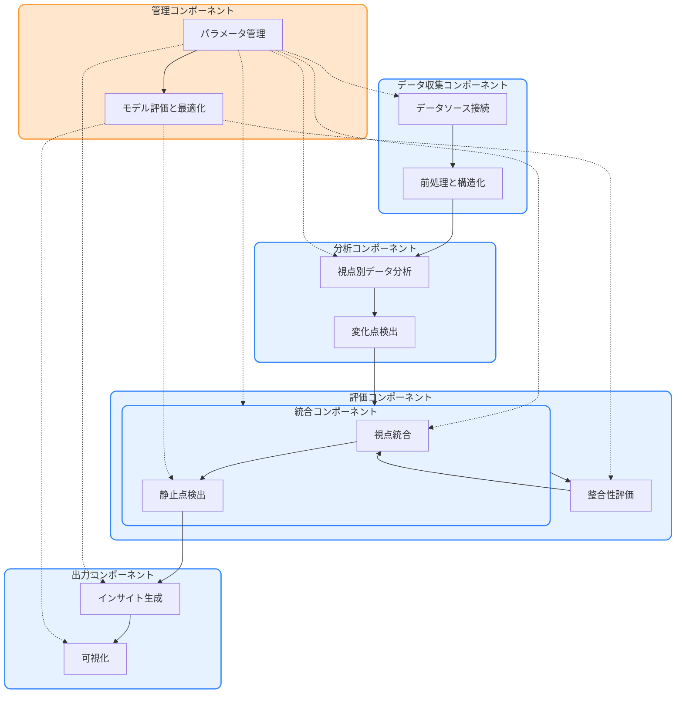

```mermaid
flowchart TD
    %% メインコンポーネント定義
    subgraph DC["データ収集コンポーネント"]
        DS["データソース接続"] --> PP["前処理と構造化"]
    end
    
    subgraph AC["分析コンポーネント"]
        VP["視点別データ分析"] --> CD["変化点検出"]
    end
    
    subgraph EC["評価コンポーネント"]
        IC["重要度・確信度評価"] --> CC["整合性評価"]
    end
    
    subgraph IC["統合コンポーネント"]
        PI["視点統合"] --> FP["静止点検出"]
    end
    
    subgraph OC["出力コンポーネント"]
        IG["インサイト生成"] --> VZ["可視化"]
    end
    
    subgraph MC["管理コンポーネント"]
        PM["パラメータ管理"] --> ME["モデル評価と最適化"]
    end
    
    %% コンポーネント間の連携フロー
    PP --> VP
    CD --> IC
    CC --> PI
    FP --> IG
    
    %% 管理コンポーネントからの制御フロー
    PM -.-> DS
    PM -.-> VP
    PM -.-> IC
    PM -.-> PI
    PM -.-> IG
    ME -.-> CC
    ME -.-> FP
    ME -.-> VZ
    
    %% スタイル設定
    classDef component fill:#e6f2ff,stroke:#3385ff,stroke-width:2px,rx:10px,ry:10px
    classDef management fill:#ffe6cc,stroke:#ff9933,stroke-width:2px,rx:10px,ry:10px
    
    class DC,AC,EC,IC,OC component
    class MC management
```
