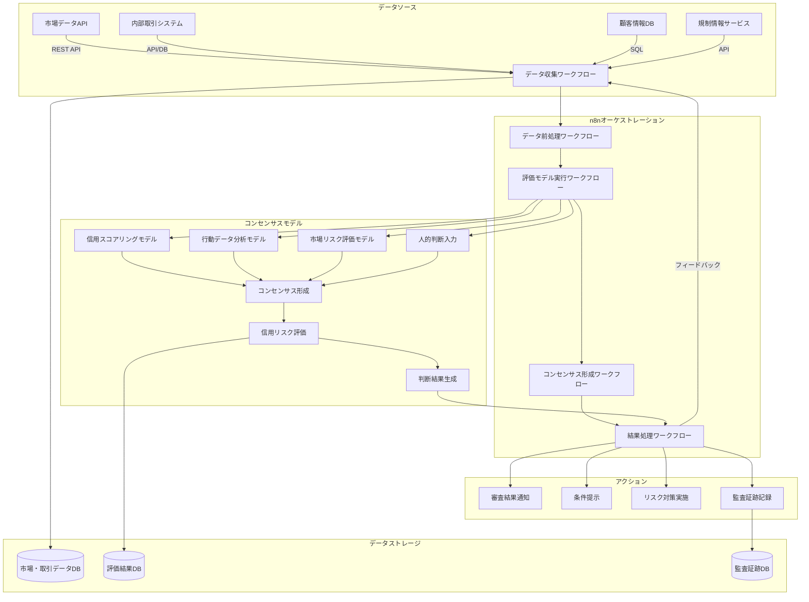

**金融業向けコンセンサスモデル全体アーキテクチャ図**

この図は、金融業におけるコンセンサスモデルの全体アーキテクチャを示しています。左側のデータソース（市場データAPI、内部取引システム、顧客情報DB、規制情報サービス）からデータを収集し、n8nによるオーケストレーションを通じて、複数の評価モデル（信用スコアリング、行動データ分析、市場リスク評価、人的判断）の結果をコンセンサスモデルで統合・評価し、最終的に適切なアクション（審査結果通知、条件提示など）を実行するまでの流れを表現しています。また、各ステップでのデータ保存先も示されています。金融業特有の要素として、監査証跡の記録と規制情報の取り込みが強調されています。
