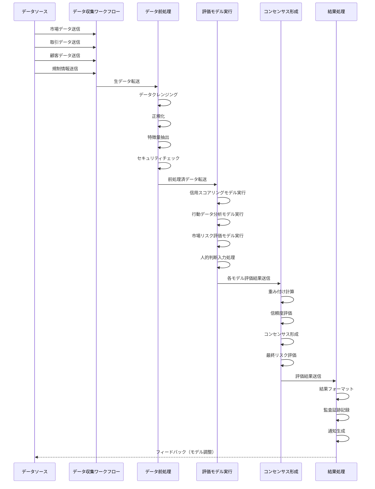

**金融業向けコンポーネント連携フロー図**

この図は、金融業におけるコンセンサスモデルの各コンポーネント間の連携とデータの流れを時系列で示しています。多様なデータソース（市場データ、取引データ、顧客データ、規制情報）からのデータ収集、前処理、複数の評価モデル（信用スコアリング、行動データ分析、市場リスク評価、人的判断）の実行、コンセンサス形成、結果処理までの一連のプロセスが詳細に表現されています。特に、金融業特有の要素として、前処理段階でのセキュリティチェック、コンセンサス形成での信頼度評価、結果処理での監査証跡記録が含まれています。また、結果処理からデータソースへのフィードバックループも示されており、モデルの継続的な調整が可能な設計となっています。
