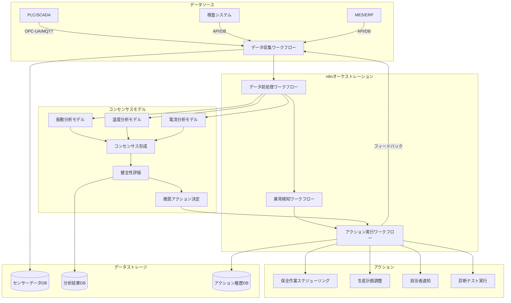

**製造業向けコンセンサスモデル全体アーキテクチャ図**

この図は、製造業におけるコンセンサスモデルの全体アーキテクチャを示しています。左側のデータソース（PLC/SCADA、検査システム、MES/ERP）からデータを収集し、n8nによるオーケストレーションを通じて、コンセンサスモデルで分析・評価を行い、最終的に適切なアクション（保全作業スケジューリング、生産計画調整など）を実行するまでの流れを表現しています。また、各ステップでのデータ保存先も示されています。
