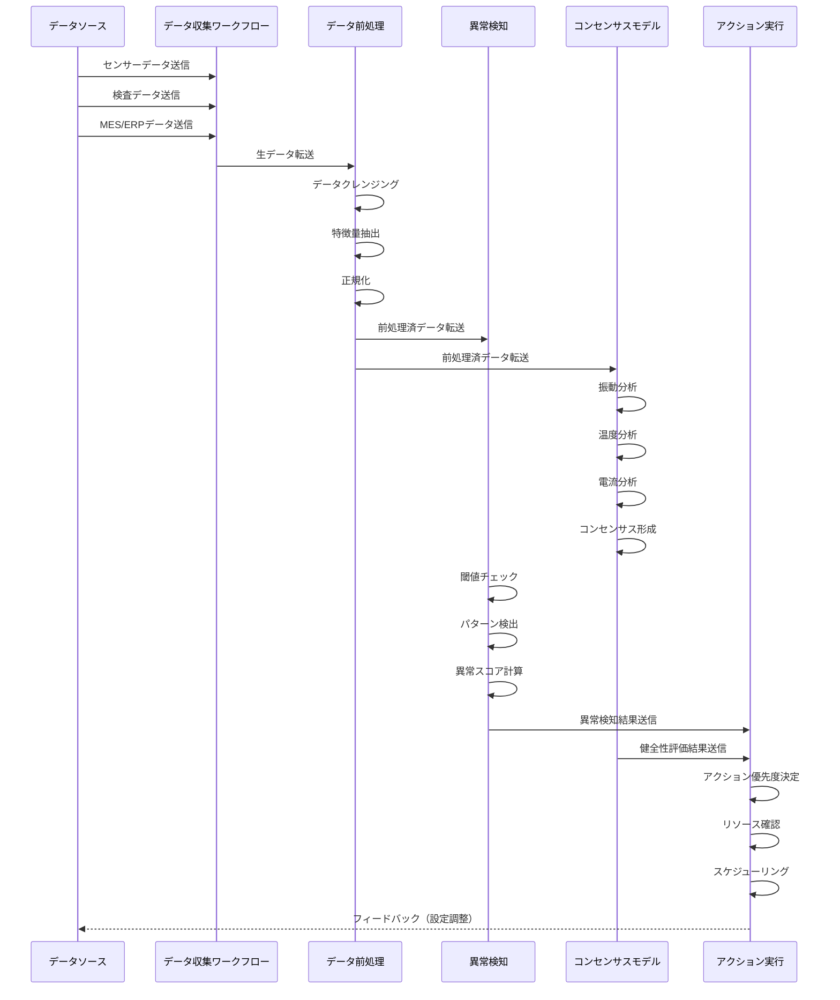

**製造業向けコンポーネント連携フロー図**

この図は、製造業におけるコンセンサスモデルの各コンポーネント間の連携とデータの流れを時系列で示しています。データソースからのデータ収集、前処理、異常検知、コンセンサスモデルによる分析、アクション実行までの一連のプロセスと、各コンポーネント内での処理ステップが詳細に表現されています。特に、データ前処理での3段階の処理（クレンジング、特徴量抽出、正規化）、コンセンサスモデルでの複数の分析（振動、温度、電流）とその統合、アクション実行での優先度決定からスケジューリングまでの流れが明確に示されています。また、アクション実行からデータソースへのフィードバックループも含まれています。
