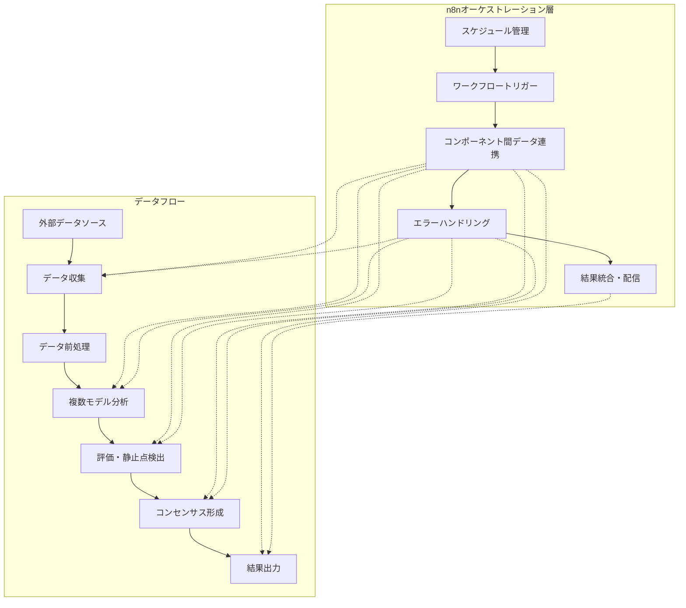

```mermaid
graph TD
    subgraph "n8nオーケストレーション層"
        N1[ワークフロートリガー] --> N2[コンポーネント間データ連携]
        N2 --> N3[エラーハンドリング]
        N3 --> N4[結果統合・配信]
        N5[スケジュール管理] --> N1
    end

    subgraph "データフロー"
        DF1[外部データソース] --> DF2[データ収集]
        DF2 --> DF3[データ前処理]
        DF3 --> DF4[複数モデル分析]
        DF4 --> DF5[評価・静止点検出]
        DF5 --> DF6[コンセンサス形成]
        DF6 --> DF7[結果出力]
    end

    %% コンポーネント間の連携
    N2 -.-> DF2
    N2 -.-> DF4
    N2 -.-> DF5
    N2 -.-> DF6
    N2 -.-> DF7
    N3 -.-> DF2
    N3 -.-> DF4
    N3 -.-> DF5
    N3 -.-> DF6
    N4 -.-> DF7
```
