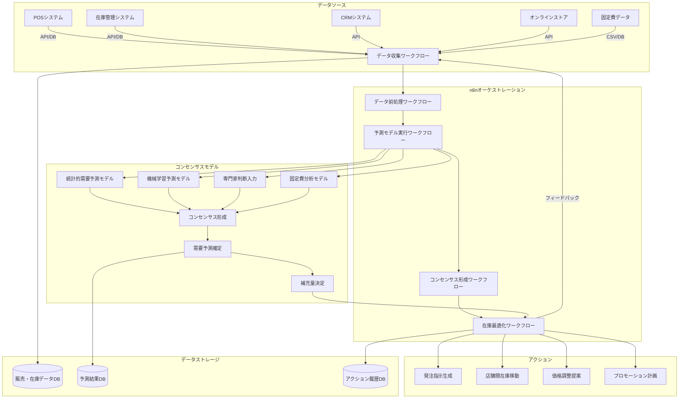

**小売業向けコンセンサスモデル全体アーキテクチャ図**

この図は、小売業におけるコンセンサスモデルの全体アーキテクチャを示しています。左側のデータソース（POSシステム、在庫管理システム、CRMシステム、オンラインストア、固定費データ）からデータを収集し、n8nによるオーケストレーションを通じて、複数の予測モデル（統計的需要予測、機械学習予測、専門家判断、固定費分析）の結果をコンセンサスモデルで統合・評価し、最終的に適切なアクション（発注指示生成、店舗間在庫移動など）を実行するまでの流れを表現しています。また、各ステップでのデータ保存先も示されています。小売業特有の要素として、固定費データの分析と店舗間在庫移動が強調されています。
