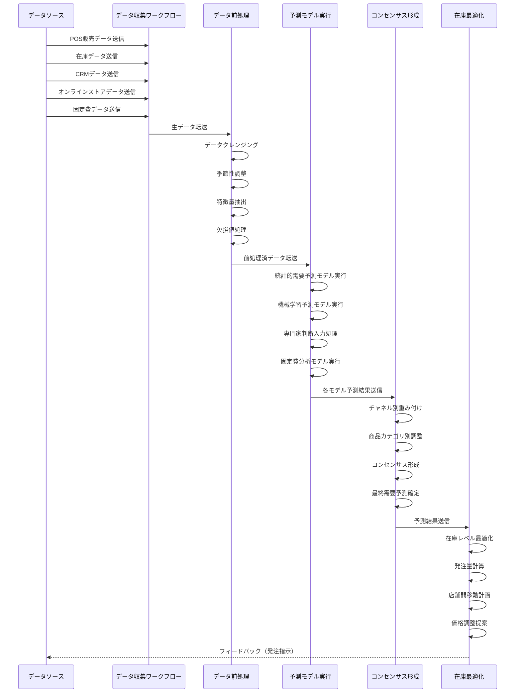

**小売業向けコンポーネント連携フロー図**

この図は、小売業におけるコンセンサスモデルの各コンポーネント間の連携とデータの流れを時系列で示しています。多様なデータソース（POS販売データ、在庫データ、CRMデータ、オンラインストアデータ、固定費データ）からのデータ収集、前処理、複数の予測モデル（統計的需要予測、機械学習予測、専門家判断、固定費分析）の実行、コンセンサス形成、在庫最適化までの一連のプロセスが詳細に表現されています。特に、小売業特有の要素として、前処理段階での季節性調整、コンセンサス形成でのチャネル別重み付けと商品カテゴリ別調整、在庫最適化での店舗間移動計画と価格調整提案が含まれています。また、在庫最適化からデータソースへのフィードバックループも示されており、発注指示の自動化が可能な設計となっています。
