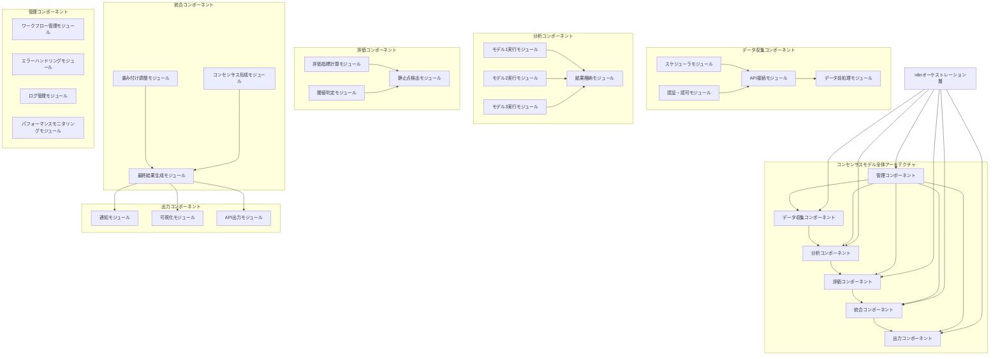

```mermaid
graph TD
    subgraph "コンセンサスモデル全体アーキテクチャ"
        A[データ収集コンポーネント] --> B[分析コンポーネント]
        B --> C[評価コンポーネント]
        C --> D[統合コンポーネント]
        D --> E[出力コンポーネント]
        F[管理コンポーネント] --> A
        F --> B
        F --> C
        F --> D
        F --> E
    end

    subgraph "データ収集コンポーネント"
        A1[API接続モジュール] --> A2[データ前処理モジュール]
        A3[スケジューラモジュール] --> A1
        A4[認証・認可モジュール] --> A1
    end

    subgraph "分析コンポーネント"
        B1[モデル1実行モジュール] --> B4[結果格納モジュール]
        B2[モデル2実行モジュール] --> B4
        B3[モデル3実行モジュール] --> B4
    end

    subgraph "評価コンポーネント"
        C1[評価指標計算モジュール] --> C3[静止点検出モジュール]
        C2[閾値判定モジュール] --> C3
    end

    subgraph "統合コンポーネント"
        D1[重み付け調整モジュール] --> D3[最終結果生成モジュール]
        D2[コンセンサス形成モジュール] --> D3
    end

    subgraph "出力コンポーネント"
        E1[通知モジュール]
        E2[可視化モジュール]
        E3[API出力モジュール]
        D3 --> E1
        D3 --> E2
        D3 --> E3
    end

    subgraph "管理コンポーネント"
        F1[ワークフロー管理モジュール]
        F2[エラーハンドリングモジュール]
        F3[ログ管理モジュール]
        F4[パフォーマンスモニタリングモジュール]
    end

    %% n8nによるオーケストレーション
    N[n8nオーケストレーション層] --> A
    N --> B
    N --> C
    N --> D
    N --> E
    N --> F
```
