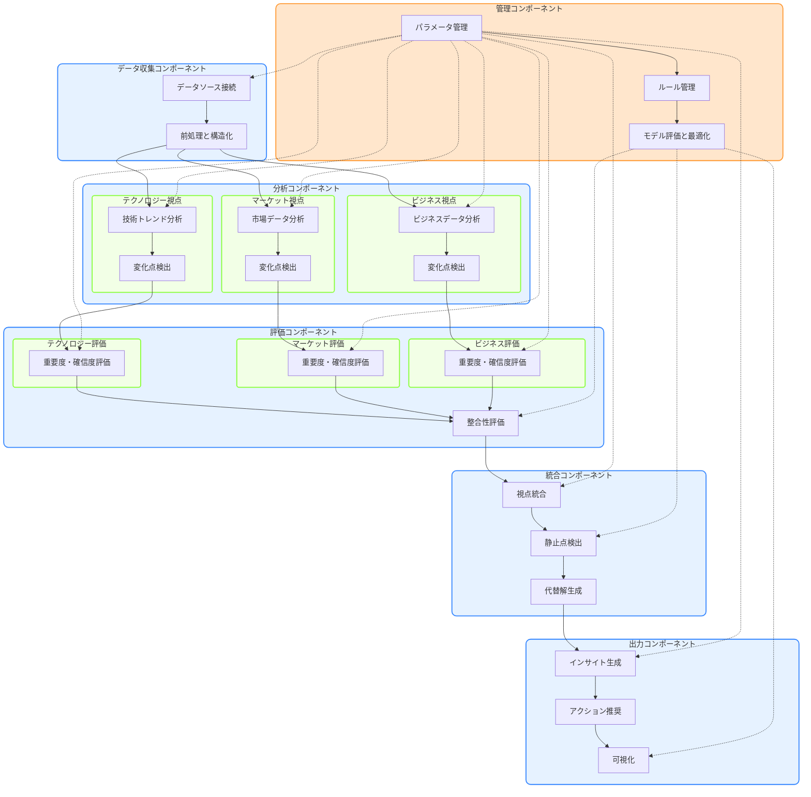

```mermaid
graph TD
    %% メインコンポーネント定義
    subgraph DC["データ収集コンポーネント"]
        DS["データソース接続"] --> PP["前処理と構造化"]
    end
    
    subgraph AC["分析コンポーネント"]
        subgraph TP["テクノロジー視点"]
            TP_A["技術トレンド分析"] --> TP_D["変化点検出"]
        end
        subgraph MP["マーケット視点"]
            MP_A["市場データ分析"] --> MP_D["変化点検出"]
        end
        subgraph BP["ビジネス視点"]
            BP_A["ビジネスデータ分析"] --> BP_D["変化点検出"]
        end
    end
    
    subgraph EC["評価コンポーネント"]
        subgraph TP_E["テクノロジー評価"]
            TP_IC["重要度・確信度評価"]
        end
        subgraph MP_E["マーケット評価"]
            MP_IC["重要度・確信度評価"]
        end
        subgraph BP_E["ビジネス評価"]
            BP_IC["重要度・確信度評価"]
        end
        CC["整合性評価"]
    end
    
    subgraph IC["統合コンポーネント"]
        PI["視点統合"] --> FP["静止点検出"]
        FP --> AS["代替解生成"]
    end
    
    subgraph OC["出力コンポーネント"]
        IG["インサイト生成"] --> AR["アクション推奨"]
        AR --> VZ["可視化"]
    end
    
    subgraph MC["管理コンポーネント"]
        PM["パラメータ管理"] --> RM["ルール管理"]
        RM --> ME["モデル評価と最適化"]
    end
    
    %% コンポーネント間の連携フロー
    PP --> TP_A
    PP --> MP_A
    PP --> BP_A
    
    TP_D --> TP_IC
    MP_D --> MP_IC
    BP_D --> BP_IC
    
    TP_IC --> CC
    MP_IC --> CC
    BP_IC --> CC
    
    CC --> PI
    
    AS --> IG
    
    %% 管理コンポーネントからの制御フロー
    PM -.-> DS
    PM -.-> TP_A
    PM -.-> MP_A
    PM -.-> BP_A
    PM -.-> TP_IC
    PM -.-> MP_IC
    PM -.-> BP_IC
    PM -.-> PI
    PM -.-> IG
    
    ME -.-> CC
    ME -.-> FP
    ME -.-> VZ
    
    %% スタイル設定
    classDef component fill:#e6f2ff,stroke:#3385ff,stroke-width:2px,rx:10px,ry:10px
    classDef perspective fill:#f2ffe6,stroke:#85ff33,stroke-width:2px,rx:5px,ry:5px
    classDef management fill:#ffe6cc,stroke:#ff9933,stroke-width:2px,rx:10px,ry:10px
    
    class DC,AC,EC,IC,OC component
    class TP,MP,BP,TP_E,MP_E,BP_E perspective
    class MC management
```
