## 3. パラメータ間の相互関係と調整メカニズム

**目的：読者がコンセンサスモデルの複雑なパラメータ間の相互作用を理解し、適切に調整できるようにする**

コンセンサスモデルの効果的な運用には、様々なパラメータ間の相互関係を理解し、適切に調整することが不可欠です。本セクションでは、モデル内の主要パラメータ間の相互作用と、それらを適切に調整するメカニズムについて解説します。

### 3.1. パラメータ間の相互関係ネットワーク

コンセンサスモデルは複数のパラメータが複雑に相互作用することで機能します。これらのパラメータ間の関係を視覚化することで、モデルの動作原理をより直感的に理解することができます。

以下の図は、コンセンサスモデルにおける主要パラメータ間の相互関係を示しています。

```mermaid
flowchart TB
    %% スタイル定義
    classDef evaluationParams fill:#d0e0ff,stroke:#0066cc,stroke-width:1px;
    classDef weightParams fill:#d0ffe0,stroke:#00cc66,stroke-width:1px;
    classDef weightMethodParams fill:#fff8d0,stroke:#ccaa00,stroke-width:1px;
    classDef thresholdParams fill:#ffd0d0,stroke:#cc0000,stroke-width:1px;
    classDef adjustmentParams fill:#ffe0d0,stroke:#cc6600,stroke-width:1px;
    classDef metaParams fill:#e0d0ff,stroke:#6600cc,stroke-width:1px;
    
    %% メインパラメータグループ
    subgraph EvalParams["評価軸パラメータ"]
        subgraph ViewLevelParams["視点レベルパラメータ"]
            TechScore[技術視点評価スコア]
            MarketScore[市場視点評価スコア]
            BizScore[ビジネス視点評価スコア]
        end
        
        subgraph TechElements["テクノロジー視点評価要素"]
            TechMaturity[技術成熟度]
            Feasibility[実用化可能性]
            TechAdvantage[技術的優位性]
        end
        
        subgraph MarketElements["マーケット視点評価要素"]
            MarketGrowth[市場成長性]
            Competition[競合状況]
            CustomerDemand[顧客需要]
        end
        
        subgraph BizElements["ビジネス視点評価要素"]
            Profitability[収益性]
            StratAlign[戦略的適合性]
            Risk[リスク]
        end
    end
    
    subgraph WeightParams["重み付けパラメータ"]
        subgraph ViewWeights["視点レベルの重み係数"]
            TechWeight[技術視点の重み]
            MarketWeight[市場視点の重み]
            BizWeight[ビジネス視点の重み]
        end
        
        subgraph TechElemWeights["テクノロジー視点要素の重み係数"]
            TechMaturityW[技術成熟度の重み]
            FeasibilityW[実用化可能性の重み]
            TechAdvantageW[技術的優位性の重み]
        end
        
        subgraph MarketElemWeights["マーケット視点要素の重み係数"]
            MarketGrowthW[市場成長性の重み]
            CompetitionW[競合状況の重み]
            CustomerDemandW[顧客需要の重み]
        end
        
        subgraph BizElemWeights["ビジネス視点要素の重み係数"]
            ProfitabilityW[収益性の重み]
            StratAlignW[戦略的適合性の重み]
            RiskW[リスクの重み]
        end
    end
    
    subgraph WeightMethodParams["重み付け方法パラメータ"]
        subgraph WeightMethods["重み付け方法の種類"]
            StaticWeight{{静的重み付け}}
            DynamicWeight{{動的重み付け}}
            ContextWeight{{コンテキスト依存重み付け}}
        end
        
        subgraph DynamicFactors["動的重み付け調整要因"]
            TopicNature{{トピックの性質}}
            ChangeStage{{変化の段階}}
            ConfidenceLevel{{各視点の情報の確信度}}
        end
    end
    
    subgraph ThresholdParams["閾値パラメータ"]
        subgraph EvalThresholds["評価レベル閾値"]
            HighThreshold{高評価の閾値}
            MidThreshold{中評価の閾値}
            LowThreshold{低評価の閾値}
        end
        
        subgraph ConfThresholds["信頼性閾値"]
            MinConfThreshold{最小信頼度閾値}
            ReEvalTrigger{再評価トリガー閾値}
        end
    end
    
    subgraph AdjustParams["調整パラメータ"]
        subgraph TimeFactors["時間的調整因子"]
            ShortTermFactor((短期影響の重み))
            MidTermFactor((中期影響の重み))
            LongTermFactor((長期影響の重み))
        end
        
        subgraph ContextFactors["コンテキスト調整因子"]
            IndustryFactor((業界特性調整係数))
            OrgSizeFactor((組織規模調整係数))
            RegionFactor((地域特性調整係数))
        end
    end
    
    subgraph MetaParams["メタパラメータ"]
        subgraph ControlParams["モデル制御パラメータ"]
            EvalCycle[/評価サイクル頻度/]
            WeightAdjustFreq[/重み再調整頻度/]
            HistDataPeriod[/履歴データ参照期間/]
        end
        
        subgraph FeedbackParams["フィードバックパラメータ"]
            PredictionAccuracy[/予測精度フィードバック係数/]
            UserSatisfaction[/ユーザー満足度フィードバック係数/]
            DecisionContribution[/意思決定貢献度フィードバック係数/]
        end
        
        TotalScore[/総合評価スコア/]
    end
    
    %% 階層的依存関係（実線矢印）
    TechMaturity --> TechScore
    Feasibility --> TechScore
    TechAdvantage --> TechScore
    
    MarketGrowth --> MarketScore
    Competition --> MarketScore
    CustomerDemand --> MarketScore
    
    Profitability --> BizScore
    StratAlign --> BizScore
    Risk --> BizScore
    
    TechScore --> TotalScore
    MarketScore --> TotalScore
    BizScore --> TotalScore
    
    %% 重み付け関係
    TechMaturityW --> TechMaturity
    FeasibilityW --> Feasibility
    TechAdvantageW --> TechAdvantage
    
    MarketGrowthW --> MarketGrowth
    CompetitionW --> Competition
    CustomerDemandW --> CustomerDemand
    
    ProfitabilityW --> Profitability
    StratAlignW --> StratAlign
    RiskW --> Risk
    
    TechWeight --> TechScore
    MarketWeight --> MarketScore
    BizWeight --> BizScore
    
    %% 影響関係（点線矢印）
    StaticWeight -.-> ViewWeights
    DynamicWeight -.-> ViewWeights
    ContextWeight -.-> ViewWeights
    
    TopicNature -.-> DynamicWeight
    ChangeStage -.-> DynamicWeight
    ConfidenceLevel -.-> DynamicWeight
    
    HighThreshold -.-> TotalScore
    MidThreshold -.-> TotalScore
    LowThreshold -.-> TotalScore
    
    MinConfThreshold -.-> ViewLevelParams
    ReEvalTrigger -.-> ViewLevelParams
    
    ShortTermFactor -.-> TotalScore
    MidTermFactor -.-> TotalScore
    LongTermFactor -.-> TotalScore
    
    IndustryFactor -.-> ViewWeights
    OrgSizeFactor -.-> ViewWeights
    RegionFactor -.-> ViewWeights
    
    %% 調整関係（太線矢印）
    EvalCycle ==> ViewLevelParams
    WeightAdjustFreq ==> WeightMethods
    HistDataPeriod ==> DynamicFactors
    
    %% フィードバック関係（曲線矢印）
    TotalScore --o PredictionAccuracy
    TotalScore --o UserSatisfaction
    TotalScore --o DecisionContribution
    
    PredictionAccuracy --o WeightAdjustFreq
    UserSatisfaction --o ContextFactors
    DecisionContribution --o ViewWeights
    
    %% スタイル適用
    %% 評価軸パラメータ
    class TechScore,MarketScore,BizScore,TechMaturity,Feasibility,TechAdvantage,MarketGrowth,Competition,CustomerDemand,Profitability,StratAlign,Risk evaluationParams;
    
    %% 重み付けパラメータ
    class TechWeight,MarketWeight,BizWeight,TechMaturityW,FeasibilityW,TechAdvantageW,MarketGrowthW,CompetitionW,CustomerDemandW,ProfitabilityW,StratAlignW,RiskW weightParams;
    
    %% 重み付け方法パラメータ
    class StaticWeight,DynamicWeight,ContextWeight,TopicNature,ChangeStage,ConfidenceLevel weightMethodParams;
    
    %% 閾値パラメータ
    class HighThreshold,MidThreshold,LowThreshold,MinConfThreshold,ReEvalTrigger thresholdParams;
    
    %% 調整パラメータ
    class ShortTermFactor,MidTermFactor,LongTermFactor,IndustryFactor,OrgSizeFactor,RegionFactor adjustmentParams;
    
    %% メタパラメータ
    class EvalCycle,WeightAdjustFreq,HistDataPeriod,PredictionAccuracy,UserSatisfaction,DecisionContribution,TotalScore metaParams;
```



この図では、コンセンサスモデルの主要パラメータを6つのグループに分類しています：

1. **評価軸パラメータ**（青系）：モデルの基本的な評価要素
2. **重み付けパラメータ**（緑系）：各評価要素の重要度を決定する係数
3. **重み付け方法パラメータ**（黄系）：重み付けの方法論と調整要因
4. **閾値パラメータ**（赤系）：評価レベルの境界値と信頼性基準
5. **調整パラメータ**（オレンジ系）：時間的・コンテキスト的な調整因子
6. **メタパラメータ**（紫系）：モデル全体の制御とフィードバック機構

これらのパラメータ間には、以下のような関係性が存在します：

- **階層的依存関係**（実線矢印）：あるパラメータが別のパラメータの入力となる関係
- **影響関係**（点線矢印）：間接的に値や挙動に影響を与える関係
- **調整関係**（太線矢印）：パラメータの調整や制御を行う関係
- **フィードバック関係**（曲線矢印）：結果が入力に影響を与える循環的な関係

この相互関係ネットワークを理解することで、パラメータ調整の影響範囲や、モデル全体のバランスを考慮した適切な設定が可能になります。

### 3.2. n8nによるパラメータ管理と調整

コンセンサスモデルの複雑なパラメータ管理と調整は、n8nワークフローを活用することで効率化できます。以下に、n8nによるパラメータ管理と調整の主要なアプローチを示します。

**パラメータストアの構築**

n8nでは、コンセンサスモデルの様々なパラメータを一元管理するためのパラメータストアを構築できます。このストアは、以下の要素で構成されます：

1. **データベース連携**：MongoDB、PostgreSQL、MySQLなどのデータベースと連携し、パラメータ値を永続的に保存
2. **バージョン管理**：パラメータセットのバージョン管理により、過去の設定への復帰や比較分析が可能
3. **アクセス制御**：重要なパラメータの変更権限を制限し、不正な変更を防止

例えば、以下のようなn8nワークフローを構築することで、パラメータストアを実現できます：

```
Trigger: HTTP Request (GET /parameters) → MongoDB Find → HTTP Response
Trigger: HTTP Request (PUT /parameters) → MongoDB Update → HTTP Response
```

**動的パラメータ調整ワークフロー**

コンセンサスモデルの強みの一つは、状況に応じてパラメータを動的に調整できる点です。n8nを使用して、以下のような動的調整ワークフローを実装できます：

1. **コンテキスト検出**：評価対象の性質や状況を自動的に検出し、適切なパラメータ調整を提案
2. **履歴分析**：過去の評価結果と実際の成果を比較分析し、パラメータの最適化を支援
3. **フィードバックループ**：評価結果の精度や有用性に関するフィードバックを収集し、パラメータに反映

例えば、トピックの性質に応じて視点の重み付けを自動調整するワークフローは以下のように実装できます：

```
Trigger: New Topic Added → Function: Analyze Topic Nature → Switch: Topic Type
→ Case: Tech-driven → Set Weights (Tech: 0.5, Market: 0.3, Biz: 0.2)
→ Case: Market-driven → Set Weights (Tech: 0.3, Market: 0.5, Biz: 0.2)
→ Case: Business-driven → Set Weights (Tech: 0.2, Market: 0.3, Biz: 0.5)
→ Save Adjusted Weights to DB
```

**パラメータ調整のガバナンス**

パラメータの調整は、モデルの挙動に大きな影響を与えるため、適切なガバナンスが必要です。n8nを活用して、以下のようなガバナンスメカニズムを実装できます：

1. **変更承認ワークフロー**：重要パラメータの変更には承認プロセスを経るようにする
2. **変更ログ記録**：誰が、いつ、どのパラメータを、どのように変更したかを記録
3. **影響分析**：パラメータ変更が評価結果に与える影響をシミュレーションし、予測する

例えば、重要パラメータの変更承認ワークフローは以下のように実装できます：

```
Trigger: Parameter Change Request → Notify Approvers → Wait for Approval
→ If Approved → Apply Changes → Log Changes → Notify Requestor
→ If Rejected → Log Rejection → Notify Requestor with Reason
```

これらのn8nワークフローを活用することで、コンセンサスモデルのパラメータを効率的に管理し、状況に応じて適切に調整することが可能になります。特に、複数の意思決定者や部門が関わる大規模組織では、一貫性のあるパラメータ管理が重要であり、n8nによる自動化と標準化が大きな価値を提供します。

### 3.3. 重要なパラメータ相互作用ポイント

コンセンサスモデルにおいて特に重要な相互作用ポイントを理解することで、モデルの挙動をより効果的に制御できます。以下に、特に注目すべき相互作用ポイントを示します。

**動的重み付けのメカニズム**

動的重み付けは、評価対象の性質や状況に応じて重み係数を自動調整するメカニズムです。この相互作用は以下の要素で構成されます：

1. **トピックの性質**：技術駆動型、市場駆動型、ビジネス駆動型などの分類に基づく調整
2. **変化の段階**：初期、成長期、成熟期などの発展段階に応じた調整
3. **情報の確信度**：各視点の情報の確実性や信頼性に基づく調整

例えば、技術駆動型のトピックでは、テクノロジー視点の重みを高く設定し、情報の確信度が低い視点の重みを下げるといった調整が行われます。この動的調整により、評価対象の特性に応じた適切な評価が可能になります。

**フィードバックループの機能**

フィードバックループは、評価結果とその実際の成果を比較し、モデルを自己調整する機能です。主要なフィードバックループには以下があります：

1. **予測精度フィードバック**：評価結果と実際の成果の一致度に基づく調整
2. **ユーザー満足度フィードバック**：モデル利用者の満足度や有用性評価に基づく調整
3. **意思決定貢献度フィードバック**：モデルが意思決定プロセスにどれだけ貢献したかに基づく調整

これらのフィードバックループにより、モデルは時間の経過とともに学習し、より正確で有用な評価を提供できるようになります。例えば、特定の評価パターンが実際の成果と一致しない場合、関連するパラメータが自動的に調整されます。

**時間的調整の影響**

時間的調整は、短期、中期、長期の影響を適切にバランスさせるメカニズムです。この調整は以下の要素で構成されます：

1. **短期影響の重み**：即時的な効果や影響に対する重み付け
2. **中期影響の重み**：1〜3年程度の中期的な効果に対する重み付け
3. **長期影響の重み**：3年以上の長期的な効果や戦略的影響に対する重み付け

例えば、研究開発投資の評価では長期影響の重みを高く設定し、マーケティングキャンペーンの評価では短期・中期影響の重みを高く設定するといった調整が可能です。この時間的調整により、組織の時間軸や戦略的視点に合わせた評価が実現します。

**コンテキスト適応メカニズム**

コンテキスト適応は、組織や環境の特性に応じてモデルを調整するメカニズムです。主要な適応要素には以下があります：

1. **業界特性**：技術変化の速度、競争環境、規制状況などの業界特性に応じた調整
2. **組織規模**：大企業、中小企業、スタートアップなど組織規模に応じた調整
3. **地域特性**：グローバル、地域、ローカルなど地理的範囲や文化的背景に応じた調整

例えば、技術変化の速い業界では技術視点の重みを高く、規制の厳しい業界ではリスク要素の重みを高くするといった調整が行われます。このコンテキスト適応により、組織の特性や環境に最適化された評価が可能になります。

これらの重要な相互作用ポイントを理解し、適切に管理することで、コンセンサスモデルの柔軟性と適応性を最大限に活用できます。特に、n8nによる自動化と連携を活用することで、これらの複雑な相互作用を効率的に管理し、状況に応じた最適な評価を実現することが可能になります。
