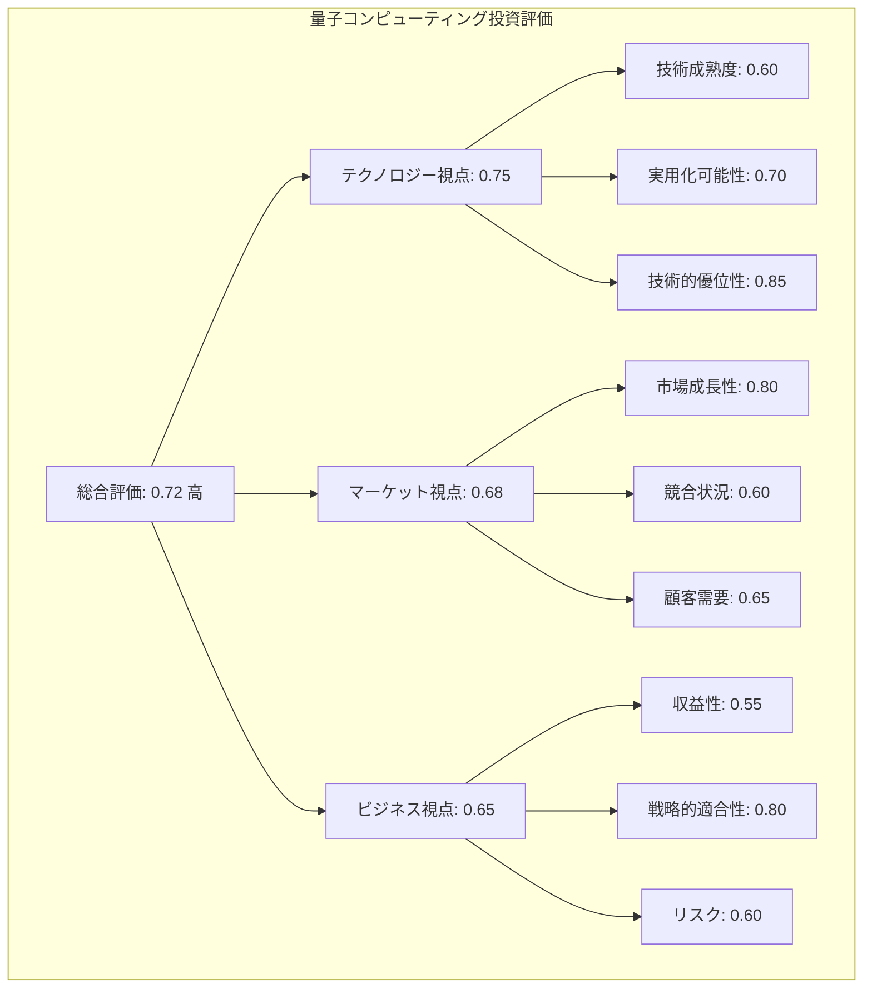
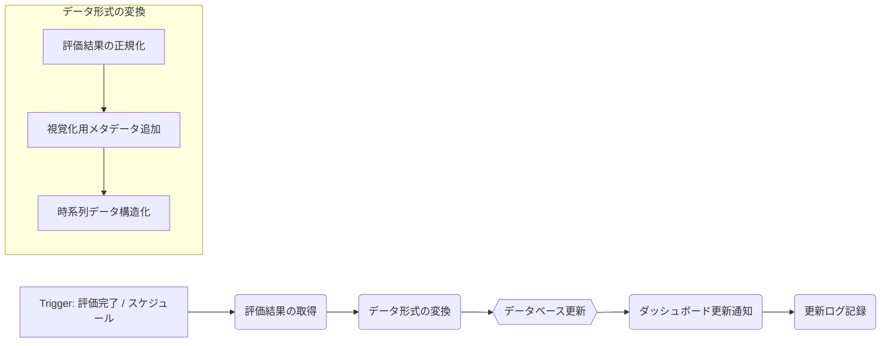
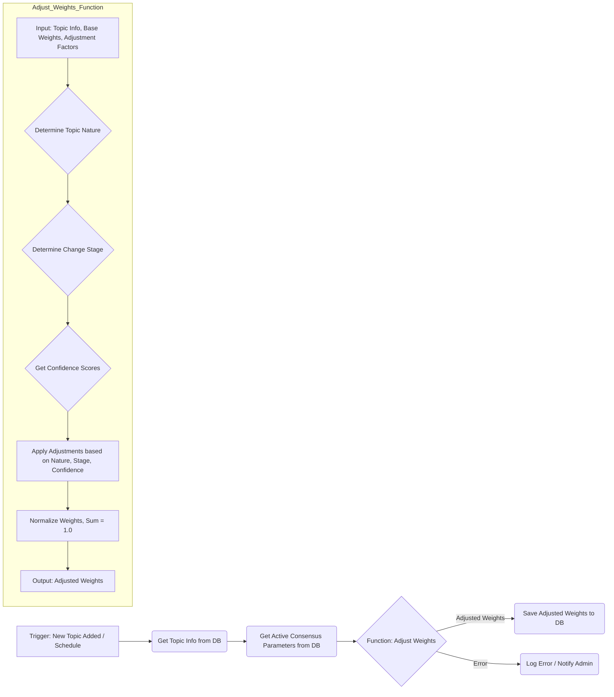

## 4. インターフェース設計と視覚化

**目的：読者がコンセンサスモデルの結果を直感的に理解し、意思決定に活用できるようにする**

コンセンサスモデルの真価は、その計算結果をいかに分かりやすく、意思決定者に伝えられるかにかかっています。本セクションでは、モデルの出力を効果的に視覚化し、ユーザーが直感的に理解できるインターフェースの設計方法を解説します。単なる数値の羅列ではなく、情報の階層性や関連性を明確に表現し、意思決定者が瞬時に状況を把握できるダッシュボードの構築方法を示します。

### 4.1. ダッシュボード設計の基本原則

効果的なダッシュボードは、複雑な情報を整理し、意思決定者が必要な洞察を素早く得られるように設計されています。コンセンサスモデルのダッシュボード設計においては、以下の基本原則が重要です。

**情報の階層化と優先順位付け**

ダッシュボードでは、最も重要な情報を最も目立つ位置に配置し、詳細情報は必要に応じてドリルダウンできる構造にします。具体的には：

- 最上位層：総合評価スコアと判断結果（Go/No-Go/要検討など）
- 第二層：3つの視点（テクノロジー、マーケット、ビジネス）ごとの評価スコア
- 第三層：各視点内の評価要素（例：技術成熟度、市場規模、収益性など）
- 第四層：個別の評価データポイントと根拠情報

この階層構造により、意思決定者は全体像を素早く把握しつつ、必要に応じて詳細情報にアクセスできます。

**視覚的一貫性と直感的理解**

情報の表現方法は一貫性を持ち、直感的に理解できるものであるべきです。

- 色彩コード：評価結果を一貫した色で表現（例：緑=高評価、黄=中評価、赤=低評価）
- アイコンと形状：各視点や評価要素を識別しやすいアイコンで表現
- スケールの統一：すべての評価要素で0〜1のスケールを使用し、比較を容易にする
- 閾値の明示：判断基準となる閾値を視覚的に示し、現在の評価がどの位置にあるかを明確にする

**インタラクティブ性と探索可能性**

静的な表示だけでなく、ユーザーが情報を探索し、異なる角度から分析できる機能を提供します。

- フィルタリング：特定の条件に基づいて情報を絞り込む機能
- ソート：異なる基準で情報を並べ替える機能
- シミュレーション：「もし〜ならば」のシナリオを試せる機能
- 時系列表示：評価の変化を時間軸で追跡できる機能

これらの機能により、意思決定者は受動的に情報を受け取るだけでなく、能動的に情報を探索し、より深い洞察を得ることができます。

### 4.2. 効果的な視覚化手法

コンセンサスモデルの結果を視覚化するためには、複数の手法を目的に応じて使い分けることが効果的です。以下に、特に有用な視覚化手法とその具体的な実装例を示します。

**レーダーチャート：多次元評価の統合表示**

レーダーチャートは、複数の評価軸を同時に表示し、全体のバランスを視覚的に把握するのに適しています。コンセンサスモデルでは、3つの視点や各視点内の評価要素をレーダーチャートで表現することで、強みと弱みを一目で確認できます。

```javascript
// Chart.jsを使用したレーダーチャート実装例
const ctx = document.getElementById('consensusRadar').getContext('2d');
const chart = new Chart(ctx, {
    type: 'radar',
    data: {
        labels: ['技術成熟度', '実用化可能性', '技術的優位性', '市場成長性', 
                '競合状況', '顧客需要', '収益性', '戦略的適合性', 'リスク'],
        datasets: [{
            label: '現在の評価',
            data: [0.6, 0.7, 0.85, 0.8, 0.6, 0.65, 0.55, 0.8, 0.6],
            backgroundColor: 'rgba(54, 162, 235, 0.2)',
            borderColor: 'rgb(54, 162, 235)',
            pointBackgroundColor: 'rgb(54, 162, 235)'
        }, {
            label: '目標値',
            data: [0.7, 0.8, 0.9, 0.85, 0.7, 0.75, 0.7, 0.85, 0.7],
            backgroundColor: 'rgba(255, 99, 132, 0.2)',
            borderColor: 'rgb(255, 99, 132)',
            pointBackgroundColor: 'rgb(255, 99, 132)'
        }]
    },
    options: {
        scales: {
            r: {
                angleLines: {
                    display: true
                },
                suggestedMin: 0,
                suggestedMax: 1
            }
        }
    }
});
```

**階層型ツリーマップ：情報の階層と重要度の表現**

ツリーマップは、階層構造を持つデータを面積で表現し、各要素の相対的な重要度を視覚化するのに適しています。コンセンサスモデルでは、3つの視点とその下位要素の重み付けや評価結果をツリーマップで表現することで、影響度の大きい要素を直感的に把握できます。

```javascript
// D3.jsを使用したツリーマップ実装例
const data = {
    name: "総合評価",
    value: 0.72,
    children: [
        {
            name: "テクノロジー視点",
            value: 0.75,
            children: [
                { name: "技術成熟度", value: 0.60 },
                { name: "実用化可能性", value: 0.70 },
                { name: "技術的優位性", value: 0.85 }
            ]
        },
        {
            name: "マーケット視点",
            value: 0.68,
            children: [
                { name: "市場成長性", value: 0.80 },
                { name: "競合状況", value: 0.60 },
                { name: "顧客需要", value: 0.65 }
            ]
        },
        {
            name: "ビジネス視点",
            value: 0.65,
            children: [
                { name: "収益性", value: 0.55 },
                { name: "戦略的適合性", value: 0.80 },
                { name: "リスク", value: 0.60 }
            ]
        }
    ]
};

const width = 960;
const height = 570;

const treemap = d3.treemap()
    .size([width, height])
    .padding(1)
    .round(true);

const root = d3.hierarchy(data)
    .sum(d => d.value)
    .sort((a, b) => b.value - a.value);

treemap(root);

const svg = d3.select("#treemap")
    .append("svg")
    .attr("width", width)
    .attr("height", height);

const cell = svg.selectAll("g")
    .data(root.leaves())
    .enter().append("g")
    .attr("transform", d => `translate(${d.x0},${d.y0})`);

cell.append("rect")
    .attr("width", d => d.x1 - d.x0)
    .attr("height", d => d.y1 - d.y0)
    .attr("fill", d => {
        // 評価値に基づいて色を決定
        const value = d.data.value;
        if (value >= 0.7) return "#4CAF50";  // 高評価：緑
        if (value >= 0.5) return "#FFC107";  // 中評価：黄
        return "#F44336";                    // 低評価：赤
    });

cell.append("text")
    .attr("x", 5)
    .attr("y", 15)
    .text(d => d.data.name);

cell.append("text")
    .attr("x", 5)
    .attr("y", 30)
    .text(d => d.data.value.toFixed(2));
```

**フローチャートとサンキーダイアグラム：プロセスと影響関係の可視化**

フローチャートやサンキーダイアグラムは、プロセスの流れや要素間の影響関係を視覚化するのに適しています。コンセンサスモデルでは、評価プロセスの流れや、各視点間の情報の流れと影響度をこれらの図で表現することで、モデルの動作原理を直感的に理解できます。



**ヒートマップとマトリックス：相関関係と比較分析**

ヒートマップやマトリックスは、複数の要素間の相関関係や比較分析を視覚化するのに適しています。コンセンサスモデルでは、異なる評価要素間の相関関係や、複数の評価対象（例：異なる技術投資案）の比較をこれらの図で表現することで、パターンや傾向を発見しやすくなります。

```javascript
// Chart.jsを使用したヒートマップ実装例
const ctx = document.getElementById('correlationHeatmap').getContext('2d');
const chart = new Chart(ctx, {
    type: 'matrix',
    data: {
        datasets: [{
            data: [
                { x: '技術成熟度', y: '市場成長性', v: 0.8 },
                { x: '技術成熟度', y: '収益性', v: 0.6 },
                { x: '実用化可能性', y: '市場成長性', v: 0.7 },
                { x: '実用化可能性', y: '収益性', v: 0.9 },
                // 他の組み合わせも同様に定義
            ],
            backgroundColor(context) {
                const value = context.dataset.data[context.dataIndex].v;
                const alpha = value;
                return `rgba(54, 162, 235, ${alpha})`;
            },
            borderColor: 'white',
            borderWidth: 1,
            width: ({ chart }) => (chart.chartArea || {}).width / 9 - 1,
            height: ({ chart }) => (chart.chartArea || {}).height / 9 - 1
        }]
    },
    options: {
        plugins: {
            tooltip: {
                callbacks: {
                    title() {
                        return '';
                    },
                    label(context) {
                        const v = context.dataset.data[context.dataIndex];
                        return [`${v.x} vs ${v.y}`, `相関係数: ${v.v.toFixed(2)}`];
                    }
                }
            }
        },
        scales: {
            x: {
                type: 'category',
                labels: ['技術成熟度', '実用化可能性', '技術的優位性', '市場成長性', 
                        '競合状況', '顧客需要', '収益性', '戦略的適合性', 'リスク'],
                offset: true
            },
            y: {
                type: 'category',
                labels: ['技術成熟度', '実用化可能性', '技術的優位性', '市場成長性', 
                        '競合状況', '顧客需要', '収益性', '戦略的適合性', 'リスク'],
                offset: true
            }
        }
    }
});
```

### 4.3. n8nによるダッシュボード連携

コンセンサスモデルの評価結果をリアルタイムでダッシュボードに反映するためには、n8nワークフローとダッシュボードシステムを効果的に連携させる必要があります。ここでは、n8nを使用してダッシュボードを更新する方法と、実際の連携例を示します。

**n8nとダッシュボードの連携アーキテクチャ**

n8nワークフローからダッシュボードへのデータ連携には、主に以下の3つのアプローチがあります。

1. **APIを介した直接連携**：ダッシュボードツール（例：Grafana, Power BI）が提供するAPIを使用して、n8nから直接データを送信する方法。

2. **データベースを介した間接連携**：n8nの評価結果をデータベース（例：PostgreSQL, MongoDB）に保存し、ダッシュボードツールがそのデータベースを参照する方法。

3. **メッセージングシステムを介した連携**：n8nからメッセージングシステム（例：Kafka, RabbitMQ）にデータを送信し、ダッシュボードシステムがそれをサブスクライブする方法。

多くの場合、2番目のアプローチ（データベースを介した間接連携）が最も柔軟性が高く、実装も比較的容易です。以下に、このアプローチに基づく連携例を示します。

**n8nからダッシュボードへのデータ連携ワークフロー**



このワークフローでは、評価が完了したタイミングまたは定期的なスケジュールでトリガーされ、最新の評価結果を取得します。その後、データをダッシュボード表示に適した形式に変換し、データベースに保存します。必要に応じて、ダッシュボードシステムに更新通知を送信し、更新ログを記録します。

**n8nワークフロー実装例**

以下に、PostgreSQLデータベースとGrafanaダッシュボードを使用した連携の実装例を示します。

```javascript
// n8nワークフロー定義（JSON形式）
{
  "nodes": [
    {
      "parameters": {
        "rule": {
          "interval": [
            {
              "field": "hours",
              "minutesInterval": 1
            }
          ]
        }
      },
      "name": "Schedule Trigger",
      "type": "n8n-nodes-base.scheduleTrigger",
      "position": [
        250,
        300
      ]
    },
    {
      "parameters": {
        "functionCode": "// 最新の評価結果を取得する関数\nconst getLatestEvaluation = async () => {\n  // 実際の実装では、APIやデータベースから最新データを取得\n  return {\n    timestamp: new Date().toISOString(),\n    overallScore: 0.72,\n    perspectives: {\n      technology: {\n        score: 0.75,\n        elements: {\n          maturity: 0.60,\n          feasibility: 0.70,\n          advantage: 0.85\n        }\n      },\n      market: {\n        score: 0.68,\n        elements: {\n          growth: 0.80,\n          competition: 0.60,\n          demand: 0.65\n        }\n      },\n      business: {\n        score: 0.65,\n        elements: {\n          profitability: 0.55,\n          strategic_fit: 0.80,\n          risk: 0.60\n        }\n      }\n    },\n    topic: \"量子コンピューティング投資\",\n    decision: \"要検討\"\n  };\n};\n\n// メイン処理\nconst main = async () => {\n  const evaluation = await getLatestEvaluation();\n  return {evaluation};\n};\n\nreturn await main();"
      },
      "name": "Get Latest Evaluation",
      "type": "n8n-nodes-base.function",
      "position": [
        450,
        300
      ]
    },
    {
      "parameters": {
        "functionCode": "// ダッシュボード表示用にデータを変換する関数\nconst transformData = (evaluation) => {\n  // 時系列データ用の構造\n  const timeSeriesData = {\n    timestamp: evaluation.timestamp,\n    topic: evaluation.topic,\n    overall_score: evaluation.overallScore,\n    technology_score: evaluation.perspectives.technology.score,\n    market_score: evaluation.perspectives.market.score,\n    business_score: evaluation.perspectives.business.score,\n    decision: evaluation.decision\n  };\n  \n  // 詳細評価要素用の構造\n  const elementData = [];\n  \n  // テクノロジー視点の要素\n  Object.entries(evaluation.perspectives.technology.elements).forEach(([key, value]) => {\n    elementData.push({\n      timestamp: evaluation.timestamp,\n      topic: evaluation.topic,\n      perspective: 'technology',\n      element: key,\n      score: value\n    });\n  });\n  \n  // マーケット視点の要素\n  Object.entries(evaluation.perspectives.market.elements).forEach(([key, value]) => {\n    elementData.push({\n      timestamp: evaluation.timestamp,\n      topic: evaluation.topic,\n      perspective: 'market',\n      element: key,\n      score: value\n    });\n  });\n  \n  // ビジネス視点の要素\n  Object.entries(evaluation.perspectives.business.elements).forEach(([key, value]) => {\n    elementData.push({\n      timestamp: evaluation.timestamp,\n      topic: evaluation.topic,\n      perspective: 'business',\n      element: key,\n      score: value\n    });\n  });\n  \n  return {\n    timeSeriesData,\n    elementData\n  };\n};\n\n// メイン処理\nconst main = () => {\n  const evaluation = $input.first().json.evaluation;\n  const transformedData = transformData(evaluation);\n  return transformedData;\n};\n\nreturn main();"
      },
      "name": "Transform for Dashboard",
      "type": "n8n-nodes-base.function",
      "position": [
        650,
        300
      ]
    },
    {
      "parameters": {
        "operation": "insert",
        "schema": "public",
        "table": "consensus_timeseries",
        "columns": "timestamp, topic, overall_score, technology_score, market_score, business_score, decision",
        "additionalFields": {},
        "host": "postgres",
        "port": 5432,
        "database": "consensus_db",
        "user": "postgres",
        "password": "password"
      },
      "name": "Insert TimeSeries Data",
      "type": "n8n-nodes-base.postgres",
      "position": [
        850,
        200
      ]
    },
    {
      "parameters": {
        "operation": "insert",
        "schema": "public",
        "table": "consensus_elements",
        "columns": "timestamp, topic, perspective, element, score",
        "additionalFields": {},
        "host": "postgres",
        "port": 5432,
        "database": "consensus_db",
        "user": "postgres",
        "password": "password"
      },
      "name": "Insert Element Data",
      "type": "n8n-nodes-base.postgres",
      "position": [
        850,
        400
      ]
    },
    {
      "parameters": {
        "url": "http://grafana:3000/api/dashboards/db/consensus-model",
        "authentication": "genericCredentialType",
        "genericAuthType": "httpHeaderAuth",
        "httpHeaderAuth": {
          "name": "Authorization",
          "value": "Bearer eyJrIjoiT0tTcG1pUlY2RnVKZTFVaDFsNFZXdE9ZWmNrMkZYbk="
        },
        "sendBody": true,
        "bodyParameters": {
          "parameters": [
            {
              "name": "dashboard",
              "value": "{\"annotations\":{\"list\":[]},\"editable\":true,\"gnetId\":null,\"graphTooltip\":0,\"hideControls\":false,\"links\":[],\"refresh\":\"5s\",\"rows\":[],\"schemaVersion\":16,\"style\":\"dark\",\"tags\":[],\"templating\":{\"list\":[]},\"time\":{\"from\":\"now-6h\",\"to\":\"now\"},\"timepicker\":{\"refresh_intervals\":[\"5s\",\"10s\",\"30s\",\"1m\",\"5m\",\"15m\",\"30m\",\"1h\",\"2h\",\"1d\"],\"time_options\":[\"5m\",\"15m\",\"1h\",\"6h\",\"12h\",\"24h\",\"2d\",\"7d\",\"30d\"]},\"timezone\":\"browser\",\"title\":\"Consensus Model Dashboard\",\"version\":1}"
            },
            {
              "name": "overwrite",
              "value": "true"
            }
          ]
        },
        "options": {}
      },
      "name": "Update Grafana Dashboard",
      "type": "n8n-nodes-base.httpRequest",
      "position": [
        1050,
        300
      ]
    }
  ],
  "connections": {
    "Schedule Trigger": {
      "main": [
        [
          {
            "node": "Get Latest Evaluation",
            "type": "main",
            "index": 0
          }
        ]
      ]
    },
    "Get Latest Evaluation": {
      "main": [
        [
          {
            "node": "Transform for Dashboard",
            "type": "main",
            "index": 0
          }
        ]
      ]
    },
    "Transform for Dashboard": {
      "main": [
        [
          {
            "node": "Insert TimeSeries Data",
            "type": "main",
            "index": 0
          },
          {
            "node": "Insert Element Data",
            "type": "main",
            "index": 0
          }
        ]
      ]
    },
    "Insert TimeSeries Data": {
      "main": [
        [
          {
            "node": "Update Grafana Dashboard",
            "type": "main",
            "index": 0
          }
        ]
      ]
    },
    "Insert Element Data": {
      "main": [
        [
          {
            "node": "Update Grafana Dashboard",
            "type": "main",
            "index": 0
          }
        ]
      ]
    }
  }
}
```

このワークフローでは、1時間ごとに最新の評価結果を取得し、ダッシュボード表示用にデータを変換した後、PostgreSQLデータベースに保存します。そして、Grafana APIを呼び出してダッシュボードを更新します。

**ダッシュボード設計のベストプラクティス**

コンセンサスモデルのダッシュボード設計において、特に重要なベストプラクティスを以下にまとめます。

1. **ユーザーの意思決定プロセスに沿った設計**：ダッシュボードは、ユーザーの意思決定プロセスに沿った流れで情報を提示すべきです。例えば、「全体状況の把握 → 問題領域の特定 → 詳細分析 → 意思決定」という流れに対応する形で情報を配置します。

2. **コンテキスト情報の提供**：評価スコアだけでなく、その背景となるコンテキスト情報（評価時点、評価対象の特性、前回からの変化など）も提供し、数値の意味を正しく解釈できるようにします。

3. **適切なアラートとハイライト**：閾値を超えた項目や、特に注目すべき変化があった項目を視覚的にハイライトし、ユーザーの注意を適切に誘導します。

4. **比較と参照点の提供**：現在の評価結果を過去のデータや目標値、業界平均などと比較できるようにし、相対的な位置づけを理解しやすくします。

5. **モバイル対応とレスポンシブデザイン**：様々なデバイスやスクリーンサイズでも適切に表示されるレスポンシブなデザインを採用し、いつでもどこでも必要な情報にアクセスできるようにします。

これらのベストプラクティスを踏まえたダッシュボード設計により、コンセンサスモデルの評価結果を最大限に活用し、より質の高い意思決定を支援することができます。
## 5. 実際の運用例とユースケース

**目的：読者が実際の業務課題にコンセンサスモデルを適用するイメージを持てるようにする**

理論的な理解だけでは、実際の業務にコンセンサスモデルを適用することは難しいものです。本セクションでは、具体的なユースケースを通じて、コンセンサスモデルがどのように実際の意思決定を支援するのかを示します。これらの事例は、読者が自組織の課題にモデルを適用する際の参考となるでしょう。

### 5.1. 先端技術投資判断：量子コンピューティング

**背景と課題**

中堅IT企業Aは、量子コンピューティング技術への投資を検討しています。この技術は急速に発展しており、将来的に大きな市場を形成する可能性がある一方で、実用化までの道のりはまだ不透明です。限られた投資リソースを効果的に配分するため、量子コンピューティングへの投資判断を客観的かつ多角的に行う必要がありました。

**コンセンサスモデルの適用**

企業Aは、テクノロジー、マーケット、ビジネスの3つの視点から量子コンピューティング技術を評価するコンセンサスモデルを構築しました。各視点の主要な評価要素は以下の通りです：

**テクノロジー視点（重み：0.35）**
- 技術成熟度：現在の技術レベルと実用化までの距離
- 実用化可能性：技術的な障壁と克服の見通し
- 技術的優位性：競合技術と比較した際の優位点

**マーケット視点（重み：0.40）**
- 市場成長性：将来の市場規模と成長率の予測
- 競合状況：市場参入企業の動向と競争の激しさ
- 顧客需要：潜在顧客の関心度とニーズの明確さ

**ビジネス視点（重み：0.25）**
- 収益性：投資回収の見通しと収益化モデル
- 戦略的適合性：自社の事業戦略との整合性
- リスク：投資失敗時の影響と対応策

各評価要素に0〜1のスコアを割り当て、設定した重みを適用して総合評価を算出しました。評価プロセスでは、社内外の専門家の意見、市場調査レポート、技術論文、競合企業の動向など、多様な情報源を活用しました。

**評価結果と意思決定**

コンセンサスモデルによる評価の結果は以下の通りでした：


総合評価は0.72と高いスコアを示し、特にテクノロジー視点での評価が高く（0.75）、中でも技術的優位性（0.85）が突出していました。マーケット視点では市場成長性（0.80）が高く評価された一方、ビジネス視点では収益性（0.55）に課題が見られました。

この評価結果に基づき、企業Aは以下の意思決定を行いました：

1. 量子コンピューティング技術への段階的投資を行う
2. 初期段階では研究開発と人材育成に重点を置く
3. 収益性の課題に対応するため、短期的には関連コンサルティングサービスで収益を確保しながら、長期的な技術開発を進める
4. 市場と技術の動向を定期的に再評価し、投資規模を調整する

**成果と学び**

このコンセンサスモデルの適用により、企業Aは以下の成果を得ました：

1. 多角的な視点からの評価により、感情や一部の意見に偏らない客観的な判断が可能になった
2. 各評価要素のスコアが明確になったことで、強みを活かし、弱みに対処する具体的な戦略立案ができた
3. 定量的な評価基準により、経営層や投資家への説明が容易になり、意思決定の透明性が向上した
4. 定期的な再評価の仕組みにより、市場や技術の変化に応じて柔軟に投資戦略を調整できるようになった

### 5.2. 新興市場参入判断：東南アジアeコマース

**背景と課題**

日本の中堅ECプラットフォーム企業Bは、成熟した国内市場での成長が鈍化する中、東南アジア市場への参入を検討していました。しかし、言語や文化の違い、物流インフラの課題、現地競合の存在など、多くの不確実性が存在していました。限られたリソースで効果的な市場参入を行うため、客観的かつ多角的な評価に基づく意思決定が必要でした。

**コンセンサスモデルの適用**

企業Bは、テクノロジー、マーケット、ビジネスの3つの視点から東南アジア市場参入を評価するコンセンサスモデルを構築しました。市場参入という性質上、マーケット視点の重みを高く設定しています：

**マーケット視点（重み：0.45）**
- 市場規模と成長率：現在と将来の市場規模、成長のトレンド
- 競合状況：現地プレイヤーと国際企業の動向、市場シェア
- 消費者行動：オンラインショッピングの普及度、支払い習慣、信頼性

**テクノロジー視点（重み：0.25）**
- インフラ整備状況：インターネット普及率、スマートフォン普及率、配送インフラ
- 技術的適応性：現地の技術環境に対する自社プラットフォームの適応性
- 技術的差別化要因：競合に対する技術的優位性

**ビジネス視点（重み：0.30）**
- 収益モデル：現地での収益化戦略と見通し
- 規制とコンプライアンス：現地の法規制と対応コスト
- 運営リスク：言語・文化の違い、人材確保、パートナーシップの課題

評価プロセスでは、現地市場調査、競合分析、技術環境評価、規制調査など、多角的な情報収集を行いました。特に、現地のeコマース利用者へのインタビューや、すでに進出している他業種の日本企業からの情報も重要な参考資料となりました。

**評価結果と意思決定**

コンセンサスモデルによる評価の結果は以下の通りでした：

| 評価視点 | 重み | スコア | 加重スコア |
|---------|------|--------|------------|
| マーケット視点 | 0.45 | 0.76 | 0.342 |
| テクノロジー視点 | 0.25 | 0.65 | 0.163 |
| ビジネス視点 | 0.30 | 0.58 | 0.174 |
| **総合評価** | | | **0.679** |

マーケット視点では特に市場成長率（0.85）と消費者のモバイルショッピング傾向（0.80）が高く評価されました。一方、ビジネス視点では規制とコンプライアンス（0.50）や運営リスク（0.55）に課題が見られました。

この評価結果に基づき、企業Bは以下の意思決定を行いました：

1. 段階的な市場参入戦略を採用する
   - 第1段階：特定の国（シンガポール）に限定して参入し、学習と適応を行う
   - 第2段階：成功モデルを確立した後、他の東南アジア諸国に展開する

2. 現地パートナーとの提携モデルを採用する
   - 物流：現地の配送業者と提携
   - 決済：現地の主要決済方法に対応
   - マーケティング：現地インフルエンサーとの協力

3. リスク軽減策を実施する
   - 法務・コンプライアンス専門家の採用
   - 現地採用と日本からの駐在を組み合わせたハイブリッド人材戦略
   - 段階的な投資で財務リスクを管理

**成果と学び**

このコンセンサスモデルの適用により、企業Bは以下の成果を得ました：

1. 市場参入の意思決定が感覚的ではなく、データと多角的な分析に基づいたものになった
2. リスク要因が明確になり、それに対する具体的な対策を事前に計画できた
3. 段階的アプローチにより、初期投資を抑えながら市場学習を行うことができた
4. 1年後の再評価で、当初の想定よりも良好な結果が得られ、第2段階への移行を早めることができた

### 5.3. 製品開発優先順位付け：AIアシスタント機能

**背景と課題**

ビジネスソフトウェア開発企業Cは、自社の主力製品にAIアシスタント機能を追加することを検討していました。しかし、限られた開発リソースの中で、どのようなAI機能を優先的に開発すべきか、また、どのAI技術（自然言語処理、予測分析、画像認識など）に投資すべきかの判断が必要でした。

**コンセンサスモデルの適用**

企業Cは、複数のAI機能候補を評価するためのコンセンサスモデルを構築しました。製品開発という性質上、テクノロジー視点とマーケット視点の重みを同等に高く設定しています：

**テクノロジー視点（重み：0.40）**
- 技術的実現可能性：現在の技術レベルでの実装難易度
- 開発期間と工数：必要なリソースと時間
- 技術的持続性：将来的な拡張性とメンテナンス性

**マーケット視点（重み：0.40）**
- 顧客ニーズの強さ：機能に対する需要の大きさ
- 競合差別化：競合製品との差別化要因としての価値
- 市場トレンドとの整合性：業界の方向性との一致

**ビジネス視点（重み：0.20）**
- 収益への貢献：売上や顧客維持率への影響
- コスト対効果：開発・運用コストと期待される効果のバランス
- ブランド価値：企業イメージへの影響

評価対象となったAI機能候補は以下の5つでした：
1. スマートデータ分析（データの自動分析と洞察提供）
2. 自然言語クエリ（通常の言葉でのデータ検索・操作）
3. 予測レコメンデーション（次のアクションの提案）
4. 自動レポート生成（データからの報告書自動作成）
5. 音声アシスタント（音声によるシステム操作）

**評価結果と意思決定**

コンセンサスモデルによる各機能の評価結果は以下の通りでした：

| AI機能候補 | テクノロジー<br>(0.40) | マーケット<br>(0.40) | ビジネス<br>(0.20) | 総合評価 |
|------------|------------------------|----------------------|-------------------|----------|
| スマートデータ分析 | 0.75 | 0.85 | 0.80 | **0.80** |
| 自然言語クエリ | 0.70 | 0.75 | 0.65 | **0.71** |
| 予測レコメンデーション | 0.65 | 0.80 | 0.75 | **0.73** |
| 自動レポート生成 | 0.80 | 0.65 | 0.70 | **0.72** |
| 音声アシスタント | 0.60 | 0.55 | 0.50 | **0.56** |

この評価結果に基づき、企業Cは以下の意思決定を行いました：

1. 開発優先順位の決定
   - 第1優先：スマートデータ分析（総合評価0.80）
   - 第2優先：予測レコメンデーション（総合評価0.73）
   - 第3優先：自動レポート生成（総合評価0.72）

2. フェーズ分けされた開発計画
   - フェーズ1：スマートデータ分析の開発と限定リリース
   - フェーズ2：ユーザーフィードバックを取り入れながら予測レコメンデーションを追加
   - フェーズ3：自動レポート生成の追加

3. 音声アシスタントについては、現時点での優先度は低いと判断し、将来的な技術進化と市場ニーズの変化を見て再評価することとした

**成果と学び**

このコンセンサスモデルの適用により、企業Cは以下の成果を得ました：

1. 限られた開発リソースを最も価値の高い機能に集中させることができた
2. 多角的な評価により、技術的に実現しやすいが市場価値の低い機能や、市場ニーズは高いが技術的に未熟な機能を適切に判断できた
3. 段階的な開発計画により、早期に価値を提供しながら、ユーザーフィードバックを次の開発に活かせるようになった
4. 開発チーム内での優先順位に関する議論が、主観的な意見ではなく、構造化された評価に基づいて行われるようになった

### 5.4. 動的重み付け調整の実践例

前述のユースケースでは、各視点に固定的な重みを設定していましたが、実際の運用ではトピックの性質や変化の段階に応じて重みを動的に調整することで、より精度の高い評価が可能になります。ここでは、動的重み付け調整の実践例を示します。

**事例：新興テクノロジーの評価における重み調整**

ある企業が、ブロックチェーン技術の評価を行う際に、技術の成熟度に応じて重み付けを動的に調整しました。

**初期段階（2018年評価時）**
- テクノロジー視点：0.50（高）- 技術的実現可能性と課題が最重要
- マーケット視点：0.30（中）- 初期の市場反応と潜在的用途の探索
- ビジネス視点：0.20（低）- 収益モデルはまだ不明確

**成長段階（2021年再評価時）**
- テクノロジー視点：0.30（中）- 基本技術は確立、実装の課題に焦点
- マーケット視点：0.45（高）- 市場採用が進み、競争が激化
- ビジネス視点：0.25（中）- 収益モデルが徐々に明確化

**成熟段階（2023年再評価時）**
- テクノロジー視点：0.25（中）- 技術は安定化、差別化要因に焦点
- マーケット視点：0.35（中）- 市場は確立、成長率は安定化
- ビジネス視点：0.40（高）- 収益性と持続可能性が最重要

この動的な重み付け調整により、技術の発展段階に応じて評価の焦点を適切にシフトさせ、より現実に即した判断が可能になりました。

**n8nによる動的重み付け調整ワークフロー**

以下に、n8nを使用した動的重み付け調整ワークフローの概念図を示します。



このワークフローでは、トピックの性質（技術駆動型、市場駆動型など）、変化の段階（初期、成長期、成熟期など）、各視点の情報の確信度などの要因に基づいて、基本重みを動的に調整します。調整された重みは、次回の評価プロセスで使用されます。

### 5.5. ユースケースから得られる共通の教訓

これらのユースケースから得られる共通の教訓をまとめると、以下のようになります：

**1. 多角的視点の価値**

単一の視点（例えば技術的実現可能性のみ、または市場ニーズのみ）に基づく判断は、しばしば重要な要素を見落とし、バランスを欠いた意思決定につながります。3つの視点を統合することで、より全体的で堅牢な評価が可能になります。

**2. 定量化の重要性**

主観的な議論や感覚的な判断ではなく、明確な評価基準と数値化されたスコアを用いることで、意思決定の客観性と透明性が大幅に向上します。これにより、組織内でのコンセンサス形成も容易になります。

**3. 段階的アプローチの有効性**

多くのケースでは、一度に大きな決断を下すのではなく、段階的なアプローチを採用することで、リスクを管理しながら学習と適応を行うことができます。コンセンサスモデルは、この段階的アプローチを支援する枠組みとして機能します。

**4. 定期的な再評価の必要性**

初期評価が正確であっても、市場環境や技術状況は常に変化しています。定期的な再評価と、それに基づく戦略の調整が、長期的な成功には不可欠です。動的重み付け調整は、この再評価プロセスを支援する重要なメカニズムです。

**5. 実装と運用の現実的考慮**

理論的に優れたモデルでも、実際の組織文化や業務プロセスに適合しなければ効果を発揮できません。コンセンサスモデルの導入は、技術的な実装だけでなく、組織的な変化管理も含めた総合的なアプローチが必要です。

これらの教訓を念頭に置きながら、各組織は自身の特性や課題に合わせてコンセンサスモデルをカスタマイズし、効果的に活用することができるでしょう。
## 6. 評価と最適化

**目的：読者がコンセンサスモデルの評価方法と継続的改善プロセスを理解し、実践できるようにする**

コンセンサスモデルを構築して運用するだけでは十分ではありません。モデルの精度や有効性を継続的に評価し、改善していくことが、長期的な価値を生み出す鍵となります。本セクションでは、コンセンサスモデルの評価方法と、それに基づく最適化アプローチを解説します。これにより、読者は自組織のコンセンサスモデルを継続的に進化させ、より高い価値を引き出すことができるようになります。

### 6.1. 評価指標の設計と測定

コンセンサスモデルの評価は、主観的な印象ではなく、明確な指標に基づいて行うことが重要です。ここでは、効果的な評価指標の設計と測定方法について解説します。

**評価指標の種類**

コンセンサスモデルの評価指標は、大きく以下の3つのカテゴリに分類できます：

1. **精度指標**：モデルの予測や評価がどれだけ正確かを測定
   - 予測精度：モデルの評価と実際の結果の一致度
   - 一貫性：同様の条件下での評価結果の安定性
   - 信頼区間：評価結果の不確実性の範囲

2. **有用性指標**：モデルが意思決定にどれだけ貢献しているかを測定
   - 意思決定速度：評価から決定までの時間短縮
   - 決定品質：モデル導入前後での意思決定の質の変化
   - ユーザー満足度：モデルを使用する意思決定者の満足度

3. **効率性指標**：モデルの運用コストと得られる価値のバランスを測定
   - 運用コスト：モデル維持に必要なリソース
   - ROI：モデル運用コストと得られる価値の比率
   - スケーラビリティ：評価対象の増加に対するモデルの対応能力

これらの指標を組み合わせることで、モデルの総合的な評価が可能になります。

**測定方法とデータ収集**

評価指標を効果的に測定するためには、適切なデータ収集と分析方法が必要です。

1. **ベースライン確立**：モデル導入前のデータを収集し、比較の基準を設定します。例えば、モデル導入前の意思決定にかかる時間や、その決定の結果などを記録します。

2. **A/Bテスト**：可能であれば、同じ決定をモデルを使用するグループと使用しないグループで行い、結果を比較します。これにより、モデルの効果を直接測定できます。

3. **フィードバックループの構築**：モデルの評価結果と実際の結果を継続的に比較し、差異を記録するシステムを構築します。これにより、モデルの精度を時系列で追跡できます。

4. **ユーザーフィードバック収集**：モデルを使用する意思決定者からの定性的・定量的フィードバックを定期的に収集します。例えば、使いやすさ、信頼性、有用性などの観点からの評価を5段階スケールで収集します。

5. **コスト追跡**：モデルの運用に関連するすべてのコスト（開発、維持、更新など）を追跡し、得られる価値と比較します。

**評価ダッシュボードの構築**

収集したデータを効果的に分析し、モデルの状態を一目で把握するためには、評価ダッシュボードの構築が有効です。以下は、評価ダッシュボードに含めるべき主要な要素です：

1. **精度トラッカー**：時間経過に伴うモデルの精度変化を視覚化
2. **予測vs実績比較**：モデルの評価と実際の結果の比較
3. **ユーザー満足度トレンド**：ユーザーフィードバックの時系列変化
4. **コスト効率性指標**：投資対効果の推移
5. **アラートシステム**：精度が一定閾値を下回った場合の警告

```javascript
// Chart.jsを使用した精度トラッカーの実装例
const ctx = document.getElementById('accuracyTracker').getContext('2d');
const chart = new Chart(ctx, {
    type: 'line',
    data: {
        labels: ['1月', '2月', '3月', '4月', '5月', '6月'],
        datasets: [{
            label: '予測精度',
            data: [0.65, 0.68, 0.72, 0.75, 0.73, 0.78],
            borderColor: 'rgb(75, 192, 192)',
            tension: 0.1
        }, {
            label: '一貫性スコア',
            data: [0.70, 0.72, 0.75, 0.78, 0.80, 0.82],
            borderColor: 'rgb(153, 102, 255)',
            tension: 0.1
        }, {
            label: 'ユーザー満足度',
            data: [3.2, 3.5, 3.8, 4.0, 4.2, 4.3],
            borderColor: 'rgb(255, 159, 64)',
            tension: 0.1
        }]
    },
    options: {
        scales: {
            y: {
                beginAtZero: true,
                max: 5
            }
        }
    }
});
```

### 6.2. モデル最適化のアプローチ

評価結果に基づいて、コンセンサスモデルを継続的に最適化していくことが重要です。ここでは、効果的な最適化アプローチについて解説します。

**パラメータチューニング**

コンセンサスモデルの性能を向上させるための最も基本的なアプローチは、各種パラメータのチューニングです。

1. **重み付けの最適化**：各視点や評価要素の重みを調整し、より精度の高い総合評価を実現します。過去のデータを使用して、最適な重み配分をシミュレーションすることが有効です。

2. **閾値の調整**：判断基準となる閾値（例：「高」「中」「低」の境界値）を調整し、より適切な判断カテゴリ分類を実現します。実際の結果との一致度を最大化する閾値を探索します。

3. **スケーリング係数の調整**：異なるスケールの評価要素を統合する際のスケーリング係数を調整し、バランスの取れた評価を実現します。

```javascript
// n8nでのパラメータチューニングワークフロー（疑似コード）
function optimizeParameters(historicalData) {
    const results = [];
    
    // 重み付けの組み合わせを探索
    for (let techWeight = 0.2; techWeight <= 0.5; techWeight += 0.05) {
        for (let marketWeight = 0.2; marketWeight <= 0.5; marketWeight += 0.05) {
            // 重みの合計が1になるようにビジネス視点の重みを設定
            const businessWeight = 1 - techWeight - marketWeight;
            if (businessWeight < 0.2 || businessWeight > 0.5) continue;
            
            // この重み付けでの精度を評価
            const accuracy = evaluateAccuracy(
                historicalData, 
                techWeight, 
                marketWeight, 
                businessWeight
            );
            
            results.push({
                techWeight,
                marketWeight,
                businessWeight,
                accuracy
            });
        }
    }
    
    // 最も精度の高い重み付けを返す
    return results.sort((a, b) => b.accuracy - a.accuracy)[0];
}

function evaluateAccuracy(historicalData, techWeight, marketWeight, businessWeight) {
    let correctPredictions = 0;
    
    for (const dataPoint of historicalData) {
        // この重み付けでの評価結果を計算
        const evaluationResult = 
            dataPoint.techScore * techWeight + 
            dataPoint.marketScore * marketWeight + 
            dataPoint.businessScore * businessWeight;
        
        // 実際の結果と比較
        if (Math.abs(evaluationResult - dataPoint.actualResult) < 0.1) {
            correctPredictions++;
        }
    }
    
    return correctPredictions / historicalData.length;
}
```

**モデル構造の改良**

パラメータチューニングだけでなく、モデル自体の構造を改良することも重要です。

1. **評価要素の見直し**：現在の評価要素が適切かどうかを検証し、必要に応じて新しい要素を追加したり、既存の要素を統合・分割したりします。例えば、「技術成熟度」という要素を「基礎技術の成熟度」と「実装技術の成熟度」に分割するなどです。

2. **階層構造の最適化**：評価要素の階層構造（グループ化や重み付けの階層）を見直し、より論理的で直感的な構造に改良します。例えば、「市場」視点の下に「短期市場」と「長期市場」のサブカテゴリを設けるなどです。

3. **動的要素の導入**：静的なモデルから、状況に応じて構造や重みが変化する動的モデルへの進化を検討します。例えば、市場の成熟度に応じて評価要素の重要度が変化するメカニズムを導入するなどです。

**データ品質の向上**

モデルの構造やパラメータだけでなく、入力データの品質を向上させることも重要です。

1. **データソースの多様化**：より多様で信頼性の高いデータソースを活用し、評価の基礎となる情報の質を高めます。例えば、市場データについて、単一の調査会社のレポートだけでなく、複数の独立した情報源を組み合わせるなどです。

2. **データ収集プロセスの標準化**：データ収集の方法や基準を標準化し、一貫性のあるデータ入力を実現します。例えば、評価シートのテンプレート化や、評価基準の明確な文書化などです。

3. **データ検証メカニズムの導入**：入力データの妥当性を自動的にチェックするメカニズムを導入し、誤ったデータの混入を防ぎます。例えば、過去の傾向から大きく外れた値が入力された場合に警告を発するなどです。

**最適化のサイクル**

モデル最適化は一度で完了するものではなく、継続的なサイクルとして実施することが重要です。以下のPDCAサイクルに基づく最適化プロセスを確立しましょう。

1. **Plan（計画）**：現在のモデルの課題を特定し、改善目標と方法を計画
2. **Do（実行）**：計画に基づいてモデルを改良し、新バージョンを実装
3. **Check（評価）**：改良したモデルの性能を評価し、改善目標の達成度を確認
4. **Act（改善）**：評価結果に基づいて次の改善計画を策定

このサイクルを3〜6ヶ月ごとに繰り返すことで、モデルを継続的に進化させることができます。

### 6.3. 継続的改善と発展のためのフレームワーク

コンセンサスモデルを長期的に維持・発展させるためには、技術的な最適化だけでなく、組織的なフレームワークも重要です。ここでは、継続的改善を支える組織的な仕組みについて解説します。

**継続的改善のための実務体制**

1. **運用タスク管理**：モデルの日常的な運用と定期的な評価を担当します。主な責任は以下の通りです。
   - モデルの定期的な実行と結果の検証
   - パラメータの微調整と基本的なメンテナンス
   - ユーザーからのフィードバック収集と分析
   - 定期的な評価レポートの作成

2. **ガバナンス運営**：モデルの方向性や大きな変更を監督します。主な責任は以下の通りです。
   - モデルの目的と戦略的方向性の定義
   - 主要なモデル変更の承認
   - 倫理的・法的考慮事項の監視
   - リソース配分と優先順位付けの決定

3. **情報共有の仕組み**：モデルのユーザーや関係者間の知識共有を促進します。主な活動は以下の通りです。
   - ベストプラクティスの共有
   - 使用事例と成功事例の収集
   - 改善提案の収集と議論
   - 知識ベースの構築と維持

これらの役割は、専任のチームではなく、既存の組織構造の中で兼任や分散的に担当することも可能です。重要なのは、それぞれの責任が明確に定義され、必要なタスクが確実に実行されることです。

**知識管理と学習の仕組み**

コンセンサスモデルの継続的改善には、組織的な学習と知識の蓄積が不可欠です。

1. **知識リポジトリの構築**：モデルに関する知識、経験、ベストプラクティスを集約するリポジトリを構築します。例えば、以下のような情報を含めます。
   - モデル設計の根拠と変遷の履歴
   - 過去の評価結果と改善施策の効果
   - よくある問題とその解決方法
   - 成功事例と失敗事例の分析

2. **定期的な振り返りセッション**：モデルの運用経験から学ぶための定期的な振り返りを行います。例えば、四半期ごとに以下のような観点で振り返りを行います。
   - 「何がうまくいったか？」
   - 「何が課題だったか？」
   - 「次回はどうすれば改善できるか？」
   - 「他のチームや部門と共有すべき学びは何か？」

3. **スキル開発プログラム**：モデルを運用・改善するためのスキルを継続的に開発するプログラムを実施します。例えば、以下のようなトレーニングを提供します。
   - データ分析と解釈のスキル
   - モデル評価と最適化の方法
   - 効果的な意思決定のためのモデル活用法

**技術的基盤の進化**

コンセンサスモデルを支える技術的基盤も、継続的に進化させることが重要です。

1. **自動化の拡大**：手動プロセスを段階的に自動化し、効率と一貫性を高めます。例えば、以下のような領域の自動化を検討します。
   - データ収集と前処理
   - 定期的な評価と報告
   - 基本的なパラメータチューニング

2. **統合の深化**：他のシステムやプロセスとの統合を深め、シームレスなワークフローを実現します。例えば、以下のような統合を検討します。
   - 企業データウェアハウスとの連携
   - プロジェクト管理ツールとの統合
   - ビジネスインテリジェンスプラットフォームとの連携

3. **先進技術の導入検討**：AI/MLなどの先進技術の導入を検討し、モデルの能力を拡張します。例えば、以下のような技術の活用を検討します。
   - 機械学習による重み最適化
   - 自然言語処理によるテキストデータの分析
   - 予測分析による将来トレンドの予測

**長期的な発展ロードマップ**

コンセンサスモデルの長期的な発展のためには、明確なロードマップを策定することが有効です。以下は、典型的な発展段階です。

1. **基盤確立段階（1年目）**
   - 基本モデルの構築と検証
   - 主要ユースケースでの試験運用
   - 初期評価と基本的な最適化

2. **拡張段階（2年目）**
   - 追加ユースケースへの適用拡大
   - 動的要素の導入
   - データソースの多様化
   - 評価・最適化プロセスの体系化

3. **統合段階（3年目）**
   - 組織の意思決定プロセスへの完全統合
   - 高度な自動化と知能化
   - 組織横断的な知識共有の確立
   - 継続的イノベーションの文化の醸成

このロードマップは、組織の状況や目標に応じてカスタマイズすることが重要です。定期的に進捗を評価し、必要に応じて調整することで、コンセンサスモデルの価値を最大化することができます。

### 6.4. 実際の改善事例

ここでは、コンセンサスモデルの評価と最適化の実際の事例を紹介します。これらの事例は、理論を実践に移す際の参考になるでしょう。

**事例1：製薬企業の研究開発投資評価モデルの改善**

ある製薬企業は、研究開発プロジェクトへの投資判断のためにコンセンサスモデルを使用していました。1年間の運用後、以下の課題が明らかになりました。

- 科学的可能性（テクノロジー視点）の評価が実際よりも楽観的になる傾向
- 市場規模（マーケット視点）の評価が過度に保守的になる傾向
- 長期プロジェクトと短期プロジェクトの評価基準が不均衡

これらの課題に対して、以下の改善を実施しました：

1. **データ品質の向上**
   - 科学的可能性の評価に外部専門家レビューを追加
   - 市場規模予測に複数の独立した情報源を活用
   - プロジェクト期間に応じた評価基準の調整

2. **モデル構造の改良**
   - テクノロジー視点に「技術的リスク」要素を追加
   - マーケット視点の重みを市場の不確実性に応じて動的に調整
   - 時間軸要素を明示的に組み込み、短期・中期・長期の評価を区分

3. **評価プロセスの改善**
   - 評価者バイアスを軽減するためのブラインド評価プロセスの導入
   - 定期的なキャリブレーションセッションの実施
   - 過去の評価と実績の定期的な比較分析

これらの改善の結果、モデルの予測精度は当初の65%から82%に向上し、研究開発投資の成功率が15%向上しました。

**事例2：IT企業の技術採用判断モデルの最適化**

あるIT企業は、新技術の採用判断のためにコンセンサスモデルを使用していました。運用開始から6ヶ月後、以下の課題が明らかになりました。

- 評価プロセスが複雑で時間がかかり、迅速な判断が困難
- 技術トレンドの変化の速さに対応できていない
- 部門間で評価基準の解釈にばらつきがある

これらの課題に対して、以下の改善を実施しました：

1. **プロセスの効率化**
   - 評価要素を20項目から12項目に削減し、本質的な要素に集中
   - n8nを活用した評価ワークフローの自動化
   - 簡易評価と詳細評価の2段階プロセスの導入

2. **動的要素の強化**
   - 技術トレンドデータの自動取得と評価への反映
   - 3ヶ月ごとの重み付け自動調整メカニズムの導入
   - 「トレンド係数」の導入による最新技術の適切な評価

3. **標準化と共通理解の促進**
   - 評価基準の詳細なガイドラインと事例集の作成
   - 部門横断的な評価キャリブレーションワークショップの実施
   - 評価結果の可視化と共有プラットフォームの構築

これらの改善の結果、評価プロセスの所要時間が平均15日から5日に短縮され、部門間の評価一貫性が大幅に向上しました。また、技術採用の意思決定の質も向上し、失敗率が25%から10%に低減しました。

これらの事例が示すように、コンセンサスモデルは静的なものではなく、継続的な評価と改善を通じて進化させることで、その価値を最大化することができます。組織の状況や目標に合わせて、適切な評価指標と改善アプローチを選択し、継続的な最適化サイクルを確立することが成功の鍵となります。
