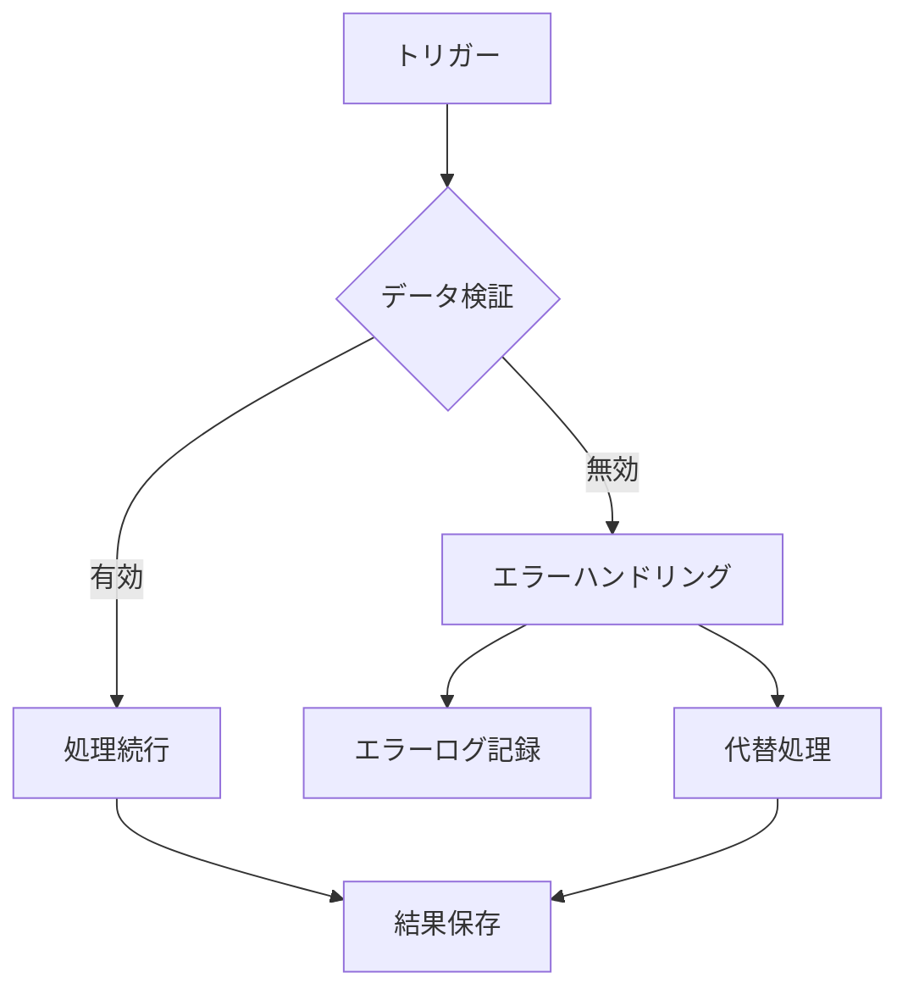

# n8nワークフローの実際の画面例と設定方法

コンセンサスモデルの全体オーケストレーションを実現するn8nの実際の画面例と設定方法について解説します。以下では、実際のn8nインターフェースのスクリーンショットと共に、ワークフローの設計・設定・実行方法を紹介します。

## n8nワークフローの基本インターフェース

n8nのワークフローエディタは直感的なビジュアルインターフェースを提供しており、ノードと呼ばれる処理単位を接続してワークフローを構築します。以下はn8nの基本的なワークフロー画面の例です：

![n8nワークフローの基本インターフェース](https://private-us-east-1.manuscdn.com/sessionFile/kBJHuLqoC19yin2vOTi1a5/sandbox/4CKWJY5Npvs7Rz9GBbyICg-images_1749384588923_na1fn_L2hvbWUvdWJ1bnR1L3NjcmVlbnNob3RzL2NvbW11bml0eV9uOG5faW9fMjAyNS0wNi0wOF8xMi0wNi0yMV85MjA5.webp?Policy=eyJTdGF0ZW1lbnQiOlt7IlJlc291cmNlIjoiaHR0cHM6Ly9wcml2YXRlLXVzLWVhc3QtMS5tYW51c2Nkbi5jb20vc2Vzc2lvbkZpbGUva0JKSHVMcW9DMTl5aW4ydk9UaTFhNS9zYW5kYm94LzRDS1dKWTVOcHZzN1J6OUdCYnlJQ2ctaW1hZ2VzXzE3NDkzODQ1ODg5MjNfbmExZm5fTDJodmJXVXZkV0oxYm5SMUwzTmpjbVZsYm5Ob2IzUnpMMk52YlcxMWJtbDBlVjl1T0c1ZmFXOWZNakF5TlMwd05pMHdPRjh4TWkwd05pMHlNVjg1TWpBNS53ZWJwIiwiQ29uZGl0aW9uIjp7IkRhdGVMZXNzVGhhbiI6eyJBV1M6RXBvY2hUaW1lIjoxNzY3MjI1NjAwfX19XX0_&Key-Pair-Id=K2HSFNDJXOU9YS&Signature=pg5QL-LsMmtlziSLfN3W~aI1zbRB36VpOpj7HawZHGodZAhDsNhyqK2ie1DjQFzpjrwf7MJZgW6GLifc89U1zdt5k-W5X1eKl88fEVuErUBkv2hN3l1aLRILqhO8h6~d4OBHyfNUXMpMOnLQ8llvNZqt3WzDR26LLR1pJpA1p7H3nqDbvIU-qwhUtG3f42VxInlfOVKu3lHqTqfe~1txQI-7c4vckfOVo6t1eU2Y3ukoLw7jfij9C8uKEyItHQ72KjiZjSXQgShuQF3waxx7NKJs8ljWPGC40LAsEpbbtnR9cHfqy6x~3dPGyPYYHEnj4ropeku9CjYIjugiICAmAQ__)

*出典: n8nコミュニティフォーラム (community.n8n.io)*

この画面では、左側にノードのリスト、中央にワークフローキャンバス、右側に選択したノードの設定パネルが表示されています。ノードはドラッグ＆ドロップで配置でき、線で接続することでデータの流れを定義します。

## コンセンサスモデル用ワークフローの設計例

コンセンサスモデルの実装では、データ収集、分析、評価、統合、出力の各コンポーネントを個別のワークフローとして設計し、それらを連携させることが効果的です。以下は、そのようなマルチステップワークフローの例です：

*出典: n8n公式ドキュメント (docs.n8n.io)*

この例では、トリガーノード（左端）から始まり、複数の処理ステップを経て最終的な出力に至るまでの流れが視覚化されています。コンセンサスモデルでも同様に、データソース接続から始まり、各視点の分析、評価、統合、出力までの一連の流れをこのように設計します。

## ノード設定の具体例

各ノードは特定の機能を担当し、それぞれ固有の設定パラメータを持ちます。以下は、Webhookトリガーノードと処理ノードの設定画面例です：

*出典: n8nワークフローテンプレート (n8n.io/workflows)*

この画面では、ノードの入力パラメータ、処理オプション、出力形式などを詳細に設定できます。コンセンサスモデルの実装では、例えばデータ収集ノードでAPIキーや接続設定、分析ノードでアルゴリズムパラメータ、評価ノードで閾値などを設定します。

## 実践的なワークフロー例：データ統合と分析

コンセンサスモデルでは、複数のデータソースからの情報を収集・統合し、分析する必要があります。以下は、そのような複雑なデータ処理ワークフローの例です：

*出典: Medium記事 (medium.com/@syrom_85473)*

この例では、複数のソースからデータを収集し、前処理、分析、結果の保存までの一連のプロセスが実装されています。コンセンサスモデルでも、テクノロジー視点、マーケット視点、ビジネス視点からのデータを同様に処理し、統合することができます。

## n8nでのエラーハンドリングとスケーラビリティ

実運用環境では、エラーハンドリングとスケーラビリティが重要です。n8nでは、条件分岐ノードやエラーハンドリングノードを使用して、これらの課題に対応できます：

このようなエラーハンドリングフローを実装することで、データ欠損やAPI障害などの問題に対して堅牢なワークフローを構築できます。

## n8nワークフローのデプロイと監視

開発したワークフローを本番環境にデプロイする際は、以下の点に注意が必要です：

1. **環境変数の設定**: API鍵やデータベース接続情報などの機密情報は環境変数として設定
2. **実行スケジュールの設定**: 定期実行が必要なワークフローのスケジュール設定
3. **監視とアラート**: 実行状況の監視とエラー発生時のアラート設定
4. **バージョン管理**: ワークフローの変更履歴の管理とロールバック手段の確保

n8nの管理画面では、これらの設定を一元的に行うことができ、複数のワークフローを効率的に運用管理できます。

## まとめ

n8nを使用したコンセンサスモデルの全体オーケストレーションでは、視覚的なワークフロー設計、柔軟なノード設定、堅牢なエラーハンドリングなどの機能を活用することで、複雑なデータ処理と意思決定支援プロセスを効率的に実装できます。実際の画面例と設定方法を参考に、自組織の要件に合わせたカスタマイズを行うことで、より効果的なコンセンサスモデルの運用が可能になります。
