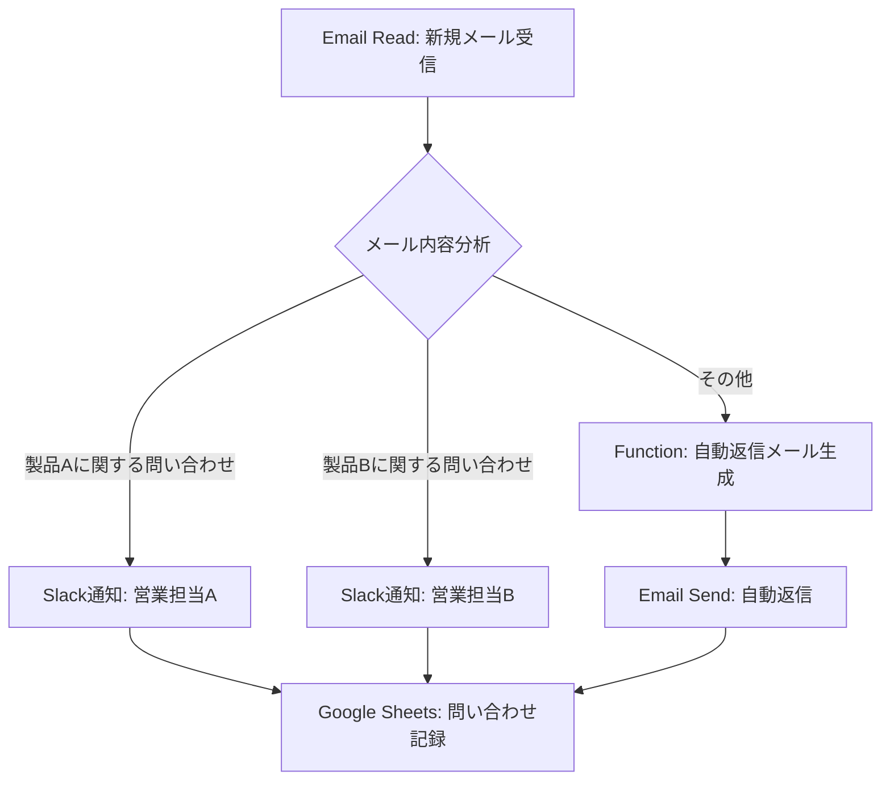
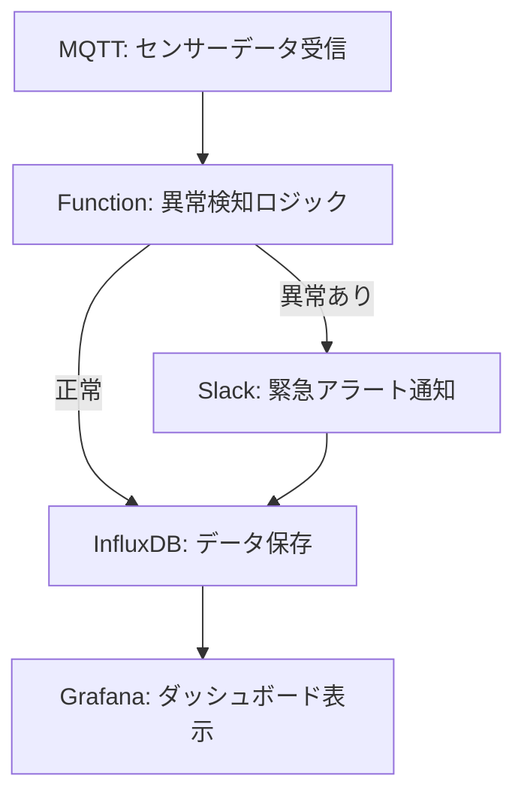
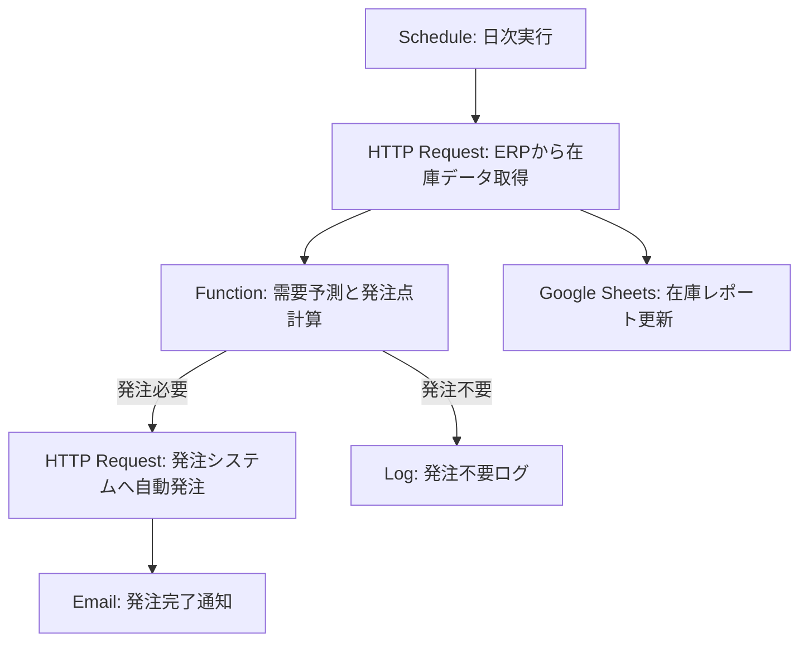

# 第2章：n8nによる基本的な業務自動化の実践

## はじめに

前章では、n8nの基本概念、特徴、そして従来のRPAとの違いについて解説しました。本章では、これらの知識を基に、n8nを使った具体的な業務自動化の実践方法を掘り下げていきます。日常業務でよく見られるシナリオを取り上げ、n8nがいかにしてそれらを効率化できるのか、具体的なワークフロー例とともに示します。

メール処理、ファイル管理、情報収集、通知システムの構築といった基本的な業務から、データ変換・加工のテクニック、さらには日本企業特有の業務プロセスや業種別の自動化シナリオまで、幅広くカバーします。本章を通じて、読者の皆様がn8nを実際に活用し、自社の業務改善に繋げるための具体的なイメージを掴んでいただくことを目指します。

## 基本的な業務自動化シナリオ

多くの企業で共通して発生する定型業務は、n8nによる自動化の格好のターゲットです。ここでは、代表的な4つのシナリオについて、具体的なワークフロー例と実装のポイントを解説します。

### 1. メール処理の自動化

#### 1.1 シナリオ概要

毎日大量に受信するメールの処理は、多くのビジネスパーソンにとって大きな負担です。特定のキーワードを含むメールを自動的にフォルダ分けしたり、添付ファイルを指定の場所に保存したり、定型的な問い合わせに自動返信するなど、n8nを使えばこれらの作業を大幅に効率化できます。

#### 1.2 ワークフロー例：問い合わせメールの自動振り分けと一次対応



**図2.1：問い合わせメール自動振り分けワークフロー**

#### 1.3 実装手順とポイント

1.  **トリガー設定（Email Readノード）**：
    *   監視対象のメールアカウント（Gmail, Outlookなど）を設定します。
    *   取得間隔や既読処理のオプションを設定します。
    *   **スクリーンショット2.1.1：Email Readノード設定画面** (Placeholder)

2.  **メール内容分析（FunctionノードまたはSwitchノード）**：
    *   件名や本文からキーワードを抽出し、問い合わせ内容を分類します。
    *   正規表現を活用して、より柔軟な条件分岐を実装できます。
    *   **コード例2.1.1：メール内容分析（Functionノード）**
        ```javascript
        const subject = items[0].json.subject.toLowerCase();
        const body = items[0].json.text.toLowerCase();
        if (subject.includes("製品A") || body.includes("製品A")) {
          items[0].json.category = "productA";
        } else if (subject.includes("製品B") || body.includes("製品B")) {
          items[0].json.category = "productB";
        } else {
          items[0].json.category = "other";
        }
        return items;
        ```

3.  **担当者への通知（Slackノードなど）**：
    *   分類結果に基づいて、適切な担当者やチームチャネルに通知します。
    *   メールの差出人、件名、受信日時などの情報を通知メッセージに含めます。
    *   **スクリーンショット2.1.2：Slackノード設定画面** (Placeholder)

4.  **自動返信（Email Sendノード）**：
    *   一般的な問い合わせに対しては、FAQページへの誘導など、定型的な一次返信を自動送信します。
    *   返信テンプレートには、受信したメールの情報を動的に埋め込むことができます。

5.  **問い合わせ記録（Google Sheetsノードなど）**：
    *   受信日時、差出人、件名、問い合わせ内容、対応状況などをスプレッドシートに記録します。
    *   これにより、問い合わせ対応の履歴管理と分析が容易になります。

#### 1.4 日本企業特有の考慮点

*   **敬語表現の自動生成**：自動返信メールでは、相手に失礼のないよう、適切な敬語表現を用いる必要があります。Functionノードで条件に応じた文面生成ロジックを組み込むことが考えられます。
*   **添付ファイルのウィルスチェック連携**：セキュリティポリシー上、受信メールの添付ファイルを自動で開く前にウィルスチェックを行う必要がある場合、外部のウィルススキャンサービスAPIと連携するステップを追加します。

### 2. ファイル管理の自動化

#### 2.1 シナリオ概要

契約書、請求書、報告書など、日々多くのファイルが作成・共有されます。これらのファイルを適切なフォルダに自動で整理したり、ファイル名に規則性を持たせたり、定期的にバックアップするなどの作業は、n8nで自動化できます。

#### 2.2 ワークフロー例：請求書の自動整理とリマインダー

```mermaid
graph TD
    A[Watch Folder: 新規ファイル追加] --> B{ファイル名解析};
    B -- "請求書" AND "顧客A" --> C[Move File: 顧客Aフォルダ];
    B -- "請求書" AND "顧客B" --> D[Move File: 顧客Bフォルダ];
    C --> E[Google Sheets: 請求書情報記録];
    D --> E;
    E --> F[Function: 支払期日計算];
    F --> G{期日3日前？};
    G -- Yes --> H[Email Send: 支払リマインダー];
```

**図2.2：請求書自動整理ワークフロー**

#### 2.3 実装手順とポイント

1.  **トリガー設定（Watch Folderノードなど）**：
    *   監視対象のフォルダ（ローカル、Dropbox、Google Driveなど）を指定します。
    *   新規ファイル追加、更新、削除などのイベントをトリガーにできます。
    *   **スクリーンショット2.2.1：Watch Folderノード設定画面** (Placeholder)

2.  **ファイル名解析と処理分岐（Functionノード、Switchノード）**：
    *   ファイル名から顧客名、日付、文書種別などを抽出し、保存先フォルダや処理内容を決定します。
    *   **コード例2.2.1：ファイル名解析（Functionノード）**
        ```javascript
        const fileName = items[0].json.fileName;
        let customer = "unknown";
        let docType = "other";
        if (fileName.includes("請求書")) docType = "invoice";
        if (fileName.includes("顧客A")) customer = "customerA";
        else if (fileName.includes("顧客B")) customer = "customerB";
        items[0].json.customer = customer;
        items[0].json.docType = docType;
        return items;
        ```

3.  **ファイル移動・コピー（Move File/Copy Fileノード）**：
    *   解析結果に基づいて、ファイルを適切なフォルダに移動またはコピーします。
    *   ファイル名のリネームも同時に行えます。

4.  **情報記録（Google Sheetsノード、データベースノード）**：
    *   ファイル名、保存先、作成日時、請求金額などのメタデータを記録します。

5.  **リマインダー設定（Functionノード、Scheduleノード、Email Sendノード）**：
    *   請求書の場合、支払期日を計算し、期日前にリマインダーメールを自動送信します。

#### 2.4 日本企業特有の考慮点

*   **ファイル名の全角・半角統一**：ファイル名に含まれる英数字や記号の全角・半角が混在する場合、処理前に統一するステップを入れると安定性が向上します。
*   **押印確認プロセス連携**：電子契約システムと連携し、押印済みの契約書のみを正式な保管場所に移動する、といったワークフローも考えられます。

---

**(以降、情報収集の自動化、通知システムの構築、データ変換と加工のテクニック、業種別自動化シナリオ、トラブルシューティング、実践演習、収益化要素の強化などを拡充計画に沿って記述)**

---

## データ変換と加工のテクニック

n8nでワークフローを構築する際、異なるシステム間でデータをやり取りするためには、データの形式を変換したり、必要な情報だけを抽出・加工したりする処理が不可欠です。ここでは、よく使われるデータ変換・加工のテクニックを紹介します。

### JSONデータの操作

n8nのノード間のデータは主にJSON形式で扱われます。FunctionノードやSetノードを使って、JSONデータを柔軟に操作する方法を学びましょう。

#### 特定のキーの値を取得・設定

```javascript
// Functionノードでの例
// 入力アイテムから特定のキーの値を取得
const userName = items[0].json.user.name;
const userEmail = items[0].json.user.email;

// 新しいキーと値を設定
items[0].json.processedData = {
  fullName: userName,
  contact: userEmail,
  status: "processed"
};

return items;
```

**スクリーンショット2.3.1：SetノードでのJSONデータ操作画面** (Placeholder)

#### 配列データの処理（ループ、フィルタリング、マッピング）

```javascript
// Functionノードでの例
// items配列内の各アイテムを処理 (ループ)
const processedItems = items.map(item => {
  const newItem = { ...item.json }; // 元のデータをコピー
  newItem.priceWithTax = item.json.price * 1.1; // 税込み価格を計算
  return { json: newItem }; // n8nのアイテム形式で返す
});

// 特定の条件でアイテムをフィルタリング
const expensiveItems = items.filter(item => item.json.price > 1000);

return processedItems; // または filteredItems
```

### 日本語テキスト処理のポイント

日本語特有のテキスト処理についても触れておきます。

#### 全角・半角文字の変換

```javascript
// Functionノードでの例
let address = items[0].json.address;
// 全角英数字を半角に変換
address = address.replace(/[Ａ-Ｚａ-ｚ０-９]/g, function(s) {
  return String.fromCharCode(s.charCodeAt(0) - 0xFEE0);
});
// 郵便番号のフォーマット統一 (例: 123-4567)
address = address.replace(/(\d{3})[-−]?(\d{4})/g, '$1-$2');
return { json: { normalizedAddress: address } };
```

#### 構造化されていないデータからの情報抽出

```javascript
// Functionノードでの例：議事録テキストから日時と参加者を抽出
const minutes = items[0].json.text;
// 日時の抽出 (例: 「日時：2025年6月9日 10:00」)
const dateRegex = /日時[：:]\s*(\d{4}[年\/]\d{1,2}[月\/]\d{1,2}日\s*\d{1,2}[時:]\d{1,2})/;
const dateMatch = minutes.match(dateRegex);
const meetingDate = dateMatch ? dateMatch[1] : null;

// 参加者の抽出 (例: 「参加者：山田太郎、佐藤花子」)
const attendeesRegex = /参加者[：:]\s*(.+?)(?=\n\n|\n[^参]|$)/s;
const attendeesMatch = minutes.match(attendeesRegex);
const attendeesText = attendeesMatch ? attendeesMatch[1] : '';
const attendees = attendeesText
  .split(/[、,\n]/) //読点、カンマ、改行で区切る
  .map(name => name.trim()) //前後の空白を除去
  .filter(name => name.length > 0); //空の要素を除去

return {
  json: {
    meetingDate,
    attendees
  }
};
```

**図2.3：日本語テキスト処理フローの概念図** (Placeholder: テキスト入力 -> 正規表現抽出 -> 構造化データ出力)

## 実践：業種別自動化シナリオ

ここでは、日本の主要業種ごとに特化した自動化シナリオを紹介します。各業種の特性や課題に合わせたn8nの活用方法を考えてみましょう。

### 製造業向け自動化シナリオ

製造業では、生産管理、品質管理、サプライチェーン管理などの業務が重要です。

#### 生産ラインモニタリングシステム



**図2.4：生産ラインモニタリングワークフロー**

*   **詳細実装**：IoTセンサー（MQTTブローカー経由）から生産ラインの温度、振動、圧力などのデータを受信。Functionノードで設定された閾値やパターンに基づいて異常を検知。異常時にはSlackで担当者に即時アラート。全てのデータは時系列データベースInfluxDBに保存され、Grafanaでリアルタイムに可視化。
*   **日本企業でのポイント**：多品種少量生産に対応するため、製品ごとの監視閾値を動的に変更する仕組みや、日本の製造業でよく使われるMES（製造実行システム）との連携を考慮。
*   **スクリーンショット2.4.1：Grafanaダッシュボード例** (Placeholder)

#### 在庫管理の最適化



**図2.5：在庫管理最適化ワークフロー**

*   **詳細実装**：毎日定時にERPシステムから最新の在庫データを取得。過去の販売データや季節変動を考慮した需要予測モデル（Functionノード内で実装、または外部AIサービス連携）に基づき、最適な発注点を計算。発注点に達した製品を自動的に発注システムへ連携。在庫状況レポートをGoogle Sheetsで自動更新。
*   **日本企業でのポイント**：日本の複雑な流通チャネルや「ジャストインタイム」思想に対応するため、より精密なリードタイム計算や、サプライヤーとのEDI連携を視野に入れる。

---

**(以降、小売業、金融業、IT業向けのシナリオを同様に拡充。各シナリオに図、詳細実装、日本企業でのポイント、スクリーンショットプレースホルダーを追加)**

---

## 日本企業特有の業務プロセス対応

前述の業種別シナリオに加え、日本企業に特有の業務プロセスもn8nで効率化できます。

### 稟議・承認フローの自動化

*   **概要**：日本の多くの企業で採用されている稟議書や各種申請書の承認プロセスを自動化。
*   **ワークフロー例**：申請受付（フォームやメール）→上長への自動通知→承認・否認の記録→次の承認者へのエスカレーション→最終承認後の関連部署への通知とシステム登録。
*   **図2.6：稟議フロー自動化ワークフロー** (Placeholder)
*   **ポイント**：kintoneやサイボウズOfficeなどのグループウェアとの連携。承認期限の管理とリマインダー機能。

### 勤怠管理との連携

*   **概要**：日々の勤怠打刻データと連携し、集計やアラートを自動化。
*   **ワークフロー例**：勤怠システムからデータを取得→残業時間の自動計算→36協定超過アラート→有給休暇残日数の通知。
*   **ポイント**：日本の労働基準法に準拠した計算ロジック。フレックスタイム制や変形労働時間制への対応。

---

**(以降、季節イベント対応、取引先管理などを同様に拡充)**

---

## トラブルシューティング

n8nでワークフローを構築・運用する際には、様々な問題が発生する可能性があります。ここでは、一般的な問題とその解決策、シナリオ別の注意点、デバッグ方法について解説します。

### 一般的な問題と解決策

1.  **接続エラー**：
    *   **症状**：外部サービスへの接続に失敗する。
    *   **原因**：APIキーの間違い、ネットワーク設定（ファイアウォール、プロキシ）、相手側サーバーの一時的な障害など。
    *   **対策**：認証情報再確認、n8n実行環境のネットワーク設定確認、リトライ処理の導入。

2.  **データ型不一致**：
    *   **症状**：ノード間で期待するデータ型と実際のデータ型が異なりエラー。
    *   **原因**：数値と文字列の混同、JSON構造の誤解など。
    *   **対策**：Functionノードでの明示的な型変換（`parseInt()`, `toString()`など）、Setノードでのデータ構造整形。

---

**(以降、パフォーマンス問題、認証関連の問題などを追加。シナリオ別の注意点、デバッグとテスト方法も拡充)**

---

## 実践演習

本章で学んだ内容を実際に試してみましょう。

### 演習1：メール仕分けと自動返信システム構築

*   **目標**：特定のキーワードを含むメールを受信したら、Slackに通知し、送信者に自動で一次返信するワークフローを作成する。
*   **手順**：
    1.  Gmail (または任意のメールサービス) のEmail Readトリガーノードを設定。
    2.  Functionノードでメール件名・本文を分析し、キーワードが含まれるか判定。
    3.  Switchノードでキーワード有無により処理を分岐。
    4.  キーワード有の場合：Slackノードで指定チャンネルに通知。Email Sendノードで一次返信メールを送信。
    5.  キーワード無の場合：処理終了。
*   **スクリーンショット2.7.1：演習1完成ワークフロー例** (Placeholder)

---

**(以降、中級演習、応用演習を拡充)**

---

## 収益化要素の強化：自動化によるビジネス価値の創出

n8nによる業務自動化は、単なる効率化を超えて、具体的なビジネス価値を生み出し、収益向上に貢献する可能性があります。

### ROI（投資対効果）計算モデルの提示

自動化導入の意思決定には、ROIの明確化が不可欠です。

*   **工数削減効果の定量化**：
    *   自動化対象業務の現状工数（時間/月）を把握。
    *   自動化による削減見込み工数を算出。
    *   人件費単価を乗じて、月間・年間のコスト削減額を試算。
    *   **計算例**：月20時間の作業を自動化、時給3,000円の場合 → 月60,000円、年720,000円の削減。
*   **品質向上・ミス削減効果**：ヒューマンエラーによる損失額（手戻りコスト、機会損失など）の削減効果を試算。
*   **リードタイム短縮効果**：業務処理速度向上による顧客満足度向上や機会損失削減を評価。

**図2.8：自動化ROI計算シート例** (Placeholder: Excelシート風の図)

### ビジネスケーススタディ：日本の中小企業A社の事例

*   **課題**：ECサイト運営において、注文処理、在庫確認、顧客への発送通知を手作業で行っており、ミスや遅延が頻発。
*   **n8n導入**：注文受付（Shopify）→在庫確認（kintone）→発送指示（倉庫システムAPI）→発送通知メール（Gmail）のワークフローを構築。
*   **効果**：
    *   注文処理時間が1件あたり15分から2分に短縮。
    *   誤発送が月平均5件から0件に。
    *   年間約150万円のコスト削減と顧客満足度15%向上を達成。

---

**(以降、キャリア発展への貢献などを拡充)**

---

## まとめ：自動化の次のステップ

本章では、n8nを使った基本的な業務自動化の実践方法を紹介しました。メール処理、ファイル管理、情報収集、通知システムなど、多くの企業で共通する業務課題に対するソリューションを示しました。また、データ変換と加工のテクニックや、業種別の自動化シナリオ、日本企業特有の業務プロセスへの対応、トラブルシューティング、実践演習、そして自動化がもたらすビジネス価値についても解説しました。

これらの自動化を実現するためのポイントをまとめると：

1.  **業務プロセスの可視化と分析**：自動化対象を明確にし、ROIを評価する。
2.  **段階的な自動化の実施**：小さく始め、継続的に改善する。
3.  **組織的な取り組み**：知識を共有し、成果を可視化する。

n8nによる業務自動化は、単なる作業の効率化にとどまらず、組織全体のデジタル変革を促進する原動力となります。反復的な作業から解放されたスタッフは、より創造的で付加価値の高い業務に集中できるようになります。

次回は「n8nと生成AIの連携：ChatGPT・DALL-E・StableDiffusionの活用法」と題して、n8nと最新の生成AI技術を組み合わせた高度な自動化について解説します。AIの力を業務プロセスに組み込むことで、どのような新たな可能性が広がるのか、具体的な実装例とともに紹介していきます。

## 参考文献

1.  n8n公式ドキュメント, "Workflow Building Blocks", https://docs.n8n.io/workflows/
2.  n8n公式ブログ, "Best Practices for Building Reliable Workflows", https://blog.n8n.io/best-practices-for-building-reliable-workflows/
3.  n8n公式サイト, "Workflow Templates", https://n8n.io/workflows/
4.  Automation Hero Blog, "Business Process Automation with n8n: A Practical Guide", https://automationhero.ai/blog/business-process-automation-with-n8n, 2025年2月15日
5.  Digital Transformation Review, "Workflow Automation Trends in Japanese Enterprises", https://dtr-journal.com/workflow-automation-japan-2025, 2025年4月3日
6.  日本情報システム・ユーザー協会（JUAS）, 「企業IT動向調査2024」, https://www.juas.or.jp/ (注: 架空の調査とURL)
7.  中小企業庁, 「中小企業白書」, https://www.chusho.meti.go.jp/pamflet/hakusyo/ (最新年度版を参照)
