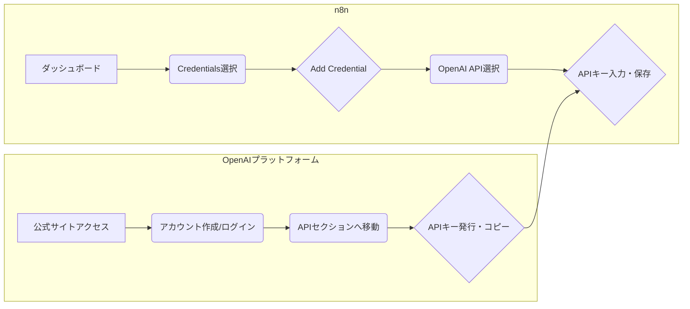

# 第3章：n8nと生成AIの連携：ChatGPT・DALL-E・StableDiffusionの活用法

## はじめに

近年、生成AI技術は目覚ましい進化を遂げ、ビジネスの様々な場面でその活用が期待されています。特に、ChatGPTのような大規模言語モデル（LLM）、DALL-EやStable Diffusionのような画像生成AIは、コンテンツ作成、アイデア発想、データ分析など、多岐にわたる業務を革新する可能性を秘めています。本章では、これらの強力な生成AIツールと、ノーコード・ローコードでワークフローを自動化できるn8nを連携させる方法について、具体的な手順と実践的な活用例を交えながら詳細に解説します。

n8nと生成AIを組み合わせることで、従来は専門的な知識やプログラミングスキルが必要だった高度な自動化処理が、より手軽に実現可能になります。例えば、顧客からの問い合わせメールの内容をChatGPTで解析し、適切な回答案を自動生成するワークフローや、ブログ記事のテーマに基づいてDALL-Eでアイキャッチ画像を自動生成するワークフローなどが考えられます。本章を通じて、読者の皆様がこれらの技術を自身の業務に取り入れ、生産性向上や新たな価値創出を実現するための一助となることを目指します。

本章では、まずn8nと各生成AIツール（ChatGPT、DALL-E、Stable Diffusion）の連携における基本的な概念とアーキテクチャを説明します。次に、それぞれのツールとの具体的な連携設定方法、APIキーの取得と管理、基本的なワークフローの構築手順を解説します。さらに、日本市場特有の活用例や課題、日本語処理における注意点、実践的な演習、トラブルシューティング、そして最新動向と将来展望についても触れていきます。最後に、これらの連携を通じて得られるビジネス価値や収益化のポイントについても考察します。

## 1. n8nと生成AI連携の基礎

### 1.1. 生成AI連携の概要とアーキテクチャ

n8nと生成AIの連携は、n8nの持つ柔軟なワークフロー構築能力と、生成AIの持つ高度なコンテンツ生成・分析能力を組み合わせることで、これまでにない強力な自動化ソリューションを実現します。基本的なアーキテクチャとしては、n8nがトリガー（例：新しいメールの受信、特定の日時）を検知し、ワークフローを開始します。その後、n8n内のノードが生成AIのAPIを呼び出し、必要なデータ（例：メール本文、画像生成の指示）を送信します。生成AIは受け取ったデータに基づいて処理を行い、結果（例：回答案のテキスト、生成された画像）をn8nに返します。n8nは受け取った結果をさらに加工したり、他のシステム（例：Slack通知、データベース保存）に連携したりします。

この連携の鍵となるのは、各生成AIツールが提供するAPI（Application Programming Interface）です。APIを利用することで、n8nは外部のプログラムから生成AIの機能を利用できます。n8nには、HTTP Requestノードのような汎用的なAPI連携ノードや、特定のサービス（例：OpenAIノード）に特化したノードが用意されており、これらを使って比較的容易に連携を構築できます。

```mermaid
graph TD
    A[トリガーイベント<br>(例: 新規メール受信)] --> B(n8nワークフロー開始);
    B --> C{データ準備・加工<br>(例: メール本文抽出)};
    C --> D[生成AI API呼び出し<br>(例: ChatGPT API)];
    D -- リクエスト送信 --> E(生成AI処理<br>(例: 回答案生成));
    E -- レスポンス受信 --> F[n8nワークフロー<br>(結果処理)];
    F --> G{後続処理<br>(例: Slack通知, DB保存)};
```
*図3.1: n8nと生成AIの連携アーキテクチャ概念図*

このアーキテクチャのメリットは、プログラミングスキルがなくても、GUIベースで直感的に高度なAI連携ワークフローを設計・実行できる点です。また、n8nの豊富なノード群を活用することで、生成AIの処理結果を様々な業務システムとシームレスに連携させることが可能です。

### 1.2. 主要な生成AIツールとn8nの相性

現在、様々な生成AIツールが登場していますが、本章では特に代表的な以下の3つのツールとn8nの連携に焦点を当てます。

- **ChatGPT (OpenAI)**：自然言語処理に特化した大規模言語モデルです。テキスト生成、要約、翻訳、質疑応答など、幅広いタスクに対応できます。n8nとの連携では、顧客対応の自動化、レポート作成支援、コンテンツマーケティングなどでの活用が期待されます。OpenAIは公式のAPIを提供しており、n8nのOpenAIノードやHTTP Requestノードを使って比較的容易に連携できます。

- **DALL-E (OpenAI)**：テキストプロンプトから画像を生成するAIモデルです。ブログ記事のアイキャッチ画像、広告バナー、プレゼンテーション資料のイラストなどを自動生成できます。n8nとの連携では、コンテンツ作成プロセスの自動化や、パーソナライズされた画像生成などに活用できます。こちらもOpenAI APIを通じて連携可能です。

- **Stable Diffusion (Stability AIなど)**：オープンソースの画像生成AIモデルです。DALL-Eと同様にテキストから画像を生成できますが、オープンソースであるため、より柔軟なカスタマイズやローカル環境での利用も可能です。n8nとの連携では、APIを提供するサービス（例：Stability AI API、Hugging Face API）を利用するか、ローカル環境でAPIサーバーを構築して連携する方法があります。

これらのツールは、それぞれ得意とする分野や特性が異なりますが、n8nの柔軟なワークフロー構築能力と組み合わせることで、その可能性を最大限に引き出すことができます。例えば、ChatGPTで生成したブログ記事の概要に基づいて、DALL-EやStable Diffusionで関連画像を自動生成し、それらをまとめてCMSに投稿する、といった複合的なワークフローもn8nで実現可能です。

### 1.3. APIキーの取得と管理の重要性

生成AIツールとn8nを連携させるためには、各AIサービスが提供するAPIキーが不可欠です。APIキーは、プログラムがそのAIサービスを利用する際の認証情報として機能し、不正なアクセスを防ぐ役割を果たします。APIキーの取得方法はサービスごとに異なりますが、通常は各サービスの開発者向けウェブサイトでアカウント登録を行い、APIキーを発行する手続きが必要です。

APIキーは非常に重要な情報であり、その管理には細心の注意が必要です。APIキーが第三者に漏洩すると、不正利用されたり、意図しない高額なAPI利用料が発生したりするリスクがあります。n8nでAPIキーを扱う際には、以下の点に注意して管理することが推奨されます：

- **認証情報（Credentials）機能の活用**：n8nには、APIキーなどの機密情報を安全に保存・管理するための認証情報機能があります。ワークフロー内に直接APIキーを記述するのではなく、この機能を利用してAPIキーを登録し、ワークフローからはその認証情報を参照するようにします。
- **環境変数の利用**：サーバー環境でn8nを運用する場合、APIキーを環境変数として設定し、n8nからそれを読み込む方法も有効です。これにより、ワークフローファイル自体にAPIキーが含まれることを防げます。
- **アクセス権限の適切な設定**：n8nのインスタンスやワークフローへのアクセス権限を適切に設定し、権限のないユーザーがAPIキーにアクセスできないようにします。
- **定期的なキーのローテーション**：可能であれば、定期的にAPIキーを新しいものに更新（ローテーション）することで、万が一キーが漏洩した場合のリスクを低減できます。
- **利用状況のモニタリング**：各AIサービスのダッシュボードでAPIの利用状況を定期的に確認し、不審なアクティビティがないかを監視します。

APIキーの適切な管理は、安全かつ持続的にn8nと生成AIの連携を活用するための基本であり、非常に重要なポイントです。

## 2. ChatGPTとの連携実践

### 2.1. OpenAI APIキーの取得とn8nへの設定

ChatGPTを利用するためには、まずOpenAIのAPIキーを取得する必要があります。以下の手順でAPIキーを取得し、n8nに設定します。

1. **OpenAIアカウントの作成とログイン**：OpenAIの公式サイト（[https://openai.com/](https://openai.com/)）にアクセスし、アカウントを作成またはログインします。
2. **APIキーの発行**：ログイン後、APIセクションに移動し、新しいAPIキーを発行します。発行されたAPIキーは一度しか表示されない場合があるため、必ず安全な場所にコピーして保管してください。
3. **n8nでの認証情報作成**：n8nのダッシュボード左側のメニューから「Credentials」を選択し、「Add credential」をクリックします。「OpenAI API」を選択し、先ほど取得したAPIキーを「API Key」フィールドに入力して保存します。

これで、n8nのワークフロー内でOpenAIノードを使用する際に、この認証情報を選択できるようになります。


*図3.2: OpenAI APIキー取得とn8n設定フロー*

### 2.2. 基本的なテキスト生成ワークフロー

ChatGPTと連携した最も基本的なワークフローは、与えられたプロンプトに基づいてテキストを生成するものです。例えば、以下のようなワークフローが考えられます。

1. **トリガーノードの配置**：手動実行（Manual）、スケジュール実行（Cron）、またはWebhookなど、ワークフローを開始するトリガーを設定します。
2. **プロンプト設定ノードの配置**：Setノードなどを使用し、ChatGPTに送信するプロンプト（指示文）を定義します。例えば、「n8nのメリットについて300字で説明してください」といったプロンプトを設定できます。
3. **OpenAIノードの配置**：
    - **Authentication**：先ほど作成したOpenAIの認証情報を選択します。
    - **Resource**：「Chat」を選択します。
    - **Operation**：「Send Message」を選択します。
    - **Model**：使用するモデル（例：`gpt-3.5-turbo`、`gpt-4`）を選択します。
    - **Messages**：「Add Message Item」をクリックし、「Role」を「user」、「Content」に前のSetノードで設定したプロンプトを指定します。
4. **結果処理ノードの配置**：生成されたテキストをSlackに通知したり、ファイルに保存したりするなど、目的に応じた処理を追加します。

このワークフローを実行すると、OpenAIノードがChatGPT APIを呼び出し、プロンプトに基づいて生成されたテキストが取得できます。

### 2.3. 日本語プロンプトの設計と最適化

ChatGPTを日本語で効果的に活用するためには、プロンプトの設計が非常に重要です。日本語は文脈依存性が高く、曖昧な表現も多いため、AIが意図を正確に理解し、期待通りの出力を得るためには、明確かつ具体的なプロンプトを作成する必要があります。以下は、日本語プロンプト設計のポイントです。

- **明確な指示**：何を、どのように、どの程度の長さで生成してほしいのかを具体的に記述します。例えば、「新製品Xのキャッチコピーを3案、それぞれ20字以内で、ターゲット層は30代女性、製品の特徴である「手軽さ」と「高品質」を盛り込んでください」のように具体的に指示します。
- **役割（ロール）の設定**：AIに特定の役割（例：「あなたは経験豊富なマーケターです」「あなたは親切なカスタマーサポート担当者です」）を与えることで、出力のトーンやスタイルを制御できます。
- **出力形式の指定**：箇条書き、表形式、JSON形式など、期待する出力形式を明示することで、後続の処理が容易になります。
- **制約条件の付与**：文字数制限、含めるべきキーワード、避けるべき表現などを指定します。
- **段階的な指示（Few-shot prompting）**：複雑なタスクの場合、いくつかの例（入力と期待される出力のペア）をプロンプトに含めることで、AIの理解度を高めることができます。
- **反復的な改善**：最初から完璧なプロンプトを作成するのは難しいため、何度か試行錯誤し、出力を評価しながらプロンプトを改善していくプロセスが重要です。

例えば、日本企業向けのメール文面を生成する場合、「あなたは日本のビジネス習慣を熟知した秘書です。以下の要件で、取引先の山田様宛の会議日程調整メールを作成してください。件名：〇〇会議の日程調整のお願い。本文：丁寧な言葉遣いで、候補日を3つ提示し、返信をお願いする内容。署名：株式会社△△ 営業部 佐藤」といった具体的なプロンプトが有効です。

### 2.4. 活用例：顧客問い合わせメールへの自動応答案生成

日本企業における具体的な活用例として、顧客からの問い合わせメールに対して、ChatGPTが自動で応答案を生成するワークフローを紹介します。

1. **トリガー**：新しいメールの受信（例：Gmailノード、IMAPノード）。
2. **メール内容の抽出**：受信したメールから、件名、本文、送信者情報などを抽出します。
3. **問い合わせ内容の分類（オプション）**：CodeノードやSwitchノードを使い、問い合わせ内容を事前に分類します（例：製品に関する質問、料金に関する質問、クレームなど）。これにより、より適切なプロンプトを生成できます。
4. **プロンプト生成**：抽出したメール本文と分類結果に基づいて、ChatGPTに応答案生成を依頼するプロンプトを動的に作成します。例えば、「顧客からの問い合わせメールです。内容は『製品Aの使い方がわからない』です。丁寧かつ分かりやすい言葉で、製品AのオンラインマニュアルのURLを案内する返信案を作成してください。」といったプロンプトを生成します。
5. **OpenAIノード（ChatGPT）**：生成したプロンプトをChatGPTに送信し、応答案を取得します。
6. **応答案の確認・編集インターフェース（オプション）**：生成された応答案をそのまま送信するのではなく、一度担当者が確認・編集できるような仕組みを挟むことが推奨されます（例：n8nのWaitノードと手動承認ステップ、または外部のタスク管理ツールとの連携）。
7. **応答メール送信または担当者への通知**：確認・編集された応答案を顧客にメールで送信するか、担当者に通知して手動での対応を促します。

```mermaid
graph TD
    A[新規メール受信<br>(Gmailトリガー)] --> B{メール内容抽出};
    B --> C(問い合わせ内容分類<br>(Switchノード));
    C -- 製品問合せ --> D1[プロンプト生成<br>(製品マニュアル案内)];
    C -- 料金問合せ --> D2[プロンプト生成<br>(料金ページ案内)];
    D1 --> E(OpenAIノード<br>ChatGPT応答案生成);
    D2 --> E;
    E --> F{応答案確認・編集<br>(手動承認ステップ)};
    F -- 承認 --> G[メール送信<br>(Gmailノード)];
    F -- 修正要 --> H[担当者へ通知<br>(Slackノード)];
```
*図3.3: 顧客問い合わせメール自動応答案生成ワークフロー例*

このワークフローにより、顧客対応の初動を迅速化し、担当者の負荷を軽減できます。特に、定型的な問い合わせに対しては大幅な効率化が期待できます。

## 3. DALL-E / Stable Diffusionとの連携実践

### 3.1. 画像生成AI APIの概要と設定

DALL-EやStable Diffusionのような画像生成AIとn8nを連携させることで、テキストプロンプトに基づいて画像を自動生成するワークフローを構築できます。

- **DALL-E (OpenAI)**：OpenAI APIを通じて利用できます。ChatGPTと同様に、OpenAIの認証情報をn8nに設定し、OpenAIノードのResourceで「Image」、Operationで「Create」を選択することで画像を生成できます。プロンプト、生成枚数、画像サイズなどを指定します。

- **Stable Diffusion**：
    - **Stability AI API**：Stability AIが提供する公式APIを利用する方法です。APIキーを取得し、n8nのHTTP Requestノードを使ってAPIエンドポイントにリクエストを送信します。プロンプト、画像サイズ、スタイルなどをパラメータとして指定します。
    - **Hugging Face API**：Hugging FaceのInference APIを通じて、公開されているStable Diffusionモデルを利用できます。Hugging FaceのAPIキーを取得し、HTTP Requestノードで連携します。
    - **ローカルAPIサーバー**：Automatic1111 WebUIなど、Stable Diffusionをローカル環境で実行し、API機能を有効にすることで、n8nからローカルのStable Diffusionにリクエストを送信できます。この場合、n8nがローカルAPIサーバーにアクセスできるネットワーク設定が必要です。

いずれの方法でも、APIキーの取得とn8nへの適切な設定（認証情報またはHTTP Requestノードのヘッダー設定）が連携の第一歩となります。

### 3.2. テキストプロンプトからの画像生成ワークフロー

基本的な画像生成ワークフローは以下のようになります。

1. **トリガーノード**：手動実行、スケジュール実行、または他のシステムからのWebhookなど。
2. **プロンプト設定ノード**：画像生成のためのテキストプロンプトを定義します。例えば、「夕暮れ時の未来都市、空飛ぶ車、ネオンスタイル、フォトリアリスティック」といったプロンプトを設定します。
3. **画像生成ノード**：
    - **DALL-Eの場合**：OpenAIノードを使用し、プロンプト、画像サイズ（例：`1024x1024`）、生成枚数などを設定します。
    - **Stable Diffusion (API経由)の場合**：HTTP Requestノードを使用し、APIエンドポイント、認証ヘッダー、リクエストボディ（プロンプト、画像サイズ、ステップ数、CFGスケールなどを含むJSON形式）を設定します。
4. **画像処理・保存ノード**：生成された画像のURLやバイナリデータを取得し、ファイルとして保存したり、他のシステムにアップロードしたりします。n8nのWrite Binary Fileノードや、各種クラウドストレージ連携ノード（例：AWS S3、Google Drive）が利用できます。

```mermaid
graph TD
    A[トリガー] --> B(プロンプト設定<br>'夕暮れの未来都市...');
    subgraph DALL-E連携
        B --> C1[OpenAIノード<br>(Image Create)];
        C1 --> D{画像URL取得};
    end
    subgraph Stable Diffusion連携 (API)
        B --> C2[HTTP Requestノード<br>(Stability AI API)];
        C2 --> D;
    end
    D --> E[画像保存<br>(Write Binary File)];
    E --> F(後続処理<br>例: CMSアップロード);
```
*図3.4: テキストプロンプトからの画像生成ワークフロー例*

### 3.3. 日本語プロンプトと画像スタイルの調整

画像生成AIで期待通りの画像を得るためには、プロンプトの工夫が不可欠です。日本語プロンプトを使用する場合、AIが意図を正確に解釈できるように、以下の点を考慮します。

- **具体的かつ詳細な記述**：対象物、背景、構図、色調、雰囲気などを具体的に記述します。「桜並木の下を歩く着物姿の女性、背景には富士山、柔らかな春の日差し、アニメスタイル」のように詳細に記述します。
- **画風・スタイルの指定**：フォトリアリスティック、油絵風、水彩画風、アニメスタイル、ピクセルアートなど、具体的な画風やアーティスト名をプロンプトに含めることで、画像のスタイルを制御できます。
- **ネガティブプロンプトの活用**：生成してほしくない要素（例：低品質、ぼやけた画像、余分な手足）をネガティブプロンプトとして指定することで、出力品質を向上させることができます（主にStable Diffusionで有効）。
- **キーワードの順序と重み付け**：重要なキーワードをプロンプトの前方に配置したり、特定のキーワードを強調したりすることで、生成結果に影響を与えることができます。
- **試行錯誤とイテレーション**：DALL-EやStable Diffusionは、同じプロンプトでも実行ごとに異なる画像を生成することがあります。期待通りの画像が得られるまで、プロンプトを微調整しながら何度か試行錯誤することが重要です。

日本語のニュアンスを活かしたプロンプトや、日本の美的感覚に合ったスタイルを指定することで、より魅力的な画像を生成できます。

### 3.4. 活用例：ブログ記事用アイキャッチ画像の自動生成

ブログ記事の内容に基づいて、アイキャッチ画像を自動生成するワークフローの例です。

1. **トリガー**：新しいブログ記事の作成（例：WordPressノード、RSSフィード、手動実行など）。
2. **記事内容の分析・キーワード抽出**：作成されたブログ記事のタイトルや本文から、主要なキーワードやテーマを抽出します。これには、n8nのCodeノードで簡単なテキスト処理を行ったり、ChatGPT連携で要約やキーワード抽出を行ったりする方法があります。
3. **画像生成プロンプトの作成**：抽出したキーワードやテーマに基づいて、画像生成AI向けのプロンプトを動的に作成します。例えば、記事のテーマが「春の京都旅行」であれば、「春の京都、満開の桜、清水寺、観光客、明るい雰囲気、写真風」といったプロンプトを生成します。
4. **画像生成ノード（DALL-EまたはStable Diffusion）**：作成したプロンプトを画像生成AIに送信し、アイキャッチ画像の候補をいくつか生成します。
5. **画像選択（オプション）**：生成された複数の画像候補から、最適なものを手動で選択するか、あるいは何らかの基準（例：AIによる画像評価スコア）で自動選択するステップを設けます。
6. **画像のリサイズ・最適化（オプション）**：生成された画像をブログに適したサイズにリサイズしたり、ファイルサイズを最適化したりします（例：n8nのEdit Imageノード）。
7. **ブログへの画像アップロードと設定**：選択・最適化された画像をブログ記事のアイキャッチとしてアップロードし、記事に設定します（例：WordPressノード）。

このワークフローにより、ブログ運営における画像作成の手間を大幅に削減し、記事コンテンツの魅力向上に貢献できます。

## 4. 実践演習とトラブルシューティング

### 4.1. 演習1：ChatGPTによるメール件名自動生成

**目標**：メール本文を入力すると、ChatGPTが適切なメール件名を3案生成するn8nワークフローを作成する。

**手順**：
1. 手動トリガー（Manual）を配置。
2. Setノードを配置し、`email_body`という名前でメール本文のサンプルテキスト（例：「来週の月曜日に予定しておりました定例会議ですが、都合により翌日の火曜日に変更させていただきたく存じます。ご都合いかがでしょうか。」）を設定。
3. 別のSetノードを配置し、`prompt`という名前でChatGPTへの指示プロンプトを生成。「以下のメール本文に最適な件名を3案、それぞれ15字以内で提案してください。
メール本文：
{{ $json.email_body }}」と設定。
4. OpenAIノードを配置。
    - 認証情報：作成済みのOpenAI認証情報を選択。
    - Resource: Chat, Operation: Send Message.
    - Model: `gpt-3.5-turbo`.
    - Messages: Role `user`, Content `{{ $json.prompt }}`.
5. 結果表示用にNoOpノードなどを配置し、OpenAIノードの出力を確認。

**期待される結果**：OpenAIノードの出力として、メール本文に基づいた件名案が3つ生成される（例：「定例会議日程変更のお願い」「来週の会議日程について」「会議日程変更のご相談」など）。

**トラブルシューティングのヒント**：
- APIキーが正しく設定されているか確認。
- プロンプト内の変数参照（`{{ $json.email_body }}`）が正しいか確認。
- OpenAIのAPI利用状況やエラーメッセージを確認。

### 4.2. 演習2：DALL-Eによる製品紹介用画像生成

**目標**：製品名と特徴を入力すると、DALL-Eがその製品のイメージ画像を生成するn8nワークフローを作成する。

**手順**：
1. 手動トリガーを配置。
2. Setノードを配置し、`product_name`（例：「スマートコーヒーメーカー」）と`product_features`（例：「AI搭載、自動抽出、ミニマルデザイン、ステンレス製」）を設定。
3. 別のSetノードを配置し、`image_prompt`という名前でDALL-Eへの画像生成プロンプトを生成。「製品名：{{ $json.product_name }}、特徴：{{ $json.product_features }}。この製品の広告用イメージ画像を生成してください。背景はモダンなキッチン、明るい自然光。」と設定。
4. OpenAIノードを配置。
    - 認証情報：OpenAI認証情報を選択。
    - Resource: Image, Operation: Create.
    - Prompt: `{{ $json.image_prompt }}`.
    - Size: `1024x1024`, N: `1`.
5. Write Binary Fileノードを配置し、生成された画像のURL（OpenAIノードの出力に含まれる）から画像をダウンロードし、ローカルに保存する設定を行う（`File Name`に `product_image.png` など、`Property Name` に画像URLを指すJSON Pathを指定）。

**期待される結果**：指定した製品のイメージ画像が生成され、ローカルに保存される。

**トラブルシューティングのヒント**：
- DALL-E APIの利用制限に達していないか確認。
- プロンプトが具体的で明確か確認。
- Write Binary FileノードのURL指定や保存パスが正しいか確認。

### 4.3. 一般的な連携エラーと解決策

- **APIキー認証エラー**：APIキーが間違っている、無効になっている、または利用上限に達している可能性があります。APIキーを再確認し、必要であれば再発行してください。n8nの認証情報設定も確認します。
- **レート制限エラー**：短時間にAPIを呼び出しすぎると、レート制限に達することがあります。ワークフローにWaitノードを挟んで呼び出し間隔を調整するか、APIプロバイダーのドキュメントでレート制限を確認し、プランのアップグレードを検討します。
- **プロンプト関連エラー**：プロンプトが長すぎる、不適切な内容を含んでいるなどの場合にエラーが発生することがあります。プロンプトの内容を見直し、APIドキュメントで制約を確認します。
- **ネットワークエラー**：n8nサーバーからAPIエンドポイントへのネットワーク接続に問題がある可能性があります。ファイアウォール設定やプロキシ設定を確認します。
- **レスポンス形式の不一致**：APIからのレスポンス形式が期待と異なる場合、後続のノードでエラーが発生します。APIドキュメントでレスポンス形式を確認し、n8nのデータマッピングを修正します。

エラーが発生した場合は、まずn8nの実行ログと、各AIサービスのAPIダッシュボードでエラーメッセージを確認することが問題解決の第一歩です。

## 5. 日本市場特有の活用と注意点

### 5.1. 日本語処理における生成AIの特性と課題

日本語は、英語と比較して文法構造が複雑で、文脈依存性が高く、同音異義語や曖昧な表現が多いという特性があります。これにより、生成AIが日本語を処理する際には以下のような課題が生じることがあります。

- **文脈理解の難しさ**：長文や複雑な会話の流れにおいて、AIが文脈を正確に捉えきれず、不自然な応答や誤った解釈をすることがあります。
- **敬語や丁寧語の適切な使用**：日本のビジネスシーンでは敬語や丁寧語の使い分けが重要ですが、AIが常に適切なレベルの敬語を使用できるとは限りません。不自然な敬語表現になることもあります。
- **固有名詞や専門用語の認識**：日本の固有名詞（人名、地名、企業名など）や専門用語の認識精度が低い場合があります。
- **文化的背景の理解不足**：日本の文化や慣習に基づいたニュアンスをAIが完全に理解するのは難しく、文化的に不適切な表現をしてしまう可能性があります。

これらの課題に対応するためには、プロンプトエンジニアリングの工夫（明確な指示、役割設定、例示など）や、生成された結果の人間によるレビュー・修正プロセスを導入することが重要です。

### 5.2. 日本企業における具体的な活用シナリオ

日本企業においては、以下のような具体的な活用シナリオが考えられます。

- **社内文書作成支援**：会議議事録の自動要約、報告書や提案書のドラフト作成、社内規定に関する質疑応答など。
- **マーケティングコンテンツ生成**：日本語のブログ記事、SNS投稿文、広告コピー、メールマガジンの自動生成。ターゲット顧客層に合わせた文面調整も可能です。
- **顧客サポートの効率化**：日本語でのFAQ自動応答、問い合わせ内容の自動分類と担当者割り振り、クレーム対応の一次応答案作成など。
- **多言語対応業務の支援**：海外拠点との日本語・外国語間の翻訳、外国人従業員向けの社内情報翻訳など。
- **採用業務の効率化**：日本語の求人票作成、応募者からの問い合わせ対応、履歴書の一次スクリーニングなど。

これらのシナリオにおいて、n8nと生成AIを連携させることで、定型業務の自動化、作業時間の短縮、人的ミスの削減、そして従業員がより創造的な業務に集中できる環境の実現が期待できます。

### 5.3. 法規制・倫理的配慮とガイドライン

生成AIの利用にあたっては、日本の法規制や倫理的な側面に十分配慮する必要があります。

- **著作権**：生成AIが学習データとして利用した著作物の権利や、AIが生成したコンテンツの著作権の帰属については、まだ法的な議論が進行中です。商用利用する際には、利用するAIサービスの利用規約を確認し、必要に応じて専門家のアドバイスを求めることが重要です。
- **個人情報保護**：個人情報を含むデータを生成AIに処理させる場合は、個人情報保護法を遵守する必要があります。匿名化処理を施す、あるいは個人情報を含まない形で利用するなどの対策が必要です。
- **機密情報保護**：企業の機密情報をプロンプトに含めることは、情報漏洩のリスクを伴います。機密性の高い情報を扱う場合は、オンプレミス環境で利用できるAIモデルや、セキュリティ対策が十分に施されたエンタープライズ向けのAIサービスを検討する必要があります。
- **誤情報・偏見のリスク**：生成AIは、学習データに含まれる誤情報や偏見を反映した出力をする可能性があります。生成された情報を鵜呑みにせず、必ずファクトチェックを行い、偏った表現が含まれていないかを確認するプロセスが不可欠です。
- **透明性と説明責任**：AIが生成したコンテンツであることを明示したり、AIの意思決定プロセスについて可能な範囲で説明責任を果たしたりすることが求められる場合があります。

企業は、これらの点に留意し、社内で生成AI利用に関するガイドラインを策定・周知することが推奨されます。経済産業省などが公表しているAI関連のガイドラインも参考にすると良いでしょう。

## 6. 最新動向と将来展望

### 6.1. 生成AI技術の進化とn8n連携の可能性

生成AI技術は日進月歩で進化しており、より高度なモデル、新しい機能が次々と登場しています。マルチモーダルAI（テキスト、画像、音声など複数の種類の情報を扱えるAI）の発展により、n8nとの連携においても、より複雑で高度な自動化が可能になると期待されます。例えば、顧客からの音声問い合わせをリアルタイムでテキスト化し、その内容に基づいてChatGPTが回答案を生成、さらにその回答を音声合成して自動応答する、といったワークフローも現実的になるでしょう。

また、特定の業界や業務に特化したファインチューニング済みのAIモデルも増えてきており、これらをn8nと連携させることで、より専門性の高いタスクの自動化も進むと考えられます。n8n自体もコミュニティノードなどを通じて新しいAIサービスへの対応を迅速に進めており、連携の選択肢は今後ますます広がっていくでしょう。

### 6.2. 日本市場におけるn8nと生成AIの普及予測

日本市場においても、デジタルトランスフォーメーション（DX）の推進や人手不足の深刻化を背景に、業務自動化への関心は非常に高まっています。特に、プログラミングスキルがなくても利用できるn8nのようなノーコード・ローコードツールと、高度な処理が可能な生成AIの組み合わせは、多くの日本企業にとって魅力的なソリューションとなり得ます。

中小企業においては、限られたリソースの中で効率的に業務改善を進めるためのツールとして、大企業においては、部門レベルでの迅速なPoC（概念実証）や、既存システムとの連携による業務全体の最適化ツールとして、n8nと生成AIの活用が広がっていくと予測されます。ただし、前述の日本語処理の課題や法規制・倫理面への対応、そしてAI人材の育成などが、本格的な普及に向けた鍵となるでしょう。

### 6.3. 持続可能な導入・運用戦略

n8nと生成AIの連携を企業で持続的に活用していくためには、以下のような戦略が重要になります。

- **スモールスタートと段階的拡大**：まずは限定的な範囲で導入し、効果を検証しながら徐々に対象業務を拡大していくアプローチが現実的です。
- **社内人材の育成**：n8nの操作方法やプロンプトエンジニアリングのスキルを持つ人材を社内で育成することが、内製化と継続的な改善のためには不可欠です。
- **ROIの明確化と効果測定**：導入目的を明確にし、自動化によるコスト削減効果や生産性向上効果を定量的に測定・評価する仕組みを構築します。
- **セキュリティとガバナンス体制の確立**：APIキーの適切な管理、情報漏洩対策、利用ガイドラインの策定など、セキュリティとガバナンスを確保するための体制を整備します。
- **継続的な情報収集と学習**：生成AI技術は変化が速いため、最新情報を常にキャッチアップし、新しい活用方法を学び続ける姿勢が求められます。
- **コミュニティとの連携**：n8nや各AIツールのユーザーコミュニティに参加し、情報交換やノウハウ共有を行うことも有効です。

これらの戦略に基づき、計画的に導入・運用を進めることで、n8nと生成AIの連携は企業にとって強力な競争優位性をもたらすでしょう。

## 7. まとめと次のステップ

本章では、n8nと主要な生成AIツール（ChatGPT、DALL-E、Stable Diffusion）との連携方法について、基本的な概念から具体的な設定手順、実践的な活用例、日本市場特有の注意点、そして将来展望に至るまで幅広く解説しました。

n8nと生成AIを組み合わせることで、これまで専門的な知識や多大な工数が必要だった高度な業務自動化が、より手軽に、かつ効果的に実現できることをご理解いただけたかと思います。特に、日本語処理におけるプロンプト設計の工夫や、日本企業特有の業務プロセスへの適用、そして法規制・倫理面への配慮は、日本市場でこれらの技術を活用する上で非常に重要なポイントです。

本章で紹介した実践演習や活用例は、あくまで第一歩です。読者の皆様が所属する組織の具体的な課題やニーズに合わせて、これらの技術を応用し、独自の自動化ワークフローを構築していくことで、その価値はさらに高まります。

次のステップとしては、まず本章で学んだ内容を参考に、実際にn8nと任意の生成AIツールとの連携を試してみることをお勧めします。小さなタスクからで構いませんので、実際に手を動かしてワークフローを構築し、その効果を体験してみてください。そして、そこで得られた知見や課題を基に、より複雑で価値の高い自動化へとステップアップしていくことが期待されます。

生成AI技術は今後も急速に進化し続けるでしょう。n8nと共にこれらの最新技術をキャッチアップし、柔軟に活用していくことで、次世代の業務自動化を実現し、ビジネスにおける新たな可能性を切り拓いてください。

## 参考文献・参考情報

- OpenAI API Documentation: [https://platform.openai.com/docs](https://platform.openai.com/docs)
- Stability AI API Documentation: [https://platform.stability.ai/docs/](https://platform.stability.ai/docs/)
- Hugging Face Inference API: [https://huggingface.co/docs/api-inference/index](https://huggingface.co/docs/api-inference/index)
- n8n Documentation: [https://docs.n8n.io/](https://docs.n8n.io/)
- 経済産業省 AI原則実践のためのガバナンス・ガイドライン: (適宜最新のURLを参照)

（その他、章の内容に応じて具体的な技術ブログ記事、コミュニティフォーラムの議論などを追加）

