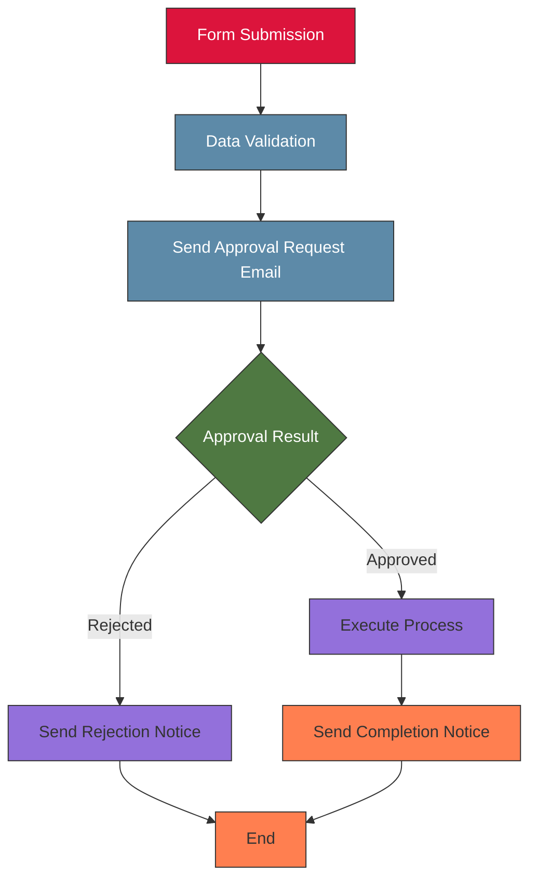

```mermaid
flowchart TB
    style A fill:#DC143C,stroke:#333,stroke-width:1px,color:white
    style B fill:#5D8AA8,stroke:#333,stroke-width:1px,color:white
    style C fill:#5D8AA8,stroke:#333,stroke-width:1px,color:white
    style D fill:#4F7942,stroke:#333,stroke-width:1px,color:white
    style E fill:#9370DB,stroke:#333,stroke-width:1px
    style F fill:#9370DB,stroke:#333,stroke-width:1px
    style G fill:#FF7F50,stroke:#333,stroke-width:1px
    style H fill:#FF7F50,stroke:#333,stroke-width:1px
    
    A[Form Submission] --> B[Data Validation]
    B --> C[Send Approval Request Email]
    C --> D{Approval Result}
    D -->|Approved| E[Execute Process]
    D -->|Rejected| F[Send Rejection Notice]
    E --> G[Send Completion Notice]
    F --> H[End]
    G --> H
```
