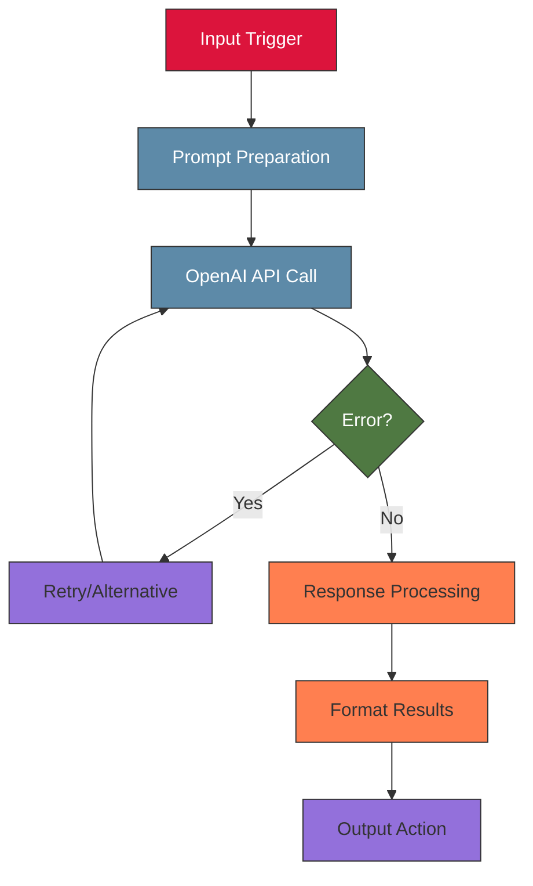

```mermaid
flowchart TB
    style A fill:#DC143C,stroke:#333,stroke-width:1px,color:white
    style B fill:#5D8AA8,stroke:#333,stroke-width:1px,color:white
    style C fill:#5D8AA8,stroke:#333,stroke-width:1px,color:white
    style D fill:#4F7942,stroke:#333,stroke-width:1px,color:white
    style E fill:#9370DB,stroke:#333,stroke-width:1px
    style F fill:#FF7F50,stroke:#333,stroke-width:1px
    style G fill:#FF7F50,stroke:#333,stroke-width:1px
    style H fill:#9370DB,stroke:#333,stroke-width:1px
    
    A[Input Trigger] --> B[Prompt Preparation]
    B --> C[OpenAI API Call]
    C --> D{Error?}
    D -->|Yes| E[Retry/Alternative]
    D -->|No| F[Response Processing]
    E --> C
    F --> G[Format Results]
    G --> H[Output Action]
```
