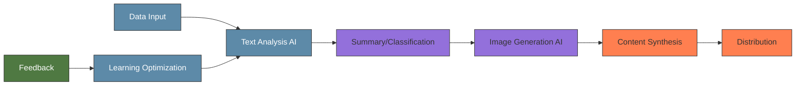

```mermaid
flowchart LR
    style A fill:#5D8AA8,stroke:#333,stroke-width:1px,color:white
    style B fill:#5D8AA8,stroke:#333,stroke-width:1px,color:white
    style C fill:#9370DB,stroke:#333,stroke-width:1px
    style D fill:#9370DB,stroke:#333,stroke-width:1px
    style E fill:#FF7F50,stroke:#333,stroke-width:1px
    style F fill:#FF7F50,stroke:#333,stroke-width:1px
    style G fill:#4F7942,stroke:#333,stroke-width:1px,color:white
    style H fill:#5D8AA8,stroke:#333,stroke-width:1px,color:white
    
    A[Data Input] --> B[Text Analysis AI]
    B --> C[Summary/Classification]
    C --> D[Image Generation AI]
    D --> E[Content Synthesis]
    E --> F[Distribution]
    
    G[Feedback] --> H[Learning Optimization]
    H --> B
```
