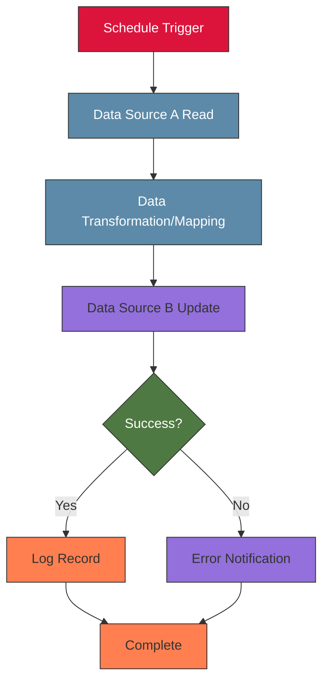

```mermaid
flowchart TB
    style A fill:#DC143C,stroke:#333,stroke-width:1px,color:white
    style B fill:#5D8AA8,stroke:#333,stroke-width:1px,color:white
    style C fill:#5D8AA8,stroke:#333,stroke-width:1px,color:white
    style D fill:#9370DB,stroke:#333,stroke-width:1px
    style E fill:#4F7942,stroke:#333,stroke-width:1px,color:white
    style F fill:#FF7F50,stroke:#333,stroke-width:1px
    style G fill:#9370DB,stroke:#333,stroke-width:1px
    style H fill:#FF7F50,stroke:#333,stroke-width:1px
    
    A[Schedule Trigger] --> B[Data Source A Read]
    B --> C[Data Transformation/Mapping]
    C --> D[Data Source B Update]
    D --> E{Success?}
    E -->|Yes| F[Log Record]
    E -->|No| G[Error Notification]
    F --> H[Complete]
    G --> H
```
