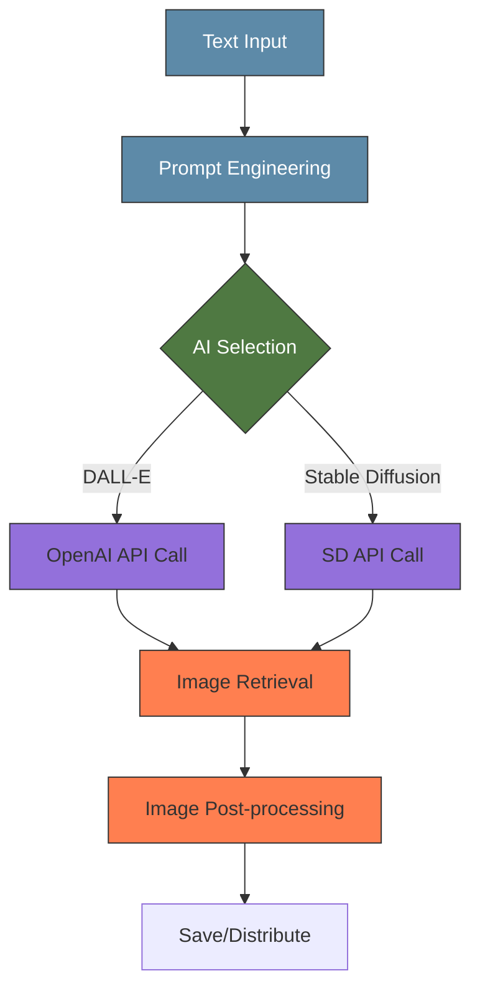

```mermaid
flowchart TB
    style A fill:#5D8AA8,stroke:#333,stroke-width:1px,color:white
    style B fill:#5D8AA8,stroke:#333,stroke-width:1px,color:white
    style C fill:#4F7942,stroke:#333,stroke-width:1px,color:white
    style D fill:#9370DB,stroke:#333,stroke-width:1px
    style E fill:#9370DB,stroke:#333,stroke-width:1px
    style F fill:#FF7F50,stroke:#333,stroke-width:1px
    style G fill:#FF7F50,stroke:#333,stroke-width:1px
    
    A[Text Input] --> B[Prompt Engineering]
    B --> C{AI Selection}
    C -->|DALL-E| D[OpenAI API Call]
    C -->|Stable Diffusion| E[SD API Call]
    D --> F[Image Retrieval]
    E --> F
    F --> G[Image Post-processing]
    G --> H[Save/Distribute]
```
