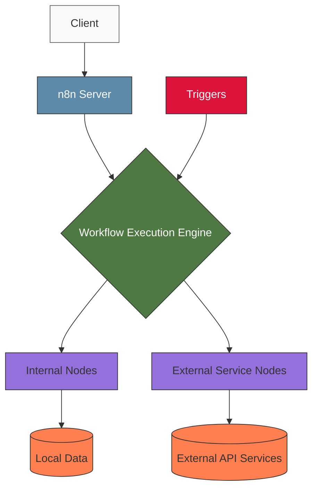

```mermaid
flowchart TB
    style A fill:#f9f9f9,stroke:#666,stroke-width:1px
    style B fill:#5D8AA8,stroke:#333,stroke-width:1px,color:white
    style C fill:#4F7942,stroke:#333,stroke-width:1px,color:white
    style D fill:#9370DB,stroke:#333,stroke-width:1px
    style E fill:#9370DB,stroke:#333,stroke-width:1px
    style F fill:#FF7F50,stroke:#333,stroke-width:1px
    style G fill:#FF7F50,stroke:#333,stroke-width:1px
    style H fill:#DC143C,stroke:#333,stroke-width:1px,color:white
    
    A[Client] --> B[n8n Server]
    B --> C{Workflow Execution Engine}
    C --> D[Internal Nodes]
    C --> E[External Service Nodes]
    E --> F[(External API Services)]
    D --> G[(Local Data)]
    H[Triggers] --> C
```
