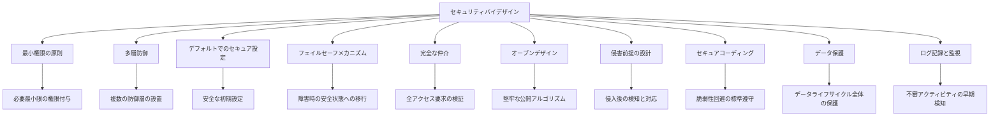
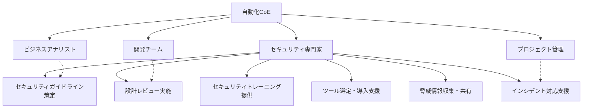
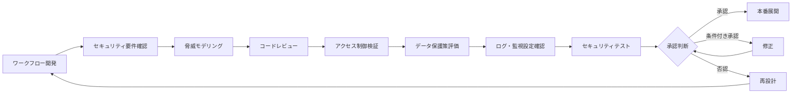
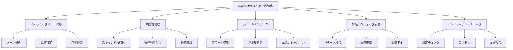
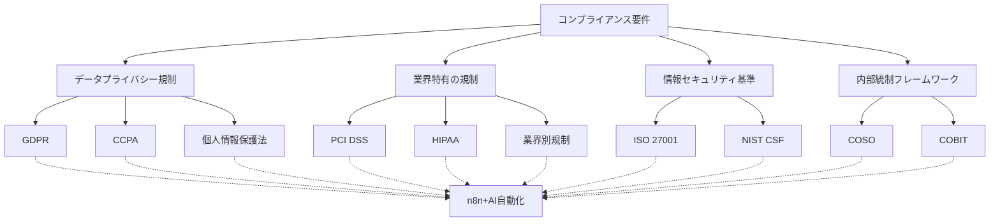
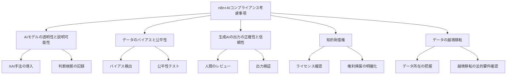

# 第5章「n8n+AIによる業務自動化の組織的展開と発展戦略」視覚要素計画

## #META:ファイル情報
- #CREATED_AT:2025-06-12
- #PRIORITY:中
- #PURPOSE:第5章の視覚要素計画の整理
- #STATUS:作成中
- #RELATED_FILES:chapter5_draft_section1.md,chapter5_draft_section2.md,chapter5_draft_section3.md,chapter5_draft_section4.md,chapter5_draft_section5.md

## セクション5「セキュリティガバナンスと自動化の統合」視覚要素案

### 1. セキュリティバイデザイン原則図



### 2. セキュリティガバナンスフレームワーク図

```mermaid
graph TD
    A[セキュリティガバナンス] --> B[ポリシーと標準]
    A --> C[役割と責任]
    A --> D[リスク管理]
    A --> E[意識向上とトレーニング]
    A --> F[インシデント対応]
    A --> G[コンプライアンス管理]
    A --> H[監視と報告]
    
    B --> B1[組織全体のセキュリティポリシー]
    B --> B2[n8n+AI特化のセキュリティ標準]
    
    C --> C1[CISO]
    C --> C2[自動化CoEセキュリティ担当]
    C --> C3[ビジネスプロセスオーナー]
    C --> C4[開発者]
    
    D --> D1[リスク特定]
    D --> D2[リスク評価]
    D --> D3[リスク対応]
    D --> D4[リスク監視]
    
    E --> E1[全従業員向け基本トレーニング]
    E --> E2[役割別専門トレーニング]
    
    F --> F1[検知]
    F --> F2[封じ込め]
    F --> F3[根絶]
    F --> F4[復旧]
    F --> F5[教訓]
    
    G --> G1[法規制への準拠]
    G --> G2[業界標準への準拠]
    
    H --> H1[セキュリティ統制の有効性監視]
    H --> H2[経営層への報告]
```



### 3. 自動化CoEにおけるセキュリティ役割図



### 4. セキュリティレビューと承認プロセスフロー図



### 5. セキュリティ自動化のユースケース図



### 6. コンプライアンス要件マッピング図



### 7. n8n+AIとコンプライアンスの考慮事項図



## 実装例：n8nによるセキュリティ自動化ワークフロー

### 1. フィッシングメール対応自動化ワークフロー

```
[メールトリガー] → [メール解析] → [URL/添付ファイル抽出] → [脅威インテリジェンス照会] → [危険度判定] → [条件分岐]
                                                                                      ↓
                                                                    [危険] → [メール隔離] → [ユーザー通知]
                                                                      ↓
                                                                    [安全] → [処理終了]
```

### 2. コンプライアンスチェック自動化ワークフロー

```
[スケジュールトリガー] → [システム設定収集] → [ポリシールール照合] → [違反検出] → [条件分岐]
                                                                    ↓
                                                  [違反あり] → [レポート生成] → [担当者通知]
                                                    ↓
                                                  [違反なし] → [コンプライアンス記録更新]
```

## 次のステップ

1. 視覚要素の詳細設計と作成
   - Mermaid形式の図の最終化
   - 必要に応じて専門的な図解ツールでの作成

2. 実装例のコードサンプル作成
   - n8nワークフローのJSON形式での提供
   - 主要な設定ポイントの解説

3. 視覚要素とコードサンプルの本文への統合
   - 適切な位置への挿入
   - 本文との整合性確保

4. 全体の校正と視覚的一貫性の確認
   - 他のセクションの視覚要素との統一感
   - 読者の理解を助ける配置と説明
