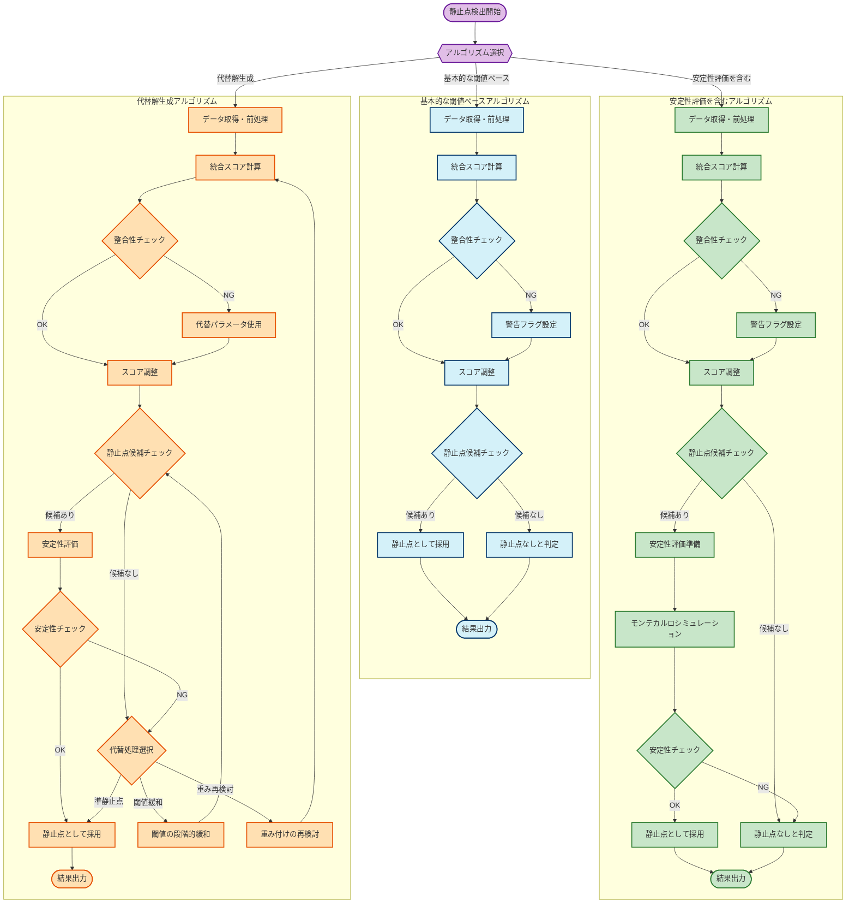
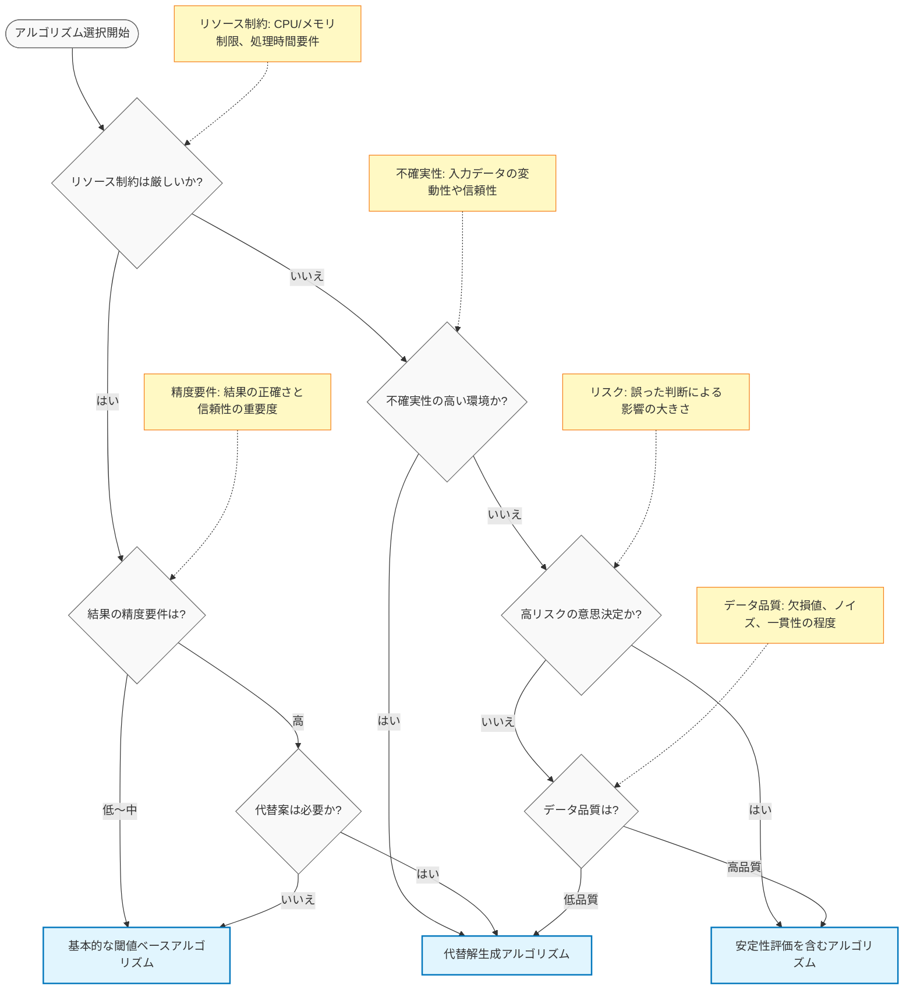
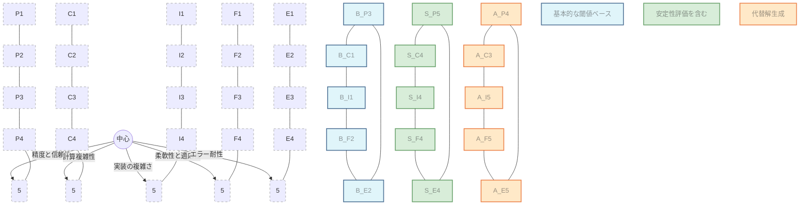

# 異なる検出アルゴリズムの比較

コンセンサスモデルにおける静止点検出には、複数のアルゴリズムアプローチが存在します。それぞれのアルゴリズムは特性や適用シナリオが異なるため、組織のニーズや状況に応じて最適なものを選択することが重要です。以下では、主要な3つのアルゴリズムを比較し、選択の指針を提供します。

## アルゴリズムの比較表

```mermaid
classDiagram
    %% 異なる検出アルゴリズムの比較表
    class "基本的な閾値ベースアルゴリズム" {
        +精度と信頼性: ★★★☆☆
        +計算複雑性: ★☆☆☆☆ (低)
        +実装の複雑さ: ★☆☆☆☆ (簡単)
        +柔軟性と適応性: ★★☆☆☆
        +エラー耐性: ★★☆☆☆
        +適用シナリオ: 初期評価、リソース制約環境
    }
    
    class "安定性評価を含むアルゴリズム" {
        +精度と信頼性: ★★★★★
        +計算複雑性: ★★★★☆ (高)
        +実装の複雑さ: ★★★★☆ (複雑)
        +柔軟性と適応性: ★★★★☆
        +エラー耐性: ★★★★☆
        +適用シナリオ: 重要な戦略決定、高リスク環境
    }
    
    class "代替解生成アルゴリズム" {
        +精度と信頼性: ★★★★☆
        +計算複雑性: ★★★☆☆ (中)
        +実装の複雑さ: ★★★★★ (最も複雑)
        +柔軟性と適応性: ★★★★★
        +エラー耐性: ★★★★★
        +適用シナリオ: 不確実性の高い環境、複数の選択肢が必要な場合
    }
    
    %% n8n実装の注釈
    class "n8n実装の特徴" {
        +基本的な閾値ベース: Function, If/Switchノード中心
        +安定性評価を含む: Loop, Functionノードでモンテカルロシミュレーション
        +代替解生成: 複数の条件分岐と代替フロー
    }
```

## アルゴリズムのフロー比較

以下の図は、3つの主要アルゴリズムの処理フローを並列表示しています。各アルゴリズムの特徴的なステップと分岐点に注目してください。



## アルゴリズム選択の決定木

以下の決定木は、組織の状況やプロジェクトの要件に基づいて、最適なアルゴリズムを選択するためのガイドラインを提供します。



## アルゴリズム特性の視覚的比較

以下の図は、各アルゴリズムの5つの主要特性（精度と信頼性、計算複雑性、実装の複雑さ、柔軟性と適応性、エラー耐性）を視覚的に比較したものです。多角形の面積が大きいほど、総合的な機能性が高いことを示しますが、リソース要件も高くなる傾向があります。



## n8nでの実装に関する考慮事項

各アルゴリズムをn8nで実装する際の主要な考慮事項は以下の通りです：

### 基本的な閾値ベースアルゴリズム
- **主要ノード**: Function, If/Switch
- **実装の複雑さ**: 低（初心者向け）
- **必要なカスタムコード量**: 少ない
- **デバッグの容易さ**: 高い
- **推奨シナリオ**: プロトタイピング、初期評価、リソース制約環境

### 安定性評価を含むアルゴリズム
- **主要ノード**: Function, Loop, If/Switch
- **実装の複雑さ**: 中〜高（中級者向け）
- **必要なカスタムコード量**: 中程度（特にモンテカルロシミュレーション部分）
- **デバッグの容易さ**: 中程度
- **推奨シナリオ**: 重要な戦略決定、高リスク環境、データ品質が高い場合

### 代替解生成アルゴリズム
- **主要ノード**: Function, If/Switch, Loop, Error Trigger
- **実装の複雑さ**: 高（上級者向け）
- **必要なカスタムコード量**: 多い（特に代替処理ロジック）
- **デバッグの容易さ**: 低い（複雑な条件分岐のため）
- **推奨シナリオ**: 不確実性の高い環境、データ品質が低い場合、複数の選択肢が必要な場合

## まとめ

静止点検出アルゴリズムの選択は、組織のニーズ、リソース制約、意思決定の重要性、データ品質などの要因に基づいて行うべきです。初期段階や限られたリソースでは基本的な閾値ベースアルゴリズムから始め、経験を積みながら徐々に高度なアルゴリズムへ移行することも有効な戦略です。また、複数のアルゴリズムを並行して実行し、結果を比較することで、より信頼性の高い意思決定が可能になります。
