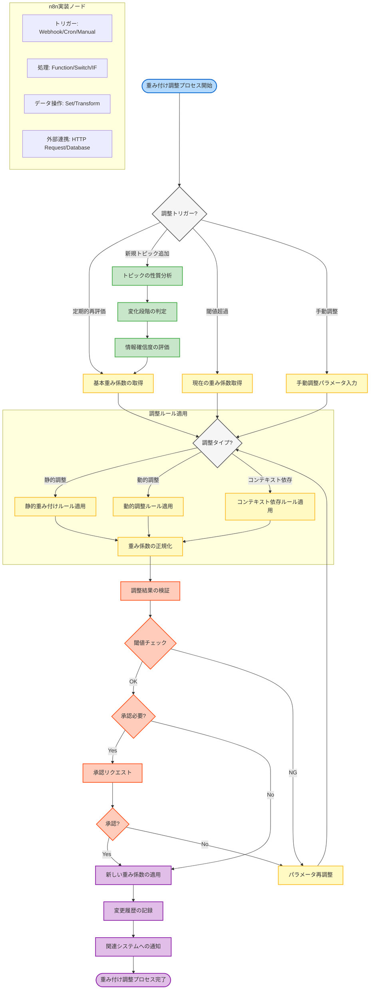

# 重み付け調整プロセスのフローチャート

コンセンサスモデルにおける重み付け調整は、評価の精度と適応性を確保するための重要なプロセスです。以下のフローチャートは、n8nを活用した重み付け調整の全体的なワークフローを示しています。

## 重み付け調整プロセスの主要コンポーネント

### 1. 調整トリガー
重み付け調整プロセスは、以下の4つの主要なトリガーによって開始されます：

- **定期的再評価**: スケジュールに基づいて自動的に実行される定期的な調整
- **新規トピック追加**: 新しい評価対象が追加された際に実行される調整
- **閾値超過**: 特定のパフォーマンス指標が事前に設定された閾値を超えた場合に実行される調整
- **手動調整**: 管理者やアナリストによって手動で開始される調整

### 2. コンテキスト分析
特に新規トピックが追加された場合、システムはトピックの性質を分析し、適切な重み付け調整を行うための情報を収集します：

- **トピックの性質分析**: トピックが技術駆動型か、市場駆動型か、ビジネス駆動型かなどを判断
- **変化段階の判定**: トピックが初期段階、成長段階、成熟段階のどの段階にあるかを評価
- **情報確信度の評価**: 各視点（テクノロジー、マーケット、ビジネス）の情報の確実性と完全性を評価

### 3. 調整ルール適用
コンテキスト情報に基づいて、適切な調整ルールが適用されます：

- **静的調整**: 事前に定義された固定的なルールに基づく調整
- **動的調整**: 時間経過や状況変化に応じて変化するルールに基づく調整
- **コンテキスト依存調整**: トピックの性質や段階に特化したルールに基づく調整

すべての調整後、重み係数の合計が1.0になるように正規化が行われます。

### 4. 検証と承認
調整された重み係数は、品質と整合性を確保するために検証プロセスを経ます：

- **調整結果の検証**: 調整された重み係数が論理的に妥当かどうかを確認
- **閾値チェック**: 調整量が許容範囲内かどうかを確認
- **承認プロセス**: 重要な調整の場合、管理者やアナリストによる承認が必要

### 5. 適用と記録
検証と承認を経た重み係数は、システムに適用され、変更履歴が記録されます：

- **新しい重み係数の適用**: 調整された重み係数をコンセンサスモデルに適用
- **変更履歴の記録**: 調整の詳細（日時、理由、変更内容など）をログに記録
- **関連システムへの通知**: 重み係数の変更を関連システムに通知

## n8nでの実装

このフローチャートは、n8nワークフローとして実装できます。主要なノードタイプは以下の通りです：

- **トリガーノード**: Webhook（APIリクエスト用）、Cron（定期実行用）、Manual（手動実行用）
- **処理ノード**: Function（カスタムロジック用）、Switch/IF（条件分岐用）
- **データ操作ノード**: Set（値の設定用）、Transform（データ変換用）
- **外部連携ノード**: HTTP Request（外部API連携用）、Database（データベース操作用）

n8nの視覚的インターフェースを使用することで、このフローチャートを実際の実行可能なワークフローとして実装し、コンセンサスモデルの重み付け調整を自動化することができます。
