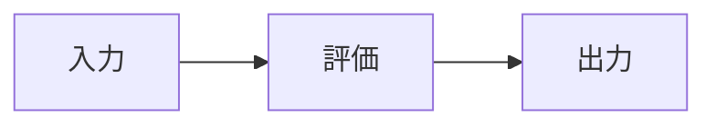
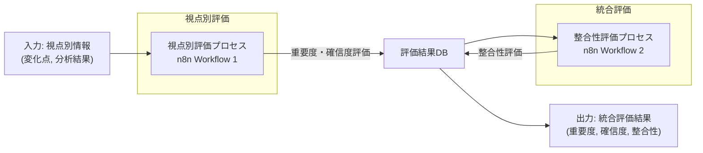

# 箇条書きを避け読者に伝わる文書記述スタイルの具体例

## 1. 概念説明の具体例

### 1.1. 箇条書き形式（避けるべき例）
- コンセンサスモデルは複数の視点からの情報を統合する
- 重要度評価は影響範囲、変化の大きさなどの要素で構成される
- 確信度評価は情報源の信頼性、データ量などを考慮する
- 整合性評価は視点間の一致度を測定する

### 1.2. 段落形式（推奨される例）

コンセンサスモデルは、テクノロジー、マーケット、ビジネスという3つの異なる視点からの情報を有機的に統合することで、多角的かつ信頼性の高い意思決定を支援するシステムです。このモデルの核心は、単一の視点に依存することなく、複数の専門領域からの知見を構造化された方法で結合し、より包括的な理解を形成する点にあります。各視点は独自の価値観や評価基準を持ちながらも、それらが相互に補完し合うことで、現実の複雑な状況をより正確に把握することが可能になります。

重要度評価プロセスでは、情報の影響範囲、変化の大きさ、戦略的関連性、時間的緊急性という4つの主要な要素を総合的に分析します。例えば、新たな技術革新が検出された場合、その技術が影響を及ぼす可能性のある製品ラインの数（影響範囲）、既存技術と比較した性能向上の程度（変化の大きさ）、組織の長期戦略目標との整合性（戦略的関連性）、対応のために許容される時間枠（時間的緊急性）を評価します。これらの要素はそれぞれ定量的指標と定性的判断を組み合わせて評価され、最終的に重み付けされた総合スコアとして算出されます。

## 2. 実装説明の具体例

### 2.1. 箇条書き形式（避けるべき例）
- n8nでWebhookノードを設定して入力を受け取る
- Function Nodeで評価ロジックを実装する
- 重要度スコアは各要素の重み付け合計で計算する
- データベースに結果を保存する
- 次のワークフローをトリガーする

### 2.2. 段落形式（推奨される例）

コンセンサスモデルの視点別評価プロセスは、n8nワークフローとして実装することで、自動化された継続的な評価を実現できます。まず、外部システムからの情報を受け取るためのエントリーポイントとして、Webhookノードを設定します。このWebhookは `/evaluate-perspective` というパスで公開され、JSONフォーマットで視点ID、トピックID、日付、変化点情報、分析結果などの構造化データを受け取ります。受信したデータは、次のFunction Nodeへと渡されます。

Function Nodeでは、評価の核心となるロジックを JavaScript で実装します。このノードでは、まず入力データの検証を行い、必須フィールドの存在確認や値の範囲チェックを実施します。データ検証を通過した後、`evaluateImportance` 関数と `evaluateConfidence` 関数を順次呼び出し、重要度と確信度の評価を行います。重要度評価では、影響範囲、変化の大きさ、戦略的関連性、時間的緊急性の各要素に対して、事前に定義された重みを適用した加重平均を計算します。例えば、戦略的関連性が高い場合（0.8以上）、その要素に対して40%の重みを与えるといった具合です。同様に、確信度評価では情報源の信頼性、データ量、一貫性、検証可能性の各要素を評価し、総合スコアを算出します。

## 3. 視覚的要素と文章の統合例

### 3.1. 不十分な統合（避けるべき例）

以下は評価プロセスのフロー図です。

評価プロセスでは重要度と確信度を計算します。

### 3.2. 効果的な統合（推奨される例）

コンセンサスモデルの評価プロセス全体は、情報の入力から最終的な統合評価結果の出力まで、一連の構造化されたステップで構成されています。以下の図は、このプロセスの全体像を視覚的に表現したものです。

*図1: コンセンサスモデル評価プロセスの全体フロー*

この図に示されているように、プロセスは大きく「視点別評価」と「統合評価」の2つのフェーズに分かれています。まず、各視点（テクノロジー、マーケット、ビジネス）からの情報が「視点別評価プロセス」（n8n Workflow 1）に入力されます。このワークフローでは、入力情報に基づいて重要度と確信度の評価を行い、結果を評価結果データベースに保存します。すべての視点からの評価が揃った段階で、「整合性評価プロセス」（n8n Workflow 2）が起動し、視点間の整合性を評価します。この整合性評価の結果も同じデータベースに保存され、最終的に統合された評価結果として出力されます。

このような二段階の評価プロセスにより、各視点の独立性を保ちながらも、それらの間の関係性や一貫性を検証することが可能になります。特に、視点間で評価が大きく異なる場合（例えば、テクノロジー視点では高重要度だがビジネス視点では低重要度など）、整合性評価によってその不一致を検出し、より詳細な分析や議論の必要性を示唆することができます。

## 4. ユースケース説明の具体例

### 4.1. 箇条書き形式（避けるべき例）
- 製造業での活用例：新技術の評価
- 重要度パラメータ：影響範囲=0.3, 変化の大きさ=0.3, 戦略的関連性=0.2, 時間的緊急性=0.2
- 確信度パラメータ：情報源信頼性=0.3, データ量=0.2, 一貫性=0.3, 検証可能性=0.2
- 結果：重要度=高, 確信度=中, 整合性=高

### 4.2. 段落形式（推奨される例）

製造業における新技術評価のユースケースでは、コンセンサスモデルが技術革新の採用判断を多角的に支援します。例えば、ある自動車部品メーカーが新たな軽量素材技術の採用を検討しているケースを考えてみましょう。この企業では、テクノロジー部門（研究開発・エンジニアリング）、マーケット部門（市場調査・競合分析）、ビジネス部門（財務・戦略企画）の3つの視点からこの新技術を評価します。

テクノロジー視点では、この新素材が既存部品と比較して30%の軽量化を実現し、強度テストでも従来素材と同等以上の性能を示したという技術検証データを入力します。この情報に基づき、影響範囲（複数の製品ラインに適用可能）に0.3、変化の大きさ（30%の軽量化は業界標準を上回る）に0.3、戦略的関連性（環境配慮型製品への移行戦略と合致）に0.2、時間的緊急性（競合他社も同様の技術を研究中）に0.2の重みを適用して評価を行います。結果として、重要度は0.85（高レベル）と算出されました。

同時に、マーケット視点では市場調査データから、この軽量素材を採用した製品に対する顧客の支払い意欲が15%増加するという分析結果を入力します。また、ビジネス視点からは、初期投資コストは高いものの3年以内にコスト削減効果で回収可能という財務分析を提供します。これら3つの視点からの評価結果が評価結果データベースに集約された後、整合性評価プロセスが起動します。

整合性評価では、3つの視点がいずれも中〜高レベルの重要度を示し、特に環境性能と市場競争力の観点で高い一致を示していることから、整合性スコアは0.78（高レベル）と判定されました。最終的な統合評価結果として、「高重要度・中確信度・高整合性」という評価が得られ、経営陣はこの新素材技術の採用に向けた次のステップ（パイロット生産ラインの設置）を承認する判断材料を得ることができました。

このユースケースは、コンセンサスモデルが単なる技術評価を超えて、市場性や事業性を含めた総合的な意思決定を支援できることを示しています。特に、各部門が独自の専門知識と視点を維持しながらも、それらを構造化された方法で統合できる点が、組織の意思決定プロセスの質を高める上で重要な価値を提供します。
