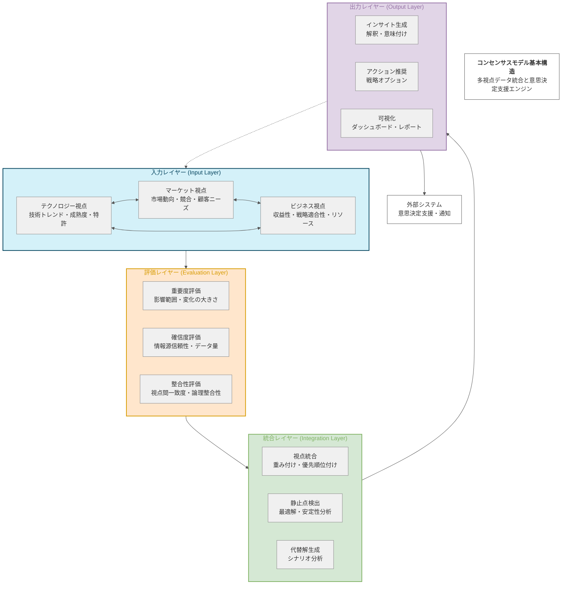

# コンセンサスモデルの基本構造概念図

## 基本構造概念図 (Mermaid)

## 図の説明

この概念図は、コンセンサスモデルの基本構造を視覚的に表現したものです。モデルは4つの主要レイヤーで構成されています：

1. **入力レイヤー（青色）**: テクノロジー、マーケット、ビジネスの3つの視点からのデータを収集・処理します。各視点は相互に影響し合い、情報を交換します。

2. **評価レイヤー（オレンジ色）**: 収集したデータの重要度、確信度、整合性を評価します。これにより、情報の価値と信頼性を定量化します。

3. **統合レイヤー（緑色）**: 評価された情報を統合し、最適な解釈（静止点）を検出します。また、代替的な解釈も生成します。

4. **出力レイヤー（紫色）**: 分析結果をインサイト、アクション推奨、可視化の形で提供します。

図中の実線矢印はデータの主な流れを、点線矢印はフィードバックループを表しています。各レイヤー内のコンポーネントは、それぞれ特定の機能を担当し、全体として一貫した分析・意思決定支援プロセスを形成しています。

この構造により、コンセンサスモデルは複数の視点からの情報を効果的に統合し、より包括的で信頼性の高い意思決定支援を実現します。
