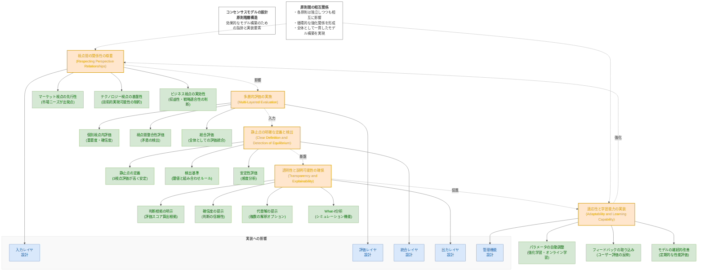

# 設計原則の階層構造図

## 設計原則の階層構造図 (Mermaid)

## 図の説明

この図は、コンセンサスモデルの設計原則の階層構造を視覚的に表現したものです。5つの主要設計原則とそれぞれの実装要素、そして原則間の相互関係を示しています。

### 主要設計原則（最上位レベル）

1. **視点間の関係性の尊重 (Respecting Perspective Relationships)**:
   - マーケット視点の先行性：市場ニーズを出発点とし、顧客価値の源泉として重視
   - テクノロジー視点の基盤性：技術的な実現可能性を制約条件として考慮
   - ビジネス視点の実効性：収益性と戦略適合性の最終判断基準として活用

2. **多層的評価の実施 (Multi-Layered Evaluation)**:
   - 個別視点内評価：各視点内での重要度と確信度の評価
   - 視点間整合性評価：異なる視点からの情報の矛盾を検出
   - 総合評価：全ての評価結果を統合した全体評価

3. **静止点の明確な定義と検出 (Clear Definition and Detection of Equilibrium)**:
   - 静止点の定義：3つの視点の評価が総合的に高く安定している状態
   - 検出基準：事前に定義された閾値と組み合わせルール
   - 安定性評価：入力情報の変動に対する頑健性の分析

4. **透明性と説明可能性の確保 (Transparency and Explainability)**:
   - 判断根拠の明示：評価スコアの算出根拠と適用ルールの記録
   - 確信度の提示：最終判断の信頼性レベルの明示
   - 代替解の提示：複数の解釈オプションの提供
   - What-if分析：入力やパラメータ変更のシミュレーション機能

5. **適応性と学習能力の実装 (Adaptability and Learning Capability)**:
   - パラメータの自動調整：予測と実際の結果の乖離に基づく調整
   - フィードバックの取り込み：ユーザーからの評価の反映
   - モデルの継続的改善：定期的な性能評価と構造見直し

### 原則間の相互関係

各設計原則は独立して機能するのではなく、相互に影響し合い、循環的な強化関係を形成しています：

- 視点間の関係性の尊重は、多層的評価の基盤となります
- 多層的評価は、静止点検出のための入力を提供します
- 静止点の明確な定義は、透明性と説明可能性の基盤となります
- 透明性と説明可能性は、適応性と学習能力を促進します
- 適応性と学習能力は、視点間の関係性の理解を強化します

### 実装への影響

各設計原則は、コンセンサスモデルの実装の異なる側面に影響します：

- 視点間の関係性の尊重 → 入力レイヤの設計に影響
- 多層的評価の実施 → 評価レイヤの設計に影響
- 静止点の明確な定義と検出 → 統合レイヤの設計に影響
- 透明性と説明可能性の確保 → 出力レイヤの設計に影響
- 適応性と学習能力の実装 → 管理機能の設計に影響

この階層構造を理解することで、コンセンサスモデルの設計と実装において、各原則をバランス良く適用し、効果的なモデルを構築することができます。
