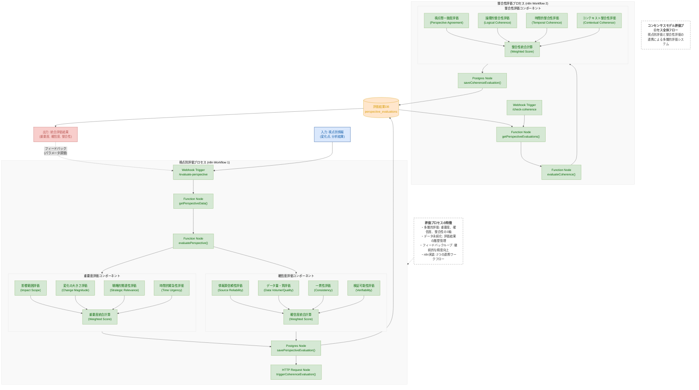

# 評価プロセス全体のフロー図

## 評価プロセス全体のフロー図 (Mermaid)

## 図の説明

この図は、コンセンサスモデルの評価プロセス全体を視覚的に表現したものです。評価プロセスは大きく「視点別評価プロセス」と「整合性評価プロセス」の2つの主要コンポーネントで構成され、それぞれがn8nの独立したワークフローとして実装されます。

### 主要コンポーネント

1. **視点別評価プロセス (n8n Workflow 1)**:
   - Webhookトリガーで起動し、評価対象の視点（テクノロジー、マーケット、ビジネス）の情報を取得
   - 重要度評価コンポーネントで影響範囲、変化の大きさ、戦略的関連性、時間的緊急性を評価
   - 確信度評価コンポーネントで情報源信頼性、データ量・質、一貫性、検証可能性を評価
   - 評価結果をデータベースに保存し、整合性評価プロセスをトリガー

2. **整合性評価プロセス (n8n Workflow 2)**:
   - Webhookトリガーで起動し、データベースから各視点の評価結果を取得
   - 視点間一致度、論理的整合性、時間的整合性、コンテキスト整合性を評価
   - 整合性評価結果をデータベースに保存

3. **データベース**:
   - 視点別評価結果と整合性評価結果を永続化
   - 履歴データとして保存し、時系列分析や傾向把握に活用

### データフロー

1. **入力**: 各視点（テクノロジー、マーケット、ビジネス）からの情報（変化点、分析結果など）
2. **処理**: 視点別評価プロセスで重要度と確信度を評価し、整合性評価プロセスで視点間の整合性を評価
3. **出力**: 重要度、確信度、整合性の3軸に基づく統合評価結果
4. **フィードバック**: 評価結果に基づくパラメータ調整や評価ロジックの改善

### 実装上の特徴

- **n8nワークフロー**: 2つの独立したワークフローとして実装し、Webhook、Function、Databaseノードを活用
- **モジュール性**: 各評価コンポーネントを独立したサブグラフとして設計し、拡張性と保守性を確保
- **データ永続化**: PostgreSQLデータベースを使用して評価結果を永続化し、履歴管理を実現
- **フィードバックループ**: 評価結果に基づくパラメータ調整や評価ロジックの改善を可能にする設計

この評価プロセス全体のフロー図により、コンセンサスモデルの中核をなす評価メカニズムの構造と動作を理解することができます。各コンポーネントの詳細な実装については、コード例やパラメータ設定などの追加情報が必要です。
