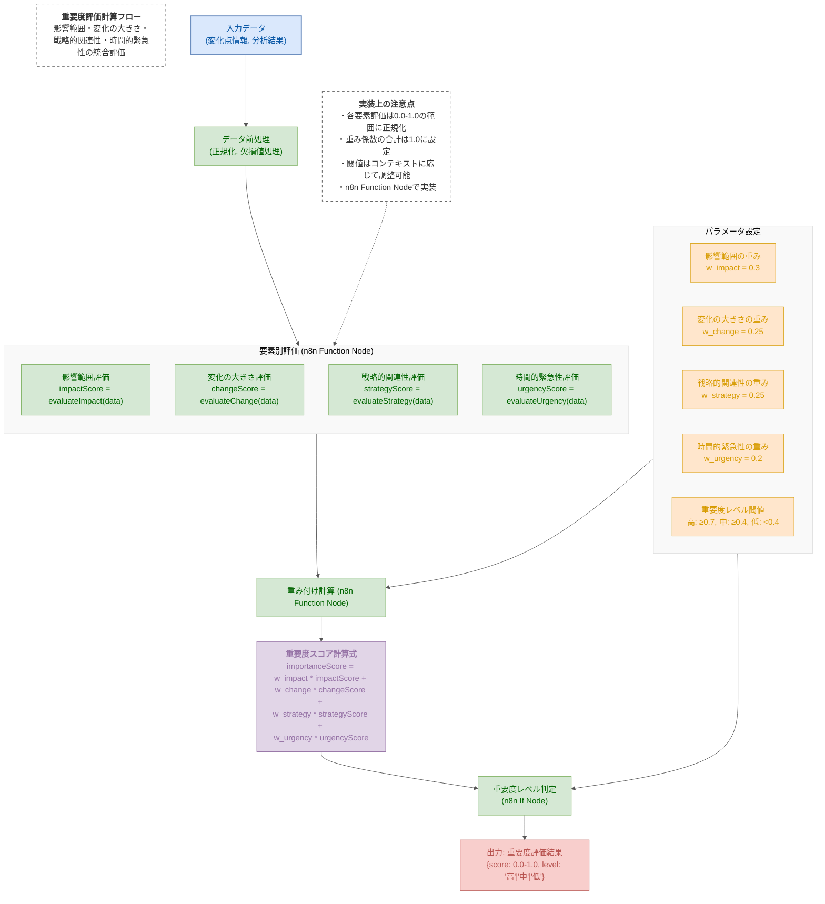
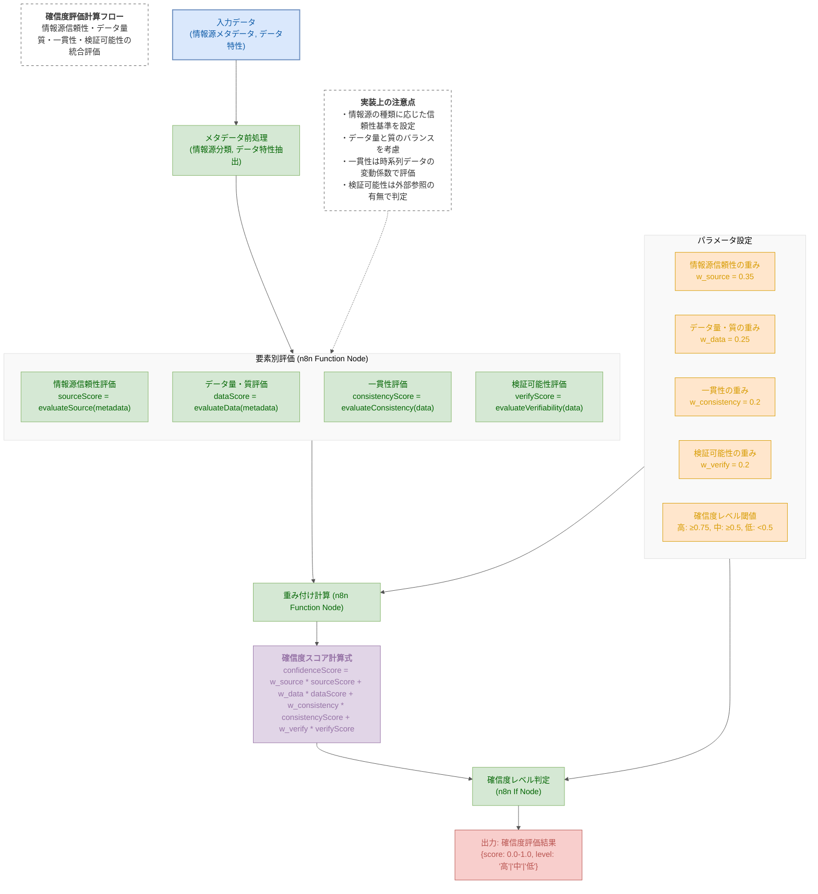
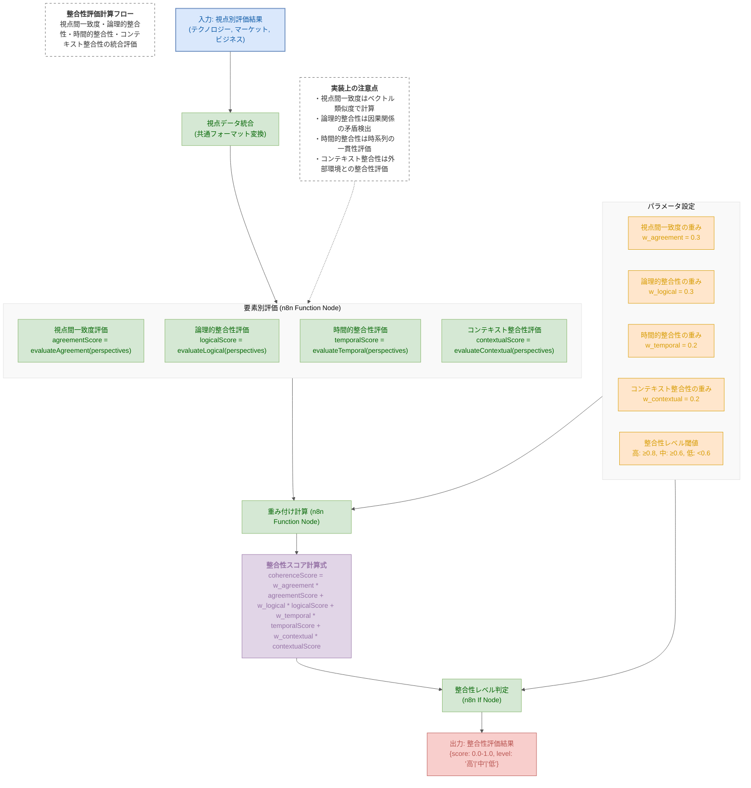

# 評価計算フロー図

## 1. 重要度評価計算フロー図 (Mermaid)

## 2. 確信度評価計算フロー図 (Mermaid)

## 3. 整合性評価計算フロー図 (Mermaid)

## 図の説明

この資料では、コンセンサスモデルの3つの主要評価計算（重要度評価、確信度評価、整合性評価）のフロー図を示しています。各図は、入力データから評価スコア・レベルの算出までの計算プロセスを視覚的に表現しています。

### 1. 重要度評価計算フロー

重要度評価は、変化点や分析結果の重要性を4つの要素（影響範囲、変化の大きさ、戦略的関連性、時間的緊急性）から多角的に評価します。

**計算プロセス**:
1. 入力データの前処理（正規化、欠損値処理）
2. 各要素の個別評価（0.0-1.0のスコア化）
3. 重み付け係数を適用した統合計算
4. 閾値に基づく重要度レベル（高・中・低）の判定

**実装上のポイント**:
- 各要素評価は専用の評価関数で実装
- 重み係数はコンテキストに応じて調整可能
- n8nのFunctionノードで計算ロジックを実装

### 2. 確信度評価計算フロー

確信度評価は、情報やデータの信頼性を4つの要素（情報源信頼性、データ量・質、一貫性、検証可能性）から評価します。

**計算プロセス**:
1. メタデータの前処理（情報源分類、データ特性抽出）
2. 各要素の個別評価（0.0-1.0のスコア化）
3. 重み付け係数を適用した統合計算
4. 閾値に基づく確信度レベル（高・中・低）の判定

**実装上のポイント**:
- 情報源の種類に応じた信頼性基準の設定
- データ量と質のバランスを考慮した評価
- 一貫性は時系列データの変動係数で評価
- 検証可能性は外部参照の有無などで判定

### 3. 整合性評価計算フロー

整合性評価は、複数の視点（テクノロジー、マーケット、ビジネス）間の一貫性を4つの要素（視点間一致度、論理的整合性、時間的整合性、コンテキスト整合性）から評価します。

**計算プロセス**:
1. 視点別データの統合（共通フォーマット変換）
2. 各要素の個別評価（0.0-1.0のスコア化）
3. 重み付け係数を適用した統合計算
4. 閾値に基づく整合性レベル（高・中・低）の判定

**実装上のポイント**:
- 視点間一致度はベクトル類似度で計算
- 論理的整合性は因果関係の矛盾検出
- 時間的整合性は時系列の一貫性評価
- コンテキスト整合性は外部環境との整合性評価

### 共通実装要素

3つの評価計算に共通する実装要素:
- n8nのFunctionノードでJavaScriptによる計算ロジックを実装
- Ifノードで閾値に基づくレベル判定を実装
- パラメータ（重み係数、閾値）は外部から調整可能に設計
- 評価結果はJSON形式で出力し、後続処理で利用可能
