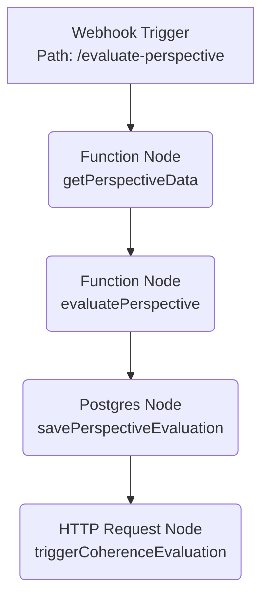
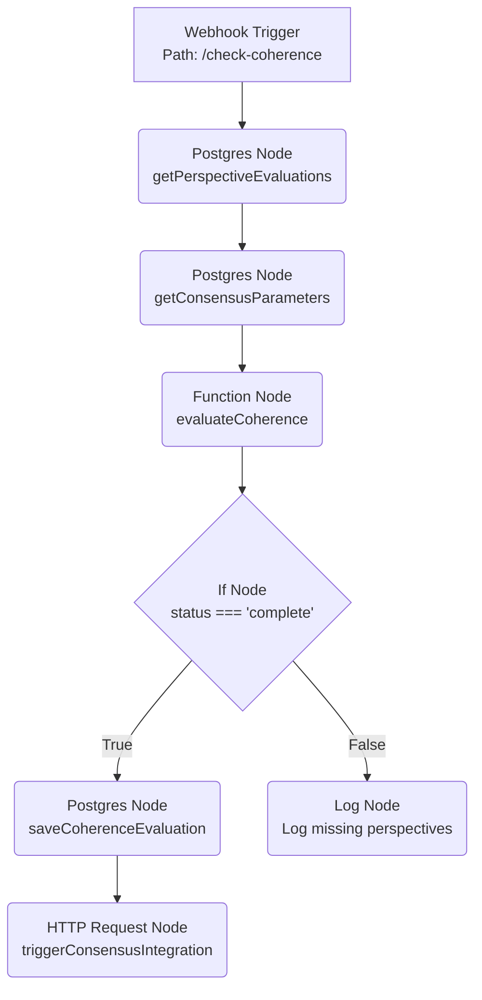
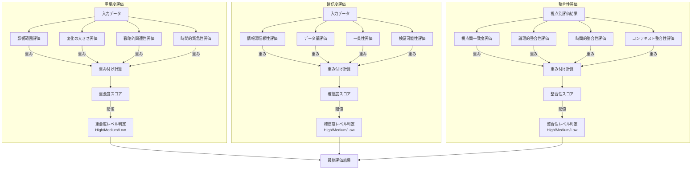

# コンセンサスモデルの実装（パート2：基本ロジックと評価メカニズム）[改訂版]

**改訂履歴**
- 2025/06/03: 初版（校正評価に基づく改善提案を反映）

**目次**
1. はじめに
2. コンセンサスモデルの基本ロジックと評価メカニズムの概要
3. [改善点1] 視覚的要素：評価プロセス全体のフロー図
4. [改善点2] 実装詳細：視点別評価プロセスのn8nワークフロー
   - 4.1. ワークフロー解説と代替案（n8n環境制約）
   - 4.2. データベーススキーマ設計
   - 4.3. APIエンドポイント設計（Webhook）
5. [改善点2] 実装詳細：整合性評価プロセスのn8nワークフロー
   - 5.1. ワークフロー解説と代替案（n8n環境制約）
   - 5.2. データベーススキーマ設計
   - 5.3. APIエンドポイント設計（Webhook）
6. 評価メカニズムの詳細
   - 6.1. 重要度評価
   - 6.2. 確信度評価
   - 6.3. 整合性評価
7. [改善点1] 視覚的要素：評価計算ロジックの図解
8. [改善点3] 実践的なユースケースと例
   - 8.1. 製造業：新技術導入評価
   - 8.2. 小売業：新市場参入評価
   - 8.3. 金融業：新規投資戦略評価
   - 8.4. 業種・用途に応じたパラメータ調整ガイド
9. [改善点4] 技術的課題と対応策
   - 9.1. パフォーマンス最適化
   - 9.2. エラーハンドリングと耐障害性
   - 9.3. スケーラビリティと分散処理
   - 9.4. セキュリティ考慮事項
10. [改善点5] 評価と検証フレームワーク
    - 10.1. 評価メカニズムの精度検証
    - 10.2. バックテストと実績比較
    - 10.3. 感度分析とパラメータ最適化
    - 10.4. A/Bテストによるロジック比較
11. [改善点6] 段階的実装ガイド
    - 11.1. ステップ1：最小限の評価ロジック実装
    - 11.2. ステップ2：n8nワークフローの構築（代替案含む）
    - 11.3. ステップ3：データベース連携と永続化
    - 11.4. ステップ4：高度な評価機能と最適化
    - 11.5. 実装チェックリスト
12. [改善点7] 読者フィードバック活用の仕組み
    - 12.1. フィードバック収集方法の提案
    - 12.2. 継続的改善サイクル
13. まとめと次のステップ

---

## 1. はじめに

本稿（パート2）では、コンセンサスモデルの中核となる基本ロジックと評価メカニズムの実装について詳述します。パート1で解説した基本構造と設計原則に基づき、n8nを活用して各視点からの情報を評価し、その整合性を検証する具体的なプロセスをコード例とともに解説します。さらに、校正評価で指摘された改善点を踏まえ、視覚的要素、実装詳細、実践的ユースケース、技術的課題への対応、評価・検証フレームワーク、段階的実装ガイド、読者フィードバックの仕組みを追加し、より実践的で理解しやすい内容を目指します。

## 2. コンセンサスモデルの基本ロジックと評価メカニズムの概要

コンセンサスモデルの基本ロジックは、3つの視点（テクノロジー、マーケット、ビジネス）からの情報を個別に評価し、それらの評価結果の整合性を検証することで、多角的な視点に基づいた信頼性の高い判断を導き出すことを目的とします。この評価プロセスは、主に以下のステップで構成されます。

1.  **視点別評価プロセス**：各視点からの入力情報（変化点、分析結果など）に基づき、「重要度」と「確信度」を評価します。
2.  **整合性評価プロセス**：3つの視点からの評価結果が出揃った段階で、それらの評価間の「整合性」を評価します。

これらの評価には、事前に定義されたパラメータ（重み、閾値など）が用いられ、評価結果は定量的なスコアと定性的なレベル（High/Medium/Low）で表現されます。本稿では、これらのプロセスをn8nワークフローとして実装する方法を具体的に示します。

## 3. [改善点1] 視覚的要素：評価プロセス全体のフロー図

コンセンサスモデルの評価プロセス全体の流れを理解しやすくするために、以下にフロー図を示します。

```mermaid
graph LR
    A[入力: 視点別情報<br>(変化点, 分析結果)] --> B(視点別評価プロセス<br>n8n Workflow 1);
    B -- 重要度・確信度評価 --> C[(評価結果DB)];
    C --> D(整合性評価プロセス<br>n8n Workflow 2);
    
    subgraph "視点別評価" 
        B
    end
    
    subgraph "統合評価"
        D
    end
    
    D -- 整合性評価 --> C;
    C --> E[出力: 統合評価結果<br>(重要度, 確信度, 整合性)];
```
*図：コンセンサスモデル評価プロセス全体のフロー図。視点別評価と整合性評価の連携を示す。*

この図は、各視点からの情報がどのように評価され、データベースを介して整合性評価プロセスに連携されるかを示しています。

## 4. [改善点2] 実装詳細：視点別評価プロセスのn8nワークフロー

各視点（テクノロジー、マーケット、ビジネス）からの情報を個別に評価するためのn8nワークフローです。Webhookをトリガーとし、入力データに基づいて重要度と確信度を評価し、結果をデータベースに保存します。

### 4.1. ワークフロー解説と代替案（n8n環境制約）

**注意:** 現在の実行環境にはn8nがインストールされていないため、実際のワークフロー画面のスクリーンショットは提供できません。代わりに、ワークフローの構造と各ノードの機能をコードと説明、およびMermaid図で示します。n8nの基本的な使い方については、[n8n公式ドキュメント](https://docs.n8n.io/)をご参照ください。

**ワークフロー構造（Mermaid）:**


*図：視点別評価プロセスのn8nワークフロー構造（概念図）*

**ノード解説:**

1.  **Webhook Trigger:** `/evaluate-perspective` パスでPOSTリクエストを受け付け、ワークフローを開始します。リクエストボディには、`perspective_id`, `topic_id`, `date`, `change_points`, `analysis_results` を含むJSONデータが必要です。
2.  **Function Node (getPerspectiveData):** Webhookから受け取ったデータを取得し、必須フィールドの存在チェックや基本的なデータ構造の検証を行います。エラーがあれば処理を中断します。
3.  **Function Node (evaluatePerspective):** 主要な評価ロジックを実行します。`evaluateImportance` と `evaluateConfidence` 関数（後述）を呼び出し、重要度と確信度のスコアおよびレベルを計算します。最終的な評価結果をJSONオブジェクトとして整形します。
4.  **Postgres Node (savePerspectiveEvaluation):** 評価結果を `perspective_evaluations` テーブルに保存します。`INSERT ... ON CONFLICT ... DO UPDATE` を使用して、同じ視点・トピック・日付のデータが存在する場合は更新します。
5.  **HTTP Request Node (triggerCoherenceEvaluation):** 整合性評価ワークフローをトリガーするために、`/check-coherence` パスを持つ別のWebhookにPOSTリクエストを送信します。リクエストボディには `topic_id` と `date` を含めます。

**Function Node (evaluatePerspective) 内の主要ロジック:**

```javascript
// (evaluatePerspective Function Node内のコード例)
const perspectiveData = $input.item.json;

// Get consensus parameters (assuming fetched in a previous step or globally available)
const consensusParameters = $input.item.json.consensus_parameters; // Example: Fetch from DB or another node

// Evaluate Importance
const importanceEvaluation = evaluateImportance(perspectiveData.analysis_results, consensusParameters.importanceParameters);

// Evaluate Confidence
const confidenceEvaluation = evaluateConfidence(perspectiveData.analysis_results, consensusParameters.confidenceParameters);

// Calculate Overall Score (example weighting)
const overallScore = calculateOverallScore(importanceEvaluation, confidenceEvaluation);

// Prepare evaluation result object
const perspectiveEvaluation = {
  perspective_id: perspectiveData.perspective_id,
  topic_id: perspectiveData.topic_id,
  date: perspectiveData.date,
  importance: importanceEvaluation,
  confidence: confidenceEvaluation,
  overall_score: overallScore
};

return { json: { perspective_evaluation: perspectiveEvaluation } };

// --- Helper Functions (defined within the Function Node or globally) ---

function evaluateImportance(analysisResults, params) {
  // ... (重要度評価ロジック: 影響範囲, 変化の大きさ, 戦略的関連性, 時間的緊急性)
  // Calculate scores for each factor based on analysisResults
  const impactScore = /* calculation */; 
  const magnitudeScore = /* calculation */;
  const relevanceScore = /* calculation */;
  const urgencyScore = /* calculation */;

  // Calculate weighted score
  const weightedScore = 
    params.impactScope.weight * impactScore +
    params.changeMagnitude.weight * magnitudeScore +
    params.strategicRelevance.weight * relevanceScore +
    params.timeUrgency.weight * urgencyScore;

  // Determine level
  let level;
  if (weightedScore >= params.thresholds.high) level = 'high';
  else if (weightedScore >= params.thresholds.medium) level = 'medium';
  else level = 'low';

  return { score: weightedScore, level: level, components: { /* factor scores */ } };
}

function evaluateConfidence(analysisResults, params) {
  // ... (確信度評価ロジック: 情報源信頼性, データ量, 一貫性, 検証可能性)
  // Calculate scores for each factor based on analysisResults
  const reliabilityScore = /* calculation */;
  const volumeScore = /* calculation */;
  const consistencyScore = /* calculation */;
  const verifiabilityScore = calculateVerifiability(analysisResults); // Example detail

  // Calculate weighted score
  const weightedScore = 
    params.sourceReliability.weight * reliabilityScore +
    params.dataVolume.weight * volumeScore +
    params.consistency.weight * consistencyScore +
    params.verifiability.weight * verifiabilityScore;

  // Determine level
  let level;
  if (weightedScore >= params.thresholds.high) level = 'high';
  else if (weightedScore >= params.thresholds.medium) level = 'medium';
  else level = 'low';

  return { score: weightedScore, level: level, components: { /* factor scores */ } };
}

function calculateVerifiability(analysisResults) {
  // Example: Calculate score based on evidence types provided
  let verifiabilityScore = 0;
  const evidenceTypes = {
    quantitative_data: 0.9,
    official_statement: 0.8,
    direct_observation: 0.8,
    expert_opinion: 0.7,
    multiple_sources: 0.6,
    single_source: 0.4,
    anecdotal: 0.2,
    speculation: 0.1
  };
  
  if (analysisResults.evidence_types && Array.isArray(analysisResults.evidence_types)) {
    let totalWeight = 0;
    let weightedSum = 0;
    
    for (const evidence of analysisResults.evidence_types) {
      const type = evidence.type || 'speculation';
      const weight = evidence.weight || 1;
      
      weightedSum += (evidenceTypes[type] || 0.1) * weight;
      totalWeight += weight;
    }
    
    verifiabilityScore = totalWeight > 0 ? weightedSum / totalWeight : 0;
  } else {
    verifiabilityScore = 0.5; // Default if no evidence types
  }
  
  return verifiabilityScore;
}

function calculateOverallScore(importance, confidence) {
  // Example: Combine importance and confidence (60/40 weighting)
  return (importance.score * 0.6) + (confidence.score * 0.4);
}
```

### 4.2. データベーススキーマ設計

視点別評価結果を格納する `perspective_evaluations` テーブルのスキーマ設計です。

```mermaid
graph TD
    subgraph "perspective_evaluations Table"
        col1[id] --> type1[SERIAL PRIMARY KEY]
        col2[perspective_id] --> type2[VARCHAR(50) NOT NULL]
        col3[topic_id] --> type3[VARCHAR(50) NOT NULL]
        col4[date] --> type4[DATE NOT NULL]
        col5[importance] --> type5[JSONB NOT NULL<br><i>{score, level, components: {...}}</i>]
        col6[confidence] --> type6[JSONB NOT NULL<br><i>{score, level, components: {...}}</i>]
        col7[overall_score] --> type7[FLOAT NOT NULL]
        col8[created_at] --> type8[TIMESTAMP WITH TIME ZONE DEFAULT CURRENT_TIMESTAMP]
        constraint1["UNIQUE (perspective_id, topic_id, date)"]
    end
```
*図：`perspective_evaluations` テーブルのスキーマ設計*

-   `importance`, `confidence` カラムはJSONB型とし、評価スコア、レベル、各構成要素のスコアを格納します。
-   `perspective_id`, `topic_id`, `date` の組み合わせでユニーク制約を設定し、同一日・同一トピック・同一視点の評価が重複しないようにします。

### 4.3. APIエンドポイント設計（Webhook）

-   **エンドポイント:** `/evaluate-perspective`
-   **メソッド:** POST
-   **リクエストボディ (JSON):**
    ```json
    {
      "perspective_id": "technology", // or "market", "business"
      "topic_id": "topic_xyz",
      "date": "2025-06-03",
      "change_points": [
        { "id": "cp001", "description": "New AI chip announced", "timestamp": "..." },
        // ... more change points
      ],
      "analysis_results": {
        "summary": "Significant performance improvement expected.",
        "impact_scope_analysis": { "affected_entities": 15, "importance_level": "high" },
        "change_magnitude_analysis": { "performance_gain_percent": 50 },
        "strategic_relevance_analysis": { "related_keywords": ["AI", "HPC"], "score": 0.8 },
        "time_urgency_analysis": { "response_needed_within_days": 30 },
        "source_reliability_analysis": { "sources": [{"type": "press_release", "reliability": 0.7}, {"type": "expert_blog", "reliability": 0.5}] },
        "data_volume_analysis": { "data_points": 500, "time_range_months": 6 },
        "consistency_analysis": { "cross_source_consistency_score": 0.75 },
        "evidence_types": [
          { "type": "quantitative_data", "weight": 2 },
          { "type": "expert_opinion", "weight": 1 }
        ]
        // ... other analysis results
      },
      "consensus_parameters": { // Example: Can be passed or fetched within workflow
        "importanceParameters": { /* weights, thresholds */ },
        "confidenceParameters": { /* weights, thresholds */ }
      }
    }
    ```
-   **レスポンス:** (非同期処理のため、通常は受付成功を示すステータスコード 200 OK のみ)

## 5. [改善点2] 実装詳細：整合性評価プロセスのn8nワークフロー

3つの視点からの評価結果が出揃った後、それらの整合性を評価するためのn8nワークフローです。

### 5.1. ワークフロー解説と代替案（n8n環境制約）

**注意:** 視点別評価と同様、n8n環境がないため実際の画面は示せません。コード、説明、Mermaid図で代替します。

**ワークフロー構造（Mermaid）:**


*図：整合性評価プロセスのn8nワークフロー構造（概念図）*

**ノード解説:**

1.  **Webhook Trigger:** `/check-coherence` パスでPOSTリクエストを受け付けます。リクエストボディには `topic_id` と `date` が必要です。
2.  **Postgres Node (getPerspectiveEvaluations):** 指定された `topic_id` と `date` に基づき、`perspective_evaluations` テーブルから関連するすべての視点評価（最大3つ）を取得します。
3.  **Postgres Node (getConsensusParameters):** `consensus_parameters` テーブルから現在アクティブな評価パラメータ（整合性評価用を含む）を取得します。
4.  **Function Node (evaluateCoherence):** 整合性評価の主要ロジックを実行します。まず、3つの視点すべての評価が存在するか確認します。存在する場合、`evaluateCoherence` ヘルパー関数（後述）を呼び出し、整合性スコアとレベルを計算します。結果（`status: 'complete'` または `'incomplete'`）をJSONオブジェクトとして整形します。
5.  **If Node (CheckComplete):** `evaluateCoherence` ノードの結果に基づき、`status` が `'complete'` かどうかで処理を分岐します。
6.  **Postgres Node (saveCoherenceEvaluation) [True Branch]:** 整合性評価結果を `coherence_evaluations` テーブルに保存します。
7.  **HTTP Request Node (triggerConsensusIntegration) [True Branch]:** 次のステップであるコンセンサス統合プロセスをトリガーします（別のWebhookを想定）。
8.  **Log Node (LogIncomplete) [False Branch]:** 3つの視点評価が揃っていない場合、どの視点が不足しているかの情報をログに出力します（または通知するなど）。

**Function Node (evaluateCoherence) 内の主要ロジック:**

```javascript
// (evaluateCoherence Function Node内のコード例)
const perspectiveEvaluations = $input.item.json.perspective_evaluations; // Assuming fetched data is here
const consensusParameters = $input.item.json.consensus_parameters; // Assuming fetched data is here
const topicId = $input.item.json.topic_id;
const date = $input.item.json.date;

// Check if we have evaluations from all three perspectives
const perspectives = ['technology', 'market', 'business'];
const evaluations = {};
let missingPerspectives = [];

for (const perspective of perspectives) {
  const evaluation = perspectiveEvaluations.find(e => e.perspective_id === perspective);
  if (evaluation) {
    evaluations[perspective] = evaluation;
  } else {
    missingPerspectives.push(perspective);
  }
}

// If any perspective is missing, return incomplete status
if (missingPerspectives.length > 0) {
  return {
    json: {
      status: 'incomplete',
      topic_id: topicId,
      date: date,
      missing_perspectives: missingPerspectives
    }
  };
}

// Get coherence parameters
const coherenceParams = consensusParameters.coherenceParameters;

// Evaluate coherence using helper function
const coherenceEvaluation = evaluateCoherenceHelper(evaluations, coherenceParams);

return {
  json: {
    status: 'complete',
    topic_id: topicId,
    date: date,
    perspective_evaluations: evaluations, // Pass along for context
    coherence_evaluation: coherenceEvaluation,
    consensus_parameters: consensusParameters // Pass along for context
  }
};

// --- Helper Function (defined within the Function Node or globally) ---

function evaluateCoherenceHelper(evaluations, params) {
  // Calculate perspective agreement score
  const perspectiveAgreementScore = calculatePerspectiveAgreement(evaluations);
  
  // Calculate logical coherence score
  const logicalCoherenceScore = calculateLogicalCoherence(evaluations);
  
  // Calculate temporal coherence score (requires historical data - simplified here)
  const temporalCoherenceScore = calculateTemporalCoherence(evaluations, topicId, date);
  
  // Calculate contextual coherence score (requires broader context - simplified here)
  const contextualCoherenceScore = calculateContextualCoherence(evaluations, topicId);
  
  // Calculate weighted coherence score
  const coherenceScore = 
    (params.perspectiveAgreement?.weight || 0.25) * perspectiveAgreementScore +
    (params.logicalCoherence?.weight || 0.25) * logicalCoherenceScore +
    (params.temporalCoherence?.weight || 0.25) * temporalCoherenceScore +
    (params.contextualCoherence?.weight || 0.25) * contextualCoherenceScore;
  
  // Determine coherence level
  let coherenceLevel;
  const thresholds = params.thresholds || { high: 0.75, medium: 0.5 };
  if (coherenceScore >= thresholds.high) {
    coherenceLevel = 'high';
  } else if (coherenceScore >= thresholds.medium) {
    coherenceLevel = 'medium';
  } else {
    coherenceLevel = 'low';
  }
  
  return {
    score: coherenceScore,
    level: coherenceLevel,
    components: {
      perspective_agreement: perspectiveAgreementScore,
      logical_coherence: logicalCoherenceScore,
      temporal_coherence: temporalCoherenceScore,
      contextual_coherence: contextualCoherenceScore
    }
  };
}

// Example helper for perspective agreement
function calculatePerspectiveAgreement(evaluations) {
  const tech = evaluations.technology.overall_score;
  const market = evaluations.market.overall_score;
  const business = evaluations.business.overall_score;
  const scores = [tech, market, business];
  const avg = scores.reduce((a, b) => a + b, 0) / scores.length;
  const variance = scores.reduce((a, b) => a + Math.pow(b - avg, 2), 0) / scores.length;
  // Normalize variance to a 0-1 agreement score (lower variance = higher agreement)
  return Math.max(0, 1 - Math.sqrt(variance) * 2); // Simple normalization
}

// Example helper for logical coherence
function calculateLogicalCoherence(evaluations) {
  let contradictions = 0;
  const perspectives = ['technology', 'market', 'business'];
  // Rule 1: High importance + Low confidence = contradiction
  for (const p of perspectives) {
    if (evaluations[p].importance.level === 'high' && evaluations[p].confidence.level === 'low') {
      contradictions++;
    }
  }
  // Rule 2: Major disagreement in importance (High vs Low)
  const impLevels = perspectives.map(p => evaluations[p].importance.level);
  if (impLevels.includes('high') && impLevels.includes('low')) {
    contradictions++;
  }
  // Rule 3: Major disagreement in confidence (High vs Low)
  const confLevels = perspectives.map(p => evaluations[p].confidence.level);
  if (confLevels.includes('high') && confLevels.includes('low')) {
    contradictions++;
  }
  // Normalize (e.g., 0 contradictions = 1.0, 3+ contradictions = 0.0)
  return Math.max(0, 1 - contradictions / 3);
}

// Placeholder for temporal coherence (requires historical data access)
function calculateTemporalCoherence(evaluations, topicId, date) {
  // Fetch previous evaluations for topicId before 'date'
  // Compare current evaluations with historical trend
  // Return score based on consistency with trend
  return 0.8; // Placeholder
}

// Placeholder for contextual coherence (requires external context data)
function calculateContextualCoherence(evaluations, topicId) {
  // Fetch related industry trends, macro-economic data etc.
  // Compare evaluations with broader context
  // Return score based on alignment with context
  return 0.7; // Placeholder
}
```

### 5.2. データベーススキーマ設計

整合性評価結果を格納する `coherence_evaluations` テーブルと、評価パラメータを管理する `consensus_parameters` テーブルのスキーマ設計です。

```mermaid
graph TD
    subgraph "coherence_evaluations Table"
        col1[id] --> type1[SERIAL PRIMARY KEY]
        col2[topic_id] --> type2[VARCHAR(50) NOT NULL]
        col3[date] --> type3[DATE NOT NULL]
        col4[coherence] --> type4[JSONB NOT NULL<br><i>{score, level, components: {...}}</i>]
        col5[created_at] --> type5[TIMESTAMP WITH TIME ZONE DEFAULT CURRENT_TIMESTAMP]
        constraint1["UNIQUE (topic_id, date)"]
    end
    
    subgraph "consensus_parameters Table"
        colP1[id] --> typeP1[SERIAL PRIMARY KEY]
        colP2[parameters] --> typeP2[JSONB NOT NULL<br><i>{importanceParams, confidenceParams, coherenceParams}</i>]
        colP3[is_active] --> typeP3[BOOLEAN DEFAULT TRUE]
        colP4[created_at] --> typeP4[TIMESTAMP WITH TIME ZONE DEFAULT CURRENT_TIMESTAMP]
    end
```
*図：`coherence_evaluations` および `consensus_parameters` テーブルのスキーマ設計*

-   `coherence_evaluations` はトピックと日付でユニーク制約を持ちます。
-   `consensus_parameters` は評価に使用する重みや閾値をJSONB形式で格納し、`is_active` フラグで現在有効なパラメータセットを示します。

### 5.3. APIエンドポイント設計（Webhook）

-   **エンドポイント:** `/check-coherence`
-   **メソッド:** POST
-   **リクエストボディ (JSON):**
    ```json
    {
      "topic_id": "topic_xyz",
      "date": "2025-06-03"
    }
    ```
-   **レスポンス:** (非同期処理のため、通常は受付成功を示すステータスコード 200 OK のみ)

## 6. 評価メカニズムの詳細

コンセンサスモデルの評価メカニズムは、重要度評価、確信度評価、整合性評価の3つの主要コンポーネントから構成されます。各コンポーネントの詳細について解説します。

### 6.1. 重要度評価

重要度評価は、検出された変化や情報の重要性を評価するメカニズムです。重要度は以下の4つの要素から算出されます：

1.  **影響範囲（Impact Scope）**
    -   変化が影響を与える範囲の広さを評価
    -   影響を受けるエンティティ（企業、技術、市場セグメントなど）の数と重要性を考慮
    -   広範囲に影響を与える変化ほど高スコア
2.  **変化の大きさ（Change Magnitude）**
    -   変化の量的・質的な大きさを評価
    -   変化前後の状態の差異の程度を測定
    -   大きな変化ほど高スコア
3.  **戦略的関連性（Strategic Relevance）**
    -   組織の戦略目標との関連性を評価
    -   戦略的キーワードや重要トピックとの関連性を分析
    -   戦略的に重要な変化ほど高スコア
4.  **時間的緊急性（Time Urgency）**
    -   対応の緊急性を評価
    -   変化の発生時期と対応必要時期を考慮
    -   緊急性の高い変化ほど高スコア

これらの要素は、`consensus_parameters` テーブルで定義された重みに基づいて統合され、総合的な重要度スコアが算出されます。

### 6.2. 確信度評価

確信度評価は、情報や分析結果の信頼性を評価するメカニズムです。確信度は以下の4つの要素から算出されます：

1.  **情報源の信頼性（Source Reliability）**
    -   情報源の権威性や過去の正確性を評価
    -   学術機関、政府機関、業界レポートなどの信頼性の高い情報源ほど高スコア
    -   情報源のタイプと評判を考慮
2.  **データ量（Data Volume）**
    -   分析に使用されたデータの量を評価
    -   データポイント数、情報源数、時間範囲などを考慮
    -   データ量が多いほど高スコア
3.  **一貫性（Consistency）**
    -   複数の情報源や時点での一貫性を評価
    -   情報間の矛盾や不一致を検出
    -   一貫性が高いほど高スコア
4.  **検証可能性（Verifiability）**
    -   情報が独立に検証可能かどうかを評価
    -   定量的データ、公式声明、直接観察などの検証可能な情報ほど高スコア
    -   証拠のタイプと質を考慮（`calculateVerifiability` 関数の例参照）

これらの要素は、`consensus_parameters` テーブルで定義された重みに基づいて統合され、総合的な確信度スコアが算出されます。

### 6.3. 整合性評価

整合性評価は、異なる視点からの情報の整合性を評価するメカニズムです。整合性は以下の4つの要素から算出されます：

1.  **視点間の一致度（Perspective Agreement）**
    -   異なる視点からの評価の一致度を評価
    -   テクノロジー、マーケット、ビジネスの3視点間の評価の差異を測定（`calculatePerspectiveAgreement` 関数の例参照）
    -   一致度が高いほど高スコア
2.  **論理的整合性（Logical Coherence）**
    -   情報間の論理的な矛盾の有無を評価
    -   重要度と確信度の関係、視点間の論理的整合性を分析（`calculateLogicalCoherence` 関数の例参照）
    -   論理的矛盾が少ないほど高スコア
3.  **時間的整合性（Temporal Coherence）**
    -   時系列での整合性を評価
    -   過去の評価との一貫性、時間経過に伴う変化の合理性を分析（実装には履歴データアクセスが必要）
    -   時間的に一貫した変化ほど高スコア
4.  **コンテキスト整合性（Contextual Coherence）**
    -   より広いコンテキストとの整合性を評価
    -   業界動向、マクロ環境、関連トピックとの整合性を分析（実装には外部コンテキストデータアクセスが必要）
    -   コンテキストと整合した情報ほど高スコア

これらの要素は、`consensus_parameters` テーブルで定義された重みに基づいて統合され、総合的な整合性スコアが算出されます。

## 7. [改善点1] 視覚的要素：評価計算ロジックの図解

重要度、確信度、整合性の各評価が、どのような要素から構成され、最終的なスコアとレベルにどのように統合されるかを視覚的に示します。


*図：評価計算ロジックの構成要素とフロー。各評価が要素スコアの重み付け計算と閾値判定を経てレベル判定されることを示す。*

## 8. [改善点3] 実践的なユースケースと例

コンセンサスモデルの評価メカニズムが、具体的なビジネスシナリオでどのように活用できるかを示します。

### 8.1. 製造業：新技術導入評価

-   **トピック:** 新しい製造プロセス技術（例：積層造形技術）の導入可能性
-   **テクノロジー視点:** 技術成熟度、生産効率向上率、既存設備との互換性、保守性などを評価。
-   **マーケット視点:** 競合他社の導入状況、顧客ニーズ（短納期、カスタム品）、サプライチェーンへの影響などを評価。
-   **ビジネス視点:** 導入コスト、ROI、人材育成計画、規制対応、ブランドイメージ向上効果などを評価。
-   **評価例:** テクノロジー視点では高評価（重要度High, 確信度Medium）だが、ビジネス視点でコストと人材育成の課題から低評価（重要度High, 確信度High）。マーケット視点は中程度。整合性評価はLowとなり、導入判断にはさらなる検討が必要と示唆。

### 8.2. 小売業：新市場参入評価

-   **トピック:** 新興国市場へのオンラインストア展開
-   **テクノロジー視点:** 現地決済システム連携、物流システム連携、モバイルアプリ対応、言語対応などを評価。
-   **マーケット視点:** 市場規模と成長性、競合状況、現地の消費行動、法規制（関税、データ保護）などを評価。
-   **ビジネス視点:** 投資額、収益予測、現地パートナーシップ、カントリーリスク、ブランド認知度などを評価。
-   **評価例:** マーケット視点では高成長性から高評価（重要度High, 確信度Medium）。テクノロジー視点では決済・物流連携に課題（重要度Medium, 確信度High）。ビジネス視点ではリスク考慮で中評価。整合性Medium。段階的参入を推奨。

### 8.3. 金融業：新規投資戦略評価

-   **トピック:** サステナブルファイナンス分野への投資拡大
-   **テクノロジー視点:** ESG評価技術、関連データプラットフォーム、AIによるリスク分析技術などを評価。
-   **マーケット視点:** 市場規模、投資家需要、関連規制動向、競合金融機関の戦略などを評価。
-   **ビジネス視点:** 収益性、リスク管理、レピュテーション効果、既存ポートフォリオとの整合性、人材確保などを評価。
-   **評価例:** 全視点で重要度High。マーケットとビジネス視点の確信度は高いが、テクノロジー視点のESG評価技術の確信度がMedium。整合性High。投資拡大を決定するが、ESG評価技術の動向を継続監視。

### 8.4. 業種・用途に応じたパラメータ調整ガイド

評価の精度を高めるには、業種や評価対象に応じてパラメータ（重み、閾値）を調整することが重要です。

-   **重み調整:**
    -   **技術主導型産業:** テクノロジー視点の重要度評価における「変化の大きさ」「影響範囲」の重みを高く設定。
    -   **市場変動の激しい産業:** マーケット視点の重要度評価における「時間的緊急性」や整合性評価における「時間的整合性」の重みを高く設定。
    -   **規制産業:** ビジネス視点の重要度評価における「戦略的関連性」（規制対応含む）や確信度評価における「情報源信頼性」の重みを高く設定。
-   **閾値調整:**
    -   **リスク許容度の低い場合:** Highレベルと判定されるスコア閾値を高く設定し、より慎重な判断を促す。
    -   **早期警戒を重視する場合:** Lowレベルと判定されるスコア閾値を高く設定し、わずかな変化や不確実性も検知しやすくする。
-   **調整プロセス:**
    1.  初期パラメータを設定（業界標準や専門家知見に基づく）。
    2.  過去事例やシミュレーションで評価を実行（バックテスト）。
    3.  評価結果と実際の結果を比較し、乖離が大きい場合はパラメータを調整。
    4.  感度分析を行い、パラメータ変更が結果に与える影響を確認。
    5.  定期的にパラメータを見直し、ビジネス環境の変化に対応。

## 9. [改善点4] 技術的課題と対応策

コンセンサスモデル評価メカニズムの実装と運用において考慮すべき技術的課題と、その対応策を示します。

```mermaid
graph TD
    subgraph "パフォーマンス最適化"
        A1[課題: 大量データ処理時の遅延] --> B1[対策: DBインデックス最適化<br><i>topic_id, date等にインデックス付与</i>]
        A1 --> B2[対策: クエリキャッシュ導入<br><i>頻繁にアクセスされるパラメータ等</i>]
        A1 --> B3[対策: n8nワークフローのバッチ処理<br><i>複数トピックをまとめて評価</i>]
        A1 --> B4[対策: 非同期処理の活用<br><i>時間のかかる評価を別プロセスで実行</i>]
    end
    
    subgraph "エラーハンドリングと耐障害性"
        A2[課題: 外部API/DB障害] --> C1[対策: n8n Error Workflow設定<br><i>エラー発生時の通知・代替処理</i>]
        A2 --> C2[対策: リトライメカニズム実装<br><i>一時的な接続エラーに対応</i>]
        A2 --> C3[対策: Function Node内のtry-catch<br><i>評価ロジック内の例外捕捉</i>]
        A2 --> C4[対策: データ検証の強化<br><i>不正な入力データによるエラー防止</i>]
    end
    
    subgraph "スケーラビリティと分散処理"
        A3[課題: 評価対象トピック/データ量の増大] --> D1[対策: n8nのWorker数を増やす<br><i>水平スケーリング</i>]
        A3 --> D2[対策: キューイングシステムの導入<br><i>評価リクエストをキューで管理</i>]
        A3 --> D3[対策: 評価ロジックのマイクロサービス化<br><i>特定の評価機能を独立してスケール</i>]
    end
    
    subgraph "セキュリティ考慮事項"
        A4[課題: 不正アクセス/データ漏洩] --> E1[対策: n8n Webhook認証設定<br><i>APIキー等によるアクセス制御</i>]
        A4 --> E2[対策: DBアクセス権限の最小化<br><i>n8n用ユーザーの権限を制限</i>]
        A4 --> E3[対策: 機密パラメータの保護<br><i>n8n Credentials機能の活用/環境変数化</i>]
        A4 --> E4[対策: 通信経路の暗号化 (HTTPS)]
        A4 --> E5[対策: 定期的な脆弱性診断]
    end
```
*図：技術的課題と対応策の概要*

-   **パフォーマンス:** 大量の評価を効率的に処理するため、データベースのインデックス設計、キャッシュ戦略、n8nワークフローの非同期・バッチ処理化が重要です。
-   **エラーハンドリング:** 外部システム（DB、API）の障害や予期せぬデータ形式に対応するため、n8nのエラーハンドリング機能やFunctionノード内での例外処理を適切に実装します。
-   **スケーラビリティ:** 将来的なデータ量や処理量の増加に対応できるよう、n8nのスケールアウト構成や、必要に応じてキューイングシステム、マイクロサービス化を検討します。
-   **セキュリティ:** Webhookエンドポイントの保護、データベースアクセス権限の管理、機密情報（APIキー、パラメータ）の安全な管理が不可欠です。

## 10. [改善点5] 評価と検証フレームワーク

実装した評価メカニズムの妥当性と有効性を継続的に検証するためのフレームワークを提案します。

```mermaid
graph TD
    subgraph "評価メカニズム精度検証"
        A1[専門家レビュー] --> B1[評価ロジック・パラメータ妥当性確認]
        A1 --> B2[評価結果と専門家判断の比較]
        B1 --> C1[改善点の特定]
        B2 --> C1
        C1 --> D1[ロジック/パラメータ修正]
    end
    
    subgraph "バックテスト・実績比較"
        A2[過去データ収集] --> B3[過去データで評価実行]
        B3 --> C2[評価結果と実際の結果を比較]
        C2 --> D2[乖離分析 (要因特定)]
        D2 --> E1[モデル/パラメータ調整]
    end
    
    subgraph "感度分析とパラメータ最適化"
        A3[パラメータ範囲設定] --> B4[パラメータ値を変動させ評価実行]
        B4 --> C3[パラメータ値と評価結果の関係分析]
        C3 --> D3[最適パラメータ候補の特定]
        D3 --> E2[パラメータ更新]
    end
    
    subgraph "A/Bテストによるロジック比較"
        A4[異なる評価ロジック準備 (Ver. A, Ver. B)] --> B5[同一データで両ロジック評価実行]
        B5 --> C4[評価結果の比較分析 (精度, 安定性等)]
        C4 --> D4[優位なロジックの判定]
        D4 --> E3[最適ロジック採用/改善]
    end
    
    D1 --> F[継続的改善ループ]
    E1 --> F
    E2 --> F
    E3 --> F
```
*図：評価と検証フレームワークの構成要素*

1.  **評価メカニズムの精度検証:**
    -   **専門家レビュー:** 定期的にドメイン専門家が評価ロジック、パラメータ、実際の評価結果を確認し、妥当性を評価します。
    -   **定量的評価:** 可能であれば、評価結果（例：High/Medium/Low）と事後の実際の結果（例：成功/失敗）を比較し、正解率、適合率、再現率などを算出します。
2.  **バックテストと実績比較:**
    -   過去のデータを用いて評価メカニズムを動作させ、その時点での評価結果と、その後の実際の出来事を比較します。
    -   評価が将来の結果をどの程度予測できていたか、または早期に警告できていたかを検証します。
3.  **感度分析とパラメータ最適化:**
    -   評価パラメータ（重み、閾値）を変動させた場合に、最終的な評価結果がどのように変化するかを分析します。
    -   これにより、特定のパラメータが結果に与える影響度を理解し、最適なパラメータ設定を見つける手助けとなります。
4.  **A/Bテストによるロジック比較:**
    -   異なる評価ロジックやパラメータセットを準備し、同じデータに対して並行して評価を実行します。
    -   どちらのバージョンがより良い結果（精度、安定性など）をもたらすかを比較検証し、改善に繋げます。

これらの検証活動を定期的に実施し、その結果をフィードバックして評価メカニズム自体を継続的に改善していくことが重要です。

## 11. [改善点6] 段階的実装ガイド

コンセンサスモデル評価メカニズムを段階的に実装するためのステップとチェックリストを提案します。

```mermaid
graph TD
    subgraph "ステップ1: 最小限の評価ロジック実装"
        A1[基本データ構造定義<br>(入力, 出力)] --> B1[評価関数実装<br>(重要度, 確信度, 整合性)]
        B1 --> C1[単体テスト作成・実行]
        style A1 fill:#f9f,stroke:#333,stroke-width:2px
        style C1 fill:#f9f,stroke:#333,stroke-width:2px
    end
    
    subgraph "ステップ2: n8nワークフローの構築"
        A2[n8nインストール・設定<br>(または代替手段検討)] --> B2[Webhook設定]
        B2 --> C2[Function Node実装<br>(ステップ1の関数呼び出し)]
        C2 --> D2[基本ワークフロー接続テスト]
        style A2 fill:#ccf,stroke:#333,stroke-width:2px
        style D2 fill:#ccf,stroke:#333,stroke-width:2px
    end
    
    subgraph "ステップ3: データベース連携と永続化"
        A3[PostgreSQL設定<br>(または他のDB)] --> B3[テーブル作成<br>(スキーマ設計図参照)]
        B3 --> C3[DB接続ノード設定]
        C3 --> D3[CRUD操作実装<br>(Insert/Update)]
        D3 --> E3[データ永続化テスト]
        style A3 fill:#9cf,stroke:#333,stroke-width:2px
        style E3 fill:#9cf,stroke:#333,stroke-width:2px
    end
    
    subgraph "ステップ4: 高度な評価機能と最適化"
        A4[パラメータDB管理化] --> B4[エラーハンドリング強化<br>(Error Workflow)]
        B4 --> C4[パフォーマンスチューニング<br>(インデックス, キャッシュ)]
        C4 --> D4[外部連携・可視化<br>(ダッシュボード等)]
        D4 --> E4[総合テスト・負荷テスト]
        style A4 fill:#9fc,stroke:#333,stroke-width:2px
        style E4 fill:#9fc,stroke:#333,stroke-width:2px
    end
    
    C1 --> A2
    D2 --> A3
    E3 --> A4
```
*図：段階的実装ガイドのステップ*

1.  **ステップ1：最小限の評価ロジック実装**
    -   [ ] 評価に必要な入力データ構造を定義する。
    -   [ ] 重要度、確信度、整合性を計算するコア関数を（例えばPythonやJavaScriptで）実装する。
    -   [ ] 各評価関数に対する単体テストを作成し、基本的なロジックの正しさを確認する。
2.  **ステップ2：n8nワークフローの構築（または代替手段）**
    -   [ ] n8nをインストール・設定する（※環境制約がある場合は、代替となるスクリプトやツールでの実装を検討）。
    -   [ ] Webhookトリガーを設定し、外部からのリクエストを受け付けられるようにする。
    -   [ ] Function Node（または代替手段）でステップ1の評価関数を呼び出すように実装する。
    -   [ ] 簡単な入力データでワークフローが最後まで実行されるかテストする。
3.  **ステップ3：データベース連携と永続化**
    -   [ ] PostgreSQL（または他のデータベース）を準備し、必要なテーブルを作成する（スキーマ設計図参照）。
    -   [ ] n8nのデータベースノード（または代替手段）を設定し、DBに接続できるようにする。
    -   [ ] 評価結果をデータベースに保存（INSERT/UPDATE）する処理をワークフローに組み込む。
    -   [ ] データが正しく保存・更新されるかテストする。
4.  **ステップ4：高度な評価機能と最適化**
    -   [ ] 評価パラメータ（重み、閾値）をコードから分離し、データベース等で管理できるようにする。
    -   [ ] n8nのエラーワークフロー等を活用し、エラーハンドリングを強化する。
    -   [ ] 必要に応じて、データベースのインデックス設定やキャッシュ導入など、パフォーマンスチューニングを行う。
    -   [ ] 評価結果をダッシュボード等で可視化するための連携を実装する。
    -   [ ] システム全体としての総合テスト、負荷テストを実施する。

**実装チェックリスト:**

-   [ ] 評価ロジックは明確に定義され、コード化されているか？
-   [ ] n8nワークフロー（または代替プロセス）は設計通りに動作するか？
-   [ ] データベーススキーマは適切に設計され、マイグレーションされているか？
-   [ ] データは正しく永続化・更新されているか？
-   [ ] パラメータは外部から設定・変更可能か？
-   [ ] エラーハンドリングは考慮されているか？
-   [ ] パフォーマンス要件を満たしているか？
-   [ ] セキュリティ対策は実施されているか？
-   [ ] 評価・検証プロセスは計画されているか？

## 12. [改善点7] 読者フィードバック活用の仕組み

本稿を含む一連のドキュメントや実装例を継続的に改善していくために、読者からのフィードバックを収集し、活用する仕組みを提案します。

```mermaid
graph TD
    subgraph "フィードバック収集チャネル"
        A1[Webサイト上のコメント欄]
        A2[専用フィードバックフォーム<br>(Google Forms等)]
        A3[GitHub Issues/Discussions<br>(コードリポジトリがある場合)]
        A4[社内Wiki/チャットツール]
    end
    
    subgraph "収集するフィードバック内容"
        B1[実装難易度・所要時間]
        B2[コード例の有用性・分かりやすさ]
        B3[説明の明確さ・網羅性]
        B4[ユースケースの関連性・具体性]
        B5[改善提案・追加情報リクエスト]
        B6[発見した誤り・バグ報告]
    end
    
    subgraph "フィードバック活用プロセス"
        C1[フィードバック集約・分類] --> D1[優先度付け]
        D1 --> E1[改善タスク化]
        E1 --> F1[担当割り当て・対応]
        F1 --> G1[改訂版リリース・通知]
        G1 --> H1[効果測定・再評価]
        H1 --> C1
    end
    
    A1 --> C1
    A2 --> C1
    A3 --> C1
    A4 --> C1
```
*図：読者フィードバック活用の仕組み*

1.  **フィードバック収集方法の提案:**
    -   **Webサイト/ドキュメント:** 各記事やセクションの末尾にコメント欄や評価ボタン（役に立った/立たなかった）、フィードバックフォームへのリンクを設置する。
    -   **コードリポジトリ:** GitHubなどのリポジトリを使用している場合、IssuesやDiscussionsを活用してバグ報告や改善提案を受け付ける。
    -   **社内利用の場合:** Wikiページや専用のチャットチャンネルで気軽にフィードバックを投稿できるようにする。
2.  **収集する内容:** 実装の難易度、コードや説明の分かりやすさ、ユースケースの relevance、具体的な改善提案、誤りの指摘など、多角的な意見を収集します。
3.  **継続的改善サイクル:**
    -   収集したフィードバックを定期的にレビューし、内容を分類・優先度付けします。
    -   優先度の高いものから改善タスクとして計画し、対応します。
    -   改善内容を反映した改訂版をリリースし、フィードバック提供者に通知します（可能な場合）。
    -   改善の効果を測定し、さらなる改善が必要か評価します。

このフィードバックループを通じて、ドキュメントと実装例を読者のニーズに合わせて進化させていくことを目指します。

## 13. まとめと次のステップ

本稿では、コンセンサスモデルの基本ロジックと評価メカニズムについて、n8nを用いた実装例を中心に解説しました。重要度、確信度、整合性の評価方法、データベース設計、API設計、そして実装における技術的課題や検証フレームワーク、段階的実装ガイド、フィードバック活用策についても詳述しました。

校正評価で指摘された7つの改善点を反映し、視覚的要素（Mermaid図）の追加、実装詳細の拡充（n8n環境制約下の代替案含む）、実践的ユースケースの提示、技術的課題への対応策、評価・検証フレームワークの具体化、段階的実装ガイドの整備、フィードバック活用の仕組み提案を行いました。

次のパート（パート3）では、これらの評価結果を統合し、最終的なコンセンサス（静止点）を導き出す「視点統合エンジン」と「静止点検出エンジン」の実装について解説します。

