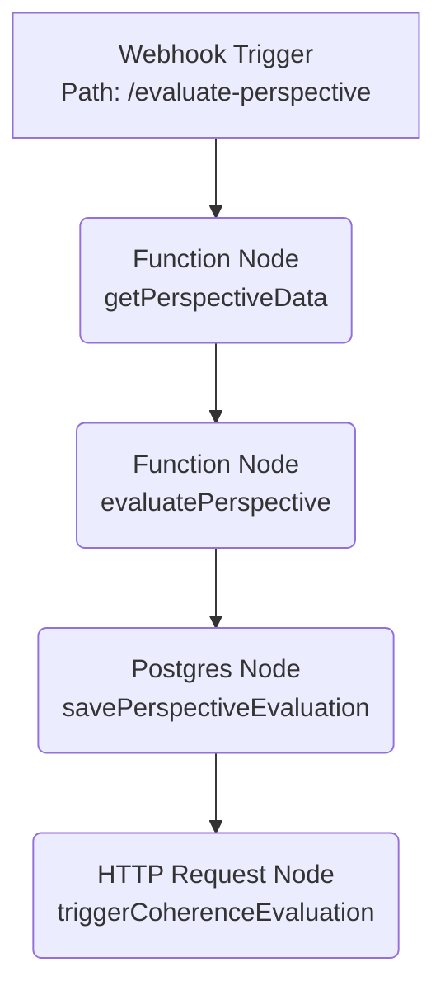
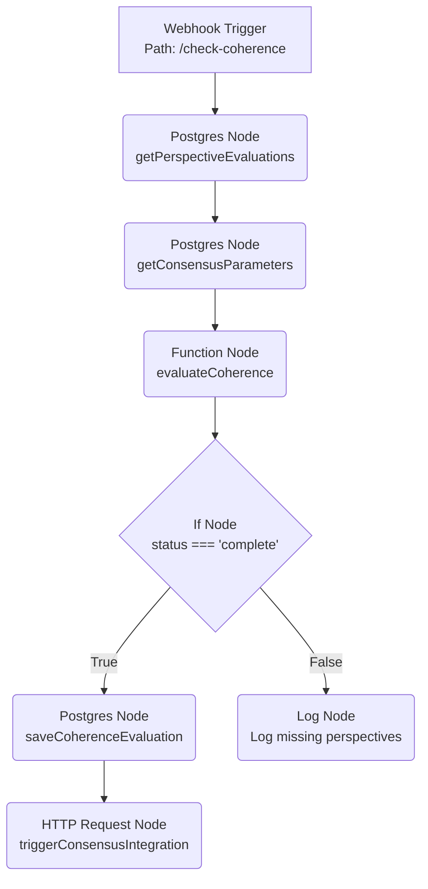
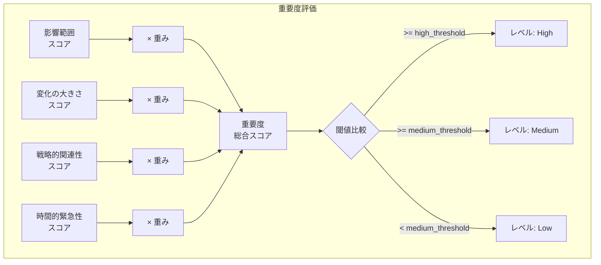

# コンセンサスモデルの実装（パート2：基本ロジックと評価メカニズム）再構成アウトライン

## 1. コンセンサスモデルの評価メカニズムの概要と目的

### 1.1. 評価メカニズムの位置づけと重要性
- コンセンサスモデル全体における評価メカニズムの役割
- 3つの視点（テクノロジー、マーケット、ビジネス）からの情報を評価する意義
- 評価プロセスの全体像と主要コンポーネント

### 1.2. 評価メカニズムの主要な目的
- 視点別情報の重要度と確信度の定量化
- 視点間の整合性の評価と検証
- 信頼性の高い統合評価結果の導出
- 意思決定支援のための明確な指標提供

## 2. 評価メカニズムの基本構造とアーキテクチャ

### 2.1. 評価プロセス全体のフロー（テキスト表現）
```
評価メカニズム
├── 視点別評価プロセス
│   ├── 重要度評価コンポーネント
│   │   ├── 影響範囲評価
│   │   ├── 変化の大きさ評価
│   │   ├── 戦略的関連性評価
│   │   └── 時間的緊急性評価
│   └── 確信度評価コンポーネント
│       ├── 情報源信頼性評価
│       ├── データ量・質評価
│       ├── 一貫性評価
│       └── 検証可能性評価
└── 整合性評価プロセス
    ├── 視点間一致度評価
    ├── 論理的整合性評価
    ├── 時間的整合性評価
    └── コンテキスト整合性評価
```

### 2.2. 評価プロセス全体のフロー図（Mermaid）
```mermaid
graph LR
    A[入力: 視点別情報<br>(変化点, 分析結果)] --> B(視点別評価プロセス<br>n8n Workflow 1);
    B -- 重要度・確信度評価 --> C[(評価結果DB)];
    C --> D(整合性評価プロセス<br>n8n Workflow 2);
    
    subgraph 視点別評価 
        B
    end
    
    subgraph 統合評価
        D
    end
    
    D -- 整合性評価 --> C;
    C --> E[出力: 統合評価結果<br>(重要度, 確信度, 整合性)];
```

### 2.3. 各評価コンポーネントの詳細

#### 2.3.1. 重要度評価コンポーネント
- 影響範囲評価：影響を受ける顧客数、市場規模などの評価
- 変化の大きさ評価：成長率の変化幅、技術的進歩の度合いなどの評価
- 戦略的関連性評価：KPIへの影響度、戦略目標との整合性などの評価
- 時間的緊急性評価：対応までの猶予期間、競合動向との関連などの評価

#### 2.3.2. 確信度評価コンポーネント
- 情報源信頼性評価：情報源の過去の実績、専門性などの評価
- データ量・質評価：データポイント数、収集期間、データ品質などの評価
- 一貫性評価：複数情報源間の一致度、時系列的一貫性などの評価
- 検証可能性評価：情報の検証可能性、再現性などの評価

#### 2.3.3. 整合性評価コンポーネント
- 視点間一致度評価：3つの視点からの評価結果の一致度合いの評価
- 論理的整合性評価：前提と結論の矛盾がないかの評価
- 時間的整合性評価：過去のトレンドとの整合性の評価
- コンテキスト整合性評価：業界全体の動向との整合性の評価

## 3. 評価メカニズムの設計原則

### 3.1. 定量的評価と定性的解釈の両立
- 数値スコアとレベル（High/Medium/Low）の併用
- 評価結果の解釈ガイドラインの提供
- 定量評価の限界と定性的判断の重要性

### 3.2. 多層的評価アプローチ
- 個別要素の評価から総合評価への段階的アプローチ
- 重み付けによる要素間の重要度調整
- 閾値設定による評価レベルの決定

### 3.3. 評価の透明性と説明可能性
- 評価プロセスの各ステップの記録と追跡
- 評価結果の根拠の明示
- 評価パラメータの明確な定義と調整可能性

### 3.4. 評価結果のフィードバックと継続的改善
- 評価結果の有効性の検証方法
- ユーザーフィードバックの収集と反映
- パラメータの自動調整メカニズム

## 4. 視点別評価プロセスの実装

### 4.1. n8nによる視点別評価ワークフロー
- ワークフロー構造と主要ノード
- 各ノードの機能と連携方法
- 環境制約と代替実装オプション

#### 4.1.1. ワークフロー構造（Mermaid）


#### 4.1.2. 重要度評価ロジック（JavaScript）
```javascript
// 重要度評価の主要ロジック
function evaluateImportance(analysisResults, params) {
  // 影響範囲の評価
  const impactScore = calculateImpactScope(analysisResults);
  
  // 変化の大きさの評価
  const magnitudeScore = calculateChangeMagnitude(analysisResults);
  
  // 戦略的関連性の評価
  const relevanceScore = calculateStrategicRelevance(analysisResults);
  
  // 時間的緊急性の評価
  const urgencyScore = calculateTimeUrgency(analysisResults);
  
  // 重み付け計算
  const weightedScore = 
    params.impactScope.weight * impactScore +
    params.changeMagnitude.weight * magnitudeScore +
    params.strategicRelevance.weight * relevanceScore +
    params.timeUrgency.weight * urgencyScore;
  
  // レベル判定
  let level;
  if (weightedScore >= params.thresholds.high) level = 'high';
  else if (weightedScore >= params.thresholds.medium) level = 'medium';
  else level = 'low';
  
  return {
    score: weightedScore,
    level: level,
    components: {
      impact_scope: impactScore,
      change_magnitude: magnitudeScore,
      strategic_relevance: relevanceScore,
      time_urgency: urgencyScore
    }
  };
}
```

#### 4.1.3. 確信度評価ロジック（JavaScript）
```javascript
// 確信度評価の主要ロジック
function evaluateConfidence(analysisResults, params) {
  // 情報源信頼性の評価
  const reliabilityScore = calculateSourceReliability(analysisResults);
  
  // データ量・質の評価
  const dataScore = calculateDataVolume(analysisResults);
  
  // 一貫性の評価
  const consistencyScore = calculateConsistency(analysisResults);
  
  // 検証可能性の評価
  const verifiabilityScore = calculateVerifiability(analysisResults);
  
  // 重み付け計算
  const weightedScore = 
    params.sourceReliability.weight * reliabilityScore +
    params.dataVolume.weight * dataScore +
    params.consistency.weight * consistencyScore +
    params.verifiability.weight * verifiabilityScore;
  
  // レベル判定
  let level;
  if (weightedScore >= params.thresholds.high) level = 'high';
  else if (weightedScore >= params.thresholds.medium) level = 'medium';
  else level = 'low';
  
  return {
    score: weightedScore,
    level: level,
    components: {
      source_reliability: reliabilityScore,
      data_volume: dataScore,
      consistency: consistencyScore,
      verifiability: verifiabilityScore
    }
  };
}
```

### 4.2. データベーススキーマ設計

#### 4.2.1. 視点別評価結果テーブル（Mermaid）
```mermaid
graph TD
    subgraph "perspective_evaluations Table"
        col1[id] --> type1[SERIAL PRIMARY KEY]
        col2[perspective_id] --> type2[VARCHAR(50) NOT NULL]
        col3[topic_id] --> type3[VARCHAR(50) NOT NULL]
        col4[date] --> type4[DATE NOT NULL]
        col5[importance] --> type5[JSONB NOT NULL<br><i>{score, level, components: {...}}</i>]
        col6[confidence] --> type6[JSONB NOT NULL<br><i>{score, level, components: {...}}</i>]
        col7[overall_score] --> type7[FLOAT NOT NULL]
        col8[created_at] --> type8[TIMESTAMP WITH TIME ZONE DEFAULT CURRENT_TIMESTAMP]
        constraint1["UNIQUE (perspective_id, topic_id, date)"]
    end
```

### 4.3. APIエンドポイント設計
- `/evaluate-perspective` エンドポイントの仕様
- リクエスト・レスポンスの形式
- エラーハンドリングと検証

## 5. 整合性評価プロセスの実装

### 5.1. n8nによる整合性評価ワークフロー
- ワークフロー構造と主要ノード
- 各ノードの機能と連携方法
- 環境制約と代替実装オプション

#### 5.1.1. ワークフロー構造（Mermaid）


#### 5.1.2. 整合性評価ロジック（JavaScript）
```javascript
// 整合性評価の主要ロジック
function evaluateCoherenceHelper(evaluations, params) {
  // 視点間一致度の評価
  const perspectiveAgreementScore = calculatePerspectiveAgreement(evaluations);
  
  // 論理的整合性の評価
  const logicalCoherenceScore = calculateLogicalCoherence(evaluations);
  
  // 時間的整合性の評価
  const temporalCoherenceScore = calculateTemporalCoherence(evaluations);
  
  // コンテキスト整合性の評価
  const contextualCoherenceScore = calculateContextualCoherence(evaluations);
  
  // 重み付け計算
  const coherenceScore = 
    params.perspectiveAgreement.weight * perspectiveAgreementScore +
    params.logicalCoherence.weight * logicalCoherenceScore +
    params.temporalCoherence.weight * temporalCoherenceScore +
    params.contextualCoherence.weight * contextualCoherenceScore;
  
  // レベル判定
  let coherenceLevel;
  if (coherenceScore >= params.thresholds.high) {
    coherenceLevel = 'high';
  } else if (coherenceScore >= params.thresholds.medium) {
    coherenceLevel = 'medium';
  } else {
    coherenceLevel = 'low';
  }
  
  return {
    score: coherenceScore,
    level: coherenceLevel,
    components: {
      perspective_agreement: perspectiveAgreementScore,
      logical_coherence: logicalCoherenceScore,
      temporal_coherence: temporalCoherenceScore,
      contextual_coherence: contextualCoherenceScore
    }
  };
}
```

### 5.2. データベーススキーマ設計

#### 5.2.1. 整合性評価結果テーブル（Mermaid）
```mermaid
graph TD
    subgraph "coherence_evaluations Table"
        col1[id] --> type1[SERIAL PRIMARY KEY]
        col2[topic_id] --> type2[VARCHAR(50) NOT NULL]
        col3[date] --> type3[DATE NOT NULL]
        col4[coherence] --> type4[JSONB NOT NULL<br><i>{score, level, components: {...}}</i>]
        col5[created_at] --> type5[TIMESTAMP WITH TIME ZONE DEFAULT CURRENT_TIMESTAMP]
        constraint1["UNIQUE (topic_id, date)"]
    end
```

### 5.3. APIエンドポイント設計
- `/check-coherence` エンドポイントの仕様
- リクエスト・レスポンスの形式
- エラーハンドリングと検証

## 6. 評価計算ロジックの詳細

### 6.1. 重要度評価の計算方法
- 影響範囲評価の具体的計算式と例
- 変化の大きさ評価の具体的計算式と例
- 戦略的関連性評価の具体的計算式と例
- 時間的緊急性評価の具体的計算式と例

### 6.2. 確信度評価の計算方法
- 情報源信頼性評価の具体的計算式と例
- データ量・質評価の具体的計算式と例
- 一貫性評価の具体的計算式と例
- 検証可能性評価の具体的計算式と例

### 6.3. 整合性評価の計算方法
- 視点間一致度評価の具体的計算式と例
- 論理的整合性評価の具体的計算式と例
- 時間的整合性評価の具体的計算式と例
- コンテキスト整合性評価の具体的計算式と例

### 6.4. 評価計算ロジックの図解（Mermaid）


## 7. 実践的なユースケースと例

### 7.1. 製造業：新技術導入評価
- シナリオ概要と背景
- 3つの視点からの評価データ例
- 評価プロセスの適用と結果
- 意思決定への活用方法

### 7.2. 小売業：新市場参入評価
- シナリオ概要と背景
- 3つの視点からの評価データ例
- 評価プロセスの適用と結果
- 意思決定への活用方法

### 7.3. 金融業：新規投資戦略評価
- シナリオ概要と背景
- 3つの視点からの評価データ例
- 評価プロセスの適用と結果
- 意思決定への活用方法

### 7.4. 業種・用途に応じたパラメータ調整ガイド
- 業種別の重み付け推奨値
- 用途別の閾値設定ガイド
- カスタマイズポイントと調整方法

## 8. 技術的課題と対応策

### 8.1. パフォーマンス最適化
- 大量データ処理時の課題
- インデックス設計と最適化
- キャッシュ戦略
- 非同期処理の活用

### 8.2. エラーハンドリングと耐障害性
- 一般的なエラーパターンと対策
- リトライ戦略
- フォールバックメカニズム
- 監視とアラート

### 8.3. スケーラビリティと分散処理
- 水平スケーリングの方法
- 分散処理アーキテクチャ
- ロードバランシング戦略
- データ整合性の確保

### 8.4. セキュリティ考慮事項
- 認証と認可
- データ暗号化
- 入力検証とサニタイズ
- 監査ログ

## 9. 評価と検証フレームワーク

### 9.1. 評価メカニズムの精度検証
- 検証方法と指標
- ベンチマークデータセット
- 精度向上のためのアプローチ

### 9.2. バックテストと実績比較
- 過去データを用いた検証方法
- 実際の意思決定との比較
- 改善点の特定と対応

### 9.3. 感度分析とパラメータ最適化
- パラメータ変動の影響分析
- 最適パラメータセットの探索
- 自動最適化の方法

### 9.4. A/Bテストによるロジック比較
- テスト設計と実施方法
- 結果分析と評価
- 継続的改善サイクル

## 10. 段階的実装ガイド

### 10.1. ステップ1：最小限の評価ロジック実装
- 必須コンポーネントの特定
- 簡易版評価ロジックの実装
- 初期テストと検証

### 10.2. ステップ2：n8nワークフローの構築
- 基本ワークフローの設計
- ノード間の連携設定
- 代替実装オプション

### 10.3. ステップ3：データベース連携と永続化
- スキーマ設計と作成
- データ永続化の実装
- クエリ最適化

### 10.4. ステップ4：高度な評価機能と最適化
- 追加評価コンポーネントの実装
- パフォーマンス最適化
- UI/ダッシュボード連携

### 10.5. 実装チェックリスト
- 必須コンポーネント確認リスト
- 品質チェック項目
- デプロイ前確認事項

## 11. 読者フィードバック活用の仕組み

### 11.1. フィードバック収集方法の提案
- フィードバックフォームの設計
- 定期的なユーザーインタビュー
- 使用状況の分析

### 11.2. 継続的改善サイクル
- フィードバック分析プロセス
- 優先順位付けの方法
- リリースサイクルと更新計画

## 12. まとめと次のステップ

- 評価メカニズムの主要ポイント総括
- 実装における重要な考慮事項
- 次のステップ：統合レイヤーへの接続
- 今後の発展方向性
