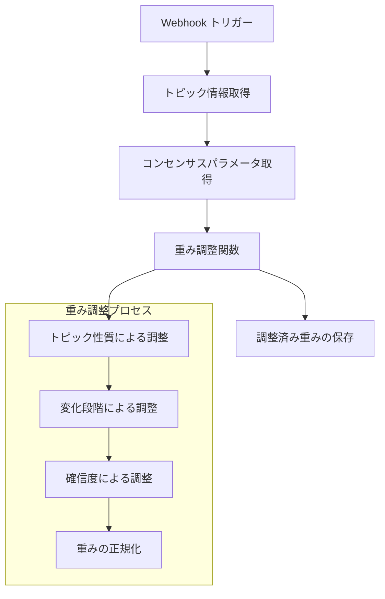
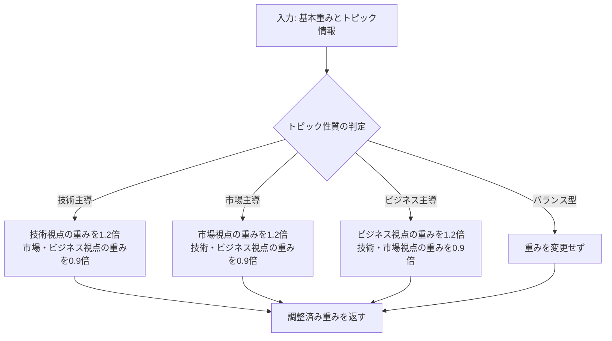
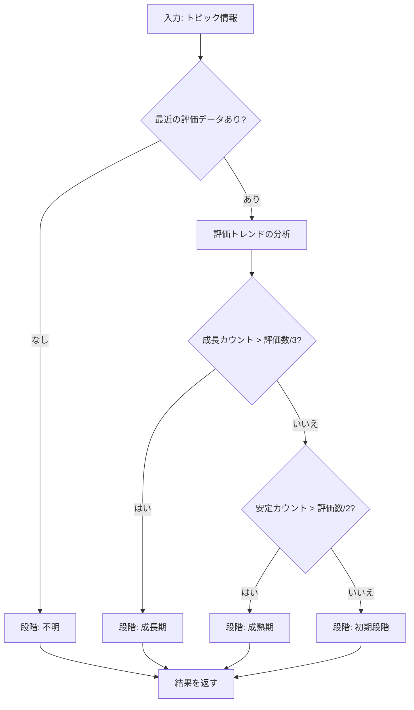
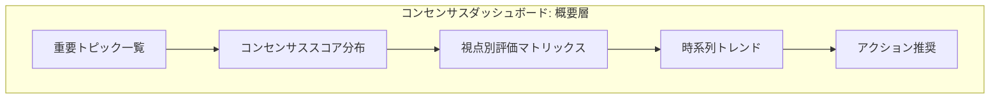

# コンセンサスモデルの実装（パート3：コンセンサス基準と重み付け方法）[改訂版]

## コンセンサス基準の設計

コンセンサスモデルの効果的な運用には、適切なコンセンサス基準の設計が不可欠です。コンセンサス基準は、3つの視点（テクノロジー、マーケット、ビジネス）からの情報を統合し、最適な解釈と判断を導き出すための基準となります。このセクションでは、n8nを活用したコンセンサス基準の設計と実装方法について解説します。

### コンセンサス基準の基本原則

コンセンサス基準の設計にあたっては、以下の基本原則を考慮します：

1. **視点間の関係性の尊重**
   - マーケット視点の先行性
   - テクノロジー視点の基盤性
   - ビジネス視点の実効性

2. **多次元評価の統合**
   - 重要度評価
   - 確信度評価
   - 整合性評価

3. **静止点の明確な定義と検出**
   - 3つのレイヤの総合判定における最適解
   - 安定性と堅牢性の評価

4. **透明性と説明可能性の確保**
   - 判断プロセスの透明化
   - 判断根拠の明示

### 視点別の重み付け

3つの視点（テクノロジー、マーケット、ビジネス）には、それぞれ異なる役割と重要性があります。視点別の基本的な重み付けは以下の通りです：

| 視点 | 基本重み | 役割 | 重み付けの根拠 |
|------|----------|------|----------------|
| マーケット | 0.40 | 先行指標 | 市場の受容性・需要が基点となるため、やや高い重みを設定 |
| テクノロジー | 0.30 | 基盤 | 技術的実現可能性が基盤となるため、中程度の重みを設定 |
| ビジネス | 0.30 | 実効性評価 | 事業としての成立性を判断するため、中程度の重みを設定 |

ただし、これらの重みは固定ではなく、以下の要因によって動的に調整されます：

1. **トピックの性質**
   - 技術革新が中心のトピックではテクノロジー視点の重みを増加
   - 市場変化が中心のトピックではマーケット視点の重みを増加
   - ビジネスモデル変革が中心のトピックではビジネス視点の重みを増加

2. **変化の段階**
   - 初期段階ではテクノロジー視点とマーケット視点の重みを増加
   - 成長段階ではマーケット視点の重みを増加
   - 成熟段階ではビジネス視点の重みを増加

3. **確信度の差異**
   - 確信度の高い視点の重みを増加
   - 確信度の低い視点の重みを減少

### 評価要素の重み付け

重要度評価、確信度評価、整合性評価の各要素には、それぞれ異なる重みが設定されています。

#### 重要度評価の要素と重み

| 要素 | 重み | 説明 |
|------|------|------|
| 影響範囲 | 0.25 | 変化が影響を与える範囲の広さ |
| 変化の大きさ | 0.25 | 変化の量的・質的な大きさ |
| 戦略的関連性 | 0.30 | 組織の戦略目標との関連性 |
| 時間的緊急性 | 0.20 | 対応の緊急性 |

#### 確信度評価の要素と重み

| 要素 | 重み | 説明 |
|------|------|------|
| 情報源の信頼性 | 0.30 | 情報源の権威性や過去の正確性 |
| データ量 | 0.20 | 分析に使用されたデータの量 |
| 一貫性 | 0.30 | 複数の情報源や時点での一貫性 |
| 検証可能性 | 0.20 | 情報が独立に検証可能かどうか |

#### 整合性評価の要素と重み

| 要素 | 重み | 説明 |
|------|------|------|
| 視点間の一致度 | 0.40 | 異なる視点からの評価の一致度 |
| 論理的整合性 | 0.30 | 情報間の論理的な矛盾の有無 |
| 時間的整合性 | 0.20 | 時系列での整合性 |
| コンテキスト整合性 | 0.10 | より広いコンテキストとの整合性 |

### 閾値の設定

コンセンサスモデルでは、各評価要素に対して閾値を設定し、評価結果のレベル分けを行います。基本的な閾値は以下の通りです：

| レベル | 閾値 | 説明 |
|--------|------|------|
| 高 | 0.8以上 | 非常に高い評価 |
| 中高 | 0.6〜0.8 | やや高い評価 |
| 中 | 0.4〜0.6 | 中程度の評価 |
| 中低 | 0.2〜0.4 | やや低い評価 |
| 低 | 0.2未満 | 非常に低い評価 |

これらの閾値は、以下の要因によって調整されることがあります：

1. **トピックの重要性**
   - 重要なトピックでは閾値をやや厳しく設定
   - 一般的なトピックでは標準的な閾値を適用

2. **データの質と量**
   - データの質と量が高い場合は閾値を厳しく設定
   - データの質と量が低い場合は閾値を緩和

3. **意思決定の重要性**
   - 重要な意思決定に関わる場合は閾値を厳しく設定
   - 探索的な分析の場合は閾値を緩和

## 重み付け方法の実装

n8nを活用して、コンセンサス基準の重み付け方法を実装します。以下では、動的な重み付け調整を行うワークフローを示します。

### 実装の全体構造

重み付け方法の実装は、以下の主要コンポーネントで構成されています：

1. **トリガー**: Webhookによるリクエスト受信
2. **データ取得**: トピック情報とコンセンサスパラメータの取得
3. **重み調整**: トピックの性質、変化段階、確信度に基づく重み調整
4. **データ保存**: 調整された重みの保存

以下の図は、実装の全体構造を示しています：



### コード実装と詳細解説

```javascript
// n8n workflow: Dynamic Weight Adjustment
// Trigger: Webhook
[
  {
    "id": "webhook",
    "type": "n8n-nodes-base.webhook",
    "parameters": {
      "path": "adjust-weights",
      "responseMode": "onReceived",
      "options": {}
    }
  },
  {
    "id": "getTopicInfo",
    "type": "n8n-nodes-base.postgres",
    "parameters": {
      "operation": "executeQuery",
      "query": `
        -- Get topic information
        SELECT
          t.id,
          t.name,
          t.description,
          t.keywords,
          t.perspective_id AS primary_perspective,
          (
            SELECT jsonb_agg(
              jsonb_build_object(
                'date', pe.date,
                'perspective_id', pe.perspective_id,
                'importance', pe.importance,
                'confidence', pe.confidence,
                'overall_score', pe.overall_score
              )
            )
            FROM perspective_evaluations pe
            WHERE pe.topic_id = t.id
            ORDER BY pe.date DESC
            LIMIT 10
          ) AS recent_evaluations
        FROM
          topics t
        WHERE
          t.id = '{{ $json.topic_id }}'
      `
    }
  },
  {
    "id": "getConsensusParameters",
    "type": "n8n-nodes-base.postgres",
    "parameters": {
      "operation": "executeQuery",
      "query": `
        -- Get active consensus parameters
        SELECT parameters
        FROM consensus_parameters
        WHERE is_active = TRUE
        ORDER BY created_at DESC
        LIMIT 1
      `
    }
  },
  {
    "id": "adjustWeights",
    "type": "n8n-nodes-base.function",
    "parameters": {
      "functionCode": `
        // メイン処理: 入力データの取得と重み調整の実行
        try {
          const topicInfo = $input.item.json;
          const consensusParameters = $input.item.json.parameters;
          
          // 基本重みの取得
          const baseWeights = {
            technology: consensusParameters.perspectiveWeights.technology,
            market: consensusParameters.perspectiveWeights.market,
            business: consensusParameters.perspectiveWeights.business
          };
          
          // トピック性質による重み調整
          const adjustedWeights = adjustWeightsByTopicNature(baseWeights, topicInfo);
          
          // 変化段階による重み調整
          const furtherAdjustedWeights = adjustWeightsByChangeStage(adjustedWeights, topicInfo);
          
          // 確信度差異による重み調整
          const finalWeights = adjustWeightsByConfidence(furtherAdjustedWeights, topicInfo);
          
          // 重みの正規化（合計が1.0になるよう調整）
          const normalizedWeights = normalizeWeights(finalWeights);
          
          return {
            json: {
              topic_id: topicInfo.id,
              topic_name: topicInfo.name,
              base_weights: baseWeights,
              adjusted_weights: normalizedWeights,
              adjustment_factors: {
                topic_nature: getTopicNature(topicInfo),
                change_stage: getChangeStage(topicInfo),
                confidence_differences: getConfidenceDifferences(topicInfo)
              }
            }
          };
        } catch (error) {
          // エラーハンドリング
          console.error('Weight adjustment error:', error.message);
          return {
            json: {
              error: true,
              message: error.message,
              topic_id: $input.item.json?.id || 'unknown',
              // デフォルト値を返す
              base_weights: {
                technology: 0.3,
                market: 0.4,
                business: 0.3
              },
              adjusted_weights: {
                technology: 0.3,
                market: 0.4,
                business: 0.3
              }
            }
          };
        }
        
        // ヘルパー関数: トピック性質による重み調整
        function adjustWeightsByTopicNature(weights, topicInfo) {
          try {
            const topicNature = getTopicNature(topicInfo);
            const adjustedWeights = {...weights};
            
            // トピック性質に基づく調整係数の適用
            if (topicNature === 'technology_driven') {
              adjustedWeights.technology *= 1.2;
              adjustedWeights.market *= 0.9;
              adjustedWeights.business *= 0.9;
            } else if (topicNature === 'market_driven') {
              adjustedWeights.technology *= 0.9;
              adjustedWeights.market *= 1.2;
              adjustedWeights.business *= 0.9;
            } else if (topicNature === 'business_driven') {
              adjustedWeights.technology *= 0.9;
              adjustedWeights.market *= 0.9;
              adjustedWeights.business *= 1.2;
            }
            
            return adjustedWeights;
          } catch (error) {
            console.error('Error in adjustWeightsByTopicNature:', error.message);
            return weights; // エラー時は元の重みを返す
          }
        }
        
        // ヘルパー関数: トピック性質の判定
        function getTopicNature(topicInfo) {
          try {
            // 主要視点とキーワードに基づくトピック性質の判定
            const primaryPerspective = topicInfo.primary_perspective;
            const keywords = topicInfo.keywords || [];
            
            // 技術関連キーワード
            const techKeywords = ['技術', '革新', 'AI', '人工知能', '機械学習', 'ブロックチェーン', 'IoT', '量子', '5G', '6G'];
            
            // 市場関連キーワード
            const marketKeywords = ['市場', '顧客', 'ニーズ', 'トレンド', '競合', '需要', 'シェア', '成長', '普及'];
            
            // ビジネス関連キーワード
            const businessKeywords = ['事業', '戦略', '収益', '利益', 'コスト', 'ROI', '投資', 'リスク', '組織'];
            
            // キーワードマッチのカウント
            let techCount = 0;
            let marketCount = 0;
            let businessCount = 0;
            
            for (const keyword of keywords) {
              if (techKeywords.some(k => keyword.includes(k))) techCount++;
              if (marketKeywords.some(k => keyword.includes(k))) marketCount++;
              if (businessKeywords.some(k => keyword.includes(k))) businessCount++;
            }
            
            // カウント結果と主要視点に基づく性質判定
            if (techCount > marketCount && techCount > businessCount) {
              return 'technology_driven';
            } else if (marketCount > techCount && marketCount > businessCount) {
              return 'market_driven';
            } else if (businessCount > techCount && businessCount > marketCount) {
              return 'business_driven';
            } else {
              // カウントが同じ場合は主要視点を使用
              return primaryPerspective ? \`\${primaryPerspective}_driven\` : 'balanced';
            }
          } catch (error) {
            console.error('Error in getTopicNature:', error.message);
            return 'balanced'; // エラー時はバランス型と判定
          }
        }
        
        // ヘルパー関数: 変化段階による重み調整
        function adjustWeightsByChangeStage(weights, topicInfo) {
          try {
            const changeStage = getChangeStage(topicInfo);
            const adjustedWeights = {...weights};
            
            // 変化段階に基づく調整係数の適用
            if (changeStage === 'early') {
              adjustedWeights.technology *= 1.1;
              adjustedWeights.market *= 1.1;
              adjustedWeights.business *= 0.8;
            } else if (changeStage === 'growth') {
              adjustedWeights.technology *= 0.9;
              adjustedWeights.market *= 1.2;
              adjustedWeights.business *= 0.9;
            } else if (changeStage === 'mature') {
              adjustedWeights.technology *= 0.8;
              adjustedWeights.market *= 0.9;
              adjustedWeights.business *= 1.3;
            }
            
            return adjustedWeights;
          } catch (error) {
            console.error('Error in adjustWeightsByChangeStage:', error.message);
            return weights; // エラー時は元の重みを返す
          }
        }
        
        // ヘルパー関数: 変化段階の判定
        function getChangeStage(topicInfo) {
          try {
            // 最近の評価結果に基づく変化段階の判定
            const recentEvaluations = topicInfo.recent_evaluations || [];
            
            if (recentEvaluations.length === 0) {
              return 'unknown';
            }
            
            // 評価トレンドの分析
            let growthCount = 0;
            let stabilityCount = 0;
            
            for (let i = 1; i < recentEvaluations.length; i++) {
              const current = recentEvaluations[i - 1];
              const previous = recentEvaluations[i];
              
              // 市場視点のスコア比較
              const currentMarket = current.find(e => e.perspective_id === 'market');
              const previousMarket = previous.find(e => e.perspective_id === 'market');
              
              if (currentMarket && previousMarket) {
                const change = currentMarket.overall_score - previousMarket.overall_score;
                
                if (change > 0.1) {
                  growthCount++;
                } else if (Math.abs(change) <= 0.05) {
                  stabilityCount++;
                }
              }
            }
            
            // 成長カウントと安定カウントに基づく段階判定
            if (growthCount > recentEvaluations.length / 3) {
              return 'growth';
            } else if (stabilityCount > recentEvaluations.length / 2) {
              return 'mature';
            } else {
              return 'early';
            }
          } catch (error) {
            console.error('Error in getChangeStage:', error.message);
            return 'unknown'; // エラー時は不明と判定
          }
        }
        
        // ヘルパー関数: 確信度差異による重み調整
        function adjustWeightsByConfidence(weights, topicInfo) {
          try {
            const confidenceDifferences = getConfidenceDifferences(topicInfo);
            const adjustedWeights = {...weights};
            
            // 高確信度の視点の重みを強化
            for (const perspective in confidenceDifferences) {
              const confidenceDiff = confidenceDifferences[perspective];
              
              if (confidenceDiff > 0.2) {
                adjustedWeights[perspective] *= 1.1;
              } else if (confidenceDiff < -0.2) {
                adjustedWeights[perspective] *= 0.9;
              }
            }
            
            return adjustedWeights;
          } catch (error) {
            console.error('Error in adjustWeightsByConfidence:', error.message);
            return weights; // エラー時は元の重みを返す
          }
        }
        
        // ヘルパー関数: 確信度差異の計算
        function getConfidenceDifferences(topicInfo) {
          try {
            // 平均からの確信度差異を計算
            const recentEvaluations = topicInfo.recent_evaluations || [];
            
            if (recentEvaluations.length === 0) {
              return {
                technology: 0,
                market: 0,
                business: 0
              };
            }
            
            // 最新の評価を取得
            const latestEvaluation = recentEvaluations[0];
            
            // 確信度スコアの抽出
            const confidenceScores = {
              technology: 0,
              market: 0,
              business: 0
            };
            
            let count = 0;
            
            for (const eval of latestEvaluation) {
              const perspectiveId = eval.perspective_id;
              if (perspectiveId in confidenceScores) {
                confidenceScores[perspectiveId] = eval.confidence.score;
                count++;
              }
            }
            
            if (count === 0) {
              return {
                technology: 0,
                market: 0,
                business: 0
              };
            }
            
            // 平均確信度の計算
            const avgConfidence = (confidenceScores.technology + confidenceScores.market + confidenceScores.business) / count;
            
            // 平均からの差異を計算
            return {
              technology: confidenceScores.technology - avgConfidence,
              market: confidenceScores.market - avgConfidence,
              business: confidenceScores.business - avgConfidence
            };
          } catch (error) {
            console.error('Error in getConfidenceDifferences:', error.message);
            return {
              technology: 0,
              market: 0,
              business: 0
            }; // エラー時はゼロ差異を返す
          }
        }
        
        // ヘルパー関数: 重みの正規化
        function normalizeWeights(weights) {
          try {
            const sum = weights.technology + weights.market + weights.business;
            
            if (sum === 0) {
              throw new Error('Weight sum is zero, cannot normalize');
            }
            
            return {
              technology: weights.technology / sum,
              market: weights.market / sum,
              business: weights.business / sum
            };
          } catch (error) {
            console.error('Error in normalizeWeights:', error.message);
            return {
              technology: 0.33,
              market: 0.34,
              business: 0.33
            }; // エラー時はほぼ均等な重みを返す
          }
        }
      `
    }
  },
  {
    "id": "saveAdjustedWeights",
    "type": "n8n-nodes-base.postgres",
    "parameters": {
      "operation": "executeQuery",
      "query": `
        -- Create topic_weights table if not exists
        CREATE TABLE IF NOT EXISTS topic_weights (
          id SERIAL PRIMARY KEY,
          topic_id VARCHAR(50) NOT NULL,
          weights JSONB NOT NULL,
          adjustment_factors JSONB NOT NULL,
          created_at TIMESTAMP WITH TIME ZONE DEFAULT CURRENT_TIMESTAMP,
          
          CONSTRAINT unique_topic UNIQUE (topic_id)
        );
        
        -- Insert or update topic weights
        INSERT INTO topic_weights (
          topic_id,
          weights,
          adjustment_factors
        )
        VALUES (
          '{{ $json.topic_id }}',
          '{{ $json.adjusted_weights | json | replace("'", "''") }}'::jsonb,
          '{{ $json.adjustment_factors | json | replace("'", "''") }}'::jsonb
        )
        ON CONFLICT (topic_id)
        DO UPDATE SET
          weights = '{{ $json.adjusted_weights | json | replace("'", "''") }}'::jsonb,
          adjustment_factors = '{{ $json.adjustment_factors | json | replace("'", "''") }}'::jsonb,
          created_at = CURRENT_TIMESTAMP;
      `
    }
  }
]
```

### 重み調整プロセスのフローチャート

以下は、`adjustWeightsByTopicNature`関数のフローチャートです：



以下は、`getChangeStage`関数のフローチャートです：



## コンセンサス結果の視覚化と意思決定支援インターフェース

コンセンサスモデルの出力を効果的に活用するためには、適切な視覚化と意思決定支援インターフェースが不可欠です。ここでは、n8nを活用したコンセンサス結果の視覚化方法について解説します。

### 多層的ダッシュボードの設計

コンセンサス結果は、多層的なダッシュボードを通じて視覚化されます。ダッシュボードは以下の層で構成されています：

1. **概要層**: 全体的なコンセンサス状況を一目で把握できるサマリービュー
2. **視点層**: 3つの視点（テクノロジー、マーケット、ビジネス）ごとの詳細評価
3. **詳細層**: 個別トピックや評価要素の詳細分析

以下は、概要層のダッシュボードの例です：



### インターフェース実装例

n8nとWebアプリケーションを連携させ、以下のようなインターフェースを実装できます：

1. **n8nワークフロー**: データ取得と前処理を担当
2. **フロントエンドアプリケーション**: データの視覚化と対話機能を提供

以下は、n8nとフロントエンドを連携させるワークフローの例です：

```javascript
// n8n workflow: Consensus Visualization API
[
  {
    "id": "webhookTrigger",
    "type": "n8n-nodes-base.webhook",
    "parameters": {
      "path": "consensus-data",
      "responseMode": "lastNode",
      "options": {}
    }
  },
  {
    "id": "getConsensusData",
    "type": "n8n-nodes-base.postgres",
    "parameters": {
      "operation": "executeQuery",
      "query": `
        -- Get consensus data for visualization
        SELECT
          t.id AS topic_id,
          t.name AS topic_name,
          t.description,
          tw.weights,
          tw.adjustment_factors,
          (
            SELECT jsonb_agg(
              jsonb_build_object(
                'perspective_id', pe.perspective_id,
                'importance', pe.importance,
                'confidence', pe.confidence,
                'overall_score', pe.overall_score,
                'date', pe.date
              )
            )
            FROM perspective_evaluations pe
            WHERE pe.topic_id = t.id
            ORDER BY pe.date DESC
            LIMIT 10
          ) AS evaluations,
          (
            SELECT jsonb_agg(
              jsonb_build_object(
                'date', ce.date,
                'consensus_score', ce.consensus_score,
                'coherence', ce.coherence,
                'stability', ce.stability
              )
            )
            FROM consensus_evaluations ce
            WHERE ce.topic_id = t.id
            ORDER BY ce.date DESC
            LIMIT 10
          ) AS consensus_evaluations
        FROM
          topics t
        LEFT JOIN
          topic_weights tw ON t.id = tw.topic_id
        WHERE
          t.id = '{{ $json.topic_id }}'
          OR '{{ $json.topic_id }}' = 'all'
        ORDER BY
          CASE WHEN '{{ $json.topic_id }}' = 'all' THEN
            (SELECT MAX(ce.consensus_score) FROM consensus_evaluations ce WHERE ce.topic_id = t.id)
          ELSE 0 END DESC
        LIMIT
          CASE WHEN '{{ $json.topic_id }}' = 'all' THEN 10 ELSE 1 END
      `
    }
  },
  {
    "id": "prepareVisualizationData",
    "type": "n8n-nodes-base.function",
    "parameters": {
      "functionCode": `
        // データの整形と視覚化用の追加情報の付与
        const rawData = $input.item.json;
        
        // 単一トピックか複数トピックかを判断
        const isSingleTopic = !Array.isArray(rawData) || rawData.length === 1;
        
        if (isSingleTopic) {
          // 単一トピックの詳細データを整形
          const topicData = Array.isArray(rawData) ? rawData[0] : rawData;
          
          // 時系列データの準備
          const timeSeriesData = prepareTimeSeriesData(topicData);
          
          // レーダーチャートデータの準備
          const radarChartData = prepareRadarChartData(topicData);
          
          // 視点間の整合性データの準備
          const coherenceData = prepareCoherenceData(topicData);
          
          return {
            json: {
              topic: {
                id: topicData.topic_id,
                name: topicData.topic_name,
                description: topicData.description
              },
              weights: topicData.weights,
              adjustment_factors: topicData.adjustment_factors,
              visualizations: {
                time_series: timeSeriesData,
                radar_chart: radarChartData,
                coherence: coherenceData
              },
              latest_evaluations: getLatestEvaluations(topicData),
              recommended_actions: generateRecommendedActions(topicData)
            }
          };
        } else {
          // 複数トピックの概要データを整形
          const topicsOverview = rawData.map(topic => ({
            id: topic.topic_id,
            name: topic.topic_name,
            latest_consensus: getLatestConsensusScore(topic),
            latest_evaluations: getLatestEvaluations(topic),
            trend: calculateTrend(topic)
          }));
          
          return {
            json: {
              topics: topicsOverview,
              visualizations: {
                topics_heatmap: prepareTopicsHeatmap(rawData),
                consensus_distribution: prepareConsensusDistribution(rawData)
              }
            }
          };
        }
        
        // ヘルパー関数: 時系列データの準備
        function prepareTimeSeriesData(topicData) {
          const evaluations = topicData.evaluations || [];
          const consensusEvals = topicData.consensus_evaluations || [];
          
          // 日付の一覧を取得（重複なし、降順）
          const dates = [...new Set([
            ...evaluations.map(e => e.date),
            ...consensusEvals.map(e => e.date)
          ])].sort().reverse();
          
          // 各日付ごとのデータを準備
          return dates.map(date => {
            // その日付の視点別評価を取得
            const dateEvals = evaluations.filter(e => e.date === date);
            
            // その日付のコンセンサス評価を取得
            const consensusEval = consensusEvals.find(e => e.date === date) || {};
            
            return {
              date,
              technology: dateEvals.find(e => e.perspective_id === 'technology')?.overall_score || null,
              market: dateEvals.find(e => e.perspective_id === 'market')?.overall_score || null,
              business: dateEvals.find(e => e.perspective_id === 'business')?.overall_score || null,
              consensus: consensusEval.consensus_score || null
            };
          });
        }
        
        // ヘルパー関数: レーダーチャートデータの準備
        function prepareRadarChartData(topicData) {
          const latestEvals = getLatestEvaluations(topicData);
          
          return {
            axes: [
              { axis: '重要度', value: calculateAverageScore(latestEvals, 'importance') },
              { axis: '確信度', value: calculateAverageScore(latestEvals, 'confidence') },
              { axis: '整合性', value: getLatestCoherence(topicData) },
              { axis: '安定性', value: getLatestStability(topicData) },
              { axis: 'コンセンサス', value: getLatestConsensusScore(topicData) }
            ],
            perspectives: [
              {
                name: 'テクノロジー',
                values: [
                  { axis: '重要度', value: latestEvals.technology?.importance?.score || 0 },
                  { axis: '確信度', value: latestEvals.technology?.confidence?.score || 0 },
                  { axis: '整合性', value: getLatestCoherence(topicData) * 0.8 }, // 視点固有の整合性は概算
                  { axis: '安定性', value: getLatestStability(topicData) * 0.8 }, // 視点固有の安定性は概算
                  { axis: 'スコア', value: latestEvals.technology?.overall_score || 0 }
                ]
              },
              {
                name: 'マーケット',
                values: [
                  { axis: '重要度', value: latestEvals.market?.importance?.score || 0 },
                  { axis: '確信度', value: latestEvals.market?.confidence?.score || 0 },
                  { axis: '整合性', value: getLatestCoherence(topicData) * 0.9 }, // 視点固有の整合性は概算
                  { axis: '安定性', value: getLatestStability(topicData) * 0.9 }, // 視点固有の安定性は概算
                  { axis: 'スコア', value: latestEvals.market?.overall_score || 0 }
                ]
              },
              {
                name: 'ビジネス',
                values: [
                  { axis: '重要度', value: latestEvals.business?.importance?.score || 0 },
                  { axis: '確信度', value: latestEvals.business?.confidence?.score || 0 },
                  { axis: '整合性', value: getLatestCoherence(topicData) * 0.85 }, // 視点固有の整合性は概算
                  { axis: '安定性', value: getLatestStability(topicData) * 0.85 }, // 視点固有の安定性は概算
                  { axis: 'スコア', value: latestEvals.business?.overall_score || 0 }
                ]
              }
            ]
          };
        }
        
        // その他のヘルパー関数（省略）...
      `
    }
  }
]
```

### サンプルダッシュボードのモックアップ

以下は、コンセンサス結果を視覚化するダッシュボードのモックアップ例です：

```
+---------------------------------------------------------------+
|                   戦略AIレーダー: コンセンサスダッシュボード                |
+------------------------+--------------------------------------+
|                        |                                      |
|   トピック一覧            |   コンセンサス時系列トレンド               |
|   - 量子コンピューティング  |   [折れ線グラフ: 3視点+コンセンサス]      |
|   - 自動運転技術         |                                      |
|   - メタバース           |                                      |
|   - Web3.0             |                                      |
|                        |                                      |
+------------------------+--------------------------------------+
|                        |                                      |
|   視点別評価マトリックス    |   レーダーチャート                     |
|   [3x3マトリックス]       |   [5軸レーダーチャート]                |
|                        |                                      |
|                        |                                      |
+------------------------+--------------------------------------+
|                                                               |
|   推奨アクション                                                 |
|   1. テクノロジー視点: 量子アルゴリズムの研究動向の詳細調査           |
|   2. マーケット視点: 競合他社の量子コンピューティング戦略の分析       |
|   3. ビジネス視点: 量子技術の自社事業への適用可能性の検討           |
|                                                               |
+---------------------------------------------------------------+
```

## コンセンサス基準の適用

コンセンサス基準は、コンセンサスモデルの統合レイヤで適用されます。以下では、コンセンサス基準を適用するプロセスの概要を示します。

### 1. 視点別評価の取得

まず、3つの視点（テクノロジー、マーケット、ビジネス）からの評価結果を取得します。各視点の評価結果には、重要度評価、確信度評価、全体スコアが含まれます。

### 2. 整合性評価の取得

次に、3つの視点間の整合性評価結果を取得します。整合性評価には、視点間の一致度、論理的整合性、時間的整合性、コンテキスト整合性が含まれます。

### 3. トピック別の重み付け取得

トピックの性質、変化の段階、確信度の差異に基づいて調整された視点別の重みを取得します。

### 4. 重み付き統合スコアの計算

視点別の評価結果と重みを使用して、重み付き統合スコアを計算します。

```
統合スコア = (テクノロジー視点のスコア × テクノロジー視点の重み)
           + (マーケット視点のスコア × マーケット視点の重み)
           + (ビジネス視点のスコア × ビジネス視点の重み)
```

### 5. 整合性による調整

整合性評価結果に基づいて、統合スコアを調整します。整合性が高い場合はスコアを維持または強化し、整合性が低い場合はスコアを減少させます。

```
調整後統合スコア = 統合スコア × (0.7 + 0.3 × 整合性スコア)
```

### 6. 静止点の検出

調整後統合スコア、重要度、確信度、整合性に基づいて、静止点（最適解）を検出します。静止点の検出基準は以下の通りです：

- 調整後統合スコアが閾値（例：0.7）以上
- 重要度が閾値（例：0.6）以上
- 確信度が閾値（例：0.7）以上
- 整合性が閾値（例：0.65）以上

#### 静止点検出アルゴリズムの概要

静止点検出は、複数の評価軸における最適解を見つけるプロセスです。以下は、静止点検出アルゴリズムの基本的な流れです：

1. 各評価軸（統合スコア、重要度、確信度、整合性）の閾値を設定
2. 各評価軸の値が閾値を超えているかチェック
3. すべての評価軸が閾値を超えている場合、静止点として検出
4. 静止点が複数ある場合、統合スコアが最も高いものを選択

次のセクションでは、このアルゴリズムの詳細と実装方法について解説します。

### 7. 代替解の生成

静止点が検出されない場合や、複数の解釈の可能性がある場合は、代替解を生成します。代替解は、異なる重み付けや視点の組み合わせに基づいて生成されます。

## 実際の運用例とユースケース

コンセンサス基準と重み付け方法は、様々な業界や状況で活用できます。以下では、具体的なユースケースを紹介します。

### 製造業における活用例

製造業では、新技術の採用判断や製品開発の方向性決定にコンセンサスモデルを活用できます。

**重み付け設定例**：
- 初期段階の技術評価: テクノロジー(0.45)、マーケット(0.35)、ビジネス(0.20)
- 製品化判断: テクノロジー(0.25)、マーケット(0.45)、ビジネス(0.30)
- 量産判断: テクノロジー(0.20)、マーケット(0.35)、ビジネス(0.45)

**活用シナリオ**：
1. 新素材技術の評価と採用判断
2. 製造プロセスの自動化技術の評価
3. サプライチェーン最適化のための技術選定

### IT業界における活用例

IT業界では、新技術トレンドの評価や技術投資判断にコンセンサスモデルを活用できます。

**重み付け設定例**：
- 新興技術の評価: テクノロジー(0.40)、マーケット(0.40)、ビジネス(0.20)
- プラットフォーム選定: テクノロジー(0.35)、マーケット(0.35)、ビジネス(0.30)
- レガシーシステム刷新: テクノロジー(0.30)、マーケット(0.25)、ビジネス(0.45)

**活用シナリオ**：
1. クラウドサービスプロバイダーの選定
2. AIプラットフォームの評価と導入判断
3. オープンソース技術の採用判断

### 小売業における活用例

小売業では、消費者トレンドの分析や店舗戦略の決定にコンセンサスモデルを活用できます。

**重み付け設定例**：
- 消費者トレンド分析: テクノロジー(0.20)、マーケット(0.50)、ビジネス(0.30)
- オムニチャネル戦略: テクノロジー(0.30)、マーケット(0.40)、ビジネス(0.30)
- 店舗デジタル化: テクノロジー(0.35)、マーケット(0.35)、ビジネス(0.30)

**活用シナリオ**：
1. 新規出店エリアの評価と決定
2. ECプラットフォームの選定と投資判断
3. 顧客体験向上のための技術導入判断

## コンセンサス基準の評価と最適化

コンセンサス基準は、定期的に評価され、最適化される必要があります。評価と最適化のプロセスは以下の通りです：

### 1. 予測精度の評価

コンセンサスモデルの予測結果と実際の結果を比較し、予測精度を評価します。

### 2. ユーザーフィードバックの収集

コンセンサスモデルの出力に対するユーザーフィードバックを収集し、モデルの有用性と正確性を評価します。

### フィードバックループの実装

フィードバックループは、コンセンサスモデルの継続的改善に不可欠です。以下は、n8nを活用したフィードバックループの実装例です：

```javascript
// n8n workflow: Consensus Model Feedback Loop
[
  {
    "id": "webhookFeedback",
    "type": "n8n-nodes-base.webhook",
    "parameters": {
      "path": "consensus-feedback",
      "responseMode": "onReceived",
      "options": {}
    }
  },
  {
    "id": "processFeedback",
    "type": "n8n-nodes-base.function",
    "parameters": {
      "functionCode": `
        // フィードバックデータの処理
        const feedback = $input.item.json;
        
        // 必須フィールドの検証
        if (!feedback.topic_id || !feedback.user_id || !feedback.rating) {
          return {
            json: {
              success: false,
              message: "Missing required fields: topic_id, user_id, or rating"
            }
          };
        }
        
        // フィードバックデータの整形
        return {
          json: {
            topic_id: feedback.topic_id,
            user_id: feedback.user_id,
            rating: parseFloat(feedback.rating),
            accuracy_rating: feedback.accuracy_rating ? parseFloat(feedback.accuracy_rating) : null,
            usefulness_rating: feedback.usefulness_rating ? parseFloat(feedback.usefulness_rating) : null,
            clarity_rating: feedback.clarity_rating ? parseFloat(feedback.clarity_rating) : null,
            comments: feedback.comments || "",
            timestamp: new Date().toISOString()
          }
        };
      `
    }
  },
  {
    "id": "saveFeedback",
    "type": "n8n-nodes-base.postgres",
    "parameters": {
      "operation": "executeQuery",
      "query": `
        -- Create feedback table if not exists
        CREATE TABLE IF NOT EXISTS consensus_feedback (
          id SERIAL PRIMARY KEY,
          topic_id VARCHAR(50) NOT NULL,
          user_id VARCHAR(50) NOT NULL,
          rating FLOAT NOT NULL,
          accuracy_rating FLOAT,
          usefulness_rating FLOAT,
          clarity_rating FLOAT,
          comments TEXT,
          created_at TIMESTAMP WITH TIME ZONE DEFAULT CURRENT_TIMESTAMP
        );
        
        -- Insert feedback
        INSERT INTO consensus_feedback (
          topic_id,
          user_id,
          rating,
          accuracy_rating,
          usefulness_rating,
          clarity_rating,
          comments,
          created_at
        )
        VALUES (
          '{{ $json.topic_id }}',
          '{{ $json.user_id }}',
          {{ $json.rating }},
          {{ $json.accuracy_rating || 'NULL' }},
          {{ $json.usefulness_rating || 'NULL' }},
          {{ $json.clarity_rating || 'NULL' }},
          '{{ $json.comments | replace("'", "''") }}',
          '{{ $json.timestamp }}'::TIMESTAMP WITH TIME ZONE
        );
      `
    }
  },
  {
    "id": "updateConsensusParameters",
    "type": "n8n-nodes-base.function",
    "parameters": {
      "functionCode": `
        // フィードバックに基づくパラメータ更新の判断
        const feedback = $input.item.json;
        
        // 更新が必要かどうかの判断（例：評価が低い場合）
        const needsUpdate = feedback.rating < 3.0;
        
        if (!needsUpdate) {
          return {
            json: {
              update_required: false,
              message: "No parameter update required based on current feedback"
            }
          };
        }
        
        // 更新が必要な場合、どのパラメータを更新すべきかを判断
        let updateTarget = "";
        let updateReason = "";
        
        if (feedback.accuracy_rating && feedback.accuracy_rating < 3.0) {
          updateTarget = "weights";
          updateReason = "Low accuracy rating suggests weight adjustment needed";
        } else if (feedback.clarity_rating && feedback.clarity_rating < 3.0) {
          updateTarget = "thresholds";
          updateReason = "Low clarity rating suggests threshold adjustment needed";
        } else if (feedback.usefulness_rating && feedback.usefulness_rating < 3.0) {
          updateTarget = "integration";
          updateReason = "Low usefulness rating suggests integration method adjustment needed";
        } else {
          updateTarget = "general";
          updateReason = "General low rating suggests comprehensive review needed";
        }
        
        return {
          json: {
            update_required: true,
            topic_id: feedback.topic_id,
            update_target: updateTarget,
            update_reason: updateReason,
            feedback_summary: {
              rating: feedback.rating,
              accuracy: feedback.accuracy_rating,
              usefulness: feedback.usefulness_rating,
              clarity: feedback.clarity_rating
            }
          }
        };
      `
    }
  },
  {
    "id": "triggerParameterUpdate",
    "type": "n8n-nodes-base.if",
    "parameters": {
      "conditions": [
        {
          "value1": "={{ $json.update_required }}",
          "operation": "equals",
          "value2": true
        }
      ]
    }
  },
  {
    "id": "notifyParameterUpdate",
    "type": "n8n-nodes-base.slack",
    "parameters": {
      "text": "コンセンサスモデルのパラメータ更新が必要です\n\nトピックID: {{ $json.topic_id }}\n更新対象: {{ $json.update_target }}\n理由: {{ $json.update_reason }}\n\nフィードバック概要:\n- 総合評価: {{ $json.feedback_summary.rating }}\n- 正確性: {{ $json.feedback_summary.accuracy }}\n- 有用性: {{ $json.feedback_summary.usefulness }}\n- 明確性: {{ $json.feedback_summary.clarity }}",
      "channel": "consensus-model-alerts",
      "otherOptions": {
        "username": "Consensus Model Monitor"
      }
    }
  }
]
```

### 3. パラメータの最適化

予測精度とユーザーフィードバックに基づいて、コンセンサス基準のパラメータ（重み、閾値など）を最適化します。

### 4. モデルの更新

最適化されたパラメータを使用して、コンセンサスモデルを更新します。

このプロセスを繰り返すことで、コンセンサスモデルの精度と有用性を継続的に向上させることができます。

## パフォーマンス最適化と大規模データ処理

コンセンサスモデルを実際の環境で運用する際には、パフォーマンス最適化と大規模データ処理の考慮が重要です。

### キャッシュ戦略

頻繁に参照されるデータ（基本パラメータ、トピック情報など）をキャッシュすることで、処理速度を向上させることができます。

```javascript
// キャッシュ実装例
const cache = new Map();
const CACHE_TTL = 3600000; // 1時間（ミリ秒）

// データをキャッシュに保存
function setCache(key, data) {
  cache.set(key, {
    data,
    timestamp: Date.now()
  });
}

// キャッシュからデータを取得
function getCache(key) {
  const cached = cache.get(key);
  
  if (!cached) {
    return null;
  }
  
  // キャッシュの有効期限をチェック
  if (Date.now() - cached.timestamp > CACHE_TTL) {
    cache.delete(key);
    return null;
  }
  
  return cached.data;
}
```

### バッチ処理

大量のトピックを処理する場合は、バッチ処理を活用することで効率的に処理できます。

```javascript
// バッチ処理実装例
async function processBatch(topicIds, batchSize = 10) {
  const results = [];
  
  // トピックをバッチに分割
  for (let i = 0; i < topicIds.length; i += batchSize) {
    const batch = topicIds.slice(i, i + batchSize);
    
    // バッチ内のトピックを並列処理
    const batchResults = await Promise.all(
      batch.map(topicId => processConsensus(topicId))
    );
    
    results.push(...batchResults);
  }
  
  return results;
}
```

### データベース最適化

コンセンサスモデルで使用するデータベースのパフォーマンスを最適化するためのポイントを以下に示します：

1. **インデックス設計**: 頻繁に検索される列にインデックスを作成
2. **クエリ最適化**: 複雑なクエリを最適化し、必要なデータのみを取得
3. **パーティショニング**: 大規模テーブルをパーティショニングして検索効率を向上

```sql
-- インデックス作成例
CREATE INDEX idx_topic_id ON perspective_evaluations(topic_id);
CREATE INDEX idx_date ON perspective_evaluations(date);
CREATE INDEX idx_perspective_id ON perspective_evaluations(perspective_id);

-- パーティショニング例
CREATE TABLE perspective_evaluations (
  id SERIAL,
  topic_id VARCHAR(50) NOT NULL,
  perspective_id VARCHAR(20) NOT NULL,
  date DATE NOT NULL,
  importance JSONB NOT NULL,
  confidence JSONB NOT NULL,
  overall_score FLOAT NOT NULL
) PARTITION BY RANGE (date);

-- 月次パーティションの作成
CREATE TABLE perspective_evaluations_202501 PARTITION OF perspective_evaluations
  FOR VALUES FROM ('2025-01-01') TO ('2025-02-01');
  
CREATE TABLE perspective_evaluations_202502 PARTITION OF perspective_evaluations
  FOR VALUES FROM ('2025-02-01') TO ('2025-03-01');
```

次のセクションでは、静止点検出のアルゴリズムと評価方法について詳細に解説します。
