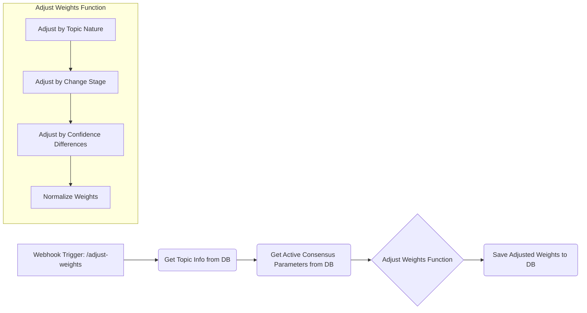
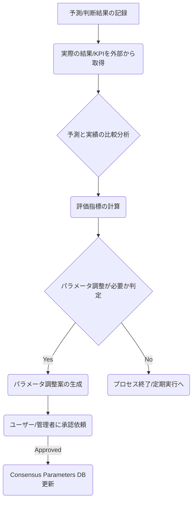

# コンセンサスモデルの実装（パート3：コンセンサス基準と重み付け方法）[改訂版]

## 1. コンセンサス基準の設計

コンセンサスモデルの効果的な運用には、適切なコンセンサス基準の設計が不可欠です。コンセンサス基準は、3つの視点（テクノロジー、マーケット、ビジネス）からの情報を統合し、最適な解釈と判断を導き出すための基準となります。このセクションでは、n8nを活用したコンセンサス基準の設計と実装方法について解説します。

### 1.1. コンセンサス基準の基本原則

コンセンサス基準の設計にあたっては、以下の基本原則を考慮します：

1.  **視点間の関係性の尊重**
    *   マーケット視点の先行性
    *   テクノロジー視点の基盤性
    *   ビジネス視点の実効性
2.  **多次元評価の統合**
    *   重要度評価
    *   確信度評価
    *   整合性評価
3.  **静止点の明確な定義と検出**
    *   3つのレイヤの総合判定における最適解
    *   安定性と堅牢性の評価
4.  **透明性と説明可能性の確保**
    *   判断プロセスの透明化
    *   判断根拠の明示

### 1.2. 視点別の重み付け

3つの視点（テクノロジー、マーケット、ビジネス）には、それぞれ異なる役割と重要性があります。視点別の基本的な重み付けは以下の通りです：

| 視点       | 基本重み | 役割       | 重み付けの根拠                                           |
| ---------- | -------- | ---------- | -------------------------------------------------------- |
| マーケット | 0.40     | 先行指標   | 市場の受容性・需要が基点となるため、やや高い重みを設定 |
| テクノロジー | 0.30     | 基盤       | 技術的実現可能性が基盤となるため、中程度の重みを設定     |
| ビジネス   | 0.30     | 実効性評価 | 事業としての成立性を判断するため、中程度の重みを設定     |

これらの重みは固定ではなく、以下の要因によって動的に調整されます：

1.  **トピックの性質**: 技術革新中心ならテクノロジー↑、市場変化中心ならマーケット↑、ビジネスモデル変革中心ならビジネス↑。
2.  **変化の段階**: 初期段階ならテクノロジー・マーケット↑、成長段階ならマーケット↑、成熟段階ならビジネス↑。
3.  **確信度の差異**: 確信度の高い視点の重みを↑、低い視点の重みを↓。

### 1.3. 評価要素の重み付け

重要度評価、確信度評価、整合性評価の各要素には、それぞれ異なる重みが設定されています。

#### 重要度評価の要素と重み

| 要素           | 重み | 説明                           |
| -------------- | ---- | ------------------------------ |
| 影響範囲       | 0.25 | 変化が影響を与える範囲の広さ   |
| 変化の大きさ   | 0.25 | 変化の量的・質的な大きさ       |
| 戦略的関連性   | 0.30 | 組織の戦略目標との関連性       |
| 時間的緊急性   | 0.20 | 対応の緊急性                   |

#### 確信度評価の要素と重み

| 要素             | 重み | 説明                               |
| ---------------- | ---- | ---------------------------------- |
| 情報源の信頼性   | 0.30 | 情報源の権威性や過去の正確性       |
| データ量         | 0.20 | 分析に使用されたデータの量         |
| 一貫性           | 0.30 | 複数の情報源や時点での一貫性       |
| 検証可能性       | 0.20 | 情報が独立に検証可能かどうか       |

#### 整合性評価の要素と重み

| 要素             | 重み | 説明                               |
| ---------------- | ---- | ---------------------------------- |
| 視点間の一致度   | 0.40 | 異なる視点からの評価の一致度       |
| 論理的整合性     | 0.30 | 情報間の論理的な矛盾の有無         |
| 時間的整合性     | 0.20 | 時系列での整合性                   |
| コンテキスト整合性 | 0.10 | より広いコンテキストとの整合性     |

### 1.4. 閾値の設定

コンセンサスモデルでは、各評価要素に対して閾値を設定し、評価結果のレベル分けを行います。基本的な閾値は以下の通りです：

| レベル | 閾値   | 説明             |
| ------ | ------ | ---------------- |
| 高     | 0.8以上 | 非常に高い評価   |
| 中高   | 0.6〜0.8 | やや高い評価     |
| 中     | 0.4〜0.6 | 中程度の評価     |
| 中低   | 0.2〜0.4 | やや低い評価     |
| 低     | 0.2未満 | 非常に低い評価   |

これらの閾値は、トピックの重要性、データの質と量、意思決定の重要性などによって調整されることがあります。

## 2. 重み付け方法の実装

n8nを活用して、コンセンサス基準の重み付け方法を実装します。以下では、動的な重み付け調整を行うワークフローと、関連する改善項目について解説します。

### 2.1. 動的重み付け調整ワークフロー (n8n)

以下のn8nワークフローは、トピック情報と現在のコンセンサスパラメータを取得し、トピックの性質、変化の段階、確信度の差異に基づいて視点別の重みを動的に調整し、結果をデータベースに保存します。



**ワークフローコード (JavaScript in Function Node):**

```javascript
// n8n workflow: Dynamic Weight Adjustment
// (詳細なコードは前バージョンを参照。ここでは主要な関数と改善点を記述)

const topicInfo = $input.item.json.topicInfo; // Assuming topic info is passed correctly
const consensusParameters = $input.item.json.consensusParameters; // Assuming parameters are passed correctly

// --- 改善点3: コードの最適化と詳細解説 --- 
// 各関数の目的と処理内容をコメントで詳細に解説
// 複雑な関数にはフローチャートへの参照を追加 (別途ドキュメント化)
// 関数のモジュール化を検討 (n8nのCodeノードや外部ライブラリ利用)

// --- 改善点4: エラーハンドリングの強化 --- 
// 入力データ(topicInfo, consensusParameters)の存在と形式をチェック
try {
    if (!topicInfo || !consensusParameters) {
        throw new Error("Input data is missing or invalid.");
    }

    // Extract base weights
    const baseWeights = {
        technology: consensusParameters.perspectiveWeights.technology,
        market: consensusParameters.perspectiveWeights.market,
        business: consensusParameters.perspectiveWeights.business
    };

    // Adjust weights based on topic nature
    const adjustedWeights = adjustWeightsByTopicNature(baseWeights, topicInfo);

    // Adjust weights based on change stage
    const furtherAdjustedWeights = adjustWeightsByChangeStage(adjustedWeights, topicInfo);

    // Adjust weights based on confidence differences
    const finalWeights = adjustWeightsByConfidence(furtherAdjustedWeights, topicInfo);

    // Normalize weights to ensure they sum to 1.0
    const normalizedWeights = normalizeWeights(finalWeights);

    // --- 改善点3: 処理ステップの視覚的表現 --- 
    // デバッグ用に調整プロセスの中間結果をログ出力または別フィールドに保持
    console.log("Base Weights:", baseWeights);
    console.log("Adjusted by Nature:", adjustedWeights);
    console.log("Adjusted by Stage:", furtherAdjustedWeights);
    console.log("Adjusted by Confidence:", finalWeights);
    console.log("Normalized Weights:", normalizedWeights);

    return {
        json: {
            topic_id: topicInfo.id,
            topic_name: topicInfo.name,
            base_weights: baseWeights,
            adjusted_weights: normalizedWeights,
            adjustment_factors: {
                topic_nature: getTopicNature(topicInfo),
                change_stage: getChangeStage(topicInfo),
                confidence_differences: getConfidenceDifferences(topicInfo)
            }
        }
    };

} catch (error) {
    // --- 改善点4: エラー発生時のフォールバック処理とログ記録 --- 
    console.error("Error during weight adjustment:", error.message, error.stack);
    // エラー情報をデータベースや通知システムに記録する処理を追加
    // 必要に応じてデフォルトの重みやエラーを示す値を返す
    return {
        json: {
            error: true,
            message: error.message,
            topic_id: topicInfo ? topicInfo.id : null
        }
    };
}

// --- Helper Functions (adjustWeightsBy..., getTopicNature, getChangeStage, getConfidenceDifferences, normalizeWeights) ---
// (詳細なコードは前バージョンを参照。各関数内にもエラーハンドリングを追加)

/**
 * @function adjustWeightsByTopicNature
 * @description トピックの性質に基づいて重みを調整します。
 * @param {object} weights - 現在の重み (technology, market, business)
 * @param {object} topicInfo - トピック情報
 * @returns {object} 調整後の重み
 * @throws {Error} トピック情報の形式が不正な場合
 */
function adjustWeightsByTopicNature(weights, topicInfo) {
    // --- 改善点3: 詳細解説 --- 
    // この関数は、トピックの主要な駆動要因（技術、市場、ビジネス）を判定し、
    // それに応じて関連する視点の重みを増減させます。
    // --- 改善点4: エラーハンドリング --- 
    if (!weights || typeof weights !== 'object' || !topicInfo || typeof topicInfo !== 'object') {
        throw new Error("Invalid input for adjustWeightsByTopicNature");
    }
    const topicNature = getTopicNature(topicInfo); // この関数内でもエラーハンドリングが必要
    const adjustedWeights = {...weights};
    const factor = 1.2; // 調整係数
    const reduceFactor = 0.9;

    switch (topicNature) {
        case 'technology_driven':
            adjustedWeights.technology *= factor;
            adjustedWeights.market *= reduceFactor;
            adjustedWeights.business *= reduceFactor;
            break;
        case 'market_driven':
            adjustedWeights.technology *= reduceFactor;
            adjustedWeights.market *= factor;
            adjustedWeights.business *= reduceFactor;
            break;
        case 'business_driven':
            adjustedWeights.technology *= reduceFactor;
            adjustedWeights.market *= reduceFactor;
            adjustedWeights.business *= factor;
            break;
        // default: 'balanced' or unknown - no adjustment
    }
    return adjustedWeights;
}

// 他のヘルパー関数 (getTopicNature, adjustWeightsByChangeStage, getChangeStage, 
// adjustWeightsByConfidence, getConfidenceDifferences, normalizeWeights) も同様に
// コメント追加とエラーハンドリング強化を行う。
```

**データベース保存 (PostgreSQL Node):**

```sql
-- Create topic_weights table if not exists
CREATE TABLE IF NOT EXISTS topic_weights (
  id SERIAL PRIMARY KEY,
  topic_id VARCHAR(50) NOT NULL,
  weights JSONB NOT NULL,
  adjustment_factors JSONB NOT NULL,
  created_at TIMESTAMP WITH TIME ZONE DEFAULT CURRENT_TIMESTAMP,
  
  CONSTRAINT unique_topic UNIQUE (topic_id)
);

-- Insert or update topic weights
-- --- 改善点4: エラーハンドリング --- 
-- Functionノードでエラーが発生した場合、このノードは実行されないように設定するか、
-- エラーフラグを見て挿入/更新をスキップするロジックを追加
INSERT INTO topic_weights (
  topic_id,
  weights,
  adjustment_factors
)
VALUES (
  '{{ $json.topic_id }}',
  '{{ $json.adjusted_weights | json | replace("\\'", "\\\'\\") }}'::jsonb,
  '{{ $json.adjustment_factors | json | replace("\\'", "\\\'\\") }}'::jsonb
)
ON CONFLICT (topic_id)
DO UPDATE SET
  weights = EXCLUDED.weights,
  adjustment_factors = EXCLUDED.adjustment_factors,
  created_at = CURRENT_TIMESTAMP;
```

### 2.2. コンセンサス基準の適用プロセス

コンセンサス基準は、コンセンサスモデルの統合レイヤで適用されます。以下にそのプロセス概要と関連する改善項目を示します。

1.  **視点別評価の取得**: 3視点（テクノロジー、マーケット、ビジネス）の評価結果（重要度、確信度、全体スコア）を取得。
2.  **整合性評価の取得**: 3視点間の整合性評価結果を取得。
3.  **トピック別重み付け取得**: 上記ワークフローで調整された視点別重みを取得。
4.  **重み付き統合スコアの計算**: `統合スコア = Σ (視点スコア × 視点重み)`
5.  **整合性による調整**: `調整後統合スコア = 統合スコア × (0.7 + 0.3 × 整合性スコア)`
6.  **静止点の検出**: 調整後統合スコア、重要度、確信度、整合性が各閾値を超えるか判定。
    *   **--- 改善点5: 静止点検出アルゴリズムの概要追加 ---**
        *   静止点は、3つの視点からの情報が一定の基準（高いスコア、高い重要度・確信度・整合性）を満たし、安定した最適解と見なせる状態を指します。
        *   この検出プロセスは、パート4で詳細に解説されるアルゴリズムに基づきます。
        *   コンセンサス基準（重み付け、閾値）は、この静止点検出の感度と精度に直接影響します。
7.  **代替解の生成**: 静止点が検出されない場合や、複数の解釈可能性がある場合に、異なる重み付け等で代替解を生成（パート4で詳述）。

### 2.3. パフォーマンス最適化の考慮 (改善点6)

大量のトピックや頻繁な更新に対応するため、以下のパフォーマンス最適化を考慮します。

*   **キャッシュ戦略**: 頻繁にアクセスされるコンセンサスパラメータや計算済み重みをキャッシュ（例: Redis）し、DB負荷を軽減。
*   **バッチ処理**: 複数のトピックの重み調整を一度に処理するバッチワークフローを設計。
*   **データベース最適化**: `topic_weights` テーブルや関連テーブルに適切なインデックスを作成。定期的なバキューム処理。
*   **非同期処理**: 重み調整プロセスを非同期キュー（例: RabbitMQ, BullMQ）に入れ、Webhookの応答時間を短縮。
*   **分散環境**: 将来的にn8nワーカーをスケールアウトし、並列処理能力を向上させる構成を検討。

## 3. インターフェース設計と視覚化 (改善点1)

コンセンサス基準と重み付けの結果を効果的にユーザーに提示するためのインターフェース設計と視覚化が重要です。

### 3.1. 設計概念: 多層的ダッシュボード

ユーザーが情報の粒度を選択できる多層的なダッシュボードを構想します。

1.  **概要レベル**: 主要なトピックの現在のコンセンサス状況（静止点有無、主要スコア）を一覧表示。
2.  **詳細レベル**: 特定トピックの視点別評価、重み付け、整合性、時系列変化などを詳細に表示。
3.  **調整レベル**: ユーザーがシミュレーション的に重み付けを変更し、結果の変化を確認できるインタラクティブなインターフェース。

### 3.2. 視覚化コンポーネント例

*   **全体フロー図**: コンセンサス基準と重み付けプロセスの全体像を示す図。
*   **レーダーチャート**: 3視点のスコアと重みを視覚的に比較。
*   **時系列グラフ**: 各視点のスコアや重みの時間変化を表示。
*   **重み調整インターフェース**: スライダーや入力フィールドで重みを調整。
*   **視点間関係図**: 視点間の整合性や影響度をノードとエッジで表現。

### 3.3. n8nとフロントエンドの連携

n8nで計算された重み付け結果やコンセンサススコアをAPI経由でフロントエンド（例: React, Vue, Angular）に提供します。

*   n8nのWebhookノードやREST APIを利用してデータを提供。
*   フロントエンドは定期的にAPIをポーリングするか、WebSocket等でリアルタイム更新を受け取る。
*   Chart.js, D3.jsなどのライブラリを用いてデータを視覚化。

## 4. 実際の運用例とユースケース (改善点2)

コンセンサス基準と重み付けは、様々な業界や目的に応用可能です。

### 4.1. 業界別ユースケース例

*   **製造業 (技術評価)**: 新素材技術の評価において、初期段階ではテクノロジー視点の重みを高く設定。市場導入フェーズではマーケット視点を重視。量産化検討ではビジネス視点の重みを上げる。
    *   *活用シナリオ*: 新素材Aの採用可否判断。初期評価、試作品評価、量産評価の各段階で重みを動的に変更。
*   **IT業界 (市場変化評価)**: 新しいプログラミング言語やフレームワークの採用評価。開発者コミュニティの動向（テクノロジー）、市場での採用事例（マーケット）、開発コストや人材確保（ビジネス）を総合的に評価。市場トレンドの変化に応じてマーケット視点の重みを調整。
    *   *活用シナリオ*: 次期主力開発言語の選定。GitHubトレンド、Stack Overflow調査、求人情報、競合企業の動向を分析し、重みを調整しながら評価。
*   **小売業 (消費者行動分析)**: 新しい販促キャンペーンの効果測定。SNSでの反応（マーケット）、POSデータ分析（ビジネス）、関連技術（例: AIレコメンデーション）の導入効果（テクノロジー）を評価。キャンペーン期間中の消費者行動変化に応じて重みを調整。
    *   *活用シナリオ*: ブラックフライデーセールの効果分析。売上データ、Webサイトトラフィック、SNSセンチメントを統合評価。

### 4.2. 業界別重み付け設定例 (初期設定の参考)

| 業界/目的        | テクノロジー | マーケット | ビジネス |
| ---------------- | -------- | -------- | -------- |
| 製造業 (R&D)     | 0.4      | 0.3      | 0.3      |
| IT業界 (技術戦略) | 0.35     | 0.35     | 0.3      |
| 小売業 (販促)     | 0.2      | 0.5      | 0.3      |
| 金融 (リスク管理) | 0.25     | 0.35     | 0.4      |

*注意: これらはあくまで初期設定の例であり、具体的なトピックや状況に応じて動的に調整されます。*

## 5. コンセンサス基準の評価と最適化 (フィードバックループ - 改善点7)

コンセンサス基準は、運用を通じて継続的に評価・最適化されるべきです。

### 5.1. n8nによるフィードバックループ実装例



*   **評価指標**: 予測精度（例: MAE, RMSE）、判断の正解率、KPIへの貢献度など。
*   **フィードバックデータ収集**: ユーザー評価（例: スコアの妥当性評価）、外部KPIデータ（例: 売上、市場シェア）。
*   **パラメータ更新ロジック**: 評価指標が悪化した場合や、特定のバイアスが検出された場合に、重み付けや閾値の調整を提案。
*   **プロセス設計**: 定期的な自動評価と、必要に応じた手動介入を組み合わせる。

### 5.2. 継続的改善プロセス

1.  **モニタリング**: コンセンサスモデルの出力と関連KPIを継続的に監視。
2.  **評価**: 定期的に予測精度や判断の質を評価。
3.  **分析**: 評価結果に基づき、問題点や改善の余地を分析。
4.  **調整**: 分析結果に基づき、コンセンサス基準（重み、閾値）や関連プロセスを調整。
5.  **検証**: 調整後の効果を検証。

## 6. 次のステップへ

このセクションでは、コンセンサス基準の設計、重み付け、実装、そして評価と最適化について解説しました。定義された基準と動的な重み付けは、多様な情報を統合し、より信頼性の高い判断を下すための基盤となります。

次のセクション（パート4）では、これらの基準を用いて**静止点（安定した最適解）をどのように検出し、評価するか**について、具体的なアルゴリズムと実装方法を掘り下げていきます。

