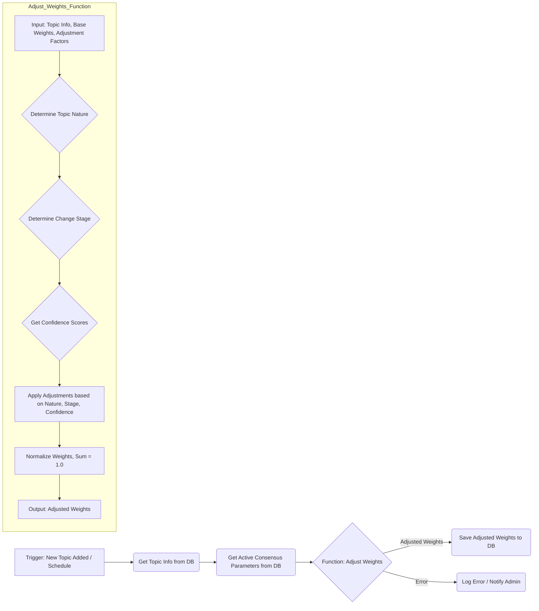

## 4. インターフェース設計と視覚化

**目的：読者がコンセンサスモデルの結果を直感的に理解し、意思決定に活用できるようにする**

コンセンサスモデルの真価は、その計算結果をいかに分かりやすく意思決定者に伝えられるかにかかっています。本セクションでは、モデルの出力を効果的に視覚化し、ユーザーが直感的に理解できるインターフェースの設計方法を解説します。

### 4.1. ダッシュボード設計の基本原則

効果的なダッシュボードは、複雑な情報を整理し、意思決定者が必要な洞察を素早く得られるように設計されています。コンセンサスモデルのダッシュボード設計においては、情報の階層化と優先順位付けが重要です。最も重要な情報を最も目立つ位置に配置し、詳細情報は必要に応じてドリルダウンできる構造にします。

この階層構造により、意思決定者は全体像を素早く把握しつつ、必要に応じて詳細情報にアクセスできます。また、視覚的一貫性と直感的理解のために、評価結果を一貫した色で表現し、各視点や評価要素を識別しやすいアイコンで表現することで、ユーザーの理解を促進します。

インタラクティブ性と探索可能性も重要な要素です。静的な表示だけでなく、ユーザーが情報を探索し、異なる角度から分析できる機能を提供することで、意思決定者は受動的に情報を受け取るだけでなく、能動的に情報を探索し、より深い洞察を得ることができます。

### 4.2. 効果的な視覚化手法

コンセンサスモデルの結果を視覚化するためには、複数の手法を目的に応じて使い分けることが効果的です。レーダーチャートは複数の評価軸を同時に表示し、全体のバランスを視覚的に把握するのに適しています。3つの視点や各視点内の評価要素をレーダーチャートで表現することで、強みと弱みを一目で確認できます。

階層型ツリーマップは、階層構造を持つデータを面積で表現し、各要素の相対的な重要度を視覚化するのに適しています。3つの視点とその下位要素の重み付けや評価結果をツリーマップで表現することで、影響度の大きい要素を直感的に把握できます。

フローチャートやサンキーダイアグラムは、プロセスの流れや要素間の影響関係を視覚化するのに適しています。評価プロセスの流れや、各視点間の情報の流れと影響度をこれらの図で表現することで、モデルの動作原理を直感的に理解できます。

ヒートマップやマトリックスは、複数の要素間の相関関係や比較分析を視覚化するのに適しています。異なる評価要素間の相関関係や、複数の評価対象の比較をこれらの図で表現することで、パターンや傾向を発見しやすくなります。

### 4.3. n8nによるダッシュボード連携

コンセンサスモデルの評価結果をリアルタイムでダッシュボードに反映するためには、n8nワークフローとダッシュボードシステムを効果的に連携させる必要があります。n8nワークフローからダッシュボードへのデータ連携には、APIを介した直接連携、データベースを介した間接連携、メッセージングシステムを介した連携の3つのアプローチがあります。

多くの場合、データベースを介した間接連携が最も柔軟性が高く、実装も比較的容易です。このアプローチでは、評価が完了したタイミングまたは定期的なスケジュールでトリガーされ、最新の評価結果を取得します。その後、データをダッシュボード表示に適した形式に変換し、データベースに保存します。必要に応じて、ダッシュボードシステムに更新通知を送信し、更新ログを記録します。

ダッシュボード設計のベストプラクティスとして、ユーザーの意思決定プロセスに沿った設計、コンテキスト情報の提供、適切なアラートとハイライト、比較と参照点の提供、モバイル対応とレスポンシブデザインが重要です。これらのベストプラクティスを踏まえたダッシュボード設計により、コンセンサスモデルの評価結果を最大限に活用し、より質の高い意思決定を支援することができます。
## 5. 実際の運用例とユースケース

**目的：読者が実際の業務課題にコンセンサスモデルを適用するイメージを持てるようにする**

理論的な理解だけでは、実際の業務にコンセンサスモデルを適用することは難しいものです。本セクションでは、具体的なユースケースを通じて、コンセンサスモデルがどのように実際の意思決定を支援するのかを示します。

### 5.1. 先端技術投資判断：量子コンピューティング

先端技術への投資判断は、不確実性が高く、多角的な視点からの評価が必要な典型的な意思決定課題です。ある大手IT企業が量子コンピューティング技術への投資を検討するケースを考えてみましょう。

この企業では、テクノロジー視点、マーケット視点、ビジネス視点の3つの視点から評価を行いました。テクノロジー視点では、技術成熟度（0.60）、実用化可能性（0.70）、技術的優位性（0.85）を評価。マーケット視点では、市場成長性（0.80）、競合状況（0.60）、顧客需要（0.65）を評価。ビジネス視点では、収益性（0.55）、戦略的適合性（0.80）、リスク（0.60）を評価しました。

これらの評価結果をコンセンサスモデルに入力した結果、テクノロジー視点のスコアは0.75、マーケット視点のスコアは0.68、ビジネス視点のスコアは0.65となり、総合評価は0.72（高）という結果になりました。この結果から、技術的な優位性と市場成長性が高く評価される一方、収益性に関しては懸念があることが明確になりました。

企業はこの結果を踏まえ、量子コンピューティング技術への段階的な投資を決定。短期的な収益よりも、長期的な技術優位性と市場ポジショニングを重視する戦略を採用しました。また、収益性の懸念に対応するため、初期段階ではコンサルティングサービスやパートナーシップモデルを通じた収益化を図る計画を立てました。

このケースでは、コンセンサスモデルによって、単なる「投資する/しない」の二択ではなく、リスクと機会のバランスを考慮した段階的アプローチが可能になりました。

### 5.2. 新興市場参入判断：東南アジアeコマース

グローバル展開を検討する企業にとって、新興市場への参入判断は複雑な意思決定プロセスを伴います。ある日本の小売企業が東南アジアのeコマース市場への参入を検討するケースを見てみましょう。

この企業では、テクノロジー視点では、プラットフォーム適合性（0.75）、現地技術インフラ（0.60）、デジタル決済対応（0.85）を評価。マーケット視点では、市場成長率（0.90）、競合状況（0.50）、消費者行動（0.70）を評価。ビジネス視点では、初期投資（0.40）、収益見込み（0.65）、リスク（0.55）を評価しました。

コンセンサスモデルによる評価の結果、テクノロジー視点のスコアは0.73、マーケット視点のスコアは0.70、ビジネス視点のスコアは0.53となり、総合評価は0.65（中〜高）という結果になりました。この結果から、市場の成長性と技術的な準備は整っているものの、ビジネス面での課題が大きいことが明確になりました。

企業はこの結果を踏まえ、リスクを抑えつつ市場参入するための段階的アプローチを採用。まず現地パートナーとの提携を通じて小規模に参入し、市場理解を深めながら徐々に事業を拡大する戦略を選択しました。また、初期投資の負担を軽減するため、既存のeコマースプラットフォームを活用する方針を決定しました。

このケースでは、コンセンサスモデルによって、各視点のバランスを考慮した現実的な市場参入戦略の策定が可能になりました。特に、ビジネス視点の課題を明確にすることで、リスクを最小化しながら市場機会を活かす方法を見出すことができました。

### 5.3. 製品開発方針決定：AIアシスタント

急速に変化する技術トレンドの中で、製品開発の方向性を決定することは企業にとって重要な課題です。あるソフトウェア企業がAIアシスタント製品の開発方針を決定するケースを考えてみましょう。

この企業では、テクノロジー視点では、AI技術成熟度（0.80）、開発リソース適合性（0.65）、技術的差別化（0.70）を評価。マーケット視点では、市場需要（0.85）、競合状況（0.45）、顧客フィードバック（0.75）を評価。ビジネス視点では、収益モデル（0.60）、戦略的重要性（0.90）、開発リスク（0.50）を評価しました。

コンセンサスモデルによる評価の結果、テクノロジー視点のスコアは0.72、マーケット視点のスコアは0.68、ビジネス視点のスコアは0.67となり、総合評価は0.69（中〜高）という結果になりました。この結果から、技術的な実現可能性と市場需要は高いものの、競合の激しさと開発リスクが課題であることが明確になりました。

企業はこの結果を踏まえ、汎用AIアシスタントではなく、特定の業界や用途に特化したAIアシスタントの開発に注力する戦略を採用。競合との差別化を図りつつ、開発リスクを管理可能な範囲に抑える方針を決定しました。また、初期段階から顧客と共同開発するアプローチを採用し、市場ニーズに確実に応える製品開発を目指すことにしました。

このケースでは、コンセンサスモデルによって、技術トレンドと市場競争の中で、自社の強みを活かした製品開発戦略の策定が可能になりました。特に、各視点のスコアバランスを分析することで、リスクと機会のトレードオフを考慮した現実的な開発方針を決定できました。

### 5.4. 動的重み付け調整の実践例

コンセンサスモデルの強みの一つは、評価対象や状況に応じて各視点の重み付けを動的に調整できる点にあります。以下に、動的重み付け調整の実践例を示します。

**n8nによる動的重み付け調整ワークフロー**

以下に、n8nを使用した動的重み付け調整ワークフローの概念図を示します。

このワークフローでは、トピックの性質（技術駆動型、市場駆動型など）、変化の段階（初期、成長期、成熟期など）、各視点の情報の確信度などの要因に基づいて、基本重みを動的に調整します。調整された重みは、次回の評価プロセスで使用されます。

例えば、新興技術の評価では、初期段階ではテクノロジー視点の重みを高く（0.5）、マーケット視点（0.3）とビジネス視点（0.2）を低めに設定します。技術が成熟するにつれて、マーケット視点の重みを徐々に高め（0.4）、テクノロジー視点の重みを下げる（0.4）調整を行います。さらに市場が形成されると、ビジネス視点の重みを高める（0.4）調整を行い、テクノロジー視点（0.3）とマーケット視点（0.3）のバランスを取ります。

このような動的調整により、評価対象の発展段階や特性に応じた適切な評価が可能になり、より現実に即した意思決定を支援することができます。

### 5.5. ユースケースから得られる共通の教訓

これらのユースケースから、コンセンサスモデルの実践において重要な共通の教訓が得られます。

まず、多角的な視点からの評価が意思決定の質を高めることが明確になりました。単一の視点（例えば技術的な実現可能性のみ）で判断するのではなく、テクノロジー、マーケット、ビジネスの3つの視点からバランスよく評価することで、より包括的な判断が可能になります。

次に、定量的評価と定性的判断の組み合わせの重要性が挙げられます。コンセンサスモデルは数値スコアを提供しますが、最終的な意思決定は、これらの数値を解釈し、組織の戦略や価値観と照らし合わせて行う必要があります。モデルは意思決定を代行するものではなく、より良い判断を支援するツールとして位置づけるべきです。

また、継続的な評価と調整の重要性も明らかになりました。初期評価だけでなく、状況の変化に応じて定期的に再評価を行い、必要に応じて戦略を調整することが成功への鍵となります。n8nを活用した動的重み付け調整は、この継続的な評価プロセスを効率化し、一貫性を保つのに役立ちます。

最後に、組織内でのコンセンサス形成ツールとしての価値が挙げられます。異なる部門や専門性を持つメンバーが、共通のフレームワークを通じて議論することで、より建設的な対話が可能になります。コンセンサスモデルは、単なる計算ツールではなく、組織内の協働と合意形成を促進するプラットフォームとしても機能します。

これらの教訓を踏まえることで、コンセンサスモデルを自組織の意思決定プロセスに効果的に統合し、より質の高い判断を実現することができるでしょう。
## 6. 評価と最適化

**目的：読者がコンセンサスモデルを継続的に改善し、組織の意思決定プロセスに定着させる方法を理解する**

コンセンサスモデルは一度構築して終わりではなく、継続的な評価と最適化を通じて進化させていくべきものです。本セクションでは、モデルの評価方法、パフォーマンス最適化の手法、そして組織への定着化戦略について解説します。

### 6.1. コンセンサスモデルの評価フレームワーク

コンセンサスモデルの有効性を評価するためには、体系的なフレームワークが必要です。以下に、主要な評価軸と具体的な評価指標を示します。

**精度と信頼性の評価**

コンセンサスモデルの最も基本的な評価軸は、その予測や評価の精度です。過去の意思決定事例を用いて、モデルの出力結果と実際の結果を比較することで、精度を測定できます。具体的には、以下の指標が有用です：

- 予測精度：モデルの評価結果と実際の結果の一致度
- 一貫性：同様の条件下での評価結果の安定性
- 信頼区間：評価結果の不確実性の範囲

例えば、過去に実施した10の技術投資案件について、コンセンサスモデルの評価結果と実際の成果を比較し、正確に予測できた割合を測定します。また、同じ評価対象を複数回評価した際の結果のばらつきを分析し、モデルの一貫性を確認します。

**実用性と意思決定への貢献度**

モデルの技術的な精度だけでなく、実際の意思決定プロセスにおける有用性も重要な評価軸です。以下の指標を通じて、モデルの実用的価値を評価できます：

- 意思決定時間：モデル導入前後での意思決定にかかる時間の変化
- 合意形成効率：関係者間での合意に至るまでの議論の効率性
- 意思決定の質：モデルを活用した意思決定と従来の方法による意思決定の質の比較

例えば、コンセンサスモデル導入前は平均4週間かかっていた投資判断が、導入後は2週間に短縮されたといった定量的な効果を測定します。また、意思決定の質については、決定後の方針変更頻度や目標達成率などの指標を用いて評価します。

**ユーザー満足度と組織適合性**

最終的に、モデルが組織内で受け入れられ、活用されるかどうかは、ユーザーの満足度と組織文化との適合性に大きく依存します。以下の指標を通じて、これらの側面を評価します：

- ユーザー満足度：モデルを使用する意思決定者の満足度調査
- 活用頻度：自発的なモデル活用の頻度と範囲
- 組織文化との整合性：モデルの使用方法と組織の意思決定文化の適合度

例えば、定期的なユーザーアンケートを実施し、モデルの使いやすさや有用性に関するフィードバックを収集します。また、どの部門や意思決定タイプでモデルが積極的に活用されているかを追跡し、組織への浸透度を評価します。

### 6.2. パフォーマンス最適化の手法

評価結果に基づき、コンセンサスモデルのパフォーマンスを継続的に最適化することが重要です。以下に、主要な最適化手法を示します。

**パラメータチューニングとモデル調整**

コンセンサスモデルの核心部分であるパラメータ設定を最適化することで、モデルの精度と適合性を高めることができます。

- 重み付け係数の最適化：過去のデータを用いた回帰分析により、最適な重み付け係数を導出
- 閾値の調整：意思決定の境界となる閾値を実績データに基づいて調整
- 評価要素の見直し：不要な要素の削除や新たな要素の追加による評価構造の最適化

例えば、過去の成功事例と失敗事例のデータセットを用いて、各視点の重み付けを調整し、成功事例をより高く、失敗事例をより低く評価するパラメータ設定を見つけ出します。また、実際の意思決定結果と照らし合わせて、「Go/No-Go」の判断基準となる閾値を調整します。

**データ品質と入力プロセスの改善**

どんなに優れたモデルでも、入力データの品質が低ければ良い結果は得られません。データ収集と入力プロセスを最適化することで、モデル全体のパフォーマンスを向上させることができます。

- データ収集の標準化：評価に必要なデータを一貫した方法で収集するプロセスの確立
- 入力支援ツールの開発：データ入力の正確性と効率を高めるためのツールやテンプレートの提供
- データ検証メカニズム：入力データの妥当性を自動的にチェックする仕組みの導入

例えば、各評価要素に関するデータ収集のためのチェックリストやテンプレートを作成し、評価者間での情報収集の一貫性を確保します。また、入力データの範囲チェックや相関チェックなどの検証ルールを実装し、明らかな誤りや矛盾を早期に発見・修正できるようにします。

**ワークフロー統合と自動化の強化**

コンセンサスモデルを組織の既存ワークフローに効果的に統合し、可能な限り自動化することで、使いやすさと効率を高めることができます。

- n8nワークフローの最適化：評価プロセスの自動化と既存システムとの連携強化
- 通知とアラートの設定：重要なイベントや閾値超過時の自動通知機能の実装
- バッチ処理と定期評価：定期的な再評価と傾向分析の自動化

例えば、企業の案件管理システムと連携し、新規案件が登録されると自動的に初期評価を行うワークフローを構築します。また、評価結果が特定の閾値を下回った場合や、重要な指標に大きな変動があった場合に、関係者に自動通知する仕組みを実装します。

### 6.3. 継続的改善と発展のためのフレームワーク

コンセンサスモデルを一時的なプロジェクトではなく、組織の意思決定文化の一部として定着させるためには、継続的な改善と発展のためのフレームワークが必要です。

**継続的改善のための実務体制**

1. **運用タスク管理**：モデルの日常的な運用、データ管理、ユーザーサポートを担当するチーム。技術的な知識と業務知識の両方を持つメンバーで構成されることが理想的です。

2. **ガバナンス運営**：モデルの評価基準、重み付け、閾値などの重要パラメータの変更を承認する役割。各部門の代表者や意思決定権者で構成され、モデルの一貫性と公平性を確保します。

3. **情報共有の仕組み**：モデルのユーザーや関係者が経験や知見を共有し、改善提案を行うプラットフォーム。定期的なミーティングやオンラインフォーラムなどの形で実施されます。

この体制により、日常的な運用から戦略的な方向性まで、異なるレベルでのモデル管理と改善が可能になります。

**学習と適応のサイクル**

コンセンサスモデルを継続的に進化させるためには、以下のような学習と適応のサイクルを確立することが効果的です。

1. **データ収集**：評価結果、実際の成果、ユーザーフィードバックなどのデータを体系的に収集

2. **分析と洞察**：収集したデータを分析し、モデルの強みと弱み、改善機会を特定

3. **改善計画**：分析結果に基づいて、具体的な改善計画を策定

4. **実装とテスト**：改善策を実装し、限定的な範囲でテスト

5. **展開と標準化**：効果が確認された改善策を全体に展開し、新たな標準として確立

このサイクルを3〜6ヶ月ごとに繰り返すことで、モデルを継続的に進化させ、変化する環境や要件に適応させることができます。

**知識管理と組織学習**

コンセンサスモデルの運用を通じて得られた知見や教訓を組織の知的資産として蓄積し、共有することも重要です。

- ケーススタディの作成：成功事例と失敗事例の詳細な分析と教訓の抽出
- ベストプラクティスの文書化：効果的なモデル活用方法や評価プロセスのガイドライン
- トレーニングプログラムの開発：新規ユーザーや関係者向けの教育資料とプログラム

例えば、四半期ごとに代表的な評価事例を選び、詳細な分析レポートを作成して組織内で共有します。また、モデル活用の成功事例から抽出したベストプラクティスをガイドラインとして文書化し、新規プロジェクトや部門への展開時に活用します。

これらの継続的改善と発展のためのフレームワークを通じて、コンセンサスモデルは単なるツールから、組織の意思決定文化を形作る重要な要素へと進化していきます。時間の経過とともに、モデルは組織特有の知識や経験を取り込み、より価値の高い意思決定支援システムとなるでしょう。
