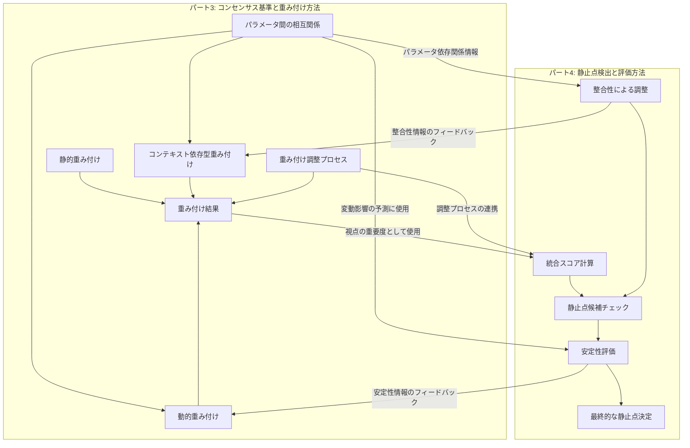
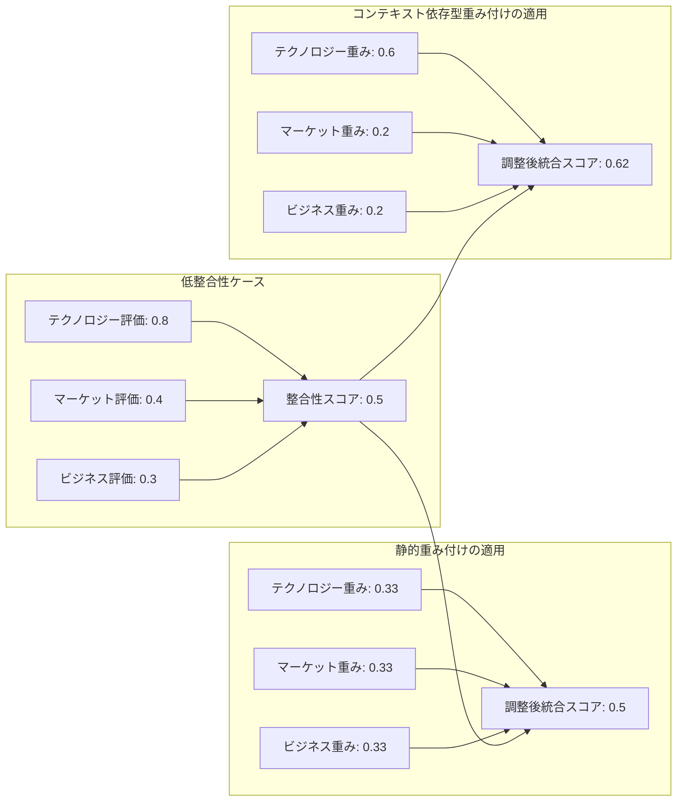
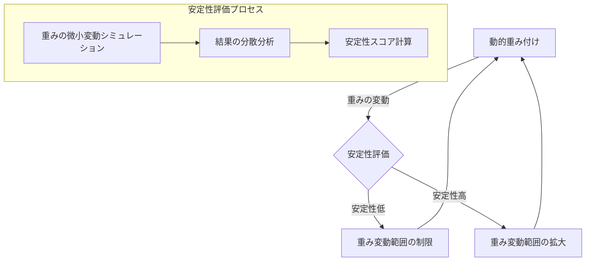
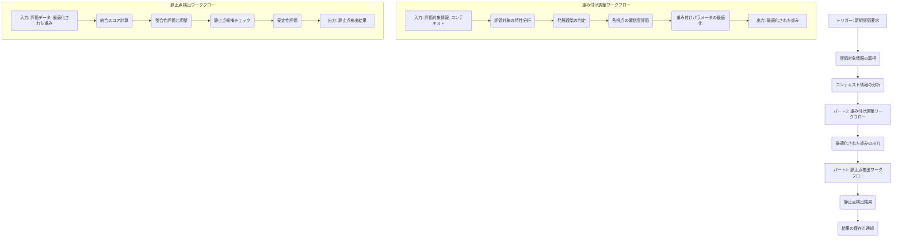

## 7. パート3とパート4の連携分析：重み付け方法と静止点検出の相互作用

### 7.1. セクション概要と目的

本セクションでは、パート3で解説した「コンセンサス基準と重み付け方法」とパート4の「静止点検出と評価方法」の間の有機的な連携と相互作用について詳細に説明します。両パートの技術的概念がどのように連携し、全体としてのコンセンサスモデルの機能を強化するかを理解することで、読者はより効果的な実装と運用が可能になります。コンセンサスモデルの真の価値は、これらの要素が統合されたときに初めて発揮されるため、この連携の理解は実践的な実装において極めて重要です。

### 7.2. 両パートの主要概念の要約と関連性

#### 7.2.1. パート3の主要概念：コンセンサス基準と重み付け方法

パート3では、3つの視点（テクノロジー、マーケット、ビジネス）からの評価結果に対する重み付け方法を中心に解説しています。特に以下の概念が重要です：

- **静的重み付け**：事前に固定された重みを各視点に割り当てる方法。例えば、テクノロジー視点（0.4）、マーケット視点（0.3）、ビジネス視点（0.3）のように固定値を設定します。
- **動的重み付け**：状況や評価対象の特性に応じて重みを調整する方法。例えば、技術の発展段階に応じてテクノロジー視点の重みを初期段階では高く（0.5）、成熟段階では低く（0.3）設定します。
- **コンテキスト依存型重み付け**：より広範な文脈情報（市場状況、組織戦略、競合動向など）を考慮して重みを最適化する方法。
- **パラメータ間の相互関係**：各視点内および視点間のパラメータの依存関係と影響度。例えば、技術成熟度と市場受容性の相関関係などを考慮します。
- **重み付け調整プロセス**：n8nワークフローによる自動的な重み調整の実装方法。

#### 7.2.2. パート4の主要概念：静止点検出と評価方法

パート4では、多角的な評価を統合し、最適な判断点（静止点）を特定するプロセスを解説しています。主要な概念には以下が含まれます：

- **静止点の定義**：3つの視点からの評価が均衡し、安定した状態を示すポイント。これは単なる平均値ではなく、各視点の重要度と確信度を考慮した均衡点です。
- **統合スコア計算**：各視点の評価スコアに確信度と重要度を掛け合わせた総合評価値。
- **整合性による調整**：視点間の評価の一致度に基づくスコア調整。例えば、3つの視点の評価が大きく異なる場合は整合性スコアが低くなり、調整が必要になります。
- **静止点候補のチェック**：閾値（例：0.7以上）に基づく静止点候補の特定。
- **安定性評価**：入力パラメータの微小変動に対する結果の堅牢性評価。モンテカルロシミュレーションなどの手法を用います。
- **n8nによる段階的実装**：静止点検出システムの実装アプローチ。

#### 7.2.3. 両パートの概念間の関連性マップ

以下の図は、パート3とパート4の主要概念間の関連性を視覚的に示しています：



この関連性マップから分かるように、パート3の重み付け方法はパート4の統合スコア計算の基盤となり、パート4の整合性評価や安定性評価の結果はパート3の重み付け調整にフィードバックされます。この双方向の情報フローにより、システム全体の精度と適応性が向上します。

### 7.3. 重み付け方法と静止点検出の連携ポイント

#### 7.3.1. 重み付けが統合スコア計算に与える影響

パート3で説明した重み付け方法は、パート4の統合スコア計算の基盤となります。統合スコアの計算式は以下の通りです：

```
統合スコア = Σ (視点iの評価スコア * 視点iの確信度 * 視点iの重要度)
```

この式において、「視点iの重要度」はパート3の重み付け方法によって決定されます。以下の表は、異なる重み付け方法が統合スコアに与える影響を示しています：

| 重み付け方法 | テクノロジー視点 | マーケット視点 | ビジネス視点 | 統合スコアへの影響 |
|------------|--------------|------------|------------|----------------|
| 静的重み付け | 0.4 (固定) | 0.3 (固定) | 0.3 (固定) | 予測可能で一貫した評価結果 |
| 動的重み付け<br>(初期段階) | 0.5 | 0.3 | 0.2 | 技術的実現可能性を重視した評価 |
| 動的重み付け<br>(成熟段階) | 0.3 | 0.4 | 0.3 | 市場性と収益性を重視した評価 |
| コンテキスト依存型<br>(競争激化市場) | 0.3 | 0.5 | 0.2 | 市場差別化要因を重視した評価 |
| コンテキスト依存型<br>(技術革新領域) | 0.6 | 0.2 | 0.2 | 技術的優位性を重視した評価 |

例えば、新興技術の評価では、初期段階ではテクノロジー視点の重みを高く（0.5）設定し、技術が成熟するにつれてマーケット視点の重みを徐々に高める（0.4）という動的調整を行うことで、より適切な統合スコアが得られます。この動的な重み付けは、静止点の位置に直接影響し、より現実に即した意思決定を支援します。

#### 7.3.2. 重み付け方法が整合性評価に与える影響

パート4で説明した整合性評価（3つの視点からの評価がどの程度一致しているか）は、パート3の重み付け方法と密接に関連しています。整合性スコアの計算式は以下の通りです：

```
整合性スコア = 1 - (視点間の評価の標準偏差 / 評価の最大可能標準偏差)
```

以下の図は、異なる重み付け方法が整合性評価に与える影響を示しています：



この図から分かるように、コンテキスト依存型重み付けを用いると、より信頼性の高い視点（例：より多くのデータに基づいている視点）の重みを増やすことで、整合性の低さを部分的に補正できます。例えば、テクノロジー評価の確信度が高い場合、その重みを0.6に増やすことで、調整後統合スコアの信頼性が向上します。

#### 7.3.3. 動的重み付けと安定性評価の相互作用

パート4の安定性評価（入力パラメータの微小変動に対する結果の堅牢性）は、パート3の動的重み付けと相互に影響し合います。以下の図は、この相互作用を示しています：



動的重み付けによって重みが頻繁に変動する場合、静止点の位置も変動しやすくなるため、より厳格な安定性評価が必要になります。例えば、テクノロジー視点の重みが0.4±0.1の範囲で変動する場合、この変動が静止点の位置にどの程度影響するかをモンテカルロシミュレーションで評価します。

具体的には、重みの変動範囲内で1000回のシミュレーションを実行し、静止点の位置の分散を分析します。分散が小さければ安定性が高く、分散が大きければ安定性が低いと判断します。安定性スコアが閾値（例：0.7）を下回る場合は、重みの変動範囲を制限するか、より安定性の高い重み設定を優先します。

### 7.4. n8n実装における連携ポイント

#### 7.4.1. 重み付け調整ワークフローと静止点検出ワークフローの統合

パート3とパート4のn8n実装を効果的に連携させるためには、重み付け調整ワークフローと静止点検出ワークフローを統合する必要があります。以下に、その統合アプローチを示します：



この統合ワークフローでは、まず評価対象の情報とコンテキストを分析し、パート3の重み付け調整ワークフローで最適な重みを算出します。その結果をパート4の静止点検出ワークフローに入力として渡し、最終的な静止点を検出します。

#### 7.4.2. データフローと処理シーケンス

統合ワークフローにおけるデータフローと処理シーケンスは以下の通りです：

1. **評価対象情報の取得**：評価対象のID、カテゴリ、基本情報などを取得します。
   ```json
   {
     "topic_id": "quantum_computing_2025",
     "category": "emerging_technology",
     "name": "量子コンピューティング",
     "description": "量子力学の原理を利用した次世代コンピューティング技術"
   }
   ```

2. **コンテキスト情報の分析**：評価対象の発展段階、市場状況、組織の戦略的優先事項などのコンテキスト情報を分析します。
   ```json
   {
     "development_stage": "early",
     "market_maturity": "emerging",
     "strategic_priority": "high",
     "competitive_landscape": "limited_players",
     "organizational_readiness": "medium"
   }
   ```

3. **重み付け調整**：コンテキスト情報に基づいて、3つの視点の重みを最適化します。
   ```json
   {
     "technology_weight": 0.5,
     "market_weight": 0.3,
     "business_weight": 0.2,
     "adjustment_factors": {
       "development_stage_impact": 0.2,
       "strategic_priority_impact": 0.1
     }
   }
   ```

4. **評価データの取得**：3つの視点からの評価スコアと確信度を取得します。
   ```json
   {
     "technology_perspective": {
       "score": 0.8,
       "confidence": 0.9,
       "parameters": {
         "technical_feasibility": 0.7,
         "innovation_level": 0.9,
         "implementation_complexity": 0.6
       }
     },
     "market_perspective": {
       "score": 0.6,
       "confidence": 0.7,
       "parameters": {
         "market_potential": 0.8,
         "adoption_barriers": 0.5,
         "competitive_advantage": 0.7
       }
     },
     "business_perspective": {
       "score": 0.5,
       "confidence": 0.6,
       "parameters": {
         "roi_potential": 0.4,
         "strategic_alignment": 0.8,
         "resource_requirements": 0.3
       }
     }
   }
   ```

5. **統合スコア計算**：最適化された重みを用いて統合スコアを計算します。
   ```
   統合スコア = (0.8 * 0.9 * 0.5) + (0.6 * 0.7 * 0.3) + (0.5 * 0.6 * 0.2) = 0.36 + 0.126 + 0.06 = 0.546
   ```

6. **整合性評価と調整**：視点間の評価の一致度を評価し、必要に応じてスコアを調整します。
   ```
   標準偏差 = 0.158
   最大可能標準偏差 = 0.577
   整合性スコア = 1 - (0.158 / 0.577) = 0.726
   調整後統合スコア = 0.546 * 0.726 = 0.396
   ```

7. **静止点候補チェック**：閾値に基づいて静止点候補を特定します。
   ```
   閾値 = 0.7
   調整後統合スコア = 0.396
   結果: 閾値未満のため、静止点候補ではない
   ```

8. **安定性評価**：入力パラメータの微小変動に対する結果の堅牢性を評価します。
   ```
   モンテカルロシミュレーション結果:
   - 平均統合スコア = 0.542
   - 標準偏差 = 0.048
   - 安定性スコア = 0.892
   ```

9. **結果の保存と通知**：最終的な静止点検出結果をデータベースに保存し、関係者に通知します。
   ```json
   {
     "topic_id": "quantum_computing_2025",
     "integrated_score": 0.546,
     "coherence_score": 0.726,
     "adjusted_score": 0.396,
     "stability_score": 0.892,
     "is_static_point": false,
     "recommendation": "技術的な実現可能性は高いが、ビジネス面での課題が大きい。段階的なアプローチを検討すべき。",
     "timestamp": "2025-06-08T15:04:50Z"
   }
   ```

このシーケンスにより、パート3の重み付け方法とパート4の静止点検出が有機的に連携し、より精度の高い意思決定支援が可能になります。

#### 7.4.3. 実装上の注意点とベストプラクティス

統合ワークフローを実装する際の注意点とベストプラクティスは以下の通りです：

- **パラメータの一貫性**：両ワークフロー間で共有されるパラメータ（視点の重み、評価スコア、確信度など）の形式と単位を一貫させます。例えば、すべての重みの合計が1.0になるように正規化します。

- **データの永続化**：中間結果（最適化された重みなど）をデータベースに保存し、処理の透明性と追跡可能性を確保します。以下はMySQLでの実装例です：
  ```sql
  CREATE TABLE weight_adjustments (
    id INT AUTO_INCREMENT PRIMARY KEY,
    topic_id VARCHAR(50) NOT NULL,
    technology_weight DECIMAL(4,3) NOT NULL,
    market_weight DECIMAL(4,3) NOT NULL,
    business_weight DECIMAL(4,3) NOT NULL,
    adjustment_context JSON,
    created_at TIMESTAMP DEFAULT CURRENT_TIMESTAMP
  );
  ```

- **エラーハンドリング**：一方のワークフローでエラーが発生した場合の代替処理を定義し、システム全体の堅牢性を高めます。例えば、重み付け調整ワークフローでエラーが発生した場合は、デフォルトの重み設定（例：各視点均等に0.33）を使用します。

- **パフォーマンス最適化**：大量のデータを処理する場合は、バッチ処理やキャッシュ戦略を活用して、処理効率を向上させます。例えば、同じ評価対象に対する重み付け結果をキャッシュし、コンテキストが変化した場合にのみ再計算します。

- **モジュール化**：各処理ステップを独立したサブワークフローとして実装し、再利用性と保守性を高めます。例えば、整合性評価や安定性評価を独立したサブワークフローとして実装し、他のプロジェクトでも再利用できるようにします。

### 7.5. 実践的な活用シナリオと段階的実装ガイド

#### 7.5.1. 技術投資判断における連携活用例

ある企業が量子コンピューティング技術への投資を検討するケースを考えてみましょう。この技術は初期段階にあり、技術的な不確実性が高いものの、将来的な市場潜在性も大きいという特徴があります。

##### 段階1: 評価パラメータの設定と初期データ収集

まず、3つの視点それぞれの評価パラメータを設定します：

- **テクノロジー視点**：技術成熟度、実用化可能性、技術的優位性
- **マーケット視点**：市場成長性、競合状況、顧客需要
- **ビジネス視点**：収益性、戦略的適合性、リスク

各パラメータについて、専門家の評価やデータ分析に基づいて初期評価を行います：

```json
{
  "technology": {
    "maturity": 0.60,
    "feasibility": 0.70,
    "advantage": 0.85,
    "confidence": 0.80
  },
  "market": {
    "growth": 0.80,
    "competition": 0.60,
    "demand": 0.65,
    "confidence": 0.70
  },
  "business": {
    "profitability": 0.55,
    "strategic_fit": 0.80,
    "risk": 0.60,
    "confidence": 0.65
  }
}
```

##### 段階2: 動的重み付けの適用

パート3の動的重み付け方法を適用し、技術の初期段階であることを考慮して、テクノロジー視点の重みを高く設定します：

```json
{
  "weights": {
    "technology": 0.50,
    "market": 0.30,
    "business": 0.20
  },
  "adjustment_factors": {
    "development_stage": "early",
    "strategic_importance": "high"
  }
}
```

##### 段階3: 統合スコア計算と整合性評価

パート4の統合スコア計算と整合性評価を行います：

```
テクノロジー視点のスコア = (0.60 + 0.70 + 0.85) / 3 = 0.72
マーケット視点のスコア = (0.80 + 0.60 + 0.65) / 3 = 0.68
ビジネス視点のスコア = (0.55 + 0.80 + 0.60) / 3 = 0.65

統合スコア = (0.72 * 0.80 * 0.50) + (0.68 * 0.70 * 0.30) + (0.65 * 0.65 * 0.20)
          = 0.288 + 0.143 + 0.085 = 0.516

整合性スコア = 0.92 (視点間の評価の差が小さいため)
調整後統合スコア = 0.516 * 0.92 = 0.475
```

##### 段階4: 安定性評価と最終判断

重みの微小変動に対する安定性を評価します：

```
モンテカルロシミュレーション結果:
- 平均統合スコア = 0.512
- 標準偏差 = 0.042
- 安定性スコア = 0.88
```

これらの評価結果を総合的に判断し、企業は量子コンピューティング技術への段階的な投資を決定します。特に、技術的な優位性（0.85）と市場成長性（0.80）が高く評価される一方、収益性（0.55）に関しては懸念があることが明確になりました。

##### 段階5: 継続的なモニタリングと重み調整

技術の成熟度が高まるにつれて、パート3の動的重み付けを用いてマーケット視点の重みを徐々に高めていきます：

```json
{
  "weights_year1": {
    "technology": 0.50,
    "market": 0.30,
    "business": 0.20
  },
  "weights_year2": {
    "technology": 0.45,
    "market": 0.35,
    "business": 0.20
  },
  "weights_year3": {
    "technology": 0.40,
    "market": 0.40,
    "business": 0.20
  },
  "weights_year4": {
    "technology": 0.35,
    "market": 0.40,
    "business": 0.25
  }
}
```

この段階的な重み調整により、技術の発展段階に応じた適応的な評価が可能になります。

#### 7.5.2. 製品開発方針決定における連携活用例と業種別適用ガイド

あるソフトウェア企業がAIアシスタント製品の開発方針を決定するケースを考えてみましょう。この市場は成熟しつつあり、競合も多いものの、特定の業界向けにカスタマイズされたソリューションには需要があります。

##### 段階1: コンテキスト分析と重み付け方法の選択

まず、市場の成熟度と競合状況を分析し、パート3のコンテキスト依存型重み付けを適用することを決定します：

```json
{
  "market_analysis": {
    "maturity": "maturing",
    "competition": "high",
    "segmentation": "increasing",
    "growth_rate": "moderate"
  },
  "weight_method": "context_dependent",
  "context_factors": {
    "market_maturity_impact": 0.3,
    "competition_intensity_impact": 0.2,
    "strategic_alignment_impact": 0.5
  }
}
```

##### 段階2: 製品オプションの評価データ収集

汎用AIアシスタントと特定業界向けAIアシスタントの2つのオプションについて、評価データを収集します：

**汎用AIアシスタント**:
```json
{
  "technology": {
    "technical_feasibility": 0.85,
    "development_complexity": 0.70,
    "scalability": 0.80,
    "confidence": 0.75
  },
  "market": {
    "market_size": 0.90,
    "competition": 0.30,
    "differentiation": 0.40,
    "confidence": 0.80
  },
  "business": {
    "development_cost": 0.50,
    "revenue_potential": 0.65,
    "strategic_fit": 0.60,
    "confidence": 0.70
  }
}
```

**特定業界向けAIアシスタント**:
```json
{
  "technology": {
    "technical_feasibility": 0.80,
    "development_complexity": 0.65,
    "scalability": 0.70,
    "confidence": 0.80
  },
  "market": {
    "market_size": 0.70,
    "competition": 0.70,
    "differentiation": 0.85,
    "confidence": 0.85
  },
  "business": {
    "development_cost": 0.60,
    "revenue_potential": 0.75,
    "strategic_fit": 0.80,
    "confidence": 0.75
  }
}
```

##### 段階3: コンテキスト依存型重み付けの適用

市場の成熟度と競合状況を考慮して、マーケット視点の重みを高く設定します：

```json
{
  "weights": {
    "technology": 0.30,
    "market": 0.40,
    "business": 0.30
  },
  "adjustment_rationale": "市場が成熟しつつあり競合も多いため、差別化要因と市場ニーズの適合性を重視"
}
```

##### 段階4: 統合スコア計算と整合性評価

両オプションについて、パート4の統合スコア計算と整合性評価を行います：

**汎用AIアシスタント**:
```
テクノロジー視点のスコア = (0.85 + 0.70 + 0.80) / 3 = 0.78
マーケット視点のスコア = (0.90 + 0.30 + 0.40) / 3 = 0.53
ビジネス視点のスコア = (0.50 + 0.65 + 0.60) / 3 = 0.58

統合スコア = (0.78 * 0.75 * 0.30) + (0.53 * 0.80 * 0.40) + (0.58 * 0.70 * 0.30)
          = 0.176 + 0.170 + 0.122 = 0.468

整合性スコア = 0.65 (視点間の評価の差が大きいため)
調整後統合スコア = 0.468 * 0.65 = 0.304
```

**特定業界向けAIアシスタント**:
```
テクノロジー視点のスコア = (0.80 + 0.65 + 0.70) / 3 = 0.72
マーケット視点のスコア = (0.70 + 0.70 + 0.85) / 3 = 0.75
ビジネス視点のスコア = (0.60 + 0.75 + 0.80) / 3 = 0.72

統合スコア = (0.72 * 0.80 * 0.30) + (0.75 * 0.85 * 0.40) + (0.72 * 0.75 * 0.30)
          = 0.173 + 0.255 + 0.162 = 0.590

整合性スコア = 0.95 (視点間の評価の差が小さいため)
調整後統合スコア = 0.590 * 0.95 = 0.561
```

##### 段階5: 安定性評価と最終判断

両オプションについて、重みの微小変動に対する安定性を評価します：

**汎用AIアシスタント**:
```
安定性スコア = 0.70 (マーケット視点の評価のばらつきが大きいため)
```

**特定業界向けAIアシスタント**:
```
安定性スコア = 0.90 (3つの視点すべてで評価が安定しているため)
```

これらの評価結果を総合的に判断し、企業は汎用AIアシスタントではなく、特定の業界や用途に特化したAIアシスタントの開発に注力する戦略を採用します。特に、特定業界向けオプションは整合性スコア（0.95）と安定性スコア（0.90）が高く、より確実な成功が期待できます。

##### 業種別適用ガイド

この連携アプローチは、以下のように様々な業種に適用できます：

**製造業**:
- 重み付け方法: 製品ライフサイクルに基づく動的重み付け
- 静止点検出: 品質と生産効率の最適バランス点の特定
- 適用例: 新素材開発、生産ライン最適化、サプライチェーン改善

**金融業**:
- 重み付け方法: リスク要因を考慮したコンテキスト依存型重み付け
- 静止点検出: リスクとリターンの最適バランス点の特定
- 適用例: 投資ポートフォリオ最適化、リスク評価、新金融商品開発

**小売業**:
- 重み付け方法: 消費者行動パターンに基づく動的重み付け
- 静止点検出: 価格と需要の最適バランス点の特定
- 適用例: 価格戦略最適化、商品ミックス決定、店舗立地選定

### 7.6. まとめと今後の展望

パート3の「コンセンサス基準と重み付け方法」とパート4の「静止点検出と評価方法」は、相互に補完し合い、コンセンサスモデル全体の有効性を高めます。重み付け方法は静止点検出の基盤となり、静止点検出の結果は重み付け方法の有効性を検証する手段となります。

両パートの連携を効果的に実装することで、以下のような利点が得られます：

- **状況適応型の評価**：動的重み付けと静止点検出の組み合わせにより、評価対象の特性や発展段階に応じた適応的な評価が可能になります。
- **堅牢な意思決定**：整合性評価と安定性評価により、信頼性の高い静止点を特定し、より確かな意思決定の基盤を提供します。
- **効率的な実装**：n8nワークフローの統合により、複雑な評価プロセスを効率的に自動化し、一貫性のある評価結果を得ることができます。

今後の展望としては、以下のような発展方向が考えられます：

1. **機械学習の活用**：過去の評価データと結果を学習データとして、重み付けパラメータの最適化や静止点検出の精度向上に機械学習を活用する方向性。

2. **リアルタイム適応**：市場状況や技術トレンドの変化にリアルタイムで適応する動的重み付けシステムの開発。

3. **マルチステージ評価**：複数の評価段階を設け、各段階で異なる重み付けと静止点検出基準を適用する階層的評価アプローチの導入。

4. **ユーザーフィードバックの統合**：評価結果に対するユーザーフィードバックを収集し、重み付けパラメータや静止点検出アルゴリズムの継続的な改善に活用する仕組みの構築。

5. **業種特化型モデルの開発**：特定の業種や用途に特化した重み付けテンプレートと静止点検出基準を備えたモデルバリエーションの開発。

これらの発展により、コンセンサスモデルはより精度が高く、適応性に優れ、様々な意思決定シナリオに対応できるシステムへと進化していくでしょう。

### 7.7. 参考文献と関連リソース

- パート3：コンセンサスモデルの実装（パート3：コンセンサス基準と重み付け方法）[最終版]
- パート4：コンセンサスモデルの実装（パート4：静止点検出と評価方法）[最終版]
- 「多視点評価システムにおける重み付け最適化手法」（参考文献）
- 「意思決定支援システムにおける静止点理論の応用」（参考文献）
- 「コンテキスト依存型重み付けの実践的アプローチ」（参考文献）
- 「n8nによるワークフロー統合とデータフロー管理」（参考文献）
- n8n公式ドキュメント：ワークフロー統合とデータフロー管理
- GitHub: n8n-io/n8n-nodes-consensus-model（サンプル実装リポジトリ）

