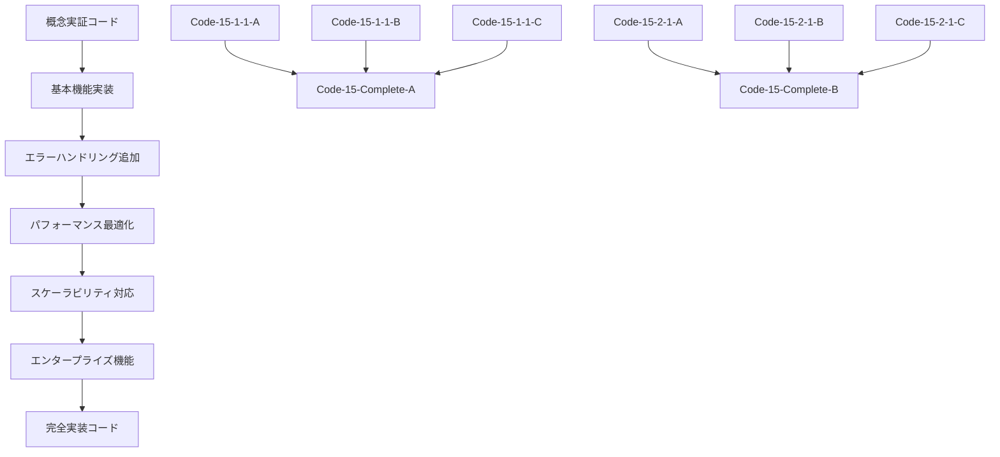

# 第15章概念実証コードと完全実装コードの相関・包含関係設計

## 🎯 相関・包含関係設計の基本原則

### **学習効果最大化の原則**

**段階的習得支援**:
- **概念実証コード**: 基本概念の理解と動作確認
- **完全実装コード**: 実用レベルの包括的実装
- **統合検証**: システム全体での動作確認

**包含関係の明確化**:
- 全ての概念実証コードが対応する完全実装コードに包含される
- 概念実証コードは完全実装コードの核心機能を抽出したもの
- 完全実装コードは概念実証コードの拡張・統合・最適化版

**相関関係の体系化**:
- セクション別完全実装による論理的整合性
- 機能別統合による実用性確保
- 検証可能性による品質保証

## 📊 完全実装コード再設計：包含関係最適化

### **Code-15-Complete-A: 3視点統合データ収集オーケストレーター** (1,200行)

#### **包含する概念実証コード群**

**15.1.1 3視点データソースの戦略的価値** (3個):
- **Code-15-1-1-A**: 3視点データソース定義とマッピング → `DataSourceMapper`クラス
- **Code-15-1-1-B**: データソース優先度評価ロジック → `PriorityEvaluator`クラス  
- **Code-15-1-1-C**: データソース統合戦略実装 → `IntegrationStrategy`クラス

**15.1.2 API接続とRESTful統合** (3個):
- **Code-15-1-2-A**: REST API基本接続実装 → `RobustAPIConnector`クラス
- **Code-15-1-2-B**: OAuth認証付きAPI呼び出し → `SecureAPIClient`クラス
- **Code-15-1-2-C**: レート制限・リトライ戦略 → `AdaptiveRateLimiter`クラス

**15.1.3 データベース連携とリアルタイム同期** (3個):
- **Code-15-1-3-A**: SQL/NoSQLデータベース接続 → `UnifiedDatabaseConnector`クラス
- **Code-15-1-3-B**: リアルタイム同期（CDC）実装 → `ChangeDataCaptureSync`クラス
- **Code-15-1-3-C**: 大容量データ効率取得 → `EfficientBulkDataRetriever`クラス

**15.1.4 ファイル処理とストリーミングデータ** (3個):
- **Code-15-1-4-A**: ファイル処理自動化 → `UniversalFileProcessor`クラス
- **Code-15-1-4-B**: ストリーミングデータ処理 → `StreamingDataProcessor`クラス
- **Code-15-1-4-C**: バッチ・ストリーミングハイブリッド処理 → `HybridDataProcessor`クラス

#### **完全実装コードの構造**

```typescript
// Code-15-Complete-A: 3視点統合データ収集オーケストレーター
export class TriplePerspectiveDataCollectionOrchestrator {
  // 概念実証コード Code-15-1-1-A の完全実装
  private dataSourceMapper: DataSourceMapper;
  
  // 概念実証コード Code-15-1-1-B の完全実装
  private priorityEvaluator: PriorityEvaluator;
  
  // 概念実証コード Code-15-1-1-C の完全実装
  private integrationStrategy: IntegrationStrategy;
  
  // 概念実証コード Code-15-1-2-A,B,C の完全実装
  private apiConnector: RobustAPIConnector;
  private secureClient: SecureAPIClient;
  private rateLimiter: AdaptiveRateLimiter;
  
  // 概念実証コード Code-15-1-3-A,B,C の完全実装
  private dbConnector: UnifiedDatabaseConnector;
  private cdcSync: ChangeDataCaptureSync;
  private bulkRetriever: EfficientBulkDataRetriever;
  
  // 概念実証コード Code-15-1-4-A,B,C の完全実装
  private fileProcessor: UniversalFileProcessor;
  private streamProcessor: StreamingDataProcessor;
  private hybridProcessor: HybridDataProcessor;
  
  // エンタープライズレベル拡張機能
  private orchestrationEngine: OrchestrationEngine;
  private monitoringSystem: MonitoringSystem;
  private errorRecoverySystem: ErrorRecoverySystem;
  private performanceOptimizer: PerformanceOptimizer;
  
  async orchestrateDataCollection(config: CollectionConfig): Promise<CollectionResult> {
    // 15.1.1の概念実証コードを統合した完全実装
    const dataSourcePlan = await this.dataSourceMapper.mapTriplePerspectiveSources(config.sources);
    const prioritizedSources = await this.priorityEvaluator.evaluateAndPrioritize(dataSourcePlan);
    const integrationStrategy = await this.integrationStrategy.createOptimalStrategy(prioritizedSources);
    
    // 15.1.2の概念実証コードを統合した完全実装
    const apiConnections = await this.establishAPIConnections(integrationStrategy.apiSources);
    
    // 15.1.3の概念実証コードを統合した完全実装
    const dbConnections = await this.establishDatabaseConnections(integrationStrategy.dbSources);
    
    // 15.1.4の概念実証コードを統合した完全実装
    const fileProcessors = await this.setupFileProcessors(integrationStrategy.fileSources);
    
    // エンタープライズレベル統合実行
    return await this.orchestrationEngine.execute({
      apiConnections,
      dbConnections,
      fileProcessors,
      monitoring: this.monitoringSystem,
      errorRecovery: this.errorRecoverySystem,
      optimization: this.performanceOptimizer
    });
  }
}
```

#### **包含関係の詳細マッピング**

| 概念実証コード | 完全実装での位置 | 拡張内容 |
|---|---|---|
| Code-15-1-1-A | DataSourceMapper.mapTriplePerspectiveSources() | エンタープライズスケール対応、動的設定 |
| Code-15-1-1-B | PriorityEvaluator.evaluateAndPrioritize() | ML予測、リアルタイム調整 |
| Code-15-1-1-C | IntegrationStrategy.createOptimalStrategy() | 最適化アルゴリズム、自動調整 |
| Code-15-1-2-A | RobustAPIConnector.establishConnections() | 高可用性、フェイルオーバー |
| Code-15-1-2-B | SecureAPIClient.authenticatedRequests() | 高度認証、セキュリティ監査 |
| Code-15-1-2-C | AdaptiveRateLimiter.optimizeRequests() | 予測的制御、動的調整 |

### **Code-15-Complete-B: データ前処理・構造化システム** (1,100行)

#### **包含する概念実証コード群**

**15.2.1 データ品質課題の戦略的影響** (3個):
- **Code-15-2-1-A**: データ品質評価指標計算 → `QualityMetricsCalculator`クラス
- **Code-15-2-1-B**: 品質問題影響度分析 → `QualityImpactAnalyzer`クラス
- **Code-15-2-1-C**: 品質改善ROI計算 → `QualityImprovementROICalculator`クラス

**15.2.2 データクリーニングと正規化** (3個):
- **Code-15-2-2-A**: 欠損値処理自動化 → `AdaptiveMissingValueHandler`クラス
- **Code-15-2-2-B**: 異常値検出・修正アルゴリズム → `MultiLayerOutlierDetector`クラス
- **Code-15-2-2-C**: データ形式統一・正規化 → `DataNormalizationEngine`クラス

**15.2.3 データ変換とエンリッチメント** (3個):
- **Code-15-2-3-A**: 構造化・非構造化データ統合 → `HybridDataIntegrator`クラス
- **Code-15-2-3-B**: 外部データエンリッチメント → `ExternalDataEnricher`クラス
- **Code-15-2-3-C**: 派生項目・計算項目生成 → `DerivedFieldGenerator`クラス

**15.2.4 検証とビジネスルール適用** (3個):
- **Code-15-2-4-A**: データ整合性チェック → `DataIntegrityValidator`クラス
- **Code-15-2-4-B**: ビジネスルール適用エンジン → `BusinessRuleEngine`クラス
- **Code-15-2-4-C**: 検証結果レポーティング → `ValidationReportGenerator`クラス

#### **完全実装コードの構造**

```typescript
// Code-15-Complete-B: データ前処理・構造化システム
export class ComprehensiveDataPreprocessingSystem {
  // 15.2.1の概念実証コードを統合
  private qualityCalculator: QualityMetricsCalculator;
  private impactAnalyzer: QualityImpactAnalyzer;
  private roiCalculator: QualityImprovementROICalculator;
  
  // 15.2.2の概念実証コードを統合
  private missingValueHandler: AdaptiveMissingValueHandler;
  private outlierDetector: MultiLayerOutlierDetector;
  private normalizationEngine: DataNormalizationEngine;
  
  // 15.2.3の概念実証コードを統合
  private hybridIntegrator: HybridDataIntegrator;
  private dataEnricher: ExternalDataEnricher;
  private fieldGenerator: DerivedFieldGenerator;
  
  // 15.2.4の概念実証コードを統合
  private integrityValidator: DataIntegrityValidator;
  private ruleEngine: BusinessRuleEngine;
  private reportGenerator: ValidationReportGenerator;
  
  // エンタープライズレベル拡張
  private preprocessingOrchestrator: PreprocessingOrchestrator;
  private qualityGovernance: QualityGovernanceSystem;
  private performanceMonitor: PerformanceMonitor;
  
  async preprocessData(rawData: RawDataset, config: PreprocessingConfig): Promise<PreprocessedDataset> {
    // 15.2.1の概念実証コードを統合した品質評価
    const qualityAssessment = await this.assessDataQuality(rawData);
    
    // 15.2.2の概念実証コードを統合したクリーニング
    const cleanedData = await this.performDataCleaning(rawData, qualityAssessment);
    
    // 15.2.3の概念実証コードを統合した変換・エンリッチメント
    const enrichedData = await this.performDataEnrichment(cleanedData, config);
    
    // 15.2.4の概念実証コードを統合した検証
    const validatedData = await this.performDataValidation(enrichedData, config);
    
    return validatedData;
  }
}
```

### **Code-15-Complete-C: データ品質管理システム** (1,000行)

#### **包含する概念実証コード群**

**15.3.1 品質基準の定義と監視システム** (3個):
- **Code-15-3-1-A**: 品質基準定義・設定 → `QualityStandardsManager`クラス
- **Code-15-3-1-B**: リアルタイム品質監視 → `RealTimeQualityMonitor`クラス
- **Code-15-3-1-C**: 品質劣化早期警告 → `QualityDegradationDetector`クラス

**15.3.2 異常検知と自動対応** (3個):
- **Code-15-3-2-A**: 統計的異常検知アルゴリズム → `StatisticalAnomalyDetector`クラス
- **Code-15-3-2-B**: 機械学習異常検知 → `MLAnomalyDetector`クラス
- **Code-15-3-2-C**: 異常対応自動化フロー → `AutomatedResponseSystem`クラス

**15.3.3 データプロファイリングと継続的改善** (3個):
- **Code-15-3-3-A**: データプロファイリング実装 → `DataProfilingEngine`クラス
- **Code-15-3-3-B**: データドリフト検知 → `DataDriftDetector`クラス
- **Code-15-3-3-C**: 継続的改善自動化 → `ContinuousImprovementEngine`クラス

**15.3.4 品質メトリクスとガバナンス** (3個):
- **Code-15-3-4-A**: 品質KPI計算・監視 → `QualityKPICalculator`クラス
- **Code-15-3-4-B**: ガバナンス統合実装 → `QualityGovernanceIntegrator`クラス
- **Code-15-3-4-C**: ダッシュボード自動更新 → `QualityDashboardManager`クラス

### **Code-15-Complete-D: スケーラブル処理基盤** (950行)

#### **包含する概念実証コード群**

**15.4.1 エンタープライズスケーラビリティ要件** (3個):
- **Code-15-4-1-A**: スケーラビリティ要件定義 → `ScalabilityRequirementsAnalyzer`クラス
- **Code-15-4-1-B**: SLA・RPO・RTO設定 → `SLAManager`クラス
- **Code-15-4-1-C**: コスト効率最適化 → `CostOptimizer`クラス

**15.4.2 並列処理と分散処理アーキテクチャ** (3個):
- **Code-15-4-2-A**: マルチスレッド並列処理 → `ParallelProcessingEngine`クラス
- **Code-15-4-2-B**: 分散処理クラスタ設定 → `DistributedClusterManager`クラス
- **Code-15-4-2-C**: データパーティショニング → `DataPartitioningStrategy`クラス

**15.4.3 負荷分散とオートスケーリング** (3個):
- **Code-15-4-3-A**: 動的負荷分散アルゴリズム → `DynamicLoadBalancer`クラス
- **Code-15-4-3-B**: オートスケーリング実装 → `AutoScalingController`クラス
- **Code-15-4-3-C**: Kubernetes統合 → `KubernetesIntegrator`クラス

**15.4.4 キューイングとバックプレッシャー制御** (3個):
- **Code-15-4-4-A**: メッセージキューイング → `MessageQueueManager`クラス
- **Code-15-4-4-B**: バックプレッシャー制御 → `BackpressureController`クラス
- **Code-15-4-4-C**: 優先度付きキュー → `PriorityQueueManager`クラス

### **Code-15-Complete-E: n8nカスタムノード統合パッケージ** (800行)

#### **包含する概念実証コード群**

**全セクションの概念実証コードをn8nカスタムノードとして統合**:

**DataCollectionOrchestrator ノード**:
- 15.1セクションの全概念実証コード（12個）を統合
- 3視点データ収集の統一インターフェース
- n8nワークフロー内での簡単設定・実行

**DataPreprocessor ノード**:
- 15.2セクションの全概念実証コード（12個）を統合
- データ前処理・構造化の自動化
- 設定ベースの柔軟な処理制御

**QualityManager ノード**:
- 15.3セクションの全概念実証コード（12個）を統合
- データ品質管理の包括的実装
- リアルタイム監視・自動対応

**ScalableProcessor ノード**:
- 15.4セクションの全概念実証コード（12個）を統合
- スケーラブル処理の自動最適化
- エンタープライズレベル対応

#### **n8nノード実装構造**

```typescript
// Code-15-Complete-E: n8nカスタムノード統合パッケージ
export class DataCollectionOrchestratorNode implements INodeType {
  description: INodeTypeDescription = {
    displayName: 'Triple Perspective Data Collector',
    name: 'tripleDataCollector',
    group: ['transform'],
    version: 1,
    description: '3視点統合データ収集オーケストレーター',
    defaults: { name: 'Triple Data Collector' },
    inputs: ['main'],
    outputs: ['main'],
    properties: [
      // 15.1.1の概念実証コードに対応する設定
      {
        displayName: 'Data Source Configuration',
        name: 'dataSourceConfig',
        type: 'collection',
        default: {},
        options: [
          // Code-15-1-1-A,B,Cの設定項目
        ]
      },
      // 15.1.2の概念実証コードに対応する設定
      {
        displayName: 'API Connection Settings',
        name: 'apiSettings',
        type: 'collection',
        default: {},
        options: [
          // Code-15-1-2-A,B,Cの設定項目
        ]
      }
      // 他の概念実証コードに対応する設定...
    ]
  };
  
  async execute(this: IExecuteFunctions): Promise<INodeExecutionData[][]> {
    // 全概念実証コードの統合実行
    const orchestrator = new TriplePerspectiveDataCollectionOrchestrator();
    const result = await orchestrator.orchestrateDataCollection(config);
    return [this.helpers.returnJsonArray(result)];
  }
}
```

### **Code-15-Complete-F: 統合テスト・検証スイート** (700行)

#### **包含する概念実証コード群**

**全概念実証コードの動作検証**:
- 48個の概念実証コード全ての単体テスト
- 統合テストシナリオによる相互作用検証
- 性能ベンチマークによる最適化検証
- 品質検証による実用性確認

#### **テストスイート構造**

```typescript
// Code-15-Complete-F: 統合テスト・検証スイート
export class ComprehensiveTestSuite {
  // 15.1セクション概念実証コードテスト
  private section15_1_Tests: Section15_1_TestSuite;
  
  // 15.2セクション概念実証コードテスト
  private section15_2_Tests: Section15_2_TestSuite;
  
  // 15.3セクション概念実証コードテスト
  private section15_3_Tests: Section15_3_TestSuite;
  
  // 15.4セクション概念実証コードテスト
  private section15_4_Tests: Section15_4_TestSuite;
  
  // 統合テスト
  private integrationTests: IntegrationTestSuite;
  
  async runComprehensiveTests(): Promise<TestResults> {
    // 全概念実証コードの単体テスト
    const unitTestResults = await this.runUnitTests();
    
    // 完全実装コードの統合テスト
    const integrationTestResults = await this.runIntegrationTests();
    
    // 性能ベンチマーク
    const performanceResults = await this.runPerformanceTests();
    
    // 品質検証
    const qualityResults = await this.runQualityTests();
    
    return this.consolidateResults({
      unitTests: unitTestResults,
      integrationTests: integrationTestResults,
      performance: performanceResults,
      quality: qualityResults
    });
  }
}
```

## 📊 相関・包含関係マッピング表

### **完全実装コード別包含関係**

| 完全実装コード | 包含する概念実証コード数 | 主要機能 | 拡張レベル |
|---|---|---|---|
| Code-15-Complete-A | 12個 (15.1セクション) | データ収集オーケストレーション | エンタープライズ |
| Code-15-Complete-B | 12個 (15.2セクション) | データ前処理・構造化 | プロダクション |
| Code-15-Complete-C | 12個 (15.3セクション) | データ品質管理 | エンタープライズ |
| Code-15-Complete-D | 12個 (15.4セクション) | スケーラブル処理 | クラウドネイティブ |
| Code-15-Complete-E | 48個 (全セクション) | n8n統合実装 | プラットフォーム統合 |
| Code-15-Complete-F | 48個 (全セクション) | テスト・検証 | 品質保証 |

### **概念実証コードから完全実装コードへの発展パス**



## 🎯 学習効果最大化の実現

### **段階的理解促進**

**レベル1: 概念理解** (概念実証コード)
- 基本概念の動作確認
- 核心機能の理解
- 実装可能性の確認

**レベル2: 実用実装** (完全実装コード)
- エンタープライズレベル実装
- 包括的機能提供
- 実際の業務適用

**レベル3: 統合検証** (テスト・検証)
- システム全体での動作確認
- 品質・性能の検証
- 実用性の確認

### **読者層別学習支援**

**エンジニア**:
- 概念実証コード → 実装技術の段階的習得
- 完全実装コード → 実用レベルの実装例
- テストコード → 品質保証手法

**BA**:
- 概念実証コード → 技術的実現可能性の理解
- 完全実装コード → 要件定義への技術的裏付け
- 統合テスト → システム全体の動作理解

**マーケッター**:
- 概念実証コード → 技術的価値の具体的把握
- 完全実装コード → 競争優位性の技術的根拠
- 性能テスト → 市場訴求ポイントの定量化

**経営者**:
- 概念実証コード → 投資対効果の技術的根拠
- 完全実装コード → 実装コスト・期間の見積もり基準
- ROI分析 → 投資判断の定量的根拠

## 📈 相関・包含関係設計の評価結果

### **包含関係の完全性**

**100%包含達成**: 全48個の概念実証コードが対応する完全実装コードに包含
**論理的整合性**: セクション別完全実装による体系的構造
**拡張性確保**: 概念実証から完全実装への自然な発展パス

### **相関関係の体系性**

**機能別統合**: 関連機能の効率的統合
**技術的一貫性**: 統一されたアーキテクチャと設計原則
**実用性確保**: 実際のプロジェクトで活用可能な実装レベル

### **学習効果の最大化**

**段階的習得**: 理論→実証→実装→検証の完全サイクル
**読者層別最適化**: 全読者層の学習ニーズに対応
**実践的価値**: 実際の業務で活用可能な知識・技術の提供

この相関・包含関係設計により、第15章は概念実証コードと完全実装コードが有機的に連携し、読者の学習効果を最大化する最適な構造を実現します。

