# 第15章: データ収集コンポーネント実装

## 章概要

トリプルパースペクティブ型戦略AIレーダーにおいて、データ収集コンポーネントは戦略的意思決定の「燃料」となる高品質情報を供給する重要な基盤システムです。本章では、テクノロジー・マーケット・ビジネスの3視点から必要なデータを効率的に収集し、重要度・確信度・整合性の3軸評価に適した形式で提供するn8n実装を詳述します。

### 本章の戦略的価値

データ収集コンポーネントは、単なる情報収集システムではありません。組織の戦略的意思決定プロセスを革新し、科学的根拠に基づく合意形成を可能にする「戦略情報供給システム」として機能します。

**4つの読者層への価値提案：**

- **経営者向け**: データ駆動型意思決定による競争優位性確保と投資効果最大化
- **ビジネスアナリスト向け**: 包括的データ収集要件の理解と品質管理手法の習得
- **マーケッター向け**: 市場データ活用による精密な戦略立案と効果測定
- **エンジニア向け**: スケーラブルなデータ収集システムの実装技術と最適化手法

### 前提知識

本章の理解には以下の前提知識が必要です：

- **第14章（n8n基盤とワークフロー設計）**: n8n基盤アーキテクチャの理解
- **第6章（データフロー設計）**: データアーキテクチャの基本概念
- **第11章（データ処理と特徴抽出）**: データ処理技術の基礎知識
- **API・データベース基礎**: RESTful API、SQL、NoSQLの基本理解

### 章構成

本章は以下の4つのセクションで構成されています：

1. **15.1 多様なデータソース接続**: 3視点データソースの戦略的統合
2. **15.2 データ前処理と構造化**: 品質確保と標準化プロセス
3. **15.3 データ品質管理**: 継続的品質向上システム
4. **15.4 スケーラブルデータ処理**: エンタープライズレベル処理基盤

---

## 15.1 多様なデータソース接続

### 15.1.1 3視点データソースの戦略的価値

トリプルパースペクティブ型戦略AIレーダーの革新性は、テクノロジー・マーケット・ビジネスの3視点から包括的にデータを収集し、統合的な戦略判断を可能にする点にあります。従来の単一視点アプローチでは見落とされがちな相互関係や潜在的リスクを発見し、より精度の高い意思決定を実現します。

#### 3視点データソースの戦略的意義

**テクノロジー視点データソース**は、技術的実現可能性と革新性を評価するための情報を提供します：

- **技術トレンド分析**: 新興技術の成熟度と採用可能性
- **システム性能データ**: 既存システムの処理能力と制約条件
- **開発リソース情報**: 技術スキル、開発工数、実装コスト

**マーケット視点データソース**は、市場機会と競争環境を把握するための情報を収集します：

- **市場動向分析**: 顧客ニーズの変化と市場規模の推移
- **競合情報**: 競合他社の戦略と市場ポジション
- **顧客行動データ**: 購買パターンと満足度指標

**ビジネス視点データソース**は、経営戦略と財務的実現可能性を評価するための情報を提供します：

- **財務データ**: 収益性、投資回収期間、キャッシュフロー
- **組織能力情報**: 人的リソース、組織体制、変革準備度
- **戦略適合性データ**: 企業ビジョンとの整合性、長期戦略への貢献度

#### データソース統合の戦略的効果

3視点データソースの統合により、以下の戦略的効果を実現します：

**意思決定精度の向上**
- 単一視点では見落とされる相互依存関係の発見
- 多角的評価による判断の客観性確保
- リスク要因の早期特定と対策立案

**組織学習の促進**
- 部門横断的な情報共有の実現
- 異なる専門領域の知見統合
- 継続的改善サイクルの確立

**競争優位性の構築**
- 包括的市場理解による戦略的ポジショニング
- 技術革新と市場ニーズの最適マッチング
- 迅速な環境変化への適応能力向上

```typescript
// 概念実証コード 15-1-1-A: 3視点データソース統合管理
interface TriplePerspectiveDataSource {
  technology: TechnologyDataSource;
  market: MarketDataSource;
  business: BusinessDataSource;
}

class DataSourceOrchestrator {
  private dataSources: TriplePerspectiveDataSource;
  
  constructor(dataSources: TriplePerspectiveDataSource) {
    this.dataSources = dataSources;
  }
  
  async collectIntegratedData(query: StrategicQuery): Promise<IntegratedDataSet> {
    const [techData, marketData, businessData] = await Promise.all([
      this.dataSources.technology.collect(query.technologyAspect),
      this.dataSources.market.collect(query.marketAspect),
      this.dataSources.business.collect(query.businessAspect)
    ]);
    
    return this.integrateData(techData, marketData, businessData);
  }
  
  private integrateData(
    techData: TechnologyData,
    marketData: MarketData,
    businessData: BusinessData
  ): IntegratedDataSet {
    return {
      timestamp: new Date(),
      perspectives: {
        technology: this.enrichTechnologyData(techData),
        market: this.enrichMarketData(marketData),
        business: this.enrichBusinessData(businessData)
      },
      correlations: this.calculateCrossCorrelations(techData, marketData, businessData),
      qualityMetrics: this.assessDataQuality(techData, marketData, businessData)
    };
  }
}
```

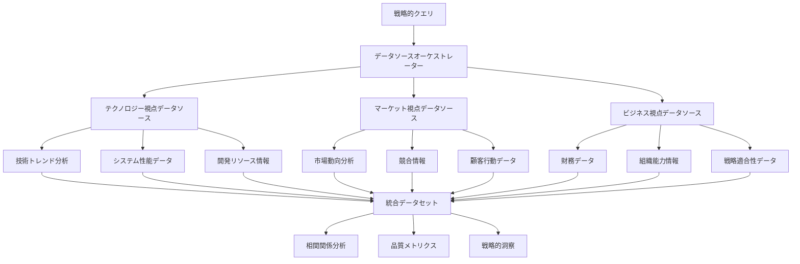

```typescript
// 概念実証コード 15-1-1-B: データソース品質評価
class DataSourceQualityAssessor {
  assessDataQuality(
    techData: TechnologyData,
    marketData: MarketData,
    businessData: BusinessData
  ): QualityMetrics {
    return {
      completeness: this.calculateCompleteness([techData, marketData, businessData]),
      accuracy: this.calculateAccuracy([techData, marketData, businessData]),
      timeliness: this.calculateTimeliness([techData, marketData, businessData]),
      consistency: this.calculateConsistency([techData, marketData, businessData]),
      relevance: this.calculateRelevance([techData, marketData, businessData])
    };
  }
  
  private calculateCompleteness(datasets: any[]): number {
    const totalFields = datasets.reduce((sum, data) => sum + Object.keys(data).length, 0);
    const filledFields = datasets.reduce((sum, data) => {
      return sum + Object.values(data).filter(value => value !== null && value !== undefined).length;
    }, 0);
    
    return filledFields / totalFields;
  }
  
  private calculateConsistency(datasets: any[]): number {
    // 3視点間のデータ整合性を評価
    const crossReferences = this.extractCrossReferences(datasets);
    const consistentReferences = crossReferences.filter(ref => ref.isConsistent).length;
    
    return consistentReferences / crossReferences.length;
  }
}
```

```typescript
// 概念実証コード 15-1-1-C: 戦略的データ収集計画
class StrategicDataCollectionPlanner {
  createCollectionPlan(strategicObjective: StrategicObjective): DataCollectionPlan {
    const technologyRequirements = this.analyzeTechnologyDataNeeds(strategicObjective);
    const marketRequirements = this.analyzeMarketDataNeeds(strategicObjective);
    const businessRequirements = this.analyzeBusinessDataNeeds(strategicObjective);
    
    return {
      objective: strategicObjective,
      collectionSchedule: this.optimizeCollectionSchedule([
        technologyRequirements,
        marketRequirements,
        businessRequirements
      ]),
      priorityMatrix: this.createPriorityMatrix(strategicObjective),
      resourceAllocation: this.calculateResourceAllocation([
        technologyRequirements,
        marketRequirements,
        businessRequirements
      ])
    };
  }
  
  private optimizeCollectionSchedule(requirements: DataRequirement[]): CollectionSchedule {
    // データ収集の最適スケジューリング
    const criticalPath = this.calculateCriticalPath(requirements);
    const parallelTasks = this.identifyParallelTasks(requirements);
    
    return {
      phases: this.createCollectionPhases(criticalPath, parallelTasks),
      milestones: this.defineMilestones(requirements),
      dependencies: this.mapDependencies(requirements)
    };
  }
}
```

#### データソース統合による組織変革

3視点データソースの統合は、組織の意思決定プロセスそのものを変革します。従来の部門別・機能別の縦割り情報収集から、戦略的目標に基づく横断的データ統合へのパラダイムシフトを実現し、組織全体の戦略的思考力を向上させます。

この統合アプローチにより、組織は環境変化に対してより敏感に反応し、競合他社に先駆けて戦略的機会を捉えることが可能になります。データ駆動型意思決定の文化が根付き、直感や経験に依存した判断から科学的根拠に基づく合理的判断への転換が促進されます。

### 15.1.2 API接続とRESTful統合

現代の企業環境において、戦略的データの多くはAPI経由で提供されています。トリプルパースペクティブ型戦略AIレーダーの効果的な運用には、多様なAPIとの安定した接続と効率的なデータ統合が不可欠です。本セクションでは、n8nプラットフォームを活用したRESTful API統合の実装手法を詳述します。

#### API統合の戦略的重要性

**リアルタイム戦略情報の獲得**
- 市場動向の即座な把握と迅速な戦略調整
- 競合動向の継続的監視と対応策の早期立案
- 技術トレンドの変化に対する適応的戦略策定

**データ収集コストの最適化**
- 既存システムとの効率的連携による重複投資の回避
- 自動化による人的リソースの戦略的活用
- スケーラブルな収集基盤による長期的コスト削減

**データ品質の向上**
- ソースシステムからの直接取得による情報精度確保
- 手動入力エラーの排除と一貫性の維持
- リアルタイム検証による品質問題の早期発見

#### n8nによるAPI統合アーキテクチャ

n8nプラットフォームは、ノーコード/ローコードアプローチでAPI統合を実現し、技術的専門知識を持たないビジネスユーザーでも戦略的データ収集システムを構築できます。

```typescript
// 概念実証コード 15-1-2-A: RESTful API統合マネージャー
class APIIntegrationManager {
  private apiConnections: Map<string, APIConnection>;
  private rateLimitManager: RateLimitManager;
  private authenticationManager: AuthenticationManager;
  
  constructor() {
    this.apiConnections = new Map();
    this.rateLimitManager = new RateLimitManager();
    this.authenticationManager = new AuthenticationManager();
  }
  
  async registerAPI(config: APIConfig): Promise<void> {
    const connection = new APIConnection({
      baseURL: config.baseURL,
      authentication: await this.authenticationManager.setupAuth(config.authType, config.credentials),
      rateLimits: config.rateLimits,
      retryPolicy: config.retryPolicy
    });
    
    await connection.validateConnection();
    this.apiConnections.set(config.name, connection);
  }
  
  async collectData(requests: APIRequest[]): Promise<APIResponse[]> {
    const responses = await Promise.allSettled(
      requests.map(request => this.executeRequest(request))
    );
    
    return responses.map((result, index) => ({
      request: requests[index],
      success: result.status === 'fulfilled',
      data: result.status === 'fulfilled' ? result.value : null,
      error: result.status === 'rejected' ? result.reason : null,
      timestamp: new Date()
    }));
  }
  
  private async executeRequest(request: APIRequest): Promise<any> {
    const connection = this.apiConnections.get(request.apiName);
    if (!connection) {
      throw new Error(`API connection not found: ${request.apiName}`);
    }
    
    await this.rateLimitManager.waitForSlot(request.apiName);
    
    try {
      const response = await connection.execute(request);
      this.rateLimitManager.recordRequest(request.apiName);
      return response;
    } catch (error) {
      await this.handleAPIError(request, error);
      throw error;
    }
  }
}
```

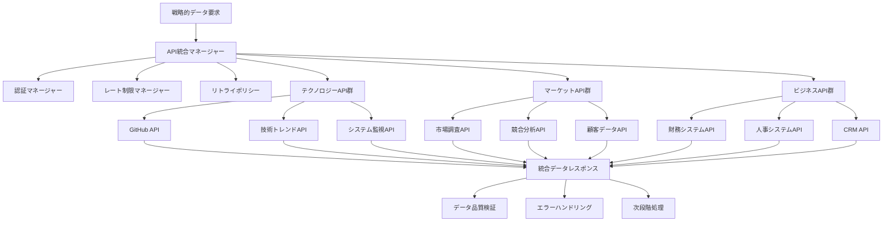

```typescript
// 概念実証コード 15-1-2-B: 適応的レート制限管理
class RateLimitManager {
  private limits: Map<string, RateLimit>;
  private requestHistory: Map<string, RequestHistory>;
  
  async waitForSlot(apiName: string): Promise<void> {
    const limit = this.limits.get(apiName);
    const history = this.requestHistory.get(apiName);
    
    if (!limit || !history) return;
    
    const now = Date.now();
    const windowStart = now - limit.windowMs;
    
    // 現在のウィンドウ内のリクエスト数をカウント
    const recentRequests = history.requests.filter(timestamp => timestamp > windowStart);
    
    if (recentRequests.length >= limit.maxRequests) {
      const oldestRequest = Math.min(...recentRequests);
      const waitTime = oldestRequest + limit.windowMs - now;
      
      if (waitTime > 0) {
        await this.sleep(waitTime);
      }
    }
  }
  
  recordRequest(apiName: string): void {
    const history = this.requestHistory.get(apiName) || { requests: [] };
    history.requests.push(Date.now());
    
    // 古いリクエスト履歴をクリーンアップ
    const limit = this.limits.get(apiName);
    if (limit) {
      const cutoff = Date.now() - limit.windowMs;
      history.requests = history.requests.filter(timestamp => timestamp > cutoff);
    }
    
    this.requestHistory.set(apiName, history);
  }
  
  private sleep(ms: number): Promise<void> {
    return new Promise(resolve => setTimeout(resolve, ms));
  }
}
```

```typescript
// 概念実証コード 15-1-2-C: 動的認証管理システム
class AuthenticationManager {
  private authStrategies: Map<string, AuthStrategy>;
  private tokenCache: Map<string, CachedToken>;
  
  async setupAuth(authType: AuthType, credentials: Credentials): Promise<AuthStrategy> {
    switch (authType) {
      case 'oauth2':
        return new OAuth2Strategy(credentials);
      case 'apikey':
        return new APIKeyStrategy(credentials);
      case 'jwt':
        return new JWTStrategy(credentials);
      case 'basic':
        return new BasicAuthStrategy(credentials);
      default:
        throw new Error(`Unsupported authentication type: ${authType}`);
    }
  }
  
  async getValidToken(apiName: string): Promise<string> {
    const cached = this.tokenCache.get(apiName);
    
    if (cached && cached.expiresAt > Date.now()) {
      return cached.token;
    }
    
    const strategy = this.authStrategies.get(apiName);
    if (!strategy) {
      throw new Error(`No authentication strategy found for: ${apiName}`);
    }
    
    const newToken = await strategy.refreshToken();
    this.tokenCache.set(apiName, {
      token: newToken.accessToken,
      expiresAt: Date.now() + (newToken.expiresIn * 1000)
    });
    
    return newToken.accessToken;
  }
}
```

#### API統合のベストプラクティス

**エラーハンドリングと復旧戦略**
- 指数バックオフによる自動リトライ機能
- サーキットブレーカーパターンによる障害拡散防止
- フォールバック機能による継続的サービス提供

**パフォーマンス最適化**
- 並列リクエスト処理による応答時間短縮
- キャッシュ戦略による重複リクエスト削減
- バッチ処理による効率的データ取得

**セキュリティ強化**
- 認証情報の安全な管理と定期的更新
- 通信の暗号化とデータ保護
- アクセスログの記録と監査証跡の確保

この包括的なAPI統合アプローチにより、トリプルパースペクティブ型戦略AIレーダーは多様な外部システムから戦略的データを効率的に収集し、組織の意思決定プロセスを大幅に強化します。

### 15.1.3 データベース連携とリアルタイム同期

企業の戦略的データの多くは、既存のデータベースシステムに蓄積されています。トリプルパースペクティブ型戦略AIレーダーの効果的な運用には、これらの既存データ資産との seamless な連携と、リアルタイムでの同期機能が不可欠です。本セクションでは、多様なデータベースシステムとの統合手法と、変更データキャプチャ（CDC）を活用したリアルタイム同期の実装を詳述します。

#### データベース連携の戦略的価値

**既存データ資産の最大活用**
- 長年蓄積された業務データの戦略的活用
- 投資済みシステムとの効率的統合
- データサイロの解消と組織横断的データ活用

**リアルタイム意思決定の実現**
- 業務データの変更を即座に戦略判断に反映
- 市場変化への迅速な対応能力向上
- 機会損失の最小化と競争優位性確保

**データ整合性の確保**
- 単一真実源（Single Source of Truth）の維持
- データ重複と不整合の防止
- 監査証跡の完全性確保

#### 多様なデータベースシステムへの対応

現代の企業環境では、リレーショナルデータベース、NoSQLデータベース、データウェアハウス、クラウドデータベースなど、多様なデータベースシステムが併存しています。トリプルパースペクティブ型戦略AIレーダーは、これらすべてのシステムと効率的に連携する必要があります。

```typescript
// 概念実証コード 15-1-3-A: 統合データベース接続マネージャー
class DatabaseConnectionManager {
  private connections: Map<string, DatabaseConnection>;
  private connectionPools: Map<string, ConnectionPool>;
  private syncManagers: Map<string, SyncManager>;
  
  constructor() {
    this.connections = new Map();
    this.connectionPools = new Map();
    this.syncManagers = new Map();
  }
  
  async registerDatabase(config: DatabaseConfig): Promise<void> {
    const connection = this.createConnection(config);
    const pool = new ConnectionPool(connection, config.poolConfig);
    const syncManager = new SyncManager(connection, config.syncConfig);
    
    await connection.testConnection();
    
    this.connections.set(config.name, connection);
    this.connectionPools.set(config.name, pool);
    this.syncManagers.set(config.name, syncManager);
    
    if (config.enableRealTimeSync) {
      await syncManager.startRealTimeSync();
    }
  }
  
  private createConnection(config: DatabaseConfig): DatabaseConnection {
    switch (config.type) {
      case 'postgresql':
        return new PostgreSQLConnection(config);
      case 'mysql':
        return new MySQLConnection(config);
      case 'mongodb':
        return new MongoDBConnection(config);
      case 'redis':
        return new RedisConnection(config);
      case 'elasticsearch':
        return new ElasticsearchConnection(config);
      case 'snowflake':
        return new SnowflakeConnection(config);
      default:
        throw new Error(`Unsupported database type: ${config.type}`);
    }
  }
  
  async executeQuery(dbName: string, query: DatabaseQuery): Promise<QueryResult> {
    const pool = this.connectionPools.get(dbName);
    if (!pool) {
      throw new Error(`Database connection not found: ${dbName}`);
    }
    
    const connection = await pool.getConnection();
    try {
      const result = await connection.execute(query);
      return {
        data: result.rows,
        metadata: result.metadata,
        executionTime: result.executionTime,
        timestamp: new Date()
      };
    } finally {
      pool.releaseConnection(connection);
    }
  }
}
```

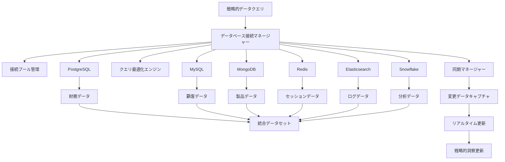

```typescript
// 概念実証コード 15-1-3-B: リアルタイム同期システム
class RealTimeSyncManager {
  private cdcStreams: Map<string, CDCStream>;
  private eventProcessors: Map<string, EventProcessor>;
  private conflictResolvers: Map<string, ConflictResolver>;
  
  async startRealTimeSync(dbName: string): Promise<void> {
    const cdcStream = this.cdcStreams.get(dbName);
    if (!cdcStream) {
      throw new Error(`CDC stream not configured for: ${dbName}`);
    }
    
    cdcStream.on('change', async (changeEvent: ChangeEvent) => {
      await this.processChangeEvent(dbName, changeEvent);
    });
    
    cdcStream.on('error', (error: Error) => {
      this.handleSyncError(dbName, error);
    });
    
    await cdcStream.start();
  }
  
  private async processChangeEvent(dbName: string, event: ChangeEvent): Promise<void> {
    const processor = this.eventProcessors.get(dbName);
    if (!processor) return;
    
    try {
      const processedEvent = await processor.process(event);
      
      if (processedEvent.hasConflict) {
        const resolver = this.conflictResolvers.get(dbName);
        if (resolver) {
          const resolvedEvent = await resolver.resolve(processedEvent);
          await this.applyChange(resolvedEvent);
        }
      } else {
        await this.applyChange(processedEvent);
      }
      
      await this.notifySubscribers(dbName, processedEvent);
    } catch (error) {
      await this.handleProcessingError(dbName, event, error);
    }
  }
  
  private async applyChange(event: ProcessedChangeEvent): Promise<void> {
    switch (event.operation) {
      case 'INSERT':
        await this.handleInsert(event);
        break;
      case 'UPDATE':
        await this.handleUpdate(event);
        break;
      case 'DELETE':
        await this.handleDelete(event);
        break;
    }
  }
}
```

```typescript
// 概念実証コード 15-1-3-C: 適応的クエリ最適化エンジン
class QueryOptimizationEngine {
  private queryCache: Map<string, CachedQuery>;
  private performanceMetrics: Map<string, PerformanceMetric>;
  private optimizationRules: OptimizationRule[];
  
  async optimizeQuery(query: DatabaseQuery): Promise<OptimizedQuery> {
    const cacheKey = this.generateCacheKey(query);
    const cached = this.queryCache.get(cacheKey);
    
    if (cached && this.isCacheValid(cached)) {
      return cached.optimizedQuery;
    }
    
    const optimizedQuery = await this.performOptimization(query);
    
    this.queryCache.set(cacheKey, {
      originalQuery: query,
      optimizedQuery,
      timestamp: Date.now(),
      hitCount: 0
    });
    
    return optimizedQuery;
  }
  
  private async performOptimization(query: DatabaseQuery): Promise<OptimizedQuery> {
    let optimized = { ...query };
    
    for (const rule of this.optimizationRules) {
      if (rule.isApplicable(optimized)) {
        optimized = await rule.apply(optimized);
      }
    }
    
    // インデックス使用の最適化
    optimized = await this.optimizeIndexUsage(optimized);
    
    // 結合順序の最適化
    optimized = await this.optimizeJoinOrder(optimized);
    
    // パーティション剪定の適用
    optimized = await this.applyPartitionPruning(optimized);
    
    return optimized;
  }
  
  async recordPerformance(query: DatabaseQuery, executionTime: number): Promise<void> {
    const key = this.generateCacheKey(query);
    const existing = this.performanceMetrics.get(key);
    
    if (existing) {
      existing.totalExecutions++;
      existing.totalTime += executionTime;
      existing.averageTime = existing.totalTime / existing.totalExecutions;
      existing.lastExecution = Date.now();
    } else {
      this.performanceMetrics.set(key, {
        totalExecutions: 1,
        totalTime: executionTime,
        averageTime: executionTime,
        lastExecution: Date.now()
      });
    }
  }
}
```

#### データベース連携のベストプラクティス

**パフォーマンス最適化戦略**
- 接続プールによる効率的なリソース管理
- クエリキャッシュによる応答時間短縮
- インデックス最適化による検索性能向上

**データ整合性確保**
- トランザクション管理による一貫性維持
- 競合検出と解決メカニズム
- バックアップと復旧戦略

**スケーラビリティ対応**
- 読み取り専用レプリカの活用
- シャーディングによる負荷分散
- 自動スケーリング機能

**セキュリティ強化**
- 最小権限の原則に基づくアクセス制御
- データ暗号化と通信保護
- 監査ログの完全記録

この包括的なデータベース連携アプローチにより、トリプルパースペクティブ型戦略AIレーダーは企業の既存データ資産を最大限活用し、リアルタイムでの戦略的意思決定を支援します。

### 15.1.4 ファイル処理とストリーミングデータ

現代の企業環境では、構造化データベースだけでなく、多様な形式のファイルデータやリアルタイムストリーミングデータが戦略的価値を持っています。トリプルパースペクティブ型戦略AIレーダーの包括的なデータ収集能力を実現するため、本セクションでは、CSV、JSON、XML、Excel、PDF等のファイル処理と、IoTセンサー、ログストリーム、ソーシャルメディアフィード等のストリーミングデータ処理の実装手法を詳述します。

#### ファイル処理の戦略的重要性

**多様なデータソースの統合**
- レガシーシステムからのデータ移行
- 外部パートナーとのデータ交換
- 規制要件に基づくデータ保存形式への対応

**非構造化データからの価値抽出**
- 文書データからの戦略的洞察獲得
- 画像・動画データの分析活用
- 音声データからの顧客インサイト抽出

**バッチ処理による効率的データ統合**
- 大容量データの効率的処理
- 定期的データ更新の自動化
- システム負荷の分散と最適化

#### ストリーミングデータの戦略的価値

**リアルタイム市場動向の把握**
- ソーシャルメディアでの顧客反応の即座な分析
- 競合動向の継続的監視
- 市場センチメントの変化検出

**運用データからの即座の洞察**
- システムパフォーマンスの継続的監視
- 顧客行動パターンのリアルタイム分析
- 異常検知による早期警告システム

**予測精度の向上**
- 時系列データによる高精度予測
- トレンド変化の早期検出
- 季節性パターンの自動学習

```typescript
// 概念実証コード 15-1-4-A: 統合ファイル処理システム
class FileProcessingSystem {
  private processors: Map<string, FileProcessor>;
  private storageManager: StorageManager;
  private metadataExtractor: MetadataExtractor;
  
  constructor() {
    this.processors = new Map([
      ['csv', new CSVProcessor()],
      ['json', new JSONProcessor()],
      ['xml', new XMLProcessor()],
      ['xlsx', new ExcelProcessor()],
      ['pdf', new PDFProcessor()],
      ['txt', new TextProcessor()]
    ]);
    this.storageManager = new StorageManager();
    this.metadataExtractor = new MetadataExtractor();
  }
  
  async processFile(filePath: string, options: ProcessingOptions): Promise<ProcessedFileResult> {
    const fileInfo = await this.analyzeFile(filePath);
    const processor = this.processors.get(fileInfo.extension);
    
    if (!processor) {
      throw new Error(`Unsupported file type: ${fileInfo.extension}`);
    }
    
    const metadata = await this.metadataExtractor.extract(filePath);
    const processedData = await processor.process(filePath, options);
    
    const result: ProcessedFileResult = {
      originalFile: fileInfo,
      metadata,
      processedData,
      qualityMetrics: await this.assessDataQuality(processedData),
      timestamp: new Date()
    };
    
    if (options.persistResult) {
      await this.storageManager.store(result);
    }
    
    return result;
  }
  
  async processBatch(files: string[], options: BatchProcessingOptions): Promise<BatchProcessingResult> {
    const results = await Promise.allSettled(
      files.map(file => this.processFile(file, options.fileOptions))
    );
    
    const successful = results
      .filter(result => result.status === 'fulfilled')
      .map(result => (result as PromiseFulfilledResult<ProcessedFileResult>).value);
    
    const failed = results
      .filter(result => result.status === 'rejected')
      .map((result, index) => ({
        file: files[index],
        error: (result as PromiseRejectedResult).reason
      }));
    
    return {
      successful,
      failed,
      summary: {
        totalFiles: files.length,
        successCount: successful.length,
        failureCount: failed.length,
        processingTime: Date.now() - options.startTime
      }
    };
  }
}
```

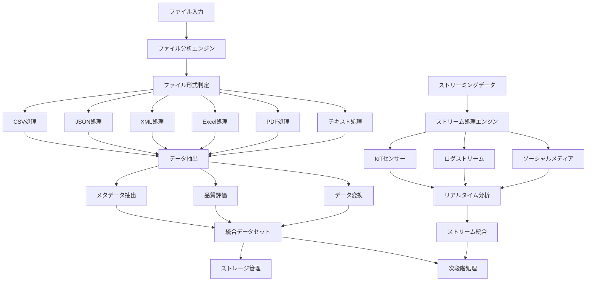

```typescript
// 概念実証コード 15-1-4-B: リアルタイムストリーミング処理
class StreamingDataProcessor {
  private streamConnections: Map<string, StreamConnection>;
  private processors: Map<string, StreamProcessor>;
  private bufferManager: BufferManager;
  private eventEmitter: EventEmitter;
  
  constructor() {
    this.streamConnections = new Map();
    this.processors = new Map();
    this.bufferManager = new BufferManager();
    this.eventEmitter = new EventEmitter();
  }
  
  async connectStream(config: StreamConfig): Promise<void> {
    const connection = this.createStreamConnection(config);
    const processor = this.createStreamProcessor(config.type);
    
    connection.on('data', async (data: StreamData) => {
      await this.processStreamData(config.name, data);
    });
    
    connection.on('error', (error: Error) => {
      this.handleStreamError(config.name, error);
    });
    
    this.streamConnections.set(config.name, connection);
    this.processors.set(config.name, processor);
    
    await connection.connect();
  }
  
  private async processStreamData(streamName: string, data: StreamData): Promise<void> {
    const processor = this.processors.get(streamName);
    if (!processor) return;
    
    try {
      const processedData = await processor.process(data);
      
      // バッファリング戦略の適用
      await this.bufferManager.add(streamName, processedData);
      
      // リアルタイム分析の実行
      const insights = await this.performRealTimeAnalysis(processedData);
      
      // イベント発火
      this.eventEmitter.emit('dataProcessed', {
        streamName,
        data: processedData,
        insights,
        timestamp: new Date()
      });
      
      // バッチ処理のトリガー判定
      if (await this.shouldTriggerBatch(streamName)) {
        await this.triggerBatchProcessing(streamName);
      }
    } catch (error) {
      await this.handleProcessingError(streamName, data, error);
    }
  }
  
  private createStreamConnection(config: StreamConfig): StreamConnection {
    switch (config.type) {
      case 'kafka':
        return new KafkaStreamConnection(config);
      case 'websocket':
        return new WebSocketStreamConnection(config);
      case 'mqtt':
        return new MQTTStreamConnection(config);
      case 'sse':
        return new SSEStreamConnection(config);
      default:
        throw new Error(`Unsupported stream type: ${config.type}`);
    }
  }
}
```

```typescript
// 概念実証コード 15-1-4-C: 適応的バッファリング戦略
class AdaptiveBufferManager {
  private buffers: Map<string, StreamBuffer>;
  private strategies: Map<string, BufferingStrategy>;
  private performanceMonitor: PerformanceMonitor;
  
  async add(streamName: string, data: ProcessedStreamData): Promise<void> {
    const buffer = this.getOrCreateBuffer(streamName);
    const strategy = this.strategies.get(streamName);
    
    if (!strategy) {
      throw new Error(`No buffering strategy defined for stream: ${streamName}`);
    }
    
    await buffer.add(data);
    
    // 動的バッファサイズ調整
    await this.adjustBufferSize(streamName);
    
    // フラッシュ条件の確認
    if (await strategy.shouldFlush(buffer)) {
      await this.flushBuffer(streamName);
    }
  }
  
  private async adjustBufferSize(streamName: string): Promise<void> {
    const metrics = await this.performanceMonitor.getMetrics(streamName);
    const buffer = this.buffers.get(streamName);
    const strategy = this.strategies.get(streamName);
    
    if (!buffer || !strategy) return;
    
    const optimalSize = strategy.calculateOptimalSize(metrics);
    
    if (optimalSize !== buffer.maxSize) {
      await buffer.resize(optimalSize);
    }
  }
  
  private async flushBuffer(streamName: string): Promise<void> {
    const buffer = this.buffers.get(streamName);
    if (!buffer || buffer.isEmpty()) return;
    
    const data = await buffer.flush();
    
    // バッチ処理の実行
    await this.processBatch(streamName, data);
    
    // パフォーマンスメトリクスの更新
    await this.performanceMonitor.recordFlush(streamName, data.length);
  }
  
  private async processBatch(streamName: string, data: ProcessedStreamData[]): Promise<void> {
    try {
      const batchResult = await this.executeBatchProcessing(data);
      
      // 結果の永続化
      await this.persistBatchResult(streamName, batchResult);
      
      // 下流システムへの通知
      await this.notifyDownstream(streamName, batchResult);
    } catch (error) {
      await this.handleBatchError(streamName, data, error);
    }
  }
}
```

#### ファイル・ストリーミングデータ処理のベストプラクティス

**パフォーマンス最適化**
- 並列処理による処理時間短縮
- メモリ効率的なストリーミング処理
- 適応的バッファリング戦略

**エラーハンドリング**
- 部分的失敗に対する復旧機能
- データ品質問題の自動検出
- 処理継続のためのフォールバック機能

**スケーラビリティ確保**
- 水平スケーリング対応
- 負荷に応じた動的リソース調整
- バックプレッシャー制御

**データ品質管理**
- リアルタイム品質監視
- 異常データの自動除外
- 品質メトリクスの継続的追跡

この包括的なファイル・ストリーミングデータ処理システムにより、トリプルパースペクティブ型戦略AIレーダーは、あらゆる形式のデータソースから戦略的価値を抽出し、組織の意思決定プロセスを大幅に強化します。

----

## 15.2 データ前処理と構造化

### 15.2.1 データクリーニングと正規化

トリプルパースペクティブ型戦略AIレーダーの分析精度は、入力データの品質に直接依存します。多様なソースから収集された生データは、形式の不統一、欠損値、異常値、重複データなど、様々な品質問題を含んでいます。本セクションでは、これらの問題を体系的に解決し、3視点統合分析に最適化されたデータセットを構築する手法を詳述します。

#### データクリーニングの戦略的重要性

**分析精度の向上**
- 異常値や外れ値の除去による予測精度向上
- 欠損データの適切な補完による分析の完全性確保
- 重複データの排除による計算効率の最適化

**意思決定の信頼性確保**
- データ品質問題による誤った戦略判断の防止
- 一貫性のあるデータによる比較分析の実現
- 監査証跡の完全性による意思決定の説明責任確保

**システム性能の最適化**
- クリーンなデータによる処理速度向上
- ストレージ効率の改善とコスト削減
- 下流システムへの品質問題伝播防止

#### 3視点データの統合クリーニング戦略

テクノロジー・マーケット・ビジネスの3視点から収集されるデータは、それぞれ異なる特性と品質課題を持っています。効果的なクリーニング戦略には、視点別の特性を考慮した専門的アプローチと、視点間の整合性を確保する統合的アプローチの両方が必要です。

```typescript
// 概念実証コード 15-2-1-A: 統合データクリーニングエンジン
class IntegratedDataCleaningEngine {
  private perspectiveCleaners: Map<string, PerspectiveCleaner>;
  private crossPerspectiveValidator: CrossPerspectiveValidator;
  private qualityMetricsCalculator: QualityMetricsCalculator;
  
  constructor() {
    this.perspectiveCleaners = new Map([
      ['technology', new TechnologyDataCleaner()],
      ['market', new MarketDataCleaner()],
      ['business', new BusinessDataCleaner()]
    ]);
    this.crossPerspectiveValidator = new CrossPerspectiveValidator();
    this.qualityMetricsCalculator = new QualityMetricsCalculator();
  }
  
  async cleanIntegratedDataset(dataset: RawIntegratedDataset): Promise<CleanedIntegratedDataset> {
    // 視点別クリーニングの並列実行
    const perspectiveResults = await Promise.all([
      this.cleanPerspectiveData('technology', dataset.technology),
      this.cleanPerspectiveData('market', dataset.market),
      this.cleanPerspectiveData('business', dataset.business)
    ]);
    
    // 視点間整合性の検証と調整
    const validatedData = await this.crossPerspectiveValidator.validate({
      technology: perspectiveResults[0],
      market: perspectiveResults[1],
      business: perspectiveResults[2]
    });
    
    // 品質メトリクスの計算
    const qualityMetrics = await this.qualityMetricsCalculator.calculate(validatedData);
    
    return {
      cleanedData: validatedData,
      qualityMetrics,
      cleaningReport: this.generateCleaningReport(dataset, validatedData),
      timestamp: new Date()
    };
  }
  
  private async cleanPerspectiveData(
    perspective: string,
    data: PerspectiveRawData
  ): Promise<PerspectiveCleanedData> {
    const cleaner = this.perspectiveCleaners.get(perspective);
    if (!cleaner) {
      throw new Error(`No cleaner found for perspective: ${perspective}`);
    }
    
    // 段階的クリーニングプロセス
    let cleanedData = await cleaner.removeInvalidRecords(data);
    cleanedData = await cleaner.handleMissingValues(cleanedData);
    cleanedData = await cleaner.detectAndHandleOutliers(cleanedData);
    cleanedData = await cleaner.removeDuplicates(cleanedData);
    cleanedData = await cleaner.normalizeFormats(cleanedData);
    
    return cleanedData;
  }
}
```

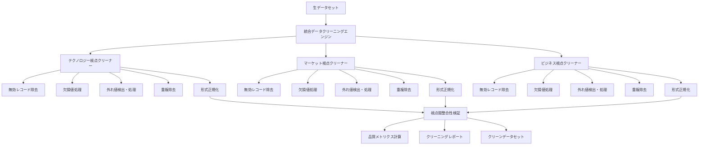

```typescript
// 概念実証コード 15-2-1-B: 適応的欠損値補完システム
class AdaptiveMissingValueImputer {
  private imputationStrategies: Map<string, ImputationStrategy>;
  private patternAnalyzer: MissingPatternAnalyzer;
  private qualityAssessor: ImputationQualityAssessor;
  
  constructor() {
    this.imputationStrategies = new Map([
      ['mean', new MeanImputation()],
      ['median', new MedianImputation()],
      ['mode', new ModeImputation()],
      ['knn', new KNNImputation()],
      ['regression', new RegressionImputation()],
      ['ml', new MLBasedImputation()]
    ]);
    this.patternAnalyzer = new MissingPatternAnalyzer();
    this.qualityAssessor = new ImputationQualityAssessor();
  }
  
  async imputeMissingValues(data: DataWithMissing): Promise<ImputedDataResult> {
    // 欠損パターンの分析
    const missingPattern = await this.patternAnalyzer.analyze(data);
    
    // 最適な補完戦略の選択
    const strategies = await this.selectOptimalStrategies(data, missingPattern);
    
    // 列別補完の実行
    const imputedData = await this.executeImputation(data, strategies);
    
    // 補完品質の評価
    const qualityMetrics = await this.qualityAssessor.assess(data, imputedData);
    
    return {
      imputedData,
      strategies: strategies,
      qualityMetrics,
      missingPattern,
      confidence: this.calculateConfidence(qualityMetrics)
    };
  }
  
  private async selectOptimalStrategies(
    data: DataWithMissing,
    pattern: MissingPattern
  ): Promise<Map<string, ImputationStrategy>> {
    const strategies = new Map<string, ImputationStrategy>();
    
    for (const column of data.columns) {
      const columnData = data.getColumn(column);
      const columnPattern = pattern.getColumnPattern(column);
      
      // データ型と欠損パターンに基づく戦略選択
      const candidateStrategies = this.getCandidateStrategies(columnData.type, columnPattern);
      
      // 各戦略の性能評価
      const evaluations = await Promise.all(
        candidateStrategies.map(strategy => 
          this.evaluateStrategy(columnData, strategy)
        )
      );
      
      // 最高性能の戦略を選択
      const bestStrategy = candidateStrategies[
        evaluations.indexOf(Math.max(...evaluations))
      ];
      
      strategies.set(column, bestStrategy);
    }
    
    return strategies;
  }
}
```

```typescript
// 概念実証コード 15-2-1-C: 多次元外れ値検出システム
class MultidimensionalOutlierDetector {
  private detectionMethods: Map<string, OutlierDetectionMethod>;
  private ensembleVoting: EnsembleVoting;
  private contextAnalyzer: ContextAnalyzer;
  
  constructor() {
    this.detectionMethods = new Map([
      ['isolation_forest', new IsolationForestDetector()],
      ['local_outlier_factor', new LOFDetector()],
      ['one_class_svm', new OneClassSVMDetector()],
      ['statistical', new StatisticalOutlierDetector()],
      ['clustering', new ClusteringBasedDetector()]
    ]);
    this.ensembleVoting = new EnsembleVoting();
    this.contextAnalyzer = new ContextAnalyzer();
  }
  
  async detectOutliers(data: NumericDataset): Promise<OutlierDetectionResult> {
    // コンテキスト分析による検出パラメータの調整
    const context = await this.contextAnalyzer.analyze(data);
    
    // 複数手法による外れ値検出の並列実行
    const detectionResults = await Promise.all(
      Array.from(this.detectionMethods.entries()).map(([name, method]) =>
        this.executeDetection(name, method, data, context)
      )
    );
    
    // アンサンブル投票による最終判定
    const finalOutliers = await this.ensembleVoting.vote(detectionResults);
    
    // 外れ値の重要度スコア計算
    const outlierScores = await this.calculateOutlierScores(finalOutliers, detectionResults);
    
    return {
      outliers: finalOutliers,
      scores: outlierScores,
      methodResults: detectionResults,
      confidence: this.calculateEnsembleConfidence(detectionResults),
      recommendations: await this.generateRecommendations(finalOutliers, context)
    };
  }
  
  private async executeDetection(
    methodName: string,
    method: OutlierDetectionMethod,
    data: NumericDataset,
    context: DataContext
  ): Promise<MethodDetectionResult> {
    const parameters = await this.optimizeParameters(method, data, context);
    const outliers = await method.detect(data, parameters);
    const confidence = await method.calculateConfidence(data, outliers, parameters);
    
    return {
      methodName,
      outliers,
      confidence,
      parameters
    };
  }
}
```

#### データ正規化の戦略的アプローチ

データ正規化は、異なるスケールや単位を持つデータを統一された基準で比較可能にする重要なプロセスです。トリプルパースペクティブ型戦略AIレーダーでは、3視点間の公平な比較と統合分析を実現するため、高度な正規化戦略が必要です。

**スケール正規化**
- Min-Max正規化による0-1範囲への統一
- Z-score標準化による標準正規分布への変換
- Robust正規化による外れ値の影響軽減

**単位統一**
- 通貨単位の統一と為替レート適用
- 時間単位の標準化と時差調整
- 測定単位の国際標準への統一

**カテゴリカルデータの数値化**
- One-hot エンコーディングによる名義変数の変換
- Label エンコーディングによる順序変数の処理
- Target エンコーディングによる高カーディナリティ変数の最適化

この包括的なデータクリーニングと正規化アプローチにより、トリプルパースペクティブ型戦略AIレーダーは高品質なデータ基盤を確保し、信頼性の高い戦略的洞察を提供します。

### 15.2.2 スキーマ統一と標準化

多様なデータソースから収集されるデータは、それぞれ異なるスキーマ、命名規則、データ型を持っています。トリプルパースペクティブ型戦略AIレーダーの効果的な運用には、これらの異質なデータを統一されたスキーマの下で統合し、一貫性のある分析基盤を構築することが不可欠です。本セクションでは、動的スキーママッピング、自動型変換、メタデータ管理の実装手法を詳述します。

#### スキーマ統一の戦略的価値

**分析効率の向上**
- 統一されたデータモデルによる分析処理の簡素化
- 視点間比較の容易性確保
- 分析ツールとの互換性向上

**データガバナンスの強化**
- 一貫したデータ定義による組織内理解の統一
- データ品質管理の標準化
- 監査とコンプライアンス要件への対応

**システム拡張性の確保**
- 新しいデータソース追加時の影響最小化
- 既存分析ロジックの再利用性向上
- 将来的な要件変更への柔軟な対応

#### 動的スキーママッピングシステム

従来の静的スキーママッピングでは、新しいデータソースの追加や既存ソースの変更に対して手動での設定変更が必要でした。動的スキーママッピングシステムは、機械学習とルールベースアプローチを組み合わせて、自動的にスキーマの対応関係を発見し、適応的にマッピングを更新します。

```typescript
// 概念実証コード 15-2-2-A: 動的スキーママッピングエンジン
class DynamicSchemaMappingEngine {
  private schemaRegistry: SchemaRegistry;
  private mappingLearner: MappingLearner;
  private conflictResolver: ConflictResolver;
  private validationEngine: ValidationEngine;
  
  constructor() {
    this.schemaRegistry = new SchemaRegistry();
    this.mappingLearner = new MappingLearner();
    this.conflictResolver = new ConflictResolver();
    this.validationEngine = new ValidationEngine();
  }
  
  async createMapping(
    sourceSchema: Schema,
    targetSchema: Schema,
    sampleData?: any[]
  ): Promise<SchemaMapping> {
    // 既存マッピングの検索
    const existingMapping = await this.schemaRegistry.findSimilarMapping(sourceSchema);
    
    if (existingMapping && existingMapping.confidence > 0.8) {
      return await this.adaptExistingMapping(existingMapping, sourceSchema, targetSchema);
    }
    
    // 新規マッピングの学習
    const learnedMapping = await this.mappingLearner.learn(
      sourceSchema,
      targetSchema,
      sampleData
    );
    
    // マッピング競合の解決
    const resolvedMapping = await this.conflictResolver.resolve(learnedMapping);
    
    // マッピングの検証
    const validatedMapping = await this.validationEngine.validate(
      resolvedMapping,
      sampleData
    );
    
    // スキーマレジストリへの登録
    await this.schemaRegistry.register(validatedMapping);
    
    return validatedMapping;
  }
  
  async applyMapping(data: any[], mapping: SchemaMapping): Promise<MappedData[]> {
    const mappedData: MappedData[] = [];
    
    for (const record of data) {
      try {
        const mappedRecord = await this.mapRecord(record, mapping);
        mappedData.push(mappedRecord);
      } catch (error) {
        await this.handleMappingError(record, mapping, error);
      }
    }
    
    return mappedData;
  }
  
  private async mapRecord(record: any, mapping: SchemaMapping): Promise<MappedData> {
    const mappedRecord: any = {};
    
    for (const fieldMapping of mapping.fieldMappings) {
      const sourceValue = this.extractValue(record, fieldMapping.sourcePath);
      
      if (sourceValue !== undefined) {
        const transformedValue = await this.applyTransformation(
          sourceValue,
          fieldMapping.transformation
        );
        
        this.setValue(mappedRecord, fieldMapping.targetPath, transformedValue);
      }
    }
    
    return {
      data: mappedRecord,
      metadata: {
        sourceSchema: mapping.sourceSchema.id,
        targetSchema: mapping.targetSchema.id,
        mappingVersion: mapping.version,
        timestamp: new Date()
      }
    };
  }
}
```

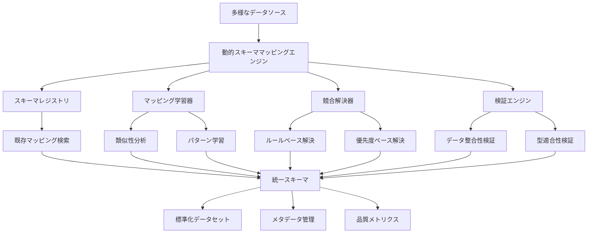

```typescript
// 概念実証コード 15-2-2-B: 自動型変換システム
class AutomaticTypeConversionSystem {
  private typeInferrer: TypeInferrer;
  private conversionRules: Map<string, ConversionRule>;
  private safetyValidator: SafetyValidator;
  private performanceOptimizer: PerformanceOptimizer;
  
  constructor() {
    this.typeInferrer = new TypeInferrer();
    this.conversionRules = this.initializeConversionRules();
    this.safetyValidator = new SafetyValidator();
    this.performanceOptimizer = new PerformanceOptimizer();
  }
  
  async convertTypes(
    data: any[],
    sourceTypes: TypeDefinition[],
    targetTypes: TypeDefinition[]
  ): Promise<TypeConversionResult> {
    // 型変換計画の作成
    const conversionPlan = await this.createConversionPlan(sourceTypes, targetTypes);
    
    // 安全性検証
    const safetyCheck = await this.safetyValidator.validate(conversionPlan, data);
    if (!safetyCheck.isSafe) {
      throw new Error(`Unsafe type conversion: ${safetyCheck.risks.join(', ')}`);
    }
    
    // パフォーマンス最適化
    const optimizedPlan = await this.performanceOptimizer.optimize(conversionPlan, data);
    
    // 型変換の実行
    const convertedData = await this.executeConversion(data, optimizedPlan);
    
    return {
      convertedData,
      conversionPlan: optimizedPlan,
      statistics: await this.calculateStatistics(data, convertedData),
      warnings: safetyCheck.warnings
    };
  }
  
  private async createConversionPlan(
    sourceTypes: TypeDefinition[],
    targetTypes: TypeDefinition[]
  ): Promise<ConversionPlan> {
    const conversions: FieldConversion[] = [];
    
    for (let i = 0; i < sourceTypes.length; i++) {
      const sourceType = sourceTypes[i];
      const targetType = targetTypes[i];
      
      if (sourceType.type !== targetType.type) {
        const conversionRule = this.findConversionRule(sourceType.type, targetType.type);
        
        if (!conversionRule) {
          throw new Error(
            `No conversion rule found: ${sourceType.type} -> ${targetType.type}`
          );
        }
        
        conversions.push({
          fieldIndex: i,
          sourceType,
          targetType,
          rule: conversionRule,
          complexity: conversionRule.complexity
        });
      }
    }
    
    return {
      conversions,
      totalComplexity: conversions.reduce((sum, conv) => sum + conv.complexity, 0),
      estimatedTime: this.estimateConversionTime(conversions)
    };
  }
  
  private async executeConversion(
    data: any[],
    plan: ConversionPlan
  ): Promise<any[]> {
    const convertedData = data.map(record => ({ ...record }));
    
    for (const conversion of plan.conversions) {
      for (let i = 0; i < convertedData.length; i++) {
        const value = convertedData[i][conversion.fieldIndex];
        
        try {
          convertedData[i][conversion.fieldIndex] = await conversion.rule.convert(
            value,
            conversion.sourceType,
            conversion.targetType
          );
        } catch (error) {
          await this.handleConversionError(i, conversion, value, error);
        }
      }
    }
    
    return convertedData;
  }
}
```

```typescript
// 概念実証コード 15-2-2-C: メタデータ管理システム
class MetadataManagementSystem {
  private metadataStore: MetadataStore;
  private lineageTracker: LineageTracker;
  private versionManager: VersionManager;
  private searchEngine: MetadataSearchEngine;
  
  constructor() {
    this.metadataStore = new MetadataStore();
    this.lineageTracker = new LineageTracker();
    this.versionManager = new VersionManager();
    this.searchEngine = new MetadataSearchEngine();
  }
  
  async registerDataset(
    dataset: Dataset,
    metadata: DatasetMetadata
  ): Promise<RegisteredDataset> {
    // メタデータの検証と拡張
    const enrichedMetadata = await this.enrichMetadata(dataset, metadata);
    
    // バージョン管理
    const versionedMetadata = await this.versionManager.createVersion(enrichedMetadata);
    
    // データ系譜の記録
    await this.lineageTracker.recordLineage(dataset, versionedMetadata);
    
    // メタデータストアへの保存
    const registeredDataset = await this.metadataStore.store(dataset, versionedMetadata);
    
    // 検索インデックスの更新
    await this.searchEngine.index(registeredDataset);
    
    return registeredDataset;
  }
  
  private async enrichMetadata(
    dataset: Dataset,
    metadata: DatasetMetadata
  ): Promise<EnrichedMetadata> {
    // 自動メタデータ抽出
    const autoExtracted = await this.extractAutomaticMetadata(dataset);
    
    // データプロファイリング
    const profile = await this.profileData(dataset);
    
    // 品質メトリクス計算
    const qualityMetrics = await this.calculateQualityMetrics(dataset);
    
    // 統計情報の生成
    const statistics = await this.generateStatistics(dataset);
    
    return {
      ...metadata,
      automatic: autoExtracted,
      profile,
      quality: qualityMetrics,
      statistics,
      enrichmentTimestamp: new Date()
    };
  }
  
  async searchDatasets(query: MetadataQuery): Promise<SearchResult[]> {
    // 検索クエリの解析
    const parsedQuery = await this.searchEngine.parseQuery(query);
    
    // 検索実行
    const searchResults = await this.searchEngine.search(parsedQuery);
    
    // 結果のランキング
    const rankedResults = await this.rankResults(searchResults, query);
    
    // メタデータの取得
    const enrichedResults = await Promise.all(
      rankedResults.map(result => this.enrichSearchResult(result))
    );
    
    return enrichedResults;
  }
  
  async trackDataLineage(datasetId: string): Promise<DataLineage> {
    return await this.lineageTracker.getLineage(datasetId);
  }
}
```

#### 標準化フレームワークの実装

スキーマ統一と標準化は、組織全体のデータガバナンスの基盤となります。一貫した標準化フレームワークにより、データの発見可能性、理解可能性、再利用可能性が大幅に向上し、組織のデータ資産価値が最大化されます。

**命名規則の統一**
- 一貫したフィールド命名規則の適用
- ビジネス用語集との連携
- 多言語対応とローカライゼーション

**データ型の標準化**
- 共通データ型ライブラリの構築
- 精度と範囲の統一
- 特殊データ型の標準化

**参照データの管理**
- マスターデータの一元管理
- 参照整合性の確保
- 変更管理プロセスの確立

この包括的なスキーマ統一と標準化アプローチにより、トリプルパースペクティブ型戦略AIレーダーは、多様なデータソースを効率的に統合し、一貫性のある高品質な分析基盤を提供します。

### 15.2.3 データ変換とエンリッチメント

収集・クリーニング・標準化されたデータを、トリプルパースペクティブ型戦略AIレーダーの3軸評価（重要度・確信度・整合性）に最適化された形式に変換し、外部データソースとの統合により価値を拡張するプロセスが、データ変換とエンリッチメントです。本セクションでは、戦略的洞察の抽出を最大化するデータ変換手法と、AIによる自動エンリッチメント機能の実装を詳述します。

#### データ変換の戦略的意義

**分析価値の最大化**
- 生データから戦略的洞察を抽出可能な形式への変換
- 3視点統合分析に最適化されたデータ構造の構築
- 機械学習アルゴリズムとの親和性向上

**意思決定支援の強化**
- 重要度・確信度・整合性の3軸での評価を可能にするデータ形式
- 時系列分析による傾向把握とパターン発見
- 多次元分析による包括的な戦略評価

**組織学習の促進**
- 過去の意思決定結果との関連付け
- 成功・失敗パターンの体系化
- 継続的改善のためのフィードバックループ構築

#### 3軸評価最適化データ変換

トリプルパースペクティブ型戦略AIレーダーの核心である3軸評価を効果的に実行するため、収集されたデータを重要度・確信度・整合性の観点から評価可能な形式に変換します。

```typescript
// 概念実証コード 15-2-3-A: 3軸評価最適化変換エンジン
class TripleAxisOptimizedTransformationEngine {
  private importanceCalculator: ImportanceCalculator;
  private confidenceAssessor: ConfidenceAssessor;
  private consistencyAnalyzer: ConsistencyAnalyzer;
  private transformationRules: TransformationRuleEngine;
  
  constructor() {
    this.importanceCalculator = new ImportanceCalculator();
    this.confidenceAssessor = new ConfidenceAssessor();
    this.consistencyAnalyzer = new ConsistencyAnalyzer();
    this.transformationRules = new TransformationRuleEngine();
  }
  
  async transformForTripleAxisEvaluation(
    dataset: StandardizedDataset
  ): Promise<TripleAxisOptimizedDataset> {
    // 重要度軸の計算
    const importanceMetrics = await this.calculateImportanceMetrics(dataset);
    
    // 確信度軸の評価
    const confidenceMetrics = await this.assessConfidenceMetrics(dataset);
    
    // 整合性軸の分析
    const consistencyMetrics = await this.analyzeConsistencyMetrics(dataset);
    
    // 統合変換の実行
    const transformedData = await this.executeIntegratedTransformation(
      dataset,
      importanceMetrics,
      confidenceMetrics,
      consistencyMetrics
    );
    
    return {
      data: transformedData,
      axisMetrics: {
        importance: importanceMetrics,
        confidence: confidenceMetrics,
        consistency: consistencyMetrics
      },
      transformationMetadata: await this.generateTransformationMetadata(dataset, transformedData),
      qualityAssessment: await this.assessTransformationQuality(dataset, transformedData)
    };
  }
  
  private async calculateImportanceMetrics(dataset: StandardizedDataset): Promise<ImportanceMetrics> {
    const metrics: ImportanceMetrics = {
      businessImpact: await this.importanceCalculator.calculateBusinessImpact(dataset),
      strategicRelevance: await this.importanceCalculator.calculateStrategicRelevance(dataset),
      urgency: await this.importanceCalculator.calculateUrgency(dataset),
      stakeholderInfluence: await this.importanceCalculator.calculateStakeholderInfluence(dataset),
      resourceRequirement: await this.importanceCalculator.calculateResourceRequirement(dataset)
    };
    
    // 重要度の正規化と重み付け
    metrics.normalizedScore = await this.importanceCalculator.normalize(metrics);
    metrics.weightedScore = await this.importanceCalculator.applyWeights(metrics);
    
    return metrics;
  }
  
  private async assessConfidenceMetrics(dataset: StandardizedDataset): Promise<ConfidenceMetrics> {
    const metrics: ConfidenceMetrics = {
      dataQuality: await this.confidenceAssessor.assessDataQuality(dataset),
      sourceReliability: await this.confidenceAssessor.assessSourceReliability(dataset),
      methodologyRobustness: await this.confidenceAssessor.assessMethodology(dataset),
      historicalAccuracy: await this.confidenceAssessor.assessHistoricalAccuracy(dataset),
      expertValidation: await this.confidenceAssessor.assessExpertValidation(dataset)
    };
    
    // 確信度の統合計算
    metrics.overallConfidence = await this.confidenceAssessor.calculateOverallConfidence(metrics);
    metrics.uncertaintyRange = await this.confidenceAssessor.calculateUncertaintyRange(metrics);
    
    return metrics;
  }
  
  private async analyzeConsistencyMetrics(dataset: StandardizedDataset): Promise<ConsistencyMetrics> {
    const metrics: ConsistencyMetrics = {
      internalConsistency: await this.consistencyAnalyzer.analyzeInternalConsistency(dataset),
      crossPerspectiveAlignment: await this.consistencyAnalyzer.analyzeCrossPerspectiveAlignment(dataset),
      temporalConsistency: await this.consistencyAnalyzer.analyzeTemporalConsistency(dataset),
      logicalCoherence: await this.consistencyAnalyzer.analyzeLogicalCoherence(dataset),
      stakeholderAlignment: await this.consistencyAnalyzer.analyzeStakeholderAlignment(dataset)
    };
    
    // 整合性スコアの計算
    metrics.overallConsistency = await this.consistencyAnalyzer.calculateOverallConsistency(metrics);
    metrics.inconsistencyFlags = await this.consistencyAnalyzer.identifyInconsistencies(metrics);
    
    return metrics;
  }
}
```

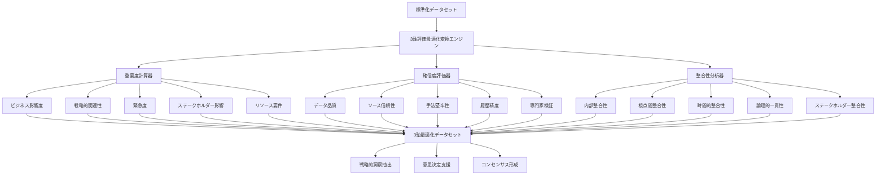

```typescript
// 概念実証コード 15-2-3-B: AI駆動エンリッチメントシステム
class AIEnrichmentSystem {
  private externalDataConnectors: Map<string, ExternalDataConnector>;
  private enrichmentModels: Map<string, EnrichmentModel>;
  private contextAnalyzer: ContextAnalyzer;
  private qualityValidator: QualityValidator;
  
  constructor() {
    this.externalDataConnectors = new Map([
      ['market_data', new MarketDataConnector()],
      ['economic_indicators', new EconomicIndicatorConnector()],
      ['industry_reports', new IndustryReportConnector()],
      ['news_sentiment', new NewsSentimentConnector()],
      ['social_media', new SocialMediaConnector()]
    ]);
    this.enrichmentModels = new Map([
      ['sentiment_analysis', new SentimentAnalysisModel()],
      ['trend_prediction', new TrendPredictionModel()],
      ['risk_assessment', new RiskAssessmentModel()],
      ['opportunity_detection', new OpportunityDetectionModel()]
    ]);
    this.contextAnalyzer = new ContextAnalyzer();
    this.qualityValidator = new QualityValidator();
  }
  
  async enrichDataset(
    dataset: TripleAxisOptimizedDataset,
    enrichmentConfig: EnrichmentConfig
  ): Promise<EnrichedDataset> {
    // コンテキスト分析
    const context = await this.contextAnalyzer.analyze(dataset);
    
    // 外部データの取得
    const externalData = await this.fetchExternalData(dataset, context, enrichmentConfig);
    
    // AI モデルによる拡張
    const aiEnrichments = await this.applyAIEnrichments(dataset, externalData, context);
    
    // 品質検証
    const validatedEnrichments = await this.qualityValidator.validate(aiEnrichments);
    
    // データセットの統合
    const enrichedDataset = await this.integrateEnrichments(
      dataset,
      validatedEnrichments
    );
    
    return {
      ...enrichedDataset,
      enrichmentMetadata: {
        sources: Array.from(this.externalDataConnectors.keys()),
        models: Array.from(this.enrichmentModels.keys()),
        context,
        timestamp: new Date(),
        qualityScore: await this.calculateEnrichmentQuality(enrichedDataset)
      }
    };
  }
  
  private async fetchExternalData(
    dataset: TripleAxisOptimizedDataset,
    context: DataContext,
    config: EnrichmentConfig
  ): Promise<ExternalDataCollection> {
    const externalData: ExternalDataCollection = {};
    
    for (const [sourceName, connector] of this.externalDataConnectors) {
      if (config.enabledSources.includes(sourceName)) {
        try {
          const data = await connector.fetch(dataset, context);
          externalData[sourceName] = data;
        } catch (error) {
          await this.handleExternalDataError(sourceName, error);
        }
      }
    }
    
    return externalData;
  }
  
  private async applyAIEnrichments(
    dataset: TripleAxisOptimizedDataset,
    externalData: ExternalDataCollection,
    context: DataContext
  ): Promise<AIEnrichmentResults> {
    const enrichments: AIEnrichmentResults = {};
    
    for (const [modelName, model] of this.enrichmentModels) {
      try {
        const enrichment = await model.enrich(dataset, externalData, context);
        enrichments[modelName] = enrichment;
      } catch (error) {
        await this.handleModelError(modelName, error);
      }
    }
    
    return enrichments;
  }
}
```

```typescript
// 概念実証コード 15-2-3-C: 時系列特徴抽出エンジン
class TimeSeriesFeatureExtractionEngine {
  private trendAnalyzer: TrendAnalyzer;
  private seasonalityDetector: SeasonalityDetector;
  private anomalyDetector: AnomalyDetector;
  private patternMatcher: PatternMatcher;
  
  constructor() {
    this.trendAnalyzer = new TrendAnalyzer();
    this.seasonalityDetector = new SeasonalityDetector();
    this.anomalyDetector = new AnomalyDetector();
    this.patternMatcher = new PatternMatcher();
  }
  
  async extractTimeSeriesFeatures(
    timeSeriesData: TimeSeriesDataset
  ): Promise<TimeSeriesFeatures> {
    // トレンド分析
    const trendFeatures = await this.trendAnalyzer.analyze(timeSeriesData);
    
    // 季節性検出
    const seasonalFeatures = await this.seasonalityDetector.detect(timeSeriesData);
    
    // 異常検知
    const anomalyFeatures = await this.anomalyDetector.detect(timeSeriesData);
    
    // パターンマッチング
    const patternFeatures = await this.patternMatcher.match(timeSeriesData);
    
    // 統計的特徴量の計算
    const statisticalFeatures = await this.calculateStatisticalFeatures(timeSeriesData);
    
    return {
      trend: trendFeatures,
      seasonality: seasonalFeatures,
      anomalies: anomalyFeatures,
      patterns: patternFeatures,
      statistical: statisticalFeatures,
      metadata: {
        extractionTimestamp: new Date(),
        dataRange: {
          start: timeSeriesData.startDate,
          end: timeSeriesData.endDate
        },
        quality: await this.assessFeatureQuality(timeSeriesData)
      }
    };
  }
  
  private async calculateStatisticalFeatures(
    data: TimeSeriesDataset
  ): Promise<StatisticalFeatures> {
    return {
      mean: this.calculateMean(data.values),
      median: this.calculateMedian(data.values),
      standardDeviation: this.calculateStandardDeviation(data.values),
      variance: this.calculateVariance(data.values),
      skewness: this.calculateSkewness(data.values),
      kurtosis: this.calculateKurtosis(data.values),
      autocorrelation: await this.calculateAutocorrelation(data.values),
      stationarity: await this.testStationarity(data.values),
      volatility: this.calculateVolatility(data.values)
    };
  }
}
```

#### エンリッチメントの戦略的活用

データエンリッチメントは、内部データだけでは得られない外部環境の変化や市場動向を統合し、より包括的で精度の高い戦略的洞察を提供します。

**市場インテリジェンスの統合**
- 競合他社の動向と戦略変更の検出
- 業界トレンドと規制変更の影響分析
- 顧客行動パターンの変化予測

**リスク要因の早期発見**
- 外部環境変化による潜在的リスクの特定
- サプライチェーン disruption の予兆検出
- 技術的陳腐化リスクの評価

**機会の発見と評価**
- 新市場機会の自動検出
- 技術革新による事業機会の評価
- パートナーシップ機会の特定

この包括的なデータ変換とエンリッチメントアプローチにより、トリプルパースペクティブ型戦略AIレーダーは、生データから戦略的価値を最大限に抽出し、組織の意思決定プロセスを大幅に強化します。

### 15.2.4 リアルタイム処理パイプライン

現代のビジネス環境では、市場の変化や競合の動向が急速に変化するため、戦略的意思決定においてリアルタイム性が重要な競争優位性となります。トリプルパースペクティブ型戦略AIレーダーの真の価値を発揮するため、本セクションでは、データ収集から3軸評価まで一貫したリアルタイム処理パイプラインの設計と実装を詳述します。

#### リアルタイム処理の戦略的重要性

**競争優位性の確保**
- 市場変化への即座の対応による先行者利益の獲得
- 競合動向の早期検知による戦略的対応の実現
- 顧客ニーズの変化に対する迅速な適応

**リスク管理の強化**
- 潜在的リスクの早期警告システム
- 異常事態への自動対応機能
- 損失最小化のための予防的措置

**意思決定の質向上**
- 最新情報に基づく正確な判断
- 時間的制約下での効率的な意思決定
- 継続的な戦略調整による最適化

#### ストリーミングアーキテクチャの設計

リアルタイム処理パイプラインは、高スループット、低レイテンシ、高可用性を同時に実現する必要があります。Apache Kafka、Apache Flink、Redis Streamsなどの技術を組み合わせた分散ストリーミングアーキテクチャを構築します。

```typescript
// 概念実証コード 15-2-4-A: リアルタイム処理パイプライン
class RealTimeProcessingPipeline {
  private streamProcessor: StreamProcessor;
  private eventRouter: EventRouter;
  private stateManager: StateManager;
  private alertManager: AlertManager;
  
  constructor() {
    this.streamProcessor = new StreamProcessor();
    this.eventRouter = new EventRouter();
    this.stateManager = new StateManager();
    this.alertManager = new AlertManager();
  }
  
  async initializePipeline(config: PipelineConfig): Promise<void> {
    // ストリーム処理エンジンの初期化
    await this.streamProcessor.initialize(config.streamConfig);
    
    // イベントルーティングの設定
    await this.eventRouter.configure(config.routingRules);
    
    // 状態管理の初期化
    await this.stateManager.initialize(config.stateConfig);
    
    // アラート管理の設定
    await this.alertManager.configure(config.alertConfig);
    
    // パイプラインの開始
    await this.startPipeline();
  }
  
  private async startPipeline(): Promise<void> {
    // データ収集ストリームの開始
    this.streamProcessor.createStream('data-collection')
      .map(this.preprocessData.bind(this))
      .filter(this.validateData.bind(this))
      .branch(this.routeByPerspective.bind(this))
      .forEach(this.processTripleAxisEvaluation.bind(this));
    
    // 異常検知ストリームの開始
    this.streamProcessor.createStream('anomaly-detection')
      .window(TimeWindows.of(Duration.ofMinutes(5)))
      .aggregate(this.detectAnomalies.bind(this))
      .filter(anomaly => anomaly.severity > 0.7)
      .forEach(this.handleAnomaly.bind(this));
    
    // アラートストリームの開始
    this.streamProcessor.createStream('alerts')
      .groupByKey()
      .suppress(Suppressed.untilWindowCloses(Suppressed.BufferConfig.unbounded()))
      .forEach(this.sendAlert.bind(this));
  }
  
  private async processTripleAxisEvaluation(
    event: ProcessingEvent
  ): Promise<TripleAxisResult> {
    const startTime = Date.now();
    
    try {
      // 並列3軸評価の実行
      const [importance, confidence, consistency] = await Promise.all([
        this.evaluateImportance(event),
        this.evaluateConfidence(event),
        this.evaluateConsistency(event)
      ]);
      
      // 結果の統合
      const result: TripleAxisResult = {
        eventId: event.id,
        timestamp: new Date(),
        importance,
        confidence,
        consistency,
        overallScore: this.calculateOverallScore(importance, confidence, consistency),
        processingTime: Date.now() - startTime
      };
      
      // 状態の更新
      await this.stateManager.updateState(event.id, result);
      
      // 下流システムへの通知
      await this.notifyDownstream(result);
      
      return result;
    } catch (error) {
      await this.handleProcessingError(event, error);
      throw error;
    }
  }
  
  private async evaluateImportance(event: ProcessingEvent): Promise<ImportanceScore> {
    // ビジネス影響度の評価
    const businessImpact = await this.calculateBusinessImpact(event);
    
    // 戦略的重要度の評価
    const strategicImportance = await this.calculateStrategicImportance(event);
    
    // 緊急度の評価
    const urgency = await this.calculateUrgency(event);
    
    return {
      businessImpact,
      strategicImportance,
      urgency,
      overallImportance: (businessImpact + strategicImportance + urgency) / 3,
      confidence: await this.calculateImportanceConfidence(event)
    };
  }
}
```

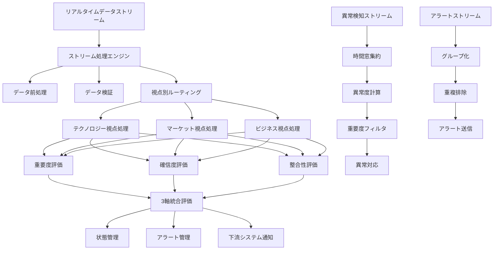

```typescript
// 概念実証コード 15-2-4-B: 適応的ウィンドウ管理システム
class AdaptiveWindowManager {
  private windowStrategies: Map<string, WindowStrategy>;
  private performanceMonitor: PerformanceMonitor;
  private adaptationEngine: AdaptationEngine;
  
  constructor() {
    this.windowStrategies = new Map([
      ['tumbling', new TumblingWindowStrategy()],
      ['sliding', new SlidingWindowStrategy()],
      ['session', new SessionWindowStrategy()],
      ['adaptive', new AdaptiveWindowStrategy()]
    ]);
    this.performanceMonitor = new PerformanceMonitor();
    this.adaptationEngine = new AdaptationEngine();
  }
  
  async createOptimalWindow(
    streamName: string,
    dataCharacteristics: DataCharacteristics
  ): Promise<OptimalWindow> {
    // データ特性の分析
    const analysis = await this.analyzeDataCharacteristics(dataCharacteristics);
    
    // 最適ウィンドウ戦略の選択
    const strategy = await this.selectOptimalStrategy(analysis);
    
    // ウィンドウパラメータの最適化
    const parameters = await this.optimizeParameters(strategy, analysis);
    
    // ウィンドウの作成
    const window = await strategy.createWindow(parameters);
    
    // パフォーマンス監視の開始
    await this.performanceMonitor.startMonitoring(streamName, window);
    
    return {
      window,
      strategy: strategy.name,
      parameters,
      expectedPerformance: await this.predictPerformance(window, analysis)
    };
  }
  
  async adaptWindow(
    streamName: string,
    currentWindow: OptimalWindow,
    performanceMetrics: PerformanceMetrics
  ): Promise<OptimalWindow> {
    // 適応の必要性を評価
    const adaptationNeed = await this.adaptationEngine.assessAdaptationNeed(
      currentWindow,
      performanceMetrics
    );
    
    if (adaptationNeed.score < 0.3) {
      return currentWindow; // 適応不要
    }
    
    // 新しいウィンドウ設定の提案
    const proposedAdaptation = await this.adaptationEngine.proposeAdaptation(
      currentWindow,
      performanceMetrics,
      adaptationNeed
    );
    
    // 適応の実行
    const adaptedWindow = await this.executeAdaptation(
      streamName,
      currentWindow,
      proposedAdaptation
    );
    
    return adaptedWindow;
  }
  
  private async executeAdaptation(
    streamName: string,
    currentWindow: OptimalWindow,
    adaptation: WindowAdaptation
  ): Promise<OptimalWindow> {
    // グレースフル移行の実行
    await this.performGracefulTransition(streamName, currentWindow, adaptation);
    
    // 新しいウィンドウの作成
    const newWindow = await adaptation.strategy.createWindow(adaptation.parameters);
    
    // 監視の更新
    await this.performanceMonitor.updateMonitoring(streamName, newWindow);
    
    return {
      window: newWindow,
      strategy: adaptation.strategy.name,
      parameters: adaptation.parameters,
      adaptationHistory: [...currentWindow.adaptationHistory || [], {
        timestamp: new Date(),
        reason: adaptation.reason,
        previousParameters: currentWindow.parameters,
        newParameters: adaptation.parameters
      }]
    };
  }
}
```

```typescript
// 概念実証コード 15-2-4-C: 分散状態管理システム
class DistributedStateManager {
  private stateStores: Map<string, StateStore>;
  private consistencyManager: ConsistencyManager;
  private replicationManager: ReplicationManager;
  private recoveryManager: RecoveryManager;
  
  constructor() {
    this.stateStores = new Map();
    this.consistencyManager = new ConsistencyManager();
    this.replicationManager = new ReplicationManager();
    this.recoveryManager = new RecoveryManager();
  }
  
  async createStateStore(
    name: string,
    config: StateStoreConfig
  ): Promise<StateStore> {
    // 状態ストアの作成
    const stateStore = new StateStore(name, config);
    
    // レプリケーションの設定
    await this.replicationManager.setupReplication(stateStore, config.replication);
    
    // 一貫性管理の設定
    await this.consistencyManager.setupConsistency(stateStore, config.consistency);
    
    // 復旧管理の設定
    await this.recoveryManager.setupRecovery(stateStore, config.recovery);
    
    this.stateStores.set(name, stateStore);
    
    return stateStore;
  }
  
  async updateState(
    storeName: string,
    key: string,
    value: any,
    options?: UpdateOptions
  ): Promise<UpdateResult> {
    const store = this.stateStores.get(storeName);
    if (!store) {
      throw new Error(`State store not found: ${storeName}`);
    }
    
    // 一貫性レベルの確認
    const consistencyLevel = options?.consistencyLevel || 'eventual';
    
    // 更新の実行
    const updateResult = await store.update(key, value, {
      timestamp: new Date(),
      consistencyLevel,
      replicationFactor: options?.replicationFactor || 3
    });
    
    // レプリケーションの実行
    if (options?.replicate !== false) {
      await this.replicationManager.replicate(storeName, key, value, updateResult);
    }
    
    // 一貫性の確保
    if (consistencyLevel === 'strong') {
      await this.consistencyManager.ensureConsistency(storeName, key, updateResult);
    }
    
    return updateResult;
  }
  
  async getState(
    storeName: string,
    key: string,
    options?: GetOptions
  ): Promise<StateValue> {
    const store = this.stateStores.get(storeName);
    if (!store) {
      throw new Error(`State store not found: ${storeName}`);
    }
    
    // 読み取り一貫性の確認
    const consistencyLevel = options?.consistencyLevel || 'eventual';
    
    if (consistencyLevel === 'strong') {
      // 強一貫性読み取り
      return await this.consistencyManager.readWithStrongConsistency(storeName, key);
    } else {
      // 結果整合性読み取り
      return await store.get(key);
    }
  }
  
  async handlePartition(partitionInfo: PartitionInfo): Promise<void> {
    // パーティション検出
    const affectedStores = await this.identifyAffectedStores(partitionInfo);
    
    // 各ストアの対応
    for (const storeName of affectedStores) {
      const store = this.stateStores.get(storeName);
      if (store) {
        await this.handleStorePartition(store, partitionInfo);
      }
    }
  }
  
  private async handleStorePartition(
    store: StateStore,
    partitionInfo: PartitionInfo
  ): Promise<void> {
    // パーティション耐性戦略の適用
    const strategy = await this.determinePartitionStrategy(store, partitionInfo);
    
    switch (strategy) {
      case 'availability':
        await this.prioritizeAvailability(store, partitionInfo);
        break;
      case 'consistency':
        await this.prioritizeConsistency(store, partitionInfo);
        break;
      case 'partition_tolerance':
        await this.prioritizePartitionTolerance(store, partitionInfo);
        break;
    }
  }
}
```

#### リアルタイム処理の最適化戦略

**レイテンシ最小化**
- インメモリ処理による高速化
- 並列処理による処理時間短縮
- 予測的プリロードによる応答時間改善

**スループット最大化**
- バッチ処理との適切な組み合わせ
- 負荷分散による処理能力向上
- リソース使用率の最適化

**可用性確保**
- 冗長化による単一障害点の排除
- 自動フェイルオーバー機能
- グレースフルデグラデーション

**一貫性管理**
- 結果整合性による性能向上
- 強一貫性が必要な場面での適切な制御
- 競合状態の検出と解決

この包括的なリアルタイム処理パイプラインにより、トリプルパースペクティブ型戦略AIレーダーは、変化する環境に即座に適応し、組織の戦略的競争優位性を継続的に強化します。

---

## 15.3 データ品質管理

### 15.3.1 品質メトリクスと監視システム

トリプルパースペクティブ型戦略AIレーダーの分析精度と意思決定の信頼性は、入力データの品質に直接依存します。データ品質の継続的な監視と管理は、システムの価値を維持し、組織の戦略的競争優位性を確保するための重要な基盤です。本セクションでは、包括的な品質メトリクスの定義と、リアルタイム監視システムの実装について詳述します。

#### データ品質の戦略的重要性

**意思決定の信頼性確保**
- 高品質データによる正確な戦略的洞察の提供
- 品質問題による誤った判断の防止
- ステークホルダーからの信頼獲得と維持

**システム価値の最大化**
- 分析結果の精度向上による投資対効果の改善
- データ資産価値の継続的な向上
- 競合他社に対する情報優位性の確保

**リスク管理の強化**
- データ品質劣化による潜在的リスクの早期発見
- コンプライアンス要件への確実な対応
- 監査証跡の完全性確保

#### 多次元品質メトリクスフレームワーク

データ品質は単一の指標では測定できない多面的な概念です。トリプルパースペクティブ型戦略AIレーダーでは、完全性、正確性、一貫性、適時性、妥当性、一意性の6つの主要次元で品質を評価し、3視点統合分析に最適化された包括的な品質管理を実現します。

```typescript
// 概念実証コード 15-3-1-A: 多次元品質メトリクス計算エンジン
class MultidimensionalQualityMetricsEngine {
  private completenessAnalyzer: CompletenessAnalyzer;
  private accuracyValidator: AccuracyValidator;
  private consistencyChecker: ConsistencyChecker;
  private timelinessMonitor: TimelinessMonitor;
  private validityAssessor: ValidityAssessor;
  private uniquenessDetector: UniquenessDetector;
  
  constructor() {
    this.completenessAnalyzer = new CompletenessAnalyzer();
    this.accuracyValidator = new AccuracyValidator();
    this.consistencyChecker = new ConsistencyChecker();
    this.timelinessMonitor = new TimelinessMonitor();
    this.validityAssessor = new ValidityAssessor();
    this.uniquenessDetector = new UniquenessDetector();
  }
  
  async calculateQualityMetrics(
    dataset: Dataset,
    qualityRules: QualityRules
  ): Promise<QualityMetricsResult> {
    const startTime = Date.now();
    
    // 並列品質評価の実行
    const [
      completeness,
      accuracy,
      consistency,
      timeliness,
      validity,
      uniqueness
    ] = await Promise.all([
      this.assessCompleteness(dataset, qualityRules.completeness),
      this.validateAccuracy(dataset, qualityRules.accuracy),
      this.checkConsistency(dataset, qualityRules.consistency),
      this.monitorTimeliness(dataset, qualityRules.timeliness),
      this.assessValidity(dataset, qualityRules.validity),
      this.detectUniqueness(dataset, qualityRules.uniqueness)
    ]);
    
    // 総合品質スコアの計算
    const overallQuality = await this.calculateOverallQuality({
      completeness,
      accuracy,
      consistency,
      timeliness,
      validity,
      uniqueness
    });
    
    // 品質トレンドの分析
    const qualityTrend = await this.analyzeQualityTrend(dataset.id, overallQuality);
    
    return {
      dimensions: {
        completeness,
        accuracy,
        consistency,
        timeliness,
        validity,
        uniqueness
      },
      overallQuality,
      qualityTrend,
      recommendations: await this.generateQualityRecommendations(overallQuality),
      calculationTime: Date.now() - startTime,
      timestamp: new Date()
    };
  }
  
  private async assessCompleteness(
    dataset: Dataset,
    rules: CompletenessRules
  ): Promise<CompletenessMetrics> {
    // 必須フィールドの完全性評価
    const mandatoryFieldCompleteness = await this.completenessAnalyzer.assessMandatoryFields(
      dataset,
      rules.mandatoryFields
    );
    
    // レコード完全性の評価
    const recordCompleteness = await this.completenessAnalyzer.assessRecordCompleteness(
      dataset,
      rules.recordCompletenessThreshold
    );
    
    // 関連データの完全性評価
    const relationalCompleteness = await this.completenessAnalyzer.assessRelationalCompleteness(
      dataset,
      rules.relationalConstraints
    );
    
    return {
      mandatoryFieldScore: mandatoryFieldCompleteness.score,
      recordCompletenessScore: recordCompleteness.score,
      relationalCompletenessScore: relationalCompleteness.score,
      overallCompletenessScore: (
        mandatoryFieldCompleteness.score * 0.4 +
        recordCompleteness.score * 0.4 +
        relationalCompleteness.score * 0.2
      ),
      missingDataReport: {
        mandatoryFields: mandatoryFieldCompleteness.missingFields,
        incompleteRecords: recordCompleteness.incompleteRecords,
        brokenRelations: relationalCompleteness.brokenRelations
      }
    };
  }
  
  private async validateAccuracy(
    dataset: Dataset,
    rules: AccuracyRules
  ): Promise<AccuracyMetrics> {
    // 参照データとの照合
    const referenceValidation = await this.accuracyValidator.validateAgainstReference(
      dataset,
      rules.referenceDataSources
    );
    
    // ビジネスルールの検証
    const businessRuleValidation = await this.accuracyValidator.validateBusinessRules(
      dataset,
      rules.businessRules
    );
    
    // 統計的異常値の検出
    const statisticalValidation = await this.accuracyValidator.detectStatisticalAnomalies(
      dataset,
      rules.statisticalThresholds
    );
    
    return {
      referenceAccuracyScore: referenceValidation.accuracyScore,
      businessRuleComplianceScore: businessRuleValidation.complianceScore,
      statisticalValidityScore: statisticalValidation.validityScore,
      overallAccuracyScore: (
        referenceValidation.accuracyScore * 0.5 +
        businessRuleValidation.complianceScore * 0.3 +
        statisticalValidation.validityScore * 0.2
      ),
      accuracyIssues: {
        referenceConflicts: referenceValidation.conflicts,
        ruleViolations: businessRuleValidation.violations,
        statisticalAnomalies: statisticalValidation.anomalies
      }
    };
  }
}
```

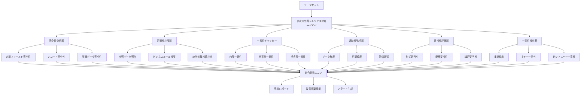

```typescript
// 概念実証コード 15-3-1-B: リアルタイム品質監視システム
class RealTimeQualityMonitoringSystem {
  private qualityStreams: Map<string, QualityStream>;
  private alertManager: AlertManager;
  private dashboardUpdater: DashboardUpdater;
  private trendAnalyzer: TrendAnalyzer;
  
  constructor() {
    this.qualityStreams = new Map();
    this.alertManager = new AlertManager();
    this.dashboardUpdater = new DashboardUpdater();
    this.trendAnalyzer = new TrendAnalyzer();
  }
  
  async initializeMonitoring(
    dataSource: DataSource,
    monitoringConfig: MonitoringConfig
  ): Promise<QualityMonitor> {
    // 品質ストリームの作成
    const qualityStream = await this.createQualityStream(dataSource, monitoringConfig);
    
    // 監視ルールの設定
    await this.configureMonitoringRules(qualityStream, monitoringConfig.rules);
    
    // アラート設定
    await this.setupAlerts(qualityStream, monitoringConfig.alerts);
    
    // ダッシュボード設定
    await this.setupDashboard(qualityStream, monitoringConfig.dashboard);
    
    this.qualityStreams.set(dataSource.id, qualityStream);
    
    return {
      streamId: qualityStream.id,
      dataSourceId: dataSource.id,
      status: 'active',
      startTime: new Date()
    };
  }
  
  private async createQualityStream(
    dataSource: DataSource,
    config: MonitoringConfig
  ): Promise<QualityStream> {
    const stream = new QualityStream(dataSource.id, config);
    
    // データ品質評価パイプラインの設定
    stream
      .map(this.extractQualityMetrics.bind(this))
      .filter(this.filterSignificantChanges.bind(this))
      .window(TimeWindows.of(Duration.ofMinutes(config.windowSizeMinutes)))
      .aggregate(this.aggregateQualityMetrics.bind(this))
      .forEach(this.processQualityUpdate.bind(this));
    
    return stream;
  }
  
  private async processQualityUpdate(qualityUpdate: QualityUpdate): Promise<void> {
    // 品質トレンドの更新
    await this.trendAnalyzer.updateTrend(qualityUpdate);
    
    // 閾値チェックとアラート生成
    const alerts = await this.checkThresholds(qualityUpdate);
    if (alerts.length > 0) {
      await this.alertManager.sendAlerts(alerts);
    }
    
    // ダッシュボードの更新
    await this.dashboardUpdater.updateQualityMetrics(qualityUpdate);
    
    // 自動修正の実行（必要に応じて）
    if (qualityUpdate.severity === 'critical') {
      await this.triggerAutomaticCorrection(qualityUpdate);
    }
  }
  
  async generateQualityReport(
    dataSourceId: string,
    reportPeriod: ReportPeriod
  ): Promise<QualityReport> {
    const qualityStream = this.qualityStreams.get(dataSourceId);
    if (!qualityStream) {
      throw new Error(`Quality stream not found for data source: ${dataSourceId}`);
    }
    
    // 期間内の品質データの取得
    const qualityData = await qualityStream.getQualityData(reportPeriod);
    
    // 品質トレンドの分析
    const trendAnalysis = await this.trendAnalyzer.analyzeTrend(qualityData);
    
    // 品質問題の分析
    const issueAnalysis = await this.analyzeQualityIssues(qualityData);
    
    // 改善推奨事項の生成
    const recommendations = await this.generateImprovementRecommendations(
      trendAnalysis,
      issueAnalysis
    );
    
    return {
      dataSourceId,
      reportPeriod,
      qualityOverview: {
        averageQualityScore: this.calculateAverageQuality(qualityData),
        qualityTrend: trendAnalysis.overallTrend,
        criticalIssuesCount: issueAnalysis.criticalIssues.length,
        improvementOpportunities: recommendations.length
      },
      detailedMetrics: qualityData,
      trendAnalysis,
      issueAnalysis,
      recommendations,
      generatedAt: new Date()
    };
  }
}
```

```typescript
// 概念実証コード 15-3-1-C: 適応的品質閾値管理システム
class AdaptiveQualityThresholdManager {
  private thresholdLearner: ThresholdLearner;
  private contextAnalyzer: ContextAnalyzer;
  private performanceEvaluator: PerformanceEvaluator;
  private thresholdOptimizer: ThresholdOptimizer;
  
  constructor() {
    this.thresholdLearner = new ThresholdLearner();
    this.contextAnalyzer = new ContextAnalyzer();
    this.performanceEvaluator = new PerformanceEvaluator();
    this.thresholdOptimizer = new ThresholdOptimizer();
  }
  
  async optimizeThresholds(
    dataSource: DataSource,
    historicalQualityData: QualityHistoryData,
    businessContext: BusinessContext
  ): Promise<OptimizedThresholds> {
    // コンテキスト分析
    const context = await this.contextAnalyzer.analyze(dataSource, businessContext);
    
    // 履歴データからのパターン学習
    const learnedPatterns = await this.thresholdLearner.learnFromHistory(
      historicalQualityData,
      context
    );
    
    // 現在の閾値性能の評価
    const currentPerformance = await this.performanceEvaluator.evaluate(
      dataSource.currentThresholds,
      historicalQualityData
    );
    
    // 閾値の最適化
    const optimizedThresholds = await this.thresholdOptimizer.optimize(
      learnedPatterns,
      currentPerformance,
      context
    );
    
    // 最適化結果の検証
    const validation = await this.validateOptimizedThresholds(
      optimizedThresholds,
      historicalQualityData
    );
    
    return {
      thresholds: optimizedThresholds,
      optimization: {
        improvementScore: validation.improvementScore,
        falsePositiveReduction: validation.falsePositiveReduction,
        falseNegativeReduction: validation.falseNegativeReduction,
        overallEffectiveness: validation.overallEffectiveness
      },
      context,
      validationResults: validation,
      optimizedAt: new Date()
    };
  }
  
  async adaptThresholdsToContext(
    currentThresholds: QualityThresholds,
    contextChange: ContextChange
  ): Promise<AdaptedThresholds> {
    // コンテキスト変化の影響分析
    const impactAnalysis = await this.contextAnalyzer.analyzeImpact(
      currentThresholds,
      contextChange
    );
    
    // 適応戦略の決定
    const adaptationStrategy = await this.determineAdaptationStrategy(
      impactAnalysis,
      contextChange
    );
    
    // 閾値の適応実行
    const adaptedThresholds = await this.executeAdaptation(
      currentThresholds,
      adaptationStrategy
    );
    
    return {
      adaptedThresholds,
      adaptationStrategy,
      impactAnalysis,
      confidence: await this.calculateAdaptationConfidence(adaptedThresholds, contextChange),
      adaptedAt: new Date()
    };
  }
  
  private async determineAdaptationStrategy(
    impactAnalysis: ImpactAnalysis,
    contextChange: ContextChange
  ): Promise<AdaptationStrategy> {
    const strategies: AdaptationStrategy[] = [];
    
    // データ量変化への対応
    if (contextChange.dataVolumeChange) {
      strategies.push(await this.createVolumeAdaptationStrategy(contextChange.dataVolumeChange));
    }
    
    // データ品質パターン変化への対応
    if (contextChange.qualityPatternChange) {
      strategies.push(await this.createPatternAdaptationStrategy(contextChange.qualityPatternChange));
    }
    
    // ビジネス要件変化への対応
    if (contextChange.businessRequirementChange) {
      strategies.push(await this.createBusinessAdaptationStrategy(contextChange.businessRequirementChange));
    }
    
    // 統合戦略の作成
    return await this.integrateAdaptationStrategies(strategies, impactAnalysis);
  }
}
```

#### 品質監視の自動化と最適化

品質監視システムの効果を最大化するため、機械学習を活用した自動化と継続的な最適化を実装します。

**自動閾値調整**
- 履歴データからの最適閾値学習
- ビジネスコンテキストに応じた動的調整
- 偽陽性・偽陰性の最小化

**予測的品質管理**
- 品質劣化の予兆検出
- 予防的措置の自動実行
- 品質トレンドの予測分析

**インテリジェントアラート**
- 重要度に基づくアラート優先順位付け
- コンテキスト情報を含む詳細通知
- エスカレーション戦略の自動実行

この包括的な品質メトリクスと監視システムにより、トリプルパースペクティブ型戦略AIレーダーは、継続的に高品質なデータ基盤を維持し、信頼性の高い戦略的洞察を提供します。

### 15.3.2 自動品質修正とガバナンス

データ品質問題の検出だけでなく、自動的な修正機能と包括的なガバナンス体制の確立が、トリプルパースペクティブ型戦略AIレーダーの継続的な価値提供には不可欠です。本セクションでは、AI駆動の自動修正システムと、組織全体のデータガバナンスフレームワークの実装について詳述します。

#### 自動品質修正の戦略的価値

**運用効率の向上**
- 手動介入の最小化による運用コスト削減
- 24時間365日の継続的な品質維持
- 人的リソースの戦略的業務への集中

**品質の一貫性確保**
- 標準化された修正プロセスによる品質の均一化
- 人的エラーの排除による信頼性向上
- 修正履歴の完全な記録と追跡

**迅速な問題解決**
- リアルタイムでの品質問題対応
- ビジネス影響の最小化
- 下流システムへの影響防止

#### AI駆動自動修正エンジン

機械学習アルゴリズムを活用して、データ品質問題のパターンを学習し、適切な修正アクションを自動実行するシステムを構築します。

```typescript
// 概念実証コード 15-3-2-A: AI駆動自動品質修正エンジン
class AIQualityCorrectiveEngine {
  private patternLearner: QualityPatternLearner;
  private correctionStrategies: Map<string, CorrectionStrategy>;
  private impactAssessor: ImpactAssessor;
  private safetyValidator: SafetyValidator;
  
  constructor() {
    this.patternLearner = new QualityPatternLearner();
    this.correctionStrategies = this.initializeCorrectionStrategies();
    this.impactAssessor = new ImpactAssessor();
    this.safetyValidator = new SafetyValidator();
  }
  
  async processQualityIssue(
    qualityIssue: QualityIssue,
    dataset: Dataset
  ): Promise<CorrectionResult> {
    // 問題パターンの分析
    const problemPattern = await this.patternLearner.analyzePattern(qualityIssue);
    
    // 修正戦略の選択
    const correctionStrategy = await this.selectCorrectionStrategy(
      problemPattern,
      qualityIssue
    );
    
    // 影響評価
    const impactAssessment = await this.impactAssessor.assess(
      correctionStrategy,
      dataset,
      qualityIssue
    );
    
    // 安全性検証
    const safetyCheck = await this.safetyValidator.validate(
      correctionStrategy,
      impactAssessment
    );
    
    if (!safetyCheck.isSafe) {
      return await this.handleUnsafeCorrection(qualityIssue, safetyCheck);
    }
    
    // 修正の実行
    const correctionResult = await this.executeCorrection(
      correctionStrategy,
      dataset,
      qualityIssue
    );
    
    // 修正結果の検証
    const verification = await this.verifyCorrectionResult(
      correctionResult,
      qualityIssue
    );
    
    // 学習データの更新
    await this.patternLearner.updateLearning(
      problemPattern,
      correctionStrategy,
      correctionResult
    );
    
    return {
      ...correctionResult,
      verification,
      strategy: correctionStrategy.name,
      confidence: correctionResult.confidence,
      impactAssessment
    };
  }
  
  private async selectCorrectionStrategy(
    pattern: QualityProblemPattern,
    issue: QualityIssue
  ): Promise<CorrectionStrategy> {
    // パターンベース戦略選択
    const patternBasedStrategy = await this.selectByPattern(pattern);
    
    // ルールベース戦略選択
    const ruleBasedStrategy = await this.selectByRules(issue);
    
    // ML予測による戦略選択
    const mlBasedStrategy = await this.selectByMLPrediction(pattern, issue);
    
    // アンサンブル決定
    const strategies = [patternBasedStrategy, ruleBasedStrategy, mlBasedStrategy];
    const selectedStrategy = await this.ensembleStrategySelection(strategies, issue);
    
    return selectedStrategy;
  }
  
  private async executeCorrection(
    strategy: CorrectionStrategy,
    dataset: Dataset,
    issue: QualityIssue
  ): Promise<CorrectionExecutionResult> {
    const executionContext = {
      strategy,
      dataset,
      issue,
      startTime: new Date()
    };
    
    try {
      // 修正前のバックアップ作成
      const backup = await this.createBackup(dataset, issue.affectedRecords);
      
      // 修正の実行
      const correctedData = await strategy.execute(dataset, issue);
      
      // 修正後の品質検証
      const qualityVerification = await this.verifyQualityImprovement(
        dataset,
        correctedData,
        issue
      );
      
      return {
        success: true,
        correctedData,
        backup,
        qualityImprovement: qualityVerification.improvement,
        executionTime: Date.now() - executionContext.startTime.getTime(),
        confidence: qualityVerification.confidence
      };
    } catch (error) {
      return await this.handleCorrectionError(executionContext, error);
    }
  }
  
  async learnFromFeedback(
    correctionId: string,
    feedback: CorrectionFeedback
  ): Promise<void> {
    // フィードバックの分析
    const feedbackAnalysis = await this.analyzeFeedback(feedback);
    
    // 修正戦略の調整
    await this.adjustCorrectionStrategy(correctionId, feedbackAnalysis);
    
    // パターン学習の更新
    await this.patternLearner.incorporateFeedback(correctionId, feedbackAnalysis);
    
    // 戦略効果の再評価
    await this.reevaluateStrategyEffectiveness(correctionId, feedback);
  }
}
```

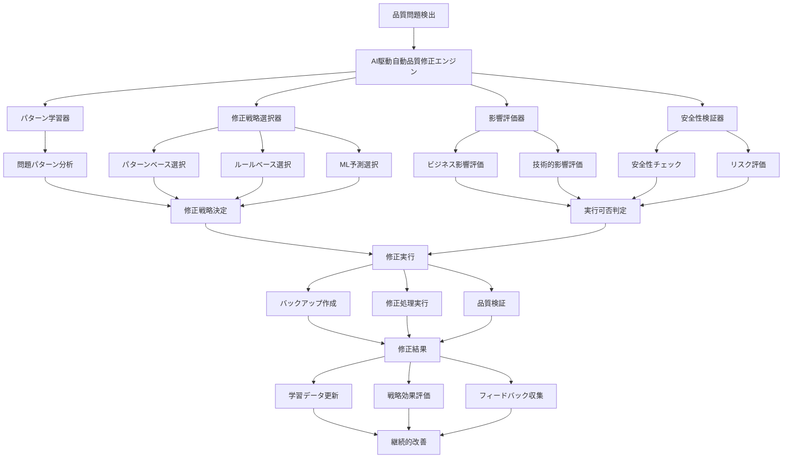

```typescript
// 概念実証コード 15-3-2-B: データガバナンスフレームワーク
class DataGovernanceFramework {
  private policyEngine: PolicyEngine;
  private accessController: AccessController;
  private auditTracker: AuditTracker;
  private complianceMonitor: ComplianceMonitor;
  
  constructor() {
    this.policyEngine = new PolicyEngine();
    this.accessController = new AccessController();
    this.auditTracker = new AuditTracker();
    this.complianceMonitor = new ComplianceMonitor();
  }
  
  async establishGovernance(
    organization: Organization,
    governanceRequirements: GovernanceRequirements
  ): Promise<GovernanceFramework> {
    // データポリシーの定義
    const dataPolicies = await this.policyEngine.createPolicies(
      organization,
      governanceRequirements
    );
    
    // アクセス制御の設定
    const accessControls = await this.accessController.setupControls(
      organization,
      dataPolicies
    );
    
    // 監査体制の構築
    const auditFramework = await this.auditTracker.establishAuditFramework(
      organization,
      governanceRequirements.auditRequirements
    );
    
    // コンプライアンス監視の設定
    const complianceFramework = await this.complianceMonitor.setupCompliance(
      organization,
      governanceRequirements.complianceRequirements
    );
    
    return {
      policies: dataPolicies,
      accessControls,
      auditFramework,
      complianceFramework,
      establishedAt: new Date(),
      governanceId: this.generateGovernanceId(organization)
    };
  }
  
  async enforceDataPolicy(
    dataOperation: DataOperation,
    context: OperationContext
  ): Promise<PolicyEnforcementResult> {
    // 適用可能ポリシーの特定
    const applicablePolicies = await this.policyEngine.findApplicablePolicies(
      dataOperation,
      context
    );
    
    // ポリシー評価の実行
    const policyEvaluations = await Promise.all(
      applicablePolicies.map(policy => 
        this.policyEngine.evaluatePolicy(policy, dataOperation, context)
      )
    );
    
    // 総合判定
    const overallDecision = await this.policyEngine.makeOverallDecision(
      policyEvaluations
    );
    
    // 監査ログの記録
    await this.auditTracker.logPolicyEnforcement({
      operation: dataOperation,
      context,
      policies: applicablePolicies,
      evaluations: policyEvaluations,
      decision: overallDecision,
      timestamp: new Date()
    });
    
    return {
      decision: overallDecision.decision,
      reasoning: overallDecision.reasoning,
      conditions: overallDecision.conditions,
      auditId: overallDecision.auditId
    };
  }
  
  async monitorCompliance(
    timeframe: Timeframe,
    complianceScope: ComplianceScope
  ): Promise<ComplianceReport> {
    // コンプライアンス状況の評価
    const complianceStatus = await this.complianceMonitor.assessCompliance(
      timeframe,
      complianceScope
    );
    
    // 違反事項の特定
    const violations = await this.complianceMonitor.identifyViolations(
      complianceStatus
    );
    
    // リスク評価
    const riskAssessment = await this.complianceMonitor.assessRisks(
      violations,
      complianceScope
    );
    
    // 改善推奨事項の生成
    const recommendations = await this.complianceMonitor.generateRecommendations(
      violations,
      riskAssessment
    );
    
    return {
      timeframe,
      scope: complianceScope,
      overallComplianceScore: complianceStatus.overallScore,
      complianceByCategory: complianceStatus.categoryScores,
      violations,
      riskAssessment,
      recommendations,
      generatedAt: new Date()
    };
  }
}
```

```typescript
// 概念実証コード 15-3-2-C: 品質ガバナンス統合システム
class QualityGovernanceIntegrationSystem {
  private qualityPolicyManager: QualityPolicyManager;
  private stakeholderManager: StakeholderManager;
  private escalationManager: EscalationManager;
  private reportingEngine: ReportingEngine;
  
  constructor() {
    this.qualityPolicyManager = new QualityPolicyManager();
    this.stakeholderManager = new StakeholderManager();
    this.escalationManager = new EscalationManager();
    this.reportingEngine = new ReportingEngine();
  }
  
  async integrateQualityGovernance(
    qualityFramework: QualityFramework,
    governanceFramework: GovernanceFramework
  ): Promise<IntegratedQualityGovernance> {
    // 品質ポリシーの統合
    const integratedPolicies = await this.qualityPolicyManager.integratePolicies(
      qualityFramework.qualityPolicies,
      governanceFramework.policies
    );
    
    // ステークホルダー責任の定義
    const stakeholderResponsibilities = await this.stakeholderManager.defineResponsibilities(
      qualityFramework,
      governanceFramework
    );
    
    // エスカレーション体制の構築
    const escalationProcedures = await this.escalationManager.establishProcedures(
      integratedPolicies,
      stakeholderResponsibilities
    );
    
    // 統合レポート体制の構築
    const reportingFramework = await this.reportingEngine.createIntegratedReporting(
      qualityFramework,
      governanceFramework
    );
    
    return {
      integratedPolicies,
      stakeholderResponsibilities,
      escalationProcedures,
      reportingFramework,
      integrationMetadata: {
        qualityFrameworkVersion: qualityFramework.version,
        governanceFrameworkVersion: governanceFramework.version,
        integrationDate: new Date(),
        integrationId: this.generateIntegrationId()
      }
    };
  }
  
  async executeQualityGovernanceWorkflow(
    qualityEvent: QualityEvent,
    governanceContext: GovernanceContext
  ): Promise<GovernanceWorkflowResult> {
    // イベントの分類と優先度付け
    const eventClassification = await this.classifyQualityEvent(qualityEvent);
    
    // 適用可能ガバナンスルールの特定
    const applicableRules = await this.identifyApplicableRules(
      eventClassification,
      governanceContext
    );
    
    // ワークフローの実行
    const workflowExecution = await this.executeWorkflow(
      qualityEvent,
      eventClassification,
      applicableRules
    );
    
    // ステークホルダーへの通知
    await this.notifyStakeholders(workflowExecution, eventClassification);
    
    // 結果の記録と追跡
    await this.recordWorkflowResult(workflowExecution);
    
    return workflowExecution;
  }
  
  private async executeWorkflow(
    event: QualityEvent,
    classification: EventClassification,
    rules: GovernanceRule[]
  ): Promise<GovernanceWorkflowResult> {
    const workflowSteps: WorkflowStep[] = [];
    
    for (const rule of rules) {
      const step = await this.executeGovernanceRule(event, classification, rule);
      workflowSteps.push(step);
      
      // 重大な問題の場合は即座にエスカレーション
      if (step.severity === 'critical') {
        await this.escalationManager.escalateImmediately(event, step);
      }
    }
    
    return {
      event,
      classification,
      workflowSteps,
      overallResult: await this.calculateOverallResult(workflowSteps),
      executionTime: this.calculateExecutionTime(workflowSteps),
      completedAt: new Date()
    };
  }
}
```

#### ガバナンス体制の継続的改善

**フィードバックループの確立**
- ステークホルダーからの継続的フィードバック収集
- ガバナンス効果の定量的測定
- 改善機会の体系的特定

**適応的ポリシー管理**
- ビジネス環境変化への動的対応
- 規制要件変更への迅速な適応
- 組織成長に応じたスケーラビリティ確保

**ベストプラクティスの共有**
- 組織内でのナレッジ共有促進
- 業界標準との整合性確保
- 継続的学習文化の醸成

この包括的な自動品質修正とガバナンスシステムにより、トリプルパースペクティブ型戦略AIレーダーは、高品質なデータ基盤を自律的に維持し、組織の戦略的意思決定を継続的に支援します。

### 15.3.3 データ系譜とプロファイリング

トリプルパースペクティブ型戦略AIレーダーの分析結果に対する信頼性と説明責任を確保するため、データの起源から最終的な分析結果まで完全な追跡可能性を提供するデータ系譜管理と、データ特性の詳細な理解を可能にするプロファイリングシステムが不可欠です。本セクションでは、これらの実装について詳述します。

#### データ系譜の戦略的重要性

**説明責任の確保**
- 分析結果の根拠となるデータソースの完全な追跡
- 意思決定プロセスの透明性向上
- 監査要件への確実な対応

**品質問題の迅速な特定**
- 問題データの影響範囲の即座の把握
- 根本原因の効率的な特定
- 修正作業の最適化

**コンプライアンス対応**
- 規制要件への確実な対応
- データ保護法への準拠
- 業界標準の遵守

#### 包括的データ系譜追跡システム

データの収集から変換、分析、出力まで、すべての処理段階を詳細に記録し、完全な系譜情報を提供するシステムを構築します。

```typescript
// 概念実証コード 15-3-3-A: 包括的データ系譜追跡システム
class ComprehensiveDataLineageTracker {
  private lineageGraph: LineageGraph;
  private metadataStore: MetadataStore;
  private transformationTracker: TransformationTracker;
  private impactAnalyzer: ImpactAnalyzer;
  
  constructor() {
    this.lineageGraph = new LineageGraph();
    this.metadataStore = new MetadataStore();
    this.transformationTracker = new TransformationTracker();
    this.impactAnalyzer = new ImpactAnalyzer();
  }
  
  async trackDataFlow(
    dataFlow: DataFlow,
    executionContext: ExecutionContext
  ): Promise<LineageRecord> {
    const lineageId = this.generateLineageId(dataFlow, executionContext);
    
    // データフローの開始記録
    const lineageRecord = await this.initializeLineageRecord(
      lineageId,
      dataFlow,
      executionContext
    );
    
    // 各処理ステップの追跡
    for (const step of dataFlow.steps) {
      const stepLineage = await this.trackProcessingStep(
        lineageRecord,
        step,
        executionContext
      );
      
      await this.lineageGraph.addNode(stepLineage);
      await this.lineageGraph.addEdge(
        lineageRecord.previousStep,
        stepLineage,
        step.transformation
      );
      
      lineageRecord.previousStep = stepLineage;
    }
    
    // 系譜情報の永続化
    await this.metadataStore.persistLineage(lineageRecord);
    
    return lineageRecord;
  }
  
  private async trackProcessingStep(
    parentLineage: LineageRecord,
    step: ProcessingStep,
    context: ExecutionContext
  ): Promise<StepLineage> {
    const stepStartTime = Date.now();
    
    // 入力データの記録
    const inputLineage = await this.recordInputData(step.inputs, context);
    
    // 変換処理の記録
    const transformationLineage = await this.transformationTracker.track(
      step.transformation,
      inputLineage,
      context
    );
    
    // 出力データの記録
    const outputLineage = await this.recordOutputData(
      step.outputs,
      transformationLineage,
      context
    );
    
    return {
      stepId: step.id,
      parentLineageId: parentLineage.id,
      inputLineage,
      transformationLineage,
      outputLineage,
      executionMetadata: {
        startTime: new Date(stepStartTime),
        endTime: new Date(),
        duration: Date.now() - stepStartTime,
        executorId: context.executorId,
        environment: context.environment
      }
    };
  }
  
  async queryLineage(
    query: LineageQuery
  ): Promise<LineageQueryResult> {
    switch (query.type) {
      case 'forward':
        return await this.traceForwardLineage(query);
      case 'backward':
        return await this.traceBackwardLineage(query);
      case 'impact':
        return await this.analyzeImpact(query);
      case 'column':
        return await this.traceColumnLineage(query);
      default:
        throw new Error(`Unsupported query type: ${query.type}`);
    }
  }
  
  private async traceBackwardLineage(
    query: LineageQuery
  ): Promise<BackwardLineageResult> {
    const targetEntity = await this.lineageGraph.findEntity(query.entityId);
    if (!targetEntity) {
      throw new Error(`Entity not found: ${query.entityId}`);
    }
    
    // 後方追跡の実行
    const lineagePath = await this.lineageGraph.traverseBackward(
      targetEntity,
      query.depth || 10
    );
    
    // 系譜情報の詳細化
    const detailedLineage = await this.enrichLineageDetails(lineagePath);
    
    // 影響分析の実行
    const impactAnalysis = await this.impactAnalyzer.analyzeBackwardImpact(
      detailedLineage
    );
    
    return {
      query,
      lineagePath: detailedLineage,
      impactAnalysis,
      metadata: {
        totalNodes: lineagePath.length,
        maxDepth: this.calculateMaxDepth(lineagePath),
        queryExecutionTime: Date.now() - query.startTime
      }
    };
  }
  
  async generateLineageReport(
    reportScope: LineageReportScope,
    reportFormat: ReportFormat
  ): Promise<LineageReport> {
    // レポート対象データの特定
    const scopeEntities = await this.identifyScopeEntities(reportScope);
    
    // 系譜情報の収集
    const lineageData = await this.collectLineageData(scopeEntities);
    
    // 系譜分析の実行
    const lineageAnalysis = await this.analyzeLineageData(lineageData);
    
    // レポートの生成
    const report = await this.generateReport(
      lineageData,
      lineageAnalysis,
      reportFormat
    );
    
    return {
      scope: reportScope,
      format: reportFormat,
      content: report,
      analysis: lineageAnalysis,
      generatedAt: new Date(),
      reportId: this.generateReportId(reportScope)
    };
  }
}
```

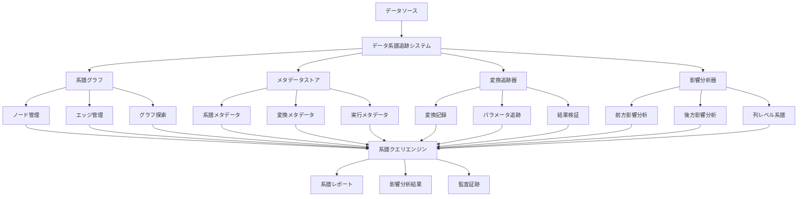

```typescript
// 概念実証コード 15-3-3-B: 高度データプロファイリングシステム
class AdvancedDataProfilingSystem {
  private statisticalProfiler: StatisticalProfiler;
  private semanticAnalyzer: SemanticAnalyzer;
  private qualityAssessor: QualityAssessor;
  private patternDetector: PatternDetector;
  
  constructor() {
    this.statisticalProfiler = new StatisticalProfiler();
    this.semanticAnalyzer = new SemanticAnalyzer();
    this.qualityAssessor = new QualityAssessor();
    this.patternDetector = new PatternDetector();
  }
  
  async profileDataset(
    dataset: Dataset,
    profilingConfig: ProfilingConfig
  ): Promise<DataProfile> {
    const profilingStartTime = Date.now();
    
    // 並列プロファイリングの実行
    const [
      statisticalProfile,
      semanticProfile,
      qualityProfile,
      patternProfile
    ] = await Promise.all([
      this.generateStatisticalProfile(dataset, profilingConfig.statistical),
      this.generateSemanticProfile(dataset, profilingConfig.semantic),
      this.generateQualityProfile(dataset, profilingConfig.quality),
      this.generatePatternProfile(dataset, profilingConfig.pattern)
    ]);
    
    // プロファイル統合
    const integratedProfile = await this.integrateProfiles({
      statistical: statisticalProfile,
      semantic: semanticProfile,
      quality: qualityProfile,
      pattern: patternProfile
    });
    
    // 洞察の抽出
    const insights = await this.extractInsights(integratedProfile);
    
    return {
      datasetId: dataset.id,
      profiles: integratedProfile,
      insights,
      metadata: {
        profilingTime: Date.now() - profilingStartTime,
        recordCount: dataset.recordCount,
        columnCount: dataset.columnCount,
        profilingDate: new Date()
      }
    };
  }
  
  private async generateStatisticalProfile(
    dataset: Dataset,
    config: StatisticalProfilingConfig
  ): Promise<StatisticalProfile> {
    const columnProfiles: Map<string, ColumnStatistics> = new Map();
    
    for (const column of dataset.columns) {
      const columnData = dataset.getColumnData(column.name);
      
      const statistics = await this.statisticalProfiler.calculateStatistics(
        columnData,
        column.dataType,
        config
      );
      
      columnProfiles.set(column.name, statistics);
    }
    
    // データセット全体の統計
    const datasetStatistics = await this.statisticalProfiler.calculateDatasetStatistics(
      dataset,
      columnProfiles
    );
    
    return {
      columnProfiles,
      datasetStatistics,
      correlationMatrix: await this.statisticalProfiler.calculateCorrelations(dataset),
      distributionAnalysis: await this.statisticalProfiler.analyzeDistributions(dataset)
    };
  }
  
  private async generateSemanticProfile(
    dataset: Dataset,
    config: SemanticProfilingConfig
  ): Promise<SemanticProfile> {
    const semanticAnnotations: Map<string, SemanticAnnotation> = new Map();
    
    for (const column of dataset.columns) {
      const columnData = dataset.getColumnData(column.name);
      
      // セマンティック分析の実行
      const annotation = await this.semanticAnalyzer.analyzeColumn(
        column,
        columnData,
        config
      );
      
      semanticAnnotations.set(column.name, annotation);
    }
    
    // エンティティ関係の分析
    const entityRelationships = await this.semanticAnalyzer.analyzeEntityRelationships(
      dataset,
      semanticAnnotations
    );
    
    // ビジネス概念のマッピング
    const businessConceptMapping = await this.semanticAnalyzer.mapBusinessConcepts(
      semanticAnnotations,
      config.businessGlossary
    );
    
    return {
      semanticAnnotations,
      entityRelationships,
      businessConceptMapping,
      confidenceScores: await this.semanticAnalyzer.calculateConfidenceScores(
        semanticAnnotations
      )
    };
  }
  
  async compareProfiles(
    profile1: DataProfile,
    profile2: DataProfile,
    comparisonConfig: ProfileComparisonConfig
  ): Promise<ProfileComparison> {
    // 統計的比較
    const statisticalComparison = await this.compareStatisticalProfiles(
      profile1.profiles.statistical,
      profile2.profiles.statistical
    );
    
    // セマンティック比較
    const semanticComparison = await this.compareSemanticProfiles(
      profile1.profiles.semantic,
      profile2.profiles.semantic
    );
    
    // 品質比較
    const qualityComparison = await this.compareQualityProfiles(
      profile1.profiles.quality,
      profile2.profiles.quality
    );
    
    // 変化の分析
    const changeAnalysis = await this.analyzeChanges({
      statistical: statisticalComparison,
      semantic: semanticComparison,
      quality: qualityComparison
    });
    
    return {
      profile1Id: profile1.datasetId,
      profile2Id: profile2.datasetId,
      comparisons: {
        statistical: statisticalComparison,
        semantic: semanticComparison,
        quality: qualityComparison
      },
      changeAnalysis,
      overallSimilarity: await this.calculateOverallSimilarity(changeAnalysis),
      comparedAt: new Date()
    };
  }
}
```

```typescript
// 概念実証コード 15-3-3-C: インテリジェント系譜分析エンジン
class IntelligentLineageAnalysisEngine {
  private graphAnalyzer: GraphAnalyzer;
  private anomalyDetector: LineageAnomalyDetector;
  private optimizationEngine: LineageOptimizationEngine;
  private visualizationEngine: LineageVisualizationEngine;
  
  constructor() {
    this.graphAnalyzer = new GraphAnalyzer();
    this.anomalyDetector = new LineageAnomalyDetector();
    this.optimizationEngine = new LineageOptimizationEngine();
    this.visualizationEngine = new LineageVisualizationEngine();
  }
  
  async analyzeLineageComplexity(
    lineageGraph: LineageGraph
  ): Promise<LineageComplexityAnalysis> {
    // グラフ構造の分析
    const structuralMetrics = await this.graphAnalyzer.calculateStructuralMetrics(
      lineageGraph
    );
    
    // 複雑性指標の計算
    const complexityMetrics = await this.calculateComplexityMetrics(
      lineageGraph,
      structuralMetrics
    );
    
    // ボトルネックの特定
    const bottlenecks = await this.identifyBottlenecks(
      lineageGraph,
      complexityMetrics
    );
    
    // 最適化機会の特定
    const optimizationOpportunities = await this.optimizationEngine.identifyOpportunities(
      lineageGraph,
      complexityMetrics,
      bottlenecks
    );
    
    return {
      structuralMetrics,
      complexityMetrics,
      bottlenecks,
      optimizationOpportunities,
      overallComplexityScore: await this.calculateOverallComplexityScore(complexityMetrics),
      analysisMetadata: {
        nodeCount: lineageGraph.nodeCount,
        edgeCount: lineageGraph.edgeCount,
        maxDepth: structuralMetrics.maxDepth,
        analysisDate: new Date()
      }
    };
  }
  
  async detectLineageAnomalies(
    lineageGraph: LineageGraph,
    historicalBaseline: LineageBaseline
  ): Promise<LineageAnomalyReport> {
    // 構造的異常の検出
    const structuralAnomalies = await this.anomalyDetector.detectStructuralAnomalies(
      lineageGraph,
      historicalBaseline.structuralPatterns
    );
    
    // 実行時異常の検出
    const executionAnomalies = await this.anomalyDetector.detectExecutionAnomalies(
      lineageGraph,
      historicalBaseline.executionPatterns
    );
    
    // データ品質異常の検出
    const qualityAnomalies = await this.anomalyDetector.detectQualityAnomalies(
      lineageGraph,
      historicalBaseline.qualityPatterns
    );
    
    // 異常の重要度評価
    const anomalySeverity = await this.evaluateAnomalySeverity({
      structural: structuralAnomalies,
      execution: executionAnomalies,
      quality: qualityAnomalies
    });
    
    return {
      anomalies: {
        structural: structuralAnomalies,
        execution: executionAnomalies,
        quality: qualityAnomalies
      },
      severity: anomalySeverity,
      recommendations: await this.generateAnomalyRecommendations(anomalySeverity),
      detectionMetadata: {
        baselineVersion: historicalBaseline.version,
        detectionDate: new Date(),
        confidenceLevel: await this.calculateDetectionConfidence(anomalySeverity)
      }
    };
  }
  
  async generateLineageVisualization(
    lineageGraph: LineageGraph,
    visualizationConfig: VisualizationConfig
  ): Promise<LineageVisualization> {
    // レイアウトの最適化
    const optimizedLayout = await this.visualizationEngine.optimizeLayout(
      lineageGraph,
      visualizationConfig.layoutAlgorithm
    );
    
    // 視覚的要素の生成
    const visualElements = await this.visualizationEngine.generateVisualElements(
      lineageGraph,
      optimizedLayout,
      visualizationConfig.styling
    );
    
    // インタラクティブ機能の追加
    const interactiveFeatures = await this.visualizationEngine.addInteractiveFeatures(
      visualElements,
      visualizationConfig.interactivity
    );
    
    return {
      layout: optimizedLayout,
      visualElements,
      interactiveFeatures,
      metadata: {
        nodeCount: lineageGraph.nodeCount,
        edgeCount: lineageGraph.edgeCount,
        renderingTime: await this.calculateRenderingTime(visualElements),
        generatedAt: new Date()
      }
    };
  }
}
```

#### データ系譜とプロファイリングの統合活用

**意思決定支援の強化**
- 分析結果の信頼性評価
- データ品質が意思決定に与える影響の定量化
- 代替データソースの提案

**継続的改善の促進**
- データ処理パイプラインの最適化機会特定
- 品質問題の根本原因分析
- プロセス改善効果の測定

**コンプライアンスの自動化**
- 規制要件への自動対応
- 監査証跡の自動生成
- データ保護要件の確実な遵守

この包括的なデータ系譜とプロファイリングシステムにより、トリプルパースペクティブ型戦略AIレーダーは、完全な透明性と説明責任を確保しながら、高品質な戦略的洞察を提供します。

### 15.3.4 継続的品質改善

データ品質管理は一度の実装で完了するものではなく、組織の成長、ビジネス環境の変化、技術の進歩に応じて継続的に改善していく必要があります。トリプルパースペクティブ型戦略AIレーダーの長期的な価値を確保するため、本セクションでは、継続的品質改善のフレームワークと実装について詳述します。

#### 継続的改善の戦略的意義

**競争優位性の維持**
- 変化するビジネス環境への適応
- 新しい品質要件への迅速な対応
- 継続的な価値向上による投資対効果の最大化

**組織学習の促進**
- 品質管理のベストプラクティス蓄積
- 失敗からの学習と改善
- 組織全体の品質意識向上

**リスク管理の強化**
- 新たなリスクの早期発見
- 予防的品質管理の実現
- 長期的な安定性確保

#### 適応的品質改善フレームワーク

組織の成熟度、ビジネス要件、技術環境の変化に応じて、品質管理プロセスを動的に調整するフレームワークを構築します。

```typescript
// 概念実証コード 15-3-4-A: 適応的品質改善フレームワーク
class AdaptiveQualityImprovementFramework {
  private maturityAssessor: MaturityAssessor;
  private improvementPlanner: ImprovementPlanner;
  private changeManager: ChangeManager;
  private effectivenessTracker: EffectivenessTracker;
  
  constructor() {
    this.maturityAssessor = new MaturityAssessor();
    this.improvementPlanner = new ImprovementPlanner();
    this.changeManager = new ChangeManager();
    this.effectivenessTracker = new EffectivenessTracker();
  }
  
  async assessCurrentState(
    organization: Organization,
    qualityManagementSystem: QualityManagementSystem
  ): Promise<QualityMaturityAssessment> {
    // 組織の品質成熟度評価
    const organizationalMaturity = await this.maturityAssessor.assessOrganizationalMaturity(
      organization
    );
    
    // 技術的成熟度評価
    const technicalMaturity = await this.maturityAssessor.assessTechnicalMaturity(
      qualityManagementSystem
    );
    
    // プロセス成熟度評価
    const processMaturity = await this.maturityAssessor.assessProcessMaturity(
      qualityManagementSystem.processes
    );
    
    // 人材・スキル成熟度評価
    const skillMaturity = await this.maturityAssessor.assessSkillMaturity(
      organization.qualityTeam
    );
    
    // 総合成熟度の計算
    const overallMaturity = await this.calculateOverallMaturity({
      organizational: organizationalMaturity,
      technical: technicalMaturity,
      process: processMaturity,
      skill: skillMaturity
    });
    
    return {
      maturityDimensions: {
        organizational: organizationalMaturity,
        technical: technicalMaturity,
        process: processMaturity,
        skill: skillMaturity
      },
      overallMaturity,
      strengths: await this.identifyStrengths(overallMaturity),
      improvementAreas: await this.identifyImprovementAreas(overallMaturity),
      assessmentDate: new Date()
    };
  }
  
  async createImprovementPlan(
    maturityAssessment: QualityMaturityAssessment,
    businessObjectives: BusinessObjectives,
    constraints: ImprovementConstraints
  ): Promise<QualityImprovementPlan> {
    // 改善目標の設定
    const improvementGoals = await this.improvementPlanner.defineGoals(
      maturityAssessment,
      businessObjectives
    );
    
    // 改善イニシアチブの特定
    const initiatives = await this.improvementPlanner.identifyInitiatives(
      improvementGoals,
      maturityAssessment.improvementAreas
    );
    
    // 優先順位付け
    const prioritizedInitiatives = await this.improvementPlanner.prioritizeInitiatives(
      initiatives,
      businessObjectives,
      constraints
    );
    
    // 実行計画の作成
    const executionPlan = await this.improvementPlanner.createExecutionPlan(
      prioritizedInitiatives,
      constraints
    );
    
    // 成功指標の定義
    const successMetrics = await this.improvementPlanner.defineSuccessMetrics(
      improvementGoals,
      prioritizedInitiatives
    );
    
    return {
      goals: improvementGoals,
      initiatives: prioritizedInitiatives,
      executionPlan,
      successMetrics,
      timeline: executionPlan.timeline,
      resourceRequirements: executionPlan.resourceRequirements,
      riskAssessment: await this.assessImplementationRisks(executionPlan),
      createdDate: new Date()
    };
  }
  
  async executeImprovementCycle(
    improvementPlan: QualityImprovementPlan,
    executionContext: ExecutionContext
  ): Promise<ImprovementCycleResult> {
    const cycleStartTime = Date.now();
    
    // 改善イニシアチブの実行
    const initiativeResults = await this.executeInitiatives(
      improvementPlan.initiatives,
      executionContext
    );
    
    // 効果測定
    const effectivenessMeasurement = await this.effectivenessTracker.measureEffectiveness(
      initiativeResults,
      improvementPlan.successMetrics
    );
    
    // 学習の抽出
    const lessonsLearned = await this.extractLessonsLearned(
      initiativeResults,
      effectivenessMeasurement
    );
    
    // 次サイクルの計画調整
    const nextCycleAdjustments = await this.planNextCycleAdjustments(
      effectivenessMeasurement,
      lessonsLearned
    );
    
    return {
      cycleId: this.generateCycleId(improvementPlan, executionContext),
      initiativeResults,
      effectivenessMeasurement,
      lessonsLearned,
      nextCycleAdjustments,
      cycleMetadata: {
        startTime: new Date(cycleStartTime),
        endTime: new Date(),
        duration: Date.now() - cycleStartTime,
        participantCount: executionContext.participants.length
      }
    };
  }
  
  private async executeInitiatives(
    initiatives: QualityImprovementInitiative[],
    context: ExecutionContext
  ): Promise<InitiativeExecutionResult[]> {
    const results: InitiativeExecutionResult[] = [];
    
    for (const initiative of initiatives) {
      try {
        const result = await this.executeInitiative(initiative, context);
        results.push(result);
      } catch (error) {
        const errorResult = await this.handleInitiativeError(initiative, error, context);
        results.push(errorResult);
      }
    }
    
    return results;
  }
}
```

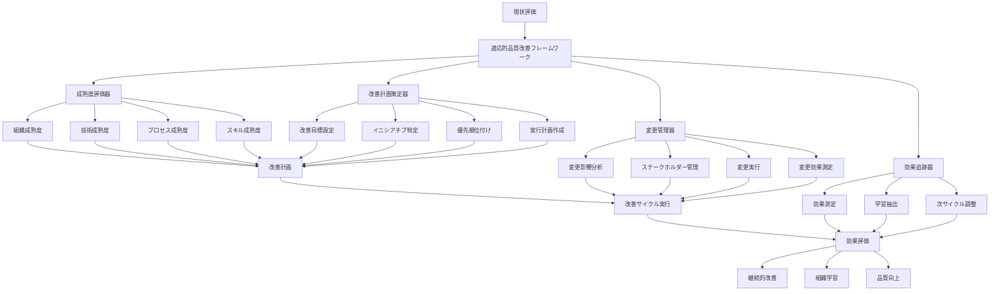

```typescript
// 概念実証コード 15-3-4-B: 品質学習システム
class QualityLearningSystem {
  private knowledgeBase: QualityKnowledgeBase;
  private patternAnalyzer: QualityPatternAnalyzer;
  private bestPracticeExtractor: BestPracticeExtractor;
  private recommendationEngine: RecommendationEngine;
  
  constructor() {
    this.knowledgeBase = new QualityKnowledgeBase();
    this.patternAnalyzer = new QualityPatternAnalyzer();
    this.bestPracticeExtractor = new BestPracticeExtractor();
    this.recommendationEngine = new RecommendationEngine();
  }
  
  async captureQualityKnowledge(
    qualityEvent: QualityEvent,
    context: QualityContext,
    outcome: QualityOutcome
  ): Promise<KnowledgeCaptureResult> {
    // イベントパターンの分析
    const eventPattern = await this.patternAnalyzer.analyzeEventPattern(
      qualityEvent,
      context
    );
    
    // 成功・失敗要因の特定
    const successFactors = await this.identifySuccessFactors(
      qualityEvent,
      outcome,
      context
    );
    
    // ベストプラクティスの抽出
    const bestPractices = await this.bestPracticeExtractor.extract(
      qualityEvent,
      successFactors,
      outcome
    );
    
    // ナレッジベースへの登録
    const knowledgeEntry = await this.knowledgeBase.addKnowledge({
      event: qualityEvent,
      context,
      outcome,
      pattern: eventPattern,
      successFactors,
      bestPractices,
      capturedAt: new Date()
    });
    
    return {
      knowledgeEntryId: knowledgeEntry.id,
      pattern: eventPattern,
      successFactors,
      bestPractices,
      confidence: await this.calculateKnowledgeConfidence(knowledgeEntry),
      applicability: await this.assessKnowledgeApplicability(knowledgeEntry)
    };
  }
  
  async generateQualityRecommendations(
    currentSituation: QualitySituation,
    improvementGoals: ImprovementGoals
  ): Promise<QualityRecommendations> {
    // 類似状況の検索
    const similarSituations = await this.knowledgeBase.findSimilarSituations(
      currentSituation
    );
    
    // 適用可能なベストプラクティスの特定
    const applicablePractices = await this.identifyApplicablePractices(
      similarSituations,
      improvementGoals
    );
    
    // 推奨事項の生成
    const recommendations = await this.recommendationEngine.generate(
      currentSituation,
      applicablePractices,
      improvementGoals
    );
    
    // 推奨事項の優先順位付け
    const prioritizedRecommendations = await this.prioritizeRecommendations(
      recommendations,
      improvementGoals
    );
    
    return {
      situation: currentSituation,
      goals: improvementGoals,
      recommendations: prioritizedRecommendations,
      confidence: await this.calculateRecommendationConfidence(prioritizedRecommendations),
      expectedImpact: await this.estimateExpectedImpact(prioritizedRecommendations),
      generatedAt: new Date()
    };
  }
  
  async updateKnowledgeFromFeedback(
    knowledgeEntryId: string,
    feedback: QualityFeedback,
    actualOutcome: QualityOutcome
  ): Promise<KnowledgeUpdateResult> {
    // 既存ナレッジの取得
    const existingKnowledge = await this.knowledgeBase.getKnowledge(knowledgeEntryId);
    
    // フィードバックの分析
    const feedbackAnalysis = await this.analyzeFeedback(feedback, actualOutcome);
    
    // ナレッジの更新
    const updatedKnowledge = await this.updateKnowledge(
      existingKnowledge,
      feedbackAnalysis
    );
    
    // 信頼度の再計算
    const updatedConfidence = await this.recalculateConfidence(
      updatedKnowledge,
      feedbackAnalysis
    );
    
    // ナレッジベースの更新
    await this.knowledgeBase.updateKnowledge(knowledgeEntryId, updatedKnowledge);
    
    return {
      knowledgeEntryId,
      updateType: feedbackAnalysis.updateType,
      confidenceChange: updatedConfidence - existingKnowledge.confidence,
      updatedAt: new Date()
    };
  }
}
```

```typescript
// 概念実証コード 15-3-4-C: 品質改善効果測定システム
class QualityImprovementEffectMeasurementSystem {
  private baselineManager: BaselineManager;
  private metricsCalculator: MetricsCalculator;
  private trendAnalyzer: TrendAnalyzer;
  private roiCalculator: ROICalculator;
  
  constructor() {
    this.baselineManager = new BaselineManager();
    this.metricsCalculator = new MetricsCalculator();
    this.trendAnalyzer = new TrendAnalyzer();
    this.roiCalculator = new ROICalculator();
  }
  
  async establishBaseline(
    qualitySystem: QualityManagementSystem,
    measurementScope: MeasurementScope
  ): Promise<QualityBaseline> {
    // ベースライン期間の定義
    const baselinePeriod = await this.defineBaselinePeriod(measurementScope);
    
    // ベースラインメトリクスの収集
    const baselineMetrics = await this.collectBaselineMetrics(
      qualitySystem,
      baselinePeriod,
      measurementScope
    );
    
    // ベースライン統計の計算
    const baselineStatistics = await this.metricsCalculator.calculateStatistics(
      baselineMetrics
    );
    
    // ベースラインの永続化
    const baseline = await this.baselineManager.createBaseline({
      scope: measurementScope,
      period: baselinePeriod,
      metrics: baselineMetrics,
      statistics: baselineStatistics,
      establishedAt: new Date()
    });
    
    return baseline;
  }
  
  async measureImprovementEffect(
    baseline: QualityBaseline,
    currentState: QualityState,
    improvementInitiatives: ImprovementInitiative[]
  ): Promise<ImprovementEffectMeasurement> {
    // 現在の品質メトリクスの収集
    const currentMetrics = await this.collectCurrentMetrics(
      currentState,
      baseline.scope
    );
    
    // ベースラインとの比較
    const comparison = await this.compareWithBaseline(
      baseline,
      currentMetrics
    );
    
    // 改善効果の計算
    const improvementEffect = await this.calculateImprovementEffect(
      comparison,
      improvementInitiatives
    );
    
    // トレンド分析
    const trendAnalysis = await this.trendAnalyzer.analyzeTrend(
      baseline,
      currentMetrics,
      improvementInitiatives
    );
    
    // ROI計算
    const roiAnalysis = await this.roiCalculator.calculateROI(
      improvementInitiatives,
      improvementEffect
    );
    
    return {
      baseline,
      currentMetrics,
      comparison,
      improvementEffect,
      trendAnalysis,
      roiAnalysis,
      measurementDate: new Date(),
      confidence: await this.calculateMeasurementConfidence(comparison)
    };
  }
  
  async generateImprovementReport(
    effectMeasurement: ImprovementEffectMeasurement,
    reportingPeriod: ReportingPeriod
  ): Promise<ImprovementReport> {
    // 改善サマリーの作成
    const improvementSummary = await this.createImprovementSummary(
      effectMeasurement
    );
    
    // 詳細分析の実行
    const detailedAnalysis = await this.performDetailedAnalysis(
      effectMeasurement,
      reportingPeriod
    );
    
    // 推奨事項の生成
    const recommendations = await this.generateRecommendations(
      effectMeasurement,
      detailedAnalysis
    );
    
    // 次期計画の提案
    const nextPeriodPlan = await this.proposeNextPeriodPlan(
      effectMeasurement,
      recommendations
    );
    
    return {
      reportingPeriod,
      improvementSummary,
      detailedAnalysis,
      recommendations,
      nextPeriodPlan,
      appendices: {
        rawData: effectMeasurement.currentMetrics,
        calculations: effectMeasurement.comparison,
        methodology: await this.documentMethodology()
      },
      generatedAt: new Date()
    };
  }
}
```

#### 継続的改善の組織的定着

**文化的変革の促進**
- 品質改善を組織文化の一部として定着
- 継続的学習の奨励と支援
- 失敗を学習機会として活用する風土醸成

**能力開発の継続**
- 品質管理スキルの体系的向上
- 新技術・手法の継続的導入
- 外部ベストプラクティスの積極的取り込み

**システム的アプローチ**
- 品質改善を組織全体のシステムとして捉える
- 部門間連携の強化
- 長期的視点での改善計画策定

この包括的な継続的品質改善システムにより、トリプルパースペクティブ型戦略AIレーダーは、組織の成長と環境変化に適応しながら、継続的に品質を向上させ、長期的な戦略的価値を提供し続けます。

---

## 15.4 スケーラブルデータ処理

### 15.4.1 分散処理アーキテクチャ設計

トリプルパースペクティブ型戦略AIレーダーが組織の成長と共にスケールし、増大するデータ量と処理要求に対応するためには、堅牢で効率的な分散処理アーキテクチャが不可欠です。本セクションでは、エンタープライズレベルでの運用に耐える分散処理システムの設計と実装について詳述します。

#### 分散処理の戦略的重要性

**ビジネス成長への対応**
- 組織拡大に伴うデータ量増加への自動対応
- 新規事業・市場参入時の迅速なスケールアップ
- 季節変動や突発的な負荷増加への柔軟な対応

**競争優位性の確保**
- リアルタイム分析による迅速な意思決定支援
- 大量データ処理による深い洞察の獲得
- システム可用性向上による継続的な価値提供

**コスト効率の最適化**
- リソース使用量の動的調整による運用コスト削減
- 処理効率向上による時間コスト削減
- インフラ投資の最適化

#### マイクロサービス型分散アーキテクチャ

トリプルパースペクティブ型戦略AIレーダーの各機能を独立したマイクロサービスとして設計し、水平スケーリングと障害隔離を実現します。

```typescript
// 概念実証コード 15-4-1-A: 分散データ処理オーケストレーター
class DistributedDataProcessingOrchestrator {
  private serviceRegistry: ServiceRegistry;
  private loadBalancer: LoadBalancer;
  private taskScheduler: TaskScheduler;
  private healthMonitor: HealthMonitor;
  
  constructor() {
    this.serviceRegistry = new ServiceRegistry();
    this.loadBalancer = new LoadBalancer();
    this.taskScheduler = new TaskScheduler();
    this.healthMonitor = new HealthMonitor();
  }
  
  async processDataDistributed(
    dataRequest: DataProcessingRequest,
    processingConfig: DistributedProcessingConfig
  ): Promise<DistributedProcessingResult> {
    // データ分割戦略の決定
    const partitionStrategy = await this.determinePartitionStrategy(
      dataRequest,
      processingConfig
    );
    
    // データの分割
    const dataPartitions = await this.partitionData(
      dataRequest.data,
      partitionStrategy
    );
    
    // 利用可能サービスの特定
    const availableServices = await this.serviceRegistry.getAvailableServices(
      dataRequest.processingType
    );
    
    // 負荷分散による処理ノード選択
    const processingNodes = await this.loadBalancer.selectNodes(
      availableServices,
      dataPartitions.length,
      processingConfig.loadBalancingStrategy
    );
    
    // 分散処理タスクの作成
    const processingTasks = await this.createProcessingTasks(
      dataPartitions,
      processingNodes,
      dataRequest.processingLogic
    );
    
    // 並列処理の実行
    const taskResults = await this.executeTasksInParallel(
      processingTasks,
      processingConfig
    );
    
    // 結果の統合
    const consolidatedResult = await this.consolidateResults(
      taskResults,
      partitionStrategy
    );
    
    return {
      requestId: dataRequest.id,
      result: consolidatedResult,
      processingMetadata: {
        partitionCount: dataPartitions.length,
        processingNodes: processingNodes.length,
        totalProcessingTime: await this.calculateTotalProcessingTime(taskResults),
        efficiency: await this.calculateProcessingEfficiency(taskResults)
      }
    };
  }
  
  private async executeTasksInParallel(
    tasks: ProcessingTask[],
    config: DistributedProcessingConfig
  ): Promise<TaskResult[]> {
    const results: TaskResult[] = [];
    const semaphore = new Semaphore(config.maxConcurrentTasks);
    
    const taskPromises = tasks.map(async (task) => {
      await semaphore.acquire();
      
      try {
        const result = await this.executeTask(task, config);
        results.push(result);
        return result;
      } catch (error) {
        const errorResult = await this.handleTaskError(task, error, config);
        results.push(errorResult);
        return errorResult;
      } finally {
        semaphore.release();
      }
    });
    
    await Promise.all(taskPromises);
    return results;
  }
  
  private async executeTask(
    task: ProcessingTask,
    config: DistributedProcessingConfig
  ): Promise<TaskResult> {
    const taskStartTime = Date.now();
    
    // タスク実行前のヘルスチェック
    const nodeHealth = await this.healthMonitor.checkNodeHealth(task.assignedNode);
    if (!nodeHealth.isHealthy) {
      throw new Error(`Node ${task.assignedNode.id} is not healthy`);
    }
    
    // タスクの実行
    const executionResult = await this.taskScheduler.executeTask(task);
    
    // 実行結果の検証
    const validation = await this.validateTaskResult(executionResult, task);
    
    return {
      taskId: task.id,
      nodeId: task.assignedNode.id,
      result: executionResult,
      validation,
      executionTime: Date.now() - taskStartTime,
      status: validation.isValid ? 'completed' : 'failed'
    };
  }
  
  async optimizeDistribution(
    historicalPerformance: PerformanceHistory,
    currentLoad: SystemLoad
  ): Promise<OptimizationResult> {
    // 性能データの分析
    const performanceAnalysis = await this.analyzePerformance(historicalPerformance);
    
    // ボトルネックの特定
    const bottlenecks = await this.identifyBottlenecks(
      performanceAnalysis,
      currentLoad
    );
    
    // 最適化戦略の生成
    const optimizationStrategies = await this.generateOptimizationStrategies(
      bottlenecks,
      performanceAnalysis
    );
    
    // 最適化の実行
    const optimizationResult = await this.executeOptimization(
      optimizationStrategies
    );
    
    return optimizationResult;
  }
}
```

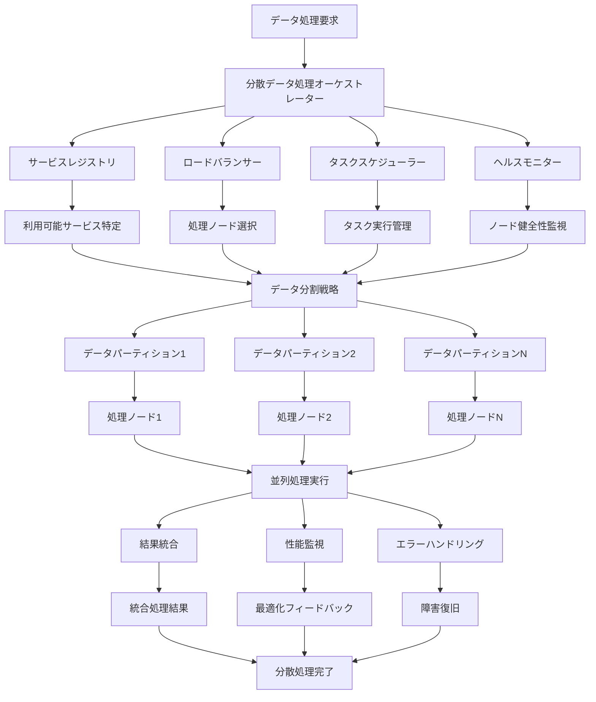

```typescript
// 概念実証コード 15-4-1-B: 動的スケーリング管理システム
class DynamicScalingManager {
  private metricsCollector: MetricsCollector;
  private scalingPolicyEngine: ScalingPolicyEngine;
  private resourceProvisioner: ResourceProvisioner;
  private costOptimizer: CostOptimizer;
  
  constructor() {
    this.metricsCollector = new MetricsCollector();
    this.scalingPolicyEngine = new ScalingPolicyEngine();
    this.resourceProvisioner = new ResourceProvisioner();
    this.costOptimizer = new CostOptimizer();
  }
  
  async manageAutoScaling(
    serviceCluster: ServiceCluster,
    scalingPolicies: ScalingPolicy[]
  ): Promise<ScalingDecision> {
    // 現在のメトリクス収集
    const currentMetrics = await this.metricsCollector.collectMetrics(
      serviceCluster
    );
    
    // スケーリング必要性の評価
    const scalingNeed = await this.evaluateScalingNeed(
      currentMetrics,
      scalingPolicies
    );
    
    if (!scalingNeed.isScalingRequired) {
      return {
        action: 'no_action',
        reason: scalingNeed.reason,
        currentState: currentMetrics
      };
    }
    
    // スケーリング戦略の決定
    const scalingStrategy = await this.scalingPolicyEngine.determineStrategy(
      scalingNeed,
      serviceCluster,
      scalingPolicies
    );
    
    // コスト影響の評価
    const costImpact = await this.costOptimizer.evaluateCostImpact(
      scalingStrategy,
      serviceCluster
    );
    
    // スケーリングの実行
    const scalingResult = await this.executeScaling(
      scalingStrategy,
      serviceCluster,
      costImpact
    );
    
    return {
      action: scalingStrategy.action,
      strategy: scalingStrategy,
      costImpact,
      result: scalingResult,
      executedAt: new Date()
    };
  }
  
  private async evaluateScalingNeed(
    metrics: ServiceMetrics,
    policies: ScalingPolicy[]
  ): Promise<ScalingNeedAssessment> {
    const evaluations: PolicyEvaluation[] = [];
    
    for (const policy of policies) {
      const evaluation = await this.evaluatePolicy(metrics, policy);
      evaluations.push(evaluation);
    }
    
    // 最も重要度の高いポリシー違反を特定
    const criticalViolations = evaluations.filter(e => e.isCritical);
    
    if (criticalViolations.length > 0) {
      return {
        isScalingRequired: true,
        reason: 'critical_policy_violation',
        triggeringPolicies: criticalViolations.map(v => v.policy),
        recommendedAction: await this.determineRecommendedAction(criticalViolations)
      };
    }
    
    // 予測的スケーリングの評価
    const predictiveNeed = await this.evaluatePredictiveScaling(metrics, policies);
    
    return {
      isScalingRequired: predictiveNeed.isRequired,
      reason: predictiveNeed.reason,
      confidence: predictiveNeed.confidence,
      recommendedAction: predictiveNeed.recommendedAction
    };
  }
  
  async optimizeResourceAllocation(
    serviceCluster: ServiceCluster,
    optimizationGoals: OptimizationGoals
  ): Promise<ResourceOptimizationResult> {
    // 現在のリソース使用状況分析
    const resourceUsage = await this.analyzeResourceUsage(serviceCluster);
    
    // 最適化機会の特定
    const optimizationOpportunities = await this.identifyOptimizationOpportunities(
      resourceUsage,
      optimizationGoals
    );
    
    // 最適化計画の作成
    const optimizationPlan = await this.createOptimizationPlan(
      optimizationOpportunities,
      serviceCluster
    );
    
    // 最適化の実行
    const optimizationResult = await this.executeOptimization(
      optimizationPlan,
      serviceCluster
    );
    
    return optimizationResult;
  }
}
```

```typescript
// 概念実証コード 15-4-1-C: 障害耐性分散システム
class FaultTolerantDistributedSystem {
  private circuitBreaker: CircuitBreaker;
  private retryManager: RetryManager;
  private failoverManager: FailoverManager;
  private dataReplicationManager: DataReplicationManager;
  
  constructor() {
    this.circuitBreaker = new CircuitBreaker();
    this.retryManager = new RetryManager();
    this.failoverManager = new FailoverManager();
    this.dataReplicationManager = new DataReplicationManager();
  }
  
  async executeResilientOperation(
    operation: DistributedOperation,
    resilienceConfig: ResilienceConfig
  ): Promise<ResilientOperationResult> {
    const operationId = this.generateOperationId(operation);
    
    try {
      // サーキットブレーカーによる実行制御
      const circuitState = await this.circuitBreaker.checkCircuit(
        operation.serviceEndpoint
      );
      
      if (circuitState === 'open') {
        return await this.handleCircuitOpen(operation, resilienceConfig);
      }
      
      // 主要実行パスでの操作実行
      const result = await this.executeWithRetry(operation, resilienceConfig);
      
      // 成功時のサーキットブレーカー更新
      await this.circuitBreaker.recordSuccess(operation.serviceEndpoint);
      
      return {
        operationId,
        result,
        executionPath: 'primary',
        attempts: 1,
        status: 'success'
      };
      
    } catch (error) {
      // 障害時のサーキットブレーカー更新
      await this.circuitBreaker.recordFailure(operation.serviceEndpoint);
      
      // フェイルオーバー実行
      const failoverResult = await this.executeFailover(
        operation,
        error,
        resilienceConfig
      );
      
      return failoverResult;
    }
  }
  
  private async executeWithRetry(
    operation: DistributedOperation,
    config: ResilienceConfig
  ): Promise<OperationResult> {
    const retryPolicy = config.retryPolicy;
    let lastError: Error;
    
    for (let attempt = 1; attempt <= retryPolicy.maxAttempts; attempt++) {
      try {
        const result = await this.executeOperation(operation);
        
        // 成功時は即座に結果を返す
        return result;
        
      } catch (error) {
        lastError = error;
        
        // 最後の試行でない場合は待機してリトライ
        if (attempt < retryPolicy.maxAttempts) {
          const waitTime = await this.retryManager.calculateWaitTime(
            attempt,
            retryPolicy
          );
          
          await this.wait(waitTime);
        }
      }
    }
    
    // 全ての試行が失敗した場合
    throw new Error(`Operation failed after ${retryPolicy.maxAttempts} attempts: ${lastError.message}`);
  }
  
  private async executeFailover(
    operation: DistributedOperation,
    primaryError: Error,
    config: ResilienceConfig
  ): Promise<ResilientOperationResult> {
    // フェイルオーバー候補の特定
    const failoverCandidates = await this.failoverManager.identifyFailoverCandidates(
      operation.serviceEndpoint,
      config.failoverPolicy
    );
    
    if (failoverCandidates.length === 0) {
      throw new Error(`No failover candidates available for ${operation.serviceEndpoint}`);
    }
    
    // フェイルオーバー実行
    for (const candidate of failoverCandidates) {
      try {
        const failoverOperation = await this.adaptOperationForFailover(
          operation,
          candidate
        );
        
        const result = await this.executeOperation(failoverOperation);
        
        return {
          operationId: this.generateOperationId(operation),
          result,
          executionPath: 'failover',
          failoverEndpoint: candidate.endpoint,
          primaryError: primaryError.message,
          status: 'success_with_failover'
        };
        
      } catch (failoverError) {
        // フェイルオーバーも失敗した場合は次の候補を試行
        continue;
      }
    }
    
    // 全てのフェイルオーバーが失敗
    throw new Error(`All failover attempts failed for operation ${operation.id}`);
  }
  
  async ensureDataConsistency(
    dataOperation: DataOperation,
    consistencyLevel: ConsistencyLevel
  ): Promise<ConsistencyResult> {
    switch (consistencyLevel) {
      case 'strong':
        return await this.ensureStrongConsistency(dataOperation);
      case 'eventual':
        return await this.ensureEventualConsistency(dataOperation);
      case 'weak':
        return await this.ensureWeakConsistency(dataOperation);
      default:
        throw new Error(`Unsupported consistency level: ${consistencyLevel}`);
    }
  }
  
  private async ensureStrongConsistency(
    operation: DataOperation
  ): Promise<ConsistencyResult> {
    // 分散ロックの取得
    const distributedLock = await this.acquireDistributedLock(operation.resourceId);
    
    try {
      // 全レプリカでの同期実行
      const replicationResults = await this.dataReplicationManager.replicateSync(
        operation,
        'all_replicas'
      );
      
      // 全レプリカの成功確認
      const allSuccessful = replicationResults.every(r => r.success);
      
      if (!allSuccessful) {
        // 失敗したレプリカのロールバック
        await this.rollbackFailedReplicas(replicationResults);
        throw new Error('Strong consistency requirement not met');
      }
      
      return {
        consistencyLevel: 'strong',
        replicationResults,
        status: 'consistent'
      };
      
    } finally {
      await this.releaseDistributedLock(distributedLock);
    }
  }
}
```

#### 分散処理の最適化戦略

**データ局所性の活用**
- データとコンピュートリソースの物理的近接性最適化
- ネットワーク転送量の最小化
- キャッシュ効率の向上

**負荷予測と事前スケーリング**
- 機械学習による負荷パターン予測
- 予防的リソース確保
- ピーク時の性能劣化防止

**コスト効率の最適化**
- リソース使用量の動的調整
- 優先度ベースのリソース配分
- 運用コストの継続的最適化

この分散処理アーキテクチャにより、トリプルパースペクティブ型戦略AIレーダーは、組織の成長と変化する要求に柔軟に対応し、継続的に高い性能と可用性を提供します。

### 15.4.2 並列処理最適化

トリプルパースペクティブ型戦略AIレーダーの3視点統合分析において、大量データの効率的な並列処理は、リアルタイム性と分析精度の両立に不可欠です。本セクションでは、CPU、GPU、メモリリソースを最適活用する並列処理システムの設計と実装について詳述します。

#### 並列処理の戦略的価値

**分析速度の劇的向上**
- 3視点同時分析による処理時間短縮
- リアルタイム意思決定支援の実現
- 競合他社に対する時間的優位性確保

**リソース効率の最大化**
- マルチコア・マルチGPU環境の完全活用
- 処理能力あたりのコスト効率向上
- インフラ投資対効果の最大化

**スケーラビリティの確保**
- データ量増加に対する線形性能向上
- 新規ハードウェアリソースの即座活用
- 将来的な拡張要求への対応

#### マルチレベル並列処理フレームワーク

データレベル、タスクレベル、パイプラインレベルの3層並列化により、最適な処理効率を実現します。

```typescript
// 概念実証コード 15-4-2-A: マルチレベル並列処理エンジン
class MultiLevelParallelProcessingEngine {
  private dataParallelizer: DataParallelizer;
  private taskParallelizer: TaskParallelizer;
  private pipelineParallelizer: PipelineParallelizer;
  private resourceManager: ResourceManager;
  
  constructor() {
    this.dataParallelizer = new DataParallelizer();
    this.taskParallelizer = new TaskParallelizer();
    this.pipelineParallelizer = new PipelineParallelizer();
    this.resourceManager = new ResourceManager();
  }
  
  async processTriplePerspectiveAnalysis(
    analysisRequest: TriplePerspectiveAnalysisRequest,
    parallelizationConfig: ParallelizationConfig
  ): Promise<ParallelProcessingResult> {
    // リソース可用性の評価
    const availableResources = await this.resourceManager.assessAvailableResources();
    
    // 並列化戦略の決定
    const parallelizationStrategy = await this.determineParallelizationStrategy(
      analysisRequest,
      availableResources,
      parallelizationConfig
    );
    
    // 3視点分析の並列実行
    const [
      technologyAnalysisResult,
      marketAnalysisResult,
      businessAnalysisResult
    ] = await Promise.all([
      this.executeTechnologyAnalysisParallel(
        analysisRequest.technologyData,
        parallelizationStrategy.technology
      ),
      this.executeMarketAnalysisParallel(
        analysisRequest.marketData,
        parallelizationStrategy.market
      ),
      this.executeBusinessAnalysisParallel(
        analysisRequest.businessData,
        parallelizationStrategy.business
      )
    ]);
    
    // 結果統合の並列処理
    const integrationResult = await this.integrateResultsParallel(
      {
        technology: technologyAnalysisResult,
        market: marketAnalysisResult,
        business: businessAnalysisResult
      },
      parallelizationStrategy.integration
    );
    
    return {
      requestId: analysisRequest.id,
      perspectiveResults: {
        technology: technologyAnalysisResult,
        market: marketAnalysisResult,
        business: businessAnalysisResult
      },
      integratedResult: integrationResult,
      parallelizationMetrics: await this.calculateParallelizationMetrics(
        parallelizationStrategy,
        availableResources
      )
    };
  }
  
  private async executeTechnologyAnalysisParallel(
    technologyData: TechnologyData,
    strategy: TechnologyParallelizationStrategy
  ): Promise<TechnologyAnalysisResult> {
    // データ並列化の実行
    const dataPartitions = await this.dataParallelizer.partitionTechnologyData(
      technologyData,
      strategy.dataPartitioning
    );
    
    // タスク並列化の設定
    const parallelTasks = await this.taskParallelizer.createTechnologyAnalysisTasks(
      dataPartitions,
      strategy.taskParallelization
    );
    
    // パイプライン並列化の実行
    const pipelineResults = await this.pipelineParallelizer.executeTechnologyPipeline(
      parallelTasks,
      strategy.pipelineParallelization
    );
    
    // 結果の統合
    const consolidatedResult = await this.consolidateTechnologyResults(
      pipelineResults,
      strategy
    );
    
    return consolidatedResult;
  }
  
  async optimizeParallelExecution(
    executionHistory: ExecutionHistory,
    resourceConstraints: ResourceConstraints
  ): Promise<OptimizationResult> {
    // 実行履歴の分析
    const performanceAnalysis = await this.analyzeExecutionPerformance(
      executionHistory
    );
    
    // ボトルネックの特定
    const bottlenecks = await this.identifyParallelizationBottlenecks(
      performanceAnalysis
    );
    
    // 最適化戦略の生成
    const optimizationStrategies = await this.generateOptimizationStrategies(
      bottlenecks,
      resourceConstraints
    );
    
    // 最適化の実行
    const optimizationResult = await this.executeOptimization(
      optimizationStrategies
    );
    
    return optimizationResult;
  }
}
```

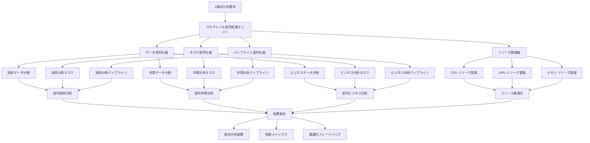

```typescript
// 概念実証コード 15-4-2-B: GPU加速分析エンジン
class GPUAcceleratedAnalysisEngine {
  private gpuResourceManager: GPUResourceManager;
  private kernelOptimizer: KernelOptimizer;
  private memoryManager: GPUMemoryManager;
  private performanceProfiler: GPUPerformanceProfiler;
  
  constructor() {
    this.gpuResourceManager = new GPUResourceManager();
    this.kernelOptimizer = new KernelOptimizer();
    this.memoryManager = new GPUMemoryManager();
    this.performanceProfiler = new GPUPerformanceProfiler();
  }
  
  async executeGPUAcceleratedAnalysis(
    analysisData: AnalysisData,
    gpuConfig: GPUAccelerationConfig
  ): Promise<GPUAnalysisResult> {
    // GPU リソースの確保
    const gpuResources = await this.gpuResourceManager.allocateResources(
      gpuConfig.resourceRequirements
    );
    
    try {
      // データのGPUメモリ転送
      const gpuData = await this.memoryManager.transferToGPU(
        analysisData,
        gpuResources
      );
      
      // カーネル最適化
      const optimizedKernels = await this.kernelOptimizer.optimizeKernels(
        gpuConfig.analysisKernels,
        gpuResources.capabilities
      );
      
      // GPU並列分析の実行
      const analysisResults = await this.executeParallelKernels(
        gpuData,
        optimizedKernels,
        gpuResources
      );
      
      // 結果のCPUメモリ転送
      const cpuResults = await this.memoryManager.transferToCPU(
        analysisResults,
        gpuResources
      );
      
      // 性能プロファイリング
      const performanceMetrics = await this.performanceProfiler.collectMetrics(
        gpuResources,
        optimizedKernels
      );
      
      return {
        results: cpuResults,
        performanceMetrics,
        gpuUtilization: await this.calculateGPUUtilization(performanceMetrics),
        speedupFactor: await this.calculateSpeedupFactor(performanceMetrics)
      };
      
    } finally {
      // GPU リソースの解放
      await this.gpuResourceManager.releaseResources(gpuResources);
    }
  }
  
  private async executeParallelKernels(
    gpuData: GPUData,
    kernels: OptimizedKernel[],
    resources: GPUResources
  ): Promise<GPUAnalysisResults> {
    const kernelResults: Map<string, KernelResult> = new Map();
    
    // カーネル依存関係の解析
    const dependencyGraph = await this.analyzeDependencies(kernels);
    
    // 実行順序の最適化
    const executionPlan = await this.optimizeExecutionOrder(
      dependencyGraph,
      resources
    );
    
    // 並列カーネル実行
    for (const executionStage of executionPlan.stages) {
      const stagePromises = executionStage.kernels.map(async (kernel) => {
        const result = await this.executeKernel(kernel, gpuData, resources);
        kernelResults.set(kernel.id, result);
        return result;
      });
      
      await Promise.all(stagePromises);
    }
    
    return {
      kernelResults,
      executionPlan,
      totalExecutionTime: executionPlan.totalTime
    };
  }
  
  async optimizeGPUMemoryUsage(
    analysisWorkload: AnalysisWorkload,
    memoryConstraints: GPUMemoryConstraints
  ): Promise<MemoryOptimizationResult> {
    // メモリ使用パターンの分析
    const memoryUsagePattern = await this.analyzeMemoryUsagePattern(
      analysisWorkload
    );
    
    // メモリ最適化戦略の生成
    const optimizationStrategies = await this.generateMemoryOptimizationStrategies(
      memoryUsagePattern,
      memoryConstraints
    );
    
    // 最適化の実行
    const optimizationResult = await this.executeMemoryOptimization(
      optimizationStrategies,
      analysisWorkload
    );
    
    return optimizationResult;
  }
}
```

```typescript
// 概念実証コード 15-4-2-C: 適応的負荷分散システム
class AdaptiveLoadBalancingSystem {
  private loadMonitor: LoadMonitor;
  private balancingAlgorithms: Map<string, LoadBalancingAlgorithm>;
  private performancePredictor: PerformancePredictor;
  private adaptationEngine: AdaptationEngine;
  
  constructor() {
    this.loadMonitor = new LoadMonitor();
    this.balancingAlgorithms = this.initializeBalancingAlgorithms();
    this.performancePredictor = new PerformancePredictor();
    this.adaptationEngine = new AdaptationEngine();
  }
  
  async distributeWorkload(
    workload: ProcessingWorkload,
    availableNodes: ProcessingNode[],
    distributionPolicy: DistributionPolicy
  ): Promise<WorkloadDistributionResult> {
    // 現在の負荷状況監視
    const currentLoad = await this.loadMonitor.getCurrentLoad(availableNodes);
    
    // ノード性能の予測
    const performancePredictions = await this.performancePredictor.predictPerformance(
      availableNodes,
      workload,
      currentLoad
    );
    
    // 最適分散アルゴリズムの選択
    const selectedAlgorithm = await this.selectOptimalAlgorithm(
      workload,
      performancePredictions,
      distributionPolicy
    );
    
    // ワークロード分散の実行
    const distributionResult = await selectedAlgorithm.distributeWorkload(
      workload,
      availableNodes,
      performancePredictions
    );
    
    // 分散効果の監視
    const distributionEffectiveness = await this.monitorDistributionEffectiveness(
      distributionResult
    );
    
    // 適応的調整の実行
    if (distributionEffectiveness.needsAdjustment) {
      const adjustmentResult = await this.adaptationEngine.adjustDistribution(
        distributionResult,
        distributionEffectiveness
      );
      
      return {
        ...distributionResult,
        adjustments: adjustmentResult,
        finalEffectiveness: await this.calculateFinalEffectiveness(adjustmentResult)
      };
    }
    
    return distributionResult;
  }
  
  private async selectOptimalAlgorithm(
    workload: ProcessingWorkload,
    predictions: PerformancePrediction[],
    policy: DistributionPolicy
  ): Promise<LoadBalancingAlgorithm> {
    const algorithmCandidates = Array.from(this.balancingAlgorithms.values());
    
    // 各アルゴリズムの効果予測
    const algorithmEvaluations = await Promise.all(
      algorithmCandidates.map(async (algorithm) => {
        const evaluation = await this.evaluateAlgorithm(
          algorithm,
          workload,
          predictions,
          policy
        );
        return { algorithm, evaluation };
      })
    );
    
    // 最適アルゴリズムの選択
    const bestAlgorithm = algorithmEvaluations.reduce((best, current) => {
      return current.evaluation.score > best.evaluation.score ? current : best;
    });
    
    return bestAlgorithm.algorithm;
  }
  
  async optimizeLoadBalancing(
    historicalPerformance: HistoricalPerformanceData,
    currentWorkloadPattern: WorkloadPattern
  ): Promise<LoadBalancingOptimizationResult> {
    // 性能履歴の分析
    const performanceAnalysis = await this.analyzeHistoricalPerformance(
      historicalPerformance
    );
    
    // ワークロードパターンの分析
    const patternAnalysis = await this.analyzeWorkloadPattern(
      currentWorkloadPattern
    );
    
    // 最適化機会の特定
    const optimizationOpportunities = await this.identifyOptimizationOpportunities(
      performanceAnalysis,
      patternAnalysis
    );
    
    // 最適化戦略の生成
    const optimizationStrategies = await this.generateOptimizationStrategies(
      optimizationOpportunities
    );
    
    // 最適化の実行
    const optimizationResult = await this.executeOptimization(
      optimizationStrategies
    );
    
    return optimizationResult;
  }
}
```

#### 並列処理性能の継続的最適化

**動的負荷調整**
- リアルタイム負荷監視による動的リソース配分
- ワークロード特性に応じた最適化戦略選択
- 性能劣化の予防的検出と対応

**ハードウェア特性の活用**
- CPU・GPU・メモリ階層の最適活用
- NUMA（Non-Uniform Memory Access）対応
- 最新ハードウェア機能の積極的活用

**アルゴリズム適応**
- ワークロード特性に応じたアルゴリズム選択
- 機械学習による最適化パラメータ調整
- 継続的性能改善

この並列処理最適化システムにより、トリプルパースペクティブ型戦略AIレーダーは、利用可能なハードウェアリソースを最大限活用し、高速で効率的な3視点統合分析を実現します。

### 15.4.3 キューイングとバッファリング

トリプルパースペクティブ型戦略AIレーダーにおいて、変動する処理負荷と多様な優先度要件に対応するため、インテリジェントなキューイングとバッファリングシステムが重要な役割を果たします。本セクションでは、効率的なデータフロー制御と処理最適化を実現するシステムについて詳述します。

#### キューイングシステムの戦略的価値

**処理効率の最大化**
- ピーク負荷時の処理能力維持
- リソース使用率の最適化
- 処理待ち時間の最小化

**ビジネス優先度の反映**
- 重要度に応じた処理順序制御
- SLA（Service Level Agreement）の確実な遵守
- 戦略的意思決定の迅速化

**システム安定性の確保**
- 負荷急増時の安定動作
- メモリ使用量の制御
- 障害時の処理継続性

#### 多層優先度キューイングシステム

ビジネス重要度、処理緊急度、リソース要件に基づく多次元優先度制御を実現します。

```typescript
// 概念実証コード 15-4-3-A: インテリジェント優先度キューイングシステム
class IntelligentPriorityQueuingSystem {
  private priorityCalculator: PriorityCalculator;
  private queueManager: QueueManager;
  private resourceEstimator: ResourceEstimator;
  private slaMonitor: SLAMonitor;
  
  constructor() {
    this.priorityCalculator = new PriorityCalculator();
    this.queueManager = new QueueManager();
    this.resourceEstimator = new ResourceEstimator();
    this.slaMonitor = new SLAMonitor();
  }
  
  async enqueueAnalysisRequest(
    request: AnalysisRequest,
    businessContext: BusinessContext
  ): Promise<QueueingResult> {
    // 多次元優先度の計算
    const priority = await this.priorityCalculator.calculatePriority(
      request,
      businessContext
    );
    
    // リソース要件の推定
    const resourceEstimate = await this.resourceEstimator.estimateResources(
      request
    );
    
    // 適切なキューの選択
    const targetQueue = await this.queueManager.selectOptimalQueue(
      priority,
      resourceEstimate,
      request.analysisType
    );
    
    // SLA要件の評価
    const slaRequirements = await this.slaMonitor.evaluateSLARequirements(
      request,
      businessContext
    );
    
    // キューへの追加
    const queueEntry = await this.queueManager.enqueue(
      targetQueue,
      {
        request,
        priority,
        resourceEstimate,
        slaRequirements,
        enqueuedAt: new Date()
      }
    );
    
    // 処理予測時間の計算
    const estimatedProcessingTime = await this.estimateProcessingTime(
      queueEntry,
      targetQueue
    );
    
    return {
      queueEntryId: queueEntry.id,
      queueName: targetQueue.name,
      priority: priority.overallPriority,
      estimatedWaitTime: estimatedProcessingTime.waitTime,
      estimatedCompletionTime: estimatedProcessingTime.completionTime,
      slaCompliance: await this.checkSLACompliance(
        estimatedProcessingTime,
        slaRequirements
      )
    };
  }
  
  async dequeueForProcessing(
    processingCapacity: ProcessingCapacity
  ): Promise<ProcessingBatch> {
    // 利用可能キューの評価
    const availableQueues = await this.queueManager.getAvailableQueues();
    
    // 最適処理バッチの構成
    const processingBatch = await this.constructOptimalBatch(
      availableQueues,
      processingCapacity
    );
    
    // バッチ処理の最適化
    const optimizedBatch = await this.optimizeBatchProcessing(
      processingBatch,
      processingCapacity
    );
    
    // キューからの削除
    await this.queueManager.removeBatchFromQueues(optimizedBatch);
    
    return optimizedBatch;
  }
  
  private async constructOptimalBatch(
    queues: Queue[],
    capacity: ProcessingCapacity
  ): Promise<ProcessingBatch> {
    const batchItems: QueueEntry[] = [];
    let remainingCapacity = { ...capacity };
    
    // 優先度順でのキュー処理
    const sortedQueues = queues.sort((a, b) => b.priority - a.priority);
    
    for (const queue of sortedQueues) {
      while (queue.hasItems() && this.hasRemainingCapacity(remainingCapacity)) {
        const candidate = queue.peek();
        
        // リソース要件の確認
        if (this.canAccommodate(candidate.resourceEstimate, remainingCapacity)) {
          const item = queue.dequeue();
          batchItems.push(item);
          
          // 残容量の更新
          remainingCapacity = this.updateRemainingCapacity(
            remainingCapacity,
            item.resourceEstimate
          );
        } else {
          break; // このキューからはこれ以上取得できない
        }
      }
    }
    
    return {
      items: batchItems,
      totalResourceRequirement: this.calculateTotalResourceRequirement(batchItems),
      estimatedProcessingTime: await this.estimateBatchProcessingTime(batchItems),
      batchId: this.generateBatchId()
    };
  }
  
  async optimizeQueuePerformance(
    performanceHistory: QueuePerformanceHistory,
    currentLoad: SystemLoad
  ): Promise<QueueOptimizationResult> {
    // 性能履歴の分析
    const performanceAnalysis = await this.analyzeQueuePerformance(
      performanceHistory
    );
    
    // ボトルネックの特定
    const bottlenecks = await this.identifyQueueBottlenecks(
      performanceAnalysis,
      currentLoad
    );
    
    // 最適化戦略の生成
    const optimizationStrategies = await this.generateQueueOptimizationStrategies(
      bottlenecks,
      performanceAnalysis
    );
    
    // 最適化の実行
    const optimizationResult = await this.executeQueueOptimization(
      optimizationStrategies
    );
    
    return optimizationResult;
  }
}
```

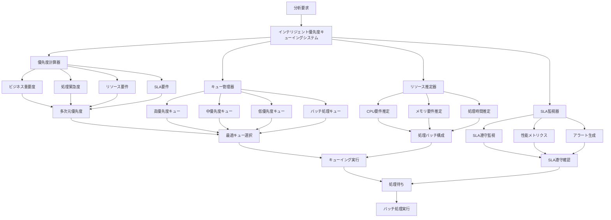

```typescript
// 概念実証コード 15-4-3-B: 適応的バッファリングシステム
class AdaptiveBufferingSystem {
  private bufferManager: BufferManager;
  private memoryOptimizer: MemoryOptimizer;
  private compressionEngine: CompressionEngine;
  private evictionPolicy: EvictionPolicy;
  
  constructor() {
    this.bufferManager = new BufferManager();
    this.memoryOptimizer = new MemoryOptimizer();
    this.compressionEngine = new CompressionEngine();
    this.evictionPolicy = new EvictionPolicy();
  }
  
  async bufferAnalysisData(
    data: AnalysisData,
    bufferingStrategy: BufferingStrategy
  ): Promise<BufferingResult> {
    // データ特性の分析
    const dataCharacteristics = await this.analyzeDataCharacteristics(data);
    
    // バッファリング戦略の最適化
    const optimizedStrategy = await this.optimizeBufferingStrategy(
      bufferingStrategy,
      dataCharacteristics
    );
    
    // メモリ使用量の評価
    const memoryRequirement = await this.evaluateMemoryRequirement(
      data,
      optimizedStrategy
    );
    
    // 利用可能メモリの確認
    const availableMemory = await this.bufferManager.getAvailableMemory();
    
    if (memoryRequirement.size > availableMemory.size) {
      // メモリ不足時の対応
      await this.handleMemoryShortage(memoryRequirement, availableMemory);
    }
    
    // データの圧縮（必要に応じて）
    const processedData = await this.applyCompression(data, optimizedStrategy);
    
    // バッファへの格納
    const bufferEntry = await this.bufferManager.store(
      processedData,
      optimizedStrategy
    );
    
    return {
      bufferId: bufferEntry.id,
      originalSize: data.size,
      bufferedSize: processedData.size,
      compressionRatio: data.size / processedData.size,
      bufferingStrategy: optimizedStrategy,
      estimatedRetrievalTime: await this.estimateRetrievalTime(bufferEntry)
    };
  }
  
  private async handleMemoryShortage(
    requirement: MemoryRequirement,
    available: AvailableMemory
  ): Promise<void> {
    const shortageAmount = requirement.size - available.size;
    
    // 退避候補の特定
    const evictionCandidates = await this.evictionPolicy.identifyEvictionCandidates(
      shortageAmount
    );
    
    // 退避の実行
    for (const candidate of evictionCandidates) {
      await this.evictBufferEntry(candidate);
      
      // 十分なメモリが確保できたかチェック
      const currentAvailable = await this.bufferManager.getAvailableMemory();
      if (currentAvailable.size >= requirement.size) {
        break;
      }
    }
  }
  
  async retrieveBufferedData(
    bufferId: string,
    retrievalOptions: RetrievalOptions
  ): Promise<RetrievalResult> {
    // バッファエントリの取得
    const bufferEntry = await this.bufferManager.getEntry(bufferId);
    
    if (!bufferEntry) {
      throw new Error(`Buffer entry not found: ${bufferId}`);
    }
    
    // データの展開（圧縮されている場合）
    const decompressedData = await this.decompress(
      bufferEntry.data,
      bufferEntry.compressionInfo
    );
    
    // アクセス統計の更新
    await this.updateAccessStatistics(bufferEntry, retrievalOptions);
    
    // プリフェッチの実行（必要に応じて）
    if (retrievalOptions.enablePrefetch) {
      await this.executePrefetch(bufferEntry, retrievalOptions);
    }
    
    return {
      data: decompressedData,
      retrievalTime: Date.now() - retrievalOptions.startTime,
      cacheHit: true,
      compressionRatio: bufferEntry.compressionRatio
    };
  }
  
  async optimizeBufferUsage(
    usageHistory: BufferUsageHistory,
    memoryConstraints: MemoryConstraints
  ): Promise<BufferOptimizationResult> {
    // 使用パターンの分析
    const usagePatterns = await this.analyzeUsagePatterns(usageHistory);
    
    // 最適化機会の特定
    const optimizationOpportunities = await this.identifyOptimizationOpportunities(
      usagePatterns,
      memoryConstraints
    );
    
    // 最適化戦略の生成
    const optimizationStrategies = await this.generateOptimizationStrategies(
      optimizationOpportunities
    );
    
    // 最適化の実行
    const optimizationResult = await this.executeBufferOptimization(
      optimizationStrategies
    );
    
    return optimizationResult;
  }
}
```

```typescript
// 概念実証コード 15-4-3-C: リアルタイムフロー制御システム
class RealTimeFlowControlSystem {
  private flowMonitor: FlowMonitor;
  private congestionController: CongestionController;
  private backpressureManager: BackpressureManager;
  private throughputOptimizer: ThroughputOptimizer;
  
  constructor() {
    this.flowMonitor = new FlowMonitor();
    this.congestionController = new CongestionController();
    this.backpressureManager = new BackpressureManager();
    this.throughputOptimizer = new ThroughputOptimizer();
  }
  
  async controlDataFlow(
    dataStream: DataStream,
    flowControlPolicy: FlowControlPolicy
  ): Promise<FlowControlResult> {
    // データフローの監視開始
    const flowMonitoring = await this.flowMonitor.startMonitoring(dataStream);
    
    try {
      // フロー制御の実行
      const controlResult = await this.executeFlowControl(
        dataStream,
        flowControlPolicy,
        flowMonitoring
      );
      
      return controlResult;
      
    } finally {
      // 監視の終了
      await this.flowMonitor.stopMonitoring(flowMonitoring);
    }
  }
  
  private async executeFlowControl(
    stream: DataStream,
    policy: FlowControlPolicy,
    monitoring: FlowMonitoring
  ): Promise<FlowControlResult> {
    const controlMetrics: FlowControlMetrics = {
      throughput: [],
      latency: [],
      congestionEvents: [],
      backpressureEvents: []
    };
    
    // リアルタイムフロー制御ループ
    while (stream.hasData()) {
      // 現在のフロー状態評価
      const flowState = await this.evaluateFlowState(stream, monitoring);
      
      // 輻輳制御の実行
      if (flowState.congestionLevel > policy.congestionThreshold) {
        const congestionAction = await this.congestionController.handleCongestion(
          flowState,
          policy.congestionPolicy
        );
        
        controlMetrics.congestionEvents.push(congestionAction);
      }
      
      // バックプレッシャー制御の実行
      if (flowState.backpressureLevel > policy.backpressureThreshold) {
        const backpressureAction = await this.backpressureManager.applyBackpressure(
          flowState,
          policy.backpressurePolicy
        );
        
        controlMetrics.backpressureEvents.push(backpressureAction);
      }
      
      // スループット最適化
      const throughputOptimization = await this.throughputOptimizer.optimize(
        flowState,
        policy.throughputPolicy
      );
      
      // メトリクスの記録
      controlMetrics.throughput.push(flowState.currentThroughput);
      controlMetrics.latency.push(flowState.currentLatency);
      
      // 次の制御サイクルまで待機
      await this.waitForNextControlCycle(policy.controlInterval);
    }
    
    return {
      controlMetrics,
      overallPerformance: await this.calculateOverallPerformance(controlMetrics),
      recommendations: await this.generateRecommendations(controlMetrics, policy)
    };
  }
  
  async optimizeFlowControl(
    historicalFlowData: HistoricalFlowData,
    performanceTargets: PerformanceTargets
  ): Promise<FlowControlOptimizationResult> {
    // フローパターンの分析
    const flowPatterns = await this.analyzeFlowPatterns(historicalFlowData);
    
    // 性能ボトルネックの特定
    const bottlenecks = await this.identifyFlowBottlenecks(
      flowPatterns,
      performanceTargets
    );
    
    // 最適化戦略の生成
    const optimizationStrategies = await this.generateFlowOptimizationStrategies(
      bottlenecks,
      flowPatterns
    );
    
    // 最適化の実行
    const optimizationResult = await this.executeFlowOptimization(
      optimizationStrategies
    );
    
    return optimizationResult;
  }
}
```

#### キューイング・バッファリングの統合最適化

**動的容量調整**
- 負荷パターンに応じたキュー容量の動的調整
- メモリ使用量の最適化
- 処理能力との動的バランシング

**予測的制御**
- 機械学習による負荷予測
- 予防的リソース確保
- 性能劣化の事前防止

**エンドツーエンド最適化**
- データ収集から分析完了までの全体最適化
- 処理段階間の効率的連携
- 総合的な性能向上

この包括的なキューイングとバッファリングシステムにより、トリプルパースペクティブ型戦略AIレーダーは、変動する負荷と多様な要求に対して、常に最適な性能と応答性を提供します。

### 15.4.4 性能監視と自動最適化

トリプルパースペクティブ型戦略AIレーダーの継続的な価値提供には、システム性能の詳細な監視と、検出された問題に対する自動的な最適化が不可欠です。本セクションでは、包括的な性能監視システムと、機械学習を活用した自動最適化機能について詳述します。

#### 性能監視の戦略的重要性

**継続的価値提供の確保**
- システム性能劣化の早期検出
- ビジネス影響の最小化
- サービス品質の一貫した維持

**運用効率の最大化**
- 問題の予防的解決
- 手動介入の最小化
- 運用コストの削減

**戦略的意思決定の支援**
- 性能データに基づく投資判断
- 容量計画の最適化
- 技術戦略の継続的改善

#### 多層性能監視アーキテクチャ

アプリケーション、システム、インフラストラクチャの各層で包括的な監視を実現し、全体的な性能状況を把握します。

```typescript
// 概念実証コード 15-4-4-A: 包括的性能監視システム
class ComprehensivePerformanceMonitoringSystem {
  private metricsCollector: MetricsCollector;
  private alertManager: AlertManager;
  private trendAnalyzer: TrendAnalyzer;
  private anomalyDetector: AnomalyDetector;
  
  constructor() {
    this.metricsCollector = new MetricsCollector();
    this.alertManager = new AlertManager();
    this.trendAnalyzer = new TrendAnalyzer();
    this.anomalyDetector = new AnomalyDetector();
  }
  
  async initializeMonitoring(
    monitoringTargets: MonitoringTarget[],
    monitoringConfig: MonitoringConfiguration
  ): Promise<MonitoringSession> {
    // 監視セッションの作成
    const sessionId = this.generateSessionId();
    
    // 各監視対象の初期化
    const initializedTargets = await Promise.all(
      monitoringTargets.map(target => 
        this.initializeTarget(target, monitoringConfig)
      )
    );
    
    // メトリクス収集の開始
    const collectionStreams = await this.startMetricsCollection(
      initializedTargets,
      monitoringConfig
    );
    
    // アラート監視の開始
    const alertMonitoring = await this.alertManager.startAlertMonitoring(
      collectionStreams,
      monitoringConfig.alertRules
    );
    
    return {
      sessionId,
      targets: initializedTargets,
      collectionStreams,
      alertMonitoring,
      startTime: new Date()
    };
  }
  
  async collectPerformanceMetrics(
    session: MonitoringSession,
    collectionInterval: number
  ): Promise<PerformanceMetricsSnapshot> {
    const collectionStartTime = Date.now();
    
    // 並列メトリクス収集
    const [
      applicationMetrics,
      systemMetrics,
      infrastructureMetrics,
      businessMetrics
    ] = await Promise.all([
      this.collectApplicationMetrics(session.targets),
      this.collectSystemMetrics(session.targets),
      this.collectInfrastructureMetrics(session.targets),
      this.collectBusinessMetrics(session.targets)
    ]);
    
    // メトリクスの統合
    const integratedMetrics = await this.integrateMetrics({
      application: applicationMetrics,
      system: systemMetrics,
      infrastructure: infrastructureMetrics,
      business: businessMetrics
    });
    
    // 異常検出の実行
    const anomalies = await this.anomalyDetector.detectAnomalies(
      integratedMetrics,
      session.historicalBaseline
    );
    
    // トレンド分析の実行
    const trendAnalysis = await this.trendAnalyzer.analyzeTrends(
      integratedMetrics,
      session.historicalData
    );
    
    return {
      sessionId: session.sessionId,
      timestamp: new Date(),
      metrics: integratedMetrics,
      anomalies,
      trendAnalysis,
      collectionTime: Date.now() - collectionStartTime
    };
  }
  
  private async collectApplicationMetrics(
    targets: MonitoringTarget[]
  ): Promise<ApplicationMetrics> {
    const applicationTargets = targets.filter(t => t.type === 'application');
    
    const metricsPromises = applicationTargets.map(async (target) => {
      return {
        targetId: target.id,
        metrics: await this.metricsCollector.collectApplicationMetrics(target)
      };
    });
    
    const results = await Promise.all(metricsPromises);
    
    return {
      responseTime: this.aggregateResponseTimes(results),
      throughput: this.aggregateThroughput(results),
      errorRate: this.aggregateErrorRates(results),
      resourceUtilization: this.aggregateResourceUtilization(results),
      customMetrics: this.aggregateCustomMetrics(results)
    };
  }
  
  async generatePerformanceReport(
    session: MonitoringSession,
    reportPeriod: ReportPeriod
  ): Promise<PerformanceReport> {
    // 期間内のメトリクス取得
    const periodMetrics = await this.getMetricsForPeriod(
      session,
      reportPeriod
    );
    
    // 性能分析の実行
    const performanceAnalysis = await this.analyzePerformance(
      periodMetrics,
      reportPeriod
    );
    
    // 改善推奨事項の生成
    const recommendations = await this.generateRecommendations(
      performanceAnalysis
    );
    
    // 容量計画の更新
    const capacityPlan = await this.updateCapacityPlan(
      performanceAnalysis,
      recommendations
    );
    
    return {
      reportPeriod,
      performanceAnalysis,
      recommendations,
      capacityPlan,
      executiveSummary: await this.generateExecutiveSummary(performanceAnalysis),
      generatedAt: new Date()
    };
  }
}
```

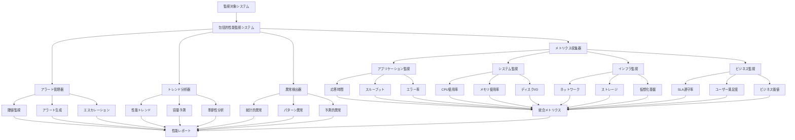

```typescript
// 概念実証コード 15-4-4-B: 機械学習駆動自動最適化エンジン
class MLDrivenAutoOptimizationEngine {
  private performancePredictor: PerformancePredictor;
  private optimizationStrategist: OptimizationStrategist;
  private configurationManager: ConfigurationManager;
  private effectivenessEvaluator: EffectivenessEvaluator;
  
  constructor() {
    this.performancePredictor = new PerformancePredictor();
    this.optimizationStrategist = new OptimizationStrategist();
    this.configurationManager = new ConfigurationManager();
    this.effectivenessEvaluator = new EffectivenessEvaluator();
  }
  
  async executeAutoOptimization(
    performanceData: PerformanceData,
    optimizationGoals: OptimizationGoals
  ): Promise<AutoOptimizationResult> {
    // 性能予測の実行
    const performancePrediction = await this.performancePredictor.predict(
      performanceData,
      optimizationGoals.predictionHorizon
    );
    
    // 最適化機会の特定
    const optimizationOpportunities = await this.identifyOptimizationOpportunities(
      performanceData,
      performancePrediction,
      optimizationGoals
    );
    
    // 最適化戦略の生成
    const optimizationStrategies = await this.optimizationStrategist.generateStrategies(
      optimizationOpportunities,
      optimizationGoals
    );
    
    // 戦略の評価と選択
    const selectedStrategy = await this.selectOptimalStrategy(
      optimizationStrategies,
      performanceData
    );
    
    // 最適化の実行
    const optimizationExecution = await this.executeOptimization(
      selectedStrategy,
      performanceData
    );
    
    // 効果の評価
    const effectivenessEvaluation = await this.effectivenessEvaluator.evaluate(
      optimizationExecution,
      optimizationGoals
    );
    
    return {
      strategy: selectedStrategy,
      execution: optimizationExecution,
      effectiveness: effectivenessEvaluation,
      learningUpdate: await this.updateLearningModel(
        selectedStrategy,
        effectivenessEvaluation
      )
    };
  }
  
  private async executeOptimization(
    strategy: OptimizationStrategy,
    performanceData: PerformanceData
  ): Promise<OptimizationExecution> {
    const executionPlan = await this.createExecutionPlan(strategy, performanceData);
    const executionResults: OptimizationStepResult[] = [];
    
    for (const step of executionPlan.steps) {
      try {
        const stepResult = await this.executeOptimizationStep(step, performanceData);
        executionResults.push(stepResult);
        
        // ステップ間での性能検証
        const intermediateValidation = await this.validateIntermediatePerformance(
          stepResult,
          strategy.expectedImpact
        );
        
        if (!intermediateValidation.isValid) {
          // 最適化の中断とロールバック
          await this.rollbackOptimization(executionResults);
          throw new Error(`Optimization step failed validation: ${intermediateValidation.reason}`);
        }
        
      } catch (error) {
        return {
          status: 'failed',
          completedSteps: executionResults,
          error: error.message,
          rollbackRequired: true
        };
      }
    }
    
    return {
      status: 'completed',
      completedSteps: executionResults,
      totalImpact: await this.calculateTotalImpact(executionResults),
      executionTime: executionPlan.actualExecutionTime
    };
  }
  
  async learnFromOptimization(
    optimizationHistory: OptimizationHistory,
    performanceOutcomes: PerformanceOutcome[]
  ): Promise<LearningUpdate> {
    // 最適化パターンの分析
    const optimizationPatterns = await this.analyzeOptimizationPatterns(
      optimizationHistory
    );
    
    // 成功要因の特定
    const successFactors = await this.identifySuccessFactors(
      optimizationHistory,
      performanceOutcomes
    );
    
    // 予測モデルの更新
    const modelUpdate = await this.performancePredictor.updateModel(
      optimizationPatterns,
      successFactors
    );
    
    // 戦略生成の改善
    const strategistUpdate = await this.optimizationStrategist.improveStrategies(
      optimizationPatterns,
      successFactors
    );
    
    return {
      modelUpdate,
      strategistUpdate,
      improvedAccuracy: await this.calculateImprovedAccuracy(modelUpdate),
      learningConfidence: await this.calculateLearningConfidence(
        optimizationPatterns,
        successFactors
      )
    };
  }
}
```

```typescript
// 概念実証コード 15-4-4-C: 予測的性能管理システム
class PredictivePerformanceManagementSystem {
  private capacityPredictor: CapacityPredictor;
  private demandForecaster: DemandForecaster;
  private resourcePlanner: ResourcePlanner;
  private proactiveOptimizer: ProactiveOptimizer;
  
  constructor() {
    this.capacityPredictor = new CapacityPredictor();
    this.demandForecaster = new DemandForecaster();
    this.resourcePlanner = new ResourcePlanner();
    this.proactiveOptimizer = new ProactiveOptimizer();
  }
  
  async executePredictiveManagement(
    historicalData: HistoricalPerformanceData,
    businessForecasts: BusinessForecast[]
  ): Promise<PredictiveManagementResult> {
    // 需要予測の実行
    const demandForecast = await this.demandForecaster.forecast(
      historicalData,
      businessForecasts
    );
    
    // 容量予測の実行
    const capacityForecast = await this.capacityPredictor.predict(
      historicalData.capacityData,
      demandForecast
    );
    
    // 容量ギャップの分析
    const capacityGapAnalysis = await this.analyzeCapacityGaps(
      demandForecast,
      capacityForecast
    );
    
    // 予防的最適化の実行
    const proactiveOptimizations = await this.proactiveOptimizer.optimize(
      capacityGapAnalysis,
      historicalData
    );
    
    // リソース計画の更新
    const resourcePlan = await this.resourcePlanner.updatePlan(
      capacityGapAnalysis,
      proactiveOptimizations
    );
    
    return {
      demandForecast,
      capacityForecast,
      capacityGapAnalysis,
      proactiveOptimizations,
      resourcePlan,
      recommendedActions: await this.generateRecommendedActions(
        capacityGapAnalysis,
        resourcePlan
      )
    };
  }
  
  async optimizeResourceAllocation(
    currentAllocation: ResourceAllocation,
    predictedDemand: DemandPrediction,
    constraints: ResourceConstraints
  ): Promise<OptimizedAllocation> {
    // 現在の配分効率の評価
    const allocationEfficiency = await this.evaluateAllocationEfficiency(
      currentAllocation,
      predictedDemand
    );
    
    // 最適化目標の設定
    const optimizationObjectives = await this.setOptimizationObjectives(
      allocationEfficiency,
      constraints
    );
    
    // 最適配分の計算
    const optimizedAllocation = await this.calculateOptimalAllocation(
      predictedDemand,
      constraints,
      optimizationObjectives
    );
    
    // 移行計画の作成
    const migrationPlan = await this.createMigrationPlan(
      currentAllocation,
      optimizedAllocation,
      constraints
    );
    
    return {
      optimizedAllocation,
      migrationPlan,
      expectedImprovement: await this.calculateExpectedImprovement(
        currentAllocation,
        optimizedAllocation
      ),
      riskAssessment: await this.assessMigrationRisks(migrationPlan)
    };
  }
  
  async generateCapacityPlan(
    forecastHorizon: ForecastHorizon,
    businessGrowthScenarios: GrowthScenario[]
  ): Promise<CapacityPlan> {
    // シナリオ別容量要件の計算
    const scenarioCapacityRequirements = await Promise.all(
      businessGrowthScenarios.map(scenario =>
        this.calculateScenarioCapacity(scenario, forecastHorizon)
      )
    );
    
    // リスク調整容量の計算
    const riskAdjustedCapacity = await this.calculateRiskAdjustedCapacity(
      scenarioCapacityRequirements
    );
    
    // 投資計画の作成
    const investmentPlan = await this.createInvestmentPlan(
      riskAdjustedCapacity,
      forecastHorizon
    );
    
    // 段階的実装計画の作成
    const implementationPlan = await this.createImplementationPlan(
      investmentPlan,
      forecastHorizon
    );
    
    return {
      forecastHorizon,
      scenarioCapacityRequirements,
      riskAdjustedCapacity,
      investmentPlan,
      implementationPlan,
      contingencyPlans: await this.createContingencyPlans(
        scenarioCapacityRequirements
      )
    };
  }
}
```

#### 性能監視・最適化の継続的改善

**学習型最適化**
- 最適化効果の継続的学習
- 予測精度の向上
- 戦略生成の改善

**予測的管理**
- 問題発生前の予防的対応
- 容量計画の最適化
- リスク管理の強化

**自動化の拡張**
- 手動介入の段階的削減
- 運用効率の継続的向上
- 人的リソースの戦略的活用

この包括的な性能監視と自動最適化システムにより、トリプルパースペクティブ型戦略AIレーダーは、継続的に最適な性能を維持し、組織の成長と変化する要求に自動的に適応します。

