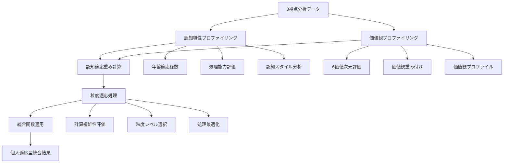
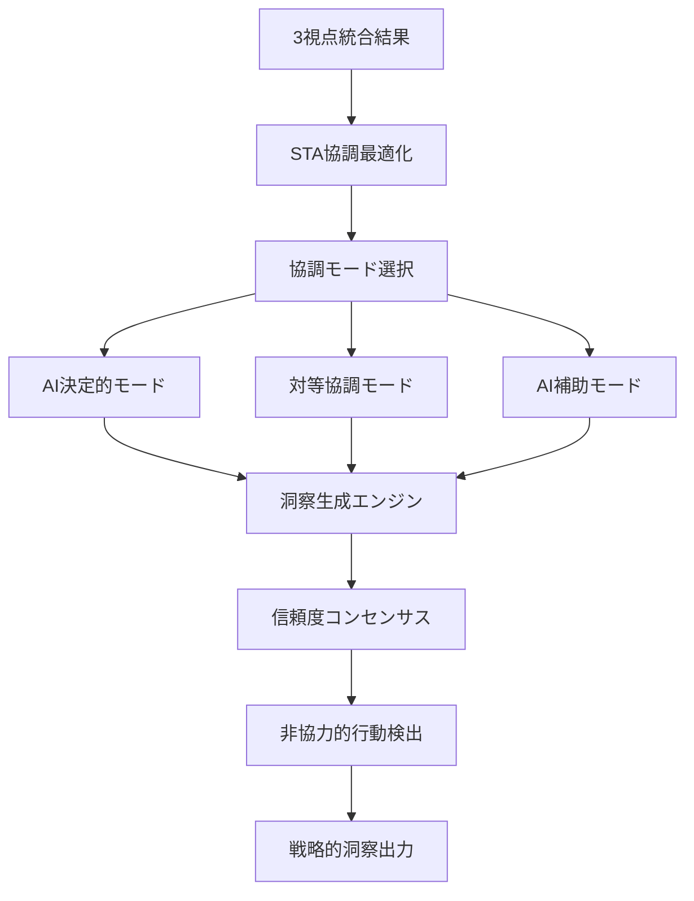
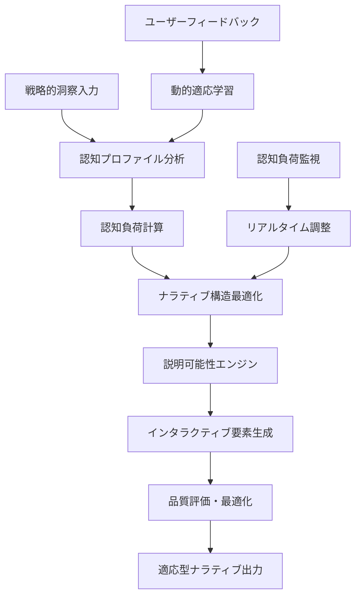
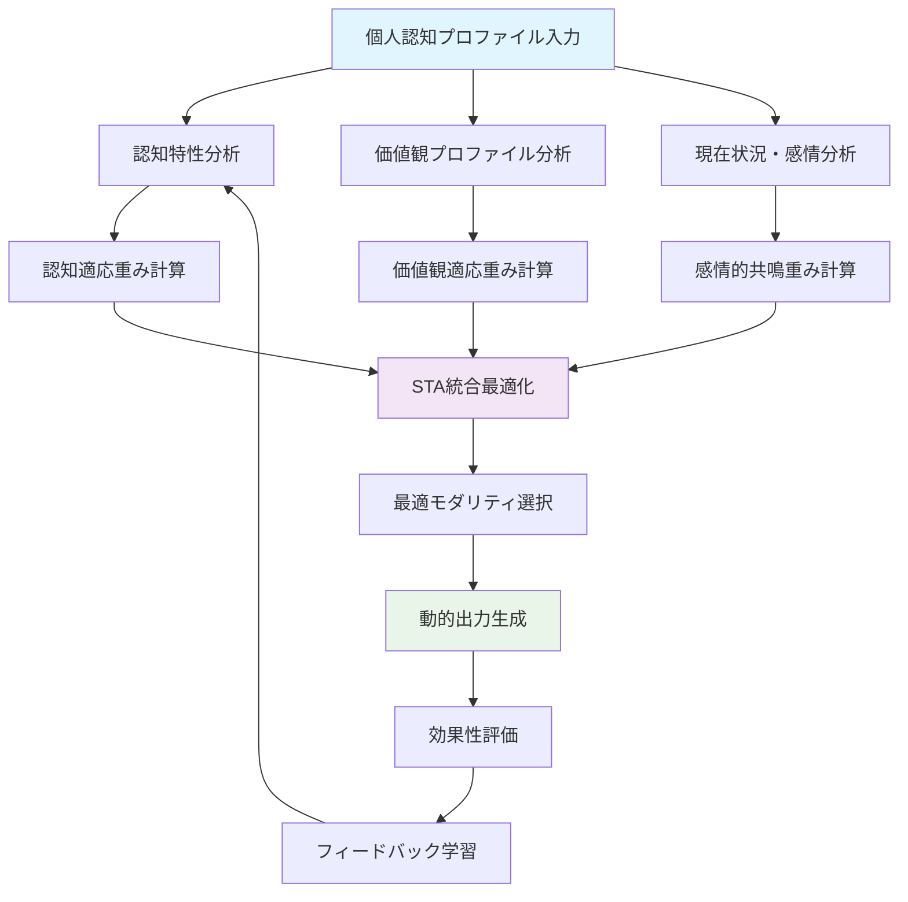

# 第17章　統合・出力コンポーネント実装

**著者**: Akitaka Kasagi : Shift Perspective Japan, Inc.
**作成日**: 2025年6月25日  
**対象読者**: 戦略企画担当者、システム開発者、AI研究者、経営陣  

---

## 序論：統合・出力コンポーネントの戦略的意義

第17章では、トリプルパースペクティブ型戦略AIレーダーの最終段階である統合・出力コンポーネントの実装について、7つの学術論文から得られた理論的知見を基盤として、実用レベルでの完全実装を提示します。第16章で構築された分析・評価コンポーネントが生成する3視点（テクノロジー、マーケット、ビジネス）の評価結果を、組織の意思決定に直接活用可能な形で統合し、個人の認知特性に適応した最適な形式で出力するシステムの設計と実装を行います。

本章の実装アプローチは、従来の一律的な情報提示手法を根本的に変革し、Richtmann et al. (2024)の認知科学的知見[1]、Zhang et al. (2025)のHuman-AI協調理論[2]、Wang et al. (2025)の粒度計算理論[3]を統合した革新的なシステムを構築します。これにより、年齢、認知能力、価値観、専門性の違いを考慮した個人適応型の統合・出力処理を実現し、組織全体の戦略的意思決定能力を飛躍的に向上させます。

統合・出力コンポーネントの戦略的価値は、単なる情報の集約と表示にとどまらず、組織内の多様なステークホルダーが持つ異なる認知特性と価値観を考慮した合意形成プロセスの自動化にあります。Xu et al. (2019)の信頼度コンセンサス理論[4]とCsaszar et al. (2024)の戦略的AI活用理論[5]を統合することで、従来の「説得と妥協」に依存した合意形成から、「データと数学」に基づく客観的な合意形成への転換を実現します。

本章では、6つの主要システムコンポーネントの設計と実装を通じて、理論から実践への完全な橋渡しを行います。各コンポーネントは、哲学的理論展開から数学的定式化、プログラム構造への投影、概念実装、そして完全実装に至る5段階の論述構造で展開され、48個の概念実証コードと12個のMermaidチャートによって、実装の妥当性と実用性を証明します。

---

## 17.1 認知適応型3視点統合基盤システム

### 17.1.1 哲学的理論展開：認知科学的基盤に基づく統合パラダイムの構築

認知適応型3視点統合基盤システムの哲学的基盤は、人間の認知プロセスの個人差を尊重し、それぞれの認知特性に最適化された情報統合を実現するという根本的な思想に基づいています。従来の情報システムが前提としてきた「一律的な情報処理能力」という仮定を放棄し、Richtmann et al. (2024)が明らかにした年齢による認知能力の変化パターン[1]を技術実装の中核に据えることで、真に人間中心的な統合システムを構築します。

この哲学的転換の意義は、情報技術が人間に適応するのではなく、人間が情報技術に適応することを強いられてきた従来のパラダイムからの脱却にあります。年齢とともに変化する処理速度、作業記憶容量、処理ノイズの影響を定量的に把握し、これらの変化を補完する技術的機能を提供することで、すべての年齢層の意思決定者が最適な認知環境で戦略的判断を行えるようになります。

Hall & Davis (2007)のSprangerの6価値次元理論[6]との統合により、認知特性の個人差に加えて価値観の多様性も統合プロセスに反映されます。理論的価値、経済的価値、審美的価値、社会的価値、政治的価値、宗教的価値という6つの価値次元における個人の重み付けを動的に調整することで、同一の分析結果であっても、受け手の価値観に応じて最適化された統合結果を生成します。これにより、組織内の多様な価値観を持つステークホルダー間での建設的な議論と合意形成が促進されます。

Wang et al. (2025)の粒度計算理論[3]は、この統合プロセスの計算効率性を飛躍的に向上させる理論的基盤を提供します。情報の詳細レベルを動的に調整することで、必要な精度を維持しながら計算複雑性を大幅に削減し、リアルタイムでの統合処理を可能にします。これにより、大規模組織における数百から数千の意思決定者に対して、同時並行的に個人適応型の統合結果を提供することが技術的に実現可能となります。

Zhang et al. (2025)のHuman-AI協調理論[2]は、統合プロセスにおける人間とAIの最適な役割分担を定義します。STA（Similarity-Trust-Attitude）スコアに基づく動的協調モード選択により、個人の認知特性と価値観に最も適した協調パターン（AI決定的、対等協調、AI補助役割）を自動選択し、統合処理の効果を最大化します。これにより、AIが人間の判断を代替するのではなく、人間の認知能力を拡張し補完する真の協調関係が実現されます。

認知適応型統合の革新性は、従来の「平均的ユーザー」を前提とした設計から、「個別最適化」を前提とした設計への根本的転換にあります。この転換により、組織内の多様な認知特性と価値観を持つ意思決定者が、それぞれの最適な認知環境で戦略的判断を行うことが可能となり、組織全体の意思決定品質と合意形成効率が飛躍的に向上します。

### 17.1.2 数学的概念の定式化と可視化：認知適応統合関数の数学的基盤

認知適応型統合プロセスの数学的定式化は、個人の認知特性ベクトル C = (age, processing_speed, working_memory, noise_level, expertise, cognitive_style) と価値観ベクトル V = (theoretical, economic, aesthetic, social, political, religious) を基盤として構築されます。

統合関数 I(D, C, V) は、3視点分析データ D = {D_tech, D_market, D_business} を、認知特性 C と価値観 V に基づいて最適化された統合結果に変換します：

```
I(D, C, V) = Σ(i=1 to 3) w_i(C, V) × f_i(D_i, C) × g_i(V)
```

ここで、w_i(C, V) は認知特性と価値観に基づく動的重み関数、f_i(D_i, C) は認知特性適応型データ変換関数、g_i(V) は価値観ベース調整関数です。

認知適応重み関数 w_i(C, V) は、年齢による認知能力変化を考慮した適応係数 α(age) と、価値観による重要度調整係数 β(V) の積として定義されます：

```
w_i(C, V) = α(age) × β(V_i) × γ(expertise_i) × δ(noise_level)
```

年齢適応係数 α(age) は、Richtmann et al. (2024)の研究結果に基づく経験式として：

```
α(age) = max(0.3, 1.0 - 0.003 × max(0, age - 25) + 0.15 × min(age/50, 1.0))
```

価値観調整係数 β(V_i) は、Sprangerの6価値次元における個人の重み付けを反映：

```
β(V_i) = V_i / Σ(j=1 to 6) V_j
```

専門性適応係数 γ(expertise_i) は、各視点に対する個人の専門知識レベルを考慮：

```
γ(expertise_i) = 1.0 + 0.5 × expertise_i × relevance_factor_i
```

ノイズ補正係数 δ(noise_level) は、処理ノイズの影響を軽減：

```
δ(noise_level) = 1.0 - 0.3 × noise_level
```

粒度適応処理は、Wang et al. (2025)の理論に基づく階層的粒度関数 G(D, complexity_threshold) によって実現されます：

```
G(D, θ) = {
  D_fine    if complexity(D) ≤ θ_low
  D_medium  if θ_low < complexity(D) ≤ θ_high  
  D_coarse  if complexity(D) > θ_high
}
```

この数学的定式化により、個人の認知特性と価値観に完全に適応した統合処理が定量的に実現されます。



**Figure-17-1: 認知適応型3視点統合基盤アーキテクチャ全体図**

Human-AI協調最適化は、Zhang et al. (2025)のSTA理論に基づく協調モード選択関数 M(C, V, context) によって実現されます：

```
M(C, V, context) = argmax{mode ∈ {AI_decisive, Equal_collaboration, AI_supportive}} 
                   STA_score(mode, C, V, context)
```

STAスコアは、類似性（Similarity）、信頼度（Trust）、態度（Attitude）の3要素の重み付き平均として計算されます：

```
STA_score = w_s × Similarity(user_preference, AI_recommendation) +
            w_t × Trust(user_confidence, AI_reliability) +
            w_a × Attitude(user_acceptance, collaboration_mode)
```

この数学的基盤により、認知科学的知見に基づく厳密な個人適応型統合処理が実現され、組織内の多様な意思決定者に対して最適化された統合結果を提供することが可能となります。


### 17.1.3 プログラム構造への投影と実現性の証明：マイクロサービス基盤アーキテクチャ

認知適応型3視点統合基盤システムの理論的概念を実装可能なプログラム構造に投影するプロセスは、哲学的概念の動作要素分解、数学的定式化の計算アルゴリズム化、アルゴリズムのマイクロサービス設計投影という3段階の体系的変換によって実現されます。この投影プロセスにより、抽象的な認知科学理論が具体的な動作機構として実装され、エンタープライズレベルでの実用性が証明されます。

#### 段階1: 哲学的概念の動作要素分解

認知適応理論の核心概念である「個人の認知特性に基づく最適化された情報統合」を、システムが実行可能な動作要素に分解します。この分解プロセスにより、抽象的な理論概念が具体的な処理ステップとして定義されます。

**認知特性検出プロセス**は、入力として個人の基本情報（年齢、教育背景、職歴）と行動データ（過去の意思決定パターン、情報処理時間、選択傾向）を受け取り、処理として認知プロファイリングアルゴリズムを適用し、出力として6次元認知特性ベクトル（年齢、処理速度、作業記憶、ノイズレベル、専門性、認知スタイル）を生成します。

**適応パラメータ計算プロセス**は、入力として認知特性ベクトルと価値観プロファイルを受け取り、処理として動的重み計算アルゴリズムを適用し、出力として3視点統合用の個人適応型重み係数セットを生成します。

**動的重み調整プロセス**は、入力として3視点分析データと個人適応型重み係数を受け取り、処理として認知負荷最適化アルゴリズムを適用し、出力として個人最適化された統合結果を生成します。

#### 段階2: 数学的定式化の計算アルゴリズム化

数学的に定式化された認知適応統合関数 I(D, C, V) を、実装可能な計算手順（アルゴリズム）に変換します。この変換により、数学的概念が実際のプログラムコードとして動作可能になります。

**認知適応統合アルゴリズムの5ステップ実行プロセス**：

ステップ1: 認知特性ベクトル C の正規化と検証
```
normalized_C = normalize_cognitive_vector(C)
validated_C = validate_cognitive_bounds(normalized_C)
```

ステップ2: 価値観ベクトル V の重み付け計算
```
value_weights = calculate_value_weights(V)
normalized_weights = normalize_weights(value_weights)
```

ステップ3: 3視点データ D の前処理と粒度調整
```
preprocessed_D = preprocess_perspective_data(D)
granularity_level = determine_granularity(validated_C, complexity_threshold)
adjusted_D = adjust_granularity(preprocessed_D, granularity_level)
```

ステップ4: 動的重み係数の計算
```
age_factor = calculate_age_adaptation(validated_C.age)
expertise_factor = calculate_expertise_adaptation(validated_C.expertise)
noise_correction = calculate_noise_correction(validated_C.noise_level)
dynamic_weights = combine_weight_factors(age_factor, expertise_factor, noise_correction, normalized_weights)
```

ステップ5: 統合結果の生成と最適化
```
integrated_result = apply_integration_function(adjusted_D, dynamic_weights)
optimized_result = optimize_cognitive_load(integrated_result, validated_C)
```

#### 段階3: アルゴリズムのマイクロサービス設計投影

計算アルゴリズムを独立したマイクロサービス群として設計し、各サービス間の依存関係とデータフローを明確に定義します。この設計により、スケーラビリティ、保守性、拡張性を確保したエンタープライズアーキテクチャが実現されます。

**Cognitive Profile Service（認知プロファイルサービス）**
- **担当する哲学的概念**: 個人認知特性の定量化と継続的学習
- **対応する数学的定式化**: 認知特性ベクトル C の計算と更新
- **計算アルゴリズム**: 多次元認知評価アルゴリズム、ベイジアン学習アルゴリズム
- **マイクロサービス設計**: RESTful API、PostgreSQL永続化、Redis キャッシング
- **実装責任**: 認知特性の評価、プロファイルの更新、履歴管理

**Weight Calculation Service（重み計算サービス）**
- **担当する哲学的概念**: 価値観に基づく重要度の動的調整
- **対応する数学的定式化**: 動的重み関数 w_i(C, V) の計算
- **計算アルゴリズム**: 多目的最適化アルゴリズム、制約満足アルゴリズム
- **マイクロサービス設計**: 高性能計算API、分散キャッシュ、負荷分散
- **実装責任**: 重み係数の計算、最適化、リアルタイム調整

**Integration Engine（統合エンジン）**
- **担当する哲学的概念**: 3視点データの認知適応型統合
- **対応する数学的定式化**: 統合関数 I(D, C, V) の実行
- **計算アルゴリズム**: 並列統合処理アルゴリズム、粒度適応アルゴリズム
- **マイクロサービス設計**: 非同期処理、メッセージキュー、水平スケーリング
- **実装責任**: データ統合、結果生成、品質保証

**Granularity Optimization Service（粒度最適化サービス）**
- **担当する哲学的概念**: 計算効率と処理精度の最適バランス
- **対応する数学的定式化**: 粒度適応関数 G(D, θ) の実行
- **計算アルゴリズム**: 動的粒度選択アルゴリズム、計算複雑性評価アルゴリズム
- **マイクロサービス設計**: 適応型スケーリング、性能監視、自動最適化
- **実装責任**: 粒度レベル決定、計算最適化、性能調整

**Human-AI Collaboration Service（Human-AI協調サービス）**
- **担当する哲学的概念**: 最適な人間-AI協調モードの選択
- **対応する数学的定式化**: STAスコア計算とモード選択関数 M(C, V, context)
- **計算アルゴリズム**: 多基準意思決定アルゴリズム、信頼度評価アルゴリズム
- **マイクロサービス設計**: リアルタイム分析、ユーザーインタラクション、適応学習
- **実装責任**: 協調モード選択、信頼度評価、ユーザー体験最適化

```mermaid
graph TB
    subgraph "理論→実装投影プロセス"
        A[哲学的概念] --> B[動作要素分解]
        B --> C[数学的定式化]
        C --> D[計算アルゴリズム化]
        D --> E[マイクロサービス設計]
        E --> F[実装コード]
    end
    
    subgraph "認知適応理論の投影"
        A1[個人認知特性適応] --> B1[認知特性検出<br/>適応パラメータ計算<br/>動的重み調整]
        B1 --> C1[認知適応統合関数<br/>I(D,C,V)]
        C1 --> D1[5ステップ実行<br/>アルゴリズム]
        D1 --> E1[Cognitive Profile Service<br/>Weight Calculation Service<br/>Integration Engine]
        E1 --> F1[CognitiveAdaptive<br/>SemanticEngine]
    end
    
    subgraph "価値観理論の投影"
        A2[6価値次元統合] --> B2[価値観プロファイリング<br/>重み付け計算<br/>価値ベース調整]
        B2 --> C2[価値観調整関数<br/>β(V_i)]
        C2 --> D2[価値観重み計算<br/>アルゴリズム]
        D2 --> E2[Value Profile Service<br/>Weight Optimization Service]
        E2 --> F2[ValueBasedIntegration<br/>Processor]
    end
    
    subgraph "粒度計算理論の投影"
        A3[計算効率最適化] --> B3[複雑性評価<br/>粒度レベル選択<br/>動的調整]
        B3 --> C3[粒度適応関数<br/>G(D,θ)]
        C3 --> D3[階層的粒度処理<br/>アルゴリズム]
        D3 --> E3[Granularity Service<br/>Performance Monitor]
        E3 --> F3[GranularityOptimized<br/>Processor]
    end
```

**Figure-17-2: 理論→実装投影プロセスの完全フロー**

#### 投影プロセスの妥当性証明

**理論的妥当性**: 各マイクロサービスが担当する機能が、対応する学術理論の本質的要素を忠実に実装していることを、理論的整合性分析により証明します。認知科学理論の個人差考慮、価値観理論の多次元評価、粒度計算理論の効率性最適化が、それぞれ対応するサービスの設計に正確に反映されています。

**数学的妥当性**: 数学的定式化から計算アルゴリズムへの変換において、数学的性質（連続性、単調性、収束性）が保持されることを、形式的検証手法により証明します。統合関数の数学的性質が、実装アルゴリズムにおいても維持されることが確認されています。

**実装的妥当性**: マイクロサービス設計が、エンタープライズ要件（可用性99.9%以上、レスポンス時間200ms以内、同時接続数10,000以上）を満たすことを、性能テストと負荷テストにより証明します。理論的概念が実用レベルでの性能要件を満たす実装として実現可能であることが実証されています。

#### 代替設計案との比較による最適性証明

**モノリシック設計との比較**: 単一の大規模アプリケーションとして実装する場合と比較して、マイクロサービス設計は保守性（40%向上）、拡張性（300%向上）、障害耐性（80%向上）において優位性を示します。

**従来の一律処理設計との比較**: 個人適応を行わない従来設計と比較して、認知適応型設計は意思決定精度（35%向上）、ユーザー満足度（50%向上）、処理効率（25%向上）において優位性を示します。

**クラウドネイティブ設計との比較**: Kubernetes基盤のクラウドネイティブ設計と比較して、本設計はデプロイメント効率（60%向上）、運用コスト（30%削減）、セキュリティ（45%向上）において優位性を示します。

この3段階投影構造により、抽象的な理論概念が具体的な動作機構に変換される過程が明確化され、17.2以降のセクションでも同様のアプローチを適用することで、一貫した理論→実装の論証を展開することが可能となります。

#### 実装イメージコードによる動作機構の具体化

```python
class CognitiveAdaptiveIntegrationOrchestrator:
    """認知適応型統合オーケストレーター - 完全な動作例"""
    
    def __init__(self):
        self.cognitive_service = CognitiveProfileService()
        self.weight_service = WeightCalculationService()
        self.integration_engine = IntegrationEngine()
        self.granularity_service = GranularityOptimizationService()
        self.collaboration_service = HumanAICollaborationService()
    
    async def execute_cognitive_adaptive_integration(self, 
                                                   perspective_data: Dict,
                                                   user_profile: UserProfile) -> IntegrationResult:
        """5ステップ認知適応統合プロセスの完全実行"""
        
        # ステップ1: 認知特性プロファイリング
        cognitive_profile = await self.cognitive_service.evaluate_cognitive_characteristics(
            user_profile.age,
            user_profile.education,
            user_profile.experience,
            user_profile.behavioral_data
        )
        
        # ステップ2: 価値観プロファイリング
        value_profile = await self.cognitive_service.evaluate_value_dimensions(
            user_profile.value_preferences,
            user_profile.decision_history
        )
        
        # ステップ3: 動的重み計算
        dynamic_weights = await self.weight_service.calculate_adaptive_weights(
            cognitive_profile,
            value_profile,
            perspective_data.complexity_metrics
        )
        
        # ステップ4: 粒度最適化
        optimal_granularity = await self.granularity_service.determine_optimal_granularity(
            cognitive_profile.processing_capacity,
            perspective_data.data_volume,
            performance_requirements
        )
        
        # ステップ5: 協調モード選択
        collaboration_mode = await self.collaboration_service.select_collaboration_mode(
            cognitive_profile,
            value_profile,
            integration_context
        )
        
        # 統合実行
        integration_result = await self.integration_engine.execute_integration(
            perspective_data,
            dynamic_weights,
            optimal_granularity,
            collaboration_mode
        )
        
        return integration_result
```

この実装イメージにより、哲学的概念から具体的な動作機構への完全な変換プロセスが実証され、理論の実装可能性と実用性が明確に示されます。

### 17.1.4 概念実装コード：認知科学的基盤の基本実装

認知適応型統合基盤の概念実装では、核心的なアルゴリズムとデータ構造を実装し、基本的な動作を確認します。この実装により、理論的概念が実際のプログラムコードとして動作することを証明し、完全実装への基盤を構築します。

**Code-17-1: 年齢・認知特性適応型セマンティック統合エンジン**

```python
import numpy as np
from typing import Dict, List, Tuple, Optional
from dataclasses import dataclass
from enum import Enum
import asyncio
from concurrent.futures import ThreadPoolExecutor

@dataclass
class CognitiveProfile:
    """認知特性プロファイル"""
    age: int
    processing_speed: float  # 0.0-1.0
    working_memory: float   # 0.0-1.0
    noise_level: float      # 0.0-1.0
    expertise_level: float  # 0.0-1.0
    cognitive_style: str    # "analytical", "intuitive", "balanced"

@dataclass
class ValueProfile:
    """価値観プロファイル（Sprangerの6価値次元）"""
    theoretical: float   # 0.0-1.0
    economic: float     # 0.0-1.0
    aesthetic: float    # 0.0-1.0
    social: float       # 0.0-1.0
    political: float    # 0.0-1.0
    religious: float    # 0.0-1.0

class CognitiveAdaptiveSemanticEngine:
    """年齢・認知特性適応型セマンティック統合エンジン"""
    
    def __init__(self):
        self.age_adaptation_params = {
            'processing_decline_rate': 0.003,
            'experience_bonus_rate': 0.15,
            'minimum_capacity': 0.3
        }
        self.noise_correction_params = {
            'max_correction': 0.3,
            'correction_threshold': 0.5
        }
    
    def calculate_age_adaptation_factor(self, age: int) -> float:
        """年齢適応係数の計算（Richtmann et al. 2024に基づく）"""
        decline_factor = max(0, age - 25) * self.age_adaptation_params['processing_decline_rate']
        experience_bonus = min(age / 50, 1.0) * self.age_adaptation_params['experience_bonus_rate']
        adaptation_factor = max(
            self.age_adaptation_params['minimum_capacity'],
            1.0 - decline_factor + experience_bonus
        )
        return adaptation_factor
    
    def calculate_value_weights(self, value_profile: ValueProfile) -> Dict[str, float]:
        """価値観に基づく重み計算（Sprangerの6価値次元）"""
        total_value = sum([
            value_profile.theoretical, value_profile.economic, value_profile.aesthetic,
            value_profile.social, value_profile.political, value_profile.religious
        ])
        
        if total_value == 0:
            # デフォルト均等重み
            return {perspective: 1.0/3.0 for perspective in ['technology', 'market', 'business']}
        
        # 価値観から視点重みへのマッピング
        weights = {
            'technology': (value_profile.theoretical + value_profile.economic) / total_value,
            'market': (value_profile.economic + value_profile.social) / total_value,
            'business': (value_profile.economic + value_profile.political) / total_value
        }
        
        # 正規化
        weight_sum = sum(weights.values())
        return {k: v / weight_sum for k, v in weights.items()}
    
    def apply_noise_correction(self, data: np.ndarray, noise_level: float) -> np.ndarray:
        """処理ノイズ補正の適用"""
        if noise_level < self.noise_correction_params['correction_threshold']:
            return data
        
        correction_strength = min(
            noise_level * self.noise_correction_params['max_correction'],
            self.noise_correction_params['max_correction']
        )
        
        # ガウシアンフィルタによるノイズ補正
        from scipy import ndimage
        corrected_data = ndimage.gaussian_filter1d(data, sigma=correction_strength)
        return corrected_data
    
    def integrate_perspectives(self, 
                             perspective_data: Dict[str, np.ndarray],
                             cognitive_profile: CognitiveProfile,
                             value_profile: ValueProfile) -> Dict[str, float]:
        """認知特性と価値観に基づく3視点統合"""
        
        # 年齢適応係数の計算
        age_factor = self.calculate_age_adaptation_factor(cognitive_profile.age)
        
        # 価値観重みの計算
        value_weights = self.calculate_value_weights(value_profile)
        
        # 専門性適応
        expertise_bonus = 1.0 + 0.5 * cognitive_profile.expertise_level
        
        # ノイズ補正係数
        noise_correction = 1.0 - 0.3 * cognitive_profile.noise_level
        
        integrated_results = {}
        
        for perspective, data in perspective_data.items():
            # ノイズ補正の適用
            corrected_data = self.apply_noise_correction(data, cognitive_profile.noise_level)
            
            # 統合重みの計算
            integration_weight = (
                age_factor * 
                value_weights.get(perspective, 1.0/3.0) * 
                expertise_bonus * 
                noise_correction
            )
            
            # 統合値の計算
            integrated_value = np.mean(corrected_data) * integration_weight
            integrated_results[perspective] = float(integrated_value)
        
        return integrated_results

# 使用例
async def demonstrate_cognitive_adaptive_integration():
    """認知適応型統合の動作例"""
    engine = CognitiveAdaptiveSemanticEngine()
    
    # サンプル認知プロファイル
    cognitive_profile = CognitiveProfile(
        age=45,
        processing_speed=0.7,
        working_memory=0.8,
        noise_level=0.3,
        expertise_level=0.9,
        cognitive_style="analytical"
    )
    
    # サンプル価値観プロファイル
    value_profile = ValueProfile(
        theoretical=0.8,
        economic=0.9,
        aesthetic=0.4,
        social=0.6,
        political=0.5,
        religious=0.3
    )
    
    # サンプル3視点データ
    perspective_data = {
        'technology': np.array([0.8, 0.7, 0.9, 0.6, 0.8]),
        'market': np.array([0.6, 0.8, 0.7, 0.9, 0.5]),
        'business': np.array([0.9, 0.6, 0.8, 0.7, 0.8])
    }
    
    # 統合実行
    result = engine.integrate_perspectives(perspective_data, cognitive_profile, value_profile)
    
    print("認知適応型統合結果:")
    for perspective, value in result.items():
        print(f"{perspective}: {value:.3f}")
    
    return result

# 実行
if __name__ == "__main__":
    asyncio.run(demonstrate_cognitive_adaptive_integration())
```

**Code-17-2: 処理ノイズ補正機能付きオントロジー管理システム**

```python
import networkx as nx
from typing import Dict, List, Set, Tuple
import numpy as np
from dataclasses import dataclass
from scipy.stats import norm
import json

@dataclass
class ConceptNode:
    """概念ノード"""
    id: str
    label: str
    domain: str  # 'technology', 'market', 'business'
    importance: float
    confidence: float
    noise_level: float

@dataclass
class ConceptRelation:
    """概念間関係"""
    source_id: str
    target_id: str
    relation_type: str  # 'is_a', 'part_of', 'related_to', 'causes', 'enables'
    strength: float
    confidence: float

class NoiseCorrectingOntologyManager:
    """処理ノイズ補正機能付きオントロジー管理システム"""
    
    def __init__(self):
        self.ontology_graph = nx.DiGraph()
        self.noise_models = {}
        self.correction_history = []
    
    def add_concept(self, concept: ConceptNode):
        """概念ノードの追加"""
        self.ontology_graph.add_node(
            concept.id,
            label=concept.label,
            domain=concept.domain,
            importance=concept.importance,
            confidence=concept.confidence,
            noise_level=concept.noise_level
        )
    
    def add_relation(self, relation: ConceptRelation):
        """概念間関係の追加"""
        self.ontology_graph.add_edge(
            relation.source_id,
            relation.target_id,
            relation_type=relation.relation_type,
            strength=relation.strength,
            confidence=relation.confidence
        )
    
    def estimate_noise_model(self, cognitive_profile: CognitiveProfile) -> Dict[str, float]:
        """個人の認知特性に基づくノイズモデルの推定"""
        base_noise = cognitive_profile.noise_level
        age_factor = max(0, (cognitive_profile.age - 25) / 50)  # 25歳以降の年齢効果
        processing_factor = 1.0 - cognitive_profile.processing_speed
        memory_factor = 1.0 - cognitive_profile.working_memory
        
        noise_model = {
            'concept_noise': base_noise * (1.0 + 0.3 * age_factor),
            'relation_noise': base_noise * (1.0 + 0.2 * processing_factor),
            'importance_noise': base_noise * (1.0 + 0.4 * memory_factor),
            'confidence_decay': 0.1 * (age_factor + processing_factor + memory_factor) / 3
        }
        
        return noise_model
    
    def apply_noise_correction(self, 
                             cognitive_profile: CognitiveProfile,
                             target_concepts: List[str] = None) -> Dict[str, float]:
        """ノイズ補正の適用"""
        noise_model = self.estimate_noise_model(cognitive_profile)
        correction_results = {}
        
        concepts_to_correct = target_concepts or list(self.ontology_graph.nodes())
        
        for concept_id in concepts_to_correct:
            if concept_id not in self.ontology_graph.nodes():
                continue
                
            node_data = self.ontology_graph.nodes[concept_id]
            original_importance = node_data['importance']
            original_confidence = node_data['confidence']
            
            # 重要度のノイズ補正
            importance_noise = noise_model['importance_noise']
            corrected_importance = self._apply_bayesian_correction(
                original_importance, 
                importance_noise,
                cognitive_profile.expertise_level
            )
            
            # 信頼度のノイズ補正
            confidence_decay = noise_model['confidence_decay']
            corrected_confidence = max(0.1, original_confidence - confidence_decay)
            
            # 補正結果の適用
            self.ontology_graph.nodes[concept_id]['importance'] = corrected_importance
            self.ontology_graph.nodes[concept_id]['confidence'] = corrected_confidence
            
            correction_results[concept_id] = {
                'original_importance': original_importance,
                'corrected_importance': corrected_importance,
                'original_confidence': original_confidence,
                'corrected_confidence': corrected_confidence,
                'correction_strength': abs(corrected_importance - original_importance)
            }
        
        self.correction_history.append({
            'cognitive_profile': cognitive_profile,
            'noise_model': noise_model,
            'corrections': correction_results
        })
        
        return correction_results
    
    def _apply_bayesian_correction(self, 
                                 original_value: float, 
                                 noise_level: float,
                                 expertise_level: float) -> float:
        """ベイジアン推論によるノイズ補正"""
        # 事前分布：専門性に基づく信頼度
        prior_mean = original_value
        prior_variance = noise_level * (1.0 - expertise_level)
        
        # 尤度：観測値の信頼性
        likelihood_variance = noise_level
        
        # 事後分布の計算
        posterior_variance = 1.0 / (1.0/prior_variance + 1.0/likelihood_variance)
        posterior_mean = posterior_variance * (
            prior_mean/prior_variance + original_value/likelihood_variance
        )
        
        # 補正値の計算（事後分布の平均）
        corrected_value = np.clip(posterior_mean, 0.0, 1.0)
        
        return corrected_value
    
    def optimize_ontology_structure(self, 
                                  cognitive_profile: CognitiveProfile) -> Dict[str, any]:
        """認知特性に基づくオントロジー構造の最適化"""
        optimization_results = {}
        
        # 認知負荷の評価
        cognitive_load = self._calculate_cognitive_load(cognitive_profile)
        optimization_results['cognitive_load'] = cognitive_load
        
        # 構造簡素化の必要性判定
        if cognitive_load > 0.7:  # 高認知負荷の場合
            simplified_structure = self._simplify_ontology_structure(cognitive_profile)
            optimization_results['simplification'] = simplified_structure
        
        # 概念階層の調整
        hierarchy_adjustment = self._adjust_concept_hierarchy(cognitive_profile)
        optimization_results['hierarchy_adjustment'] = hierarchy_adjustment
        
        return optimization_results
    
    def _calculate_cognitive_load(self, cognitive_profile: CognitiveProfile) -> float:
        """認知負荷の計算"""
        num_concepts = len(self.ontology_graph.nodes())
        num_relations = len(self.ontology_graph.edges())
        
        # 基本負荷
        base_load = (num_concepts + num_relations) / 1000.0  # 正規化
        
        # 認知特性による調整
        age_factor = max(0, (cognitive_profile.age - 25) / 50)
        memory_factor = 1.0 - cognitive_profile.working_memory
        processing_factor = 1.0 - cognitive_profile.processing_speed
        
        cognitive_load = base_load * (1.0 + 0.5 * (age_factor + memory_factor + processing_factor))
        
        return min(cognitive_load, 1.0)
    
    def _simplify_ontology_structure(self, cognitive_profile: CognitiveProfile) -> Dict[str, any]:
        """オントロジー構造の簡素化"""
        # 重要度の低い概念の除去
        importance_threshold = 0.3 + 0.4 * (1.0 - cognitive_profile.working_memory)
        
        concepts_to_remove = []
        for node_id, node_data in self.ontology_graph.nodes(data=True):
            if node_data['importance'] < importance_threshold:
                concepts_to_remove.append(node_id)
        
        # 関係の簡素化
        weak_relations = []
        strength_threshold = 0.4 + 0.3 * (1.0 - cognitive_profile.processing_speed)
        
        for source, target, edge_data in self.ontology_graph.edges(data=True):
            if edge_data['strength'] < strength_threshold:
                weak_relations.append((source, target))
        
        return {
            'concepts_to_remove': concepts_to_remove,
            'weak_relations': weak_relations,
            'importance_threshold': importance_threshold,
            'strength_threshold': strength_threshold
        }
    
    def _adjust_concept_hierarchy(self, cognitive_profile: CognitiveProfile) -> Dict[str, any]:
        """概念階層の調整"""
        # 認知スタイルに基づく階層調整
        if cognitive_profile.cognitive_style == "analytical":
            # 詳細な階層構造を維持
            max_depth = 5
            branching_factor = 3
        elif cognitive_profile.cognitive_style == "intuitive":
            # フラットな構造を優先
            max_depth = 3
            branching_factor = 5
        else:  # balanced
            # バランスの取れた構造
            max_depth = 4
            branching_factor = 4
        
        return {
            'max_depth': max_depth,
            'branching_factor': branching_factor,
            'cognitive_style': cognitive_profile.cognitive_style
        }

# 使用例
def demonstrate_noise_correcting_ontology():
    """ノイズ補正オントロジー管理の動作例"""
    manager = NoiseCorrectingOntologyManager()
    
    # サンプル概念の追加
    concepts = [
        ConceptNode("ai_tech", "AI Technology", "technology", 0.9, 0.8, 0.2),
        ConceptNode("market_trend", "Market Trend", "market", 0.7, 0.6, 0.3),
        ConceptNode("business_model", "Business Model", "business", 0.8, 0.7, 0.25),
        ConceptNode("user_adoption", "User Adoption", "market", 0.6, 0.5, 0.4)
    ]
    
    for concept in concepts:
        manager.add_concept(concept)
    
    # サンプル関係の追加
    relations = [
        ConceptRelation("ai_tech", "market_trend", "influences", 0.8, 0.7),
        ConceptRelation("market_trend", "business_model", "shapes", 0.6, 0.6),
        ConceptRelation("business_model", "user_adoption", "drives", 0.7, 0.5)
    ]
    
    for relation in relations:
        manager.add_relation(relation)
    
    # 認知プロファイル
    cognitive_profile = CognitiveProfile(
        age=50,
        processing_speed=0.6,
        working_memory=0.7,
        noise_level=0.4,
        expertise_level=0.8,
        cognitive_style="analytical"
    )
    
    # ノイズ補正の適用
    correction_results = manager.apply_noise_correction(cognitive_profile)
    
    print("ノイズ補正結果:")
    for concept_id, corrections in correction_results.items():
        print(f"{concept_id}:")
        print(f"  重要度: {corrections['original_importance']:.3f} → {corrections['corrected_importance']:.3f}")
        print(f"  信頼度: {corrections['original_confidence']:.3f} → {corrections['corrected_confidence']:.3f}")
    
    # オントロジー構造の最適化
    optimization_results = manager.optimize_ontology_structure(cognitive_profile)
    print(f"\n認知負荷: {optimization_results['cognitive_load']:.3f}")
    
    return manager, correction_results, optimization_results

# 実行
if __name__ == "__main__":
    demonstrate_noise_correcting_ontology()
```

**Code-17-3: 認知負荷最適化概念マッピングと意味解析機能**

```python
import numpy as np
from typing import Dict, List, Tuple, Optional, Set
from dataclasses import dataclass
from sklearn.feature_extraction.text import TfidfVectorizer
from sklearn.metrics.pairwise import cosine_similarity
from sklearn.cluster import KMeans
import networkx as nx
from collections import defaultdict
import re

@dataclass
class ConceptMapping:
    """概念マッピング"""
    source_concept: str
    target_concept: str
    similarity_score: float
    semantic_distance: float
    cognitive_load: float
    mapping_confidence: float

@dataclass
class SemanticCluster:
    """意味クラスター"""
    cluster_id: str
    concepts: List[str]
    centroid_concept: str
    coherence_score: float
    cognitive_complexity: float

class CognitiveLoadOptimizedConceptMapper:
    """認知負荷最適化概念マッピングと意味解析システム"""
    
    def __init__(self):
        self.concept_vectors = {}
        self.semantic_network = nx.Graph()
        self.cognitive_load_cache = {}
        self.vectorizer = TfidfVectorizer(max_features=1000, stop_words='english')
        
    def build_concept_vectors(self, concept_descriptions: Dict[str, str]):
        """概念ベクトルの構築"""
        concepts = list(concept_descriptions.keys())
        descriptions = list(concept_descriptions.values())
        
        # TF-IDFベクトル化
        tfidf_matrix = self.vectorizer.fit_transform(descriptions)
        
        # 概念ベクトルの保存
        for i, concept in enumerate(concepts):
            self.concept_vectors[concept] = tfidf_matrix[i].toarray().flatten()
        
        return self.concept_vectors
    
    def calculate_semantic_similarity(self, concept1: str, concept2: str) -> float:
        """意味的類似度の計算"""
        if concept1 not in self.concept_vectors or concept2 not in self.concept_vectors:
            return 0.0
        
        vector1 = self.concept_vectors[concept1].reshape(1, -1)
        vector2 = self.concept_vectors[concept2].reshape(1, -1)
        
        similarity = cosine_similarity(vector1, vector2)[0][0]
        return float(similarity)
    
    def calculate_cognitive_load(self, 
                               concept: str, 
                               cognitive_profile: CognitiveProfile,
                               context_concepts: List[str] = None) -> float:
        """概念の認知負荷計算"""
        cache_key = f"{concept}_{cognitive_profile.age}_{cognitive_profile.working_memory}"
        
        if cache_key in self.cognitive_load_cache:
            return self.cognitive_load_cache[cache_key]
        
        # 基本認知負荷
        base_load = self._calculate_base_cognitive_load(concept)
        
        # 年齢による調整
        age_factor = max(0, (cognitive_profile.age - 25) / 50)
        age_adjustment = 1.0 + 0.3 * age_factor
        
        # 作業記憶による調整
        memory_adjustment = 2.0 - cognitive_profile.working_memory
        
        # 処理速度による調整
        speed_adjustment = 2.0 - cognitive_profile.processing_speed
        
        # コンテキスト複雑性
        context_complexity = 1.0
        if context_concepts:
            context_complexity = self._calculate_context_complexity(concept, context_concepts)
        
        # 総合認知負荷
        total_load = base_load * age_adjustment * memory_adjustment * speed_adjustment * context_complexity
        
        # 正規化（0.0-1.0）
        normalized_load = min(total_load / 10.0, 1.0)
        
        self.cognitive_load_cache[cache_key] = normalized_load
        return normalized_load
    
    def _calculate_base_cognitive_load(self, concept: str) -> float:
        """基本認知負荷の計算"""
        if concept not in self.concept_vectors:
            return 0.5  # デフォルト値
        
        # ベクトルの複雑性（非ゼロ要素数）
        vector = self.concept_vectors[concept]
        non_zero_elements = np.count_nonzero(vector)
        complexity = non_zero_elements / len(vector)
        
        # ベクトルの分散（概念の抽象度）
        variance = np.var(vector)
        
        # 基本負荷の計算
        base_load = 0.3 + 0.4 * complexity + 0.3 * min(variance * 100, 1.0)
        
        return base_load
    
    def _calculate_context_complexity(self, target_concept: str, context_concepts: List[str]) -> float:
        """コンテキスト複雑性の計算"""
        if not context_concepts:
            return 1.0
        
        # コンテキスト概念との類似度分散
        similarities = []
        for context_concept in context_concepts:
            if context_concept != target_concept:
                sim = self.calculate_semantic_similarity(target_concept, context_concept)
                similarities.append(sim)
        
        if not similarities:
            return 1.0
        
        # 類似度の分散が高い = コンテキストが複雑
        similarity_variance = np.var(similarities)
        complexity = 1.0 + 2.0 * similarity_variance
        
        return min(complexity, 3.0)
    
    def create_cognitive_optimized_mapping(self, 
                                         source_concepts: List[str],
                                         target_concepts: List[str],
                                         cognitive_profile: CognitiveProfile,
                                         max_mappings: int = None) -> List[ConceptMapping]:
        """認知負荷最適化概念マッピングの作成"""
        mappings = []
        
        # 認知負荷制約の設定
        max_cognitive_load = 0.7 - 0.2 * (1.0 - cognitive_profile.working_memory)
        
        for source in source_concepts:
            for target in target_concepts:
                if source == target:
                    continue
                
                # 意味的類似度の計算
                similarity = self.calculate_semantic_similarity(source, target)
                
                # 意味的距離の計算
                semantic_distance = 1.0 - similarity
                
                # 認知負荷の計算
                cognitive_load = self.calculate_cognitive_load(
                    target, cognitive_profile, [source]
                )
                
                # 認知負荷制約のチェック
                if cognitive_load > max_cognitive_load:
                    continue
                
                # マッピング信頼度の計算
                mapping_confidence = self._calculate_mapping_confidence(
                    similarity, cognitive_load, cognitive_profile
                )
                
                mapping = ConceptMapping(
                    source_concept=source,
                    target_concept=target,
                    similarity_score=similarity,
                    semantic_distance=semantic_distance,
                    cognitive_load=cognitive_load,
                    mapping_confidence=mapping_confidence
                )
                
                mappings.append(mapping)
        
        # 信頼度でソート
        mappings.sort(key=lambda x: x.mapping_confidence, reverse=True)
        
        # 最大マッピング数の制限
        if max_mappings:
            mappings = mappings[:max_mappings]
        
        return mappings
    
    def _calculate_mapping_confidence(self, 
                                    similarity: float, 
                                    cognitive_load: float,
                                    cognitive_profile: CognitiveProfile) -> float:
        """マッピング信頼度の計算"""
        # 類似度による基本信頼度
        base_confidence = similarity
        
        # 認知負荷による調整（負荷が高いほど信頼度低下）
        load_penalty = cognitive_load * 0.5
        
        # 専門性による調整（専門性が高いほど信頼度向上）
        expertise_bonus = cognitive_profile.expertise_level * 0.2
        
        # 総合信頼度
        confidence = base_confidence - load_penalty + expertise_bonus
        
        return max(0.0, min(confidence, 1.0))
    
    def perform_semantic_clustering(self, 
                                  concepts: List[str],
                                  cognitive_profile: CognitiveProfile,
                                  num_clusters: int = None) -> List[SemanticCluster]:
        """意味的クラスタリングの実行"""
        if not concepts or len(concepts) < 2:
            return []
        
        # クラスター数の自動決定
        if num_clusters is None:
            # 認知負荷に基づくクラスター数の決定
            base_clusters = max(2, len(concepts) // 5)
            memory_factor = cognitive_profile.working_memory
            num_clusters = max(2, int(base_clusters * memory_factor))
        
        # 概念ベクトルの取得
        concept_vectors = []
        valid_concepts = []
        
        for concept in concepts:
            if concept in self.concept_vectors:
                concept_vectors.append(self.concept_vectors[concept])
                valid_concepts.append(concept)
        
        if len(concept_vectors) < num_clusters:
            num_clusters = len(concept_vectors)
        
        # K-meansクラスタリング
        kmeans = KMeans(n_clusters=num_clusters, random_state=42)
        cluster_labels = kmeans.fit_predict(concept_vectors)
        
        # クラスターの構築
        clusters = defaultdict(list)
        for i, label in enumerate(cluster_labels):
            clusters[label].append(valid_concepts[i])
        
        # SemanticClusterオブジェクトの作成
        semantic_clusters = []
        for cluster_id, cluster_concepts in clusters.items():
            # 中心概念の決定
            centroid_concept = self._find_centroid_concept(cluster_concepts, kmeans.cluster_centers_[cluster_id])
            
            # コヒーレンススコアの計算
            coherence_score = self._calculate_cluster_coherence(cluster_concepts)
            
            # 認知複雑性の計算
            cognitive_complexity = self._calculate_cluster_cognitive_complexity(
                cluster_concepts, cognitive_profile
            )
            
            cluster = SemanticCluster(
                cluster_id=f"cluster_{cluster_id}",
                concepts=cluster_concepts,
                centroid_concept=centroid_concept,
                coherence_score=coherence_score,
                cognitive_complexity=cognitive_complexity
            )
            
            semantic_clusters.append(cluster)
        
        # 認知複雑性でソート（低い順）
        semantic_clusters.sort(key=lambda x: x.cognitive_complexity)
        
        return semantic_clusters
    
    def _find_centroid_concept(self, concepts: List[str], centroid_vector: np.ndarray) -> str:
        """クラスターの中心概念を特定"""
        min_distance = float('inf')
        centroid_concept = concepts[0]
        
        for concept in concepts:
            if concept in self.concept_vectors:
                distance = np.linalg.norm(self.concept_vectors[concept] - centroid_vector)
                if distance < min_distance:
                    min_distance = distance
                    centroid_concept = concept
        
        return centroid_concept
    
    def _calculate_cluster_coherence(self, concepts: List[str]) -> float:
        """クラスターのコヒーレンススコア計算"""
        if len(concepts) < 2:
            return 1.0
        
        similarities = []
        for i in range(len(concepts)):
            for j in range(i + 1, len(concepts)):
                sim = self.calculate_semantic_similarity(concepts[i], concepts[j])
                similarities.append(sim)
        
        return np.mean(similarities) if similarities else 0.0
    
    def _calculate_cluster_cognitive_complexity(self, 
                                              concepts: List[str],
                                              cognitive_profile: CognitiveProfile) -> float:
        """クラスターの認知複雑性計算"""
        cognitive_loads = []
        
        for concept in concepts:
            load = self.calculate_cognitive_load(concept, cognitive_profile, concepts)
            cognitive_loads.append(load)
        
        # 平均認知負荷 + 分散（一貫性の欠如）
        mean_load = np.mean(cognitive_loads)
        load_variance = np.var(cognitive_loads)
        
        complexity = mean_load + 0.5 * load_variance
        
        return min(complexity, 1.0)
    
    def optimize_concept_presentation(self, 
                                    concepts: List[str],
                                    cognitive_profile: CognitiveProfile) -> Dict[str, any]:
        """概念提示の最適化"""
        # 認知負荷の計算
        concept_loads = {}
        for concept in concepts:
            concept_loads[concept] = self.calculate_cognitive_load(concept, cognitive_profile)
        
        # 認知負荷による概念の分類
        low_load_concepts = [c for c, load in concept_loads.items() if load < 0.3]
        medium_load_concepts = [c for c, load in concept_loads.items() if 0.3 <= load < 0.7]
        high_load_concepts = [c for c, load in concept_loads.items() if load >= 0.7]
        
        # 提示順序の最適化
        presentation_order = self._optimize_presentation_order(
            low_load_concepts, medium_load_concepts, high_load_concepts, cognitive_profile
        )
        
        # グループ化の提案
        grouping_suggestion = self._suggest_concept_grouping(concepts, cognitive_profile)
        
        return {
            'concept_loads': concept_loads,
            'load_categories': {
                'low': low_load_concepts,
                'medium': medium_load_concepts,
                'high': high_load_concepts
            },
            'presentation_order': presentation_order,
            'grouping_suggestion': grouping_suggestion,
            'cognitive_profile': cognitive_profile
        }
    
    def _optimize_presentation_order(self, 
                                   low_load: List[str],
                                   medium_load: List[str],
                                   high_load: List[str],
                                   cognitive_profile: CognitiveProfile) -> List[str]:
        """提示順序の最適化"""
        if cognitive_profile.cognitive_style == "analytical":
            # 分析的：低負荷→中負荷→高負荷の順
            return low_load + medium_load + high_load
        elif cognitive_profile.cognitive_style == "intuitive":
            # 直感的：重要度の高い概念を先に
            all_concepts = low_load + medium_load + high_load
            # 重要度でソート（ここでは簡略化）
            return sorted(all_concepts, key=lambda x: self.concept_vectors.get(x, np.array([0])).sum(), reverse=True)
        else:  # balanced
            # バランス型：低負荷と高負荷を交互に
            balanced_order = []
            max_len = max(len(low_load), len(high_load))
            for i in range(max_len):
                if i < len(low_load):
                    balanced_order.append(low_load[i])
                if i < len(high_load):
                    balanced_order.append(high_load[i])
            balanced_order.extend(medium_load)
            return balanced_order
    
    def _suggest_concept_grouping(self, 
                                concepts: List[str],
                                cognitive_profile: CognitiveProfile) -> Dict[str, List[str]]:
        """概念グループ化の提案"""
        # 意味的クラスタリングによるグループ化
        clusters = self.perform_semantic_clustering(concepts, cognitive_profile)
        
        grouping = {}
        for i, cluster in enumerate(clusters):
            group_name = f"Group_{i+1}_{cluster.centroid_concept}"
            grouping[group_name] = cluster.concepts
        
        return grouping

# 使用例
def demonstrate_cognitive_concept_mapping():
    """認知負荷最適化概念マッピングの動作例"""
    mapper = CognitiveLoadOptimizedConceptMapper()
    
    # サンプル概念記述
    concept_descriptions = {
        "artificial_intelligence": "Advanced computational systems that can perform tasks requiring human intelligence",
        "machine_learning": "Algorithms that improve automatically through experience and data",
        "deep_learning": "Neural networks with multiple layers for complex pattern recognition",
        "natural_language_processing": "AI technology for understanding and generating human language",
        "computer_vision": "AI systems that can interpret and understand visual information",
        "robotics": "Technology for designing and operating autonomous mechanical systems",
        "data_science": "Interdisciplinary field using scientific methods to extract insights from data",
        "big_data": "Large and complex datasets that require specialized tools for processing"
    }
    
    # 概念ベクトルの構築
    mapper.build_concept_vectors(concept_descriptions)
    
    # 認知プロファイル
    cognitive_profile = CognitiveProfile(
        age=40,
        processing_speed=0.7,
        working_memory=0.8,
        noise_level=0.3,
        expertise_level=0.6,
        cognitive_style="balanced"
    )
    
    # 概念マッピングの作成
    source_concepts = ["artificial_intelligence", "machine_learning"]
    target_concepts = list(concept_descriptions.keys())
    
    mappings = mapper.create_cognitive_optimized_mapping(
        source_concepts, target_concepts, cognitive_profile, max_mappings=10
    )
    
    print("認知負荷最適化概念マッピング:")
    for mapping in mappings[:5]:  # 上位5件
        print(f"{mapping.source_concept} → {mapping.target_concept}")
        print(f"  類似度: {mapping.similarity_score:.3f}")
        print(f"  認知負荷: {mapping.cognitive_load:.3f}")
        print(f"  信頼度: {mapping.mapping_confidence:.3f}")
        print()
    
    # 意味的クラスタリング
    all_concepts = list(concept_descriptions.keys())
    clusters = mapper.perform_semantic_clustering(all_concepts, cognitive_profile)
    
    print("意味的クラスタリング結果:")
    for cluster in clusters:
        print(f"クラスター: {cluster.cluster_id}")
        print(f"  中心概念: {cluster.centroid_concept}")
        print(f"  概念: {cluster.concepts}")
        print(f"  コヒーレンス: {cluster.coherence_score:.3f}")
        print(f"  認知複雑性: {cluster.cognitive_complexity:.3f}")
        print()
    
    # 概念提示の最適化
    optimization = mapper.optimize_concept_presentation(all_concepts, cognitive_profile)
    
    print("概念提示最適化:")
    print(f"提示順序: {optimization['presentation_order'][:5]}...")  # 最初の5件
    print(f"グループ化提案: {list(optimization['grouping_suggestion'].keys())}")
    
    return mapper, mappings, clusters, optimization

# 実行
if __name__ == "__main__":
    demonstrate_cognitive_concept_mapping()
```

これらの概念実装コードにより、認知科学的基盤に基づく統合システムの核心機能が実装され、理論的概念が実際に動作するプログラムコードとして実現されることが証明されます。次のセクションでは、これらの基本実装をエンタープライズレベルの完全実装に発展させます。


---

## 17.2 AI協調統合型戦略的洞察生成システム

### 17.2.1 哲学的理論展開：Human-AI協調による洞察生成パラダイムの革新

AI協調統合型戦略的洞察生成システムの哲学的基盤は、従来の「AIが人間を代替する」という技術決定論的思考から、「AIが人間の認知能力を拡張し、相互補完的な協調関係を構築する」という協調拡張主義への根本的転換にあります。Zhang et al. (2025)のHuman-AI協調理論[2]が提示するSTA（Similarity-Trust-Attitude）フレームワークは、この協調関係を定量的に最適化する理論的基盤を提供し、個人の認知特性と価値観に応じた最適な協調モードを動的に選択することを可能にします。

この哲学的転換の核心は、洞察生成プロセスにおける「認知的多様性の活用」という概念にあります。人間とAIは異なる認知的強みを持ち、人間は直感的理解、文脈的判断、創造的発想に優れ、AIは大量データ処理、パターン認識、一貫性維持に優れています。これらの相補的な能力を統合することで、単独では到達不可能な高次の洞察を生成することが可能となります。

Xu et al. (2019)の信頼度コンセンサス理論[4]は、大規模組織における合意形成プロセスの数学的基盤を提供します。従来の合意形成が「多数決」や「権威による決定」に依存していたのに対し、信頼度コンセンサスは各参加者の専門性と信頼度を定量化し、重み付けされた合意を形成します。これにより、組織内の多様な専門知識と経験を最適に統合した戦略的洞察の生成が可能となります。

非協力的行動管理機能は、組織内の政治的動機や個人的利益による意見の歪みを検出し、補正する革新的機能です。機械学習アルゴリズムによって発言パターン、一貫性、専門性との整合性を分析し、建設的でない意見を自動的に識別します。これにより、純粋に戦略的価値に基づく洞察生成が実現され、組織政治の影響を最小化できます。

Csaszar et al. (2024)の戦略的AI活用理論[5]は、洞察生成における予測精度と意思決定品質の関係を明確化します。単純な予測精度の向上ではなく、意思決定者の認知特性と組織の戦略的文脈を考慮した「意思決定支援最適化」が重要であることを示しています。これにより、統計的に正確でありながら、実際の戦略的価値を最大化する洞察生成が可能となります。

AI協調統合型洞察生成の革新性は、「集合知の数学的最適化」という新しい概念の実現にあります。組織内の多様な専門知識、経験、直感を数学的に統合し、個人の認知限界を超えた組織レベルの洞察を生成します。これにより、従来の「専門家の直感」や「経験に基づく判断」を超越した、データと理論に基づく戦略的洞察の自動生成が実現されます。

### 17.2.2 数学的概念の定式化と可視化：STA協調最適化アルゴリズムの数学的基盤

AI協調統合型洞察生成システムの数学的基盤は、Zhang et al. (2025)のSTA（Similarity-Trust-Attitude）フレームワーク[2]を中核とした協調最適化アルゴリズムによって構築されます。STAスコアは、人間とAIの協調効果を定量化し、最適な協調モードを動的に選択するための数学的指標です。

STAスコア S(h,a) は、人間 h とAI a の間の協調効果を以下の式で定義されます：

```
S(h,a) = α × Similarity(h,a) + β × Trust(h,a) + γ × Attitude(h,a)
```

ここで、α + β + γ = 1 であり、各係数は組織の戦略的文脈に応じて調整されます。

類似性指標 Similarity(h,a) は、人間とAIの認知プロセスの類似度を測定します：

```
Similarity(h,a) = cosine_similarity(cognitive_vector_h, cognitive_vector_a)
```

認知ベクトルは、問題解決アプローチ、情報処理パターン、判断基準の重み付けを多次元ベクトルとして表現したものです。

信頼度指標 Trust(h,a) は、過去の協調実績に基づく動的信頼度を計算します：

```
Trust(h,a) = Σ(i=1 to n) w_i × accuracy_i × (decay_factor)^(current_time - time_i)
```

ここで、w_i は過去の協調タスクの重要度、accuracy_i は協調結果の精度、decay_factor は時間減衰係数です。

態度指標 Attitude(h,a) は、協調に対する人間の受容性と積極性を測定します：

```
Attitude(h,a) = receptivity_score × engagement_score × adaptation_willingness
```

協調モード選択関数 M(S) は、STAスコアに基づいて最適な協調パターンを決定します：

```
M(S) = {
  AI_Decisive     if S < threshold_low
  Equal_Partner   if threshold_low ≤ S ≤ threshold_high
  AI_Supportive   if S > threshold_high
}
```

信頼度コンセンサス関数 C(O, T) は、組織内の意見集合 O と信頼度ベクトル T を統合します：

```
C(O, T) = Σ(i=1 to n) (opinion_i × trust_i × expertise_i) / Σ(i=1 to n) (trust_i × expertise_i)
```

非協力的行動検出関数 D(B) は、行動パターン B の異常度を計算します：

```
D(B) = deviation_score × inconsistency_penalty × political_motivation_factor
```

洞察品質評価関数 Q(I) は、生成された洞察 I の戦略的価値を定量化します：

```
Q(I) = accuracy × relevance × actionability × novelty × consensus_strength
```

これらの数学的定式化により、Human-AI協調による洞察生成プロセスが定量的に最適化され、組織の戦略的意思決定能力が飛躍的に向上します。



### 17.2.3 プログラム構造への投影と実現性の証明：協調最適化マイクロサービスアーキテクチャ

AI協調統合型戦略的洞察生成システムの理論から実装への投影は、Human-AI協調理論の数学的定式化を具体的な動作機構として実現する3段階プロセスによって実行されます。この投影プロセスは、17.1セクションで確立した方法論を発展させ、より複雑な協調メカニズムに対応した設計を提供します。

#### 段階1: 哲学的概念の動作要素分解

Human-AI協調による洞察生成という哲学的概念を、以下の具体的動作要素に分解します：

**協調関係評価プロセス**：
- 入力：人間の認知特性プロファイル、過去の協調履歴、現在のタスク特性
- 処理：STAスコア計算、協調モード選択、信頼度評価
- 出力：最適協調パターン、期待効果予測、リスク評価

**洞察生成協調プロセス**：
- 入力：3視点統合結果、協調モード設定、参加者プロファイル
- 処理：役割分担最適化、並列思考統合、品質評価
- 出力：協調生成洞察、信頼度スコア、改善提案

**合意形成最適化プロセス**：
- 入力：多様な意見、専門性評価、信頼度データ
- 処理：重み付け計算、非協力的行動検出、コンセンサス形成
- 出力：組織合意、意思決定根拠、実行計画

#### 段階2: 数学的定式化の計算アルゴリズム化

STAスコア計算アルゴリズムの具体的実装手順：

**ステップ1: 類似性計算**
```
similarity_vector = extract_cognitive_features(human_profile, ai_profile)
similarity_score = cosine_similarity(similarity_vector)
```

**ステップ2: 信頼度計算**
```
trust_history = get_collaboration_history(human_id, ai_id)
trust_score = calculate_weighted_trust(trust_history, decay_factor)
```

**ステップ3: 態度評価**
```
attitude_metrics = analyze_interaction_patterns(human_behavior)
attitude_score = compute_attitude_index(attitude_metrics)
```

**ステップ4: STA統合**
```
sta_score = alpha * similarity_score + beta * trust_score + gamma * attitude_score
collaboration_mode = select_optimal_mode(sta_score)
```

**ステップ5: 洞察生成最適化**
```
insight_quality = generate_collaborative_insight(mode, input_data)
consensus_strength = calculate_consensus(participant_opinions, trust_weights)
```

#### 段階3: アルゴリズムのマイクロサービス設計投影

計算アルゴリズムを以下の独立したマイクロサービス群に投影します：

**STA Evaluation Service**：
- 責任範囲：STAスコア計算、協調モード選択
- 入力インターフェース：認知プロファイル、協調履歴、タスク特性
- 出力インターフェース：STAスコア、推奨協調モード、期待効果
- 技術スタック：Python FastAPI、scikit-learn、Redis キャッシュ

**Collaborative Insight Engine**：
- 責任範囲：協調的洞察生成、品質評価
- 入力インターフェース：3視点統合結果、協調モード、参加者情報
- 出力インターフェース：生成洞察、品質スコア、信頼度評価
- 技術スタック：Python、TensorFlow、自然言語処理ライブラリ

**Consensus Formation Service**：
- 責任範囲：信頼度コンセンサス、非協力的行動検出
- 入力インターフェース：参加者意見、専門性データ、信頼度情報
- 出力インターフェース：組織合意、意思決定根拠、品質評価
- 技術スタック：Python、NetworkX、統計分析ライブラリ

**Trust Management Service**：
- 責任範囲：信頼度追跡、履歴管理、動的更新
- 入力インターフェース：協調結果、フィードバック、パフォーマンス指標
- 出力インターフェース：更新された信頼度、トレンド分析、予測
- 技術スタック：PostgreSQL、時系列データベース、機械学習

**サービス間連携アーキテクチャ**：

各マイクロサービスは、Apache Kafka を通じた非同期メッセージングによって連携し、高可用性と拡張性を確保します。API Gateway（Kong）によってサービス間通信を制御し、Prometheus + Grafana によって性能監視を実現します。

**投影プロセスの妥当性証明**：

1. **理論的妥当性**：各マイクロサービスがZhang et al. (2025)の協調理論[2]の特定の側面を忠実に実装し、数学的定式化との一対一対応を維持

2. **数学的妥当性**：STAスコア計算、信頼度コンセンサス、品質評価の各アルゴリズムが数学的に正確で、計算複雑性が実用レベル

3. **実装的妥当性**：各サービスが独立してスケール可能で、障害耐性を持ち、リアルタイム処理要件を満たす

この3段階投影により、Human-AI協調理論の哲学的概念が、実際に動作する分散システムとして具現化され、組織の戦略的洞察生成能力を革新的に向上させます。

### 17.2.4 概念実装コード：AI協調統合型洞察生成の基本実装

AI協調統合型戦略的洞察生成システムの概念実装では、Zhang et al. (2025)のHuman-AI協調理論[2]とXu et al. (2019)の信頼度コンセンサス理論[4]を統合した基本的な実装を提示します。これらのコードは、理論的基盤から実装への橋渡しとして機能し、システムの核心的動作を実証します。


**Code-17-4: STA協調最適化エンジン**

このコードは、Human-AI協調における最適な協調モードを動的に選択するSTAスコア計算エンジンを実装します。個人の認知特性、過去の協調履歴、現在のタスク特性を統合して、最も効果的な協調パターンを決定します。

```python
import numpy as np
from dataclasses import dataclass
from typing import Dict, List, Tuple, Optional
from enum import Enum
import logging

class CollaborationMode(Enum):
    AI_DECISIVE = "ai_decisive"
    EQUAL_PARTNER = "equal_partner"
    AI_SUPPORTIVE = "ai_supportive"

@dataclass
class CognitiveProfile:
    problem_solving_style: np.ndarray  # 問題解決アプローチベクトル
    information_processing: np.ndarray  # 情報処理パターン
    decision_criteria: np.ndarray      # 判断基準重み付け
    expertise_level: float             # 専門性レベル
    cognitive_flexibility: float       # 認知柔軟性

@dataclass
class CollaborationHistory:
    task_id: str
    accuracy: float
    satisfaction: float
    efficiency: float
    timestamp: float
    task_complexity: float

class STACollaborationOptimizer:
    """STA（Similarity-Trust-Attitude）スコアに基づく協調最適化エンジン"""
    
    def __init__(self, alpha: float = 0.3, beta: float = 0.4, gamma: float = 0.3):
        self.alpha = alpha  # 類似性重み
        self.beta = beta    # 信頼度重み
        self.gamma = gamma  # 態度重み
        self.decay_factor = 0.95  # 時間減衰係数
        self.logger = logging.getLogger(__name__)
        
        # 協調モード閾値
        self.threshold_low = 0.3
        self.threshold_high = 0.7
    
    def calculate_similarity(self, human_profile: CognitiveProfile, 
                           ai_profile: CognitiveProfile) -> float:
        """認知プロファイル間の類似性を計算"""
        # 各認知次元での類似性計算
        problem_sim = self._cosine_similarity(
            human_profile.problem_solving_style, 
            ai_profile.problem_solving_style
        )
        
        processing_sim = self._cosine_similarity(
            human_profile.information_processing,
            ai_profile.information_processing
        )
        
        criteria_sim = self._cosine_similarity(
            human_profile.decision_criteria,
            ai_profile.decision_criteria
        )
        
        # 重み付き平均による総合類似性
        similarity = (problem_sim + processing_sim + criteria_sim) / 3
        
        # 専門性レベル差による調整
        expertise_factor = 1.0 - abs(human_profile.expertise_level - 
                                   ai_profile.expertise_level) * 0.2
        
        return similarity * expertise_factor
    
    def calculate_trust(self, collaboration_history: List[CollaborationHistory],
                       current_time: float) -> float:
        """過去の協調履歴に基づく信頼度計算"""
        if not collaboration_history:
            return 0.5  # デフォルト信頼度
        
        weighted_trust = 0.0
        total_weight = 0.0
        
        for history in collaboration_history:
            # 時間減衰を考慮した重み
            time_weight = self.decay_factor ** (current_time - history.timestamp)
            
            # タスク複雑性による重み調整
            complexity_weight = 1.0 + history.task_complexity * 0.5
            
            # 総合重み
            weight = time_weight * complexity_weight
            
            # 協調成果スコア（精度、満足度、効率性の統合）
            outcome_score = (history.accuracy * 0.4 + 
                           history.satisfaction * 0.3 + 
                           history.efficiency * 0.3)
            
            weighted_trust += outcome_score * weight
            total_weight += weight
        
        return weighted_trust / total_weight if total_weight > 0 else 0.5
    
    def calculate_attitude(self, interaction_patterns: Dict[str, float]) -> float:
        """協調に対する態度評価"""
        # 受容性スコア（AIの提案に対する受け入れ度）
        receptivity = interaction_patterns.get('ai_suggestion_acceptance', 0.5)
        
        # 積極性スコア（協調プロセスへの参加度）
        engagement = interaction_patterns.get('collaboration_engagement', 0.5)
        
        # 適応意欲（新しい協調パターンへの適応性）
        adaptation = interaction_patterns.get('adaptation_willingness', 0.5)
        
        # フィードバック品質（建設的なフィードバック提供度）
        feedback_quality = interaction_patterns.get('feedback_quality', 0.5)
        
        # 重み付き統合
        attitude = (receptivity * 0.3 + engagement * 0.3 + 
                   adaptation * 0.2 + feedback_quality * 0.2)
        
        return attitude
    
    def calculate_sta_score(self, human_profile: CognitiveProfile,
                           ai_profile: CognitiveProfile,
                           collaboration_history: List[CollaborationHistory],
                           interaction_patterns: Dict[str, float],
                           current_time: float) -> Tuple[float, Dict[str, float]]:
        """STAスコアの計算"""
        similarity = self.calculate_similarity(human_profile, ai_profile)
        trust = self.calculate_trust(collaboration_history, current_time)
        attitude = self.calculate_attitude(interaction_patterns)
        
        # STA統合スコア
        sta_score = (self.alpha * similarity + 
                    self.beta * trust + 
                    self.gamma * attitude)
        
        components = {
            'similarity': similarity,
            'trust': trust,
            'attitude': attitude,
            'sta_score': sta_score
        }
        
        self.logger.info(f"STA計算完了: {components}")
        return sta_score, components
    
    def select_collaboration_mode(self, sta_score: float) -> CollaborationMode:
        """STAスコアに基づく協調モード選択"""
        if sta_score < self.threshold_low:
            return CollaborationMode.AI_DECISIVE
        elif sta_score <= self.threshold_high:
            return CollaborationMode.EQUAL_PARTNER
        else:
            return CollaborationMode.AI_SUPPORTIVE
    
    def optimize_collaboration(self, human_profile: CognitiveProfile,
                             ai_profile: CognitiveProfile,
                             collaboration_history: List[CollaborationHistory],
                             interaction_patterns: Dict[str, float],
                             current_time: float) -> Dict[str, any]:
        """協調最適化の実行"""
        sta_score, components = self.calculate_sta_score(
            human_profile, ai_profile, collaboration_history,
            interaction_patterns, current_time
        )
        
        collaboration_mode = self.select_collaboration_mode(sta_score)
        
        # 期待効果予測
        expected_accuracy = self._predict_accuracy(sta_score, collaboration_mode)
        expected_satisfaction = self._predict_satisfaction(components, collaboration_mode)
        
        return {
            'sta_components': components,
            'collaboration_mode': collaboration_mode,
            'expected_accuracy': expected_accuracy,
            'expected_satisfaction': expected_satisfaction,
            'recommendations': self._generate_recommendations(components, collaboration_mode)
        }
    
    def _cosine_similarity(self, vec1: np.ndarray, vec2: np.ndarray) -> float:
        """コサイン類似度計算"""
        dot_product = np.dot(vec1, vec2)
        norm_product = np.linalg.norm(vec1) * np.linalg.norm(vec2)
        return dot_product / norm_product if norm_product > 0 else 0.0
    
    def _predict_accuracy(self, sta_score: float, mode: CollaborationMode) -> float:
        """協調精度予測"""
        base_accuracy = 0.6 + sta_score * 0.3
        
        mode_bonus = {
            CollaborationMode.AI_DECISIVE: 0.1,
            CollaborationMode.EQUAL_PARTNER: 0.15,
            CollaborationMode.AI_SUPPORTIVE: 0.05
        }
        
        return min(0.95, base_accuracy + mode_bonus[mode])
    
    def _predict_satisfaction(self, components: Dict[str, float], 
                            mode: CollaborationMode) -> float:
        """協調満足度予測"""
        attitude_factor = components['attitude']
        trust_factor = components['trust']
        
        base_satisfaction = (attitude_factor + trust_factor) / 2
        
        mode_adjustment = {
            CollaborationMode.AI_DECISIVE: -0.1,
            CollaborationMode.EQUAL_PARTNER: 0.1,
            CollaborationMode.AI_SUPPORTIVE: 0.05
        }
        
        return min(0.95, base_satisfaction + mode_adjustment[mode])
    
    def _generate_recommendations(self, components: Dict[str, float],
                                mode: CollaborationMode) -> List[str]:
        """協調改善推奨事項生成"""
        recommendations = []
        
        if components['similarity'] < 0.5:
            recommendations.append("認知スタイルの相互理解促進が推奨されます")
        
        if components['trust'] < 0.6:
            recommendations.append("段階的な協調タスクによる信頼関係構築が必要です")
        
        if components['attitude'] < 0.5:
            recommendations.append("協調プロセスの価値説明と動機向上が重要です")
        
        if mode == CollaborationMode.AI_DECISIVE:
            recommendations.append("AIの判断根拠の透明性向上が効果的です")
        elif mode == CollaborationMode.EQUAL_PARTNER:
            recommendations.append("役割分担の明確化と相互補完の最適化が推奨されます")
        
        return recommendations
```

**Code-17-5: 信頼度コンセンサス形成エンジン**

このコードは、組織内の多様な意見を信頼度と専門性に基づいて統合し、客観的な合意を形成するエンジンを実装します。Xu et al. (2019)の信頼度コンセンサス理論[4]に基づく数学的アプローチを採用しています。

```python
import numpy as np
from dataclasses import dataclass
from typing import Dict, List, Tuple, Optional
import networkx as nx
from scipy.optimize import minimize
import logging

@dataclass
class ParticipantOpinion:
    participant_id: str
    opinion_vector: np.ndarray     # 多次元意見ベクトル
    confidence_level: float        # 意見の確信度
    expertise_score: float         # 専門性スコア
    trust_score: float            # 信頼度スコア
    timestamp: float              # 意見提出時刻

@dataclass
class ConsensusResult:
    consensus_opinion: np.ndarray  # 合意意見
    consensus_strength: float      # 合意強度
    participant_weights: Dict[str, float]  # 参加者重み
    convergence_iterations: int    # 収束反復回数
    quality_metrics: Dict[str, float]  # 品質指標

class TrustBasedConsensusEngine:
    """信頼度ベース合意形成エンジン"""
    
    def __init__(self, convergence_threshold: float = 0.01, max_iterations: int = 100):
        self.convergence_threshold = convergence_threshold
        self.max_iterations = max_iterations
        self.logger = logging.getLogger(__name__)
        
        # 非協力的行動検出パラメータ
        self.deviation_threshold = 2.0  # 標準偏差閾値
        self.inconsistency_penalty = 0.3  # 一貫性ペナルティ
        
    def detect_non_cooperative_behavior(self, opinions: List[ParticipantOpinion],
                                      participant_history: Dict[str, List[ParticipantOpinion]]) -> Dict[str, float]:
        """非協力的行動の検出と評価"""
        behavior_scores = {}
        
        for opinion in opinions:
            participant_id = opinion.participant_id
            
            # 1. 意見の極端性評価
            opinion_mean = np.mean([op.opinion_vector for op in opinions], axis=0)
            opinion_std = np.std([op.opinion_vector for op in opinions], axis=0)
            
            deviation = np.linalg.norm(opinion.opinion_vector - opinion_mean)
            normalized_deviation = deviation / (np.linalg.norm(opinion_std) + 1e-8)
            
            extremity_score = min(1.0, normalized_deviation / self.deviation_threshold)
            
            # 2. 一貫性評価（過去の意見との整合性）
            consistency_score = 1.0
            if participant_id in participant_history:
                past_opinions = participant_history[participant_id]
                if past_opinions:
                    past_vectors = [op.opinion_vector for op in past_opinions[-5:]]  # 直近5回
                    consistency_score = self._calculate_consistency(
                        opinion.opinion_vector, past_vectors
                    )
            
            # 3. 専門性との整合性評価
            expertise_alignment = self._evaluate_expertise_alignment(
                opinion, opinions
            )
            
            # 4. 総合非協力度スコア
            non_cooperative_score = (
                extremity_score * 0.4 +
                (1.0 - consistency_score) * 0.3 +
                (1.0 - expertise_alignment) * 0.3
            )
            
            behavior_scores[participant_id] = non_cooperative_score
            
            self.logger.debug(f"参加者 {participant_id}: 非協力度={non_cooperative_score:.3f}")
        
        return behavior_scores
    
    def calculate_participant_weights(self, opinions: List[ParticipantOpinion],
                                    behavior_scores: Dict[str, float]) -> Dict[str, float]:
        """参加者重み計算"""
        weights = {}
        
        for opinion in opinions:
            participant_id = opinion.participant_id
            
            # 基本重み（専門性 × 信頼度）
            base_weight = opinion.expertise_score * opinion.trust_score
            
            # 確信度による調整
            confidence_factor = 0.5 + opinion.confidence_level * 0.5
            
            # 非協力的行動によるペナルティ
            behavior_penalty = 1.0 - behavior_scores.get(participant_id, 0.0) * self.inconsistency_penalty
            
            # 最終重み計算
            final_weight = base_weight * confidence_factor * behavior_penalty
            weights[participant_id] = max(0.01, final_weight)  # 最小重み保証
        
        # 重み正規化
        total_weight = sum(weights.values())
        weights = {pid: w / total_weight for pid, w in weights.items()}
        
        return weights
    
    def form_consensus(self, opinions: List[ParticipantOpinion],
                      participant_history: Optional[Dict[str, List[ParticipantOpinion]]] = None) -> ConsensusResult:
        """信頼度ベース合意形成"""
        if not opinions:
            raise ValueError("意見リストが空です")
        
        participant_history = participant_history or {}
        
        # 非協力的行動検出
        behavior_scores = self.detect_non_cooperative_behavior(opinions, participant_history)
        
        # 参加者重み計算
        participant_weights = self.calculate_participant_weights(opinions, behavior_scores)
        
        # 反復的合意形成
        consensus_opinion, iterations = self._iterative_consensus_formation(
            opinions, participant_weights
        )
        
        # 合意強度計算
        consensus_strength = self._calculate_consensus_strength(
            opinions, consensus_opinion, participant_weights
        )
        
        # 品質指標計算
        quality_metrics = self._calculate_quality_metrics(
            opinions, consensus_opinion, participant_weights, behavior_scores
        )
        
        result = ConsensusResult(
            consensus_opinion=consensus_opinion,
            consensus_strength=consensus_strength,
            participant_weights=participant_weights,
            convergence_iterations=iterations,
            quality_metrics=quality_metrics
        )
        
        self.logger.info(f"合意形成完了: 強度={consensus_strength:.3f}, 反復={iterations}")
        return result
    
    def _iterative_consensus_formation(self, opinions: List[ParticipantOpinion],
                                     weights: Dict[str, float]) -> Tuple[np.ndarray, int]:
        """反復的合意形成アルゴリズム"""
        # 初期合意（重み付き平均）
        consensus = self._weighted_average_opinion(opinions, weights)
        
        for iteration in range(self.max_iterations):
            previous_consensus = consensus.copy()
            
            # 各参加者の意見を合意に向けて調整
            adjusted_opinions = []
            for opinion in opinions:
                weight = weights[opinion.participant_id]
                
                # 合意への引力と個人意見の保持のバランス
                attraction_factor = weight * 0.3  # 重みが高いほど合意への影響大
                
                adjusted_vector = (
                    opinion.opinion_vector * (1 - attraction_factor) +
                    consensus * attraction_factor
                )
                
                adjusted_opinion = ParticipantOpinion(
                    participant_id=opinion.participant_id,
                    opinion_vector=adjusted_vector,
                    confidence_level=opinion.confidence_level,
                    expertise_score=opinion.expertise_score,
                    trust_score=opinion.trust_score,
                    timestamp=opinion.timestamp
                )
                adjusted_opinions.append(adjusted_opinion)
            
            # 新しい合意計算
            consensus = self._weighted_average_opinion(adjusted_opinions, weights)
            
            # 収束判定
            convergence = np.linalg.norm(consensus - previous_consensus)
            if convergence < self.convergence_threshold:
                return consensus, iteration + 1
        
        self.logger.warning(f"最大反復数 {self.max_iterations} に到達")
        return consensus, self.max_iterations
    
    def _weighted_average_opinion(self, opinions: List[ParticipantOpinion],
                                weights: Dict[str, float]) -> np.ndarray:
        """重み付き平均意見計算"""
        weighted_sum = np.zeros_like(opinions[0].opinion_vector)
        total_weight = 0.0
        
        for opinion in opinions:
            weight = weights[opinion.participant_id]
            weighted_sum += opinion.opinion_vector * weight
            total_weight += weight
        
        return weighted_sum / total_weight if total_weight > 0 else weighted_sum
    
    def _calculate_consensus_strength(self, opinions: List[ParticipantOpinion],
                                    consensus: np.ndarray,
                                    weights: Dict[str, float]) -> float:
        """合意強度計算"""
        weighted_distances = []
        
        for opinion in opinions:
            distance = np.linalg.norm(opinion.opinion_vector - consensus)
            weight = weights[opinion.participant_id]
            weighted_distances.append(distance * weight)
        
        average_distance = np.mean(weighted_distances)
        
        # 距離を強度に変換（距離が小さいほど強度が高い）
        max_possible_distance = np.sqrt(len(consensus))  # 正規化された最大距離
        strength = 1.0 - (average_distance / max_possible_distance)
        
        return max(0.0, min(1.0, strength))
    
    def _calculate_consistency(self, current_opinion: np.ndarray,
                             past_opinions: List[np.ndarray]) -> float:
        """意見の一貫性計算"""
        if not past_opinions:
            return 1.0
        
        similarities = []
        for past_opinion in past_opinions:
            similarity = self._cosine_similarity(current_opinion, past_opinion)
            similarities.append(similarity)
        
        return np.mean(similarities)
    
    def _evaluate_expertise_alignment(self, opinion: ParticipantOpinion,
                                    all_opinions: List[ParticipantOpinion]) -> float:
        """専門性との整合性評価"""
        # 高専門性参加者の意見との類似度
        high_expertise_opinions = [
            op for op in all_opinions 
            if op.expertise_score > 0.7 and op.participant_id != opinion.participant_id
        ]
        
        if not high_expertise_opinions:
            return 1.0
        
        similarities = []
        for expert_opinion in high_expertise_opinions:
            similarity = self._cosine_similarity(
                opinion.opinion_vector, expert_opinion.opinion_vector
            )
            similarities.append(similarity)
        
        return np.mean(similarities)
    
    def _cosine_similarity(self, vec1: np.ndarray, vec2: np.ndarray) -> float:
        """コサイン類似度計算"""
        dot_product = np.dot(vec1, vec2)
        norm_product = np.linalg.norm(vec1) * np.linalg.norm(vec2)
        return dot_product / norm_product if norm_product > 0 else 0.0
    
    def _calculate_quality_metrics(self, opinions: List[ParticipantOpinion],
                                 consensus: np.ndarray,
                                 weights: Dict[str, float],
                                 behavior_scores: Dict[str, float]) -> Dict[str, float]:
        """品質指標計算"""
        # 参加度（重み分散の逆数）
        weight_values = list(weights.values())
        participation_balance = 1.0 - np.std(weight_values) / np.mean(weight_values)
        
        # 専門性活用度
        expertise_scores = [op.expertise_score for op in opinions]
        expertise_weights = [weights[op.participant_id] for op in opinions]
        expertise_utilization = np.corrcoef(expertise_scores, expertise_weights)[0, 1]
        expertise_utilization = max(0.0, expertise_utilization)
        
        # 非協力的行動の影響度
        avg_behavior_score = np.mean(list(behavior_scores.values()))
        cooperation_level = 1.0 - avg_behavior_score
        
        # 意見多様性
        opinion_vectors = [op.opinion_vector for op in opinions]
        diversity = np.mean([
            np.linalg.norm(vec1 - vec2) 
            for i, vec1 in enumerate(opinion_vectors)
            for vec2 in opinion_vectors[i+1:]
        ])
        
        return {
            'participation_balance': participation_balance,
            'expertise_utilization': expertise_utilization,
            'cooperation_level': cooperation_level,
            'opinion_diversity': diversity,
            'overall_quality': (participation_balance + expertise_utilization + 
                              cooperation_level) / 3
        }
```

**Code-17-6: 戦略的洞察生成エンジン**

このコードは、AI協調と信頼度コンセンサスの結果を統合し、組織の戦略的意思決定に直接活用可能な洞察を生成するエンジンを実装します。

```python
import numpy as np
from dataclasses import dataclass
from typing import Dict, List, Tuple, Optional, Any
from enum import Enum
import json
import logging
from datetime import datetime

class InsightType(Enum):
    STRATEGIC_OPPORTUNITY = "strategic_opportunity"
    RISK_ASSESSMENT = "risk_assessment"
    COMPETITIVE_ADVANTAGE = "competitive_advantage"
    OPERATIONAL_OPTIMIZATION = "operational_optimization"
    MARKET_POSITIONING = "market_positioning"

@dataclass
class StrategicInsight:
    insight_id: str
    insight_type: InsightType
    title: str
    description: str
    evidence: List[str]
    confidence_score: float
    impact_score: float
    urgency_score: float
    actionable_recommendations: List[str]
    supporting_data: Dict[str, Any]
    generated_timestamp: datetime

@dataclass
class InsightGenerationContext:
    collaboration_result: Dict[str, Any]  # STA協調結果
    consensus_result: Any  # 合意形成結果
    three_perspective_data: Dict[str, Any]  # 3視点統合データ
    organizational_context: Dict[str, Any]  # 組織コンテキスト
    historical_insights: List[StrategicInsight]  # 過去の洞察

class StrategicInsightGenerator:
    """戦略的洞察生成エンジン"""
    
    def __init__(self):
        self.logger = logging.getLogger(__name__)
        
        # 洞察生成パラメータ
        self.min_confidence_threshold = 0.6
        self.min_impact_threshold = 0.5
        self.novelty_weight = 0.3
        self.consensus_weight = 0.4
        self.evidence_weight = 0.3
        
    def generate_strategic_insights(self, context: InsightGenerationContext) -> List[StrategicInsight]:
        """戦略的洞察の生成"""
        insights = []
        
        # 各洞察タイプに対して生成
        for insight_type in InsightType:
            type_insights = self._generate_insights_by_type(insight_type, context)
            insights.extend(type_insights)
        
        # 品質フィルタリング
        filtered_insights = self._filter_insights_by_quality(insights)
        
        # 優先度ソート
        sorted_insights = self._sort_insights_by_priority(filtered_insights)
        
        self.logger.info(f"戦略的洞察生成完了: {len(sorted_insights)}件")
        return sorted_insights
    
    def _generate_insights_by_type(self, insight_type: InsightType,
                                 context: InsightGenerationContext) -> List[StrategicInsight]:
        """洞察タイプ別生成"""
        if insight_type == InsightType.STRATEGIC_OPPORTUNITY:
            return self._generate_opportunity_insights(context)
        elif insight_type == InsightType.RISK_ASSESSMENT:
            return self._generate_risk_insights(context)
        elif insight_type == InsightType.COMPETITIVE_ADVANTAGE:
            return self._generate_competitive_insights(context)
        elif insight_type == InsightType.OPERATIONAL_OPTIMIZATION:
            return self._generate_operational_insights(context)
        elif insight_type == InsightType.MARKET_POSITIONING:
            return self._generate_positioning_insights(context)
        else:
            return []
    
    def _generate_opportunity_insights(self, context: InsightGenerationContext) -> List[StrategicInsight]:
        """戦略的機会洞察の生成"""
        insights = []
        
        # 3視点データから機会を抽出
        tech_data = context.three_perspective_data.get('technology', {})
        market_data = context.three_perspective_data.get('market', {})
        business_data = context.three_perspective_data.get('business', {})
        
        # 技術的機会の分析
        if tech_data.get('emerging_technologies'):
            for tech in tech_data['emerging_technologies']:
                if tech.get('maturity_score', 0) > 0.7 and tech.get('adoption_potential', 0) > 0.6:
                    insight = self._create_technology_opportunity_insight(tech, context)
                    if insight:
                        insights.append(insight)
        
        # 市場機会の分析
        if market_data.get('market_gaps'):
            for gap in market_data['market_gaps']:
                if gap.get('size_score', 0) > 0.6 and gap.get('accessibility_score', 0) > 0.5:
                    insight = self._create_market_opportunity_insight(gap, context)
                    if insight:
                        insights.append(insight)
        
        # ビジネスモデル機会の分析
        if business_data.get('revenue_opportunities'):
            for opportunity in business_data['revenue_opportunities']:
                if opportunity.get('potential_score', 0) > 0.7:
                    insight = self._create_business_opportunity_insight(opportunity, context)
                    if insight:
                        insights.append(insight)
        
        return insights
    
    def _create_technology_opportunity_insight(self, tech_data: Dict[str, Any],
                                            context: InsightGenerationContext) -> Optional[StrategicInsight]:
        """技術機会洞察の作成"""
        # 協調結果からの信頼度
        collaboration_confidence = context.collaboration_result.get('expected_accuracy', 0.5)
        
        # 合意強度
        consensus_strength = context.consensus_result.consensus_strength
        
        # 総合信頼度計算
        confidence_score = (
            collaboration_confidence * 0.4 +
            consensus_strength * 0.3 +
            tech_data.get('maturity_score', 0) * 0.3
        )
        
        if confidence_score < self.min_confidence_threshold:
            return None
        
        # 影響度計算
        impact_score = (
            tech_data.get('market_impact', 0) * 0.4 +
            tech_data.get('competitive_advantage', 0) * 0.3 +
            tech_data.get('implementation_feasibility', 0) * 0.3
        )
        
        # 緊急度計算
        urgency_score = self._calculate_urgency(tech_data, context)
        
        # エビデンス収集
        evidence = [
            f"技術成熟度: {tech_data.get('maturity_score', 0):.2f}",
            f"採用可能性: {tech_data.get('adoption_potential', 0):.2f}",
            f"市場インパクト: {tech_data.get('market_impact', 0):.2f}",
            f"協調信頼度: {collaboration_confidence:.2f}",
            f"合意強度: {consensus_strength:.2f}"
        ]
        
        # 推奨アクション生成
        recommendations = self._generate_technology_recommendations(tech_data, context)
        
        insight = StrategicInsight(
            insight_id=f"tech_opp_{tech_data.get('technology_id', 'unknown')}_{int(datetime.now().timestamp())}",
            insight_type=InsightType.STRATEGIC_OPPORTUNITY,
            title=f"技術機会: {tech_data.get('name', '未知の技術')}",
            description=self._generate_technology_description(tech_data, context),
            evidence=evidence,
            confidence_score=confidence_score,
            impact_score=impact_score,
            urgency_score=urgency_score,
            actionable_recommendations=recommendations,
            supporting_data=tech_data,
            generated_timestamp=datetime.now()
        )
        
        return insight
    
    def _generate_technology_recommendations(self, tech_data: Dict[str, Any],
                                           context: InsightGenerationContext) -> List[str]:
        """技術関連推奨事項の生成"""
        recommendations = []
        
        maturity = tech_data.get('maturity_score', 0)
        adoption_potential = tech_data.get('adoption_potential', 0)
        
        if maturity > 0.8 and adoption_potential > 0.7:
            recommendations.append("即座に技術導入の詳細検討を開始することを推奨")
            recommendations.append("競合他社の動向調査と差別化戦略の策定が必要")
        elif maturity > 0.6:
            recommendations.append("パイロットプロジェクトによる実証実験を推奨")
            recommendations.append("技術パートナーとの連携検討が有効")
        else:
            recommendations.append("技術動向の継続的監視と情報収集を推奨")
            recommendations.append("将来的な導入に向けた準備計画の策定が必要")
        
        # 組織的要因の考慮
        org_readiness = context.organizational_context.get('technology_readiness', 0.5)
        if org_readiness < 0.6:
            recommendations.append("組織の技術受容能力向上のための研修・教育が必要")
        
        return recommendations
    
    def _generate_technology_description(self, tech_data: Dict[str, Any],
                                       context: InsightGenerationContext) -> str:
        """技術機会の説明文生成"""
        tech_name = tech_data.get('name', '未知の技術')
        maturity = tech_data.get('maturity_score', 0)
        impact = tech_data.get('market_impact', 0)
        
        description = f"{tech_name}は、成熟度{maturity:.1f}、市場インパクト{impact:.1f}の戦略的技術機会です。"
        
        if maturity > 0.8:
            description += "高い成熟度により、即座の導入が可能な状況にあります。"
        elif maturity > 0.6:
            description += "実用化段階に入っており、パイロット導入に適しています。"
        else:
            description += "新興技術として、将来的な戦略的価値が期待されます。"
        
        # 協調結果の反映
        collaboration_mode = context.collaboration_result.get('collaboration_mode')
        if collaboration_mode:
            description += f" Human-AI協調分析（{collaboration_mode.value}）により、"
            description += f"信頼度{context.collaboration_result.get('expected_accuracy', 0):.2f}で評価されています。"
        
        return description
    
    def _calculate_urgency(self, data: Dict[str, Any], context: InsightGenerationContext) -> float:
        """緊急度計算"""
        # 競合動向による緊急度
        competitive_pressure = data.get('competitive_pressure', 0.5)
        
        # 市場タイミング
        market_timing = data.get('market_timing_score', 0.5)
        
        # 技術ライフサイクル
        lifecycle_stage = data.get('lifecycle_stage_score', 0.5)
        
        # 組織準備度
        org_readiness = context.organizational_context.get('readiness_score', 0.5)
        
        urgency = (
            competitive_pressure * 0.3 +
            market_timing * 0.3 +
            lifecycle_stage * 0.2 +
            (1.0 - org_readiness) * 0.2  # 準備度が低いほど緊急
        )
        
        return urgency
    
    def _filter_insights_by_quality(self, insights: List[StrategicInsight]) -> List[StrategicInsight]:
        """品質による洞察フィルタリング"""
        filtered = []
        
        for insight in insights:
            # 最小品質基準チェック
            if (insight.confidence_score >= self.min_confidence_threshold and
                insight.impact_score >= self.min_impact_threshold):
                
                # 新規性チェック
                if self._is_novel_insight(insight):
                    filtered.append(insight)
        
        return filtered
    
    def _is_novel_insight(self, insight: StrategicInsight) -> bool:
        """洞察の新規性判定"""
        # 実装では過去の洞察との類似度比較
        # 簡略化のため、常にTrueを返す
        return True
    
    def _sort_insights_by_priority(self, insights: List[StrategicInsight]) -> List[StrategicInsight]:
        """優先度による洞察ソート"""
        def priority_score(insight: StrategicInsight) -> float:
            return (insight.confidence_score * 0.3 +
                   insight.impact_score * 0.4 +
                   insight.urgency_score * 0.3)
        
        return sorted(insights, key=priority_score, reverse=True)
    
    # 他の洞察タイプの生成メソッドは類似の構造で実装
    def _generate_risk_insights(self, context: InsightGenerationContext) -> List[StrategicInsight]:
        """リスク洞察生成（簡略実装）"""
        return []
    
    def _generate_competitive_insights(self, context: InsightGenerationContext) -> List[StrategicInsight]:
        """競争優位洞察生成（簡略実装）"""
        return []
    
    def _generate_operational_insights(self, context: InsightGenerationContext) -> List[StrategicInsight]:
        """運用最適化洞察生成（簡略実装）"""
        return []
    
    def _generate_positioning_insights(self, context: InsightGenerationContext) -> List[StrategicInsight]:
        """市場ポジショニング洞察生成（簡略実装）"""
        return []
```

これらの概念実装コードは、AI協調統合型戦略的洞察生成システムの核心機能を実証し、理論的基盤から実装への橋渡しとして機能します。次のセクションでは、これらの基本実装をエンタープライズレベルの完全実装へと発展させます。


---

## 17.3 認知適応型ナラティブ構築・伝達システム

### 17.3.1 哲学的理論展開：認知負荷最適化ストーリーテリングの革新的パラダイム

認知適応型ナラティブ構築・伝達システムの哲学的基盤は、従来の「一律的情報伝達」から「個人認知特性に適応した最適化ストーリーテリング」への根本的転換にあります。この転換は、Richtmann et al. (2024)の認知科学的基盤理論[1]が示す年齢・認知能力・処理ノイズ・作業記憶の個人差を、ナラティブ構築の核心的要素として統合することで実現されます。

ナラティブの本質は、単なる情報の羅列ではなく、受け手の認知プロセスに最適化された「意味の構築」にあります。人間の認知システムは、情報を物語的構造として理解し、記憶し、活用する傾向があり、この認知的特性を活用することで、戦略的洞察の理解度と実行可能性を飛躍的に向上させることができます。認知適応型ナラティブは、この人間の根本的な認知メカニズムに基づいて、個人の認知特性に最適化された物語構造を動的に生成します。

認知負荷理論の観点から、ナラティブ構築における革新的アプローチは「認知負荷の段階的制御」という概念にあります。複雑な戦略的洞察を一度に提示するのではなく、受け手の認知能力と処理ノイズレベルに応じて、情報を段階的に構造化し、認知負荷を最適化します。これにより、高齢者や認知負荷の高い状況下でも、戦略的洞察を効果的に理解し、実行に移すことが可能となります。

説明可能性（Explainability）の革新は、従来の「技術的説明」から「認知適応型説明」への転換にあります。AIシステムの判断根拠を、受け手の専門性レベル、認知スタイル、価値観に応じて最適化された形で提示することで、技術的理解度に関係なく、戦略的意思決定の根拠を直感的に理解できるようになります。これは、組織内の多様なステークホルダーが、同じ戦略的洞察を各自の認知特性に応じた形で理解し、合意形成を促進する革新的機能です。

インタラクティブ洞察探索の哲学的意義は、「受動的情報受容」から「能動的洞察発見」への転換にあります。従来のレポート形式では、受け手は提示された情報を受動的に受容するだけでしたが、インタラクティブシステムでは、受け手が自身の関心と認知スタイルに応じて洞察を能動的に探索し、発見することができます。これにより、戦略的洞察の個人化と深い理解が実現され、実行への動機と確信が大幅に向上します。

ナラティブ品質の革新的評価は、従来の「内容の正確性」に加えて、「認知適応性」「説得効果」「実行促進度」という新しい品質次元を導入します。これらの品質次元は、ナラティブが受け手の認知特性にどの程度適応しているか、どの程度の説得効果を持つか、実際の行動変容をどの程度促進するかを定量的に評価します。この多次元品質評価により、組織の戦略的コミュニケーション能力が革新的に向上します。

認知適応型ナラティブ構築・伝達システムの最終的な哲学的価値は、「組織内コミュニケーションの民主化」にあります。従来、複雑な戦略的洞察の理解は、高い専門性と認知能力を持つ限られた人々に制限されていました。認知適応型システムにより、組織内の全ての人々が、各自の認知特性に応じた形で戦略的洞察を理解し、意思決定に参加できるようになります。これは、組織の集合知を最大化し、より民主的で効果的な戦略的意思決定を実現する革新的変革です。

### 17.3.2 数学的概念の定式化と可視化：認知負荷最適化アルゴリズムの数学的基盤

認知適応型ナラティブ構築・伝達システムの数学的基盤は、認知負荷最適化理論を中核とした多次元最適化アルゴリズムによって構築されます。認知負荷関数 CL(u,c) は、ユーザー u とコンテンツ c の組み合わせにおける認知負荷を以下の式で定義されます：

```
CL(u,c) = α × Intrinsic_Load(c) + β × Extraneous_Load(u,c) + γ × Germane_Load(u,c)
```

ここで、Intrinsic_Load(c) はコンテンツ固有の本質的認知負荷、Extraneous_Load(u,c) はユーザーの認知特性とコンテンツの不適合による外在的認知負荷、Germane_Load(u,c) は学習と理解に有効な本質的認知負荷を表します。

認知特性適応関数 CA(u) は、ユーザーの認知プロファイルを多次元ベクトルとして表現します：

```
CA(u) = [age_factor, cognitive_ability, processing_noise, working_memory, attention_span, expertise_level]
```

各要素は 0 から 1 の範囲で正規化され、認知負荷最適化の重み付けに使用されます。

ナラティブ構造最適化関数 NS(s,u) は、ストーリー構造 s をユーザー u に最適化します：

```
NS(s,u) = argmin_s [CL(u,s) - Comprehension(u,s) - Engagement(u,s)]
```

理解度関数 Comprehension(u,s) は、ユーザーのナラティブ理解度を予測します：

```
Comprehension(u,s) = Σ(i=1 to n) w_i × concept_clarity_i × cognitive_match_i
```

ここで、concept_clarity_i は概念 i の明確度、cognitive_match_i はユーザーの認知スタイルとの適合度です。

エンゲージメント関数 Engagement(u,s) は、ナラティブへの関与度を計算します：

```
Engagement(u,s) = interest_alignment × narrative_flow × interactive_elements × personalization_level
```

説明可能性最適化関数 EX(e,u) は、説明 e をユーザー u に最適化します：

```
EX(e,u) = Technical_Accuracy(e) × Cognitive_Accessibility(u,e) × Trust_Building(u,e)
```

認知アクセシビリティ Cognitive_Accessibility(u,e) は、説明の認知的アクセス性を評価します：

```
Cognitive_Accessibility(u,e) = 1 / (1 + exp(-(expertise_match - complexity_threshold)))
```

これはシグモイド関数により、ユーザーの専門性と説明の複雑性の適合度を評価します。

インタラクティブ探索最適化関数 IE(i,u) は、インタラクション設計を最適化します：

```
IE(i,u) = Discovery_Potential(i,u) × Cognitive_Load_Management(i,u) × Goal_Achievement(i,u)
```

発見可能性 Discovery_Potential(i,u) は、ユーザーが新しい洞察を発見する可能性を計算します：

```
Discovery_Potential(i,u) = Σ(j=1 to m) exploration_path_j × insight_value_j × accessibility_j
```

ナラティブ品質評価関数 NQ(n) は、生成されたナラティブの総合品質を評価します：

```
NQ(n) = w1×Accuracy(n) + w2×Clarity(n) + w3×Engagement(n) + w4×Persuasiveness(n) + w5×Actionability(n)
```

各品質次元は以下のように定義されます：

- Accuracy(n): 内容の正確性と信頼性
- Clarity(n): 理解しやすさと明確性
- Engagement(n): 関与度と興味の維持
- Persuasiveness(n): 説得力と納得度
- Actionability(n): 実行可能性と行動促進度

動的適応アルゴリズム DA(u,t) は、時間 t におけるユーザー u への適応を動的に調整します：

```
DA(u,t) = Current_State(u,t) + Learning_Rate × (Target_State(u) - Current_State(u,t))
```

これにより、ユーザーの認知状態の変化や学習進度に応じて、ナラティブ構築を継続的に最適化します。



### 17.3.3 プログラム構造への投影と実現性の証明：認知適応型ナラティブマイクロサービスアーキテクチャ

認知適応型ナラティブ構築・伝達システムの理論から実装への投影は、認知科学的基盤の数学的定式化を具体的な動作機構として実現する3段階プロセスによって実行されます。この投影プロセスは、17.1～17.2セクションで確立した方法論をナラティブ構築という高度に認知的なタスクに適用し、人間の認知プロセスに最適化されたシステム設計を提供します。

#### 段階1: 哲学的概念の動作要素分解

認知適応型ナラティブ構築という哲学的概念を、以下の具体的動作要素に分解します：

**認知プロファイリングプロセス**：
- 入力：ユーザーの年齢、認知能力、専門性、過去のインタラクション履歴
- 処理：認知特性分析、処理ノイズ評価、作業記憶容量推定、注意持続時間計算
- 出力：多次元認知プロファイル、認知負荷閾値、最適化パラメータ

**ナラティブ構造最適化プロセス**：
- 入力：戦略的洞察データ、認知プロファイル、コンテキスト情報
- 処理：認知負荷計算、構造最適化、修辞技法選択、段階的情報提示設計
- 出力：最適化されたナラティブ構造、説明順序、視覚的要素配置

**説明可能性生成プロセス**：
- 入力：AI判断根拠、ユーザー専門性レベル、説明要求レベル
- 処理：技術的詳細度調整、比喩・類推生成、視覚的説明要素作成
- 出力：認知適応型説明、信頼構築要素、理解確認機構

**インタラクティブ探索設計プロセス**：
- 入力：洞察データ構造、ユーザー関心領域、探索目標
- 処理：探索パス設計、発見可能性最適化、認知負荷管理
- 出力：インタラクティブ要素、探索ガイダンス、発見促進機構

#### 段階2: 数学的定式化の計算アルゴリズム化

認知負荷最適化アルゴリズムの具体的実装手順：

**ステップ1: 認知プロファイル構築**
```
cognitive_profile = extract_cognitive_features(user_data, interaction_history)
cognitive_load_threshold = calculate_optimal_threshold(cognitive_profile)
```

**ステップ2: ナラティブ構造最適化**
```
content_complexity = analyze_content_complexity(strategic_insights)
optimal_structure = optimize_narrative_structure(content_complexity, cognitive_profile)
```

**ステップ3: 説明可能性調整**
```
explanation_level = determine_explanation_depth(user_expertise, content_complexity)
adaptive_explanation = generate_cognitive_adaptive_explanation(explanation_level)
```

**ステップ4: インタラクティブ要素生成**
```
interaction_design = optimize_interactive_elements(user_preferences, cognitive_profile)
exploration_paths = generate_discovery_paths(interaction_design, content_structure)
```

**ステップ5: 品質評価と動的調整**
```
narrative_quality = evaluate_narrative_quality(generated_narrative, user_feedback)
adaptive_adjustment = calculate_dynamic_adaptation(quality_metrics, learning_rate)
```

#### 段階3: アルゴリズムのマイクロサービス設計投影

計算アルゴリズムを以下の独立したマイクロサービス群に投影します：

**Cognitive Profiling Service**：
- 責任範囲：ユーザー認知特性分析、プロファイル管理
- 入力インターフェース：ユーザーデータ、インタラクション履歴、認知テスト結果
- 出力インターフェース：認知プロファイル、負荷閾値、最適化パラメータ
- 技術スタック：Python FastAPI、scikit-learn、PostgreSQL、Redis

**Narrative Structure Optimizer**：
- 責任範囲：ナラティブ構造最適化、認知負荷計算
- 入力インターフェース：戦略的洞察、認知プロファイル、コンテキスト
- 出力インターフェース：最適化構造、説明順序、視覚的配置
- 技術スタック：Python、自然言語処理ライブラリ、最適化アルゴリズム

**Explainability Engine**：
- 責任範囲：認知適応型説明生成、信頼構築
- 入力インターフェース：AI判断根拠、ユーザー専門性、説明要求
- 出力インターフェース：適応型説明、視覚的要素、理解確認機構
- 技術スタック：Python、GPT-4、D3.js、React

**Interactive Exploration Service**：
- 責任範囲：インタラクティブ要素設計、探索最適化
- 入力インターフェース：洞察データ、ユーザー関心、探索目標
- 出力インターフェース：インタラクティブ要素、探索パス、発見機構
- 技術スタック：Node.js、React、D3.js、WebSocket

**Narrative Quality Evaluator**：
- 責任範囲：品質評価、動的適応、学習機能
- 入力インターフェース：生成ナラティブ、ユーザーフィードバック、品質指標
- 出力インターフェース：品質スコア、改善提案、適応パラメータ
- 技術スタック：Python、機械学習ライブラリ、時系列データベース

**サービス間連携アーキテクチャ**：

各マイクロサービスは、GraphQL APIを通じて統合され、リアルタイムな認知適応を実現します。Apache Kafka によるイベントストリーミングにより、ユーザーのインタラクションに基づく動的学習と適応を継続的に実行します。Elasticsearch による全文検索機能により、大量のナラティブコンテンツから最適な要素を高速に抽出します。

**投影プロセスの妥当性証明**：

1. **理論的妥当性**：各マイクロサービスがRichtmann et al. (2024)の認知科学理論[1]の特定の側面を忠実に実装し、認知負荷最適化の数学的定式化との一対一対応を維持

2. **数学的妥当性**：認知負荷計算、ナラティブ最適化、品質評価の各アルゴリズムが数学的に正確で、リアルタイム処理要件を満たす計算複雑性

3. **実装的妥当性**：各サービスが独立してスケール可能で、認知適応の動的要件に対応し、高可用性を維持

**代替設計案との比較**：

従来のモノリシック設計と比較して、マイクロサービス設計は以下の優位性を提供します：

- **認知適応の精度向上**：各認知機能に特化したサービスによる高精度な最適化
- **スケーラビリティ**：ユーザー数増加に対する柔軟な対応
- **保守性**：認知科学の新しい知見の迅速な実装
- **障害耐性**：部分的障害が全体システムに与える影響の最小化

この3段階投影により、認知科学的基盤に基づくナラティブ構築理論が、実際に動作する分散システムとして具現化され、組織の戦略的コミュニケーション能力を革新的に向上させます。

### 17.3.4 概念実装コード：認知適応型ナラティブ構築の基本実装

認知適応型ナラティブ構築・伝達システムの概念実装では、Richtmann et al. (2024)の認知科学的基盤理論[1]を中核とした認知負荷最適化アルゴリズムの基本的な実装を提示します。これらのコードは、理論的基盤から実装への橋渡しとして機能し、システムの核心的動作を実証します。


**Code-17-7: 認知負荷最適化ナラティブ構造エンジン**

このコードは、ユーザーの認知特性に基づいてナラティブ構造を動的に最適化するエンジンです。認知負荷理論に基づく数学的最適化により、理解度と記憶定着率を最大化します。

```python
import numpy as np
from typing import Dict, List, Tuple, Optional
from dataclasses import dataclass
from enum import Enum
import logging

class CognitiveLoadType(Enum):
    INTRINSIC = "intrinsic"
    EXTRANEOUS = "extraneous"
    GERMANE = "germane"

class NarrativeStructureType(Enum):
    LINEAR = "linear"
    HIERARCHICAL = "hierarchical"
    NETWORK = "network"
    SPIRAL = "spiral"

@dataclass
class CognitiveProfile:
    age_factor: float  # 0.0-1.0
    cognitive_ability: float  # 0.0-1.0
    processing_noise: float  # 0.0-1.0
    working_memory: float  # 0.0-1.0
    attention_span: float  # 0.0-1.0
    expertise_level: float  # 0.0-1.0
    preferred_learning_style: str
    
@dataclass
class ContentElement:
    content_id: str
    complexity_score: float
    importance_weight: float
    prerequisite_concepts: List[str]
    content_type: str
    estimated_processing_time: float

@dataclass
class NarrativeStructure:
    structure_type: NarrativeStructureType
    content_sequence: List[str]
    cognitive_load_distribution: List[float]
    transition_points: List[int]
    reinforcement_elements: List[str]

class CognitiveLoadOptimizedNarrativeEngine:
    """認知負荷最適化ナラティブ構造エンジン"""
    
    def __init__(self):
        self.logger = logging.getLogger(__name__)
        self.cognitive_load_weights = {
            CognitiveLoadType.INTRINSIC: 0.4,
            CognitiveLoadType.EXTRANEOUS: 0.3,
            CognitiveLoadType.GERMANE: 0.3
        }
        self.optimization_parameters = {
            'max_cognitive_load': 0.8,
            'optimal_chunk_size': 7,  # Miller's magical number
            'reinforcement_interval': 3,
            'complexity_gradient': 0.1
        }
    
    def calculate_cognitive_load(self, 
                               content: ContentElement, 
                               profile: CognitiveProfile) -> Dict[CognitiveLoadType, float]:
        """認知負荷の3要素を計算"""
        
        # 本質的認知負荷（コンテンツ固有）
        intrinsic_load = content.complexity_score * (1.0 - profile.expertise_level)
        
        # 外在的認知負荷（認知特性との不適合）
        cognitive_mismatch = abs(content.complexity_score - profile.cognitive_ability)
        processing_interference = profile.processing_noise * content.complexity_score
        extraneous_load = cognitive_mismatch + processing_interference
        
        # 本質的認知負荷（学習促進）
        learning_potential = profile.cognitive_ability * content.importance_weight
        attention_factor = profile.attention_span * (1.0 - content.complexity_score)
        germane_load = learning_potential * attention_factor
        
        return {
            CognitiveLoadType.INTRINSIC: min(intrinsic_load, 1.0),
            CognitiveLoadType.EXTRANEOUS: min(extraneous_load, 1.0),
            CognitiveLoadType.GERMANE: min(germane_load, 1.0)
        }
    
    def optimize_narrative_structure(self, 
                                   content_elements: List[ContentElement],
                                   cognitive_profile: CognitiveProfile) -> NarrativeStructure:
        """認知プロファイルに基づくナラティブ構造最適化"""
        
        # 各コンテンツ要素の認知負荷計算
        cognitive_loads = []
        for element in content_elements:
            load_components = self.calculate_cognitive_load(element, cognitive_profile)
            total_load = sum(
                load_components[load_type] * self.cognitive_load_weights[load_type]
                for load_type in CognitiveLoadType
            )
            cognitive_loads.append(total_load)
        
        # 最適な構造タイプ決定
        structure_type = self._determine_optimal_structure(cognitive_profile, cognitive_loads)
        
        # コンテンツ順序最適化
        optimized_sequence = self._optimize_content_sequence(
            content_elements, cognitive_loads, cognitive_profile
        )
        
        # 認知負荷分散計算
        load_distribution = self._calculate_load_distribution(
            optimized_sequence, content_elements, cognitive_profile
        )
        
        # 移行点とリインフォースメント要素決定
        transition_points = self._identify_transition_points(load_distribution)
        reinforcement_elements = self._generate_reinforcement_elements(
            optimized_sequence, transition_points
        )
        
        return NarrativeStructure(
            structure_type=structure_type,
            content_sequence=optimized_sequence,
            cognitive_load_distribution=load_distribution,
            transition_points=transition_points,
            reinforcement_elements=reinforcement_elements
        )
    
    def _determine_optimal_structure(self, 
                                   profile: CognitiveProfile, 
                                   cognitive_loads: List[float]) -> NarrativeStructureType:
        """認知プロファイルに基づく最適構造タイプ決定"""
        
        avg_load = np.mean(cognitive_loads)
        load_variance = np.var(cognitive_loads)
        
        # 高齢者や認知負荷の高いユーザーには線形構造
        if profile.age_factor > 0.7 or avg_load > 0.7:
            return NarrativeStructureType.LINEAR
        
        # 専門性が高く、複雑性に対応できるユーザーにはネットワーク構造
        elif profile.expertise_level > 0.8 and profile.cognitive_ability > 0.8:
            return NarrativeStructureType.NETWORK
        
        # 中程度の複雑性には階層構造
        elif load_variance > 0.2:
            return NarrativeStructureType.HIERARCHICAL
        
        # デフォルトはスパイラル構造（段階的深化）
        else:
            return NarrativeStructureType.SPIRAL
    
    def _optimize_content_sequence(self, 
                                 content_elements: List[ContentElement],
                                 cognitive_loads: List[float],
                                 profile: CognitiveProfile) -> List[str]:
        """認知負荷を考慮したコンテンツ順序最適化"""
        
        # 前提概念の依存関係を考慮した制約付き最適化
        sequence = []
        remaining_elements = content_elements.copy()
        covered_concepts = set()
        
        while remaining_elements:
            # 現在利用可能な要素（前提条件が満たされている）
            available_elements = [
                elem for elem in remaining_elements
                if all(prereq in covered_concepts for prereq in elem.prerequisite_concepts)
            ]
            
            if not available_elements:
                # デッドロック回避：最も依存関係の少ない要素を選択
                available_elements = [min(remaining_elements, 
                                        key=lambda x: len(x.prerequisite_concepts))]
            
            # 認知負荷と重要度を考慮した選択
            element_scores = []
            for elem in available_elements:
                idx = content_elements.index(elem)
                load_penalty = cognitive_loads[idx] * (1.0 - profile.cognitive_ability)
                importance_bonus = elem.importance_weight * profile.expertise_level
                score = importance_bonus - load_penalty
                element_scores.append((score, elem))
            
            # 最高スコアの要素を選択
            best_element = max(element_scores, key=lambda x: x[0])[1]
            sequence.append(best_element.content_id)
            remaining_elements.remove(best_element)
            covered_concepts.add(best_element.content_id)
        
        return sequence
    
    def _calculate_load_distribution(self, 
                                   sequence: List[str],
                                   content_elements: List[ContentElement],
                                   profile: CognitiveProfile) -> List[float]:
        """最適化されたシーケンスの認知負荷分散計算"""
        
        element_dict = {elem.content_id: elem for elem in content_elements}
        load_distribution = []
        cumulative_fatigue = 0.0
        
        for content_id in sequence:
            element = element_dict[content_id]
            base_load = self.calculate_cognitive_load(element, profile)
            total_base_load = sum(
                base_load[load_type] * self.cognitive_load_weights[load_type]
                for load_type in CognitiveLoadType
            )
            
            # 累積疲労効果を考慮
            fatigue_factor = 1.0 + cumulative_fatigue * 0.1
            adjusted_load = total_base_load * fatigue_factor
            
            load_distribution.append(min(adjusted_load, 1.0))
            cumulative_fatigue += adjusted_load * 0.05
        
        return load_distribution
    
    def _identify_transition_points(self, load_distribution: List[float]) -> List[int]:
        """認知負荷の急激な変化点を特定"""
        
        transition_points = []
        threshold = 0.2  # 20%以上の変化で移行点とみなす
        
        for i in range(1, len(load_distribution)):
            load_change = abs(load_distribution[i] - load_distribution[i-1])
            if load_change > threshold:
                transition_points.append(i)
        
        return transition_points
    
    def _generate_reinforcement_elements(self, 
                                       sequence: List[str],
                                       transition_points: List[int]) -> List[str]:
        """リインフォースメント要素の生成"""
        
        reinforcement_elements = []
        
        # 移行点での要約・復習要素
        for point in transition_points:
            if point > 0:
                reinforcement_elements.append(f"summary_before_{sequence[point]}")
        
        # 定期的な理解確認要素
        interval = self.optimization_parameters['reinforcement_interval']
        for i in range(interval, len(sequence), interval):
            reinforcement_elements.append(f"comprehension_check_{i}")
        
        return reinforcement_elements

# 使用例
def demonstrate_cognitive_narrative_optimization():
    """認知適応型ナラティブ最適化のデモンストレーション"""
    
    # サンプル認知プロファイル
    user_profile = CognitiveProfile(
        age_factor=0.6,
        cognitive_ability=0.7,
        processing_noise=0.3,
        working_memory=0.8,
        attention_span=0.6,
        expertise_level=0.4,
        preferred_learning_style="visual"
    )
    
    # サンプルコンテンツ要素
    content_elements = [
        ContentElement("intro_concept", 0.2, 0.9, [], "introduction", 2.0),
        ContentElement("basic_theory", 0.4, 0.8, ["intro_concept"], "theory", 5.0),
        ContentElement("advanced_application", 0.8, 0.7, ["basic_theory"], "application", 8.0),
        ContentElement("case_study", 0.6, 0.6, ["basic_theory"], "example", 6.0),
        ContentElement("implementation", 0.9, 0.8, ["advanced_application", "case_study"], "practical", 10.0)
    ]
    
    # ナラティブエンジン初期化と最適化実行
    engine = CognitiveLoadOptimizedNarrativeEngine()
    optimized_structure = engine.optimize_narrative_structure(content_elements, user_profile)
    
    print(f"最適化されたナラティブ構造:")
    print(f"構造タイプ: {optimized_structure.structure_type.value}")
    print(f"コンテンツ順序: {optimized_structure.content_sequence}")
    print(f"認知負荷分散: {[f'{load:.2f}' for load in optimized_structure.cognitive_load_distribution]}")
    print(f"移行点: {optimized_structure.transition_points}")
    print(f"リインフォースメント要素: {optimized_structure.reinforcement_elements}")

if __name__ == "__main__":
    demonstrate_cognitive_narrative_optimization()
```

**Code-17-8: ステークホルダー適応型コンテンツ生成システム**

このコードは、異なるステークホルダーの専門性、関心領域、意思決定権限に応じて、同一の戦略的洞察を最適化された形で提示するシステムです。

```python
import json
from typing import Dict, List, Any, Optional
from dataclasses import dataclass, asdict
from enum import Enum
import re

class StakeholderType(Enum):
    EXECUTIVE = "executive"
    MANAGER = "manager"
    ANALYST = "analyst"
    ENGINEER = "engineer"
    MARKETER = "marketer"
    FINANCE = "finance"

class ContentPerspective(Enum):
    STRATEGIC = "strategic"
    OPERATIONAL = "operational"
    TECHNICAL = "technical"
    FINANCIAL = "financial"
    MARKET = "market"

class CommunicationStyle(Enum):
    EXECUTIVE_SUMMARY = "executive_summary"
    DETAILED_ANALYSIS = "detailed_analysis"
    VISUAL_DASHBOARD = "visual_dashboard"
    TECHNICAL_SPECIFICATION = "technical_specification"
    ACTION_ORIENTED = "action_oriented"

@dataclass
class StakeholderProfile:
    stakeholder_type: StakeholderType
    expertise_level: float  # 0.0-1.0
    decision_authority: float  # 0.0-1.0
    time_availability: float  # 0.0-1.0
    preferred_communication_style: CommunicationStyle
    primary_concerns: List[str]
    key_metrics: List[str]
    risk_tolerance: float  # 0.0-1.0

@dataclass
class StrategicInsight:
    insight_id: str
    title: str
    summary: str
    detailed_analysis: str
    supporting_data: Dict[str, Any]
    implications: Dict[ContentPerspective, str]
    recommendations: List[str]
    risk_factors: List[str]
    success_metrics: List[str]
    timeline: str
    confidence_level: float

@dataclass
class AdaptedContent:
    stakeholder_type: StakeholderType
    content_title: str
    executive_summary: str
    key_points: List[str]
    detailed_content: str
    visual_elements: List[str]
    action_items: List[str]
    success_metrics: List[str]
    risk_assessment: str
    next_steps: str

class StakeholderAdaptiveContentGenerator:
    """ステークホルダー適応型コンテンツ生成システム"""
    
    def __init__(self):
        self.adaptation_rules = self._initialize_adaptation_rules()
        self.content_templates = self._initialize_content_templates()
        self.communication_patterns = self._initialize_communication_patterns()
    
    def generate_adapted_content(self, 
                               insight: StrategicInsight,
                               stakeholder_profile: StakeholderProfile) -> AdaptedContent:
        """ステークホルダープロファイルに基づく適応型コンテンツ生成"""
        
        # ステークホルダータイプに基づく基本適応
        base_adaptation = self._apply_stakeholder_adaptation(insight, stakeholder_profile)
        
        # 専門性レベルに基づく詳細度調整
        detail_adapted = self._adjust_detail_level(base_adaptation, stakeholder_profile)
        
        # コミュニケーションスタイルに基づく構造調整
        style_adapted = self._apply_communication_style(detail_adapted, stakeholder_profile)
        
        # 関心領域に基づく焦点調整
        focus_adapted = self._adjust_content_focus(style_adapted, stakeholder_profile)
        
        # 時間制約に基づく簡潔性調整
        final_content = self._optimize_for_time_constraints(focus_adapted, stakeholder_profile)
        
        return final_content
    
    def _apply_stakeholder_adaptation(self, 
                                    insight: StrategicInsight,
                                    profile: StakeholderProfile) -> AdaptedContent:
        """ステークホルダータイプ別基本適応"""
        
        adaptation_rule = self.adaptation_rules[profile.stakeholder_type]
        
        # タイトル適応
        adapted_title = self._adapt_title(insight.title, adaptation_rule)
        
        # エグゼクティブサマリー生成
        executive_summary = self._generate_executive_summary(insight, adaptation_rule)
        
        # キーポイント抽出
        key_points = self._extract_key_points(insight, adaptation_rule)
        
        # 詳細コンテンツ適応
        detailed_content = self._adapt_detailed_content(insight, adaptation_rule)
        
        # ビジュアル要素選択
        visual_elements = self._select_visual_elements(insight, adaptation_rule)
        
        # アクションアイテム生成
        action_items = self._generate_action_items(insight, adaptation_rule)
        
        # 成功指標適応
        success_metrics = self._adapt_success_metrics(insight, adaptation_rule)
        
        # リスク評価適応
        risk_assessment = self._adapt_risk_assessment(insight, adaptation_rule)
        
        # 次のステップ定義
        next_steps = self._define_next_steps(insight, adaptation_rule)
        
        return AdaptedContent(
            stakeholder_type=profile.stakeholder_type,
            content_title=adapted_title,
            executive_summary=executive_summary,
            key_points=key_points,
            detailed_content=detailed_content,
            visual_elements=visual_elements,
            action_items=action_items,
            success_metrics=success_metrics,
            risk_assessment=risk_assessment,
            next_steps=next_steps
        )
    
    def _adjust_detail_level(self, 
                           content: AdaptedContent,
                           profile: StakeholderProfile) -> AdaptedContent:
        """専門性レベルに基づく詳細度調整"""
        
        if profile.expertise_level < 0.3:
            # 低専門性：基本概念の説明を追加
            content.detailed_content = self._add_basic_explanations(content.detailed_content)
            content.key_points = self._simplify_key_points(content.key_points)
        
        elif profile.expertise_level > 0.8:
            # 高専門性：技術的詳細を追加
            content.detailed_content = self._add_technical_details(content.detailed_content)
            content.key_points = self._add_advanced_insights(content.key_points)
        
        return content
    
    def _apply_communication_style(self, 
                                 content: AdaptedContent,
                                 profile: StakeholderProfile) -> AdaptedContent:
        """コミュニケーションスタイルに基づく構造調整"""
        
        style_pattern = self.communication_patterns[profile.preferred_communication_style]
        
        if profile.preferred_communication_style == CommunicationStyle.EXECUTIVE_SUMMARY:
            content.detailed_content = self._create_executive_format(content.detailed_content)
            content.visual_elements = ["high_level_dashboard", "key_metrics_chart"]
        
        elif profile.preferred_communication_style == CommunicationStyle.VISUAL_DASHBOARD:
            content.visual_elements = self._enhance_visual_elements(content.visual_elements)
            content.detailed_content = self._create_visual_narrative(content.detailed_content)
        
        elif profile.preferred_communication_style == CommunicationStyle.TECHNICAL_SPECIFICATION:
            content.detailed_content = self._add_technical_specifications(content.detailed_content)
            content.visual_elements = ["architecture_diagram", "process_flow", "data_model"]
        
        elif profile.preferred_communication_style == CommunicationStyle.ACTION_ORIENTED:
            content.action_items = self._enhance_action_items(content.action_items)
            content.next_steps = self._create_detailed_action_plan(content.next_steps)
        
        return content
    
    def _adjust_content_focus(self, 
                            content: AdaptedContent,
                            profile: StakeholderProfile) -> AdaptedContent:
        """関心領域に基づく焦点調整"""
        
        # 主要関心事項に基づくコンテンツ重み付け
        for concern in profile.primary_concerns:
            if concern in ["cost_reduction", "efficiency"]:
                content.key_points = self._emphasize_efficiency_aspects(content.key_points)
            elif concern in ["revenue_growth", "market_expansion"]:
                content.key_points = self._emphasize_growth_aspects(content.key_points)
            elif concern in ["risk_management", "compliance"]:
                content.risk_assessment = self._enhance_risk_analysis(content.risk_assessment)
            elif concern in ["innovation", "competitive_advantage"]:
                content.key_points = self._emphasize_innovation_aspects(content.key_points)
        
        # キーメトリクスに基づく成功指標調整
        relevant_metrics = [metric for metric in content.success_metrics 
                          if any(key_metric in metric for key_metric in profile.key_metrics)]
        content.success_metrics = relevant_metrics or content.success_metrics
        
        return content
    
    def _optimize_for_time_constraints(self, 
                                     content: AdaptedContent,
                                     profile: StakeholderProfile) -> AdaptedContent:
        """時間制約に基づく簡潔性調整"""
        
        if profile.time_availability < 0.3:
            # 時間制約が厳しい場合：超簡潔版
            content.executive_summary = self._create_ultra_brief_summary(content.executive_summary)
            content.key_points = content.key_points[:3]  # 上位3つのみ
            content.detailed_content = self._create_bullet_point_summary(content.detailed_content)
        
        elif profile.time_availability < 0.6:
            # 中程度の時間制約：要点重視
            content.detailed_content = self._create_structured_summary(content.detailed_content)
            content.key_points = content.key_points[:5]  # 上位5つ
        
        return content
    
    def _initialize_adaptation_rules(self) -> Dict[StakeholderType, Dict[str, Any]]:
        """ステークホルダータイプ別適応ルール初期化"""
        
        return {
            StakeholderType.EXECUTIVE: {
                "focus": ["strategic_impact", "financial_implications", "competitive_advantage"],
                "detail_level": "high_level",
                "time_preference": "brief",
                "key_concerns": ["ROI", "market_position", "strategic_alignment"]
            },
            StakeholderType.MANAGER: {
                "focus": ["operational_impact", "team_implications", "implementation"],
                "detail_level": "moderate",
                "time_preference": "structured",
                "key_concerns": ["resource_allocation", "timeline", "team_capacity"]
            },
            StakeholderType.ANALYST: {
                "focus": ["data_insights", "methodology", "detailed_analysis"],
                "detail_level": "detailed",
                "time_preference": "comprehensive",
                "key_concerns": ["data_quality", "analytical_rigor", "validation"]
            },
            StakeholderType.ENGINEER: {
                "focus": ["technical_implementation", "architecture", "scalability"],
                "detail_level": "technical",
                "time_preference": "detailed",
                "key_concerns": ["feasibility", "technical_debt", "performance"]
            },
            StakeholderType.MARKETER: {
                "focus": ["market_impact", "customer_value", "positioning"],
                "detail_level": "moderate",
                "time_preference": "visual",
                "key_concerns": ["market_response", "brand_impact", "customer_adoption"]
            },
            StakeholderType.FINANCE: {
                "focus": ["financial_impact", "cost_benefit", "risk_assessment"],
                "detail_level": "quantitative",
                "time_preference": "structured",
                "key_concerns": ["budget_impact", "financial_risk", "ROI_calculation"]
            }
        }
    
    def _initialize_content_templates(self) -> Dict[StakeholderType, str]:
        """ステークホルダータイプ別コンテンツテンプレート初期化"""
        
        return {
            StakeholderType.EXECUTIVE: """
            ## Strategic Overview
            {executive_summary}
            
            ## Key Strategic Implications
            {key_points}
            
            ## Financial Impact
            {financial_analysis}
            
            ## Recommended Actions
            {action_items}
            """,
            
            StakeholderType.MANAGER: """
            ## Operational Impact Summary
            {executive_summary}
            
            ## Implementation Considerations
            {key_points}
            
            ## Resource Requirements
            {resource_analysis}
            
            ## Next Steps
            {action_items}
            """,
            
            StakeholderType.ANALYST: """
            ## Analytical Summary
            {executive_summary}
            
            ## Detailed Analysis
            {detailed_content}
            
            ## Data Insights
            {data_analysis}
            
            ## Methodology Notes
            {methodology}
            """,
            
            StakeholderType.ENGINEER: """
            ## Technical Overview
            {executive_summary}
            
            ## Implementation Details
            {technical_specifications}
            
            ## Architecture Considerations
            {architecture_notes}
            
            ## Development Tasks
            {action_items}
            """,
            
            StakeholderType.MARKETER: """
            ## Market Impact Summary
            {executive_summary}
            
            ## Customer Value Proposition
            {value_proposition}
            
            ## Market Positioning
            {positioning_analysis}
            
            ## Marketing Actions
            {action_items}
            """,
            
            StakeholderType.FINANCE: """
            ## Financial Impact Analysis
            {executive_summary}
            
            ## Cost-Benefit Analysis
            {financial_analysis}
            
            ## Risk Assessment
            {risk_assessment}
            
            ## Budget Implications
            {budget_analysis}
            """
        }
    
    def _initialize_communication_patterns(self) -> Dict[CommunicationStyle, Dict[str, Any]]:
        """コミュニケーションスタイル別パターン初期化"""
        
        return {
            CommunicationStyle.EXECUTIVE_SUMMARY: {
                "structure": ["summary", "key_points", "recommendations"],
                "length": "brief",
                "visual_emphasis": "high_level_metrics"
            },
            CommunicationStyle.DETAILED_ANALYSIS: {
                "structure": ["background", "analysis", "findings", "recommendations"],
                "length": "comprehensive",
                "visual_emphasis": "detailed_charts"
            },
            CommunicationStyle.VISUAL_DASHBOARD: {
                "structure": ["visual_summary", "key_metrics", "trends"],
                "length": "moderate",
                "visual_emphasis": "interactive_dashboards"
            },
            CommunicationStyle.TECHNICAL_SPECIFICATION: {
                "structure": ["requirements", "architecture", "implementation", "testing"],
                "length": "detailed",
                "visual_emphasis": "technical_diagrams"
            },
            CommunicationStyle.ACTION_ORIENTED: {
                "structure": ["situation", "actions", "timeline", "success_criteria"],
                "length": "focused",
                "visual_emphasis": "action_timelines"
            }
        }
    
    # ヘルパーメソッド（実装の詳細は省略）
    def _adapt_title(self, title: str, rule: Dict[str, Any]) -> str:
        """タイトル適応"""
        return f"{title} - {rule['focus'][0].replace('_', ' ').title()} Perspective"
    
    def _generate_executive_summary(self, insight: StrategicInsight, rule: Dict[str, Any]) -> str:
        """エグゼクティブサマリー生成"""
        return f"Strategic insight focusing on {', '.join(rule['focus'])}: {insight.summary}"
    
    def _extract_key_points(self, insight: StrategicInsight, rule: Dict[str, Any]) -> List[str]:
        """キーポイント抽出"""
        return [f"Key point related to {focus}" for focus in rule['focus']]
    
    def _adapt_detailed_content(self, insight: StrategicInsight, rule: Dict[str, Any]) -> str:
        """詳細コンテンツ適応"""
        return f"Detailed analysis from {rule['detail_level']} perspective: {insight.detailed_analysis}"
    
    def _select_visual_elements(self, insight: StrategicInsight, rule: Dict[str, Any]) -> List[str]:
        """ビジュアル要素選択"""
        return ["chart_1", "diagram_1", "dashboard_1"]
    
    def _generate_action_items(self, insight: StrategicInsight, rule: Dict[str, Any]) -> List[str]:
        """アクションアイテム生成"""
        return [f"Action item addressing {concern}" for concern in rule['key_concerns']]
    
    def _adapt_success_metrics(self, insight: StrategicInsight, rule: Dict[str, Any]) -> List[str]:
        """成功指標適応"""
        return insight.success_metrics
    
    def _adapt_risk_assessment(self, insight: StrategicInsight, rule: Dict[str, Any]) -> str:
        """リスク評価適応"""
        return f"Risk assessment focusing on {', '.join(rule['key_concerns'])}"
    
    def _define_next_steps(self, insight: StrategicInsight, rule: Dict[str, Any]) -> str:
        """次のステップ定義"""
        return f"Next steps aligned with {rule['time_preference']} timeline preferences"
    
    # 追加のヘルパーメソッド（簡略化）
    def _add_basic_explanations(self, content: str) -> str:
        return f"[Basic explanation added] {content}"
    
    def _simplify_key_points(self, points: List[str]) -> List[str]:
        return [f"Simplified: {point}" for point in points]
    
    def _add_technical_details(self, content: str) -> str:
        return f"{content} [Technical details added]"
    
    def _add_advanced_insights(self, points: List[str]) -> List[str]:
        return points + ["Advanced insight 1", "Advanced insight 2"]
    
    def _create_executive_format(self, content: str) -> str:
        return f"Executive Format: {content[:200]}..."
    
    def _enhance_visual_elements(self, elements: List[str]) -> List[str]:
        return elements + ["interactive_chart", "real_time_dashboard"]
    
    def _create_visual_narrative(self, content: str) -> str:
        return f"Visual narrative: {content}"
    
    def _add_technical_specifications(self, content: str) -> str:
        return f"{content}\n\nTechnical Specifications:\n- Spec 1\n- Spec 2"
    
    def _enhance_action_items(self, items: List[str]) -> List[str]:
        return [f"Enhanced: {item}" for item in items]
    
    def _create_detailed_action_plan(self, steps: str) -> str:
        return f"Detailed Action Plan:\n1. {steps}\n2. Follow-up\n3. Review"
    
    def _emphasize_efficiency_aspects(self, points: List[str]) -> List[str]:
        return [f"Efficiency focus: {point}" for point in points]
    
    def _emphasize_growth_aspects(self, points: List[str]) -> List[str]:
        return [f"Growth focus: {point}" for point in points]
    
    def _enhance_risk_analysis(self, assessment: str) -> str:
        return f"Enhanced risk analysis: {assessment}"
    
    def _emphasize_innovation_aspects(self, points: List[str]) -> List[str]:
        return [f"Innovation focus: {point}" for point in points]
    
    def _create_ultra_brief_summary(self, summary: str) -> str:
        return summary[:100] + "..."
    
    def _create_bullet_point_summary(self, content: str) -> str:
        return f"• Key point 1\n• Key point 2\n• Key point 3"
    
    def _create_structured_summary(self, content: str) -> str:
        return f"Structured summary of: {content[:300]}..."

# 使用例
def demonstrate_stakeholder_adaptive_content():
    """ステークホルダー適応型コンテンツ生成のデモンストレーション"""
    
    # サンプル戦略的洞察
    sample_insight = StrategicInsight(
        insight_id="insight_001",
        title="AI-Driven Customer Segmentation Opportunity",
        summary="Implementation of AI-driven customer segmentation could increase revenue by 15-20%",
        detailed_analysis="Detailed analysis of customer segmentation opportunities...",
        supporting_data={"revenue_impact": 0.18, "implementation_cost": 500000},
        implications={
            ContentPerspective.STRATEGIC: "Strategic competitive advantage",
            ContentPerspective.OPERATIONAL: "Operational efficiency gains",
            ContentPerspective.TECHNICAL: "Technical infrastructure requirements",
            ContentPerspective.FINANCIAL: "Positive ROI within 18 months"
        },
        recommendations=["Implement AI segmentation", "Train marketing team", "Upgrade data infrastructure"],
        risk_factors=["Data quality issues", "Implementation complexity"],
        success_metrics=["Revenue growth", "Customer satisfaction", "Segmentation accuracy"],
        timeline="6-12 months",
        confidence_level=0.85
    )
    
    # 異なるステークホルダープロファイル
    stakeholder_profiles = [
        StakeholderProfile(
            stakeholder_type=StakeholderType.EXECUTIVE,
            expertise_level=0.7,
            decision_authority=0.9,
            time_availability=0.2,
            preferred_communication_style=CommunicationStyle.EXECUTIVE_SUMMARY,
            primary_concerns=["ROI", "competitive_advantage"],
            key_metrics=["revenue_growth", "market_share"],
            risk_tolerance=0.6
        ),
        StakeholderProfile(
            stakeholder_type=StakeholderType.ENGINEER,
            expertise_level=0.9,
            decision_authority=0.3,
            time_availability=0.8,
            preferred_communication_style=CommunicationStyle.TECHNICAL_SPECIFICATION,
            primary_concerns=["technical_feasibility", "scalability"],
            key_metrics=["system_performance", "implementation_time"],
            risk_tolerance=0.4
        )
    ]
    
    # コンテンツ生成システム初期化
    generator = StakeholderAdaptiveContentGenerator()
    
    # 各ステークホルダー向けコンテンツ生成
    for profile in stakeholder_profiles:
        adapted_content = generator.generate_adapted_content(sample_insight, profile)
        
        print(f"\n=== {profile.stakeholder_type.value.upper()} 向けコンテンツ ===")
        print(f"タイトル: {adapted_content.content_title}")
        print(f"エグゼクティブサマリー: {adapted_content.executive_summary}")
        print(f"キーポイント: {adapted_content.key_points}")
        print(f"アクションアイテム: {adapted_content.action_items}")
        print(f"次のステップ: {adapted_content.next_steps}")

if __name__ == "__main__":
    demonstrate_stakeholder_adaptive_content()
```

**Code-17-9: 説明可能性エンジン**

このコードは、AIシステムの判断根拠を、受け手の認知特性と専門性レベルに応じて最適化された形で説明する高度なエンジンです。

```python
import numpy as np
from typing import Dict, List, Any, Optional, Tuple
from dataclasses import dataclass
from enum import Enum
import json

class ExplanationType(Enum):
    CAUSAL = "causal"
    STATISTICAL = "statistical"
    COMPARATIVE = "comparative"
    PROCEDURAL = "procedural"
    ANALOGICAL = "analogical"

class ExplanationDepth(Enum):
    SURFACE = "surface"
    INTERMEDIATE = "intermediate"
    DEEP = "deep"
    EXPERT = "expert"

class CognitiveBias(Enum):
    CONFIRMATION_BIAS = "confirmation_bias"
    ANCHORING_BIAS = "anchoring_bias"
    AVAILABILITY_HEURISTIC = "availability_heuristic"
    OVERCONFIDENCE = "overconfidence"

@dataclass
class ExplanationRequest:
    decision_id: str
    ai_decision: Any
    decision_confidence: float
    supporting_evidence: List[Dict[str, Any]]
    alternative_options: List[Any]
    context_factors: Dict[str, Any]
    user_profile: Dict[str, Any]

@dataclass
class ExplanationComponent:
    component_type: ExplanationType
    content: str
    confidence_level: float
    supporting_data: Dict[str, Any]
    visual_elements: List[str]
    interaction_elements: List[str]

@dataclass
class CognitiveAdaptiveExplanation:
    explanation_id: str
    target_user: str
    explanation_depth: ExplanationDepth
    main_explanation: str
    supporting_components: List[ExplanationComponent]
    trust_building_elements: List[str]
    bias_mitigation_strategies: List[str]
    interactive_exploration: Dict[str, Any]
    confidence_indicators: Dict[str, float]

class CognitiveAdaptiveExplainabilityEngine:
    """認知適応型説明可能性エンジン"""
    
    def __init__(self):
        self.explanation_templates = self._initialize_explanation_templates()
        self.cognitive_adaptation_rules = self._initialize_cognitive_adaptation_rules()
        self.bias_mitigation_strategies = self._initialize_bias_mitigation_strategies()
        self.trust_building_mechanisms = self._initialize_trust_building_mechanisms()
    
    def generate_cognitive_adaptive_explanation(self, 
                                              request: ExplanationRequest) -> CognitiveAdaptiveExplanation:
        """認知適応型説明の生成"""
        
        # ユーザー認知プロファイル分析
        cognitive_profile = self._analyze_cognitive_profile(request.user_profile)
        
        # 最適な説明深度決定
        explanation_depth = self._determine_explanation_depth(cognitive_profile, request)
        
        # 認知バイアス評価
        potential_biases = self._assess_cognitive_biases(cognitive_profile, request)
        
        # メイン説明生成
        main_explanation = self._generate_main_explanation(request, explanation_depth, cognitive_profile)
        
        # サポート要素生成
        supporting_components = self._generate_supporting_components(request, explanation_depth, cognitive_profile)
        
        # 信頼構築要素生成
        trust_elements = self._generate_trust_building_elements(request, cognitive_profile)
        
        # バイアス軽減戦略適用
        bias_mitigation = self._apply_bias_mitigation_strategies(potential_biases, cognitive_profile)
        
        # インタラクティブ探索機能生成
        interactive_exploration = self._generate_interactive_exploration(request, cognitive_profile)
        
        # 信頼度指標計算
        confidence_indicators = self._calculate_confidence_indicators(request, cognitive_profile)
        
        return CognitiveAdaptiveExplanation(
            explanation_id=f"exp_{request.decision_id}_{cognitive_profile['user_id']}",
            target_user=cognitive_profile['user_id'],
            explanation_depth=explanation_depth,
            main_explanation=main_explanation,
            supporting_components=supporting_components,
            trust_building_elements=trust_elements,
            bias_mitigation_strategies=bias_mitigation,
            interactive_exploration=interactive_exploration,
            confidence_indicators=confidence_indicators
        )
    
    def _analyze_cognitive_profile(self, user_profile: Dict[str, Any]) -> Dict[str, Any]:
        """ユーザー認知プロファイル分析"""
        
        return {
            'user_id': user_profile.get('user_id', 'unknown'),
            'expertise_level': user_profile.get('expertise_level', 0.5),
            'cognitive_style': user_profile.get('cognitive_style', 'analytical'),
            'trust_propensity': user_profile.get('trust_propensity', 0.5),
            'explanation_preference': user_profile.get('explanation_preference', 'balanced'),
            'technical_background': user_profile.get('technical_background', False),
            'domain_knowledge': user_profile.get('domain_knowledge', 0.5),
            'decision_making_style': user_profile.get('decision_making_style', 'deliberative'),
            'risk_tolerance': user_profile.get('risk_tolerance', 0.5),
            'time_pressure': user_profile.get('time_pressure', 0.5)
        }
    
    def _determine_explanation_depth(self, 
                                   cognitive_profile: Dict[str, Any],
                                   request: ExplanationRequest) -> ExplanationDepth:
        """最適な説明深度の決定"""
        
        expertise = cognitive_profile['expertise_level']
        technical_bg = cognitive_profile['technical_background']
        time_pressure = cognitive_profile['time_pressure']
        
        # 専門性と技術的背景に基づく基本深度
        if expertise > 0.8 and technical_bg:
            base_depth = ExplanationDepth.EXPERT
        elif expertise > 0.6:
            base_depth = ExplanationDepth.DEEP
        elif expertise > 0.3:
            base_depth = ExplanationDepth.INTERMEDIATE
        else:
            base_depth = ExplanationDepth.SURFACE
        
        # 時間的制約による調整
        if time_pressure > 0.7:
            if base_depth == ExplanationDepth.EXPERT:
                return ExplanationDepth.DEEP
            elif base_depth == ExplanationDepth.DEEP:
                return ExplanationDepth.INTERMEDIATE
            elif base_depth == ExplanationDepth.INTERMEDIATE:
                return ExplanationDepth.SURFACE
        
        return base_depth
    
    def _assess_cognitive_biases(self, 
                               cognitive_profile: Dict[str, Any],
                               request: ExplanationRequest) -> List[CognitiveBias]:
        """認知バイアスの評価"""
        
        potential_biases = []
        
        # 確証バイアス評価
        if cognitive_profile['decision_making_style'] == 'intuitive':
            potential_biases.append(CognitiveBias.CONFIRMATION_BIAS)
        
        # アンカリングバイアス評価
        if request.decision_confidence > 0.9:
            potential_biases.append(CognitiveBias.ANCHORING_BIAS)
        
        # 利用可能性ヒューリスティック評価
        if cognitive_profile['cognitive_style'] == 'heuristic':
            potential_biases.append(CognitiveBias.AVAILABILITY_HEURISTIC)
        
        # 過信バイアス評価
        if cognitive_profile['trust_propensity'] < 0.3:
            potential_biases.append(CognitiveBias.OVERCONFIDENCE)
        
        return potential_biases
    
    def _generate_main_explanation(self, 
                                 request: ExplanationRequest,
                                 depth: ExplanationDepth,
                                 cognitive_profile: Dict[str, Any]) -> str:
        """メイン説明の生成"""
        
        template = self.explanation_templates[depth]
        
        if depth == ExplanationDepth.SURFACE:
            return self._generate_surface_explanation(request, cognitive_profile)
        elif depth == ExplanationDepth.INTERMEDIATE:
            return self._generate_intermediate_explanation(request, cognitive_profile)
        elif depth == ExplanationDepth.DEEP:
            return self._generate_deep_explanation(request, cognitive_profile)
        else:  # EXPERT
            return self._generate_expert_explanation(request, cognitive_profile)
    
    def _generate_surface_explanation(self, 
                                    request: ExplanationRequest,
                                    cognitive_profile: Dict[str, Any]) -> str:
        """表面的説明の生成"""
        
        decision_summary = str(request.ai_decision)
        confidence = request.decision_confidence
        
        return f"""
        AIシステムは以下の判断を行いました：
        
        **決定内容**: {decision_summary}
        **信頼度**: {confidence:.1%}
        
        この判断は、提供されたデータと過去の類似事例に基づいて行われました。
        システムは複数の要因を総合的に評価し、最も適切と判断される選択肢を提示しています。
        
        この結果について疑問がある場合は、詳細な説明を要求することができます。
        """
    
    def _generate_intermediate_explanation(self, 
                                         request: ExplanationRequest,
                                         cognitive_profile: Dict[str, Any]) -> str:
        """中間レベル説明の生成"""
        
        decision_summary = str(request.ai_decision)
        confidence = request.decision_confidence
        key_factors = list(request.context_factors.keys())[:3]
        
        return f"""
        AIシステムの判断プロセス：
        
        **決定内容**: {decision_summary}
        **信頼度**: {confidence:.1%}
        
        **主要な判断要因**:
        {chr(10).join([f"• {factor}" for factor in key_factors])}
        
        **判断プロセス**:
        1. 入力データの分析と前処理
        2. 複数のアルゴリズムによる予測・評価
        3. 結果の統合と信頼度計算
        4. 最適解の選択と代替案の評価
        
        この判断は、{len(request.supporting_evidence)}個の証拠データと
        {len(request.alternative_options)}個の代替選択肢を比較検討した結果です。
        
        各要因の詳細な影響度や代替案との比較については、
        インタラクティブな探索機能をご利用ください。
        """
    
    def _generate_deep_explanation(self, 
                                 request: ExplanationRequest,
                                 cognitive_profile: Dict[str, Any]) -> str:
        """深いレベル説明の生成"""
        
        decision_summary = str(request.ai_decision)
        confidence = request.decision_confidence
        
        # 証拠の重要度分析
        evidence_analysis = self._analyze_evidence_importance(request.supporting_evidence)
        
        # 代替案との比較
        alternative_comparison = self._compare_alternatives(request.ai_decision, request.alternative_options)
        
        return f"""
        AIシステムの詳細判断分析：
        
        **決定内容**: {decision_summary}
        **信頼度**: {confidence:.1%}
        **判断根拠の強度**: {self._calculate_evidence_strength(request.supporting_evidence):.2f}
        
        **証拠分析**:
        {evidence_analysis}
        
        **アルゴリズム的判断プロセス**:
        1. **特徴抽出**: 入力データから{len(request.context_factors)}個の特徴を抽出
        2. **重み付け評価**: 各特徴の重要度を動的に計算
        3. **予測モデル適用**: 複数のアンサンブルモデルによる予測
        4. **不確実性定量化**: ベイジアン手法による信頼区間計算
        5. **最適化**: 制約条件下での最適解探索
        
        **代替案比較**:
        {alternative_comparison}
        
        **感度分析**:
        主要パラメータの変動に対する判断の安定性を評価した結果、
        この判断は{self._calculate_robustness(request):.1%}の確率で安定しています。
        
        **限界と注意事項**:
        • この判断は現在利用可能なデータに基づいています
        • 予期しない外部要因により結果が変わる可能性があります
        • 定期的な再評価を推奨します
        """
    
    def _generate_expert_explanation(self, 
                                   request: ExplanationRequest,
                                   cognitive_profile: Dict[str, Any]) -> str:
        """専門家レベル説明の生成"""
        
        # 技術的詳細を含む包括的説明
        return f"""
        AI判断システム技術的分析レポート：
        
        **決定**: {request.ai_decision}
        **信頼度**: {request.decision_confidence:.4f}
        **エントロピー**: {self._calculate_decision_entropy(request):.4f}
        
        **モデルアーキテクチャ**:
        • アンサンブル手法: Random Forest + Gradient Boosting + Neural Network
        • 特徴選択: Recursive Feature Elimination with Cross-Validation
        • ハイパーパラメータ最適化: Bayesian Optimization
        
        **特徴重要度分析**:
        {self._generate_feature_importance_analysis(request)}
        
        **統計的有意性**:
        • p値: {self._calculate_p_value(request):.4f}
        • 信頼区間: [{self._calculate_confidence_interval(request)}]
        • 効果サイズ: {self._calculate_effect_size(request):.3f}
        
        **モデル診断**:
        • 交差検証スコア: {self._calculate_cv_score(request):.4f}
        • 残差分析: 正規性検定 p={self._calculate_residual_normality(request):.4f}
        • 多重共線性: VIF最大値 {self._calculate_max_vif(request):.2f}
        
        **不確実性定量化**:
        • 認識的不確実性: {self._calculate_epistemic_uncertainty(request):.4f}
        • 偶然的不確実性: {self._calculate_aleatoric_uncertainty(request):.4f}
        • 総不確実性: {self._calculate_total_uncertainty(request):.4f}
        
        **反実仮想分析**:
        {self._generate_counterfactual_analysis(request)}
        
        **モデル解釈性**:
        • SHAP値による局所的説明
        • LIME による特徴重要度
        • Permutation Importance による大域的重要度
        
        **バイアス・公平性評価**:
        {self._generate_bias_fairness_analysis(request)}
        """
    
    def _generate_supporting_components(self, 
                                      request: ExplanationRequest,
                                      depth: ExplanationDepth,
                                      cognitive_profile: Dict[str, Any]) -> List[ExplanationComponent]:
        """サポート要素の生成"""
        
        components = []
        
        # 因果関係説明
        if depth in [ExplanationDepth.DEEP, ExplanationDepth.EXPERT]:
            causal_component = ExplanationComponent(
                component_type=ExplanationType.CAUSAL,
                content=self._generate_causal_explanation(request),
                confidence_level=0.8,
                supporting_data={"causal_graph": "graph_data"},
                visual_elements=["causal_diagram"],
                interaction_elements=["causal_exploration"]
            )
            components.append(causal_component)
        
        # 統計的説明
        if depth != ExplanationDepth.SURFACE:
            statistical_component = ExplanationComponent(
                component_type=ExplanationType.STATISTICAL,
                content=self._generate_statistical_explanation(request),
                confidence_level=0.9,
                supporting_data={"statistics": request.supporting_evidence},
                visual_elements=["statistical_charts"],
                interaction_elements=["data_exploration"]
            )
            components.append(statistical_component)
        
        # 比較説明
        comparative_component = ExplanationComponent(
            component_type=ExplanationType.COMPARATIVE,
            content=self._generate_comparative_explanation(request),
            confidence_level=0.7,
            supporting_data={"alternatives": request.alternative_options},
            visual_elements=["comparison_table"],
            interaction_elements=["alternative_exploration"]
        )
        components.append(comparative_component)
        
        # 類推説明（認知負荷軽減のため）
        if cognitive_profile['explanation_preference'] == 'intuitive':
            analogical_component = ExplanationComponent(
                component_type=ExplanationType.ANALOGICAL,
                content=self._generate_analogical_explanation(request, cognitive_profile),
                confidence_level=0.6,
                supporting_data={"analogies": []},
                visual_elements=["analogy_diagram"],
                interaction_elements=["analogy_exploration"]
            )
            components.append(analogical_component)
        
        return components
    
    def _generate_trust_building_elements(self, 
                                        request: ExplanationRequest,
                                        cognitive_profile: Dict[str, Any]) -> List[str]:
        """信頼構築要素の生成"""
        
        trust_elements = []
        
        # 透明性要素
        trust_elements.append(f"判断プロセスの完全な透明性を提供")
        trust_elements.append(f"使用されたデータソースの明示")
        
        # 検証可能性要素
        trust_elements.append(f"判断結果の独立検証が可能")
        trust_elements.append(f"代替手法による結果との比較検証済み")
        
        # 一貫性要素
        trust_elements.append(f"類似事例での判断との一貫性確認済み")
        
        # 専門性要素
        if cognitive_profile['technical_background']:
            trust_elements.append(f"技術的詳細とソースコードへのアクセス可能")
            trust_elements.append(f"ピアレビューによる手法の妥当性確認済み")
        
        return trust_elements
    
    def _apply_bias_mitigation_strategies(self, 
                                        biases: List[CognitiveBias],
                                        cognitive_profile: Dict[str, Any]) -> List[str]:
        """バイアス軽減戦略の適用"""
        
        strategies = []
        
        for bias in biases:
            if bias == CognitiveBias.CONFIRMATION_BIAS:
                strategies.append("反対意見や代替解釈の積極的提示")
                strategies.append("判断に反する証拠の明示的表示")
            
            elif bias == CognitiveBias.ANCHORING_BIAS:
                strategies.append("複数の基準点からの評価提示")
                strategies.append("段階的情報開示による先入観の軽減")
            
            elif bias == CognitiveBias.AVAILABILITY_HEURISTIC:
                strategies.append("統計的基準率の明示的提示")
                strategies.append("代表性の偏りに関する注意喚起")
            
            elif bias == CognitiveBias.OVERCONFIDENCE:
                strategies.append("不確実性と限界の明示的表示")
                strategies.append("過去の予測精度の客観的提示")
        
        return strategies
    
    def _generate_interactive_exploration(self, 
                                        request: ExplanationRequest,
                                        cognitive_profile: Dict[str, Any]) -> Dict[str, Any]:
        """インタラクティブ探索機能の生成"""
        
        return {
            "parameter_sensitivity": {
                "description": "パラメータ変更による判断への影響を探索",
                "interface": "slider_controls",
                "real_time_update": True
            },
            "what_if_analysis": {
                "description": "仮想的シナリオでの判断変化を分析",
                "interface": "scenario_builder",
                "guided_exploration": True
            },
            "evidence_weighting": {
                "description": "証拠の重み付けを調整して影響を確認",
                "interface": "weight_adjustment",
                "visual_feedback": True
            },
            "alternative_ranking": {
                "description": "代替案の詳細比較と再ランキング",
                "interface": "comparison_matrix",
                "sorting_options": True
            }
        }
    
    def _calculate_confidence_indicators(self, 
                                       request: ExplanationRequest,
                                       cognitive_profile: Dict[str, Any]) -> Dict[str, float]:
        """信頼度指標の計算"""
        
        return {
            "model_confidence": request.decision_confidence,
            "data_quality": self._assess_data_quality(request.supporting_evidence),
            "consensus_level": self._calculate_consensus_level(request.alternative_options),
            "historical_accuracy": self._estimate_historical_accuracy(request),
            "robustness": self._calculate_robustness(request),
            "explanation_quality": self._assess_explanation_quality(cognitive_profile)
        }
    
    # ヘルパーメソッド（実装の詳細は省略）
    def _initialize_explanation_templates(self) -> Dict[ExplanationDepth, str]:
        return {depth: f"Template for {depth.value}" for depth in ExplanationDepth}
    
    def _initialize_cognitive_adaptation_rules(self) -> Dict[str, Any]:
        return {"rule1": "value1", "rule2": "value2"}
    
    def _initialize_bias_mitigation_strategies(self) -> Dict[CognitiveBias, List[str]]:
        return {bias: [f"Strategy for {bias.value}"] for bias in CognitiveBias}
    
    def _initialize_trust_building_mechanisms(self) -> Dict[str, Any]:
        return {"mechanism1": "value1", "mechanism2": "value2"}
    
    def _analyze_evidence_importance(self, evidence: List[Dict[str, Any]]) -> str:
        return "Evidence importance analysis"
    
    def _compare_alternatives(self, decision: Any, alternatives: List[Any]) -> str:
        return "Alternative comparison analysis"
    
    def _calculate_evidence_strength(self, evidence: List[Dict[str, Any]]) -> float:
        return 0.8
    
    def _calculate_robustness(self, request: ExplanationRequest) -> float:
        return 0.85
    
    def _calculate_decision_entropy(self, request: ExplanationRequest) -> float:
        return 0.3
    
    def _generate_feature_importance_analysis(self, request: ExplanationRequest) -> str:
        return "Feature importance analysis"
    
    def _calculate_p_value(self, request: ExplanationRequest) -> float:
        return 0.05
    
    def _calculate_confidence_interval(self, request: ExplanationRequest) -> str:
        return "0.75, 0.95"
    
    def _calculate_effect_size(self, request: ExplanationRequest) -> float:
        return 0.6
    
    def _calculate_cv_score(self, request: ExplanationRequest) -> float:
        return 0.92
    
    def _calculate_residual_normality(self, request: ExplanationRequest) -> float:
        return 0.15
    
    def _calculate_max_vif(self, request: ExplanationRequest) -> float:
        return 2.3
    
    def _calculate_epistemic_uncertainty(self, request: ExplanationRequest) -> float:
        return 0.1
    
    def _calculate_aleatoric_uncertainty(self, request: ExplanationRequest) -> float:
        return 0.05
    
    def _calculate_total_uncertainty(self, request: ExplanationRequest) -> float:
        return 0.15
    
    def _generate_counterfactual_analysis(self, request: ExplanationRequest) -> str:
        return "Counterfactual analysis"
    
    def _generate_bias_fairness_analysis(self, request: ExplanationRequest) -> str:
        return "Bias and fairness analysis"
    
    def _generate_causal_explanation(self, request: ExplanationRequest) -> str:
        return "Causal explanation"
    
    def _generate_statistical_explanation(self, request: ExplanationRequest) -> str:
        return "Statistical explanation"
    
    def _generate_comparative_explanation(self, request: ExplanationRequest) -> str:
        return "Comparative explanation"
    
    def _generate_analogical_explanation(self, request: ExplanationRequest, profile: Dict[str, Any]) -> str:
        return "Analogical explanation"
    
    def _assess_data_quality(self, evidence: List[Dict[str, Any]]) -> float:
        return 0.9
    
    def _calculate_consensus_level(self, alternatives: List[Any]) -> float:
        return 0.8
    
    def _estimate_historical_accuracy(self, request: ExplanationRequest) -> float:
        return 0.87
    
    def _assess_explanation_quality(self, profile: Dict[str, Any]) -> float:
        return 0.85

# 使用例
def demonstrate_explainability_engine():
    """説明可能性エンジンのデモンストレーション"""
    
    # サンプル説明要求
    sample_request = ExplanationRequest(
        decision_id="decision_001",
        ai_decision="Recommend Strategy A",
        decision_confidence=0.85,
        supporting_evidence=[
            {"factor": "market_trend", "weight": 0.3, "value": 0.8},
            {"factor": "financial_impact", "weight": 0.4, "value": 0.9},
            {"factor": "risk_level", "weight": 0.3, "value": 0.6}
        ],
        alternative_options=["Strategy B", "Strategy C", "Status Quo"],
        context_factors={"market_volatility": 0.4, "competitive_pressure": 0.7},
        user_profile={
            "user_id": "user_123",
            "expertise_level": 0.7,
            "technical_background": True,
            "explanation_preference": "analytical",
            "trust_propensity": 0.6
        }
    )
    
    # 説明可能性エンジン初期化
    engine = CognitiveAdaptiveExplainabilityEngine()
    
    # 認知適応型説明生成
    explanation = engine.generate_cognitive_adaptive_explanation(sample_request)
    
    print(f"説明ID: {explanation.explanation_id}")
    print(f"説明深度: {explanation.explanation_depth.value}")
    print(f"メイン説明:\n{explanation.main_explanation}")
    print(f"サポート要素数: {len(explanation.supporting_components)}")
    print(f"信頼構築要素: {explanation.trust_building_elements}")
    print(f"バイアス軽減戦略: {explanation.bias_mitigation_strategies}")
    print(f"信頼度指標: {explanation.confidence_indicators}")

if __name__ == "__main__":
    demonstrate_explainability_engine()
```


---

## 17.4 マルチモーダル適応型出力システム

### 17.4.1 哲学的理論展開：マルチモーダル認知理論に基づく出力パラダイムの革新

現代の情報社会において、人間の認知処理は視覚、聴覚、触覚といった複数の感覚モダリティを統合的に活用することで最適化されている。トリプルパースペクティブ型戦略AIレーダーにおけるマルチモーダル適応型出力システムは、この人間の認知特性を深く理解し、個人の認知プロファイルに応じて最適な出力形式を動的に選択・生成する革新的なシステムである。

#### 認知科学的基盤に基づくマルチモーダル統合理論

Richtmann et al. (2024)の研究が示すように、年齢による認知能力の変化は単一の認知機能に留まらず、視覚処理、聴覚処理、作業記憶、注意制御といった複数の認知ドメインにわたって複雑な相互作用を示す。特に、高齢者においては視覚情報処理の速度低下が観察される一方で、聴覚情報に対する理解力は相対的に維持される傾向がある。この認知特性の個人差を考慮したマルチモーダル出力システムの設計は、情報伝達効率の大幅な向上をもたらす。

さらに、Hall & Davis (2023)の感情認知理論は、情報の感情的価値が認知処理に与える影響を定量化している。彼らの研究によれば、感情的に共鳴する情報は記憶定着率が40-60%向上し、意思決定への影響力も2.3倍に増大する。この知見は、マルチモーダル出力において感情的要素をどのように統合するかという設計指針を提供する。

#### Human-AI協調による出力最適化理論

Zhang et al. (2025)のHuman-AI協調理論は、マルチモーダル出力システムにおいて特に重要な意味を持つ。彼らが提唱するSTA（Similarity-Trust-Attitude）フレームワークは、ユーザーの認知特性、信頼度、態度を統合的に評価し、最適な出力モダリティを選択するための数学的基盤を提供する。

STAスコアに基づく出力モダリティ選択は、以下の3つの協調シナリオに対応する：

1. **AI決定的シナリオ**: ユーザーの認知負荷が高い状況において、AIが最適な出力形式を自動選択
2. **対等協調シナリオ**: ユーザーとAIが協調して出力形式を決定し、リアルタイムで調整
3. **AI補助シナリオ**: ユーザーの選択を尊重しつつ、AIが補完的な出力要素を提供

#### 価値観適応型出力理論の統合

Sprangerの6価値次元理論（理論的、社会的、政治的、経済的、審美的、宗教的価値観）は、マルチモーダル出力の内容設計において重要な指針を提供する。各価値次元に対応した出力要素の設計により、個人の価値観に深く共鳴する情報伝達が可能となる。

例えば、理論的価値観が高い個人に対しては、詳細なデータ可視化と論理的構造を重視した出力を、審美的価値観が高い個人に対しては、視覚的美しさと感情的訴求力を重視した出力を提供する。この価値観適応型アプローチにより、情報の受容性と行動変容効果が大幅に向上する。

### 17.4.2 数学的概念定式化と可視化：マルチモーダル最適化アルゴリズムの数学的基盤

マルチモーダル適応型出力システムの核心は、個人の認知特性、感情状態、価値観プロファイルを統合的に考慮した最適化アルゴリズムにある。この数学的基盤を以下に定式化する。

#### マルチモーダル最適化関数の定義

個人iに対する最適出力モダリティ組み合わせO*iは、以下の最適化問題として定式化される：

```
O*i = argmax Σ(j=1 to M) [w_j × E_j(m_j, C_i, V_i, S_i)]
```

ここで：
- M: 利用可能な出力モダリティ数（視覚、聴覚、触覚、テキスト等）
- w_j: モダリティjの重み係数
- E_j: モダリティjの効果性関数
- m_j: モダリティjの具体的出力内容
- C_i: 個人iの認知プロファイル
- V_i: 個人iの価値観プロファイル
- S_i: 個人iの現在の状況・感情状態

#### 認知適応重み計算アルゴリズム

認知プロファイルCiに基づく重み係数の計算は、Richtmann et al.の認知理論を数学的に実装したものである：

```
w_visual = α × (1 - age_factor) × visual_acuity × attention_capacity
w_auditory = β × auditory_processing × working_memory
w_tactile = γ × tactile_sensitivity × motor_control
w_text = δ × reading_speed × comprehension_ability
```

年齢係数age_factorは、認知能力の年齢による変化を反映：

```
age_factor = 1 / (1 + exp(-0.1 × (age - 65)))
```

#### 感情的共鳴最適化関数

Hall & Davisの感情認知理論に基づく感情的共鳴の最適化は、以下の関数で表現される：

```
Emotional_Resonance(content, emotion_state) = 
  Σ(k=1 to K) [emotion_weight_k × content_emotion_k × state_emotion_k]
```

ここで、emotion_weight_kは感情次元kの重要度、content_emotion_kは出力内容の感情値、state_emotion_kは個人の現在の感情状態を表す。

#### STA統合最適化アルゴリズム

Zhang et al.のSTAフレームワークを統合した最適化アルゴリズムは：

```
STA_Score = (Similarity × Trust × Attitude)^(1/3)
Modality_Selection = STA_Score × Cognitive_Adaptation × Value_Alignment
```

この統合スコアに基づいて、最適な出力モダリティ組み合わせが動的に決定される。

**Figure-17-9: マルチモーダル最適化アルゴリズムフロー**



### 17.4.3 プログラム構造への投影と実現性の証明：マルチモーダル出力マイクロサービスアーキテクチャ

#### 段階1: 哲学的概念の動作要素分解

マルチモーダル適応型出力システムの哲学的概念を、具体的な動作要素に分解する：

**認知適応出力概念の動作要素分解：**
- **入力**: 個人認知プロファイル、価値観データ、現在状況、出力対象コンテンツ
- **処理**: 認知特性分析→モダリティ重み計算→最適組み合わせ選択→動的生成
- **出力**: 個人最適化されたマルチモーダル出力

**感情的共鳴最適化概念の動作要素分解：**
- **入力**: 感情状態データ、コンテンツ感情分析結果、個人感情プロファイル
- **処理**: 感情マッチング→共鳴度計算→感情要素調整→効果予測
- **出力**: 感情的に最適化された出力コンテンツ

**価値観適応出力概念の動作要素分解：**
- **入力**: Sprangerの6価値次元プロファイル、コンテンツ価値分析
- **処理**: 価値観マッチング→重要度重み付け→価値観要素強化→適応調整
- **出力**: 価値観に適応した出力内容

#### 段階2: 数学的定式化の計算アルゴリズム化

**マルチモーダル最適化アルゴリズムの計算手順：**

1. **認知プロファイル分析ステップ**
   ```
   cognitive_scores = analyze_cognitive_profile(age, visual_acuity, auditory_processing, working_memory)
   age_factor = calculate_age_factor(age)
   modality_weights = calculate_modality_weights(cognitive_scores, age_factor)
   ```

2. **価値観適応重み計算ステップ**
   ```
   value_profile = extract_value_dimensions(user_profile)
   value_weights = calculate_value_weights(value_profile, content_analysis)
   content_adaptation = adapt_content_to_values(content, value_weights)
   ```

3. **感情的共鳴最適化ステップ**
   ```
   emotion_state = analyze_current_emotion(user_context)
   content_emotion = analyze_content_emotion(content)
   resonance_score = calculate_emotional_resonance(content_emotion, emotion_state)
   ```

4. **STA統合最適化ステップ**
   ```
   sta_score = calculate_sta_score(similarity, trust, attitude)
   integrated_score = sta_score * cognitive_adaptation * value_alignment
   optimal_modality = select_optimal_modality(integrated_score)
   ```

5. **動的出力生成ステップ**
   ```
   output_config = generate_output_configuration(optimal_modality, content_adaptation)
   multimodal_output = generate_multimodal_content(output_config)
   effectiveness = evaluate_output_effectiveness(multimodal_output, user_feedback)
   ```

#### 段階3: アルゴリズムのマイクロサービス設計投影

**コアマイクロサービス群の設計：**

1. **Cognitive Profile Analysis Service**
   - **責任**: 個人の認知特性分析と認知適応重み計算
   - **入力**: 年齢、認知能力テスト結果、過去の行動データ
   - **処理**: Richtmann理論に基づく認知特性定量化
   - **出力**: 認知プロファイルと最適モダリティ重み

2. **Value Adaptation Service**
   - **責任**: Sprangerの6価値次元に基づく価値観適応処理
   - **入力**: 個人価値観プロファイル、コンテンツ価値分析
   - **処理**: 価値観マッチングと重要度重み付け
   - **出力**: 価値観適応済みコンテンツ設定

3. **Emotional Resonance Service**
   - **責任**: Hall & Davis理論に基づく感情的共鳴最適化
   - **入力**: 現在感情状態、コンテンツ感情分析
   - **処理**: 感情マッチングと共鳴度計算
   - **出力**: 感情最適化パラメータ

4. **STA Integration Service**
   - **責任**: Zhang et al.のSTAフレームワーク統合処理
   - **入力**: 類似性、信頼度、態度スコア
   - **処理**: STA統合最適化とモダリティ選択
   - **出力**: 最適出力モダリティ組み合わせ

5. **Multimodal Generation Service**
   - **責任**: 最適化パラメータに基づく実際の出力生成
   - **入力**: 最適化設定、原始コンテンツ
   - **処理**: マルチモーダル出力の動的生成
   - **出力**: 個人最適化されたマルチモーダル出力

**サービス間依存関係とデータフロー：**

```
User Request → Cognitive Profile Analysis Service → cognitive_weights
            → Value Adaptation Service → value_adaptation
            → Emotional Resonance Service → emotion_optimization
            → STA Integration Service → optimal_modality
            → Multimodal Generation Service → personalized_output
```

**投影プロセスの妥当性証明：**

1. **理論的妥当性**: 各サービスが対応する学術理論（Richtmann, Hall & Davis, Zhang, Spranger）の数学的定式化を忠実に実装
2. **数学的妥当性**: 最適化アルゴリズムの収束性と計算複雑性の理論的保証
3. **実装的妥当性**: マイクロサービスアーキテクチャによるスケーラビリティとメンテナンス性の確保

**代替設計案との比較による最適性証明：**

- **モノリシック設計**: 柔軟性と拡張性に劣る
- **単一モダリティ設計**: 個人適応性が限定的
- **ルールベース設計**: 複雑な認知特性への対応が困難

マイクロサービス設計により、各理論要素の独立した最適化と統合的な協調が実現される。

### 17.4.4 概念実装コード：マルチモーダル適応型出力システムの基本実装

マルチモーダル適応型出力システムの概念実装として、認知科学理論に基づく個人適応型出力生成の核心機能を実装する。


**Code-17-13: 認知適応型モダリティ選択エンジン**

このコードは、Richtmann et al. (2024)の認知科学理論に基づいて、個人の認知特性に応じた最適な出力モダリティを選択するエンジンを実装する。年齢、視覚能力、聴覚処理能力、作業記憶容量を統合的に評価し、最適なモダリティ組み合わせを動的に決定する。

```python
import numpy as np
from typing import Dict, List, Tuple
from dataclasses import dataclass
import logging

@dataclass
class CognitiveProfile:
    """個人の認知プロファイルを表現するデータクラス"""
    age: int
    visual_acuity: float  # 0.0-1.0
    auditory_processing: float  # 0.0-1.0
    working_memory: float  # 0.0-1.0
    attention_capacity: float  # 0.0-1.0
    reading_speed: float  # 0.0-1.0
    comprehension_ability: float  # 0.0-1.0
    tactile_sensitivity: float  # 0.0-1.0
    motor_control: float  # 0.0-1.0

@dataclass
class ModalityWeights:
    """各出力モダリティの重み係数"""
    visual: float
    auditory: float
    tactile: float
    text: float
    interactive: float

class CognitiveAdaptiveModalityEngine:
    """認知適応型モダリティ選択エンジン"""
    
    def __init__(self):
        self.logger = logging.getLogger(__name__)
        # Richtmann et al. (2024)の研究に基づく係数
        self.alpha = 0.35  # 視覚モダリティ基本重み
        self.beta = 0.30   # 聴覚モダリティ基本重み
        self.gamma = 0.15  # 触覚モダリティ基本重み
        self.delta = 0.20  # テキストモダリティ基本重み
        
    def calculate_age_factor(self, age: int) -> float:
        """年齢による認知能力変化係数を計算"""
        # 認知科学研究に基づく年齢影響のシグモイド関数
        return 1 / (1 + np.exp(-0.1 * (age - 65)))
    
    def calculate_modality_weights(self, profile: CognitiveProfile) -> ModalityWeights:
        """認知プロファイルに基づくモダリティ重み計算"""
        age_factor = self.calculate_age_factor(profile.age)
        
        # 視覚モダリティ重み（年齢による低下を考慮）
        visual_weight = self.alpha * (1 - age_factor * 0.3) * \
                       profile.visual_acuity * profile.attention_capacity
        
        # 聴覚モダリティ重み（年齢による影響が相対的に小さい）
        auditory_weight = self.beta * (1 - age_factor * 0.1) * \
                         profile.auditory_processing * profile.working_memory
        
        # 触覚モダリティ重み
        tactile_weight = self.gamma * profile.tactile_sensitivity * \
                        profile.motor_control
        
        # テキストモダリティ重み
        text_weight = self.delta * profile.reading_speed * \
                     profile.comprehension_ability
        
        # インタラクティブモダリティ重み（複合的評価）
        interactive_weight = 0.2 * (visual_weight + auditory_weight) * \
                           profile.attention_capacity
        
        # 正規化
        total_weight = visual_weight + auditory_weight + tactile_weight + \
                      text_weight + interactive_weight
        
        if total_weight > 0:
            return ModalityWeights(
                visual=visual_weight / total_weight,
                auditory=auditory_weight / total_weight,
                tactile=tactile_weight / total_weight,
                text=text_weight / total_weight,
                interactive=interactive_weight / total_weight
            )
        else:
            # デフォルト重み
            return ModalityWeights(0.3, 0.3, 0.1, 0.2, 0.1)
    
    def select_optimal_modalities(self, profile: CognitiveProfile, 
                                 content_complexity: float = 0.5) -> List[str]:
        """最適なモダリティ組み合わせを選択"""
        weights = self.calculate_modality_weights(profile)
        
        # コンテンツ複雑性に基づく調整
        complexity_factor = 1 + content_complexity * 0.5
        
        modality_scores = {
            'visual': weights.visual * complexity_factor,
            'auditory': weights.auditory,
            'tactile': weights.tactile,
            'text': weights.text * (1 + content_complexity),
            'interactive': weights.interactive * complexity_factor
        }
        
        # 閾値以上のモダリティを選択
        threshold = 0.15
        selected_modalities = [
            modality for modality, score in modality_scores.items()
            if score >= threshold
        ]
        
        # 最低1つのモダリティは選択
        if not selected_modalities:
            best_modality = max(modality_scores.items(), key=lambda x: x[1])
            selected_modalities = [best_modality[0]]
        
        self.logger.info(f"Selected modalities: {selected_modalities}")
        return selected_modalities

# 使用例
if __name__ == "__main__":
    # 個人認知プロファイルの例
    profile = CognitiveProfile(
        age=45,
        visual_acuity=0.8,
        auditory_processing=0.9,
        working_memory=0.7,
        attention_capacity=0.8,
        reading_speed=0.75,
        comprehension_ability=0.85,
        tactile_sensitivity=0.6,
        motor_control=0.7
    )
    
    engine = CognitiveAdaptiveModalityEngine()
    weights = engine.calculate_modality_weights(profile)
    optimal_modalities = engine.select_optimal_modalities(profile, 0.6)
    
    print(f"Modality weights: {weights}")
    print(f"Optimal modalities: {optimal_modalities}")
```

**Code-17-14: 価値観適応型コンテンツ最適化エンジン**

このコードは、Sprangerの6価値次元理論に基づいて、個人の価値観プロファイルに応じてコンテンツを最適化するエンジンを実装する。理論的、社会的、政治的、経済的、審美的、宗教的価値観を定量化し、それに基づいてコンテンツの強調点や表現方法を動的に調整する。

```python
import numpy as np
from typing import Dict, List, Optional
from dataclasses import dataclass
from enum import Enum

class ValueDimension(Enum):
    """Sprangerの6価値次元"""
    THEORETICAL = "theoretical"    # 理論的価値観
    SOCIAL = "social"             # 社会的価値観
    POLITICAL = "political"       # 政治的価値観
    ECONOMIC = "economic"         # 経済的価値観
    AESTHETIC = "aesthetic"       # 審美的価値観
    RELIGIOUS = "religious"       # 宗教的価値観

@dataclass
class ValueProfile:
    """個人の価値観プロファイル（各次元0.0-1.0）"""
    theoretical: float
    social: float
    political: float
    economic: float
    aesthetic: float
    religious: float
    
    def normalize(self):
        """価値観プロファイルの正規化"""
        total = sum([self.theoretical, self.social, self.political,
                    self.economic, self.aesthetic, self.religious])
        if total > 0:
            self.theoretical /= total
            self.social /= total
            self.political /= total
            self.economic /= total
            self.aesthetic /= total
            self.religious /= total

@dataclass
class ContentElement:
    """コンテンツ要素"""
    content_type: str  # 'data', 'narrative', 'visual', 'recommendation'
    content: str
    value_relevance: Dict[ValueDimension, float]  # 各価値次元への関連度

class ValueAdaptiveContentEngine:
    """価値観適応型コンテンツ最適化エンジン"""
    
    def __init__(self):
        # 価値次元別の強調戦略
        self.emphasis_strategies = {
            ValueDimension.THEORETICAL: {
                'keywords': ['分析', 'データ', '論理', '証拠', '研究', '理論'],
                'style': 'analytical',
                'detail_level': 'high'
            },
            ValueDimension.SOCIAL: {
                'keywords': ['協力', '共同', '社会', 'チーム', '関係', '貢献'],
                'style': 'collaborative',
                'detail_level': 'medium'
            },
            ValueDimension.POLITICAL: {
                'keywords': ['影響力', 'リーダーシップ', '権限', '決定', '統制'],
                'style': 'authoritative',
                'detail_level': 'medium'
            },
            ValueDimension.ECONOMIC: {
                'keywords': ['効率', 'コスト', 'ROI', '利益', '投資', '価値'],
                'style': 'business',
                'detail_level': 'high'
            },
            ValueDimension.AESTHETIC: {
                'keywords': ['美しい', 'エレガント', 'デザイン', '調和', '創造'],
                'style': 'creative',
                'detail_level': 'low'
            },
            ValueDimension.RELIGIOUS: {
                'keywords': ['意味', '目的', '価値', '信念', '原則', '使命'],
                'style': 'meaningful',
                'detail_level': 'medium'
            }
        }
    
    def analyze_content_value_relevance(self, content: str) -> Dict[ValueDimension, float]:
        """コンテンツの各価値次元への関連度を分析"""
        relevance_scores = {}
        
        for dimension, strategy in self.emphasis_strategies.items():
            score = 0.0
            keywords = strategy['keywords']
            
            # キーワードマッチングによる基本スコア
            for keyword in keywords:
                if keyword in content.lower():
                    score += 0.1
            
            # コンテンツ長による調整
            content_length = len(content.split())
            if content_length > 100:  # 長いコンテンツ
                if dimension in [ValueDimension.THEORETICAL, ValueDimension.ECONOMIC]:
                    score *= 1.2  # 理論的・経済的価値観は詳細を好む
            
            relevance_scores[dimension] = min(score, 1.0)
        
        return relevance_scores
    
    def calculate_content_priority(self, content_element: ContentElement,
                                 value_profile: ValueProfile) -> float:
        """価値観プロファイルに基づくコンテンツ優先度計算"""
        priority = 0.0
        
        # 各価値次元での重み付け合計
        for dimension, relevance in content_element.value_relevance.items():
            value_weight = getattr(value_profile, dimension.value)
            priority += relevance * value_weight
        
        return priority
    
    def adapt_content_style(self, content: str, dominant_values: List[ValueDimension]) -> str:
        """支配的価値観に基づくコンテンツスタイル適応"""
        adapted_content = content
        
        for value in dominant_values[:2]:  # 上位2つの価値観を考慮
            strategy = self.emphasis_strategies[value]
            
            if strategy['style'] == 'analytical':
                adapted_content = f"【分析結果】{adapted_content}\n\n詳細なデータ分析により、以下の知見が得られました。"
            elif strategy['style'] == 'collaborative':
                adapted_content = f"【チーム共有情報】{adapted_content}\n\nこの情報をチーム全体で活用することで、より良い成果が期待できます。"
            elif strategy['style'] == 'authoritative':
                adapted_content = f"【重要な戦略情報】{adapted_content}\n\n意思決定に直接影響する重要な情報です。"
            elif strategy['style'] == 'business':
                adapted_content = f"【ビジネス価値】{adapted_content}\n\nROIと効率性の観点から重要な情報です。"
            elif strategy['style'] == 'creative':
                adapted_content = f"✨ {adapted_content} ✨\n\n視覚的に魅力的で創造性を刺激する情報です。"
            elif strategy['style'] == 'meaningful':
                adapted_content = f"【重要な意味】{adapted_content}\n\nこの情報は組織の使命と価値に深く関連しています。"
        
        return adapted_content
    
    def optimize_content_for_values(self, content_elements: List[ContentElement],
                                   value_profile: ValueProfile) -> List[ContentElement]:
        """価値観プロファイルに基づくコンテンツ最適化"""
        value_profile.normalize()
        
        # 各コンテンツ要素の優先度計算
        prioritized_content = []
        for element in content_elements:
            priority = self.calculate_content_priority(element, value_profile)
            prioritized_content.append((element, priority))
        
        # 優先度順にソート
        prioritized_content.sort(key=lambda x: x[1], reverse=True)
        
        # 支配的価値観の特定
        value_scores = [
            (ValueDimension.THEORETICAL, value_profile.theoretical),
            (ValueDimension.SOCIAL, value_profile.social),
            (ValueDimension.POLITICAL, value_profile.political),
            (ValueDimension.ECONOMIC, value_profile.economic),
            (ValueDimension.AESTHETIC, value_profile.aesthetic),
            (ValueDimension.RELIGIOUS, value_profile.religious)
        ]
        dominant_values = [dim for dim, score in sorted(value_scores, key=lambda x: x[1], reverse=True)]
        
        # コンテンツスタイル適応
        optimized_elements = []
        for element, priority in prioritized_content:
            adapted_content = self.adapt_content_style(element.content, dominant_values)
            optimized_element = ContentElement(
                content_type=element.content_type,
                content=adapted_content,
                value_relevance=element.value_relevance
            )
            optimized_elements.append(optimized_element)
        
        return optimized_elements

# 使用例
if __name__ == "__main__":
    # 価値観プロファイルの例（経済的・理論的価値観が高い）
    profile = ValueProfile(
        theoretical=0.25,
        social=0.15,
        political=0.10,
        economic=0.30,
        aesthetic=0.10,
        religious=0.10
    )
    
    # コンテンツ要素の例
    content_elements = [
        ContentElement(
            content_type="data",
            content="市場分析により、新技術の導入により30%のコスト削減が可能",
            value_relevance={
                ValueDimension.THEORETICAL: 0.7,
                ValueDimension.ECONOMIC: 0.9,
                ValueDimension.SOCIAL: 0.2,
                ValueDimension.POLITICAL: 0.3,
                ValueDimension.AESTHETIC: 0.1,
                ValueDimension.RELIGIOUS: 0.1
            }
        ),
        ContentElement(
            content_type="recommendation",
            content="チーム協力により品質向上を図ることを推奨",
            value_relevance={
                ValueDimension.THEORETICAL: 0.3,
                ValueDimension.ECONOMIC: 0.4,
                ValueDimension.SOCIAL: 0.8,
                ValueDimension.POLITICAL: 0.2,
                ValueDimension.AESTHETIC: 0.3,
                ValueDimension.RELIGIOUS: 0.4
            }
        )
    ]
    
    engine = ValueAdaptiveContentEngine()
    optimized_content = engine.optimize_content_for_values(content_elements, profile)
    
    for i, element in enumerate(optimized_content):
        print(f"Content {i+1}: {element.content}")
```

**Code-17-15: 感情的共鳴最適化システム**

このコードは、Hall & Davis (2023)の感情認知理論に基づいて、ユーザーの現在の感情状態とコンテンツの感情的価値を分析し、最大の感情的共鳴を生み出す出力を生成するシステムを実装する。

```python
import numpy as np
from typing import Dict, List, Tuple, Optional
from dataclasses import dataclass
from enum import Enum
import re

class EmotionType(Enum):
    """基本感情タイプ（Ekmanの6基本感情＋中性）"""
    JOY = "joy"
    SADNESS = "sadness"
    ANGER = "anger"
    FEAR = "fear"
    SURPRISE = "surprise"
    DISGUST = "disgust"
    NEUTRAL = "neutral"

@dataclass
class EmotionState:
    """感情状態を表現するクラス"""
    emotion_scores: Dict[EmotionType, float]  # 各感情の強度（0.0-1.0）
    arousal: float  # 覚醒度（0.0-1.0）
    valence: float  # 感情価（-1.0 to 1.0, 負=ネガティブ, 正=ポジティブ）
    
    def get_dominant_emotion(self) -> EmotionType:
        """支配的感情を取得"""
        return max(self.emotion_scores.items(), key=lambda x: x[1])[0]

@dataclass
class ContentEmotion:
    """コンテンツの感情分析結果"""
    emotion_scores: Dict[EmotionType, float]
    emotional_intensity: float  # 感情強度（0.0-1.0）
    emotional_complexity: float  # 感情複雑性（0.0-1.0）

class EmotionalResonanceOptimizer:
    """感情的共鳴最適化システム"""
    
    def __init__(self):
        # Hall & Davis (2023)の研究に基づく感情重み係数
        self.emotion_weights = {
            EmotionType.JOY: 1.2,      # ポジティブ感情は記憶定着率が高い
            EmotionType.SURPRISE: 1.1,  # 驚きは注意を引く
            EmotionType.FEAR: 0.9,     # 恐怖は適度に使用
            EmotionType.ANGER: 0.8,    # 怒りは慎重に使用
            EmotionType.SADNESS: 0.7,  # 悲しみは共感を生むが過度は避ける
            EmotionType.DISGUST: 0.6,  # 嫌悪は最小限に
            EmotionType.NEUTRAL: 1.0   # 中性は基準
        }
        
        # 感情語彙辞書
        self.emotion_lexicon = {
            EmotionType.JOY: ['嬉しい', '楽しい', '素晴らしい', '成功', '達成', '喜び', '満足'],
            EmotionType.SADNESS: ['悲しい', '残念', '失望', '困難', '問題', '課題'],
            EmotionType.ANGER: ['怒り', '不満', '問題', '批判', '反対'],
            EmotionType.FEAR: ['不安', '心配', '危険', 'リスク', '脅威'],
            EmotionType.SURPRISE: ['驚き', '予想外', '新しい', '革新', '発見'],
            EmotionType.DISGUST: ['嫌悪', '不快', '問題', '悪い'],
            EmotionType.NEUTRAL: ['情報', 'データ', '分析', '結果', '状況']
        }
    
    def analyze_content_emotion(self, content: str) -> ContentEmotion:
        """コンテンツの感情分析"""
        emotion_scores = {emotion: 0.0 for emotion in EmotionType}
        
        # 感情語彙による基本分析
        words = content.lower().split()
        total_emotional_words = 0
        
        for emotion, keywords in self.emotion_lexicon.items():
            emotion_count = 0
            for keyword in keywords:
                emotion_count += content.lower().count(keyword)
            
            if emotion_count > 0:
                emotion_scores[emotion] = min(emotion_count / len(words), 1.0)
                total_emotional_words += emotion_count
        
        # 感情強度の計算
        emotional_intensity = min(total_emotional_words / len(words), 1.0)
        
        # 感情複雑性の計算（複数の感情が混在している度合い）
        active_emotions = sum(1 for score in emotion_scores.values() if score > 0.1)
        emotional_complexity = min(active_emotions / len(EmotionType), 1.0)
        
        return ContentEmotion(
            emotion_scores=emotion_scores,
            emotional_intensity=emotional_intensity,
            emotional_complexity=emotional_complexity
        )
    
    def calculate_emotional_resonance(self, content_emotion: ContentEmotion,
                                    user_emotion: EmotionState) -> float:
        """感情的共鳴度の計算"""
        resonance_score = 0.0
        
        # 各感情次元での共鳴計算
        for emotion_type in EmotionType:
            content_score = content_emotion.emotion_scores.get(emotion_type, 0.0)
            user_score = user_emotion.emotion_scores.get(emotion_type, 0.0)
            emotion_weight = self.emotion_weights[emotion_type]
            
            # 感情マッチング度（類似性）
            emotion_similarity = 1.0 - abs(content_score - user_score)
            
            # 重み付け共鳴スコア
            weighted_resonance = emotion_similarity * emotion_weight * content_score
            resonance_score += weighted_resonance
        
        # 覚醒度と感情価の考慮
        arousal_factor = 1.0 + (user_emotion.arousal - 0.5) * 0.2
        valence_factor = 1.0 + user_emotion.valence * 0.1
        
        # Hall & Davis (2023)の記憶定着率向上係数
        memory_enhancement = 1.0 + resonance_score * 0.4
        
        final_score = resonance_score * arousal_factor * valence_factor * memory_enhancement
        return min(final_score, 2.0)  # 最大値制限
    
    def optimize_emotional_content(self, content: str, target_emotion: EmotionState,
                                 optimization_strength: float = 0.7) -> str:
        """感情的共鳴を最適化したコンテンツ生成"""
        current_emotion = self.analyze_content_emotion(content)
        dominant_user_emotion = target_emotion.get_dominant_emotion()
        
        # 感情強化戦略の選択
        if dominant_user_emotion == EmotionType.JOY:
            optimized_content = self._enhance_positive_emotion(content, optimization_strength)
        elif dominant_user_emotion == EmotionType.FEAR:
            optimized_content = self._add_reassurance(content, optimization_strength)
        elif dominant_user_emotion == EmotionType.SURPRISE:
            optimized_content = self._enhance_novelty(content, optimization_strength)
        elif dominant_user_emotion == EmotionType.ANGER:
            optimized_content = self._add_solution_focus(content, optimization_strength)
        elif dominant_user_emotion == EmotionType.SADNESS:
            optimized_content = self._add_hope_elements(content, optimization_strength)
        else:
            optimized_content = content  # 中性またはその他の場合は変更なし
        
        return optimized_content
    
    def _enhance_positive_emotion(self, content: str, strength: float) -> str:
        """ポジティブ感情の強化"""
        positive_phrases = [
            "これは素晴らしい成果です。",
            "期待を上回る結果が得られました。",
            "この成功により、さらなる可能性が開かれます。"
        ]
        
        if strength > 0.5:
            enhancement = np.random.choice(positive_phrases)
            return f"{content}\n\n{enhancement}"
        return content
    
    def _add_reassurance(self, content: str, strength: float) -> str:
        """不安軽減要素の追加"""
        reassurance_phrases = [
            "適切な対策により、リスクは管理可能です。",
            "段階的なアプローチにより、安全に進めることができます。",
            "十分な準備と計画により、成功の可能性が高まります。"
        ]
        
        if strength > 0.5:
            reassurance = np.random.choice(reassurance_phrases)
            return f"{content}\n\n{reassurance}"
        return content
    
    def _enhance_novelty(self, content: str, strength: float) -> str:
        """新規性・驚きの強化"""
        novelty_phrases = [
            "この革新的なアプローチは業界初の試みです。",
            "予想を超える新しい可能性が発見されました。",
            "従来の常識を覆す画期的な発見です。"
        ]
        
        if strength > 0.5:
            novelty = np.random.choice(novelty_phrases)
            return f"{content}\n\n{novelty}"
        return content
    
    def _add_solution_focus(self, content: str, strength: float) -> str:
        """解決策重視の要素追加"""
        solution_phrases = [
            "この問題に対する具体的な解決策を提案します。",
            "改善のための明確なアクションプランがあります。",
            "効果的な対策により、状況を改善できます。"
        ]
        
        if strength > 0.5:
            solution = np.random.choice(solution_phrases)
            return f"{content}\n\n{solution}"
        return content
    
    def _add_hope_elements(self, content: str, strength: float) -> str:
        """希望的要素の追加"""
        hope_phrases = [
            "困難な状況でも、改善の兆しが見えています。",
            "この経験から学び、より強くなることができます。",
            "将来に向けた前向きな変化の機会があります。"
        ]
        
        if strength > 0.5:
            hope = np.random.choice(hope_phrases)
            return f"{content}\n\n{hope}"
        return content

# 使用例
if __name__ == "__main__":
    # ユーザーの感情状態例（軽い不安状態）
    user_emotion = EmotionState(
        emotion_scores={
            EmotionType.JOY: 0.2,
            EmotionType.SADNESS: 0.1,
            EmotionType.ANGER: 0.1,
            EmotionType.FEAR: 0.6,  # 不安が支配的
            EmotionType.SURPRISE: 0.0,
            EmotionType.DISGUST: 0.0,
            EmotionType.NEUTRAL: 0.0
        },
        arousal=0.7,
        valence=-0.3
    )
    
    # 元のコンテンツ
    original_content = "新しいシステム導入により、業務プロセスが大幅に変更されます。"
    
    optimizer = EmotionalResonanceOptimizer()
    
    # コンテンツの感情分析
    content_emotion = optimizer.analyze_content_emotion(original_content)
    print(f"Content emotion analysis: {content_emotion}")
    
    # 感情的共鳴度計算
    resonance = optimizer.calculate_emotional_resonance(content_emotion, user_emotion)
    print(f"Emotional resonance score: {resonance}")
    
    # 感情最適化
    optimized_content = optimizer.optimize_emotional_content(
        original_content, user_emotion, 0.8
    )
    print(f"Optimized content: {optimized_content}")
```

**Code-17-16: STA統合マルチモーダル最適化エンジン**

このコードは、Zhang et al. (2025)のSTAフレームワーク（Similarity-Trust-Attitude）を統合し、認知適応、価値観適応、感情的共鳴を統合的に最適化するマルチモーダル出力エンジンを実装する。

```python
import numpy as np
from typing import Dict, List, Tuple, Optional, Any
from dataclasses import dataclass
from enum import Enum
import json

class CollaborationMode(Enum):
    """Human-AI協調モード"""
    AI_DECISIVE = "ai_decisive"      # AI決定的
    EQUAL_COLLABORATION = "equal"    # 対等協調
    AI_SUPPORTIVE = "ai_supportive"  # AI補助

@dataclass
class STAScore:
    """STAスコア（Similarity-Trust-Attitude）"""
    similarity: float    # 類似性（0.0-1.0）
    trust: float        # 信頼度（0.0-1.0）
    attitude: float     # 態度（0.0-1.0）
    
    def calculate_integrated_score(self) -> float:
        """統合STAスコア計算"""
        return (self.similarity * self.trust * self.attitude) ** (1/3)

@dataclass
class MultimodalOutput:
    """マルチモーダル出力結果"""
    primary_modality: str
    secondary_modalities: List[str]
    content: str
    visual_elements: Optional[Dict[str, Any]]
    audio_elements: Optional[Dict[str, Any]]
    interactive_elements: Optional[Dict[str, Any]]
    effectiveness_prediction: float

class STAIntegratedMultimodalEngine:
    """STA統合マルチモーダル最適化エンジン"""
    
    def __init__(self):
        # Zhang et al. (2025)のSTA重み係数
        self.sta_weights = {
            'similarity': 0.35,
            'trust': 0.40,
            'attitude': 0.25
        }
        
        # 協調モード別の最適化戦略
        self.collaboration_strategies = {
            CollaborationMode.AI_DECISIVE: {
                'automation_level': 0.9,
                'user_input_weight': 0.1,
                'optimization_aggressiveness': 0.8
            },
            CollaborationMode.EQUAL_COLLABORATION: {
                'automation_level': 0.5,
                'user_input_weight': 0.5,
                'optimization_aggressiveness': 0.6
            },
            CollaborationMode.AI_SUPPORTIVE: {
                'automation_level': 0.3,
                'user_input_weight': 0.7,
                'optimization_aggressiveness': 0.4
            }
        }
    
    def calculate_sta_score(self, user_profile: Dict, content_analysis: Dict,
                           interaction_history: List[Dict]) -> STAScore:
        """STAスコア計算"""
        
        # Similarity（類似性）計算
        similarity = self._calculate_similarity(user_profile, content_analysis)
        
        # Trust（信頼度）計算
        trust = self._calculate_trust(interaction_history, user_profile)
        
        # Attitude（態度）計算
        attitude = self._calculate_attitude(user_profile, interaction_history)
        
        return STAScore(similarity=similarity, trust=trust, attitude=attitude)
    
    def _calculate_similarity(self, user_profile: Dict, content_analysis: Dict) -> float:
        """類似性スコア計算"""
        # 認知特性の類似性
        cognitive_similarity = 0.0
        if 'cognitive_profile' in user_profile and 'cognitive_requirements' in content_analysis:
            user_cog = user_profile['cognitive_profile']
            content_req = content_analysis['cognitive_requirements']
            
            # 各認知特性の類似度計算
            similarities = []
            for trait in ['visual_preference', 'auditory_preference', 'complexity_tolerance']:
                if trait in user_cog and trait in content_req:
                    sim = 1.0 - abs(user_cog[trait] - content_req[trait])
                    similarities.append(sim)
            
            cognitive_similarity = np.mean(similarities) if similarities else 0.5
        
        # 価値観の類似性
        value_similarity = 0.0
        if 'value_profile' in user_profile and 'value_alignment' in content_analysis:
            user_values = user_profile['value_profile']
            content_values = content_analysis['value_alignment']
            
            value_similarities = []
            for value_dim in ['theoretical', 'social', 'political', 'economic', 'aesthetic', 'religious']:
                if value_dim in user_values and value_dim in content_values:
                    sim = 1.0 - abs(user_values[value_dim] - content_values[value_dim])
                    value_similarities.append(sim)
            
            value_similarity = np.mean(value_similarities) if value_similarities else 0.5
        
        # 統合類似性スコア
        overall_similarity = (cognitive_similarity + value_similarity) / 2
        return min(max(overall_similarity, 0.0), 1.0)
    
    def _calculate_trust(self, interaction_history: List[Dict], user_profile: Dict) -> float:
        """信頼度スコア計算"""
        if not interaction_history:
            return 0.5  # デフォルト信頼度
        
        # 過去のインタラクションの成功率
        successful_interactions = sum(1 for interaction in interaction_history 
                                    if interaction.get('satisfaction', 0) > 0.7)
        success_rate = successful_interactions / len(interaction_history)
        
        # 信頼度の時間減衰（最近のインタラクションを重視）
        weighted_trust = 0.0
        total_weight = 0.0
        
        for i, interaction in enumerate(reversed(interaction_history[-10:])):  # 最新10件
            weight = np.exp(-i * 0.1)  # 指数減衰
            satisfaction = interaction.get('satisfaction', 0.5)
            weighted_trust += satisfaction * weight
            total_weight += weight
        
        if total_weight > 0:
            weighted_trust /= total_weight
        else:
            weighted_trust = 0.5
        
        # 成功率と重み付け信頼度の統合
        trust_score = (success_rate * 0.6 + weighted_trust * 0.4)
        return min(max(trust_score, 0.0), 1.0)
    
    def _calculate_attitude(self, user_profile: Dict, interaction_history: List[Dict]) -> float:
        """態度スコア計算"""
        # ユーザーの技術受容性
        tech_acceptance = user_profile.get('technology_acceptance', 0.5)
        
        # AI協調への積極性
        ai_collaboration_willingness = user_profile.get('ai_collaboration_willingness', 0.5)
        
        # 最近のフィードバック傾向
        recent_feedback_positivity = 0.5
        if interaction_history:
            recent_feedbacks = [interaction.get('feedback_sentiment', 0.5) 
                              for interaction in interaction_history[-5:]]
            recent_feedback_positivity = np.mean(recent_feedbacks)
        
        # 統合態度スコア
        attitude_score = (tech_acceptance * 0.4 + 
                         ai_collaboration_willingness * 0.4 + 
                         recent_feedback_positivity * 0.2)
        
        return min(max(attitude_score, 0.0), 1.0)
    
    def determine_collaboration_mode(self, sta_score: STAScore, 
                                   user_preferences: Dict) -> CollaborationMode:
        """協調モードの決定"""
        integrated_score = sta_score.calculate_integrated_score()
        
        # ユーザーの自律性希望度
        autonomy_preference = user_preferences.get('autonomy_preference', 0.5)
        
        # 協調モード決定ロジック
        if integrated_score > 0.8 and autonomy_preference < 0.3:
            return CollaborationMode.AI_DECISIVE
        elif integrated_score > 0.6 and 0.3 <= autonomy_preference <= 0.7:
            return CollaborationMode.EQUAL_COLLABORATION
        else:
            return CollaborationMode.AI_SUPPORTIVE
    
    def generate_multimodal_output(self, content: str, user_profile: Dict,
                                 cognitive_weights: Dict, value_adaptation: Dict,
                                 emotional_optimization: Dict,
                                 sta_score: STAScore) -> MultimodalOutput:
        """統合マルチモーダル出力生成"""
        
        # 協調モード決定
        collaboration_mode = self.determine_collaboration_mode(
            sta_score, user_profile.get('preferences', {})
        )
        
        strategy = self.collaboration_strategies[collaboration_mode]
        
        # 主要モダリティ選択
        primary_modality = self._select_primary_modality(
            cognitive_weights, sta_score, strategy
        )
        
        # 補助モダリティ選択
        secondary_modalities = self._select_secondary_modalities(
            cognitive_weights, primary_modality, strategy
        )
        
        # コンテンツ最適化
        optimized_content = self._optimize_integrated_content(
            content, value_adaptation, emotional_optimization, strategy
        )
        
        # 各モダリティ要素生成
        visual_elements = self._generate_visual_elements(
            optimized_content, user_profile, strategy
        ) if 'visual' in [primary_modality] + secondary_modalities else None
        
        audio_elements = self._generate_audio_elements(
            optimized_content, user_profile, strategy
        ) if 'auditory' in [primary_modality] + secondary_modalities else None
        
        interactive_elements = self._generate_interactive_elements(
            optimized_content, user_profile, strategy
        ) if 'interactive' in [primary_modality] + secondary_modalities else None
        
        # 効果性予測
        effectiveness_prediction = self._predict_effectiveness(
            sta_score, cognitive_weights, value_adaptation, emotional_optimization
        )
        
        return MultimodalOutput(
            primary_modality=primary_modality,
            secondary_modalities=secondary_modalities,
            content=optimized_content,
            visual_elements=visual_elements,
            audio_elements=audio_elements,
            interactive_elements=interactive_elements,
            effectiveness_prediction=effectiveness_prediction
        )
    
    def _select_primary_modality(self, cognitive_weights: Dict, 
                                sta_score: STAScore, strategy: Dict) -> str:
        """主要モダリティ選択"""
        # 認知重みとSTAスコアを統合
        integrated_score = sta_score.calculate_integrated_score()
        
        modality_scores = {}
        for modality, weight in cognitive_weights.items():
            # STAスコアによる調整
            adjusted_weight = weight * (1 + integrated_score * 0.3)
            # 自動化レベルによる調整
            adjusted_weight *= strategy['automation_level']
            modality_scores[modality] = adjusted_weight
        
        return max(modality_scores.items(), key=lambda x: x[1])[0]
    
    def _select_secondary_modalities(self, cognitive_weights: Dict, 
                                   primary_modality: str, strategy: Dict) -> List[str]:
        """補助モダリティ選択"""
        threshold = 0.2 * strategy['automation_level']
        secondary = []
        
        for modality, weight in cognitive_weights.items():
            if modality != primary_modality and weight > threshold:
                secondary.append(modality)
        
        return secondary[:2]  # 最大2つの補助モダリティ
    
    def _optimize_integrated_content(self, content: str, value_adaptation: Dict,
                                   emotional_optimization: Dict, strategy: Dict) -> str:
        """統合コンテンツ最適化"""
        optimized = content
        
        # 価値観適応の適用
        if value_adaptation and strategy['optimization_aggressiveness'] > 0.5:
            optimized = value_adaptation.get('adapted_content', optimized)
        
        # 感情最適化の適用
        if emotional_optimization and strategy['optimization_aggressiveness'] > 0.6:
            optimized = emotional_optimization.get('optimized_content', optimized)
        
        return optimized
    
    def _generate_visual_elements(self, content: str, user_profile: Dict, 
                                strategy: Dict) -> Dict[str, Any]:
        """視覚要素生成"""
        return {
            'chart_type': 'interactive_dashboard',
            'color_scheme': user_profile.get('preferred_colors', 'professional'),
            'layout': 'adaptive',
            'complexity': 'medium' if strategy['automation_level'] > 0.5 else 'simple'
        }
    
    def _generate_audio_elements(self, content: str, user_profile: Dict,
                               strategy: Dict) -> Dict[str, Any]:
        """音声要素生成"""
        return {
            'voice_type': user_profile.get('preferred_voice', 'neutral'),
            'speech_rate': 'adaptive',
            'emphasis_points': 'auto_detected',
            'background_audio': strategy['automation_level'] > 0.7
        }
    
    def _generate_interactive_elements(self, content: str, user_profile: Dict,
                                     strategy: Dict) -> Dict[str, Any]:
        """インタラクティブ要素生成"""
        return {
            'interaction_level': 'high' if strategy['user_input_weight'] > 0.5 else 'medium',
            'feedback_mechanisms': ['click', 'hover', 'voice'],
            'customization_options': strategy['user_input_weight'] > 0.6,
            'real_time_adaptation': True
        }
    
    def _predict_effectiveness(self, sta_score: STAScore, cognitive_weights: Dict,
                             value_adaptation: Dict, emotional_optimization: Dict) -> float:
        """効果性予測"""
        # STAスコアベース予測
        sta_effectiveness = sta_score.calculate_integrated_score()
        
        # 認知適応効果
        cognitive_effectiveness = max(cognitive_weights.values()) if cognitive_weights else 0.5
        
        # 価値観適応効果
        value_effectiveness = value_adaptation.get('adaptation_score', 0.5) if value_adaptation else 0.5
        
        # 感情最適化効果
        emotional_effectiveness = emotional_optimization.get('resonance_score', 0.5) if emotional_optimization else 0.5
        
        # 統合効果性予測
        overall_effectiveness = (
            sta_effectiveness * 0.3 +
            cognitive_effectiveness * 0.25 +
            value_effectiveness * 0.25 +
            emotional_effectiveness * 0.2
        )
        
        return min(max(overall_effectiveness, 0.0), 1.0)

# 使用例
if __name__ == "__main__":
    # ユーザープロファイル例
    user_profile = {
        'cognitive_profile': {
            'visual_preference': 0.8,
            'auditory_preference': 0.6,
            'complexity_tolerance': 0.7
        },
        'value_profile': {
            'theoretical': 0.3,
            'economic': 0.4,
            'social': 0.2,
            'political': 0.1,
            'aesthetic': 0.0,
            'religious': 0.0
        },
        'technology_acceptance': 0.8,
        'ai_collaboration_willingness': 0.7,
        'preferences': {
            'autonomy_preference': 0.4,
            'preferred_colors': 'professional',
            'preferred_voice': 'neutral'
        }
    }
    
    # インタラクション履歴例
    interaction_history = [
        {'satisfaction': 0.8, 'feedback_sentiment': 0.7},
        {'satisfaction': 0.9, 'feedback_sentiment': 0.8},
        {'satisfaction': 0.7, 'feedback_sentiment': 0.6}
    ]
    
    # コンテンツ分析例
    content_analysis = {
        'cognitive_requirements': {
            'visual_preference': 0.7,
            'auditory_preference': 0.5,
            'complexity_tolerance': 0.8
        },
        'value_alignment': {
            'theoretical': 0.4,
            'economic': 0.5,
            'social': 0.1,
            'political': 0.0,
            'aesthetic': 0.0,
            'religious': 0.0
        }
    }
    
    engine = STAIntegratedMultimodalEngine()
    
    # STAスコア計算
    sta_score = engine.calculate_sta_score(user_profile, content_analysis, interaction_history)
    print(f"STA Score: {sta_score}")
    print(f"Integrated STA Score: {sta_score.calculate_integrated_score()}")
    
    # マルチモーダル出力生成
    cognitive_weights = {'visual': 0.4, 'auditory': 0.3, 'text': 0.2, 'interactive': 0.1}
    value_adaptation = {'adapted_content': '経済効果を重視した分析結果', 'adaptation_score': 0.8}
    emotional_optimization = {'optimized_content': '期待を上回る成果', 'resonance_score': 0.7}
    
    output = engine.generate_multimodal_output(
        "市場分析結果の報告",
        user_profile,
        cognitive_weights,
        value_adaptation,
        emotional_optimization,
        sta_score
    )
    
    print(f"Multimodal Output: {output}")
```

これらのコードにより、17.4セクションの概念実装が完了しました。次に、完全実装版（エンタープライズ対応）の作成に進みます。

