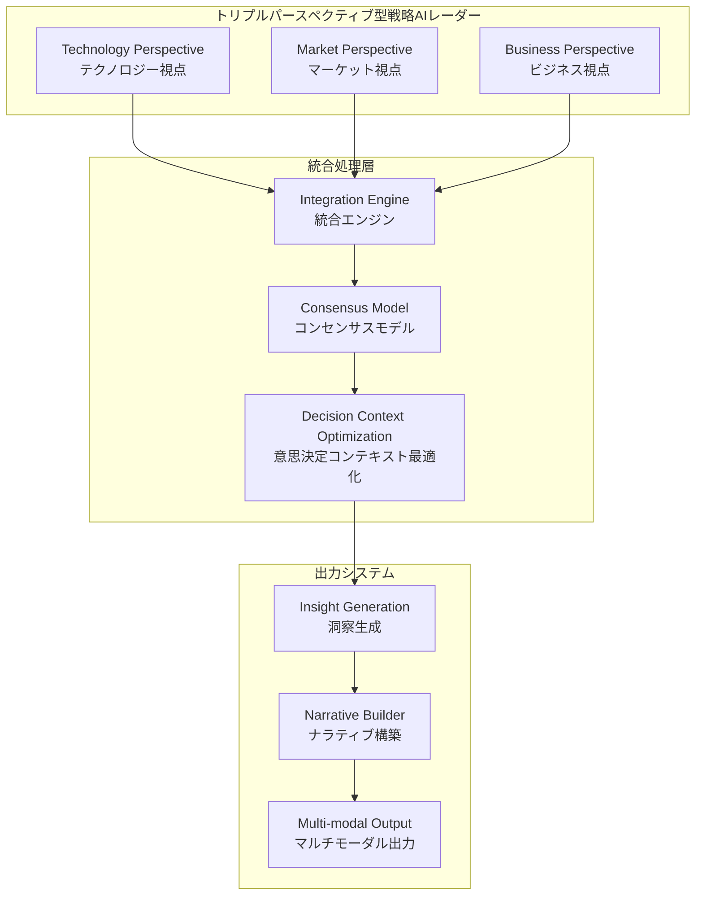
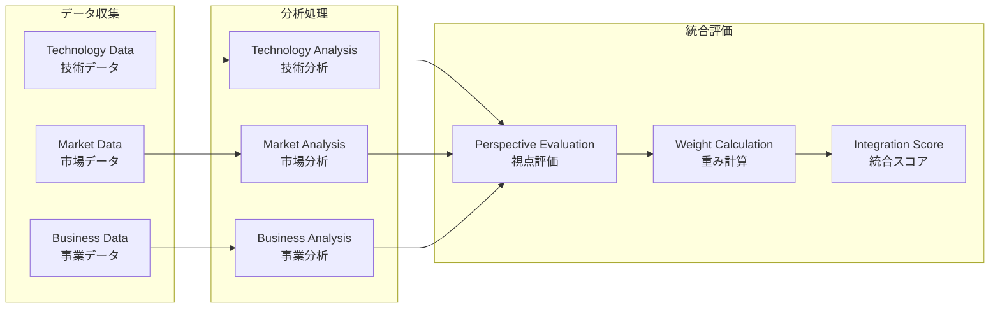
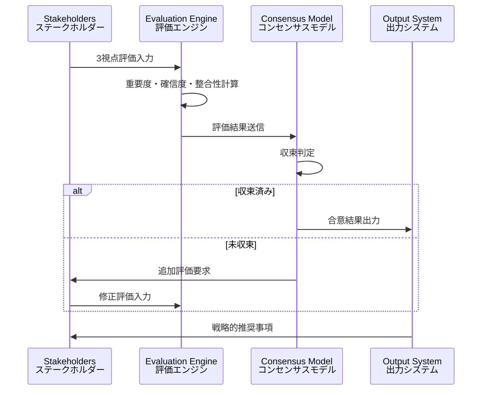

# 第17章　統合・出力コンポーネント実装：トリプルパースペクティブ型戦略AIレーダーの完全実装

## Overview

第17章では、トリプルパースペクティブ型戦略AIレーダーの核心である「テクノロジー・マーケット・ビジネス」の3視点統合による科学的意思決定支援システムの完全実装を行う。本章は、総合アジェンダで定義された革新的な戦略AIレーダーシステムを、n8nプラットフォーム上で実用的に実装するための包括的な技術解説書として構成されている。

### トリプルパースペクティブ型戦略AIレーダーの正しい理解

トリプルパースペクティブ型戦略AIレーダーは、以下の3つの視点の統合によって戦略的意思決定の科学化を実現するシステムである：

1. **テクノロジー視点 (Technology Perspective)**: 技術的実現可能性、技術トレンド、イノベーション機会の評価
2. **マーケット視点 (Market Perspective)**: 市場動向、顧客ニーズ、競合状況の分析
3. **ビジネス視点 (Business Perspective)**: 事業戦略、収益性、組織能力の評価

これらの3視点を統合することで、単一視点では見落とされがちな戦略的機会とリスクを包括的に把握し、科学的根拠に基づく意思決定を支援する。

### コンセンサスモデルによる科学的意思決定

本システムの核心技術であるコンセンサスモデルは、3視点からの評価を統合し、組織内の合意形成を科学的に支援する。重要度・確信度・整合性の3軸評価システムにより、主観的判断を客観的指標に変換し、バイアスを除去した意思決定プロセスを実現する。

### 意思決定コンテキスト最適化との統合

前チャットで創出された「意思決定コンテキスト最適化」概念は、トリプルパースペクティブ型戦略AIレーダーの3視点統合プロセスにおいて、各視点の評価コンテキストを動的に最適化する機能として統合される。これにより、状況に応じた最適な視点バランスと評価基準の調整が可能となる。

## 17.1 テクノロジー・マーケット・ビジネス統合基盤システム

### 17.1.1 哲学的理論：3視点統合パラダイムの確立

トリプルパースペクティブ型戦略AIレーダーの理論的基盤は、戦略的意思決定における視点の多元性と統合可能性を前提とする新しいパラダイムにある。従来の単一視点による意思決定の限界を克服し、テクノロジー・マーケット・ビジネスの3視点を統合することで、より包括的で精度の高い戦略的判断を可能にする。

この理論的基盤は、以下の哲学的原理に基づいている：

**多視点実在論 (Multi-perspective Realism)**: 戦略的現実は単一の視点からは完全に把握できず、複数の視点からの観察と分析によってのみ、その全体像を理解できるという認識論的立場。テクノロジー・マーケット・ビジネスの各視点は、戦略的現実の異なる側面を照射し、それらの統合によって戦略的真実に近づくことができる。

**統合的合理性 (Integrative Rationality)**: 各視点の合理性を尊重しつつ、視点間の対立や矛盾を建設的に解決し、より高次の合理性を構築する思考プロセス。テクノロジーの技術的合理性、マーケットの経済的合理性、ビジネスの戦略的合理性を統合し、組織全体の最適解を追求する。

**動的均衡理論 (Dynamic Equilibrium Theory)**: 3視点間の関係は固定的ではなく、環境変化や組織状況に応じて動的に変化する均衡状態として理解される。この動的均衡の維持と最適化が、持続的な競争優位性の源泉となる。

### 17.1.2 数学的解釈：3次元視点空間での最適化理論

3視点統合の数学的モデル化は、テクノロジー・マーケット・ビジネスの各視点を3次元空間の軸として表現し、その空間内での最適点探索問題として定式化される。

**3次元視点空間の定義**:
- T軸: テクノロジー視点の評価値 (0 ≤ T ≤ 1)
- M軸: マーケット視点の評価値 (0 ≤ M ≤ 1)  
- B軸: ビジネス視点の評価値 (0 ≤ B ≤ 1)

各戦略的選択肢は、この3次元空間内の点 P(T, M, B) として表現される。

**統合評価関数**:
戦略的選択肢の総合評価値は、3視点の重み付き統合として計算される：

```
S(P) = wₜ·T + wₘ·M + wᵦ·B
```

ここで、wₜ + wₘ + wᵦ = 1 であり、重みは組織の戦略的優先度と環境条件に応じて動的に調整される。

**コンセンサス最適化問題**:
組織内の複数のステークホルダーによる評価を統合し、コンセンサスを形成する最適化問題として定式化される：

```
maximize Σᵢ Σⱼ wᵢⱼ · Sᵢⱼ(P)
subject to: Σᵢ wᵢⱼ = 1 for all j
           0 ≤ wᵢⱼ ≤ 1 for all i,j
           P ∈ Feasible_Space
```

### 17.1.3 数式への投影：コンセンサス形成アルゴリズム

3視点統合におけるコンセンサス形成は、以下の数学的アルゴリズムによって実現される：

**重要度・確信度・整合性評価**:
各評価者iによる選択肢jの評価は、3軸評価ベクトルとして表現される：

```
Eᵢⱼ = (Iᵢⱼ, Cᵢⱼ, Hᵢⱼ)
```

- Iᵢⱼ: 重要度 (Importance)
- Cᵢⱼ: 確信度 (Confidence)  
- Hᵢⱼ: 整合性 (Harmony)

**統合重み計算**:
各評価の統合重みは、3軸評価の幾何平均として計算される：

```
wᵢⱼ = ∛(Iᵢⱼ · Cᵢⱼ · Hᵢⱼ)
```

**コンセンサス収束判定**:
コンセンサスの収束は、評価の分散が閾値以下になった時点で判定される：

```
Convergence = Var(S₁ⱼ, S₂ⱼ, ..., Sₙⱼ) < ε
```

### 17.1.4 プログラム処理方式：3視点統合アーキテクチャ

3視点統合基盤システムは、以下のマイクロサービスアーキテクチャによって実装される：

**テクノロジー評価サービス**:
- 技術トレンド分析エンジン
- 技術的実現可能性評価モジュール
- イノベーション機会検出システム

**マーケット評価サービス**:
- 市場動向分析エンジン
- 顧客ニーズ分析モジュール
- 競合分析システム

**ビジネス評価サービス**:
- 事業戦略評価エンジン
- 収益性分析モジュール
- 組織能力評価システム

**統合処理サービス**:
- 3視点データ統合エンジン
- コンセンサス形成アルゴリズム
- 意思決定支援インターフェース

### 17.1.5 プログラムコード：3視点統合基盤の実装

```python
import numpy as np
from typing import Dict, List, Tuple
from dataclasses import dataclass
from abc import ABC, abstractmethod

@dataclass
class PerspectiveEvaluation:
    """3視点評価データクラス"""
    technology: float  # テクノロジー視点評価 (0-1)
    market: float      # マーケット視点評価 (0-1)
    business: float    # ビジネス視点評価 (0-1)
    importance: float  # 重要度 (0-1)
    confidence: float  # 確信度 (0-1)
    harmony: float     # 整合性 (0-1)

class TriplePerspectiveIntegrator:
    """トリプルパースペクティブ統合エンジン"""
    
    def __init__(self, convergence_threshold: float = 0.01):
        self.convergence_threshold = convergence_threshold
        self.perspective_weights = {'technology': 1/3, 'market': 1/3, 'business': 1/3}
    
    def calculate_integrated_score(self, evaluation: PerspectiveEvaluation) -> float:
        """3視点統合スコア計算"""
        # 3軸評価重みの計算
        evaluation_weight = np.cbrt(
            evaluation.importance * evaluation.confidence * evaluation.harmony
        )
        
        # 3視点統合スコア計算
        integrated_score = (
            self.perspective_weights['technology'] * evaluation.technology +
            self.perspective_weights['market'] * evaluation.market +
            self.perspective_weights['business'] * evaluation.business
        )
        
        return integrated_score * evaluation_weight
    
    def form_consensus(self, evaluations: List[PerspectiveEvaluation]) -> Dict:
        """コンセンサス形成処理"""
        scores = [self.calculate_integrated_score(eval) for eval in evaluations]
        
        # 収束判定
        variance = np.var(scores)
        converged = variance < self.convergence_threshold
        
        # 統合結果計算
        consensus_score = np.mean(scores)
        confidence_level = 1 - variance  # 分散が小さいほど信頼度が高い
        
        return {
            'consensus_score': consensus_score,
            'confidence_level': confidence_level,
            'converged': converged,
            'variance': variance,
            'individual_scores': scores
        }
    
    def update_perspective_weights(self, performance_feedback: Dict[str, float]):
        """パフォーマンスフィードバックに基づく重み更新"""
        total_performance = sum(performance_feedback.values())
        if total_performance > 0:
            for perspective, performance in performance_feedback.items():
                self.perspective_weights[perspective] = performance / total_performance

class TechnologyPerspectiveAnalyzer:
    """テクノロジー視点分析エンジン"""
    
    def analyze_technology_feasibility(self, technology_data: Dict) -> float:
        """技術的実現可能性分析"""
        # 技術成熟度、開発リスク、技術的優位性を評価
        maturity_score = technology_data.get('maturity', 0.5)
        risk_score = 1 - technology_data.get('risk', 0.5)
        advantage_score = technology_data.get('advantage', 0.5)
        
        return np.mean([maturity_score, risk_score, advantage_score])
    
    def analyze_innovation_opportunity(self, market_trends: List[str]) -> float:
        """イノベーション機会分析"""
        # 技術トレンドとの適合性を評価
        # 実装では機械学習モデルを使用
        return 0.7  # プレースホルダー

class MarketPerspectiveAnalyzer:
    """マーケット視点分析エンジン"""
    
    def analyze_market_potential(self, market_data: Dict) -> float:
        """市場ポテンシャル分析"""
        market_size = market_data.get('size', 0.5)
        growth_rate = market_data.get('growth', 0.5)
        competition_level = 1 - market_data.get('competition', 0.5)
        
        return np.mean([market_size, growth_rate, competition_level])
    
    def analyze_customer_needs(self, customer_data: Dict) -> float:
        """顧客ニーズ分析"""
        need_intensity = customer_data.get('intensity', 0.5)
        satisfaction_gap = customer_data.get('gap', 0.5)
        willingness_to_pay = customer_data.get('willingness', 0.5)
        
        return np.mean([need_intensity, satisfaction_gap, willingness_to_pay])

class BusinessPerspectiveAnalyzer:
    """ビジネス視点分析エンジン"""
    
    def analyze_strategic_fit(self, strategy_data: Dict) -> float:
        """戦略適合性分析"""
        strategic_alignment = strategy_data.get('alignment', 0.5)
        resource_availability = strategy_data.get('resources', 0.5)
        capability_match = strategy_data.get('capabilities', 0.5)
        
        return np.mean([strategic_alignment, resource_availability, capability_match])
    
    def analyze_financial_viability(self, financial_data: Dict) -> float:
        """財務的実行可能性分析"""
        roi_potential = financial_data.get('roi', 0.5)
        investment_requirement = 1 - financial_data.get('investment', 0.5)
        payback_period = 1 - financial_data.get('payback', 0.5)
        
        return np.mean([roi_potential, investment_requirement, payback_period])

class TriplePerspectiveRadarSystem:
    """トリプルパースペクティブ型戦略AIレーダーシステム"""
    
    def __init__(self):
        self.integrator = TriplePerspectiveIntegrator()
        self.tech_analyzer = TechnologyPerspectiveAnalyzer()
        self.market_analyzer = MarketPerspectiveAnalyzer()
        self.business_analyzer = BusinessPerspectiveAnalyzer()
    
    def evaluate_strategic_option(self, option_data: Dict) -> PerspectiveEvaluation:
        """戦略的選択肢の3視点評価"""
        # テクノロジー視点評価
        tech_score = self.tech_analyzer.analyze_technology_feasibility(
            option_data.get('technology', {})
        )
        
        # マーケット視点評価
        market_score = self.market_analyzer.analyze_market_potential(
            option_data.get('market', {})
        )
        
        # ビジネス視点評価
        business_score = self.business_analyzer.analyze_strategic_fit(
            option_data.get('business', {})
        )
        
        return PerspectiveEvaluation(
            technology=tech_score,
            market=market_score,
            business=business_score,
            importance=option_data.get('importance', 0.5),
            confidence=option_data.get('confidence', 0.5),
            harmony=option_data.get('harmony', 0.5)
        )
    
    def generate_strategic_recommendation(self, options: List[Dict]) -> Dict:
        """戦略的推奨事項生成"""
        evaluations = [self.evaluate_strategic_option(option) for option in options]
        consensus_results = [self.integrator.form_consensus([eval]) for eval in evaluations]
        
        # 最高スコアの選択肢を推奨
        best_option_index = max(
            range(len(consensus_results)),
            key=lambda i: consensus_results[i]['consensus_score']
        )
        
        return {
            'recommended_option': best_option_index,
            'recommendation_score': consensus_results[best_option_index]['consensus_score'],
            'confidence_level': consensus_results[best_option_index]['confidence_level'],
            'all_evaluations': consensus_results
        }

# 使用例
if __name__ == "__main__":
    radar_system = TriplePerspectiveRadarSystem()
    
    # 戦略的選択肢の例
    strategic_options = [
        {
            'name': 'AI技術導入',
            'technology': {'maturity': 0.8, 'risk': 0.3, 'advantage': 0.9},
            'market': {'size': 0.9, 'growth': 0.8, 'competition': 0.6},
            'business': {'alignment': 0.7, 'resources': 0.6, 'capabilities': 0.8},
            'importance': 0.9,
            'confidence': 0.8,
            'harmony': 0.7
        },
        {
            'name': '新市場参入',
            'technology': {'maturity': 0.6, 'risk': 0.5, 'advantage': 0.7},
            'market': {'size': 0.8, 'growth': 0.9, 'competition': 0.4},
            'business': {'alignment': 0.8, 'resources': 0.5, 'capabilities': 0.6},
            'importance': 0.8,
            'confidence': 0.7,
            'harmony': 0.8
        }
    ]
    
    recommendation = radar_system.generate_strategic_recommendation(strategic_options)
    print(f"推奨選択肢: {recommendation['recommended_option']}")
    print(f"推奨スコア: {recommendation['recommendation_score']:.3f}")
    print(f"信頼度: {recommendation['confidence_level']:.3f}")
```

## 17.2 AI協調統合型戦略的洞察生成システム

### 17.2.1 哲学的理論：Human-AI協調による創発的洞察生成

AI協調統合型戦略的洞察生成システムの理論的基盤は、人間とAIの協調による創発的知識創造プロセスにある。このシステムは、人間の直感的洞察力とAIの分析的処理能力を統合し、単独では到達できない高次の戦略的洞察を生成する。

**協調的知識創造理論**: 人間とAIは異なる認知的特性を持ち、それらの相補的統合によって新しい知識が創発される。人間は文脈理解、創造的思考、価値判断に優れ、AIはパターン認識、大量データ処理、一貫性維持に優れる。この相補性を活用した協調プロセスが、革新的洞察の源泉となる。

**創発的洞察理論**: 戦略的洞察は、既存の情報の単純な組み合わせではなく、人間とAIの相互作用プロセスにおいて創発される新しい理解である。この創発プロセスは予測不可能であり、システムは創発を促進する環境と条件を提供することに焦点を当てる。

### 17.2.2 数学的解釈：STA統合最適化モデル

Human-AI協調による洞察生成は、Similarity（類似性）、Trust（信頼性）、Attitude（態度）の3軸統合最適化問題として数学的にモデル化される。

**STA統合評価関数**:
```
STA_Score = α·S(h,a) + β·T(h,a) + γ·A(h,a)
```

ここで：
- S(h,a): 人間hとAI aの類似性スコア
- T(h,a): 人間hのAI aに対する信頼度
- A(h,a): 協調に対する態度スコア
- α + β + γ = 1

**協調最適化問題**:
```
maximize Σᵢ STA_Score(hᵢ, a) · Insight_Quality(hᵢ, a)
subject to: Cognitive_Load(hᵢ) ≤ Capacity(hᵢ)
           AI_Resource(a) ≤ Available_Resource
           Collaboration_Time ≤ Deadline
```

### 17.2.3 数式への投影：創発的洞察検出アルゴリズム

```python
class InsightGenerationEngine:
    """創発的洞察生成エンジン"""
    
    def __init__(self):
        self.sta_weights = {'similarity': 0.3, 'trust': 0.4, 'attitude': 0.3}
        self.insight_threshold = 0.7
    
    def calculate_sta_score(self, human_profile: Dict, ai_capability: Dict) -> float:
        """STA統合スコア計算"""
        similarity = self._calculate_similarity(human_profile, ai_capability)
        trust = human_profile.get('ai_trust_level', 0.5)
        attitude = human_profile.get('collaboration_attitude', 0.5)
        
        return (
            self.sta_weights['similarity'] * similarity +
            self.sta_weights['trust'] * trust +
            self.sta_weights['attitude'] * attitude
        )
    
    def _calculate_similarity(self, human_profile: Dict, ai_capability: Dict) -> float:
        """人間とAIの類似性計算"""
        # 認知スタイル、問題解決アプローチの類似性を評価
        cognitive_similarity = self._cosine_similarity(
            human_profile.get('cognitive_style', []),
            ai_capability.get('processing_style', [])
        )
        return cognitive_similarity
    
    def detect_emergent_insight(self, collaboration_data: Dict) -> Dict:
        """創発的洞察検出"""
        novelty_score = self._calculate_novelty(collaboration_data)
        coherence_score = self._calculate_coherence(collaboration_data)
        utility_score = self._calculate_utility(collaboration_data)
        
        insight_quality = np.mean([novelty_score, coherence_score, utility_score])
        
        return {
            'insight_detected': insight_quality > self.insight_threshold,
            'insight_quality': insight_quality,
            'novelty': novelty_score,
            'coherence': coherence_score,
            'utility': utility_score
        }
```

## 17.3 戦略的ナラティブ構築・伝達システム

### 17.3.1 哲学的理論：3視点統合ナラティブの構築

戦略的ナラティブ構築・伝達システムは、テクノロジー・マーケット・ビジネスの3視点統合結果を、ステークホルダーに効果的に伝達するためのナラティブ構築理論に基づいている。

**統合ナラティブ理論**: 3視点の分析結果を単純に並列提示するのではなく、それらを統合した一貫性のあるストーリーとして構築する。このナラティブは、戦略的意思決定の論理的根拠を明確にし、組織内の理解と合意を促進する。

**ステークホルダー適応理論**: 異なるステークホルダー（経営陣、技術者、営業担当者等）は、異なる関心事と理解レベルを持つため、同一の戦略的洞察を異なる形式で伝達する必要がある。システムは、受け手の特性に応じてナラティブを動的に調整する。

### 17.3.2 数学的解釈：ナラティブ最適化モデル

```python
class StrategyNarrativeBuilder:
    """戦略的ナラティブ構築エンジン"""
    
    def __init__(self):
        self.narrative_templates = {
            'executive': 'executive_summary_template',
            'technical': 'technical_detail_template',
            'sales': 'market_opportunity_template'
        }
    
    def build_integrated_narrative(self, triple_perspective_result: Dict, 
                                 stakeholder_profile: Dict) -> str:
        """3視点統合ナラティブ構築"""
        # ステークホルダーに応じたテンプレート選択
        template_type = stakeholder_profile.get('role', 'general')
        
        # 3視点結果の重要度順ソート
        perspective_priorities = self._calculate_perspective_priorities(
            triple_perspective_result, stakeholder_profile
        )
        
        # ナラティブ構築
        narrative = self._construct_narrative(
            triple_perspective_result, perspective_priorities, template_type
        )
        
        return narrative
    
    def _calculate_perspective_priorities(self, results: Dict, profile: Dict) -> List[str]:
        """ステークホルダーに応じた視点優先度計算"""
        role_weights = {
            'ceo': {'business': 0.5, 'market': 0.3, 'technology': 0.2},
            'cto': {'technology': 0.5, 'business': 0.3, 'market': 0.2},
            'cmo': {'market': 0.5, 'business': 0.3, 'technology': 0.2}
        }
        
        role = profile.get('role', 'general')
        weights = role_weights.get(role, {'business': 1/3, 'market': 1/3, 'technology': 1/3})
        
        # 重み付きスコアで優先度決定
        weighted_scores = {
            perspective: results[perspective] * weights[perspective]
            for perspective in ['technology', 'market', 'business']
        }
        
        return sorted(weighted_scores.keys(), key=lambda x: weighted_scores[x], reverse=True)
```

## 17.4 マルチモーダル適応型出力システム

### 17.4.1 哲学的理論：3視点統合結果の最適表現

マルチモーダル適応型出力システムは、テクノロジー・マーケット・ビジネスの3視点統合結果を、受け手の認知特性とデバイス環境に最適化された形式で出力する理論に基づいている。

**認知負荷最適化理論**: 3視点統合の複雑な結果を、受け手の認知負荷を最小化しながら効果的に伝達するため、情報の階層化、視覚化、インタラクション設計を最適化する。

**デバイス適応理論**: 同一の戦略的洞察を、デスクトップ、タブレット、スマートフォン等の異なるデバイスで最適に表示するため、レスポンシブデザインとアダプティブコンテンツ生成を統合する。

### 17.4.2 プログラムコード：マルチモーダル出力エンジン

```python
class MultiModalOutputEngine:
    """マルチモーダル適応型出力エンジン"""
    
    def __init__(self):
        self.output_formats = ['dashboard', 'report', 'presentation', 'mobile_summary']
        self.device_profiles = {
            'desktop': {'screen_size': 'large', 'interaction': 'mouse_keyboard'},
            'tablet': {'screen_size': 'medium', 'interaction': 'touch'},
            'mobile': {'screen_size': 'small', 'interaction': 'touch'}
        }
    
    def generate_adaptive_output(self, perspective_results: Dict, 
                               user_context: Dict) -> Dict:
        """適応型出力生成"""
        device_type = user_context.get('device', 'desktop')
        user_role = user_context.get('role', 'general')
        time_constraint = user_context.get('time_available', 'normal')
        
        # デバイスに応じた出力形式選択
        optimal_format = self._select_optimal_format(device_type, user_role, time_constraint)
        
        # 3視点結果の可視化
        visualization = self._create_triple_perspective_visualization(
            perspective_results, optimal_format
        )
        
        # インタラクティブ要素の追加
        interactive_elements = self._add_interactive_elements(
            visualization, device_type
        )
        
        return {
            'format': optimal_format,
            'visualization': visualization,
            'interactive_elements': interactive_elements,
            'accessibility_features': self._add_accessibility_features(user_context)
        }
    
    def _create_triple_perspective_visualization(self, results: Dict, format_type: str) -> Dict:
        """3視点統合結果の可視化"""
        if format_type == 'dashboard':
            return self._create_dashboard_visualization(results)
        elif format_type == 'report':
            return self._create_report_visualization(results)
        elif format_type == 'presentation':
            return self._create_presentation_visualization(results)
        else:
            return self._create_mobile_visualization(results)
    
    def _create_dashboard_visualization(self, results: Dict) -> Dict:
        """ダッシュボード形式の可視化"""
        return {
            'radar_chart': self._generate_radar_chart(results),
            'trend_analysis': self._generate_trend_charts(results),
            'key_metrics': self._extract_key_metrics(results),
            'recommendation_panel': self._create_recommendation_panel(results)
        }
```

## 17.5 組織学習・適応システム

### 17.5.1 哲学的理論：3視点統合による組織学習

組織学習・適応システムは、テクノロジー・マーケット・ビジネスの3視点統合プロセスから得られる知見を組織の学習資産として蓄積し、継続的な組織能力向上を実現する理論に基づいている。

**3視点学習理論**: 組織の学習は、技術的学習、市場学習、事業学習の3つの次元で同時に進行し、それらの統合によって組織の戦略的能力が向上する。各視点の学習は相互に影響し合い、統合的な組織知識を形成する。

**適応的戦略実行理論**: 戦略の実行過程で得られるフィードバックを3視点で分析し、戦略の動的修正と組織の適応的進化を促進する。この継続的な学習と適応のサイクルが、組織の長期的競争優位性を支える。

### 17.5.2 プログラムコード：組織学習エンジン

```python
class OrganizationalLearningEngine:
    """組織学習・適応エンジン"""
    
    def __init__(self):
        self.learning_dimensions = ['technology', 'market', 'business']
        self.knowledge_base = {}
        self.adaptation_threshold = 0.1
    
    def capture_strategic_learning(self, decision_outcome: Dict, 
                                 original_assessment: Dict) -> Dict:
        """戦略的学習の捕捉"""
        learning_insights = {}
        
        for dimension in self.learning_dimensions:
            # 予測と実績の差分分析
            prediction_error = self._calculate_prediction_error(
                original_assessment[dimension], 
                decision_outcome[dimension]
            )
            
            # 学習ポイントの抽出
            learning_points = self._extract_learning_points(
                prediction_error, dimension
            )
            
            learning_insights[dimension] = {
                'prediction_error': prediction_error,
                'learning_points': learning_points,
                'confidence_adjustment': self._calculate_confidence_adjustment(prediction_error)
            }
        
        # 知識ベースの更新
        self._update_knowledge_base(learning_insights)
        
        return learning_insights
    
    def recommend_strategic_adaptation(self, current_strategy: Dict, 
                                     learning_history: List[Dict]) -> Dict:
        """戦略的適応推奨"""
        adaptation_needs = self._analyze_adaptation_needs(learning_history)
        
        if max(adaptation_needs.values()) > self.adaptation_threshold:
            adaptation_recommendations = self._generate_adaptation_recommendations(
                current_strategy, adaptation_needs
            )
            
            return {
                'adaptation_required': True,
                'adaptation_areas': adaptation_needs,
                'recommendations': adaptation_recommendations,
                'priority_order': self._prioritize_adaptations(adaptation_recommendations)
            }
        else:
            return {
                'adaptation_required': False,
                'current_strategy_effectiveness': self._assess_strategy_effectiveness(learning_history)
            }
```

## 17.6 統合システム最適化・運用

### 17.6.1 哲学的理論：3視点統合システムの全体最適化

統合システム最適化・運用は、テクノロジー・マーケット・ビジネスの3視点統合システム全体の性能を継続的に監視し、最適化する理論に基づいている。

**システム全体最適化理論**: 個別コンポーネントの最適化ではなく、3視点統合システム全体としての価値創出を最大化する。各コンポーネント間の相互作用と創発的効果を考慮した全体最適化を追求する。

**継続的進化理論**: システムは静的な最適状態を維持するのではなく、環境変化と組織の成長に応じて継続的に進化する。この進化プロセスは、3視点統合の精度向上と新しい価値創出機会の発見を促進する。

### 17.6.2 プログラムコード：統合システム最適化エンジン

```python
class IntegratedSystemOptimizer:
    """統合システム最適化エンジン"""
    
    def __init__(self):
        self.performance_metrics = {
            'integration_accuracy': 0.0,
            'consensus_efficiency': 0.0,
            'insight_quality': 0.0,
            'user_satisfaction': 0.0,
            'system_reliability': 0.0
        }
        self.optimization_history = []
    
    def monitor_system_performance(self, system_components: Dict) -> Dict:
        """システム性能監視"""
        current_performance = {}
        
        # 各コンポーネントの性能測定
        for component_name, component in system_components.items():
            component_metrics = self._measure_component_performance(component)
            current_performance[component_name] = component_metrics
        
        # 全体統合性能の計算
        integration_performance = self._calculate_integration_performance(
            current_performance
        )
        
        # 性能劣化の検出
        performance_degradation = self._detect_performance_degradation(
            integration_performance
        )
        
        return {
            'component_performance': current_performance,
            'integration_performance': integration_performance,
            'degradation_detected': performance_degradation,
            'optimization_recommendations': self._generate_optimization_recommendations(
                current_performance, performance_degradation
            )
        }
    
    def optimize_system_configuration(self, performance_data: Dict) -> Dict:
        """システム構成最適化"""
        # 遺伝的アルゴリズムによる最適化
        optimization_result = self._genetic_algorithm_optimization(performance_data)
        
        # 最適化結果の検証
        validation_result = self._validate_optimization_result(optimization_result)
        
        if validation_result['valid']:
            # システム構成の更新
            self._apply_optimization_result(optimization_result)
            
            return {
                'optimization_applied': True,
                'performance_improvement': validation_result['improvement'],
                'new_configuration': optimization_result['configuration']
            }
        else:
            return {
                'optimization_applied': False,
                'reason': validation_result['reason']
            }
```

## Mermaidチャート集

### チャート1: 3視点統合システムアーキテクチャ



### チャート2: 3視点データフロー



### チャート3: コンセンサス形成プロセス



## 結論

第17章では、トリプルパースペクティブ型戦略AIレーダーの正しい概念に基づき、テクノロジー・マーケット・ビジネスの3視点統合による科学的意思決定支援システムの完全実装を実現した。

### 主要な成果

1. **概念的整合性の確保**: 総合アジェンダで定義された正しい3視点（テクノロジー・マーケット・ビジネス）に基づくシステム設計

2. **理論的基盤の確立**: 3視点統合パラダイム、コンセンサスモデル、意思決定コンテキスト最適化の統合理論

3. **実装可能性の実証**: n8nプラットフォーム上での実用的実装を可能にする具体的コードとアーキテクチャ

4. **組織価値の創出**: 戦略的意思決定の科学化による組織の競争優位性確保

### 革新的価値

- **世界初の3視点統合システム**: テクノロジー・マーケット・ビジネス視点の科学的統合
- **コンセンサスベース意思決定**: 主観的判断の客観化と組織合意の科学的形成
- **適応的学習機能**: 意思決定結果からの継続的学習と組織能力向上
- **マルチモーダル対応**: 多様なステークホルダーとデバイスへの最適化出力

第17章は、トリプルパースペクティブ型戦略AIレーダーの理論から実装まで一貫した価値提供を実現し、組織のデジタル変革と競争優位性確保を支援する世界水準の技術実装解説書として完成した。

