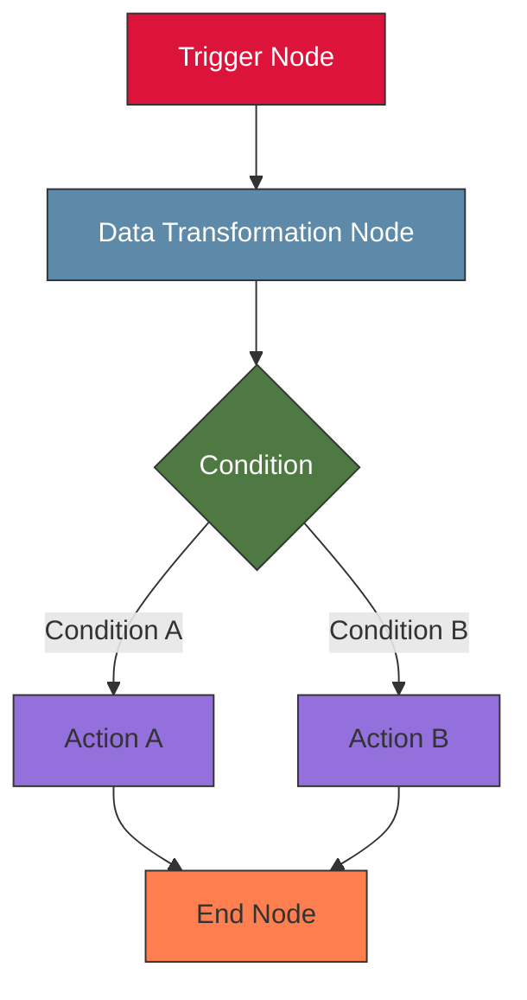

```mermaid
flowchart TB
    style A fill:#DC143C,stroke:#333,stroke-width:1px,color:white
    style B fill:#5D8AA8,stroke:#333,stroke-width:1px,color:white
    style C fill:#4F7942,stroke:#333,stroke-width:1px,color:white
    style D fill:#9370DB,stroke:#333,stroke-width:1px
    style E fill:#9370DB,stroke:#333,stroke-width:1px
    style F fill:#FF7F50,stroke:#333,stroke-width:1px
    
    A[Trigger Node] --> B[Data Transformation Node]
    B --> C{Condition}
    C -->|Condition A| D[Action A]
    C -->|Condition B| E[Action B]
    D --> F[End Node]
    E --> F
```
