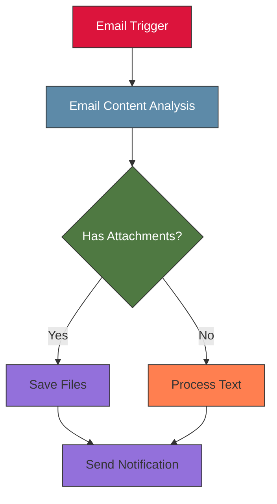

```mermaid
flowchart TB
    style A fill:#DC143C,stroke:#333,stroke-width:1px,color:white
    style B fill:#5D8AA8,stroke:#333,stroke-width:1px,color:white
    style C fill:#4F7942,stroke:#333,stroke-width:1px,color:white
    style D fill:#9370DB,stroke:#333,stroke-width:1px
    style E fill:#FF7F50,stroke:#333,stroke-width:1px
    style F fill:#9370DB,stroke:#333,stroke-width:1px
    
    A[Email Trigger] --> B[Email Content Analysis]
    B --> C{Has Attachments?}
    C -->|Yes| D[Save Files]
    C -->|No| E[Process Text]
    D --> F[Send Notification]
    E --> F
```
