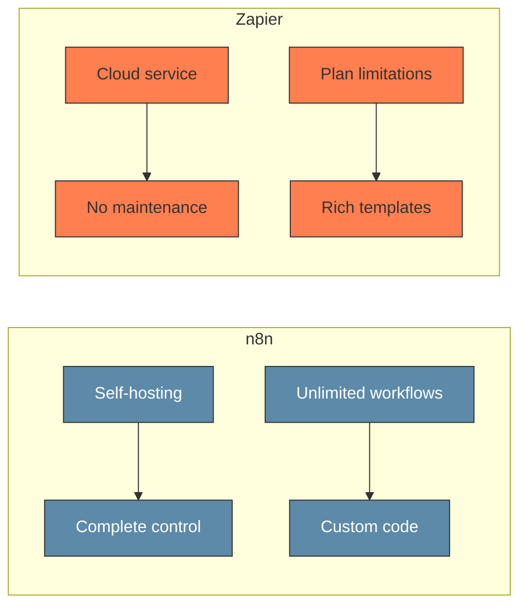

```mermaid
flowchart LR
    style A1 fill:#5D8AA8,stroke:#333,stroke-width:1px,color:white
    style B1 fill:#5D8AA8,stroke:#333,stroke-width:1px,color:white
    style C1 fill:#5D8AA8,stroke:#333,stroke-width:1px,color:white
    style D1 fill:#5D8AA8,stroke:#333,stroke-width:1px,color:white
    style A2 fill:#FF7F50,stroke:#333,stroke-width:1px
    style B2 fill:#FF7F50,stroke:#333,stroke-width:1px
    style C2 fill:#FF7F50,stroke:#333,stroke-width:1px
    style D2 fill:#FF7F50,stroke:#333,stroke-width:1px
    
    subgraph n8n
    A1[Self-hosting] --> B1[Complete control]
    C1[Unlimited workflows] --> D1[Custom code]
    end
    
    subgraph Zapier
    A2[Cloud service] --> B2[No maintenance]
    C2[Plan limitations] --> D2[Rich templates]
    end
```
