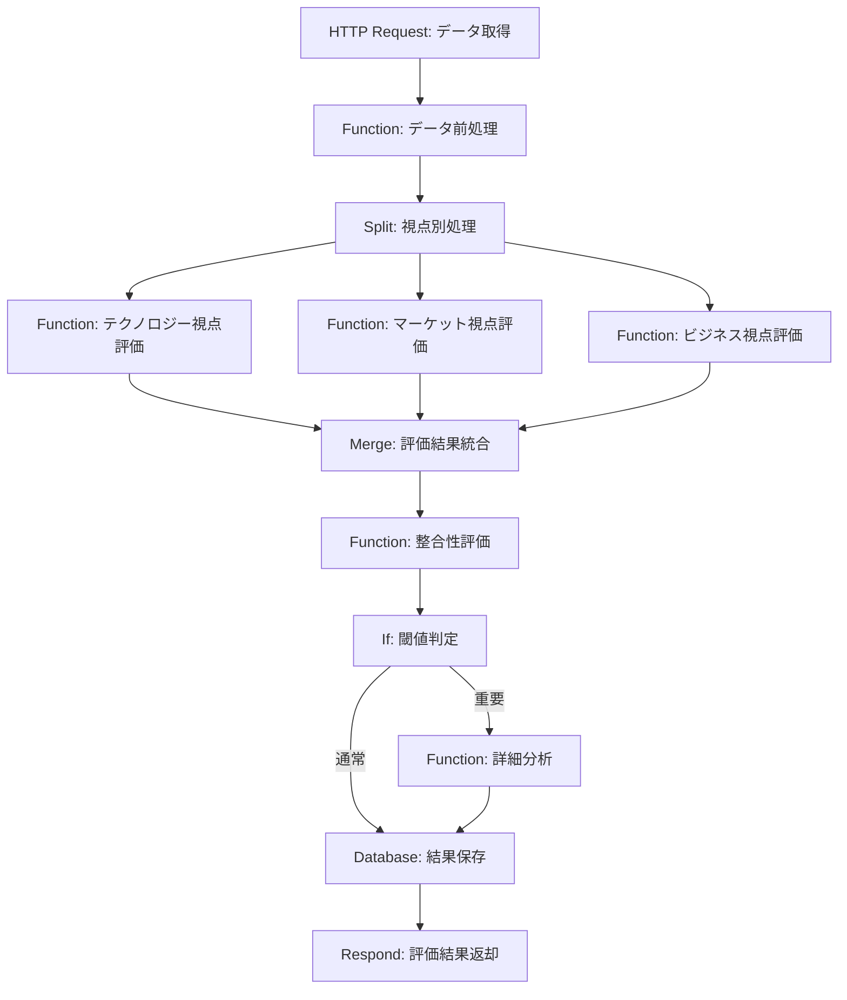
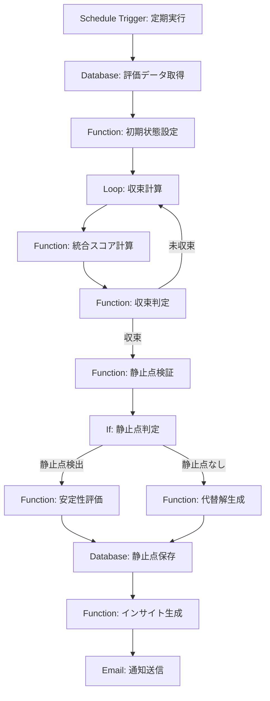
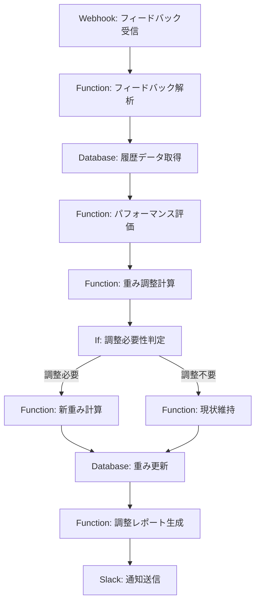

# パート1～4で説明された概念や技術のn8n実装対応表

## 1. はじめに

本セクションでは、パート1～4で説明された理論的概念や技術要素がn8nでどのように実装されるかを体系的に示します。この対応表は、コンセンサスモデルの理論を実践に移す際の橋渡しとなり、n8nを用いた実装作業の指針となることを目的としています。

各概念とn8n実装要素の対応関係を明確にすることで、理論と実装の一貫性を確保し、システム全体の整合性と追跡可能性を高めます。また、この対応表は、今後の拡張や改善の際の参照資料としても活用できます。

## 2. アーキテクチャレベルの対応

### 2.1 レイヤー対応表

以下の表は、パート1で説明された4つの主要レイヤーとn8nでの実装コンポーネントの対応を示しています。

| レイヤー | 出典 | n8n実装コンポーネント | 主要ノード | 実装アプローチ |
|---------|------|---------------------|----------|--------------|
| 入力レイヤ | パート1:2.1 | データ収集コンポーネント | HTTP Request, Database, Webhook, FTP | 外部APIやデータベース、Webhookからのイベント通知、ファイルシステムからデータを取得し、統一形式に変換 |
| 評価レイヤ | パート1:2.1 | 分析・評価コンポーネント | Function, Switch, If, Set | JavaScriptによる評価ロジックの実装、条件分岐による評価結果の分類、メタデータの付与 |
| 統合レイヤ | パート1:2.1 | 統合コンポーネント | Merge, Function, Loop, Split | 複数視点データの統合、重み付けロジックの適用、反復計算による静止点検出、代替解の並列生成 |
| 出力レイヤ | パート1:2.1 | 出力コンポーネント | Template, Chart, Email, Slack, Respond | テンプレートベースのインサイト生成、チャート生成による可視化、メール/Slack通知、API応答の生成 |

### 2.2 コンポーネント対応表

以下の表は、パート1で説明された各コンポーネントとn8nでの実装要素の対応を示しています。

#### 2.2.1 入力レイヤーコンポーネント

| コンポーネント | 出典 | n8n実装要素 | 主要ノード | 実装アプローチ |
|--------------|------|------------|----------|--------------|
| テクノロジー視点入力プロセッサ | パート1:2.3.1 | 技術データ収集ワークフロー | HTTP Request, Function, JSON | 技術トレンドAPIからデータ取得、特許データベース連携、研究論文分析サービス連携、技術成熟度スコア計算 |
| マーケット視点入力プロセッサ | パート1:2.3.1 | 市場データ収集ワークフロー | Webhook, Spreadsheet, HTTP Request | 市場調査レポート取得、競合情報収集、SNS分析サービス連携、顧客センチメント分析 |
| ビジネス視点入力プロセッサ | パート1:2.3.1 | ビジネスデータ収集ワークフロー | Database, Function, HTTP Request | 社内KPIデータ取得、財務諸表分析、戦略文書解析、ROI予測計算 |

#### 2.2.2 評価レイヤーコンポーネント

| コンポーネント | 出典 | n8n実装要素 | 主要ノード | 実装アプローチ |
|--------------|------|------------|----------|--------------|
| 重要度評価エンジン | パート1:2.3.2 | 重要度評価ワークフロー | Function, If, Set | 影響範囲、変化の大きさ、戦略的関連性、時間的緊急性の複合評価ロジック実装、閾値に基づく重要度レベル判定 |
| 確信度評価エンジン | パート1:2.3.2 | 確信度評価ワークフロー | Function, Database, Switch | 情報源信頼性評価、データ量・質の評価、分析手法妥当性評価、過去データとの一貫性チェック |
| 整合性評価エンジン | パート1:2.3.2 | 整合性評価ワークフロー | Merge, Function, If | 視点間一致度計算、論理的整合性チェック、時間的整合性評価、コンテキスト整合性分析 |

#### 2.2.3 統合レイヤーコンポーネント

| コンポーネント | 出典 | n8n実装要素 | 主要ノード | 実装アプローチ |
|--------------|------|------------|----------|--------------|
| 視点統合エンジン | パート1:2.3.3 | 視点統合ワークフロー | Merge, Function, Variables | 3つの視点の評価結果統合、定義された重み付けルール適用、統合スコア算出 |
| 静止点検出エンジン | パート1:2.3.3 | 静止点検出ワークフロー | Loop, Function, If, Database | 反復計算による収束判定、多目的最適化アルゴリズム実装、クラスタリングによる静止点検出、安定性評価 |
| 代替解生成エンジン | パート1:2.3.3 | 代替解生成ワークフロー | Split, Function, Merge | 感度分析による代替シナリオ生成、パラメータ変動シミュレーション、代替解の評価と順位付け |

#### 2.2.4 出力レイヤーコンポーネント

| コンポーネント | 出典 | n8n実装要素 | 主要ノード | 実装アプローチ |
|--------------|------|------------|----------|--------------|
| インサイト生成エンジン | パート1:2.3.4 | インサイト生成ワークフロー | Template, Function, Switch | テンプレートベースのインサイト生成、動的コンテンツ挿入、インサイトタイプに応じた分岐処理 |
| アクション推奨エンジン | パート1:2.3.4 | アクション推奨ワークフロー | Function, HTTP Request, Database | 推奨アクション生成ロジック、優先順位付け、実行タイミング提案、外部システム連携 |
| 可視化エンジン | パート1:2.3.4 | 可視化ワークフロー | Chart, HTTP Request, Function | グラフ・チャート生成、BIツール連携、ダッシュボード更新、視覚的表現の最適化 |

## 3. 機能レベルの対応

### 3.1 評価メカニズム対応表

以下の表は、パート2で説明された評価メカニズムとn8nでの実装方法の対応を示しています。

| 評価機能 | 出典 | n8n実装要素 | 主要ノード | 実装アプローチ | コード例 |
|---------|------|------------|----------|--------------|---------|
| 重み付け平均法 | パート2:2.2 | 評価関数 | Function | JavaScriptによる重み付け平均計算 | ```javascript<br>// 重み付け平均計算<br>function weightedAverage(values, weights) {<br>  let sum = 0;<br>  let weightSum = 0;<br>  for (let i = 0; i < values.length; i++) {<br>    sum += values[i] * weights[i];<br>    weightSum += weights[i];<br>  }<br>  return sum / weightSum;<br>}``` |
| 閾値ベース分類 | パート2:2.2 | 条件分岐ロジック | If, Switch | 閾値に基づく条件分岐処理 | ```javascript<br>// 閾値ベース分類<br>function classifyScore(score, thresholds) {<br>  if (score < thresholds.low) return 'LOW';<br>  if (score < thresholds.medium) return 'MEDIUM';<br>  if (score < thresholds.high) return 'HIGH';<br>  return 'VERY_HIGH';<br>}``` |
| ファジィロジック | パート2:2.2 | ファジィ評価関数 | Function | JavaScriptによるファジィロジック実装 | ```javascript<br>// ファジィメンバーシップ関数<br>function fuzzyMembership(value, params) {<br>  // トラペゾイド型メンバーシップ関数の例<br>  const {a, b, c, d} = params;<br>  if (value <= a || value >= d) return 0;<br>  if (value >= b && value <= c) return 1;<br>  if (value > a && value < b) return (value - a) / (b - a);<br>  return (d - value) / (d - c);<br>}``` |
| 評価プロセスフロー | パート2:2.3 | 評価ワークフロー | Function, If, Set, Merge | 前処理→個別評価→統合→閾値判定→メタデータ付与の一連の流れ | n8nワークフロー「評価プロセス」参照 |

### 3.2 重み付け方法対応表

以下の表は、パート3で説明された重み付け方法とn8nでの実装方法の対応を示しています。

| 重み付け方法 | 出典 | n8n実装要素 | 主要ノード | 実装アプローチ | コード例 |
|------------|------|------------|----------|--------------|---------|
| 静的重み付け | パート3:3.1 | パラメータ管理 | Variables, Function | グローバル変数としての重み管理、固定重みの適用 | ```javascript<br>// 静的重み付け<br>const staticWeights = {<br>  technology: 0.33,<br>  market: 0.34,<br>  business: 0.33<br>};<br><br>function applyStaticWeights(scores) {<br>  return {<br>    technology: scores.technology * staticWeights.technology,<br>    market: scores.market * staticWeights.market,<br>    business: scores.business * staticWeights.business<br>  };<br>}``` |
| 動的重み付け | パート3:3.1 | 重み調整ワークフロー | Function, Database | データに応じた重み自動調整ロジック、履歴データ参照 | ```javascript<br>// 動的重み付け<br>function calculateDynamicWeights(historicalData, currentContext) {<br>  // 過去の精度に基づく重み調整<br>  const accuracyScores = getAccuracyScores(historicalData);<br>  // コンテキスト要素の抽出<br>  const contextFactors = extractContextFactors(currentContext);<br>  // 重み計算<br>  return {<br>    technology: 0.33 * (1 + accuracyScores.technology * 0.2) * contextFactors.techRelevance,<br>    market: 0.34 * (1 + accuracyScores.market * 0.2) * contextFactors.marketRelevance,<br>    business: 0.33 * (1 + accuracyScores.business * 0.2) * contextFactors.businessRelevance<br>  };<br>}``` |
| コンテキスト依存型重み付け | パート3:3.1 | コンテキスト判定ワークフロー | Switch, Function | コンテキスト検出と重み選択ロジック、業界・目的別の重み設定 | ```javascript<br>// コンテキスト依存型重み付け<br>const contextWeights = {<br>  manufacturing: {<br>    technology: 0.40,<br>    market: 0.30,<br>    business: 0.30<br>  },<br>  financial: {<br>    technology: 0.25,<br>    market: 0.35,<br>    business: 0.40<br>  },<br>  retail: {<br>    technology: 0.30,<br>    market: 0.45,<br>    business: 0.25<br>  }<br>};<br><br>function applyContextWeights(scores, industry) {<br>  const weights = contextWeights[industry] || contextWeights.default;<br>  return {<br>    technology: scores.technology * weights.technology,<br>    market: scores.market * weights.market,<br>    business: scores.business * weights.business<br>  };<br>}``` |
| パラメータ間の相互関係 | パート3:3.3 | 相互関係モデル | Function, Database | パラメータ間の依存関係モデル化、相乗・相殺効果の計算 | ```javascript<br>// パラメータ間の相互関係<br>function calculateParameterInteractions(params) {<br>  // 依存関係マトリックス<br>  const dependencyMatrix = getDependencyMatrix();<br>  // 相互作用の計算<br>  let result = {...params};<br>  for (const [param1, param2, effect] of dependencyMatrix) {<br>    if (params[param1] > 0.7 && params[param2] > 0.7) {<br>      // 相乗効果<br>      result[param1] *= (1 + effect * 0.1);<br>      result[param2] *= (1 + effect * 0.1);<br>    } else if (params[param1] > 0.7 && params[param2] < 0.3) {<br>      // 相殺効果<br>      result[param1] *= (1 - effect * 0.1);<br>      result[param2] *= (1 - effect * 0.1);<br>    }<br>  }<br>  return result;<br>}``` |

### 3.3 静止点検出対応表

以下の表は、パート4で説明された静止点検出メカニズムとn8nでの実装方法の対応を示しています。

| 静止点検出機能 | 出典 | n8n実装要素 | 主要ノード | 実装アプローチ | コード例 |
|--------------|------|------------|----------|--------------|---------|
| 収束判定法 | パート4:4.2 | 反復計算ワークフロー | Loop, Function, If | 収束条件チェックによる反復制御、変動閾値判定 | ```javascript<br>// 収束判定<br>function checkConvergence(currentScores, previousScores, threshold = 0.01) {<br>  if (!previousScores) return false;<br>  // 各視点のスコア変動を計算<br>  const techDiff = Math.abs(currentScores.technology - previousScores.technology);<br>  const marketDiff = Math.abs(currentScores.market - previousScores.market);<br>  const businessDiff = Math.abs(currentScores.business - previousScores.business);<br>  // 最大変動が閾値以下なら収束と判定<br>  const maxDiff = Math.max(techDiff, marketDiff, businessDiff);<br>  return maxDiff <= threshold;<br>}``` |
| クラスタリング法 | パート4:4.2 | クラスタリングワークフロー | Function, HTTP Request | 外部ライブラリ連携によるクラスタリング、多次元空間での静止点検出 | ```javascript<br>// クラスタリングによる静止点検出<br>async function detectEquilibriumByClustering(evaluationResults) {<br>  // 評価結果を多次元空間の点として表現<br>  const points = evaluationResults.map(result => [<br>    result.technology.importance,<br>    result.market.importance,<br>    result.business.importance,<br>    result.technology.confidence,<br>    result.market.confidence,<br>    result.business.confidence<br>  ]);<br>  <br>  // 外部クラスタリングAPIを呼び出す<br>  const clusteringResult = await httpRequest({<br>    url: 'https://api.clustering-service.com/dbscan',<br>    method: 'POST',<br>    body: {<br>      points,<br>      eps: 0.1,  // クラスタ半径<br>      minPts: 3  // 最小点数<br>    }<br>  });<br>  <br>  // クラスタ中心を静止点候補として返す<br>  return clusteringResult.clusterCenters;<br>}``` |
| 最適化法 | パート4:4.2 | 最適化ワークフロー | Function, Loop | 多目的最適化アルゴリズム実装、パレート最適解探索 | ```javascript<br>// 多目的最適化による静止点検出<br>function detectEquilibriumByOptimization(evaluationSpace) {<br>  // 目的関数の定義<br>  const objectives = [<br>    point => point.importance,  // 重要度最大化<br>    point => point.confidence,  // 確信度最大化<br>    point => point.coherence    // 整合性最大化<br>  ];<br>  <br>  // パレート最適解の探索<br>  const paretoFront = [];<br>  for (const point of evaluationSpace) {<br>    if (isDominated(point, evaluationSpace, objectives)) continue;<br>    paretoFront.push(point);<br>  }<br>  <br>  return paretoFront;<br>}``` |
| 安定性評価 | パート4:4.3 | 安定性評価ワークフロー | Function, Database | 感度分析による安定性評価、過去データとの比較 | ```javascript<br>// 静止点の安定性評価<br>function evaluateStability(equilibriumPoint, evaluationSpace) {<br>  // 感度分析: 入力パラメータを微小変動させたときの影響<br>  const perturbations = generatePerturbations(equilibriumPoint, 0.05);<br>  <br>  // 各摂動に対する評価結果の変動を計算<br>  let totalVariation = 0;<br>  for (const perturbedPoint of perturbations) {<br>    const result = evaluatePoint(perturbedPoint);<br>    const variation = calculateVariation(result, evaluatePoint(equilibriumPoint));<br>    totalVariation += variation;<br>  }<br>  <br>  // 平均変動が小さいほど安定<br>  const avgVariation = totalVariation / perturbations.length;<br>  const stabilityScore = 1 - Math.min(avgVariation, 1);<br>  <br>  return {<br>    stabilityScore,<br>    confidence: stabilityScore > 0.8 ? 'HIGH' : stabilityScore > 0.5 ? 'MEDIUM' : 'LOW'<br>  };<br>}``` |

## 4. 設計原則の実装対応

以下の表は、パート1で説明された設計原則とn8nでの実装方法の対応を示しています。

| 設計原則 | 出典 | n8n実装要素 | 主要ノード | 実装アプローチ |
|---------|------|------------|----------|--------------|
| 視点間の関係性の尊重 | パート1:3.1 | 視点関係モデル | Function, Variables | マーケット視点の先行性、テクノロジー視点の基盤性、ビジネス視点の実効性を反映した処理順序と重み付け |
| 多層的評価の実施 | パート1:3.2 | 多層評価ワークフロー | Function, Merge | 個別視点内評価→視点間整合性評価→総合評価の3層構造の実装 |
| 静止点の明確な定義と検出 | パート1:3.3 | 静止点検出ワークフロー | Function, Loop, If | 定義に基づく検出基準の実装、安定性評価の組み込み |
| 透明性と説明可能性の確保 | パート1:3.4 | 説明生成ワークフロー | Function, Database, Template | 判断根拠の記録、確信度の計算と提示、代替解の生成と提示 |
| 適応性と学習能力の実装 | パート1:3.5 | 学習ワークフロー | Function, Database, Loop | パラメータ自動調整メカニズム、フィードバック取り込み機能、モデル評価と改善プロセス |

## 5. n8nワークフロー例

以下は、主要なコンセンサスモデル機能を実装するn8nワークフローの例です。

### 5.1 評価ワークフロー例



### 5.2 静止点検出ワークフロー例



### 5.3 重み付け調整ワークフロー例



## 6. 実装上の注意点とベストプラクティス

### 6.1 n8n実装時の注意点

- **データ型の一貫性**: 各ノード間でのデータ型の一貫性を確保し、型変換エラーを防止する
- **エラーハンドリング**: 各ワークフローに適切なエラーハンドリングを組み込み、障害耐性を高める
- **パフォーマンス最適化**: 大量データ処理時のバッチ処理や並列実行の活用
- **セキュリティ考慮**: API認証情報の安全な管理、機密データの適切な保護

### 6.2 実装ベストプラクティス

- **モジュール化**: 共通処理をサブワークフローとして実装し、再利用性を高める
- **バージョン管理**: ワークフローの変更履歴を管理し、問題発生時に前バージョンに戻せるようにする
- **テスト環境の活用**: 本番環境への適用前に、テスト環境でワークフローの動作を検証する
- **ドキュメント化**: 各ワークフローの目的、入出力、処理内容を明確に文書化する

## 7. まとめ

本セクションでは、パート1～4で説明された理論的概念や技術要素がn8nでどのように実装されるかを体系的に示しました。この対応表を参照することで、コンセンサスモデルの理論を実践に移す際の指針とすることができます。

各レイヤー、コンポーネント、機能、設計原則ごとに具体的な実装方法を示し、コード例やワークフロー図を通じて実装イメージを具体化しました。これにより、n8nを用いたコンセンサスモデルの実装作業がより効率的かつ一貫性を持って進められることを期待します。

今後の拡張や改善においても、この対応表を基準として参照することで、理論と実装の整合性を維持しながら、システムの進化を図ることができるでしょう。
