```mermaid
flowchart TB
    %% スタイル定義
    classDef evaluationParams fill:#d0e0ff,stroke:#0066cc,stroke-width:1px;
    classDef weightParams fill:#d0ffe0,stroke:#00cc66,stroke-width:1px;
    classDef weightMethodParams fill:#fff8d0,stroke:#ccaa00,stroke-width:1px;
    classDef thresholdParams fill:#ffd0d0,stroke:#cc0000,stroke-width:1px;
    classDef adjustmentParams fill:#ffe0d0,stroke:#cc6600,stroke-width:1px;
    classDef metaParams fill:#e0d0ff,stroke:#6600cc,stroke-width:1px;
    
    %% メインパラメータグループ
    subgraph EvalParams["評価軸パラメータ"]
        subgraph ViewLevelParams["視点レベルパラメータ"]
            TechScore[技術視点評価スコア]
            MarketScore[市場視点評価スコア]
            BizScore[ビジネス視点評価スコア]
        end
        
        subgraph TechElements["テクノロジー視点評価要素"]
            TechMaturity[技術成熟度]
            Feasibility[実用化可能性]
            TechAdvantage[技術的優位性]
        end
        
        subgraph MarketElements["マーケット視点評価要素"]
            MarketGrowth[市場成長性]
            Competition[競合状況]
            CustomerDemand[顧客需要]
        end
        
        subgraph BizElements["ビジネス視点評価要素"]
            Profitability[収益性]
            StratAlign[戦略的適合性]
            Risk[リスク]
        end
    end
    
    subgraph WeightParams["重み付けパラメータ"]
        subgraph ViewWeights["視点レベルの重み係数"]
            TechWeight[技術視点の重み]
            MarketWeight[市場視点の重み]
            BizWeight[ビジネス視点の重み]
        end
        
        subgraph TechElemWeights["テクノロジー視点要素の重み係数"]
            TechMaturityW[技術成熟度の重み]
            FeasibilityW[実用化可能性の重み]
            TechAdvantageW[技術的優位性の重み]
        end
        
        subgraph MarketElemWeights["マーケット視点要素の重み係数"]
            MarketGrowthW[市場成長性の重み]
            CompetitionW[競合状況の重み]
            CustomerDemandW[顧客需要の重み]
        end
        
        subgraph BizElemWeights["ビジネス視点要素の重み係数"]
            ProfitabilityW[収益性の重み]
            StratAlignW[戦略的適合性の重み]
            RiskW[リスクの重み]
        end
    end
    
    subgraph WeightMethodParams["重み付け方法パラメータ"]
        subgraph WeightMethods["重み付け方法の種類"]
            StaticWeight{{静的重み付け}}
            DynamicWeight{{動的重み付け}}
            ContextWeight{{コンテキスト依存重み付け}}
        end
        
        subgraph DynamicFactors["動的重み付け調整要因"]
            TopicNature{{トピックの性質}}
            ChangeStage{{変化の段階}}
            ConfidenceLevel{{各視点の情報の確信度}}
        end
    end
    
    subgraph ThresholdParams["閾値パラメータ"]
        subgraph EvalThresholds["評価レベル閾値"]
            HighThreshold{高評価の閾値}
            MidThreshold{中評価の閾値}
            LowThreshold{低評価の閾値}
        end
        
        subgraph ConfThresholds["信頼性閾値"]
            MinConfThreshold{最小信頼度閾値}
            ReEvalTrigger{再評価トリガー閾値}
        end
    end
    
    subgraph AdjustParams["調整パラメータ"]
        subgraph TimeFactors["時間的調整因子"]
            ShortTermFactor((短期影響の重み))
            MidTermFactor((中期影響の重み))
            LongTermFactor((長期影響の重み))
        end
        
        subgraph ContextFactors["コンテキスト調整因子"]
            IndustryFactor((業界特性調整係数))
            OrgSizeFactor((組織規模調整係数))
            RegionFactor((地域特性調整係数))
        end
    end
    
    subgraph MetaParams["メタパラメータ"]
        subgraph ControlParams["モデル制御パラメータ"]
            EvalCycle[/評価サイクル頻度/]
            WeightAdjustFreq[/重み再調整頻度/]
            HistDataPeriod[/履歴データ参照期間/]
        end
        
        subgraph FeedbackParams["フィードバックパラメータ"]
            PredictionAccuracy[/予測精度フィードバック係数/]
            UserSatisfaction[/ユーザー満足度フィードバック係数/]
            DecisionContribution[/意思決定貢献度フィードバック係数/]
        end
        
        TotalScore[/総合評価スコア/]
    end
    
    %% 階層的依存関係（実線矢印）
    TechMaturity --> TechScore
    Feasibility --> TechScore
    TechAdvantage --> TechScore
    
    MarketGrowth --> MarketScore
    Competition --> MarketScore
    CustomerDemand --> MarketScore
    
    Profitability --> BizScore
    StratAlign --> BizScore
    Risk --> BizScore
    
    TechScore --> TotalScore
    MarketScore --> TotalScore
    BizScore --> TotalScore
    
    %% 重み付け関係
    TechMaturityW --> TechMaturity
    FeasibilityW --> Feasibility
    TechAdvantageW --> TechAdvantage
    
    MarketGrowthW --> MarketGrowth
    CompetitionW --> Competition
    CustomerDemandW --> CustomerDemand
    
    ProfitabilityW --> Profitability
    StratAlignW --> StratAlign
    RiskW --> Risk
    
    TechWeight --> TechScore
    MarketWeight --> MarketScore
    BizWeight --> BizScore
    
    %% 影響関係（点線矢印）
    StaticWeight -.-> ViewWeights
    DynamicWeight -.-> ViewWeights
    ContextWeight -.-> ViewWeights
    
    TopicNature -.-> DynamicWeight
    ChangeStage -.-> DynamicWeight
    ConfidenceLevel -.-> DynamicWeight
    
    HighThreshold -.-> TotalScore
    MidThreshold -.-> TotalScore
    LowThreshold -.-> TotalScore
    
    MinConfThreshold -.-> ViewLevelParams
    ReEvalTrigger -.-> ViewLevelParams
    
    ShortTermFactor -.-> TotalScore
    MidTermFactor -.-> TotalScore
    LongTermFactor -.-> TotalScore
    
    IndustryFactor -.-> ViewWeights
    OrgSizeFactor -.-> ViewWeights
    RegionFactor -.-> ViewWeights
    
    %% 調整関係（太線矢印）
    EvalCycle ==> ViewLevelParams
    WeightAdjustFreq ==> WeightMethods
    HistDataPeriod ==> DynamicFactors
    
    %% フィードバック関係（曲線矢印）
    TotalScore --o PredictionAccuracy
    TotalScore --o UserSatisfaction
    TotalScore --o DecisionContribution
    
    PredictionAccuracy --o WeightAdjustFreq
    UserSatisfaction --o ContextFactors
    DecisionContribution --o ViewWeights
    
    %% スタイル適用
    %% 評価軸パラメータ
    class TechScore,MarketScore,BizScore,TechMaturity,Feasibility,TechAdvantage,MarketGrowth,Competition,CustomerDemand,Profitability,StratAlign,Risk evaluationParams;
    
    %% 重み付けパラメータ
    class TechWeight,MarketWeight,BizWeight,TechMaturityW,FeasibilityW,TechAdvantageW,MarketGrowthW,CompetitionW,CustomerDemandW,ProfitabilityW,StratAlignW,RiskW weightParams;
    
    %% 重み付け方法パラメータ
    class StaticWeight,DynamicWeight,ContextWeight,TopicNature,ChangeStage,ConfidenceLevel weightMethodParams;
    
    %% 閾値パラメータ
    class HighThreshold,MidThreshold,LowThreshold,MinConfThreshold,ReEvalTrigger thresholdParams;
    
    %% 調整パラメータ
    class ShortTermFactor,MidTermFactor,LongTermFactor,IndustryFactor,OrgSizeFactor,RegionFactor adjustmentParams;
    
    %% メタパラメータ
    class EvalCycle,WeightAdjustFreq,HistDataPeriod,PredictionAccuracy,UserSatisfaction,DecisionContribution,TotalScore metaParams;
```

# パラメータ間の相互関係ネットワーク図

上記のMermaidコードは、コンセンサスモデルにおけるパラメータ間の相互関係を視覚化したネットワーク図です。この図は、モデル内の様々なパラメータがどのように相互に影響し合い、全体として機能するかを示しています。

## 図の構成要素

### パラメータグループ
1. **評価軸パラメータ**（青系）：モデルの基本的な評価要素
2. **重み付けパラメータ**（緑系）：各評価要素の重要度を決定する係数
3. **重み付け方法パラメータ**（黄系）：重み付けの方法論と調整要因
4. **閾値パラメータ**（赤系）：評価レベルの境界値と信頼性基準
5. **調整パラメータ**（オレンジ系）：時間的・コンテキスト的な調整因子
6. **メタパラメータ**（紫系）：モデル全体の制御とフィードバック機構

### 関係性の種類
- **階層的依存関係**（実線矢印）：あるパラメータが別のパラメータの入力となる関係
- **影響関係**（点線矢印）：間接的に値や挙動に影響を与える関係
- **調整関係**（太線矢印）：パラメータの調整や制御を行う関係
- **フィードバック関係**（曲線矢印）：結果が入力に影響を与える循環的な関係

## n8nでの実装との対応

このネットワーク図は、n8nによるコンセンサスモデルの実装において以下のように対応します：

1. **評価軸パラメータ**：Function ノードで計算処理
2. **重み付けパラメータ**：Variable ノードで保持、HTTP Request ノードで外部から取得
3. **重み付け方法パラメータ**：Switch ノードで分岐処理
4. **閾値パラメータ**：IF ノードで条件分岐
5. **調整パラメータ**：Function ノードで調整計算
6. **メタパラメータ**：Cron ノードでスケジュール制御、Webhook ノードでフィードバック受信

## 重要な相互作用ポイント

1. **動的重み付けのメカニズム**：トピックの性質、変化の段階、確信度に基づいて重み係数を自動調整
2. **フィードバックループ**：予測精度、ユーザー満足度、意思決定貢献度に基づくモデル自己調整機能
3. **時間的調整**：短期・中期・長期の影響を考慮した評価の時間的バランス
4. **コンテキスト適応**：業界、組織規模、地域特性に応じたモデルの適応機能

この図を通じて、コンセンサスモデルの複雑なパラメータ間相互作用を理解し、n8nによる実装設計の指針とすることができます。
