# 設計原則のシリーズ全体適用概観

## 1. 設計原則の全体像

コンセンサスモデルの設計原則は、パート1で定義された基本的な考え方が、パート2～5の各実装段階でどのように具体化され、適用されているかを示す重要な指針です。これらの原則は、モデル全体の一貫性と効果を確保するための基盤となります。

### 1.1 設計原則の階層構造

コンセンサスモデルの設計原則は、以下の階層構造で整理できます：

```mermaid
graph TD
    Root["コンセンサスモデル設計原則"] --> P1["視点間の関係性の尊重<br/>(Respecting Perspective Relationships)"]
    Root --> P2["多層的評価の実施<br/>(Multi-Layered Evaluation)"]
    Root --> P3["静止点の明確な定義と検出<br/>(Clear Definition and Detection of Equilibrium)"]
    Root --> P4["透明性と説明可能性の確保<br/>(Transparency and Explainability)"]
    Root --> P5["適応性と学習能力の実装<br/>(Adaptability and Learning Capability)"]
    
    P1 --> P1_1["マーケット視点の先行性"]
    P1 --> P1_2["テクノロジー視点の基盤性"]
    P1 --> P1_3["ビジネス視点の実効性"]
    
    P2 --> P2_1["個別視点内評価"]
    P2 --> P2_2["視点間整合性評価"]
    P2 --> P2_3["総合評価"]
    
    P3 --> P3_1["静止点の定義"]
    P3 --> P3_2["検出基準"]
    P3 --> P3_3["安定性評価"]
    
    P4 --> P4_1["判断根拠の明示"]
    P4 --> P4_2["確信度の提示"]
    P4 --> P4_3["代替解の提示"]
    P4 --> P4_4["What-if分析"]
    
    P5 --> P5_1["パラメータの自動調整"]
    P5 --> P5_2["フィードバックの取り込み"]
    P5 --> P5_3["モデルの継続的改善"]
    
    style Root fill:#f9f,stroke:#333,stroke-width:2px
    style P1 fill:#bbf,stroke:#333,stroke-width:1px
    style P2 fill:#bbf,stroke:#333,stroke-width:1px
    style P3 fill:#bbf,stroke:#333,stroke-width:1px
    style P4 fill:#bbf,stroke:#333,stroke-width:1px
    style P5 fill:#bbf,stroke:#333,stroke-width:1px
```

## 2. 設計原則のシリーズ全体への適用

### 2.1 視点間の関係性の尊重 (Respecting Perspective Relationships)

この原則は、3つの視点（テクノロジー、マーケット、ビジネス）の相互関係を認識し、モデル全体に反映させることを求めています。

**パート2（基本ロジックと評価メカニズム）での適用**：
- 評価メカニズムにおいて、マーケット視点の評価を先行指標として扱い、初期フィルタリングに活用
- テクノロジー視点の評価を実現可能性の制約条件として組み込み
- ビジネス視点の評価を最終的な実効性判断として位置づけ

**パート3（コンセンサス基準と重み付け方法）での適用**：
- 視点間の関係性に基づいた重み付け係数の設定
- コンテキスト依存型重み付けにおいて、視点間の関係性を動的に反映
- 整合性評価において視点間の論理的関係を検証

**パート4（静止点検出と評価方法）での適用**：
- 静止点検出アルゴリズムに視点間の関係性を組み込み
- 安定性評価において視点間の相互作用を考慮
- 代替解生成時に視点間のトレードオフを明示

**パート5（n8nによる全体オーケストレーション）での適用**：
- ワークフロー設計において視点間の依存関係を明示的に構造化
- データフローの順序付けに視点間の関係性を反映
- エラーハンドリングにおいて視点間の整合性チェックを組み込み

### 2.2 多層的評価の実施 (Multi-Layered Evaluation)

この原則は、単一のスコアではなく、複数の層で評価を行うことで、情報の信頼性と解釈の深さを向上させることを求めています。

**パート2（基本ロジックと評価メカニズム）での適用**：
- 重要度、確信度、整合性という3つの評価軸の導入と実装
- 各評価軸内での複数の評価基準の設定
- 評価結果の階層的な統合メカニズムの構築

**パート3（コンセンサス基準と重み付け方法）での適用**：
- 評価軸ごとの重み付け方法の差別化
- 階層的な重み付けシステムの実装
- メタパラメータによる評価層間の調整機能

**パート4（静止点検出と評価方法）での適用**：
- 多層評価結果を入力とした静止点検出アルゴリズム
- 層別の評価結果を考慮した安定性分析
- 評価層間の整合性を考慮した信頼性スコアリング

**パート5（n8nによる全体オーケストレーション）での適用**：
- 各評価層を独立したワークフローモジュールとして実装
- 層間の依存関係を明示的なデータフローとして構造化
- 評価結果の可視化ダッシュボードにおける多層表示

### 2.3 静止点の明確な定義と検出 (Clear Definition and Detection of Equilibrium)

この原則は、「静止点」の明確な定義と、それを検出するための客観的な基準とアルゴリズムの設定を求めています。

**パート2（基本ロジックと評価メカニズム）での適用**：
- 静止点の概念的定義と評価メカニズムとの関連付け
- 静止点検出のための基本的な評価基準の設定
- 評価結果と静止点の関係性の明確化

**パート3（コンセンサス基準と重み付け方法）での適用**：
- 静止点検出に最適化された重み付け方法の設計
- 静止点の安定性を高めるためのパラメータ調整メカニズム
- 静止点の種類（強い静止点、弱い静止点など）の定義と分類

**パート4（静止点検出と評価方法）での適用**：
- 複数の静止点検出アルゴリズムの実装と比較
- 静止点の安定性と信頼性の定量的評価方法
- 静止点検出の成功基準と検証方法の確立

**パート5（n8nによる全体オーケストレーション）での適用**：
- 静止点検出ワークフローの構築と最適化
- 検出結果の保存、追跡、比較のためのデータ構造設計
- 静止点検出の自動化と定期実行の仕組み

### 2.4 透明性と説明可能性の確保 (Transparency and Explainability)

この原則は、コンセンサスモデルがどのように結論に至ったのかを追跡・説明できることを求めています。

**パート2（基本ロジックと評価メカニズム）での適用**：
- 各評価ステップの論理と計算過程の明示
- 評価結果の解釈ガイドラインの提供
- 評価プロセスのログ記録と追跡機能の実装

**パート3（コンセンサス基準と重み付け方法）での適用**：
- 重み付けロジックの明示と根拠の説明
- パラメータ設定の影響を可視化する機能
- 重み付け調整の履歴管理と変更理由の記録

**パート4（静止点検出と評価方法）での適用**：
- 検出アルゴリズムの動作原理と判断基準の説明
- 代替解の生成ロジックと比較基準の明確化
- 検出結果の信頼性と限界の明示

**パート5（n8nによる全体オーケストレーション）での適用**：
- ワークフロー全体の可視化と各ステップの説明
- 処理過程と中間結果の記録・閲覧機能
- エラーと例外の詳細な記録と診断情報の提供

### 2.5 適応性と学習能力の実装 (Adaptability and Learning Capability)

この原則は、コンセンサスモデルが変化に適応し、学習する能力を持つことを求めています。

**パート2（基本ロジックと評価メカニズム）での適用**：
- 評価基準の動的調整メカニズムの導入
- フィードバックに基づく評価ロジックの改善プロセス
- 評価結果の時系列分析と傾向把握機能

**パート3（コンセンサス基準と重み付け方法）での適用**：
- 自己調整型重み付けアルゴリズムの実装
- コンテキスト認識型パラメータ最適化
- 過去の成功パターンに基づく重み付け学習

**パート4（静止点検出と評価方法）での適用**：
- 検出精度向上のための自己学習メカニズム
- 環境変化に応じた検出閾値の自動調整
- 検出失敗事例からの学習と改善プロセス

**パート5（n8nによる全体オーケストレーション）での適用**：
- 適応型ワークフロー制御と動的リソース割り当て
- パフォーマンスモニタリングと自動最適化
- ユーザーフィードバックの収集と反映の自動化

## 3. 設計原則の実装マトリクス

以下の表は、5つの主要設計原則がパート2～5でどのように実装されているかを概観したものです。

| 設計原則 | パート2（基本ロジックと評価メカニズム） | パート3（コンセンサス基準と重み付け方法） | パート4（静止点検出と評価方法） | パート5（n8nによる全体オーケストレーション） |
|---------|----------------------------------|----------------------------------|--------------------------|----------------------------------|
| **視点間の関係性の尊重** | 評価フローにおける視点間の依存関係の構造化 | 視点関係に基づく重み付け係数の設定 | 視点間相互作用を考慮した静止点検出 | 視点間の依存関係を反映したワークフロー設計 |
| **多層的評価の実施** | 3軸評価システムの基本実装 | 階層的重み付けシステムの構築 | 多層評価に基づく静止点安定性分析 | 評価層ごとの独立モジュール化と統合 |
| **静止点の明確な定義と検出** | 静止点概念の具体化と基本検出基準 | 静止点最適化のためのパラメータ調整 | 複数アルゴリズムによる高精度検出 | 静止点検出の自動化と継続的モニタリング |
| **透明性と説明可能性の確保** | 評価ロジックの明示と追跡機能 | 重み付け根拠の説明と履歴管理 | 検出プロセスと結果の詳細な説明 | 全プロセスの可視化と診断情報の提供 |
| **適応性と学習能力の実装** | 評価基準の動的調整機能 | 自己調整型重み付けシステム | 検出精度向上のための自己学習 | 適応型ワークフロー制御と自動最適化 |

## 4. 設計原則の実装ステップ

コンセンサスモデルの設計原則を効果的に実装するためのステップは、以下のように段階的に進められます：

1. **基盤構築（パート1）**：
   - 設計原則の定義と理解
   - 基本構造とアーキテクチャの設計
   - 実装ロードマップの作成

2. **評価システム構築（パート2）**：
   - 多層的評価システムの実装
   - 視点間関係を反映した評価フローの構築
   - 評価結果の追跡・説明機能の実装

3. **重み付けシステム最適化（パート3）**：
   - 設計原則に基づく重み付け方法の選択
   - 適応型パラメータ調整メカニズムの実装
   - 透明性を確保した重み付け説明機能の追加

4. **静止点検出システム実装（パート4）**：
   - 設計原則に基づく検出アルゴリズムの選択
   - 多層評価結果を活用した高精度検出
   - 検出結果の説明と検証機能の実装

5. **全体統合とオーケストレーション（パート5）**：
   - 設計原則を反映したワークフロー設計
   - 各コンポーネントの統合と相互作用の最適化
   - 継続的改善と学習のためのフィードバックループ構築

## 5. まとめ：設計原則の一貫した適用の重要性

コンセンサスモデルの設計原則は、単なる理論的な指針ではなく、実装の全段階を通じて一貫して適用されるべき実践的な原則です。パート1で定義されたこれらの原則は、パート2～5の各実装段階で具体化され、モデル全体の一貫性、信頼性、有効性を確保する基盤となります。

設計原則の一貫した適用により、以下のような利点が得られます：

1. **システム全体の整合性確保**：各コンポーネントが共通の原則に基づいて設計されることで、システム全体の整合性と一貫性が高まります。

2. **実装の方向性の明確化**：設計原則が明確なガイドラインとなり、実装の各段階での意思決定が容易になります。

3. **品質と信頼性の向上**：透明性、説明可能性、適応性などの原則が一貫して適用されることで、システム全体の品質と信頼性が向上します。

4. **拡張性と保守性の向上**：明確な設計原則に基づいたモジュール化により、システムの拡張や保守が容易になります。

5. **ユーザー価値の最大化**：最終的に、設計原則の一貫した適用は、コンセンサスモデルが提供する戦略的インサイトの質と有用性を高め、ユーザー価値を最大化します。

パート1で定義された設計原則は、コンセンサスモデルの「DNA」として、システム全体に浸透し、その特性と性能を根本的に形作るものです。これらの原則を理解し、一貫して適用することが、効果的なコンセンサスモデルの実装の鍵となります。
