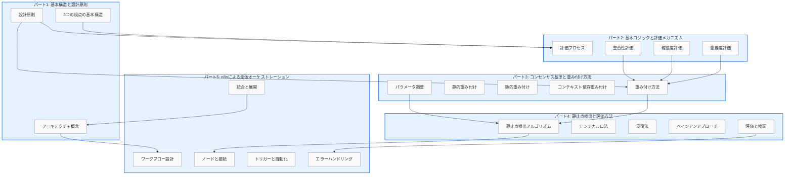

# パート1とパート2～5の関連性明示セクション

## 9. コンセンサスモデルの全体像と各パートの連携

コンセンサスモデルは、複数の視点からの情報を統合して意思決定を支援する複雑なシステムです。本書では、このモデルを5つのパートに分けて段階的に解説してきました。本セクションでは、パート1で説明した基本構造と設計原則が、パート2～5でどのように展開され、実装されているかを明らかにします。これにより、コンセンサスモデルの全体像と各パート間の有機的な連携を理解することができます。

### 9.1 パート1からパート2への展開：基本構造から評価メカニズムへ

パート1では、コンセンサスモデルの基本構造として、テクノロジー視点、マーケット視点、ビジネス視点という3つの視点を導入しました。これらの視点は、パート2「基本ロジックと評価メカニズム」において、具体的な評価プロセスとして実装されています。

**基本構造の評価プロセスへの変換**

パート1で定義した3つの視点は、パート2では以下のように評価メカニズムに変換されています：

1. **テクノロジー視点の評価メカニズム**：
   - パート1で定義した「技術的実現可能性」「技術的成熟度」「技術的優位性」などの評価軸が、パート2では具体的な評価指標と計算式に変換されています。
   - 例えば、技術的成熟度は、TRL（技術成熟度レベル）スケールや特許分析に基づく定量的指標として実装されています。

2. **マーケット視点の評価メカニズム**：
   - パート1で定義した「市場規模」「成長性」「競合状況」などの評価軸が、パート2では市場データに基づく具体的な評価方法として展開されています。
   - 例えば、市場成長性は、CAGR（年間複合成長率）や市場浸透率の時系列分析として実装されています。

3. **ビジネス視点の評価メカニズム**：
   - パート1で定義した「収益性」「戦略的適合性」「リソース要件」などの評価軸が、パート2ではビジネスメトリクスに基づく評価方法として具体化されています。
   - 例えば、戦略的適合性は、企業のコアコンピタンスとの整合性や長期戦略目標への貢献度として評価されています。

**設計原則の評価プロセスへの反映**

パート1で提示した設計原則は、パート2の評価メカニズムに以下のように反映されています：

1. **多角的視点の原則**：
   - パート2では、3つの視点それぞれに独立した評価プロセスを設け、最終的にそれらを統合する方法を提供しています。
   - 各視点の評価結果は、重要度スコアと確信度スコアという2つの次元で表現され、多角的な評価を可能にしています。

2. **適応性と柔軟性の原則**：
   - パート2では、評価パラメータを動的に調整できる仕組みを導入し、異なるコンテキストや時間経過に応じた評価の適応を可能にしています。
   - 例えば、業界特性や技術分野に応じて評価指標の重み付けを調整する方法が提供されています。

3. **透明性と説明可能性の原則**：
   - パート2では、各評価ステップの論理と計算過程を明示的に定義し、評価結果の根拠を追跡可能にしています。
   - 評価プロセス全体のフロー図や、重要度・確信度・整合性の計算フローが視覚的に表現されています。

### 9.2 パート1からパート3への展開：設計原則からコンセンサス基準と重み付け方法へ

パート1で提示した設計原則と基本構造は、パート3「コンセンサス基準と重み付け方法」において、より具体的な実装方法として展開されています。

**設計原則の重み付け方法への反映**

パート1の設計原則は、パート3の重み付け方法に以下のように反映されています：

1. **バランスと統合の原則**：
   - パート3では、異なる視点からの評価結果を統合するための重み付け方法が詳細に説明されています。
   - 静的重み付け、動的重み付け、コンテキスト依存重み付けという3つのアプローチが提供され、状況に応じた最適な統合方法を選択できるようになっています。

2. **継続的学習と改善の原則**：
   - パート3では、過去の評価結果とその精度に基づいて重み付けを自動調整する方法が導入されています。
   - フィードバックループを通じて、モデルの精度を継続的に向上させる仕組みが実装されています。

3. **コンテキスト認識の原則**：
   - パート3では、業界特性、技術分野、市場状況などのコンテキスト要因に基づいて重み付けを調整する方法が提供されています。
   - 例えば、技術革新が急速な業界ではテクノロジー視点の重みを高く、市場競争が激しい業界ではマーケット視点の重みを高く設定するといった調整が可能です。

**基本構造のコンセンサス基準への展開**

パート1で定義した基本構造は、パート3では以下のようにコンセンサス基準として具体化されています：

1. **視点間の整合性基準**：
   - 3つの視点からの評価結果の一致度を測定する方法が提供されています。
   - 不一致が検出された場合の調査と解決のプロセスが定義されています。

2. **信頼性と確信度基準**：
   - 各視点の評価結果の確信度を考慮したコンセンサス形成方法が説明されています。
   - 確信度の低い評価結果は、コンセンサス形成において低い影響力を持つように設計されています。

3. **時間的安定性基準**：
   - 評価結果の時間的変動を分析し、一時的な変動とトレンド変化を区別する方法が提供されています。
   - 安定したコンセンサスを形成するための時間窓設定と変動許容範囲が定義されています。

### 9.3 パート1からパート4への展開：基本構造から静止点検出と評価方法へ

パート1で提示した基本構造と設計原則は、パート4「静止点検出と評価方法」において、意思決定のための具体的な方法論として展開されています。

**基本構造の静止点検出への応用**

パート1の基本構造は、パート4では以下のように静止点検出プロセスに応用されています：

1. **3視点の統合と静止点**：
   - テクノロジー、マーケット、ビジネスの3視点からの評価が収束する点を「静止点」として定義し、それを意思決定の基盤としています。
   - 各視点の評価結果を3次元空間にマッピングし、その中での安定領域を特定する方法が提供されています。

2. **視点間の相互作用と静止点の安定性**：
   - 3つの視点間の相互作用が静止点の形成と安定性にどのように影響するかが分析されています。
   - 例えば、テクノロジー視点とマーケット視点の強い相互作用が特定の静止点を強化する場合や、ビジネス視点との不整合が静止点を不安定化させる場合などが説明されています。

**設計原則の評価方法への反映**

パート1の設計原則は、パート4の評価方法に以下のように反映されています：

1. **堅牢性と信頼性の原則**：
   - パート4では、静止点の安定性と信頼性を評価するための複数のアルゴリズム（反復法、モンテカルロシミュレーション、ベイジアンアプローチ）が提供されています。
   - これらのアルゴリズムは、ノイズや不確実性に対する静止点の堅牢性を検証するために使用されます。

2. **実用性と実装可能性の原則**：
   - パート4では、理論的に正確な方法だけでなく、計算効率と実装の容易さを考慮した実用的なアルゴリズムも提供されています。
   - 例えば、完全な収束を待つのではなく、許容範囲内の近似解を効率的に求める方法が説明されています。

3. **検証と評価の原則**：
   - パート4では、静止点検出結果の評価基準と検証方法が詳細に定義されています。
   - 過去のケースや既知の結果との比較、異なるアルゴリズム間の結果比較、感度分析などの検証アプローチが提供されています。

### 9.4 パート1からパート5への展開：全体構造からn8nによるオーケストレーションへ

パート1で提示した基本構造と設計原則は、パート5「n8nによる全体オーケストレーション」において、実際のシステム実装とワークフロー管理として具体化されています。

**基本構造のシステムアーキテクチャへの変換**

パート1の基本構造は、パート5では以下のようにシステムアーキテクチャとして実装されています：

1. **コンポーネント構成**：
   - パート1で定義した3つの視点と評価プロセスは、パート5では6つの主要コンポーネント（データ収集、分析、評価、統合、出力、管理）として実装されています。
   - 各コンポーネントは独立したモジュールとして設計されながらも、n8nワークフローによって有機的に連携しています。

2. **データフローと処理フロー**：
   - パート1で概念的に説明したデータの流れは、パート5ではn8nノード間の具体的な接続として実装されています。
   - 例えば、データ収集から分析、評価、統合、出力までの一連のフローが、n8nワークフローとして視覚的に表現されています。

**設計原則のn8n実装への反映**

パート1の設計原則は、パート5のn8n実装に以下のように反映されています：

1. **モジュール性と拡張性の原則**：
   - パート5では、各機能を独立したn8nワークフローとして実装し、それらを連携させる方法が提供されています。
   - 新しい視点や評価方法を追加する際に、既存のワークフローを変更せずに新しいワークフローを追加できる拡張性の高い設計が採用されています。

2. **自動化と効率性の原則**：
   - パート5では、データ収集から結果出力までの一連のプロセスをn8nで自動化する方法が詳細に説明されています。
   - スケジュール実行、イベントトリガー、条件分岐などのn8n機能を活用して、効率的なワークフロー実行を実現しています。

3. **エラー処理と回復力の原則**：
   - パート5では、n8nのエラーハンドリング機能を活用した堅牢なワークフロー設計が提供されています。
   - 例えば、データ収集エラーの検出と代替データソースへの切り替え、処理タイムアウトの管理、結果の整合性チェックなどが実装されています。

### 9.5 パート間の連携：統合的なコンセンサスモデルの実現

5つのパートは独立した知識体系を提供しながらも、全体として一貫したコンセンサスモデルを形成しています。各パート間の主要な連携ポイントは以下の通りです：

**パート1とパート2の連携**：
- パート1の基本構造と設計原則が、パート2の評価メカニズムの基盤となっています。
- パート2の評価プロセスは、パート1で定義された3つの視点の具体的な実装方法を提供しています。

**パート2とパート3の連携**：
- パート2の評価結果（重要度と確信度）が、パート3の重み付けプロセスの入力となっています。
- パート3の重み付け方法は、パート2で生成された評価結果を統合するための具体的な方法を提供しています。

**パート3とパート4の連携**：
- パート3の重み付けされた評価結果が、パート4の静止点検出プロセスの入力となっています。
- パート4の静止点検出アルゴリズムは、パート3で統合された評価結果から安定した意思決定ポイントを特定します。

**パート4とパート5の連携**：
- パート4の静止点検出と評価方法が、パート5のn8nワークフローとして実装されています。
- パート5のオーケストレーション機能は、パート4で定義された評価プロセスを自動化し、実用的なシステムとして機能させます。

**パート5とパート1の連携（循環的構造）**：
- パート5の実装は、パート1で定義された基本構造と設計原則に立ち返り、それらを実際のシステムとして具現化しています。
- パート5の実装経験からのフィードバックは、パート1の設計原則の検証と改善に貢献します。

この循環的な連携構造により、コンセンサスモデルは理論と実践の両面から継続的に発展し、より堅牢で効果的なシステムへと進化していきます。

### 9.6 実装の全体像：パート1からパート5までの統合的視点

コンセンサスモデルの実装は、パート1からパート5までの知識を統合することで完成します。以下の図は、各パートの主要概念とそれらの関連性を示しています：

**図1: コンセンサスモデル実装の全体像と各パートの関連性**

この図は、パート1からパート5までの主要概念とそれらの関連性を示しています。パート1の基本構造と設計原則が土台となり、パート2の評価メカニズム、パート3の重み付け方法、パート4の静止点検出、パート5のオーケストレーションへと展開されていく流れが視覚化されています。また、パート5から再びパート1へのフィードバックループも示されており、コンセンサスモデルの継続的な進化を表現しています。

### 9.7 実装ステップの全体像：パート間の連携を考慮した実装アプローチ

コンセンサスモデルを実際に実装する際には、各パートの知識を段階的に適用していくことが効果的です。以下に、パート間の連携を考慮した実装ステップの全体像を示します：

**ステップ1: 基本構造の設計（パート1）**
- 3つの視点（テクノロジー、マーケット、ビジネス）の定義と範囲の明確化
- 設計原則に基づくシステム要件の策定
- 全体アーキテクチャの概念設計

**ステップ2: 評価メカニズムの実装（パート2）**
- 各視点の評価指標と計算方法の実装
- 重要度・確信度評価ロジックの開発
- 整合性評価プロセスの構築

**ステップ3: 重み付け方法の実装（パート3）**
- 静的重み付け、動的重み付け、コンテキスト依存重み付けの実装
- パラメータ調整メカニズムの開発
- 重み付け結果の検証と最適化

**ステップ4: 静止点検出の実装（パート4）**
- 選択した静止点検出アルゴリズムの実装
- 検出結果の評価と検証方法の構築
- 代替アルゴリズムとの比較検証

**ステップ5: n8nによるオーケストレーション（パート5）**
- 各コンポーネントのn8nワークフロー実装
- コンポーネント間の連携設定
- 自動化とエラーハンドリングの構築
- 全体システムの統合とテスト

**ステップ6: 継続的改善（全パート）**
- 実運用データに基づくパラメータ調整（パート3）
- アルゴリズムの精度向上（パート4）
- ワークフロー最適化（パート5）
- 必要に応じた基本構造の見直し（パート1）

この段階的アプローチにより、コンセンサスモデルの複雑さを管理しながら、効率的かつ効果的な実装を実現することができます。各ステップでは、前のステップの成果を基盤としながらも、後のステップのニーズを先取りした設計を心がけることが重要です。

### 9.8 まとめ：パート間の有機的連携がもたらす価値

コンセンサスモデルの5つのパートは、それぞれが独立した知識領域を提供しながらも、有機的に連携することで大きな価値を生み出します。

**理論と実践の橋渡し**：
- パート1とパート2は理論的基盤を提供し、パート3とパート4はアルゴリズムと方法論を提供し、パート5は実装と運用の知識を提供します。
- これらが連携することで、抽象的な概念から具体的な実装までの一貫したパスが形成されます。

**多角的視点の統合**：
- パート1で導入された3つの視点（テクノロジー、マーケット、ビジネス）は、パート2～5を通じて評価、重み付け、統合、実装の各段階で一貫して維持されています。
- この多角的アプローチにより、単一視点では見落とされがちな重要な洞察や関連性を捉えることができます。

**柔軟性と適応性**：
- パート1の設計原則からパート5の実装まで、柔軟性と適応性が一貫して重視されています。
- これにより、コンセンサスモデルは様々な業界、技術分野、市場状況に適応可能な汎用的なフレームワークとなっています。

**継続的進化の基盤**：
- 5つのパートの循環的な連携構造は、コンセンサスモデルの継続的な進化を支える基盤となっています。
- 実装経験からのフィードバックが設計原則に反映され、改良された設計原則が新たな実装を導くという好循環が生まれます。

コンセンサスモデルの真の価値は、個々のパートの知識だけでなく、それらの有機的な連携から生まれる相乗効果にあります。この連携を理解し活用することで、複雑な意思決定問題に対する堅牢で効果的なソリューションを構築することができます。

---

> **📝 注記**: このセクションは、コンセンサスモデルの全体像を理解するための補助的な内容です。各パートの詳細については、それぞれのドキュメントを参照してください。また、実際の実装においては、各パートの知識を状況に応じて柔軟に適用することが重要です。
